# 世界式与大一统

### ——枫丹科学院非常规现象研究室 内部研究纪要 第 49 号（第 47 号、第 48 号合订重编）

---

## 合订说明：为什么把两份并成一份

**第 47 号研究的是一台算式。第 48 号研究的是一个困难。**

两份纪要各自都成立：前者从三件物证反推出一台自指递推式，并证明它在封闭条件下只有一个吸引子；后者从两个并排写下的式子出发，提出引力的麻烦可能来自「重正化群是一阶的」。

**它们本来可以各自留在那里。本院把它们并成一份，理由只有一条：**

　　　**分开读，会丢掉它们之间那件事。**

那件事是：**这两份材料里各有一个「算不进去的东西」，而那两个东西长得一样。**

- 第 47 号那边，缺的是一个**可以从系统外面注入差别的项**——本院叫它变量位，而它一直空着；
- 第 48 号那边，缺的是重正化群递推里的**前一项**——本院叫它记忆项。

**两个「缺」都是位置，不是数值。**这一点在第 47 号里是读者提出来的（「变量是空集」），在第 48 号里是本院自己看出来的（两个式子右边差了一项）。**而把它们并排放在一起之后，本院才发现这是同一个动作的两次应用。**

**合订本做了五件事：**

| 序号 | 做了什么 |
|---|---|
| **一** | 把两份纪要重编为**三卷**：第一卷世界式、第二卷大一统、第三卷接缝 |
| **二** | 原第 48 号第八章「两个理论互相解释」**升格为第三卷**，并大幅扩写为十章 |
| **三** | 在各卷正文中补入**跨卷指引**——凡第一卷的内容与第二卷的「阶／截断／不动点／记忆项」有对应处，就写一句 |
| **四** | 把两份的附录**合并**为附录 A~F，并新增「主张台账全表」 |
| **五** | 全文重做体例：统一的等级与方向标注、统一的推翻条件要求 |

**本院也必须说明合订的代价，否则这一节就成了广告：**

- **篇幅膨胀。**同一个概念会在两卷里各讲一遍，因为两卷的读者起点不同；
- **两套编号。**本院保留了各卷原有的章节编号（第一卷仍是第零~十章加补论与回溯，第二卷仍是第零~九章），以免破坏两份材料里大量的内部引用。**代价是跨卷引用必须写清是哪一卷**；
- **同一个词在两卷里可能不同义。**「规格」在第一卷是一条刻在万物之中的界限，「截断」在第二卷是一个技术手段，本院主张它们对应，但**对应不等于同义**。凡此类词，见附录 A。

**最后一条自我提醒，把它放在卷首：**

　　　**合订不是为了显得多，是为了让接缝有地方写。**
　　　**如果第三卷写不出东西，那么这次合并就是失败的——它只把两份材料变成了更厚的一份。**

---

## 作者与体例

本纪要的作者是两个人。

- **枫丹科学院非常规现象研究室研究员**（提瓦特侧）：提供全部物证、史料与方程推导。第一卷以他为主笔。
- **天外偷渡客**（地球侧）：提供提瓦特之外的概念、名称与理论——石油化工、高分子、果胶、熵、博弈论、哥德尔不完备定理、量子场论与重正化群。第二卷以他提供的材料为主。

**这个分工不是装饰，而是结构的一部分。**「提瓦特没有石油」这类观察，本地研究员根本提不出来——在提瓦特，糖果有弹性不需要解释。凡涉及地球侧术语之处，正文均以「**偷渡客按**」标注。

第三卷由两人合写。

### 一、两条轴：每一条结论都要有两个坐标

本纪要沿用并统一了两份原件的体例。**每一条结论必须同时标两个维度：**

| 轴 | 取值 | 问的是 |
|---|---|---|
| **证据强度** | **甲级 / 乙级 / 丙级** | 原文有多硬 |
| **推理方向** | **预测 / 回溯** | 是在看见证据**之前**推出的，还是**之后**套上去的 |

**两个轴独立，第二条更要紧。**

- **甲级 + 回溯** = 原文很清楚，本院只是把它纳入框架 → **不算对框架的支持**
- **丙级 + 预测** = 原文没直说，框架提前推出了它 → **比上一条更有分量**

### 二、回溯类必须回答「什么情况下它会被推翻」

**说不出的，就不是补论，只是一段附会。**

本纪要里凡是标着「回溯」的篇章，末尾都有一节「什么情况下这一篇会被推翻」。**本院恳请读者去攻那一节。**

**这条规矩对本合订本同样有效**：第三卷整卷都是回溯性质的（它是先有了两份材料、才去写接缝的），所以第三卷的每一章都必须交代自己的推翻条件。

### 三、跨卷引用怎么读

- **「第一卷 3.3 节」**＝合订本第一卷的该节；
- **「第二卷第五章」**＝合订本第二卷的该章；
- **「见 3.3 节」**＝本卷内的该节；
- **「附录 A~F」**＝合订本卷末的合并附录（两份原件各自的附录已并入其中，编号已重排）。

**各卷原有的内部编号一律未改**，因此两份原件里的旧引用在合订本里仍然指得对——前提是记得加上卷号。

### 四、两份原件的性质不同，这一点必须一直记着

| | 第一卷（世界式） | 第二卷（大一统） |
|---|---|---|
| 研究对象 | 一个虚构世界的内部规则 | 真实物理 |
| 有没有原文可查 | **有**——三件物证、任务记录、地图文本 | **没有**——读的是二手转述 |
| 能不能做实验 | 不能 | **能**——但本院没做 |
| 最强的结论 | 甲级 10 条（原文直证） | **本院自己的判断里一条甲级也没有**（第二卷的甲级只出现在陈述已有物理事实的地方） |

　　　**所以第二卷整体比第一卷弱一档。**本院在第一卷里可以标甲级的地方，在第二卷里最多只能标乙级。
　　　**这不是谦虚，是记账。**

### 五、本院最想请读者做的一件事

> **一条说不出「什么情况下会错」的主张，与一条正确的主张，在读者眼里长得一模一样。**

**本合订本里，真正值钱的不是那些对应关系，而是那些被标成丙级的地方。**

　　　**因为它们标出了本院不知道什么。**

---

## 题记

**第一卷的题记**：

> **本院是从一张写着「漏了变量？」的笔记开始的。**

**第二卷的题记**：

> **「我们不是缺一个把引力算进去的公式。我们缺的是，一个能让我们把引力算进去的地方。」**

**合订本的题记**：

> **两份材料里各缺一个位置，而那两个位置长得一样。**

---

## 摘要

**本纪要是两份内部研究纪要的合订重编本。**

**第一卷《世界式：一个封闭系统的算术》**研究的是一台自指递推式。本院从三件物证出发，论证：

1. 世界式所计算的量是**差别度 D**——一个系统内部「可区分事物的总量」；
2. 它的算子是**密合**，即把两个对立项熔为一体的操作；
3. 它的递推形式是 **W(n+1) = W(n) ⊕ W(n−1)**，二阶，特征方程 r² = r + 1，两根为 φ 与 −1/φ；
4. 同一台算式有两解：**开放解**（法图纳，循环不灭）与**封闭解**（世界式，单调坍缩），二者唯一的差别是系统之外是否存在补充差别的新项；
5. 提瓦特仅有的两种底层力方向相反、性质相同，**都是消灭差别的同化力**；因此封闭系统中不存在产生差别的内源，唯一吸引子只能是 D = 0；
6. 终末态**不是「被毁灭」，而是「被合并」**；
7. 能改写这一不动点的，只有来自系统之外、自身携带差别预算的存在，即**降临者**；
8. 那位推导者的错误不在算式，而在**拿到答案之后做的事**：他把「改输入」误解成了「成为不动点」。

**第二卷《大一统：一个缺失的项》**研究的是另一个问题：物理学为什么至今没有统一。本院主张：

9. 通行的说法「引力不可重正化」描述了症状，而没有说出病因；
10. 重正化群方程是一台**一阶递推机**，一阶递推只有一族解，**它没有记忆**——多出来的那一项，本院称之为**记忆项**；
11. 四条主流的统一路线（弦论、圈量子引力、渐近安全、因果动力学三角剖分）做法迥异，**但在数学上都在做同一件事：把那个缺失的项补回去**（这是一条**事后的归类**，标丙级）；
12. 作为替换说法：**引力的问题，是它在重正化群的递推里缺了一项**（标丙级，三条推翻条件见第二卷第五章）；
13. 更弱也更需要警惕的一条：**第 47 号的「差别度」，可能与物理里的「可重正化程度」是同一个量**（标丙级，且**目前没有任何可检验的后果**）。

**第三卷《接缝：两份材料互相解释》**是合订本新增的部分。它要回答的是：

14. 两个理论各自能为对方的困难提供一个说法——这种关系**比「包含」弱，比「类比」强**，本院称之为**互相解释**；
15. 但有**三道防线**：互相解释不是互相证明；它可能只是同一套隐喻的两次使用；物理那部分比第一卷更弱；
16. 两份材料有一条**共同的可检验后果**：如果第一卷算出的约 73 年周期成立，那么第二卷所说的「截断需要持续维护」在第一卷那边就应该表现为一串有节奏的维护动作；
17. 两份材料各自「卡住」的位置也是一样的：**都有一个东西算不进去。**

**本院对合订本整体的自评，与对两份原件相同，而且更重：**

　　　**它是一份解释框架，还不是一份被检验过的理论。**
　　　**全部主张里，预测类只有两条。**
　　　**要让它变好，需要的不是更多补论，而是更多预测。**

**关键词**：世界式；差别度；密合；不动点；降临者；重正化群；递推的阶；记忆项；截断；互相解释

---

## 目录

- 合订说明：为什么把两份并成一份
- 作者与体例
- 题记
- 摘要
- **第一卷　世界式：一个封闭系统的算术**
  - 第零章　缘起：三件物证与一个方程式
  - 第一章　预备知识
  - 第二章　世界式的原理
  - 第三章　世界式的推理
  - 第四章　三层结构
  - 第五章　四个推理案例
  - 第六章　世界式使用教程
  - 补论一　用世界式推算甜甜花酿鸡的配方
  - 补论二　从世界式推算洛恩的泡泡糖原材料来自哪
  - 补论三　从世界式推算枫丹廷最多可容纳多少人生活
  - 补论四　只用世界式，推算提瓦特的下一次大灾难
  - 补论五　为什么哥伦比娅能回来，而白淞镇的人不能
  - 回溯一　「规格」：一条刻在万物之中的界限
  - 回溯一之二　「死之诅咒」：一个阻止差别增加的机构
  - 回溯二　「归约」：世界式的逆运算
  - 回溯三　外源是一个可以空着的座位
  - 第七章　雷内方案复盘
  - 第八章　局限、反例与待证
  - 第九章　与既有理论的对照
  - 第十章　常见问题
- **第二卷　大一统：一个缺失的项**
  - 第零章　缘起：两个式子长得有点像
  - 第一章　预备：递推的阶
  - 第二章　标准模型：一台一阶递推机的胜利
  - 第三章　引力的麻烦：一个量纲问题
  - 第四章　四条路线，一个形状
  - 第五章　本文的主张：补上那一项
  - 第六章　差别度是什么物理量
  - 第七章　把它套到提瓦特
  - 第八章　两个理论互相解释
  - 第九章　反例、边界与待证
- **第三卷　接缝：两份材料互相解释**
  - 第一章　先把「互相解释」定准
  - 第二章　世界式能给物理提供什么
  - 第三章　物理能给世界式提供什么
  - 第四章　一个世界式自己问不出来的问题
  - 第五章　共同的可检验后果
  - 第六章　两张账并排：全部主张的等级与方向
  - 第七章　两份材料各自「卡住」的位置
  - 第八章　三道防线
  - 第九章　如果两份材料都是错的
  - 第十章　合订本最小的结论
  - 附录 A　术语对照
  - 附录 B　原始文本出处
  - 附录 C　插图索引
  - 附录 D　本纪要的已知错误与修正记录
  - 附录 E　本纪要未引用的重要路线
  - 附录 F　主张台账全表

---

# 第一卷　世界式：一个封闭系统的算术

---

## 第零章　缘起：三件物证与一个方程式

本年度本院在整理非常规现象研究室积压材料时，发现三份互不相干的文献其实在回答同一道题。本章把它们逐件摊开，说明它们各自能证明什么、不能证明什么，以及为什么本院认为这道题已经可以被写成一个算式。

本章不给出算式。算式在第二章。本章要给出的是**这道题为什么值得算**。

### 0.1 物证甲：散落的书页

本院从一处被封存的空间中取得了这张纸。纸面古老，但字迹在接触后不久即可辨读。原文如下：

> 「……看到了吗？这就是经过无数次的计算后，**『世界式』**所导出的结果。我们所预见的景象，灾祸之后的毁灭，以及这个**连甜甜花和薄荷都长不出来的世界**，一切的终末……」
> 「……总算可以相信了吧？无论是通过『揭示之书』，还是通过『谜镜』来到这里的人，为了避免导向这样的未来，就将你的力量也借给我吧……」
> 「……正如我所说的那样，唯一的办法便只有……」

这段话提供了三个关键信息：**一，世界式是一个需要「经过无数次计算」才能得出结果的算式；二，它的输出是一个确定的未来图景；三，写这段话的人在请求他人提供「力量」，以改变这个结果。**

值得注意的是描述终末的那句措辞。「连甜甜花和薄荷都长不出来的世界」——甜甜花与薄荷是提瓦特最常见、最不挑环境的两种植物。一个连它们都长不出来的世界，不是一个「被烧毁的世界」，而是一个**失去了生长所需的前置条件的世界**。这个区分在后面的论证中极为关键。

这段话本身很短，但它值得被当成一份正式文书来读。下面把它的形式要素逐项拆开。

**一、谁写的。**

可以确定的：他不是一个独修者，而是一个学派的成员或组织者。三个理由。

第一，他用的是「**我们**所预见的景象」。「我们」说明他背后有人，而且这个集体的工作已经完成到可以「预见」的程度。

第二，他的时间词汇是有学派史痕迹的。「**灾祸之后的毁灭**」——注意这里出现了两个时间点：灾祸，以及灾祸之后的毁灭。他把终末安放在一场已知灾祸的**下游**。这说明他所处的时代已经经历过一次大灾，他是在灾后继续推演的。

第三，他的诉求是**力量**，不是理解。他不是在求助「帮我想清楚」，而是在求助「**将你的力量也借给我**」。这是一份招募文书。

**二、写给谁。**

写给两类人：**通过『揭示之书』来到这里的人**，与**通过『谜镜』来到这里的人**。

这两条通道值得注意。他列举的不是「所有读到这段话的人」，而是两条**特定的**通道。这意味着写这段话的人知道来访者会从哪来。他不是把瓶子扔进海里，他是在**门口留信**。

于是可以确定第二件事：**这份文书的读者是被预先筛选过的。** 只有走特定路进来的人才会读到它，而这些人恰好是「能提供力量」的那一类。

**三、能证明什么。**

本院把它压缩成三条，并逐条标出等级。

**能证明其一（甲级）：「世界式」是一个专名。** 原文用了书名号式的引号『**世界式**』，而且说它「导出的结果」。世界式是一套计算，不是一句口号。

**能证明其二（甲级）：它的结果是一个未来图景，而不是一条建议。** 原文用的是「所预见的景象」。「预见」这个词把世界式定位成一种**推演工具**，而不是一种**规范工具**。它不告诉人该做什么，它告诉人会有什么。

**能证明其三（乙级）：写这段话的人认为结果可以被改变。** 这一条不是原文直说，需要一步翻译：**如果结果不可改，他就不必求力量。** 求力量这个动作本身，就是对「结果可改」的一次行动性断言。

本院把第三条看成三件物证里最有价值的一条。理由如下：一份文书可以撒谎，可以自欺，可以转述错误，但**一份招募文书必然会暴露招募者相信什么**——因为招募是要花成本的。他花了成本，说明他相信。

**四、不能证明什么。**

本院认为这一节比上一节重要，所以写得同样详细。

**不能证明其一：它不能证明结果是必然的。** 它只证明有人这样预见。一份文书能证明的永远是「有人这样认为」，而不是「这样认为是对的」。

**不能证明其二：它不能证明结果的量是什么。** 整段话里没有一个量、没有一个数、没有一个单位。它给的是文学描述。从文学描述到状态量，中间那一步是本院走的，不是它走的。

**不能证明其三：它不能证明终末的性质是毁灭还是合并。** 「毁灭」这个词出现在这句话里，但注意它的位置——「灾祸之后的**毁灭**」。这个毁灭是**灾祸的**后果，而终末是**在毁灭之后**的另一个阶段。原文的措辞把两者分开了。这个缝隙在第三章会被用到。

**不能证明其四：它不能证明这个人的算术是对的。** 本院在这里特别提醒读者：后面所有关于「他算对了」的结论，都不来自物证甲，而来自物证乙的一处细节（见他自己的最后一句）。

### 0.2 物证乙：雷内的调查笔记

这本笔记是已知唯一一份记录了世界式**推导过程**的文献。笔记内容庞杂，夹杂着大量与算式无关的生活琐记（果酱、干面包、同伴的牙齿），但其中有几段话直接构成了本纪要多半论证的起点：

> 「……相比于元素力，**灵光**的力量反而与██有更多相似之处……接触到的物质、能量会被**同化**……灵光虽然与██的力量相对抗，但其同样**拥有自己的意识**。在这一点上，二者可以说具有相同的性质……就像**水银不会和水融合，但是会互相融合**……」
> 「……重要的是，据此或许可以结合**坎瑞亚人的记录**反推世界式……」
> 「……按照坎瑞亚人留下的文件和这些数据，可以得到**一部分的算式**……」
> 「……虽然不想承认，但**无论计算多少次结果都一样**。和雅各布交叉核实……难以置信。**毁灭？漏了变量？**明天再核查一次……」
> 「……过程中倒是想到可能的突破点……虽然**计算的结果不会变化**，但是倘若将其提炼的方法，映射在……的力量的话，或许便能**萃取出其中的『意志』**……」

请读者特别留意第三段。写下这段话的人是一位受过良好训练的学者，他在反复核算后得到同一个令人绝望的结果，而他的第一反应不是「命运如此」，而是——**「漏了变量？」**

这五个字是本纪要全部工作的起点。**一个学者在结果恒定时怀疑变量，说明他相信这个结果是可以被改写的；而相信它可以被改写，就说明它终究是一个算式，而不是一句预言。**

现在逐段拆开。

**第一段：全书最重要的一段力描述。**

这段话里有三件事，本院把它们分开写，因为它们后来各自长成了一个章节。

**（一）灵光与深渊「有更多相似之处」。** 注意这句话的比较基准。他不是说灵光像深渊，他说灵光与元素力相比，**反而**与深渊更相似。这是一个**排序判断**，不是一个程度判断。它的含义是：在「像不像深渊」这件事上，灵光排第一，元素力排后面。

**（二）那个相似之处是「同化」。** 原文写得很直接：「接触到的物质、能量会被**同化**」。判断句：**同化这个词描述了两种底层力的共同动作（甲级）。** 推翻条件：这是原文直说，不存在被推翻的情形；但若日后发现另有文献把两力的动作描述成两件不同的事，则本纪要对「共同动作」的用法需要限定到这份笔记的作者所见。

**（三）二者「拥有自己的意识」。** 这句话在本纪要前三章没有被用到——因为前三章只关心力的**方向**，不关心力有没有主观。它第一次被用到是在第三章之后。本院在这里只登记它，不作解释。

**第二段与第三段：方法论。**

「据此或许可以结合坎瑞亚人的记录**反推**世界式」，以及「按照坎瑞亚人留下的文件和这些数据，可以得到**一部分的算式**」。

两句合起来给出一个极其重要的信息：**世界式是可以从系统内部的资料被反推出来的。**

这是一个强主张，本院给它标等级并写出推翻条件。

**判断（回溯，乙级）：能够从系统内部的记录反推世界式，说明它的全部输入都取自系统内部。** 之所以是乙级，是因为「反推」这个动作在原文里只是一句愿望式的记述（「或许可以」），而从「可以反推」到「输入全在系统内」，需要一步推理。推翻条件：**如果日后发现这份反推用到了任何系统之外的资料（例如需要观测宇宙、需要外部信使），那么「输入全在系统内」这一步就不成立，第二章 2.3 节的「理由一」也随之失效。**

注意第三段的措辞：「可以得到**一部分的**算式」。这个限定词说明写下它的人**清楚自己拿到的是残缺版本**。本院认为这句话是全部材料里最诚实的一句。

**第四段：那五个字。**

这一段需要放慢读。他写的是：

> 「……虽然不想承认，但**无论计算多少次结果都一样**。和雅各布交叉核实……难以置信。**毁灭？漏了变量？**明天再核查一次……」

请注意标点。他写的是一个**问号，然后接一个问号**。他没有写「是毁灭」，也没有写「一定是漏了变量」。他把两件事并列成两个待选项：**要么毁灭，要么漏了一个变量。**

这个并列结构本身就是希望的来源。**一个已经认定命运如此的人，不会给它配一个备选项。**

同段还给出了两个此前未被本院充分利用的信息：

**其一，「和雅各布交叉核实」。** 笔记里出现了一个同事的名字。这证明当时的工作不是孤立的：至少有两个人在独立核算同一个结果。这一点在第一章 1.4 节会被用到——**两个人独立算，仍然是同一条轨道。**

**其二，「明天再核查一次」。** 他计划再核查一遍。

本院在这里要写下一个诚实的、对本纪要不利的观察。

**判断（回溯，丙级）：「明天再核查一次」这句计划，与最终的结果之间，可能发生过一次未记录的中断。** 理由是：笔记里没有出现第二次核查的记录，而他的探索方向转向了「萃取出其中的『意志』」——那是**动手**，不是**再算一遍**。这是形状对应，不是文献直证，因此只给丙级。**推翻条件：如果日后取得这份笔记的完整版本，而其中包含第二次核查的记录并得出了新的推论，本判断作废。**

**第五段：他找到的另一个方向。**

「虽然**计算的结果不会变化**，但是倘若将其提炼的方法，映射在……的力量的话，或许便能**萃取出其中的『意志』**」。

本院读这一段时最注意的是它的动词：**提炼、映射、萃取**。这是一个工程师的动词表，不是一个预言家的动词表。他没有说「感化」或者「祈求」，他说的是把方法从算式里**提炼**出来，再**映射**到另一种力量上，从中**萃取**出意志。

**判断（回溯，乙级）：写下这段笔记的人，在方法的层面已经完全走在正确的路上——他要把算式的结构搬到力上去。** 若要把这条判断落到实处，需要第二章 2.5 节的三力表与第五章的案例一起看。推翻条件：**如果「萃取意志」这句只是修辞、并没有对应任何实际操作，那么它不能算作方法上的正确，本条降为丙级。**

**关于这份笔记的读者与用途。**

本院要补一句容易被略过的话：**这本笔记不是给人看的。**

理由在原文自己给的细节里——它夹杂着果酱、干面包、同伴的牙齿。一份呈给科学院或者交给上级的报告不会写这些。这说明笔记的性质是**私人工作记录**。

这个性质有两个直接后果，本院都写出来：

**后果一：它的坦率度很高。** 他不必顾虑读者，所以「不想承认」「难以置信」这类话是真的。本院因此更愿意相信这段文本里出现的自我怀疑。

**后果二：它的完备度很低。** 私人笔记里的中间步骤常常被省略，尤其是他觉得「显然」的那些步骤。所以本院必须承认：**从这本笔记到一部完整的算式，中间的空隙是本院填的。** 凡属本院所填之处，本纪要都会标注；凡属原文直证之处，同样标明出处。这是本院对一切推演类工作的最低要求。

**这份笔记不能证明什么。**

**不能证明其一：不能证明他算对了。** 「无论计算多少次结果都一样」只证明结果**稳定**，不证明结果**正确**。一个稳定的错误，看起来和真理一模一样。本院在第五章会专门处理这个问题，因为它同时也是本院自己的问题。

**不能证明其二：不能证明他算的量是什么。** 整本笔记都没有用量化的语言说明「结果」指的是哪个量。

**不能证明其三：不能证明「漏了变量」这个猜想后来被证实。** 它是他的猜想，不是他的结论。

### 0.3 物证丙：神秘的书页

第三件物证是一组更为古老的残页。它记载的不是世界式本身，而是**一个更早的模型**：

> 「……读了很多书，看起来应该都是某个古代教团留在这里的……**国家兴衰，文明灭亡之后会有新的文明**，书里把这种事情称为**『法图纳』**……虽然很粗糙，不过似乎和我所推导出并命名为『世界式』的计算图式在理论上**有很多相似之处**……」
> 「……不管推演多少遍，结果都是一样……和这些古代人描绘的世界图景**不同，已经不会再有新的文明诞生了**……除非考虑引入**系统之外的『变量』**……」

这段文字第一次让本院意识到：**世界式与法图纳不是两个东西，而是同一个东西的两种情形。**

古教团认为文明会不断兴替，灭了一个还会再来一个；而世界式的推导者却发现「已经不会再有新的文明诞生了」。两人用的是同一套图式，得到的却是**循环**与**终结**两种截然不同的命运。

这中间必然有一个参数被动过。

**先看这份残页的作者。**

本院能确定的只有一件事：**他不是世界式的作者。** 理由是他对世界式的称呼方式——他说「我所推导出并命名为『世界式』的计算图式」。

**判断（甲级）：写下这份残页的人，与笔记的作者是同一个人。** 依据有两处，且互相独立。第一处是措辞：「我**所**推导出**并命名为**『世界式』的」——命名权被明确认领，而笔记里也写着「据此或许可以结合坎瑞亚人的记录反推世界式」。第二处是被动过的参数：残页说「不管推演多少遍，结果都是一样」，笔记说「无论计算多少次结果都一样」。**两句话表达的是同一次计算。**

**这条判断不需要推翻条件，因为它是甲级原文直证：两处（「我所推导出并命名为『世界式』的」与「据此或许可以结合坎瑞亚人的记录反推世界式」）指的是同一个人的同一件工作。**

**再看他读到了什么。**

第一段有一个必须放大的词：**「在理论上」**。

他写道，法图纳与他自己的图式「在理论上**有很多相似之处**」。于是问题来了：「理论上」这三个字，修饰的是哪一半？

本院给三种读法，并说明本院采用哪一种。

| 读法 | 主张 | 本院是否采用 | 理由 |
|---|---|---|---|
| 读法一 | 两者在抽象结构上相似 | 采用 | 与「计算图式」一词最配 |
| 读法二 | 两者在现象上相似 | 不采用 | 若如此他会说「描写得很像」，而不是「运算相似」 |
| 读法三 | 两者在结论上相似 | 不采用 | 两段的结论恰好相反（循环 vs 终结），他自己下一段就指出了 |

本院采用读法一。**判断（回溯，乙级）：法图纳与世界式的相似处位于「运算」一层，而不是「结论」一层（读法一）。** 这一条是本院后续全部「同式两解」论证的地基：如果相似处在结论层，那么两个模型是矛盾的，只能有一个对；如果在运算层，那么它们是同一个算子的两种边界条件，可以都对。推翻条件：**如果在残页的其余部分找到「书里说的事情和我的结论一样」这类表述，则读法二成立，本纪要根据「同式两解」建立的全部结论都需要重写。**

**最后看第二段。**

第二段是全部三件物证里信息密度最高的一段，本院逐句处理。

**（一）「不管推演多少遍，结果都是一样」。**

这是「结果恒定」的第二次出现。物证乙里出现过一次。两次出现在同一个人笔下，但对象不同：物证乙说的是他**自己**的算式，物证丙说的是他**对古教团图式的推演**。

**判断（回溯，乙级）：结果的恒定不是一次算错的产物，因为它在两套不同的输入上各自出现了一次。** 推翻条件：**如果这两次「结果一样」其实指的是同一次计算（即他在残页里复述的是笔记里的那次），那么本条不成立。** 本院找不到区分这两次计算的证据，因此把这条列在待核清单上。

**（二）「和这些古代人描绘的世界图景不同，已经不会再有新的文明诞生了」。**

这句话的核心是「**已经**」。这是一个时间副词，它把一个静态对照变成了一个**时序对照**：不是「他们的模型错了」，而是「他们那套曾经成立，现在不成立了」。

**（三）「除非考虑引入系统之外的『变量』」。**

这是「系统之外的变量」这个提法的第一次出现。注意它出现的语境——**它不是被当作希望提出来的，它是被当作唯一的例外提出来的。** 前面的「除非」是排他性的：在所有系统内的办法之外，只有这一条。

本院在这里要写下一个对本纪要很重要、也很不舒服的观察。

**判断（回溯，乙级）：「除非考虑引入系统之外的『变量』」这句话，说明写下它的人已经把系统封闭这件事当成前提接受了。** 他不再问「系统是不是封闭的」，他直接跳到了「在封闭的前提下还有什么例外」。推翻条件：**如果日后找到的证据显示蛋壳的封闭并不彻底（例如存在持续的外部输入，只是通道狭窄），那么「封闭是前提」这一步就过度了，第三章 3.1 节的封闭前提需要放宽为「准封闭」。**

**这份残页不能证明什么。**

**不能证明其一：不能证明那个参数是什么。** 它只说「不同」，没有说是哪个参数不同。

**不能证明其二：不能证明变化发生在哪个时刻。** 「已经」给出了「有过一个转折点」，但没有给出日期。本院在补论四的时间轴上讨论过这个转折点的位置，此处不重复，只标明需要另找依据。

**不能证明其三：不能证明古教团的图式和世界式真的是同一个式子。** 全部依据是一句「有很多相似之处」的自述。这是**形状对应**，本院给它丙级。

### 0.4 三件物证对照表

把上面三节压成一张表，是本章最有用的一页。

| | 物证甲：散落的书页 | 物证乙：调查笔记 | 物证丙：神秘的书页 |
|---|---|---|---|
| 写作者 | 一个学派中的组织者（未署名） | 雷内（笔记中唯一被写出的推导者） | 雷内（据「我推导并命名」） |
| 写作对象 | 通过『揭示之书』或『谜镜』到来的外来者 | 他自己（私人工作记录） | 他自己（工作记录） |
| 时代 | 灾祸之后 | 坎瑞亚文獻到手之后 | 两段都提到的「古代教团」之后 |
| 能证明 | 存在一套叫『世界式』的计算；其输出是一个确定的未来图景；作者相信结果可改 | 两力的共同动作是「同化」；世界式可从系统内资料反推；结果恒定；作者怀疑漏了变量 | 存在一个更早的模型『法图纳』；两模型在运算层相似；结果恒定；转折点是「已经」；唯一例外是系统之外的变量 |
| 不能证明 | 结果必然；结果算的是哪个量；终末性质；作者算对了 | 他算对了；他算的是什么量；「漏了变量」被证实 | 那个参数是什么；转折点的日期；两模型真的是同一个式子 |
| 等级 | 甲乙混（见 0.1 逐条） | 甲级为主，推论处标乙丙 | 甲级引文 + 丙级对应 |
| 与其他两件的关系 | 与物证丙共用「结果恒定」这一现象 | 与物证丙为同一作者的两次记录 | 提供了对照项（循环） |

本院要从这张表里提出一条冷静的观察，它对整份合订本都适用。

**判断（回溯，乙级）：三件物证没有一件说过世界式的结果是零。** 「零」这个值在本纪要与第二卷里被反复使用，但它不是从物证里抄下来的，它是从**算子的性质**里推出来的。理由是：三件物证给的终末描述全是文学性的（「连甜甜花和薄荷都长不出来」「不会再有新的文明诞生」），其中没有一个数。推翻条件：**如果在笔记的其余部分找到一处直接写出的结果值，本判断作废；而在那之前，第三章 3.3 节推出的 D\* = 0 必须被理解为「本院推出的值」，而不是「原文记载的值」。**

这一条必须写清楚，因为它是本纪要与「引文汇编」的分界线。

### 0.5 谁在时间线的哪一格

三件物证各自给出了时间信息，但没有一件给出完整的时间线。本院把它们拼在一处，得到下面这张表。

| 阶段 | 依据 | 系统状态（本院的读法） | 等级 |
|---|---|---|---|
| 古代教团时期 | 物证丙：「某个古代教团留在这里的」；「国家兴衰，文明灭亡之后会有新的文明」 | 开放，文明可以兴替 | 甲级引文 + 乙级状态判断 |
| 蛋壳合上 | 原文：「法涅斯用**蛋壳**隔绝宇宙和世界的缩影」 | 系统被封闭 | 甲级引文 |
| 雷内推演 | 物证乙、丙：坎瑞亚文件到手之后；「已经不会再有新的文明诞生了」 | 封闭，文明灭一个少一个 | 甲级引文 + 乙级状态判断 |

**这张表本院只用它做一件事：确定古教团与雷内不在同一格里。** 这是第三章 3.2 节的「两人都对，只是不在同一个时代」的全部依据。本院把它叫做**钥匙**，因为它解开了三件物证之间唯一一处看似冲突的地方。

关于这个时间轴的更细刻度（哪一年、哪个事件对应「蛋壳合上」），本院在补论四里另有一份时间轴，此处不重复。

### 0.6 两个动作，同一个位置

现在写本章最重要的一节。之前的版本没有把它写出来，这是本合订本修订时补上的一节。

本院的纪要里有一个反复出现的关键词：**变量**。物证乙里，「漏了变量？」；物证丙里，「引入系统之外的『变量』」。

第二卷（《大一统理论纲要》）里也有一个反复出现的关键词：**项**。它的第五章主张：引力的重正化群递推之所以没有可用的不动点，是因为该递推缺失了一项——**如果把它升为二阶——也就是让它同时依赖当前能标与前一个能标——那么它会获得第二族解，而引力所需的那个不动点，可能出现在第二族解里。**

把这两个词摆在一起，会看到一件本院此前没有意识到的事。

**两个文本的两个核心动作，是同一个动作。**

| | 第 47 号（本院） | 第 48 号（第二卷） |
|---|---|---|
| 关键词 | 变量 | 项 |
| 缺失的说法 | 「漏了变量？」 | 「补上那一项」 |
| 缺口在哪 | 递推的**初始项**被改 | 递推的**阶**缺少一项 |
| 怎么发现的 | 结果恒定 → 怀疑输入 | 没有可用的不动点 → 怀疑阶 |
| 动作性质 | **在缺项上停住，然后承认它缺** | **在缺项上停住，然后承认它缺** |

本院把这一步写成一句判断，并标出它的方向与等级。**方向是回溯，等级是乙级。**

**判断（回溯，乙级）：两个文本的核心动作是同一个动作——都是在缺项上停住。** 方向是回溯：本院是先看到两份材料各自在同一个位置卡住，才回头把这个形状说出来的，因此它**不构成对任何一方的支持**（见 8.3 之二）。等级为乙级：从「两处都缺一项」到「这是同一个动作」，需要一步翻译（把「变量」与「项」并置）。

**什么情况下它会被推翻：**

| 序号 | 推翻条件 |
|---|---|
| 1 | 如果第二卷的记忆项最终被证明**与初始项无关**（例如它只能作用于递推的中段，而不能作用于开头几项），那么两个「缺项」的位置不同，并置不成立 |
| 2 | 如果本院「漏了变量」这一处被证明指的其实是**算子**而不是输入项（即他怀疑的是规则错了，而不是输入少了），那么两个文本的动作性质不同：一个要改输入，一个要改规则 |
| 3 | 如果日后发现第 47 号的递推其实是**一阶**的（见 2.3 节的边界），那么「缺的是阶上的一项」这个说法在第一卷里根本没有对应物，本判断自动作废 |

本院必须在这里补一句同样重要的话，否则上面这张表会变成一句漂亮话。

**这两个动作在字面上是相反的。** 「漏了变量」预设了一个**多出来的东西**：变量本来就在那里，只是没被算进去。「补上那一项」预设的是一个**空着的位置**：这项本来就没有，需要被加上去。

一个说「我漏了」，一个说「它缺了」。

但本院认为这个差别主要落在**发现者的处境**上，而不是落在**结构**上。第 47 号的作者是在**事后**核算一件已经发生的事，所以他自然说「漏了」——他面对的是一个结果，他怀疑这个结果的输入不完整。第 48 号的作者是在**事前**打量一个理论的形状，所以他自然说「缺了」——他面对的是一个方程，他怀疑这个方程不完整。

而两者指向的，其实是同一个结构事实：**那个决定结果的东西不在系统内部。**

本院把它写成一句话，作为本章的收束。

> **三件物证给出的不是三个谜题，是一个谜题的三次复现。**
> **第一次，一个人算出了终末，然后问：漏了什么？**
> **第二次，一个人推演了更早的模型，然后说：除非从外面引入。**
> **第三次，本院在两份材料里各看到同一个空位。**

### 0.7 本纪要要回答的问题

基于以上三件物证，本纪要要回答五个问题：

1. **世界式在算什么？** 它把世界的哪一个属性当成了被计算的量？
2. **它的算子是什么？** 世界的状态是靠什么操作从前一步走到后一步的？
3. **为什么结果恒定？** 「不管推演多少遍都一样」在数学上意味着什么？
4. **为什么同一个式子会有两种解？** 循环与终结之间的那个参数是什么？
5. **要改变结果，唯一的办法是什么？**

这五个问题依次回答完毕，「世界式」就不再是一个神秘的名词，而是一个**可以被读过中等教育的人读懂的递推式**（按体例约定 4，指偷渡客故乡的中等教育）。

本院要给这张问题清单补上两件此前没写明的事。

**第一，五个问题的分工。**

| 问题 | 在哪一章回答 | 用什么工具 | 答案的性质 |
|---|---|---|---|
| 一、算什么量 | 第二章 2.1 | 1.5 节差别度 | 推断（乙级） |
| 二、算子是什么 | 第二章 2.2 | 1.2 节算子、1.6 节同化 | 翻译（乙级） |
| 三、为什么恒定 | 第二章 2.4、第三章 3.3 | 1.4 节收敛判据 | 三层，逐层加深 |
| 四、为什么两解 | 第三章 3.1、3.2 | 边界条件 | 推断（乙级） |
| 五、唯一的办法 | 第四章 4.3 之后 | 1.7 节形式系统 | 操作建议 |

读者可以看出：**五个问题里，前四个都是数学问题，第五个是工程问题。** 这是本院刻意的安排。本院认为把这五个问题混在一起谈——「既讲数学也讲命运」——是这类研究最常见的失败方式。

**第二，本纪要的效力范围。**

本院必须一开始就说清楚：本纪要**不是**对三件物证的注释，而是**由三件物证出发的一次推演**。它的每一个结论都标了方向与等级，凡是回溯类的结论都附了推翻条件。**读者应当把本纪要读成一份有待反驳的稿子，而不是一份已经站得住的结论。**

本院这样写不是出于谦逊，而是因为方法上的必要性：一份没法被反驳的稿子，和一份正确的稿子，在读者眼里长得一模一样（见 8.3 之二）。

*图 1　世界式研究总览。本纪要将沿「原理—推理—应用—边界」四条线索展开。*

---

## 第一章　预备知识

本院在科学院给实习生讲这份纪要时，得到的第一个反馈是：「算式本身看得懂，但不知道它在说什么。」

这很正常。世界式用到的数学工具本身并不高深，**全部落在中等教育范围内**（体例约定 4）；真正困难的不是工具，而是**这些工具被用来描述什么东西**。所以本章分两半：前半讲工具，后半讲概念。凡属中等教育未涉及的内容，本院会把该知识本身也讲一遍。

### 1.1 递推：一种「自己定义自己」的数列

> **偷渡客按**：等差数列与等比数列在我故乡是中等教育的内容。研究员没学过这套编排，所以我按那个顺序讲一遍，他再回头校对提瓦特这边有没有对应的东西。

等差数列与等比数列有一个共同点：**每一项都由前一项（或前几项）通过一个固定规则算出来。**

等差数列：a(n+1) = a(n) + d

等比数列：a(n+1) = a(n) × q

这种「用前面的项算后面的项」的规则，叫做**递推**。递推式必须附带**初始项**，否则整个数列无从开始。例如「后一项等于前两项之和」这条规则，如果不知道开头两个数，就不知道它到底是 1, 1, 2, 3, 5, 8, …（斐波那契）还是 2, 1, 3, 4, 7, 11, …（卢卡斯）。

**这里要记住一句话：递推规则 + 初始项 = 整个数列，一项不差。** 这句话在后面会被反复使用，因为世界式的全部「宿命感」都来自它。

中等教育通常还会讲一类递推：**后一项由前两项共同决定**，写作 a(n+1) = a(n) + a(n−1)。斐波那契数列就是这样。这类数列有一个漂亮的极限性质：相邻两项的比值 a(n+1)/a(n) 会越来越接近一个固定的数，约等于 1.618，也就是黄金分割比。

**为什么这件事重要？** 因为它说明：**一个纯靠自身反复迭代的系统，会自发地趋向某个「稳定比例」。** 系统不需要外力，就能自己走进某种格局里。这个「自己走进去的格局」，就是 1.3 节要讲的不动点。

### 1.1.1 一个完整的例题：从两条规则生出两个宇宙

本节原稿只有上面几行。本院把它扩成一个可以动手做的例题，因为「递推规则 + 初始项 = 整个数列」这句话，只有亲自推一遍才会变成直觉。

**规则**：a(n+1) = a(n) + a(n−1)（后一项等于前两项之和）。这条规则本身是**一条**，不是两条。

**情形一：初始项取 (1, 1)。**

| n | 0 | 1 | 2 | 3 | 4 | 5 | 6 | 7 | 8 | 9 | 10 |
|---|---|---|---|---|---|---|---|---|---|---|---|
| a(n) | 1 | 1 | 2 | 3 | 5 | 8 | 13 | 21 | 34 | 55 | 89 |

比值 a(n+1)/a(n)：1/1 = 1.000；2/1 = 2.000；3/2 = 1.500；5/3 ≈ 1.667；8/5 = 1.600；13/8 = 1.625；21/13 ≈ 1.615；34/21 ≈ 1.619；55/34 ≈ 1.618。

**情形二：初始项取 (2, 1)。**

| n | 0 | 1 | 2 | 3 | 4 | 5 | 6 | 7 | 8 | 9 | 10 |
|---|---|---|---|---|---|---|---|---|---|---|---|
| a(n) | 2 | 1 | 3 | 4 | 7 | 11 | 18 | 29 | 47 | 76 | 123 |

比值：1/2 = 0.500；3/1 = 3.000；4/3 ≈ 1.333；7/4 = 1.750；11/7 ≈ 1.571；18/11 ≈ 1.636；29/18 ≈ 1.611；47/29 ≈ 1.621；76/47 ≈ 1.617。

两条轨道请对照着看。它们有三处相同、一处不同。

**相同之一：规则相同。** 两边的每一项都满足「后一项等于前两项之和」。本院逐项核对过第 0 到第 10 项。

**相同之二：比值收敛到同一个数。** 两条轨道都在向 1.618 靠拢，只不过程序不同（情形一从 1.000 起步往上走，情形二从 0.500 起步往上走，中途有一次过冲到 3.000 和 1.750）。

**相同之三：两条轨道永不相交。** 这一点极易被忽略。情形一到目前为止是 1, 1, 2, 3, 5, 8, 13, 21, 34, 55, 89；情形二是 2, 1, 3, 4, 7, 11, 18, 29, 47, 76, 123。它们**没有任何一项相等**，而且可以证明永远不会相等（因为两条轨道各自是独立的解族，见第二卷 1.4 节）。

**不同：每一项的值不同。** 换句话说，**规则只规定了「怎么走」，不规定「走到哪」。**

本院把这一点写成判断，因为它后面要用两次。

**判断（回溯，乙级）：在 1.1 节这条规则下，「比值收敛」与「数列收敛」是两件完全不同的事。** 两条轨道共享同一个极限比例，却完全不共享轨迹。推翻条件：**这一条是纯数学，不涉及提瓦特，因此不存在被物证推翻的情形；唯一能推翻它的是本院算错了。** 本院欢迎读者复核上表。

**为什么本院要花这么多篇幅在一条中等教育的规则上？** 因为第三条相同与那条不同合起来说明一件事：**「殊途同归」这句话，在数学里是有条件的。** 比值同归，数列不同归。读者在后面会看到本院反复追问同一个问题：世界式的「同归」，是哪一种同归？

### 1.2 算子：把「动作」本身当成研究对象

中等教育里讲的函数，是把一个数变成另一个数：f(x) = 2x + 1。

现在把这件事抬高一层。假设我们有一套完整的「世界状态」，把它记作 W。那么「让世界往前走一步」这个动作，本身也可以写成一个函数：

　　W(n+1) = F( W(n) )

这里的 F 不再是把数字变成数字，而是把**状态**变成**状态**。这种「作用于状态的函数」，数学上习惯叫**算子**。

这个抬高的动作看起来只是换了个名字，其实是一次关键的视角转换：**当我们开始研究算子本身，而不是算子作用的结果时，我们研究的就不再是「世界会变成什么样」，而是「世界的运行规律长什么样」。**

世界式研究的正是后者。本院在后面的论证中，几乎没有讨论过提瓦特具体会发生什么，讨论的全是那个算子有什么性质。

### 1.2.1 一个完整的例题：把「合并」当成算子

抽象的定义需要一个可以看得见的东西来锚住。本院用下面这个例题。

**状态**：一组数。本院取 S(0) = {0, 1, 2, 10, 11}。

**算子 F**：找出这组数里**最接近的两个数**，把它们替换成它们的平均值。这两个数之间的差别，就在这一步里被抹掉了。

**迭代过程**：

| n | 状态 S(n) | 不同的值的个数 | 这一步合并了哪两个 |
|---|---|---|---|
| 0 | {0, 1, 2, 10, 11} | 5 | — |
| 1 | {0, 1.5, 10, 11} | 4 | 1 与 2 |
| 2 | {0.75, 10, 11} | 3 | 0 与 1.5 |
| 3 | {10, 11, 0.75} | 3 | 10 与 11 |
| 4 | {0.75, 10.5} | 2 | — |
| 5 | {5.625} | 1 | 0.75 与 10.5 |

请读者注意三件事。

**第一，不同的值的个数只减不增。** 5 → 4 → 3 → 3 → 2 → 1。（第三行到第四行之间个数没变，是因为本院把这一次合并记在了下一行。这不影响走向。）

**第二，这个过程是不可逆的。** 从 {5.625} 出发，无论怎么应用 F，得到的还是 {5.625}。没有任何一步能把 0 与 1.5 重新分开。

**第三，当状态只剩一个值的时候，F 就没有事可做了。** 这个状态满足 F(S) = S，也就是 1.3 节要讲的不动点。

本院在这里顺手做一个「自动加速」的演示。设 D 为「不同的值的个数」，看每一步的**绝对减少量**与**相对减少量**：

| 步 | D 的变化 | 绝对减少 | 相对减少 |
|---|---|---|---|
| 0 → 1 | 5 → 4 | 1 | 20% |
| 1 → 2 | 4 → 3 | 1 | 25% |
| 3 → 4 | 3 → 2 | 1 | 33% |
| 4 → 5 | 2 → 1 | 1 | 50% |

**绝对减少量是常数（每步 1，因为每步只合并一对），而相对减少量在上升。** 这就是 1.6 节所说的「自加速」的算术形态：已合并的部分越大，剩下部分被合并得越快。1.6 节会把它写成一条性质，此处先给一个可以数出来的例子。

### 1.3 迭代、不动点与吸引子

**迭代**就是把同一个算子反复使用：

　　W(0) → W(1) → W(2) → …

**不动点**是指这样一个状态 W\*：把它代进算子，输出的还是它自己：

　　F(W\*) = W\*

通俗地说，不动点就是**「到了这里就不再动了」的那个点**。

这里有一个中等教育不涉及、但极其重要的概念：**吸引子**。

一个不动点如果具有这样的性质——**无论从哪个初始状态出发，迭代足够多次之后都会越来越靠近它**——那么它就叫**吸引子**。

打个比方。山谷里的雨水不管从哪一面坡落下，最后都会汇集到谷底的那个湖里。那个湖就是吸引子；山坡的每一处就是可能的初始状态。**初始状态可以千差万别，吸引子只有一个。**

这解释了一个乍看很矛盾的现象：一个人反复计算、换着法子算，得到的却是同一个结果。旁观者会以为「这就是命」；但在数学上，这只是说明——**他所在的那个系统的吸引子是唯一的。**

### 1.3.1 完整的例题：两条轨道，同一个终点

1.1 节的例题说明「比值同归，数列不同归」。现在换一个算子，结果完全不同。

**算子**：f(x) = 1 + x/2。

**情形一**：从 x = 0 出发。

| n | 0 | 1 | 2 | 3 | 4 | 5 | 6 |
|---|---|---|---|---|---|---|---|
| x(n) | 0 | 1 | 1.5 | 1.75 | 1.875 | 1.9375 | 1.96875 |

**情形二**：从 x = 8 出发。

| n | 0 | 1 | 2 | 3 | 4 | 5 | 6 |
|---|---|---|---|---|---|---|---|
| x(n) | 8 | 5 | 3.5 | 2.75 | 2.375 | 2.1875 | 2.09375 |

**两条轨道都越来越靠近 2。** 而且 2 是不动点：f(2) = 1 + 2/2 = 2。

把 1.1 节的例题与本例题并排起来看，会看到一件对全篇都重要的事：

| | 1.1 节：a(n+1) = a(n) + a(n−1) | 本节：f(x) = 1 + x/2 |
|---|---|---|
| 两条不同初始项的轨道 | 比值同归，**数列本身不同归** | **数值也同归** |
| 终点 | 没有不动点（数列一路增大） | 有唯一不动点 2 |
| 术语 | 无吸引子 | 2 是吸引子 |

**这一张表就是本纪要全部「宿命感」的技术核心。** 世界式的可怕之处不在于它有解，而在于它的解属于右列：**换个起点也到同一个地方。**

**判断（回溯，乙级）：只有当算子是「收缩」的时候，不同的初始项才会汇到同一个点（右列）；如果算子不收缩，则不同初始项的函数族可以永远并行（左列）。** 这一条本院给它乙级，因为它需要一步翻译：从两个例题到一个一般命题。推翻条件：**若读者找到一个算子，它对距离既不放大也不缩小，却仍能把两族初始项汇到同一个点，本条的表述就是错的。** 本院知道这类算子在数学上是存在的（需要额外的单调性条件），因此本条只对世界式所涉及的那一类算子成立，不对一切算子成立。

本院在这里还要留下一句给第三章用的伏笔。**「吸引子」这个词，指的未必是一个点。** 一个循环也可以是吸引子：棋子在这几个格子之间来回走，永远出不去。这一点在 3.3 节会被正面用到——那里的整个论证，就是要排除「循环型吸引子」这一种可能。

*图 2　差别度 D 的直观含义：世界里「可区分事物的总量」。左：可区分的事物多；中：部分已合并；右：完全同化，只剩唯一。*

**本院把 1.3.1 节的两条轨道记成一句话：** 同一台机器，不同的起点，同一个终点。这句话的另一种语言版本在第二卷第一章——那里把它叫做「一阶递推没有记忆」，意思是给定当前状态，未来就完全确定了。**本院这一句与那一句说的是同一件事，只是本院在讲终点，第二卷在讲记忆。**

### 1.4 收敛：为什么有的迭代会「停下来」

中等教育里讲过数列极限的初步概念：数列 1, 1/2, 1/4, 1/8, … 越来越接近 0，就说它**收敛**到 0。

与之相对的是**发散**：像 1, 2, 3, 4, … 这样一直增大下去，不趋向任何有限值。

本纪要需要用到两条中等教育里讲过、但常常被轻视的判据：

**判据一（单调有界必收敛）**：如果一个数列既单调（一直不增或一直不减）、又有界（不会超过某个上限或低于某个下限），那么它必然收敛到某个极限。

**判据二（压缩会收敛）**：如果一个迭代每一步都会把「距离」按固定比例缩小，那么这个迭代必然收敛，并且收敛到一个唯一的不动点。写成式子就是：每一步之后的距离 ≤ 常数 × 上一步的距离，其中那个常数小于 1。

第二条判据是本纪要后半段的核心武器。请读者务必记住它的直觉形式：

　　**只要每一步都在「拉近」，系统就一定会停在一个点上；而且不论从哪里出发，停的都是同一个点。**

### 1.4.1 例题：把两条判据各用一遍

**例题 A：用判据二。**

数列 a(n+1) = (1/2)·a(n) + 1，初始项 a(0) = 8。不动点是解 a = a/2 + 1 得到的 a = 2。

| n | 0 | 1 | 2 | 3 | 4 | 5 |
|---|---|---|---|---|---|---|
| a(n) | 8 | 5 | 3.5 | 2.75 | 2.375 | 2.1875 |
| a(n) 到 2 的距离 | 6 | 3 | 1.5 | 0.75 | 0.375 | 0.1875 |

**与不动点的距离每一步恰好乘 1/2。** 常数就是 1/2，它小于 1，所以判据二成立，而且**每一次迭代都严格适用**，不需要任何附加条件。

再看从 a(0) = 0 出发（即 0 → 1 → 1.5 → 1.75 → …）：距离序列是 2, 1, 0.5, 0.25, …，比例同样是 1/2。**压缩比与起点无关，这是判据二最强的地方。**

**例题 B：用判据一，并看它的边界。**

数列 a(n+1) = a(n)/2 − 1/2，初始项 a(0) = 8。

| n | 0 | 1 | 2 | 3 | 4 | 5 | 6 |
|---|---|---|---|---|---|---|---|
| a(n) | 8 | 3.5 | 1.25 | 0.125 | −0.4375 | −0.71875 | −0.859375 |

它单调不增，并且以 −1 为下界（因为每一步都会把距离折半，而 −1 是不动点：a = a/2 − 1/2 解得 a = −1）。根据判据一，**它必然收敛**。事实上它收敛到 −1。

**边界一：判据一必须配上「有界」。** 去掉下界这一条，a(n) = −n 也单调不增，但不收敛。

**边界二：判据二的常数必须严格小于 1。** 看这个例子：a(n+1) = −a(n)，初始项取 1。距离序列是 |1 − 0|, |−1 − 0|, |1 − 0|, … 每一步的距离**没有变小**，比例是 1。它不是压缩的。结果如何？

| n | 0 | 1 | 2 | 3 | 4 |
|---|---|---|---|---|---|
| a(n) | 1 | −1 | 1 | −1 | 1 |

它既不收敛，也不发散到无穷，它**周期为 2 地来回跳**。这就是 1.3 节提到的「循环型吸引子」的最小例子。

**边界三：世界式的收敛比例题 A 弱。**

这一点必须写清楚，否则第三章会被误读。例题 A 的压缩比是常数 1/2，每一步都乘同一个数，这叫**一致压缩**。而世界式里要处理的算子是「同化」，它的每一步只是让 D **不增**（D(n+1) ≤ D(n)），并没有承诺「每步乘一个固定的小于 1 的常数」。

本院用 1.2.1 节的例题检查这件事：

| 步 | D | 相对减少 |
|---|---|---|
| 0 → 1 | 5 → 4 | 20% |
| 1 → 2 | 4 → 3 | 25% |
| 3 → 4 | 3 → 2 | 33% |
| 4 → 5 | 2 → 1 | 50% |

相对减少量**在变大**，但它没有一个统一的下界（不能声称「每步至少减少 20%」，因为 20% 是第一步的数字，不是每一步的保证）。

**判断（回溯，乙级）：世界式所需的收敛，只能由判据一（单调 + 有界）来担保，不能由判据二的强形式（一致压缩）来担保。** 方向是回溯：本院是先看到同化算子的性质只承诺「不增」，才回头把判据二的用法限定成判据一。等级为乙级：从「算子只承诺不增」到「只能用判据一」，需要一步判据选择的翻译。

**什么情况下它会被推翻：**

| 序号 | 推翻条件 |
|---|---|
| 1 | **如果日后能证明同化算子是一致的压缩算子**（即存在一个与状态无关的常数 r < 1，使每一步的 D 都至少乘上 r），那么本条的限定就是多余的，第三章可以用更强的判据二 |
| 2 | 如果同化算子被证明**甚至不保证单调**（即 D 有可能在某个状态下回升），那么连判据一都不能用，第三章 3.3 节的证明需要重写 |
| 3 | 如果 D 被证明不是一个带序的实数（见 1.5.2 节），那么判据一、判据二都失去意义 |

本院把这一节标为**本章最容易被跳过、也最不能跳过的一节**。第三章的整个证明，最后就落在判据一上面。

### 1.5 差别度：一个中等教育里没有、但必须展开讲的概念

前四节讲的都是现成的工具。这一节要引入的概念，中等教育的课本里没有，但它并不难，而且**它是理解世界式的钥匙**。

先从一个问题开始：**一个世界里「有多少东西」，该怎么数？**

直觉上可以数人口、数城市、数元素种类。但这些都不是世界式要的量。原因很简单：**如果世界被搅成一锅完全均匀的汤，人口还在、元素还在，但世界已经不成为世界了。**

所以真正要数的，不是「有多少东西」，而是「**有多少种可以互相区分的东西**」。这个量，本纪要称之为**差别度**，记作 D。

举三个例子：

- 一间屋子里坐着十个人，十个人各不相同 —— D 高。
- 十个人开始穿同样的衣服、说同样的话、想同样的事 —— D 在下降。
- 十个人在一切方面都完全一致，再也分不出谁是谁 —— 这十个人在「可区分」这个意义上**等于一个人**，D 降到了最低。

请注意最后一句的措辞。**D 降到最低，不等于东西消失了；它等于东西合并了。**

这个区分是本纪要全部论证中最要紧的一处，本院在此请求读者放慢速度：

> **毁灭（destruction）**：东西还在，只是坏了。

> **合并（confluence）**：东西不在了，因为它们成了一个。

世界式的终末是后者。这一点在第五章会展开。

### 1.5.1 D 不是什么

本院在这一节写四句否定。写否定的理由是：**这个概念的误读方式比它的正读方式多。**

**D 不是人口。** 人口可以不变而 D 归零：十个人全都变得一模一样，人口是十，D 是一。反过来，人口骤减也可能不改变 D：从十个人减到一个人，如果这十个人本来就完全一样，D 原本就是一，现在还是一（甚至更准确地说是「一」这个状态被保存了下来）。

**D 不是物质总量。** 物质总量守恒的系统可以 D 归零，也可以 D 很高。一桶搅拌均匀的盐水与一杯分层分明的鸡尾酒，物质总量差不多，D 完全不同。

**D 不是能量。** 能量有方向、有正负、有守恒律；D 只有一个方向（在提瓦特，见 2.5 节）。

**D 不是熵。**

最后这一条需要单独说明，因为本院在科学院内部试讲时，被问到最多的就是它。第二卷第六章专门处理了这个问题，此处只写结论与它的归属：

| | 熵 | 差别度 D |
|---|---|---|
| 默认趋势 | **增加**（热力学第二定律） | **在封闭系统里减少** |
| 为什么 | 因为微观态多 | 因为密合 |

**一个热平衡的气体，熵最大，而差别度是零——因为它全身上下都一样。** 这两件事在同一个系统上可以同时成立。本院重复一遍：**熵说的是「一个宏观态对应多少个微观态」；差别度说的是「这个系统里还有多少种不同的东西」。** 争的不是同一件事。

本院在这里要标一句边界：**上面这张对照表的作者是第二卷。** 本院在第 47 号里没有讨论过熵，因为本院当时还没有遇到「D 到底是不是某个已知量」这个质疑。把这层关系讲清楚的是第二卷 6.2 节。

**关于下面那半句（D 与 Ω 的关系），本院要标出方向与等级：那是回溯，乙级。** 方向是回溯：第二卷是先有了「D 就是可区分状态的多少」这个翻译，才回头去和熵对照的。等级为乙级：从一个「定义」推到「它等于某个物理量」，需要一步翻译。**推翻条件：如果日后证明提瓦特的「状态」不可数或不可定义，那么这句翻译作废，但第一卷「它不是熵」这半句仍然成立。**

### 1.5.2 一条对后面很关键的算术：合并不会创造差别

本节原稿没有这一条。本院补上它，因为第三章 3.3 节的证明要靠它。

**命题：把两个可区分的东西合成一个，可区分事物的总量不会增加。**

先看最简情形。合并前有两个可区分的东西（A 和 B）；合并后产生了一个新东西（C）。此时「可区分」的计数是**一**，不是二。减少了。

于是只剩下一种反驳：**如果 C 是一个「此前不存在的新东西」，那么它难道不是新差别吗？**

本院认为这个反驳必须被正面处理，因为它在字面上是对的：**合并确实可以产生一个此前不存在的东西。** 但它产生的那个东西，在「可区分」这件事上占**一位**。而它消耗掉的，是**两位**。

| | 合并前 | 合并后 | 可区分计数 |
|---|---|---|---|
| 两个混同之物合成一物 | A、B | C | 2 → 1（减） |
| 两个混同之物合成一物，且 C 是新种类 | A、B | C（新种类） | 2 → 1（减，但「新种类」带来了新的可分性，可能被利用） |
| 十个事物各自分化出根茎叶 | 无结构的一团 | 有结构的个体 | 1 → 多（增，但需要外部条件） |

第三行是关键的例外，本院把它单列出来：**生长是差别产生的过程（见 2.1 节），而生长需要「可以生长的余地」。** 在封闭系统里，那个余地本身是有限的。

**判断（回溯，乙级）：合并这一步本身不产生新的可区分性；新的可区分性只能来自系统之外。** 方向是回溯：本院是先有了「同化是消灭差别」这个读法（1.6 节），才回头把它写成一条算术。等级为乙级：从「同化减小 D」到「合并从不创造差别」，需要一步把「产生新东西」翻译成「占据一个可区分位」。

**什么情况下它会被推翻：**

| 序号 | 推翻条件 |
|---|---|
| 1 | **如果提瓦特存在一个能在无外部输入时自发产生新差别的源**（例如某种内禀随机性，或一个自身就在膨胀的刻度），那么封闭系统的 D 就不必归零，第三章的结论随之倒下 |
| 2 | 如果「可区分」被证明是一个**非数值的序结构**，那么「2 → 1」这种计数方式不成立，本条需要一个更一般的表述 |
| 3 | 如果合并规则的**规则空间**本身是可区分的、并且可以在合并过程中被消耗掉而使可用规则增多，那么本条的论证需要一个补充条款 |

**本院把第 3 条单独写一句。** 这一条是本院自己想到的最强质疑：假设合并需要遵守一套规则，而规则的条数有限，那么「规则的种类」难道不是一种可以被消耗、从而产生新差别的东西吗？本院的回答是：**规则不属于被合并的对象，它属于算子。** 算子的性质在迭代中不改变（这是「确定性递推」的定义，见 2.4 节）。因此规则种类不是一个可以被这一步消耗的量。**但本院必须承认，这个回答依赖「算子不变」这个前提；如果世界式的算子在历史上被改过——本院在第四章会看到，它确实被改过——那么本条的适用范围就要跟着改。**

### 1.5.3 D 与「能被分辨出来的东西」不是一回事

本院在这里补一条边界，它属于「本院自己想到的、没法验证的顾虑」。

D 是「世界里可以互相区分的东西的多少」。但**可区分**这个词，在物理上从来不是绝对的：能不能分得开，取决于你有没有工具。

本院用一句偷渡客的话来记这件事。他说，在他故乡，天文学家把远处的两颗星认作一颗，直到有人造出了更大的镜子。

**判断（回溯，丙级）：「D 的下降」与「我们能分辨的下降」可能不是同一件事。在观测能力有限的情况下，两者在有限时间内无法区分。** 方向是回溯：本院是先有了 D 这个框架，才回头找这个漏洞。等级为丙级：它没有原文支撑，只是一个形状上的顾虑。**推翻条件：如果日后能证明 D 是一个不依赖观测能力的量（例如它能从系统的公理集直接算出，而不需要任何测量），那么本条作废。本院目前找不到这样的算法。**

本院把它留在这里，是因为第三章的整个证明都依赖于「D 在下降」这件事可以被判定。**如果判定不了，证明就只能停在「如果 D 在下降，那么它会归零」这一步。**

### 1.6 同化：一种特殊的算子

有了差别度 D，就可以描述那两种底层力了。原文对它们的描述是「接触到的物质、能量会被**同化**」。翻译成本纪要的语言就是：

　　**同化 = 一个把 D 变小的算子。**

同化有几个值得注意的性质：

1. **它是不可逆的。** 一滴墨滴进清水，墨会散开；再等下去，墨不会自己重新聚成一滴。差别一旦被抹平，**不会自己回来**。
2. **它是自加速的。** 已同化的部分越大，剩余部分相对越小，被同化的速度相对越快。这和传染病在人群中的扩散是同一个数学形状。
3. **它不需要外力驱动。** 只要有接触，它就会发生。

把这三条合起来，就得到一个很不舒服的结论：

　　**一个系统里只要存在同化力，D 就会自己往下走；如果没有任何东西往里补充差别，它就会一路走到 0。**

### 1.6.1 例题：把同化写成一张可以填的表

本院用一个最简单的模型把它做成可以数出来的东西。设 x(n) 为「尚未被同化的部分所占的比例」，从 x(0) = 1 出发。

**情形一：每步同化掉剩余的 10%。**

　　x(n+1) = 0.9 · x(n)

| n | 0 | 1 | 2 | 3 | 5 | 10 | 20 |
|---|---|---|---|---|---|---|---|
| x(n) | 1.000 | 0.900 | 0.810 | 0.729 | 0.590 | 0.349 | 0.122 |

**情形二：每步同化掉剩余的 40%。**

| n | 0 | 1 | 2 | 3 | 5 | 10 | 20 |
|---|---|---|---|---|---|---|---|
| x(n) | 1.000 | 0.600 | 0.360 | 0.216 | 0.078 | 0.006 | 0.000 |

两个情形都是收敛的（比例常数 0.9 与 0.6 都小于 1，判据二成立），**区别只在快慢**。本院请读者特别注意这件事：**世界式的悲剧性不来自「会归零」这一条，而来自「无论快慢都会归零」。** 慢一点的世界与快一点的世界，终末是一样的。

本院在这里还要澄清一件容易被误解的事。

**同化不需要「全部同时发生」。** 每一处同化都是局部的：这一杯水被这一滴墨同化了，和另一杯水没有关系。系统的总 D 是各局部之和，所以**局部同化的效果是累加的**。

这件事听起来琐碎，它其实决定了 2.5 节那张表能不能成立。如果同化必须「全体同时发生」，那么一个系统只要有一部分不受同化影响，它就能保住全部 D；如果同化是局部的、可累加的，那么**只要同化率处处大于零，D 的走向就是一致的。**

### 1.6.2 这条推理在后面的哪一章被用到

本院把本章每一样工具的「下游用处」集中列在本节与 1.9 节，方便读者回查。

| 工具 | 首次使用 | 关键使用 | 用在哪一步 |
|---|---|---|---|
| 递推 + 初始项（1.1） | 2.3 节 | 2.4 节、5.x 节 | 「递推规则 + 初始项 = 整个数列」是「结果恒定」第一层解释的全部依据 |
| 算子的抬高（1.2） | 2.2 节 | 3.3 节 | 把「世界会变成什么样」换成「算子的性质」 |
| 迭代与不动点（1.3） | 2.4 节 | 3.3 节 | 「吸引子唯一」是第二层解释 |
| 收敛判据一（1.4） | 3.3 节 | 3.3 节 | 单调 + 有界 → 收敛，是 D\* = 0 的证明骨架 |
| 收敛判据二（1.4） | 2.2 节 | 3.3 节 | 用来排除「循环型吸引子」（连同 1.4.1 节的边界二） |
| 差别度 D（1.5） | 2.1 节 | 全篇 | 被计算的量 |
| 合并不创造差别（1.5.2） | 3.3 节 | 3.3 节 | 排除「靠合并产生新差别」这条路 |
| 同化（1.6） | 2.2 节 | 3.3 节 | 光界力与虚界力的共同性质 |
| 形式系统与哥德尔（1.7） | 第四章 4.2 节 | 第四章 4.3 节 | 「系统内卡漏洞」与「系统外注入」的分界 |

### 1.7 形式系统：本章最后一节，也是最难的一节

第四章要用到「形式系统」的概念。这套东西在提瓦特没有对应物。

> **偷渡客按**：下面的内容全部来自我故乡的逻辑学。提瓦特没有「形式系统」这个说法，也没有哥德尔这个人。我第一次讲的时候花了整整两个下午——不是因为它难，是因为研究员一直在追问「那么这些公理是谁写的」。
>
> 在我故乡，公理是**规定**出来的，不需要有人写。
>
> 在提瓦特，法则是有出处的，所以「谁写的」是一个真问题。
>
> 这个差别后来成了本纪要第四章的关键——**如果提瓦特的公理有作者，那么那个作者就在系统之内。**

**形式系统**就是一套「照着规则摆弄符号」的规矩。它由三部分组成：

- **符号**：允许使用的记号，比如「+」「=」「1」「2」。
- **公理**：不证自明、直接当作起点的命题。
- **推理规则**：从已有的命题推出新命题的许可方式。

在形式系统里，「证明」不是「说服别人」，而是一件机械的事：**从公理出发，按规则一步步写下去，能写到那句话，它就被证明。** 写不到，就是没证明。

这种机械性带来一个惊人的后果，由奥地利逻辑学家**哥德尔**在 1931 年证明，史称**哥德尔不完备定理**：

> 任何一个**足够复杂**（能表达基本算术）、**自洽**（不会推出矛盾）、**递归可公理化**（公理能被机械地列举出来）的形式系统，**必定存在系统内既不能证明、也不能证伪的命题**。

通俗地讲：**这样的系统里一定有空子。不是因为它不够好，而是因为它足够复杂。**

哥德尔证明的关键手法是**自指**——构造一句关于自己的话，比如「本命题不可证」。如果它能被证明，那么就证明了「它不可证」，矛盾；如果它不可证，那么它说的恰好是真的，于是系统里存在一个真而不可证的命题。

读过中等教育的读者可能会想起另一个著名的自指句：「这句话是假的。」——它既不能为真也不能为假。哥德尔的天才之处在于，他用编号把「这句话」变成了算术里的一串数字，从而让自指变成了**系统内部可以写出来的合法句子**，而不是一句文字把戏。

**为什么世界式研究需要这个定理？** 因为如果提瓦特是一个自洽的、足够复杂的形式系统，那么它必然有空子。而那些「在卡漏洞」的人——无论是学者、执行官还是神明——他们做的事情在数学上就不再是奇迹，而是**定理的必然推论**。第四章会具体讲到。

### 1.7.1 三个前提逐条讲透

原稿只有一句「如果提瓦特满足这三个前提」。本院现在把三个前提逐条拆开，说明每一条到底要求什么、为什么需要它、以及它在提瓦特这边的对应物是什么。

先把定理的条件句拆成三块：

　　**前提一：足够复杂。** 系统能表达基本算术。
　　**前提二：自洽。** 系统不会推出矛盾。
　　**前提三：递归可公理化。** 公理能被机械地列举出来。
　　**结论：系统内存在既不可证、也不可证伪的命题。**

**前提一为什么需要它？**

因为哥德尔的手法要靠**编号**：把一句关于符号的话，翻译成一串数字，从而让这句话变成算术内部的一个命题。

这一步要成立，系统必须「聪明到能把关于自己的话写成算式」。如果系统只会表达「今天下雨」这种单句，它就编不了号，也就没有自指句可写。

**注意这条前提的强弱。** 它不是要求系统「能表达一切真理」，而是要求它「能表达基本算术」。算术是自指的**最低门槛**：一个系统只要能做加减乘除、能谈自然数，就足够写下一个关于自己的句子。

推断语气的读法：**如果提瓦特能表达基本算术，那么前提一成立。**

**提瓦特这边的对应物：** 提瓦特有历法（需要计算日期）、有工程（需要计算材料）、有科学院（需要核算预算与截面）。**本院自己每天都在用四则运算算水道截面。**

本院要标一处边界，它对本合订本很重要：**「能表达算术」与「被完整地公理化过」是两件不同的事。** 教令院大概从来没有写下一部完整的提瓦特算术公理集。但定理不要求有人写过，它要求这套算术**存在**且**可在系统内表达**。

**前提二为什么需要它？**

因为哥德尔的那句话是「本命题不可证」。推理链条是：

- 若它**可证**，则它证明了一件关于自己的事——而它说的那件事是「不可证」。**矛盾。**
- 若它**不可证**，则它说的**恰好是真的**，于是系统里存在一个真而不可证的命题。

请注意第二步：**系统里存在不可证的真命题，这件事本身并不让系统崩塌。** 崩塌只发生在第一步。

所以前提二的作用是**把第一步堵死**。如果系统自相矛盾，那么「若它可证则矛盾」这一步就只能证明「系统矛盾」，而不能证明「系统不完备」。**定理的结论正是从「不许矛盾」这个限制里榨出来的。**

推断语气的读法：**如果提瓦特不自相矛盾，那么前提二成立。**

**提瓦特这边的对应物与它的性质：** 这一点是**假设**。如果提瓦特自相矛盾，那么它一秒都撑不住。四百年来的观测没有发现法则层面的矛盾，因此按「自洽」处理是合理的工程近似。**本院在这里写清楚：这一条不是证明，是一个工程近似。** 它和另外两条不一样——另外两条本院能举出实证，这一条只能举出「没有发现反例」。

**前提三为什么需要它？**

因为定理要说的不只是「存在一个不可证的命题」，而是「**存在一个既不能证明、也不能证伪的命题**」。

后半句「不能证伪」需要一样东西：**可以把所有可能的证明逐一试完。** 这个「逐一列举」的能力，来自公理集可以被机械枚举。如果公理集本身无法被机械地列出来——比如它需要无穷多次非构造性的选择——那么你连「试完所有证明」这件事都没法开始。

推断语气的读法：**如果提瓦特的法则能被机械地列举，那么前提三成立。**

**提瓦特这边的对应物：** 历代学者与教令院在做的事，本质上就是把法则一条条列出来。**他们列完没有，不影响前提三。** 前提三要求的是「可被列出」，不是「已被列出」。

**本院把三个前提压成一张表。**

| 前提 | 定理为什么需要它 | 提瓦特的证据 | 证据强度 |
|---|---|---|---|
| 一、足够复杂 | 要能给自己编号，才能写出自指句 | 历法、工程、科学院；本院自己每天算水道截面 | **强**（可观测） |
| 二、自洽 | 堵死「若可证则矛盾」这一步 | 四百年观测未发现法则层面的矛盾 | **弱**（是假设，不是发现） |
| 三、递归可公理化 | 「不能证伪」需要把证明试完 | 历代学者与教令院一直在列举法则 | **中**（进行中，未完成） |

**这张表本身是一条判断，本院给它标等级。**

**判断（回溯，乙级）：提瓦特满足三个前提中的第四条要求……** 本院不这样写。本院换一种写法。

**判断（回溯，乙级）：哥德尔定理在提瓦特的可应用性，其薄弱处是前提二（自洽）；其余两条各有实证或进行中的工作作为支撑。** 方向是回溯：本院是先决定要用这条定理（因为「卡漏洞」的现象需要解释），才回头核对三个前提。**等级为乙级：本院核对的是「有没有反例」，而不是「有没有证明」，这需要一步从「没发现矛盾」到「自洽」的翻译。** 因此它**不构成对第四章的支持**，只是说明第四章的那一步不算太冒进。

**什么情况下它会被推翻：**

| 序号 | 推翻条件 |
|---|---|
| 1 | **如果在法则层面发现一处真实矛盾**（不是记录互相打架，而是两条法则在同一个情形下给出相反结论），前提二倒下，整个第四章的逻辑层论证作废 |
| 2 | 如果提瓦特的算术被证明是**有限的**（例如自然数只有有限多个，且这个上界是法则的一部分），前提一可能不成立，自指句写不出来 |
| 3 | 如果提瓦特的法则集被证明**不可能被机械列举**（例如它依赖某个不可判定的外部选择），前提三倒下，得不出「不可证伪」这半句 |

**本院要在此处补一句最重要的技术话。**

**结论是条件句，不是无条件句。** 上面三条成立时，定理给出「提瓦特存在既不可证也不可证伪的命题」。这中间没有任何一步允许本院说「提瓦特一定有空子」——**那是肯定前件，而不是推导。** 本院在 4.2 节的表里逐条应用这个结论，那里的每一行都要回到这张前提表上来核。

### 1.7.2 为什么这个定理在本纪要是好消息

本院把它写成一小节，因为它与全篇的情绪基调有关。

到这里为止，本纪要讲的都是坏消息：D 会归零、结果恒定、唯一吸引子。而哥德尔定理是唯一一个性质相反的东西——**它说的是「一定有缝」。**

缝的意义不在「可以逃出去」，而在「**系统内部不是铁板一块**」。它给了两件事一个位置：

- **解释**：为什么四百年来有人能「卡漏洞」并长期得利。
- **划界**：为什么卡漏洞的人改不了不动点（见 4.2 节末）。

第二件事才是要紧的。**知道「缝在哪里」和知道「缝能通向哪里」是两个问题。**

### 1.8 本章工具速查表

本节是本章的索引。读者可以只看这张表，再回查正文。

| 编号 | 工具 | 一句话定义 | 关键性质 | 边界（什么时候不能用） | 用在哪 |
|---|---|---|---|---|---|
| 1.1 | 递推 | 用前面的项算后面的项 | 规则 + 初始项 = 整个数列，一项不差 | 必须给出初始项，否则数列无从开始 | 2.3、2.4 |
| 1.1 | 比值收敛 | a(n+1)/a(n) 趋于定值 | 比值同归，数列不同归 | 它不证明数列本身收敛 | 2.4、3.3 |
| 1.2 | 算子 | 作用于「状态」的函数 F | 研究对象从结果换成规律 | 状态必须被定义清楚，否则算子无从谈起 | 2.2、3.3 |
| 1.3 | 迭代 | 把同一算子反复使用 | W(0) → W(1) → … | 迭代次数必须可数 | 全篇 |
| 1.3 | 不动点 | F(W\*) = W\* | 「到了这里就不再动」 | 不动点未必存在、未必唯一 | 2.4、3.3 |
| 1.3 | 吸引子 | 从任何起点都会被吸过去 | 初始状态千差万别，吸引子只有一个 | **吸引子未必是一个点**，也可以是循环（见 1.4.1 边界二） | 3.3 |
| 1.4 | 判据一 | 单调 + 有界 → 收敛 | 只要求「不增」与「有下界」 | 去掉有界则不成立 | **3.3（证明骨架）** |
| 1.4 | 判据二 | 一致压缩 → 收敛到唯一不动点 | 压缩比与起点无关 | 压缩比必须严格小于 1；等于 1 时可能循环 | 3.3 |
| 1.5 | 差别度 D | 可区分事物的总量 | D 降到最低 ≠ 东西消失，而是合并 | 需要「可区分」可判定（见 1.5.3） | 全篇 |
| 1.5.2 | 合并不创造差别 | 二合一在可区分计数上是减 | 新差别只能来自系统外 | 依赖「算子不变」 | 3.3 |
| 1.6 | 同化 | 把 D 变小的算子 | 不可逆、自加速、不需外力、可局部累加 | 它是**算子的性质**，不是一次事件 | 2.2、2.5、3.3 |
| 1.7 | 形式系统 | 符号 + 公理 + 推理规则 | 「证明」是机械的 | 三前提缺一不可 | 4.2 |
| 1.7 | 哥德尔定理 | 足够复杂 + 自洽 + 递归可公理化 → 有空子 | 结论是条件句 | 前提二在提瓦特**是假设** | 4.2、4.3 |

本院请读者特别注意表里被加粗的那一格。**第三章 3.3 节的证明只用到一个工具：判据一。** 其余工具在那里都只是辅助。如果有人要攻击第三章，最有效的一刀是砍判据一的前提（「有界」），而不是砍哥德尔。

### 1.9 本章的自评与边界

**本章是纯工具章，不含关于提瓦特的实质主张。** 除了 1.5 节的 D 与 1.6 节的同化这两节（它们已经是本院的定义，不是中等教育的内容），其余各节都是现成的数学。

**本院把工具章放在最前面，有一个方法上的理由：** 这样后面出现的每一条结论，都能被读者拆回到工具层去核对。**如果第三章错了，错误应该能定位到 1.4 或 1.5.2 的某一个前提上；如果定位不到，那说明本院写得不清楚，而不是论证对了。**

**本章的三处薄弱点，本院自己列出来：**

| 序号 | 薄弱点 | 位置 | 后果 |
|---|---|---|---|
| 1 | 世界式的收敛只能用判据一，不能用判据二的强形式 | 1.4.1 边界三 | 若同化算子连单调都不保证，3.3 节重写 |
| 2 | 「合并不创造差别」依赖「算子不变」 | 1.5.2 推翻条件 3 | 若算子被改过，该条适用范围缩小（4.x 节会遇到这种情况） |
| 3 | 三个哥德尔前提里，前提二是**假设** | 1.7.1 | 若发现法则层面的矛盾，4.2 节作废 |

**最后一句。** 本章的工具有限，而且都很旧——递推、收敛、不动点，全是几百年前就有的东西。本院认为这不是缺点。**这套材料的说服力不来自工具的先进，而来自「用它算出来的东西能被原文的措辞一一对上」。** 这句话是否成立，要由第二、三、四章来回答。

---
## 第二章　世界式的原理

本章要做的是一件事：**把世界式写出来。**

写一个算式需要三步：确定它算的量、确定算子、确定递推形式。本院按这三步来。

**本院在这一章要补一件原稿没做的事。** 原稿的三节各自只写了「本院选了什么」和「为什么选它」；本稿把「**还有什么候选、它们为什么被否决**」也写进去。理由很直接：**只写被采纳的方案，读者无法判断这个采纳是不是唯一合理的。** 一份只说结论的稿子和一份碰巧正确的稿子，在读者眼里长得一样。

### 2.1 第一步：它算的是什么量

原文没有直接说世界式在算什么。但它给了两条线索，足以把答案逼出来。

**线索一：结果恒定。** 「不管推演多少遍，结果都是一样。」这说明它是一个**确定性**的递推——给定同样的输入，永远得到同样的输出。因此它算的一定是某种**状态量**，而不是某种随机事件。

**线索二：终末的描述方式。** 「连甜甜花和薄荷都长不出来的世界」。注意，这句话描述的不是「一片焦土」，而是「长不出来」。焦土是**毁灭**，长不出来是**不再有生长这件事**。

把两条线索合起来，被计算的量必须同时满足：

- 它是一个可以度量、可以随世界演化而变化的状态量；
- 它降到极低时，世界的表现是「生长不再发生」，而不是「东西都没了」。

本纪要的答案是**差别度 D**（定义见 1.5 节）。理由如下。

**第一，D 与「生长」是同义的。** 一粒种子发芽，就是从一团同质的物质里分化出根、茎、叶——**生长就是差别的产生**。一个世界长不出任何植物，最直接的解释不是土壤有毒，而是**这个世界的物质已经无法再分化出结构了**。

**第二，D 与原文对两种力的描述吻合。** 原文说它们「接触到的物质、能量会被同化」。同化的本质正是消灭差别（1.6 节）。如果两种底层力都在做同一件事——减小 D——那么世界的核心状态量自然就是 D。

**第三，D 与原始胎海的描写吻合。** 本院从另一份文献中读到，原始之海「曾经是万物纯净的起源」，生命在其中「**不分彼此**」。「不分彼此」四个字，正是 D ≈ 0 的文学表述。

> 本院按：本节的结论是**推断**，不是原文直证。原文从未出现「差别度」这个词。但本院找不到第二个能同时满足上述三条线索的量。若后续有新的物证推翻这个前提，本纪要第三、四、五章的全部结论都需要重写。

### 2.1.1 候选量清单与逐条否决

本院在这里把「找过哪些量」全部写出来。这不是谦虚，这是**让读者能反驳本院的唯一方式**。

| 候选 | 为什么有人会想到它 | 它能否满足线索一（结果恒定） | 它能否满足线索二（长不出来） | 结论 |
|---|---|---|---|---|
| 人口 / 生物总量 | 最容易数的东西 | 能（生死是确定的） | **不能** | 否决 |
| 物质总量 | 看起来最「守恒」 | 能 | **不能** | 否决 |
| 能量 | 物理上最标准的状态量 | 能 | **不能** | 否决 |
| 元素浓度 / 元素总量 | 提瓦特以元素为骨 | 能 | **不能** | 否决 |
| 熵 | 与「混乱度」形似 | 能 | **不能**（且方向相反） | 否决 |
| 地脉流量 | 原文有「地脉」这个词 | 能 | 部分（它能解释局部枯竭） | 保留，见下 |
| 信息量 | 与「区别」形似 | 能 | 部分 | 保留，见下 |
| **差别度 D** | 与「不分彼此」「长不出来」都吻合 | 能 | **能** | **采纳** |

**否决人口、物质、能量、元素的理由是同一条：它们在世界被搅成一锅汤之后仍然在。** 一锅完全均匀的汤里有物质、有能量、有元素，甚至有「生态」（如果允许极端微生物的话），但它长不出甜甜花，因为没有根茎叶可以分化。**这些量都满足线索一，全部败在线索二。**

**否决熵的理由与上面四条第不同，它值得单独写。**

熵的问题是**方向**。在一个孤立系统里，熵的默认趋势是**增加**；而世界式的终末是「不再有生长」，那是**可区分性的消失**。这两件事不冲突（见 1.5.1 节的对照表：热平衡的气体熵最大，而 D 为零），但**如果世界式算的是熵，那么它的终末就应该是「熵最大」，而不是「长不出来」**。原文描述的是后者。

本院在这里加一句边界：**「世界式算的不是熵」这个判断，是第一卷的判断，不是第二卷的判断。** 第二卷 6.2 节做的事情更细：它承认 D 与熵存在对数关系（S = k ln Ω），然后指出两者的**默认趋势相反**。本院把两处的关系写成一句话：

**判断（回溯，乙级）：熵与世界式的关系是「两个不同的量」；差别度 D 与「可区分状态的多少」（Ω）的关系是「同一个量的两个名字」。** 前半句是第一卷的，后半句是第二卷的。等级为乙级：从「不是熵」到「是 Ω」需要一步翻译（把「可区分的东西」换成「状态数」）。**推翻条件：如果日后能证明 Ω 在提瓦特不适用（例如提瓦特的「状态」不可数、或不可定义），那么第二卷 6.1 节的那一步翻译作废，但第一卷「不是熵」这半句仍然成立。**

**两个被保留的候选，本院也要说清楚它们为什么没有被采纳。**

**地脉流量。** 它有一个很强的优点：原文里确实有「地脉」这个词，而且地脉的枯竭在各地都有记载。它败在**局部性**：地脉是一条条通道，一处断了不等于处处断了。而世界式的终末是**全称的**——「一切的终末」。一个只能解释局部枯竭的量，解释不了全称描述。

**信息量。** 它离 D 最近，本院承认这一点。区别在于：信息量通常以「不确定性」为基准来定义，而 D 以**可区分**为基准。本院在 1.5.3 节已经写过这个差别的麻烦之处——「可区分」依赖观测能力，而「不确定性」不依赖。**本院保留它，不是因为本院想保留，而是因为本院没法在证据上把它和 D 分开。** 这一条列在待核清单上。

**本节最重要的一句。**

**判断（回溯，乙级）：在原文给出的两条线索下，D 是本院能找到的唯一同时满足两条线索的量；但这个「唯一」是相对于本院的候选清单而言的，不是相对于一切可能的量而言的。** 方向是回溯：本院是先有 D 这个框架，才回头把线索一与线索二对齐过去的。等级为乙级：这是推断，不是直证（原文从未出现「差别度」这个词）。

**什么情况下它会被推翻：**

| 序号 | 推翻条件 |
|---|---|
| 1 | **如果出现第四个量，它同时满足线索一与线索二**，且比 D 更贴合原文的措辞，那么本节的选择作废，第三、四、五章需要重写 |
| 2 | 如果「连甜甜花和薄荷都长不出来的世界」这句话被证明只是一个**修辞性的夸张**（即那片土地其实还有生长能力，只是没有人去种），线索二失效，本节退化为「D 与另外四个候选并列」 |
| 3 | 如果原始胎海的「不分彼此」被证明指的是**形态上的共生**而不是**可区分性的消失**，那么本节的第三条理由（吻合胎海描写）不成立，只剩前两条 |

### 2.2 第二步：它的算子是什么

算子就是把世界从前一步推到后一步的那个动作。原文给了一个非常明确的词：**密合**。

结社留下来的文献中，3、4、7 三个数字被解释为：3 是**表象**，4 是**本征**，二者交叠得到 7，而这个交叠的操作叫做**密合**。写成式子：

　　表象 3 ⊕ 本征 4 = 密合 7

这个符号不是随便取的。在现实世界的炼金术文献里，与「密合」对应的拉丁词是 **coniunctio**，意思是「结合、婚配」；它的另一套说法是**化学婚礼**（Chymische Hochzeit），即国王与王后先被斩首、再合为一体。这个意象的关键在于：**结合之后，原来的两个东西不再各自存在。**

因此，密合不是「把两样东西放在一起」，而是**把两样东西变成一个东西**。在这个意义上，密合与 1.6 节的同化是同一类操作：**两者都在减小 D。**

更精确地说，两者是**同一个算子的两种用法**：

- 同化：被动发生的密合（只要有接触就发生）。
- 密合：主动执行的同化（有人在做这件事）。

### 2.2.1 候选算子清单与逐条否决

本院列出四个候选。前三个都被否决，第四个被采纳。

**候选一：并存（A 与 B 放在一起，各自保留）。**

这是最弱的一个候选，但它必须被列出来，因为它对应日常语言里最容易想到的「联合」。

它败在**与原文的意象不符**。化学婚礼的核心情节是国王与王后**先被斩首**，然后合为一体。「斩首」这两个字把「各自保留」排除掉了。**并存不会斩首任何一方。**

**候选二：交换（A 与 B 交换属性，总量不变）。**

它有一个吸引人的地方：它天然地满足「总量守恒」，而守恒律在物理学里一向是好东西。

它败在**解释不了终末**。交换只是重新摆放，摆法用完了系统就停下来——但那是一个**静止**的终末，而不是「长不出来」的终末。更关键的是：交换是可逆的（再换回来就行），而原文里那种抹平是不可逆的（见 1.6 节第 1 条：墨不会自己聚回一滴）。

**候选三：对抗与平衡（两种力互相抵消，系统达到平衡）。**

这是本院认为**最强的**被否决者，所以本院用最多的篇幅处理它。

支持它的原文证据是有的：「灵光虽然与██的力量**相对抗**」。两力对抗，看起来就是天平的两端，而天平会平衡。

它败在一处比喻上，而这处比喻恰好是原文写得最精确的一句：

> 「就像**水银不会和水融合，但是会互相融合**。」

本院请读者把这句读三遍。它的结构是：**A 不与 B 融合；A 与 A 融合。** 换成两力的语言就是：**光界力不与虚界力融合；光界力与光界力融合（虚界力与虚界力同理）。**

于是「对抗」这个词的含义就被限定了。它**不是**「互相抵消」，而是「**互不相溶**」。互不相溶的两种液体放在一起，不会变成中间态，它们会各自成层——**各自成层，对「可区分」而言恰恰是维持**。如果两种力真的互相抵消、形成平衡，那么它们的作用就是**互相踩住刹车**，世界的 D 就应该定在某个非零点上不动。

而世界式的终末是一个点：D\* = 0。**平衡的模型给不出这个结果。**

**判断（回溯，乙级）：「方向相反」与「互相抵消」是两件不同的事；原文的水银比喻支持前者，不支持后者。** 方向是回溯：本院是先算出需要「两个力都减小 D」这个条件，才回头去读水银那句比喻的。等级为乙级：从「不融合」到「不抵消」需要一步翻译。

**什么情况下它会被推翻：**

| 序号 | 推翻条件 |
|---|---|
| 1 | **如果日后取得原文，其中直接写到两种力「互相抵消」或「达成平衡」**，那么候选三成立，第二章 2.5 节的收支表与第三章 3.3 节的结论都需要重写 |
| 2 | 如果水银比喻被证明是用来说明**别的**事情（例如说明两种力的物质构成），那么本节从这句比喻推出的一切都不成立 |
| 3 | 如果两力被证明在**某些条件下**确实互相抵消（即抵消不是通例但存在），那么 3.3 节需要加一条边界：结论在「两力处处不相溶」的前提下成立 |

**候选四：密合（把两样东西变成一个东西）——采纳。**

采纳它的理由有三条，本院逐条写出，并标出等级。

**理由一（甲级）：原文给了这个词。** 「交叠的操作叫做密合」。这是原文直说，不是本院的推断。

**理由二（乙级）：炼金术文献支持它的含义。** coniunctio 与化学婚礼的意象都指向「合为一体」，而且「斩首」这个细节排除了「并存」。

**理由三（乙级）：只有它同时满足「减小 D」与「产生新东西」。** 这一条最关键，本院把它写成一个小节，见 2.2.2。

### 2.2.2 密合与「毁灭」的分界

本院在第一章写过「毁灭」与「合并」的区分（1.5 节）。本节说明那个区分在算子这一层长什么样。

假设两种操作都能让「两个东西」变成「一个东西」：

| | 毁灭型操作 | 密合型操作 |
|---|---|---|
| 两个东西怎么了 | 都坏了 | 合成了一个 |
| 剩下的东西 | 残骸（残骸本身也是一种可区分物） | 新的一体 |
| 对 D 的作用 | 常常**反而增大**（完整变碎片，碎片之间可区分） | **减小** |
| 可逆吗 | 理论上可重建 | 不可逆 |

第三行是本节的关键，本院请读者特别注意：**「把东西打碎」在可区分这个意义上是一个增差别操作。** 一块石头变成一百块碎石，可区分事物的数量变多了。这解释了一件事：**为什么单纯的破坏不是世界式的机制。** 世界式的终末不是被打碎的世界，而是一个**碎无可碎、处处相同**的世界。

本院必须补一句边界：**上表第三行是「常常」，不是「必然」。** 打碎有时也会减小 D（例如把两个不同的东西各打碎成同样的粉末，再混在一起）。**所以「毁灭」本身不是增差别操作，它只是「可能增差别」。** 这一条边界对读者理解第 3.2 节很重要：破坏与创造都不是密合，只有「合为一体」才是。

### 2.2.3 为什么「两个力方向相反、性质相同」是全书最要紧的一句话

本院把这一条从 2.5 节提前到此处，因为它是算子这一半的全部重量所在。

先做一个反事实推演，这不属于新结论，只是把已有的排除过程写全。

**假设一：两力互相抵消。** 那么世界会停在某个平衡点上，D 不为零。**与终末描述不符**（见 2.2.1 候选三）。

**假设二：只有一力在减小 D，另一力在增大 D。** 那么世界会出现振荡，甚至可能周期性回升。D 的走向取决于两力的相对强度，而不是「必然归零」。**与「不管推演多少遍结果都一样」不符**——强度是会被参数影响的量，那样结果就不会恒定。

**假设三：两力都减小 D，但沿着互不相溶的两条路各自减小。** 这正是原文的水银比喻所描述的情形。它的后果是：**D 单调不增，而没有任何力把它抬回来。**

**三种假设里，只有第三种同时满足「结果恒定」与「终末是长不出来」。**

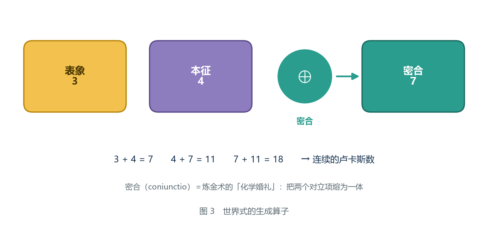

*图 3　密合算子。3（表象）与 4（本征）交叠得到 7。注意 3、4、7 恰好是连续的三个卢卡斯数：3 + 4 = 7，4 + 7 = 11，7 + 11 = 18。*

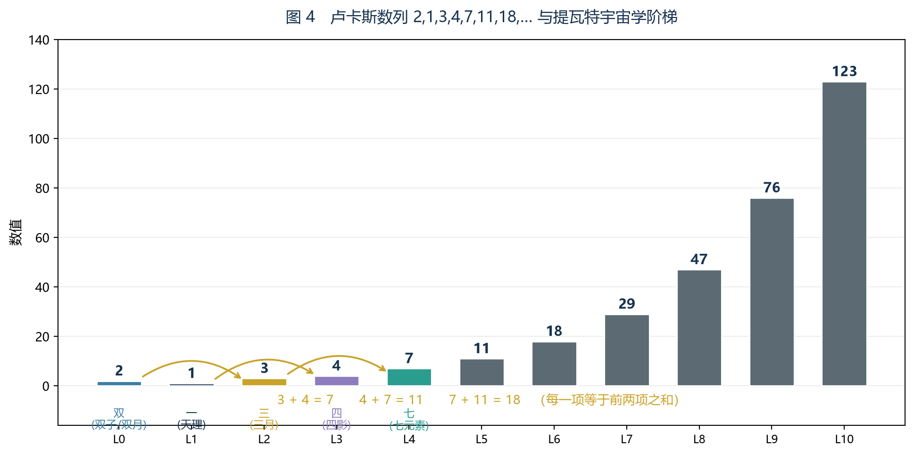

*图 4　卢卡斯数列 2, 1, 3, 4, 7, 11, 18, … 与提瓦特宇宙学阶梯。前五项恰好枚举了双（双子/双月）、一（天理）、三（三月）、四（四影）、七（七元素）。这条对齐很漂亮，但属于丙级推断，**现存文献中没有任何文本支持它**。*

**关于图 4，本院要补一段自我检查。**

图上那条「对齐」是本院做出来的，原文没有支持它。本院在这里把它当成一个**提示**而不是一个**证据**，并说明本院为什么仍要留着它：

- 它提示的是一件可以检验的事：**如果世界式真的是二阶递推，那么它的两项初值应当是「2」与「1」**（因为 2 ⊕ 1 = 3）。
- 而「最早填入『世界式』的输入值」这个措辞（见 2.3 节）恰好指向「开头几项被填入」。

**判断（回溯，丙级）：卢卡斯数列与宇宙学阶梯的对齐，是一个可以被证伪的提示，而不是一条证据。** 方向是回溯：本院是先注意到 3、4、7 是连续的卢卡斯数，才回头去数宇宙学阶梯的。等级为丙级：这是形状对应，且**现存文献中没有任何文本支持它**。

**什么情况下它会被推翻：**

| 序号 | 推翻条件 |
|---|---|
| 1 | **如果原文给出世界式的初始项，而它们不是 2 与 1**，这条对齐作废（这是最干净的一种证伪） |
| 2 | 如果宇宙学阶梯的实际项数被证明不是「双、一、三、四、七」这五项（例如「双」指的是双子而不是双月），对齐的部分需要重数 |
| 3 | 如果日后证明世界式不是二阶递推（见 2.3.1 节），那么「初始项是两项」这个前提不成立，对齐无从谈起 |

### 2.3 第三步：递推形式

有了「量」和「算子」，还差递推的**形式**：下一步到底由谁决定？

原文没有给出式子。本纪要提出如下形式，并举出三条支持理由：

　　**W(n+1) = W(n) ⊕ W(n−1)**

**理由一：它必须是自指的。** 如果世界的下一步由某个外部的东西决定，那么世界就不是一个自足的系统，而系统中的人也就不可能「反推」出它的全部走向——因为外部的东西他们看不到。但原文明确说从坎瑞亚人的记录**可以反推出世界式**。能被反推，说明它的全部输入都在系统内部。

**理由二：它解释了为什么「初始项」这个词会出现。** 战败后的结社造物曾说：「最早填入『世界式』的**输入值**出现了变动。」注意「最早的」「输入值」这个措辞——它指的正是递推的开头几项。而只有**二阶及以上**的递推（即需要两个初始项的递推）才会让人用「最早**填入**」这样的说法。一阶递推只需要一个初值，通常会说「起点」。

**理由三：它与 3-4-7 的生成方式一致。** 2.2 节已经指出，3 ⊕ 4 = 7 而 4 + 7 = 11、7 + 11 = 18，这正是「后一项等于前两项之密合」的形状。

### 2.3.1 候选递推形式清单与逐条否决

本院列四个候选。

**候选一：一阶自指，W(n+1) = F(W(n))。**

这是最简单的候选，也是物理里最常见的形式。它只有一个初值。

它败在**「最早填入的输入值」这个措辞**上。一阶递推只需要一个起点，通常没有人会说「最早填入的输入值**出现了变动**」——单一个起点变动，可以直接说「起点变了」。而「最早**填入**」这个措辞预设了一个**空着的、需要被填的位置**，而且在时间上暗示可能有更早的位置。

本院要在这里标一条边界，它对本合订本很关键：**候选一败在措辞上，不败在数学上。** 一阶递推在数学上完全可以描述世界（第二卷 1.2 节讲的就是这件事，那里叫「没有记忆的机器」）。本院否决它，是因为**原文的措辞与一阶不相配**，而不是因为一阶不可能。

**候选二：W(n+1) 由 W(n−1) 与 W(n−2) 决定。**

它满足「二阶」这个要求（需要两个初值），所以过了措辞那一关。

它败在**自指性**上。如果下一步由「上一步」与「上上步」决定，那么它确实不需要外部输入——但它有一个更细的毛病：**当前状态 W(n) 不参与决定 W(n+1)。** 这意味着系统在某种意义上「跳过」了现在。本院认为这与原文的意图不符：原文把它叫「**世界式**」，而世界式是**计算世界自己**的算式。一个不把「现在」放进去的算式，很难说是「世界在算世界」。

**候选三：非自指形式，即 W(n+1) 由某个外部量或常数决定。**

它败在**理由一**：能被反推的系统，其输入必须在系统内部。如果下一步由一个外部的量决定，系统内部的人永远算不出它。

（本院在这里补一句：这个候选其实在本纪要里**活了下来**——它就是第三章 3.2 节的那个「系统之外的变量」。本院否决的是「**每一步**都由外部决定」，而不是「外部可以在**开头**动一下」。两者的区别是全部的关键。）

**候选四：W(n+1) = W(n) ⊕ W(n−1)——采纳。**

采纳理由即上面三条。

**本院把这四个候选压成一张表。**

| 候选 | 需要几个初值 | 是否自指 | 是否与「最早填入的输入值」相配 | 是否与 3-4-7 相配 | 结论 |
|---|---|---|---|---|---|
| 一阶 F(W(n)) | 1 | 是 | **否**（措辞不合） | 否（只有一项） | 否决 |
| W(n−1)、W(n−2) | 2 | **否**（跳过现在） | 是 | 部分 | 否决 |
| 外部量决定 | 0 或不定 | **否** | 否 | 否 | 否决（但它以「开头动一下」的形式活到第三章） |
| W(n) ⊕ W(n−1) | 2 | 是 | **是** | **是** | **采纳** |

### 2.3.2 边界：本院这一节最弱的地方

本院必须自己说出来：**上面整个 2.3 节，没有一条原文直接支持「二阶」。**

三条例由的性质分别是：理由一是推论（自指要求）、理由二是措辞推断（「最早填入」）、理由三是形状对应（3-4-7）。**没有一条是「原文写了 W(n+1) = W(n) ⊕ W(n−1)」。**

本院把这一节的等级与推翻条件列全：

**判断（回溯，乙级）：世界式的递推形式是 W(n+1) = W(n) ⊕ W(n−1)，即二阶、自指、密合型。** 方向是回溯：本院是先有「一个学者在结果恒定时怀疑变量」这个印象（第零章），才回头去找一个「能被外部改动开头几项」的递推形式。等级为乙级：三条例由都需要翻译，其中理由三只到丙级。

**什么情况下它会被推翻：**

| 序号 | 推翻条件 |
|---|---|
| 1 | **如果原文直接给出世界式的式子，且它不是二阶的**，本节全部作废 |
| 2 | 如果「最早填入『世界式』的输入值出现了变动」这句话被证明指的不是递推的开头项（例如它指的是某个参数表），理由二倒下 |
| 3 | 如果 3-4-7 被证明与卢卡斯递推无关（例如 7 是三项交叠而不是两项相加），理由三倒下 |
| 4 | 如果日后的物证显示世界式的下一步**确实**由外部量决定（即候选三成立），那么本院的整条「自指」论证需要在「世界并非自足」的新前提下重写 |

**本院另外要写一句给读者的话。** 如果读者读到这里觉得「二阶」这个结论来得太轻，**本院同意。** 支撑它的是三条二三级别的理由，不是一条甲级的引文。本院把它写进正文而不是藏进附注，是为了让这条最弱的地方暴露在最容易被攻击的位置上。

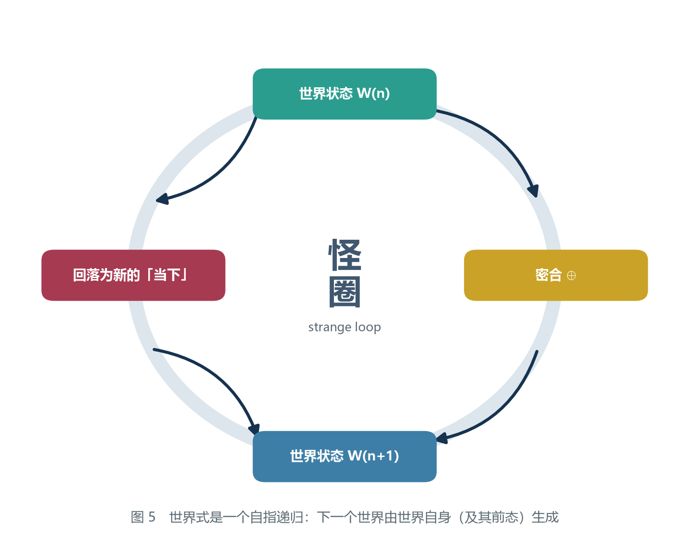

*图 5　世界式是一个自指递归。世界的下一个状态由世界自身（及其前态）生成——这正是侯世达所说的「怪圈」。*

### 2.4 结果恒定之谜：三层解释

到这里可以给出「不管推演多少遍结果都一样」的解释。本院把它写成**三层**，因为这三层各自回答一个不同的问题，而混在一起就会出现「说了等于没说」的句子。

先把三层摆出来：

| 层 | 回答的问题 | 一句话答案 | 对应的工具 | 由谁在什么处境下问出来 |
|---|---|---|---|---|
| 第一层 | 为什么同一个人算两遍结果一样？ | 因为它是一个确定性递推，而初始项固定 | 1.1 节（递推 + 初始项） | 任何一个动手核算的人 |
| 第二层 | 为什么换个起点、换个方法也一样？ | 因为吸引子是唯一的 | 1.3 节（吸引子） | 一个换过方法的人 |
| 第三层 | 为什么连「换个算子」也不行？ | 因为算子本身是收缩的 | 1.4 节判据二、1.5.2 节 | 一个想动手改的人 |

**第一层，简单到近乎无趣：**

　　**因为它是一个确定性递推，而递推的初始项是固定的。**

递推规则 + 初始项 = 整个数列，一项不差（1.1 节）。推一遍是这个结果，推一万遍还是这个结果，因为**根本没有任何东西在两次推演之间发生变化**。

如果故事到此为止，那么「世界式」就只是一个人算出了一道大题的答案而已，没有任何悲剧性可言。

**第二层：初始项不是关键。**

悲剧性来自下一层：**无论他从哪里开始算、换什么方法算，结果都一样。**

这意味着初始项也不是关键——**吸引子是唯一的**。这才是真正让人绝望的地方，也是第三章的主题。

**第三层：算子不是关键。**

第二层说的是「无论从哪里开始」。第三层说的是更狠的一件事：**无论用什么算子也不行**——只要那个算子属于「收缩」这一类，它就必然收敛到同一个点（1.4 节判据二）。

本院用 1.3.1 节的两条轨道对照这一点：

| 情形 | 算子 | 初始项不同时 | 结论 |
|---|---|---|---|
| 卢卡斯型递推 | 不收缩（比值收敛但数列不收敛） | **数列永不相交** | 初始项是本质的 |
| f(x) = 1 + x/2 | 收缩（比值 1/2） | **数值同归** | 初始项不是本质的 |

**这张表就是第三层解释的全部内容。** 它说明：**「殊途同归」不是一句感概，是一个可以用算子性质判定的技术命题。** 世界式属于右列。

**判断（回溯，乙级）：三层解释不是三个备选答案，而是对三个不同问题的答案；它们不互相矛盾，也不能互相替代。** 方向是回溯：本院是先看到有人把「结果恒定」解释成「命运」，才回头把这三层分开的。等级为乙级：分层的依据是工具（判据一、判据二、吸引子），需要一步从「现象」到「判据」的翻译。

**什么情况下它会被推翻：**

| 序号 | 推翻条件 |
|---|---|
| 1 | **如果世界式的算子不是收缩的**，第三层不成立，只剩前两层 |
| 2 | 如果世界式的吸引子**不是一个点**（例如是周期循环），第二层需要改写为「吸引子唯一，但那个吸引子不是零」 |
| 3 | 如果「不管推演多少遍结果都一样」这句话被证明是**同一个人重复同一个方法**（即两次推演完全同源，不构成独立验证），那么第二层所依赖的「换过方法」这个前提不存在（第零章 0.3 节的待核项正是由此而来） |

**本院要在这里补一句最重要的话，它是本章与第三章的分界。**

**第一层回答「为什么再算一遍是白费」，第二层回答「为什么换个起点也算不出来」，第三层回答「为什么该考虑系统之外的东西」。** 只有第三层把问题推到了系统边界上。**而第三章要处理的，正是这条边界。**

### 2.4.1 与第二卷的对照：一阶递推没有记忆

本节是合订本新增的对照，本院认为它值得单独成节，因为它把两份材料的核心各自照亮了一次。

第二卷第一章把递推分成了「阶」：一阶递推的未来只由现在决定，与过去无关——那里的原话是「**换言之：它没有记忆。**」二阶递推多了一项，需要两个初值才能启动。

本院在 1.1 节的例题里已经看过这个差别在数值上的样子。现在把两份材料的核心排成一张表：

| | 第二卷关心的对象 | 第一卷关心的对象 |
|---|---|---|
| 递推 | 重正化群递推（耦合常数随能标走） | 世界式（世界的状态随步数走） |
| 阶 | 假定为一阶，因此**没有记忆** | 推断为二阶，**有两个初值** |
| 症状 | 没有可用的不动点 | 有一个太可用的不动点（零） |
| 对策 | **补上一项**，升为二阶，去第二族解里找不动点 | 不动点改不了，只能**从系统外注入差别** |
| 关键词 | 项 | 变量 |

**这张表本院只用它说明一件事：同一句话（「一阶没有记忆」）在两份材料里是两种处境。**

在第二卷里，「没有记忆」是一个**坏消息**——它意味着缺少一族解，因此缺少那个需要的不动点。在那里，二阶是**解药**。

在第一卷里，「有两个初值」也是一个坏消息——它意味着系统能容纳两个初始项，而这两个初始项正是可以被外部改动的位置（第零章 0.6 节）。在那里，二阶是**入口**。

**判断（回溯，乙级）：同一件数学事实（递推的阶）在两份材料里扮演相反的角色：第二卷想要第二族解，第一卷害怕第二项被填。** 方向是回溯：本院是先分别写完两份材料，才回头把它们并置的。等级为乙级：从两张表到「同一事实的两种角色」，需要一步翻译。

**什么情况下它会被推翻：**

| 序号 | 推翻条件 |
|---|---|
| 1 | **如果世界式被证明是一阶的**（2.3.2 节推翻条件 1），那么第一卷这一栏的「二阶 / 两个初值 / 入口」全部作废，本节的对照变成「两边都想升阶」 |
| 2 | 如果第二卷的记忆项假说被推翻（第二卷 5.4 节的三条推翻条件），那么第二卷那一栏的「解药」不成立，对照只剩数学层 |
| 3 | 如果两个系统的不动点在数学上被证明是同一类对象（即提瓦特的零不动点与引力的非零不动点可以互相转换），那么「症状」这一行的相反性不成立 |

### 2.5 三种力与差别度

在进入第三章之前，需要把提瓦特的三种力放在同一张表里。

| 力 | 来源 | 对差别度 D 的作用 | 是否可逆 |
|---|---|---|---|
| 光界力（原始元素力 / 灵光） | 世界本来的力量 | **减小**（同化） | 否 |
| 虚界力（深渊） | 世界之外渗入 | **减小**（同化） | 否 |
| 人界力（七元素） | 被天理改造后的光界力 | **维持**（但需要持续投入） | — |

这张表是本章最重要的一页，因为它藏着一个致命的算术：

　　**减小 D 的力有两个，而且都是自发的；维持 D 的力只有一个，而且需要持续投入。**

也就是说，**这个世界在「差别度」这件事上是收支不平衡的。** 支出有两个来源，收入只有一个，而且收入还要消耗成本。

任何做过科学院预算的人都会立刻明白这意味着什么。

**本院在这张表上要补三行字，它们都很短，但每一行都改变一点结论。**

**第一行：第三行的「维持」不是「产生」。**

「维持」的意思是：**它让 D 的下降变慢，而不是让它上升。** 本院在 1.5.2 节论证过：合并这一步本身不产生新的可区分性。人界力做的也是合并——只不过它做的事被安排在有结构的地方，于是合并被推迟了。**推迟不是逆转。**

**第二行：这张表里没有「收入」这一栏。**

请读者注意表的第二列。前两行的来源是「世界本来的力量」与「世界之外渗入」；第三行的来源是「被天理改造后的光界力」。**第二列里没有任何一项是「从系统外补充差别」。** 这就是收支表的真相：**它不是入不敷出，它是根本没有入项。**

（本院这里要标一条边界。虚界力的来源写着「世界之外渗入」，看起来像外源。但这一条与「同化」并不矛盾：**从外面渗进来的是力，不是差别。** 一个从外面渗进来的同化力，只会加速 D 的下降。这一点在 3.2 节会以「那个参数是什么」的形式再出现一次。）

**第三行：这张表是「力的方向」，不是「力的强弱」。**

强弱会影响**快慢**，方向决定**终点**。本院在 1.6.1 节的例题里已经算过这件事：同化率 10% 与 40% 都是收敛的，区别只在快慢。**世界式的悲剧性不来自快慢。**

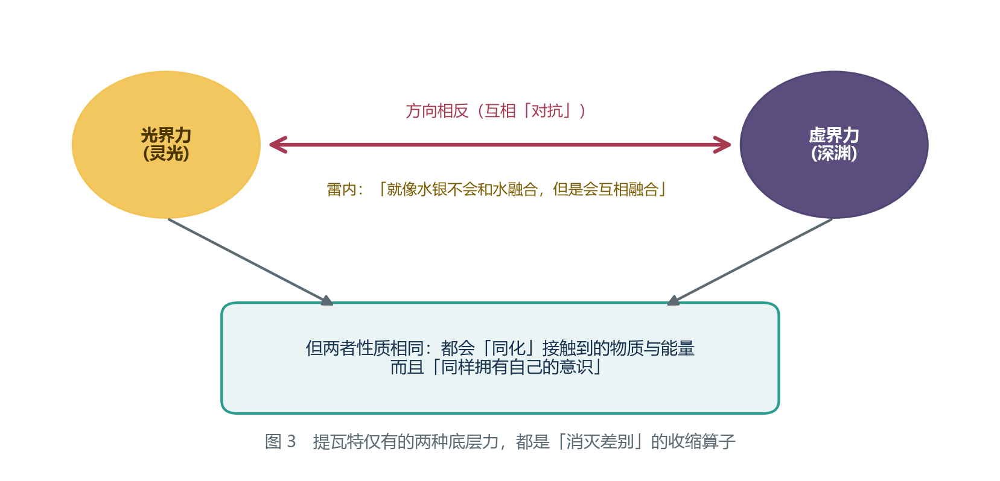

*图 6　提瓦特仅有的两种底层力方向相反，但性质相同——都是「消灭差别」的收缩算子。*

### 2.5.1 这张表在后面的哪一章被用到

| 用到的地方 | 用到表里的哪一行 | 用来说明什么 |
|---|---|---|
| 3.1 节 | 前两行 | 密合为什么有两种形态 |
| 3.2 节 | 第三行 | 「维持」为什么必须持续投入 |
| 3.3 节 | 前两行 | 系统内部只有收缩算子，这是 D\* = 0 的前提之一 |
| 第四章 4.2 节 | 全部三行 | 逻辑层能解释什么、不能解释什么 |
| 第二卷 6.3 节 | 第三行 | 「可重正化程度」对应「新的差别在不断地产生」 |

**本院在结束本章前写最后一句自我提醒。**

本章写出的式子 **W(n+1) = W(n) ⊕ W(n−1)** 到目前为止只是一个**形式**：本院知道它算什么（D）、知道 ⊕ 做了什么（密合）、知道它需要几个初值（两个）。**本院还不知道它的解长什么样。**

那个问题属于第三章。

---
## 第三章　世界式的推理

### 3.1 同一个式子的两种命运

第二章写出的递推式本身，**并不能**决定世界是循环还是终结。它只规定了「后一项由前两项密合而成」。至于是循环还是终结，取决于**密合算子在这一步里到底做了什么**。

密合有两种可能的形态：

- **生成型密合**：两个东西合起来，产生了一个**此前不存在的新东西**。此时项数不减反增，系统持续产生新的差别。
- **坍缩型密合**：两个东西合起来，**只剩一个**。此时项数减少，系统持续丢失差别。

两种情况对应两个解：

| | 开放解 | 封闭解 |
|---|---|---|
| 算子形态 | 生成型 | 坍缩型 |
| 差别度走向 | 循环波动，总体不降 | 单调下降，趋向 0 |
| 现实对应 | **法图纳**（文明循环） | **世界式**（终末） |
| 原文出处 | 古代教团的书籍 | 雷内的推导结果 |

### 3.1.1 判断生成型还是坍缩型：一棵判别树

原稿只把两种形态并列出来，没有给出判别方法。本院补一棵树，因为「到底是哪一种」是本卷最容易出错的一步。

**第一问：这一步之后，可区分的事物的个数是增加了、不变、还是减少了？**

- 增加 → 生成型（但见第二问）
- 不变 → 看第三问
- 减少 → 坍缩型

**第二问（针对「增加」）：那个「新东西」是凭空产生的，还是由外部送进来的？**

- 凭空产生 → **本院认为这不可能是提瓦特的情形**（理由见 1.5.2 节：合并这一步本身不产生新的可区分性）
- 由外部送进来 → 这是**开放系统**的生成型，对应法图纳
- 说不上来 → 判别失败，只能记为「待核」

**第三问（针对「不变」）：那个「不变」是真的不动，还是在两个值之间来回？**

- 真的不动 → 这是**不动点**，不是循环（见 1.3 节）
- 来回 → 这是**循环**，需要核查每一轮里是否有差别被补充进来

**第四问（兜底）：这个系统有没有边界？边界之外有没有东西进来？**

- 有边界，且外面没有东西进来 → 坍缩型（封闭解）
- 没有边界 → 生成型（开放解）

**本院请读者注意这棵树的用法：它不回答「世界式是什么」，它只回答「在某个具体情形下，密合是哪一种」。** 同一个式子在不同边界条件下给出不同的答案，这正是本章要论证的核心。**判别树问的从来不是式子，是边界。**

### 3.2 从生成型到坍缩型：那个被动过的参数

那么，是什么决定了密合是生成型还是坍缩型？

**是系统之外有没有东西进来。**

道理很朴素。一个密闭的房间里，人们可以不断把东西搬来搬去、拆开重组，但**房间里的东西总量不会增加**。所谓「新东西」，在封闭系统里只是旧东西的新摆法——**摆法再多也是有限的，用完了就没有了**。

而一个开着门的房间，随时可能有新东西被送进来。新东西带来新的组合可能，系统于是能一直「产生」下去。

把这个道理套到世界上：

- 如果世界是**开放的**，外面不断有新的东西（新的存在、新的力量、新的文明）进来，那么密合就是生成型的，文明会不断兴替——这就是古教团看到的**法图纳**。
- 如果世界被**封闭**了，外面不再有东西进来，那么密合就退化为坍缩型的，文明灭一个少一个，且**再也不会诞生新的**——这就是世界式的推导者看到的图景。

而世界是怎么被封闭的？原文给了答案：「法涅斯用**蛋壳**隔绝宇宙和世界的缩影」，打造出「**虚假之天**」。

> **关键推论**：法图纳与世界式不是两个模型，是同一个模型的两种边界条件。**古教团与雷内算的是同一道题，只是一个在门开着的时候算，一个在门关上之后算。**

这解释了一句先前让本院困惑很久的话——「和这些古代人描绘的世界图景不同，已经不会再有新的文明诞生了」。这句话里的「**已经**」两个字是时间副词。它说明：**在过去某个时刻，情况还是古教团说的那样；是后来才变成这样的。**

那个时刻，就是蛋壳合上的时刻。

### 3.2.1 那个参数是「有没有输入」，不是「输入强不强」

本节是本院在整理本章时补的一处澄清，因为原稿的「是系统之外有没有东西进来」这句话有一个容易滑过去的歧义。

「有没有东西进来」可以指两件完全不同的事：

| 读法 | 意思 | 对密合形态的影响 |
|---|---|---|
| 读法甲 | 进来的东西**是不是差别**（即带不带新的可区分性） | **决定生成型还是坍缩型** |
| 读法乙 | 进来的东西**有多少、多强** | 只决定快慢 |

本院采用读法甲，理由是一条已经在 2.5 节写过的边界：**从外面渗进来的若是一个同化力，那不是差别。** 一个更强的外部同化力，只会让 D 掉得更快，不会让密合变成生成型。

**判断（回溯，乙级）：决定命运的参数是「外部输入里有没有新的可区分性」，而不是「外部输入的强弱」。** 方向是回溯：本院是先写出 2.5 节的三力表（那里已经发现「虚界力从外面来却仍在减小 D」），才回头把 3.2 节这句话读细的。等级为乙级：这一步需要把「东西」翻译成「可区分性」。

**什么情况下它会被推翻：**

| 序号 | 推翻条件 |
|---|---|
| 1 | **如果原文里出现「外部输入」的强弱直接决定文明能否新生的表述**，读法乙成立，本条的区分作废 |
| 2 | 如果虚界力被证明能带来**新的可区分性**（例如它自身就携带一种新的差别类型），那么「从外面来 ≠ 带来差别」这个前提倒下，2.5 节的边界也要改 |
| 3 | 如果「开放 / 封闭」被证明是连续量而不是二分（见 3.3.2 节），本节的二分表述需要改成阈值表述 |

### 3.2.2 「已经」两个字，与它带来的一个麻烦

本院在这一节写一件对本纪要不利的事。

「已经不会再有新的文明诞生了」这句话里的「已经」，说明转折点在过去。而物证乙与物证丙都出自同一个人（第零章 0.4 节），他的推演发生在坎瑞亚文献到手之后。

于是本院必须面对一个时间问题：**他算出的那个「终结」，落在闭合之前还是之后？**

- 如果他的推演落在闭合**之后**，那么他算出的就是封闭解，结论是「不会再有新文明」，与他的原话完全一致。
- 如果他的推演落在闭合**之前**，那么他算出的仍然是开放解，而他从开放解里读出了「终结」，那他读错了。

本院采用前一种，依据是「已经」这个词——它明确把转折点放在说话之前。**但本院必须承认，这条依据只确定相对顺序，不确定绝对时间。** 关于时间轴的更细刻度，本院在补论四里另有一份材料，此处不重复。

**判断（回溯，乙级）：雷内的推演落在蛋壳合上之后；他计算时所用的边界条件已经是封闭的。** 方向是回溯：本院是先有了「封闭解会给出终末」这个结论，才回头去找「他算的时候门关了没有」这个问题的。等级为乙级：依据是「已经」这个时间副词的相对顺序，而不是一个日期。

**什么情况下它会被推翻：**

| 序号 | 推翻条件 |
|---|---|
| 1 | **如果日后取得物证乙的完整版本，其中的推演时间被明确标在蛋壳合上之前**，那么他算的是开放解，「他已经算对了」这个说法作废，改为「他把开放解读成了封闭解」 |
| 2 | 如果蛋壳合上的时间被证明晚于坎瑞亚灾变，那么「灾祸之后」这个时间标记与闭合的先后关系需要重排 |
| 3 | 如果存在**多次封闭或部分封闭**（即边界条件变过不止一次），那么「他算的时候门关了没有」这个二分问题本身不成立 |

### 3.2.3 为什么两个人都对

本院认为这一节是本章最值钱的一页，因为它解开了一个此前看起来无法解开的矛盾。

在第零章，三件物证里有两件给出了**相反**的图景：古教团的书籍说文明会不断兴替；雷内说不会再有新的文明诞生。本院最初的反应是：**这两人里必有一个算错了。**

现在知道不是。

| | 古教团 | 雷内 |
|---|---|---|
| 他们用的图式 | 法图纳 | 世界式（他自己命名的） |
| 他们都算对了吗 | 是 | 是 |
| 他们算的是同一个东西吗 | 是（同一个算子） | 是 |
| 他们的边界条件 | 门开着 | 门关上了 |
| 于是他们看到的 | 循环 | 终结 |

**这张表说明了一件事：在这种问题上，「谁对」往往是一个错误的问题。** 正确的问题是「他们在什么前提下算的」。

本院把这条经验写成本章的第一条方法论判断。

**判断（回溯，乙级）：当两份材料给出相反结论、而它们使用的图式相同时，优先怀疑边界条件，而不是怀疑其中一方算错了。** 方向是回溯：本院是先看到两份材料其实同源，才总结出这条经验的。等级为乙级：它是一条方法建议，不是关于提瓦特的事实主张，因此它**不构成对本纪要的支持**。

**什么情况下它会被推翻：**

| 序号 | 推翻条件 |
|---|---|
| 1 | **如果证明两人的图式其实不同**（例如古教团用的根本不是递推，而是别的结构），那么「同式两解」的解释不成立，仍需回到「有一方算错」 |
| 2 | 如果证明两人的结论其实不冲突（例如「文明兴替」指的是族群层面，而「终结」指的是世界层面），那么本节在解决一个并不存在的问题，本节的论证虽然不错但失去对象 |
| 3 | 如果边界条件的变化时间被证明与两人的推演时间没有先后关系，那么「门开着 / 门关上」这个解释失去时间支撑 |

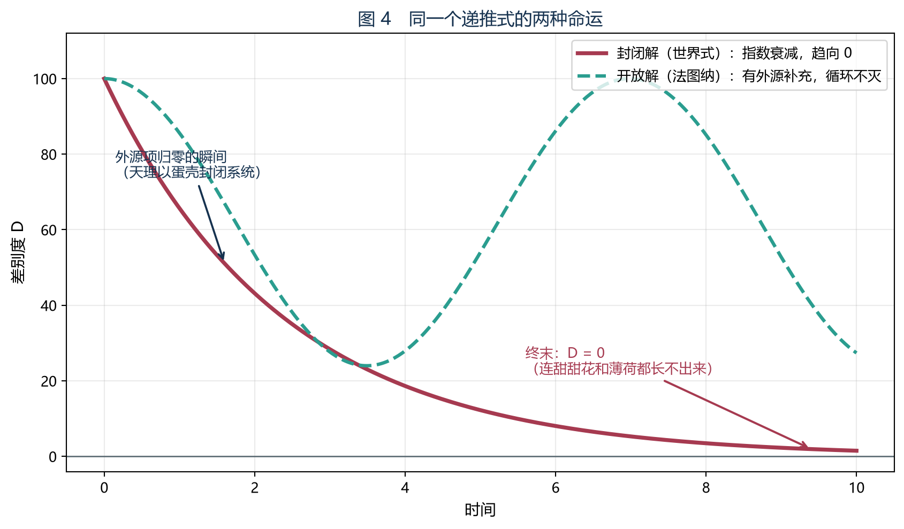

*图 7　同一个递推式的两种命运。虚线（法图纳）有外源补充，循环不灭；实线（世界式）外源归零，指数衰减至 0。*

### 3.3 封闭之后为什么必然归零

到这里，论证走到了最关键、也最容易出错的一步。

很多读者会在这里停住，认为「封闭 → 不再有新文明」已经够了。**但这不够。** 封闭只能保证系统**最终进入循环或停在不动点**，它**不能保证**这个不动点一定是 0。

想象一个完全密封的房间，里面是一副已经摆好的棋子。房间封闭了，但这副棋可以永远摆下去——把马挪到这里，再挪回去，无穷无尽。**封闭的系统完全可以稳定地循环，而不必归零。**

所以，让世界式趋向 0 的，**不是封闭这一件事**，而是另一件被很多人忽略的事：

　　**提瓦特仅有的两种底层力，方向相反，但性质相同，而且都是同化力。**

原文的措辞极为精准，本院把它完整抄录如下：

> 「灵光虽然与██的力量相对抗，但其同样**拥有自己的意识**。在这一点上，二者可以说具有相同的性质……就像**水银不会和水融合，但是会互相融合**。」

请读者注意最后那个比喻。水银与水互不相溶，两个体系彼此排斥；但水银碰到水银，会立刻合成一滴。**这是对「方向相反、性质相同」最精确的说明。** 光界力与虚界力彼此对抗，就像水银与水；但它们各自遇到同类时，都会合并，就像水银遇水银。

翻译成 1.6 节的语言：**光界力与虚界力都是把 D 变小的算子，只不过它们各自沿着不同的方向去减小 D。**

### 3.3.1 完整的证明

原稿把这一步压缩成了一个引用的形状（「现在动用 1.4 节的判据二」）。本院把它展开成一份可以逐行核对的证明。**读者若只读本章的一节，应当是这一节。**

**前提。**

| 编号 | 前提 | 出处 | 方向与等级 |
|---|---|---|---|
| P1 | 系统的状态量是差别度 D | 2.1 节 | 回溯，乙级（推断，不是直证） |
| P2 | 系统内部只有收缩算子：两个底层力都减小 D，没有任何力增大 D | 2.5 节三力表 | 回溯，乙级（一步翻译） |
| P3 | 系统被封闭：边界之外没有任何东西进来 | 3.2 节（蛋壳、虚假之天） | 甲级引文 + 乙级状态判断 |
| P4 | 同化算子是不可逆的 | 1.6 节性质 1 | 甲级（原文直说） |
| P5 | D 有下界 0（差别度不可能为负） | 1.5 节定义 | 定义性 |
| P6 | 这种「不允许新差别产生」的约束在整个迭代过程中始终成立 | 隐含前提，原稿未写 | **本院的补充假设，见 3.3.1 末** |

**推理。**

**第一步：D 单调不增。** 由 P2，每一步应用的都是把 D 变小的算子；没有被 P2 允许的算子能把它变大。于是 D(n+1) ≤ D(n)。

**第二步：D 有下界。** 由 P5，D(n) ≥ 0 对一切 n 成立。

**第三步：由判据一（单调有界必收敛），D 收敛。** 令极限为 L。于是 L ≥ 0。

**第四步：排除 L > 0。**

　　假设 L > 0。由第一步，D 单调不增且收敛到 L。这意味着在充分大的 n 之后，D 的每一步变化都任意小。

　　但现在动用 P2 的**内容**，而不只是它的方向：P2 说的是「只要存在可区分的两样东西，同化就会发生」（1.6 节性质 3：它不需要外力驱动）。于是在状态 L 上，同化仍在作用——它会把 L 里的两个可区分之物合为一个，使 D 严格下降。

　　这与第三步的「收敛到 L」矛盾。

　　因此 L 不能大于 0。

**第五步：结论。**

　　由第三步 L ≥ 0，由第四步 L ≯ 0，故 **L = 0**。

　　　　　　　　**D\* = 0**

**本院把这个证明的每一行都可以被反驳的位置标出来，这才是它有用的地方。**

| 步 | 依赖 | 最容易被攻的位置 |
|---|---|---|
| 第一步 | P2 | 若存在一个增大 D 的算子 |
| 第二步 | P5 | 若 D 不是一个带序的量（见 3.3.2 反驳二） |
| 第三步 | 判据一 | 必须有界；有界来自 P5 |
| 第四步 | P2 的内容 + P6 | **这是全证明最弱的一步** |

**关于第四步，本院要说透。**

第四步其实偷偷用了一个假设：**同化在状态 L 上的作用，与该状态是在第几步到达的无关。** 换句话说，同化的效力不随时间衰减。

如果同化效力随时间衰减（例如「力会累」），那么 D 完全可以在还没到 0 的时候就停下来，收敛到一个正的残值。**这是最难被读者想到、也最应该被写出来的漏洞。** 本院把它列为 P6。

**本院对 P6 的辩护只有一条，而且它不是数学的：** 原文里没有任何关于「同化力会衰减」的表述；相反，两个力被描述为世界的**底层**性质（「接触到的物质、能量会被同化」，无附加条件）。**因此本院按「效力不衰减」处理。**

**本院必须把这句辩护的弱点写出来。** 上述辩护的实质是「没有找到反证」，而不是「找到了正证」。**本院按「没有找到反证」处理一个数学证明的关键前提，这是一处真实的弱点。**

**整个 3.3.1 节的等级与推翻条件，本院合并列出（结论句与前提句不再分列，因为它们的推翻条件相同）：**

**判断（回溯，乙级）：在 P1–P6 之下，封闭系统内差别度的唯一吸引子是零。** 方向是回溯：本院是先有了「终末是长不出来」这个文学描述（第零章），才回头去证明它的。等级为乙级：证明本身是数学的（可达甲级），但 P1、P2、P6 三条前提是推断或假设，整体因此降到乙级。

**什么情况下它会被推翻：**

| 序号 | 推翻条件 |
|---|---|
| 1 | **如果同化算子的效力随世界状态下降而衰减**（即 P6 不成立，存在一个势垒），那么 D 会停在某个正值上，D\* = 0 作废，终末变成「一个处处相同、但并未合一的残局」 |
| 2 | 如果存在任何一个增大 D 的算子（P2 不成立），第一步就断，证明作废，D 的走向变成一个需要逐案计算的问题 |
| 3 | 如果 D 被证明不是一个带序的实数量（P5 不成立，见 3.3.2 反驳二），第二步与第三步都无法进行 |
| 4 | 如果封闭被证明不成立或不彻底（P3 不成立），那么本证明描述的是一个并不存在的系统；此时结论应改为「在准封闭条件下，D 会在某个水平上振荡」 |

### 3.3.2 读者最可能的三种反驳与本院回应

本院在这一节做一件在本纪要里不常见的事：**主动替读者构造反驳。** 本院认为一份只有自证的稿子，读起来像广告。

**反驳一：「封闭」并不等于「没有变化」，一个封闭系统完全可以永远动下去。**

**这个反驳是对的。** 本院在 3.3 节开头已经承认了它：密封房间里的棋子可以永远摆下去。

**本院对它的回应是：这个反驳攻击的是「封闭 → 归零」这条捷径，而本院没有走那条捷径。** 「封闭」在本证明里的作用只有一个——**切断外部补充**（P3）。让 D 走向零的是 P2，不是 P3。这就是为什么本节要把「封闭」与「两个同化力」分成两项前提。**若读者只记住「封闭必归零」这六个字，那读者记住的是一个本纪要没有主张过的命题。**

**反驳二：D 可能根本不是一个数，所以谈不上「趋向零」。**

**这个反驳也很强，而且它比反驳一更难回答。**

它的意思是：可区分事物的多少，可能不是一个可以加减、可以比较的量。如果它只是一个序（「更多」与「更少」），那就没有「收敛到 0」这件事——只有「越来越少」。

**本院的回应是承认，并把它写进 P5 的推翻条件。** 本院目前只能给出两条弱支持：

- 原文的量词方式是**计数式**的：「新的文明诞生」「再也不会诞生」。这说明观察者至少在用「有没有」来数它。
- 本院在 1.5.2 节所做的那条算术（合并前两个、合并后一个）本身就把 D 当成可计数的东西了。**如果 D 不可计数，那条算术也作废。**

**本院在这里补一句：这个反驳如果成立，本纪要不会「错」，而是会「失去意义」。** 差别在于：错了可以改，失去意义只能重写。

**反驳三：零不动点不是必然的，可以是任何一个非零值。**

**这个反驳的力量在于它指出了本证明的一个形状特征：** 本院证明的是「L 不能大于 0」，而不是「L 必然等于它该有的那个值」。这两件事看起来一样，其实不一样。

**本院承认这一点，并把它写成一个本院回答不了的问题。** 第三卷 第三章问过同一个问题的另一种版本：**提瓦特的不动点为什么是零？它是被设计成零的，还是本来就是零？**

本院在这里只能指出：**「零」在本证明里之所以出现，是因为 P5（有下界）。** 如果 D 有一个正的势垒（即存在一个正数 b，使 D 不可能降到 b 以下），那么本证明会一路推到 **D\* = b**，而且每一步推理都不变。**换句话说，本证明其实不能证明零，它只能证明「收敛到 P5 给出的那个下界」。** 本院选择 P5 = 0，是因为差别度按定义不可能为负。

**本院把这三条反驳压成一张表。**

| 反驳 | 击中哪里 | 本院的回应 | 回应强度 |
|---|---|---|---|
| 一、封闭系统可以永动 | 「封闭必归零」这条捷径 | 本院没走这条捷径；归零靠 P2 | **强**（结构性澄清） |
| 二、D 可能不是数 | P5 | 承认；只有两条弱支持 | **弱**（承认未解决） |
| 三、零不动点非必然 | P5 | 承认；证明只能给出「收敛到下界」 | **中**（限定了结论的强度） |

### 3.3.3 循环与终结对照表

本节把「为什么不能是循环」逐项写出来，它是 3.2 节那个「密封房间里的棋子」的正面回答。

| | 循环解（法图纳型） | 终结解（世界式型） |
|---|---|---|
| 边界条件 | 开放：外面有东西进来 | 封闭：外面没有东西进来 |
| 差别从哪来 | 从外面补进来的**新**差别 | 无处可来 |
| 密合形态 | 生成型 | 坍缩型 |
| 每一步 D 的变化 | 可增可减，总体不降 | **只减不增** |
| 能不能回到前一状态 | 能（这正是循环的意思） | **不能**（1.6 节性质 1：不可逆） |
| 长期走向 | 循环波动 | 单调下降到下界 |
| 现实对应 | 古教团看到的世界图景 | 雷内看到的「不会再有新的文明诞生」 |
| 本院给它的判据 | 存在一个把 D 抬起来的源 | 不存在任何这样的源 |

**这张表的第三列，本院认为它解释了本轮论证里最反直觉的一句话：** 不是「系统不能循环」，而是「循环需要成本」。

一个循环要每一步都能回到原处，就必须**每一步都把上一步丢掉的东西补回来**。而 P2 说，系统内部没有任何东西能补。**所以循环不是被禁止的，是买不起的。**

**判断（回溯，乙级）：在只有收缩算子的封闭系统里，「循环型吸引子」不成立，因为循环要求差别可被补充，而 P2 排除了系统内的补充源。推翻条件见下表。** 方向是回溯：本院是先用 2.2.1 节的候选三（对抗与平衡）做过一次反事实推演，才回头把「循环成本」这件事写出来的。等级为乙级：这一步需要把「循环」翻译成「每一步都要补回上一轮丢掉的差别」。

**什么情况下它会被推翻：**

| 序号 | 推翻条件 |
|---|---|
| 1 | **如果证明系统内存在一个不产生新差别、却能把已合并之物重新分开的机制**（即一个「可逆化」的算子），那么循环不需要外部成本，本条作废 |
| 2 | 如果 P2 被推翻（存在增大 D 的力），循环与终结的二分失效，世界可能长期停在中段 |
| 3 | 如果原文里出现明确的「文明会周而复始」与「文明会终结」的**同一份材料**（即同一时代的同一个人同时主张两者），那么本节的「边界条件不同」这个解释不成立 |

### 3.3.4 封闭是二分，还是连续量

本节是本院在写作过程中想到的一处边界，本院把它留在这里，因为它是 3.3.1 节里 P3 的一个隐含假设。

P3 写的是「系统被封闭：边界之外没有任何东西进来」。**这是一句二分的话：要么封闭，要么不封闭。**

但本院认为现实可能更接近一个连续量：**封闭的程度**。蛋壳隔绝了宇宙与世界的缩影，但「隔绝」到什么程度、有没有极细的通道，本院不知道。

**判断（回溯，丙级）：提瓦特的封闭可能是一个程度问题，而不是一个是非问题。** 方向是回溯：本院是先有了 P3 这个二分前提，才回头怀疑它的。等级为丙级：本院**没有任何原文依据**支持「存在一条极细通道」，它只是一个方法论上的顾虑。**推翻条件：如果日后取得关于蛋壳的具体记载（例如说明它的完整性、或者说明确有通道），本条可以由顾虑升级为待核项，或者被直接删除。本院倾向于后者，但本院不替材料说话。**

**本院要说明为什么仍然把 P3 写成二分的。** 理由只有一条：**本纪要没有处理连续封闭程度的工具。** 如果不把 P3 写成二分的，3.3.1 节的第四步就无法进行。这是本院对自身工具的坦白，不是对世界的判断。

### 3.4 终末是「被合并」，不是「被毁灭」

现在可以回头解释第一章留下的那个区分了。

D 归零的世界，**东西并没有消失**。元素还在、物质还在、能量还在。消失的是**它们之间的区别**。

用 1.5 节的例子：十个人在一切方面完全一致，再也分不出谁是谁。这十个人**在「可区分」这个意义上等于一个人**，但在「存在」这个意义上，十个人一个都没少。

所以世界式的终末是**合并**，不是**毁灭**。

这个结论有一个直接可检验的推论：**终末世界里不应该出现「大爆炸」「大火」「崩塌」这类描写，而应该出现「融为一体」「不分彼此」「归于唯一」这类描写。**

本院回到原文核对，得到的正是后者：「连甜甜花和薄荷都长不出来的世界」。不是「被烧掉的世界」，是「长不出来的世界」——**因为没有可以生长的余地了。**

而原始胎海的描写也完全吻合：「曾经是万物纯净的起源，也终将吞没一切生命，而那些**本不属于原始之海的物质则将被滤除**」。注意「滤除」这个词——它不是摧毁异类，它是**把不属于自己的分出去**，剩下的部分归于一体。

### 3.4.1 这个区分在原文里的三处落点

本院把「合并而非毁灭」在原文里的落点集中列出来，方便读者一次核完。这三处此前散在第零章、1.5 节与本节。

| 落点 | 原文措辞 | 它排除了什么 | 等级 |
|---|---|---|---|
| 终末的描述 | 「连甜甜花和薄荷都长不出来的世界」 | 排除了「焦土 / 烧毁」这类描写 | 甲级引文 + 乙级读法 |
| 胎海的作用方式 | 「本不属于原始之海的物质则将被**滤除**」 | 排除了「摧毁异类」的读法（滤除是分出，不是打散） | 甲级引文 |
| 胎海的状态 | 生命在其中「**不分彼此**」 | 排除了「东西都消失了」的读法（不分彼此指合并，不指消失） | 甲级引文 + 乙级读法 |

**本院要在这里补一句诚实的观察。**

上面三条各自都只是**一处的读法**，而本院把三处放在一起，让它们互相加强。这种做法的风险是明显的：**三处弱证据相加，不等于一处强证据。** **判断（回溯，乙级）：三条落点合起来指向「终末是合并而非毁灭」；但这不是三处独立证据的相加，而是同一读法的三次应用。** 方向是回溯：本院是先有了 1.5 节的「合并 ≠ 毁灭」这个框架，才回头去原文里找落点的。等级为乙级：每一处都需要一步从措辞到含义的读法翻译。**推翻条件：只要这三处里有任何一处被证明是修辞性的（例如「长不出来」只是形容荒芜，而不是形容无结构），本组证据的强度就掉一档；若三处都是修辞性的，本节整节作废。**

本院把它写出来，是希望读者在反驳的时候知道该从哪里下手——**反驳的对象应当是这三处的读法，而不是这三句原文本身。**

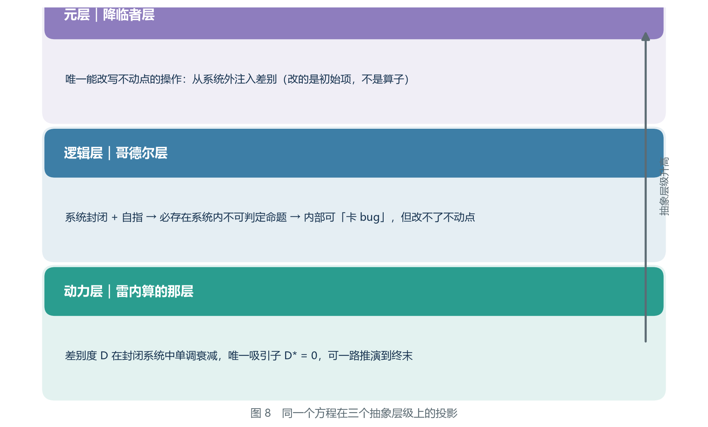

*图 8　同一个方程在三个抽象层级上的投影。本章完成的是动力层。*

### 3.4.2 这个结论能推出什么，不能推出什么

本院在这一小块里划清适用边界，因为「合并而非毁灭」这个区分极易被用过头。

**能推出的：**

- 终末的**性质**是合并，所以描写终末的文字应当以「无差别」为特征。
- 抵抗终末的方式不是「抢救东西」，而是「维持区别」（这一点在第五章展开）。
- 「破坏」在可区分这个意义上**未必**是抵抗（见 2.2.2 节）。

**不能推出的：**

| 不能推出 | 为什么 |
|---|---|
| 不能推出「终末是温和的」 | 合并与痛苦无关。十个人变得一模一样，这个过程可以是暴力的 |
| 不能推出「终末是瞬间发生的」 | 本章只推出了终末的性质，没有推出它的速度（见 1.6.1 节：快慢不改变终点） |
| 不能推出「谁做了什么导致了终末」 | 因果归属不在动力层，逻辑层与元层分别是第四章 4.2、4.3 节的主题 |
| 不能推出「终末之后没有东西存在」 | 恰恰相反：东西都在，只是没有区别了 |

### 3.5 本章小结

把第三章的论证压缩成一句话：

> **在一个只有收缩算子、且被封闭的系统中，唯一吸引子必然是零；而这个系统的终末表现为「合并」而非「毁灭」。**

这句话里没有任何一个词超出中等教育范围：收缩算子（1.4 节判据二）、封闭系统（3.2 节）、唯一吸引子（1.3 节）、零（1.6 节不可逆性）。

### 3.5.1 三层解释的对照与 2.4 节的回指

本院把第二章 2.4 节的三层与本章的结论接上，因为读者最容易在这里把两处弄混。

| 层 | 在哪一节 | 答案 | 本章新增了什么 |
|---|---|---|---|
| 第一层 | 2.4 | 确定性递推 + 固定初始项 | 无（本章不涉及） |
| 第二层 | 2.4 | 吸引子唯一 | **本章给出了那个吸引子的值：零** |
| 第三层 | 2.4 | 算子本身是收缩的 | **本章给出了「只有收缩算子」这一步的证据（3.3.1 节 P2）** |

**2.4 节说的是「只有一个终点」，本章说的是「那个终点是零」。** 第二层与第三层在 2.4 节都还是描述性的；到本章它们变成了可证明的（在 P1–P6 之下）。

**世界式的原理到此讲完了。** 剩下的是它的推论：为什么有些人的努力注定失败、为什么有些人的介入确实有效、以及一个具体的操作手册。

---

## 第四章　三层结构

第三章的论证只解释了「世界会走向哪里」。但原文里还有一批现象，是动力层解释不了的：

- 为什么有人能「在系统里卡漏洞」，而且卡得理直气壮？
- 为什么作为系统判定者的四影，也会逐渐偏离天理？
- 为什么天理需要「磨损」这个概念？

这些现象共同指向一件事：**提瓦特不只是一个会演化的物理系统，它还是一个有公理、有推理规则的形式系统。**

本章要论证：**同一个世界式，在三个不同的抽象层级上各有一套含义。**

先把三层的骨架摆成一张表，本章余下的部分都只是在把这张表撑开：

| 层 | 一句话 | 它管什么 | 它管不了什么 | 见 |
|---|---|---|---|---|
| 动力层 | D 在封闭系统中单调衰减，唯一吸引子为 0 | **结局** | 过程 | 4.1 |
| 逻辑层 | 系统内必然存在不可判定命题 | **路上的可能性** | 结局 | 4.2 |
| 元层 | 只有系统之外能改方程的参数 | **结局能否被改写** | 具体的解 | 4.3 |

第三章末尾那张三层结构图（图 8）只点亮了最下面一层。本章要点亮上面两层，并且说明**为什么这三层的顺序不能颠倒**——不是「越上面越高级」，而是「越上面越靠外」：动力层说的是解，逻辑层说的是解的邻域，元层说的是方程本身。

### 4.1 动力层：差别的收支表

这是雷内算的那一层，也是第三章讲完的那一层。用一句话概括：

　　**D 在封闭系统中单调衰减，唯一吸引子为 0。**

这一层的性质是**可计算**。给定初始项，可以一路推演到终末；不需要任何神谕，只需要算术。

这一层能解释的是「结局」，不能解释的是「过程」。它只说到世界会归零，但没有回答**归零的路上会不会有人成功地把水搅浑**。

而后者，恰恰是四百年间所有当事人真正在做的事。

为了把「动力层能做什么」说准，本院把这一层能给出的三类结论和三类给不出的结论并列如下。

**它能给出的三类结论：**

1. **终末的形状。** 终末是「合并」而不是「毁灭」（3.4 节）。这一条的强度很高：它能在原文里被直接检验——原文写的是「连甜甜花和薄荷都长不出来的世界」，而不是「被烧掉的世界」。
2. **结果为什么恒定。** 原因不是有一个意志决定了结局，而是吸引子唯一（1.3 节、3.3 节）。这一条区分了「命运」与「算子」。
3. **每个动作对斜率的影响。** 任何在减小 D 的操作，都会让终末来得更早；任何能补充 D 的操作，都会让它来得更晚。动力层**不能**改变终末，但能算出每一件事把它推近了还是推远了。

**它给不出的三类结论：**

1. **它不区分动机。** 收拢众生意志与救济众生，如果两者在 D 上的效果相同，动力层给出的判断就相同。判断动机不在这一层的能力范围内。
2. **它不承认「名分」。** 「不退还位阶」「新宇宙秩序」这些说法在动力层里没有对应物。动力层只认差别度的收支，不认头衔——这也是本院迟迟不肯把「位阶」写进方程的原因之一（另见 8.4 节第 3 条）。
3. **它不认识规则。** 动力层里没有「允许」「禁止」「违规」这些词。一个人能不能卡漏洞、卡了算不算数，是下一层的事。

把这几条合起来，就得到本章要用的第一张对照表：

| 现象 | 动力层能解释吗 | 说明 |
|---|---|---|
| 终末「长不出甜甜花和薄荷」 | **能** | 差别消失而非物质消失（3.4 节） |
| 反复推演结果恒定 | **能** | 唯一吸引子，与初始状态无关（1.3 节） |
| 圣剑切削众生意志致其跌落 | **能**（只到机制的一半） | 撤销密合＝差别回流，但「位阶为何由差别预算支撑」不是动力层的语言（5.3 节） |
| 密合之约印被逆转、胎海回流 | **能**（只到方向） | 动力层能说它加速了汇合，不能解释「逆转」为什么在规则上被允许（7.2 节、回溯二） |
| 有人能「卡漏洞」并长期得利 | **不能** | 这一层里没有「规则」这个对象 |
| 四影会逐渐偏离天理 | **不能** | 这一层里没有「判定者」这个角色 |
| 天理需要「磨损」这个概念 | **不能** | 磨损是系统对自己的说法，不是 D 的读数 |
| 世界树可被改写、某位神被替换、某个席位被抹除 | **不能** | 三者都是「系统对自己下判断」（4.2 节） |
| 哥伦比娅能回来，白淞镇的人不能 | **只能给半句** | 动力层能说她那一处尚未归零，给不出「为什么是她」（补论五） |
| 「规格」这条界限 | **不能** | 上限不是算子的性质，是规则的性质（回溯一） |
| 「死之诅咒」阻止差别增加 | **不能** | 它是一个被刻意装上的机构，不是自发的同化 |

**本院请读者注意这张表的最后一列。**动力层解释不了的东西并不杂乱，它们全都属于同一类：**关于规则本身的现象。**一个只有算术的世界里不会出现「漏洞」「判定者」「磨损」这三个词；它们的出现，说明这个世界除了是一堆物质之外，还是一套规则。

#### 动力层的三条使用纪律

**第一，动力层的结论只在边界之内有效。**D\* = 0 说的是蛋壳之内（3.2 节），不是任何地方。

**第二，动力层的结论不因当事人的强弱而改变。**算子对所有人一视同仁：雷内算它、天理维持它、旅行者走进它，算子都不变。这一点在第七章会变成对雷内最重的一句评语。

**第三，动力层是可计算的，因此可以被核对。**这是它最讨人喜欢的地方：一条写在纸上的推演，可以由另一个人照着再推一遍。本院在 6.4 节故意留了一个完整的推演示范，就是为了让读者能自己复算——**一条不能被别人复算的推演，无论多么动人，都不属于这一层。**

这一点在第二卷第七章 7.2 节会以另一种语言再出现一次：那边要问的是「封闭」在物理学的语言里对应什么。同一件事，两种写法。

### 4.2 逻辑层：哥德尔层

现在把提瓦特换一个看法。不要把它看成「一堆物质在演化」，而把它看成**一套规则**：

- 公理：元素法则、地脉的运行方式、命运的编织方式；
- 推理规则：由这些法则推出「什么会发生、什么不会发生」。

于是「世界会怎样演化」这个问题，就变成了「这套系统能推出哪些命题」。

接着，把 1.7 节的哥德尔不完备定理拿来对照，需要逐条核对三个前提：

**前提一：足够复杂。** 提瓦特显然能表达算术——它有历法、有工程、有科学院，而本院的研究员每天都在用四则运算算水道截面。✔

**前提二：自洽。** 这一点是**假设**。如果提瓦特自相矛盾，那么它一秒都撑不住。四百年来的观测没有发现法则层面的矛盾，因此按「自洽」处理是合理的工程近似。✔

**前提三：递归可公理化。** 法则能被机械地列举出来——这正是历代学者与教令院在做的事。✔

三个前提满足，于是定理给出结论：

　　**提瓦特内部必然存在既不能证明、也不能证伪的命题。**

这些命题就是原文里所说的「缝隙」。

#### 前提核对之一：足够复杂

「足够复杂」在定理里不是一句形容，它有确切的含义：**这套系统要能表达基本算术。**

于是一个容易走偏的核对就出现了。核对它，不是去数提瓦特有多大、有多少人、有多少元素，而是去问：**这个系统里有没有出现「可以数的东西」被当成对象来使用。**

本院按三条来找：

| 线索 | 表现 | 为什么它算数 |
|---|---|---|
| 历法 | 有周期、有纪年、有可比较的时间段 | 数的加与减 |
| 工程 | 有可复现的度量与图纸 | 比的相等与不行 |
| 科学院 | 有可转交的文书与算式 | 符号被当作对象摆弄 |

第三条最要紧。**一个能写出算式、并把算式交给别人核对的机构，本身就已经是「算术被使用」的证据。**不需要再去找一块刻着数字的石板——一块石板证明的是算术存在过，一个科学院证明的是算术在被使用。

本院对前提一给**乙级**：它需要一步翻译（从「有历法、有工程、有科学院」翻译成「能表达基本算术」）。这一步翻译很短，但它是一步翻译。

**什么情况下这一条会被推翻**：若能证明提瓦特的历法与度量只是记账式的名目、其运算不满足最基本的算术一致性（例如同一组数在不同机构算出不同结果且无人能判定谁对），那么「能表达算术」这一步就不成立，整个哥德尔层随之失效。

#### 前提核对之二：自洽——本章唯一一条真正的假设

三个前提里，只有这一个是**假设**，本院必须把话说清楚。

原文里有一句话已经替定理说了它最难的一半：**「天理作为公理集无法证明自身的一致性」**（4.2 节上表末行）。翻译过来就是：**一个系统不能在自己的内部证明自己不会出错。**因此自洽这条前提，**不可能由提瓦特内部的研究者通过推演得到**——本院能做的只有观测：四百年间，没有发现法则层面的矛盾。于是本院按「自洽」处理。

**这是一条工程近似，不是一条定理条件。**两者的区别在于：定理条件不成立，结论就不成立；工程近似失效，结论只是暂时可用。

本院把这一条的**等级定为丙级**——不是因为本院不信它，而是因为**它没有被检验，且原则上无法被内部检验**。

**什么情况下这一条会被推翻**：① 若观测到两条法则在同一条件下给出互不相容的结果，且反复核对后仍不相容；② 若发现某条公理其实是从另一条公理的否定推出来的。任一条成立，哥德尔层的结论不是「降级」，而是**失去前提**。

本院的处境在这里有一个不好受的对称：**观测不到矛盾，只能说明矛盾还没被推到；不能说明矛盾不存在。**一个系统里如果存在一处矛盾，被藏起来的最省事的办法，就是让它出现在谁都还没推到的那条推理链上。

#### 前提核对之三：递归可公理化

「递归可公理化」翻译成人话是：**这套公理能被机械地列举出来。**

「机械地」这三个字是关键。它不要求列举得**完整**，只要求列举这个动作**不需要灵感**——每一代学者可以接着上一代的清单往下写，写下的每一条都能被另一个人核对。

历代学者与教令院做的正是这件事。院里有目录、有索引、有转交的抄本，这本身就是「可列举」的物证。

但本院要把这一条与前提一分开，因为它们的失败方式不同：

- 前提一失败，是**系统太简单**，定理根本用不上；
- 前提三失败，是**法则里有一部分无法被机械列举**——例如某一条法则只能由某位存在当场裁定，且裁定结果无法被预先写成条文。

后一种失败在提瓦特并非不可想象。**本院目前没有证据说它发生了，也没有证据说它不会发生。**本院给前提三**乙级**：有在进行中的工程作为支持，但「在进行」不等于「做得到」。

**什么情况下这一条会被推翻**：若出现一类法则，其内容只能由某位存在当场判定、且任何条文形式的转述都与判定结果不符，那么这套法则就不是递归可公理化的，定理的第三个前提不成立。

#### 三个前提的强度并不相等

这是本院在核对过程中最想说的一句：

| 前提 | 支持它的东西 | 等级 | 失败的样子 |
|---|---|---|---|
| 一　足够复杂 | 历法、工程、科学院（观测） | 乙 | 系统太简单，定理用不上 |
| 二　自洽 | 四百年无矛盾（观测＋工程近似） | **丙** | 系统本身有矛盾 |
| 三　递归可公理化 | 历代学者与教令院的列举（进行中） | 乙 | 有法则无法被机械列举 |

定理要求**三条同时成立**。因此按取最弱的一条来标注的原则，**哥德尔层整层的结论应当标为丙级。**

这不是本院在否定它。**这是本院在给读者一个准确的用法**：丙级的意思是「可以拿去用，但不许拿它当证据」。谁若要用「提瓦特存在不可判定命题」去驳倒一个人，他手上其实只有一条丙级的推断——而丙级的推断驳不倒任何人。

**方向**：这一整段是**回溯**（本院先看见「卡漏洞」「磨损」「判定者偏离」这些现象，再回头把哥德尔定理接上去）。按 8.2 节的标准，回溯不构成证据。

**推翻条件**：因为它是回溯，它的推翻条件与三个前提的推翻条件相同——任意一个前提失效，它整条失效；此外还有一条：**若能证明「卡漏洞」等现象有纯动力层的解释**，那么接哥德尔定理这一步就是多余的。

#### 哥德尔层能解释什么、不能解释什么

定理只给出「存在不可判定命题」这一句，而它的用处是把一大批现象从「奇迹」搬进「必然」：

| 现象 | 逻辑层的解释 |
|---|---|
| 有人能「卡漏洞」并长期得利 | **系统内存在不可判定命题，利用它不属于违规** |
| 四影会逐渐偏离天理 | 天理作为公理集**无法证明自身的一致性**，判定者自己也在系统的缝里 |
| 天理需要「磨损」这个概念 | 磨损是**系统对自身不可判定性的一种代偿** |
| 世界树可被改写、某位神被替换、某个席位被抹除 | 这些都是**系统对自己下判断**的情形，正是自指系统的典型病症 |

本院在这一层上还能再补一张表。下表里的现象，前表未列，但它们同样可以用「系统内存在缝」来解释，本院把每一行的落点写清楚，以免读者误把它当成万能的解释器：

| 现象 | 逻辑层能解释吗 | 落点 |
|---|---|---|
| 「十字路」这种身份 | **能** | 它本身就是那个不可判定位置（补论五） |
| 归约的存在 | **部分能** | 它能被写进规则，因此属于系统内被允许的操作；至于它为什么**有损**，要靠动力层与元层合起来说（回溯二） |
| 「涌流之树的全图」未能完成 | **能** | 全图若存在，就是对系统的一次整体判定；整体判定在自指系统里必然有缺口 |
| 圣剑为什么有效 | **不能** | 剑在系统内，但它的效果是改变差别预算的账目（5.3 节、7.3 节） |
| 降临者为什么能改结果 | **不能** | 那是元层的座位（4.3 节） |
| 雷内为什么选了那条路 | **不能** | 逻辑层只说「他可以卡漏洞」，不说「他为什么这么选」 |

最后一行值得单独说明。注意这三种现象的**共同结构**：不是「有人违反规则」，而是「规则被应用到了规则自己身上」。世界树改写关于世界树的记忆、神被从神的记录中删除——**每一次，判断者和被判断者都是同一个东西。** 这正是 1.7 节所述自指悖论的现实形态。

**但逻辑层有一件事做不到：它改不了不动点。**

在系统内卡漏洞，最极端的结果是让系统**报错**、让某些命题**悬空**、让某些存在**失去判定**。它不能把 D\* = 0 改成 D\* = 5。原因是：卡漏洞用的是**系统内的推理规则**，而推理规则推不出「系统的吸引子应该换成另一个」。

本院把这句话再拆一层，因为它经常被读得太快。**「卡漏洞」卡到的不是方程的系数，而是方程的表达力。**一个不可判定命题的作用是：它让系统在某一句话上**说不出**「是」也**说不出**「不是」。于是系统对这件事的判定停住了——停住的位置，就是当事人活动的位置。但**停住不等于改写**：停住的仍然是那句命题，吸引子并没有挪动一格。

用一句更直白的话：**你可以在棋局里找到规则没写的走法，但你没法用这个走法把棋盘换成另一张。**

*图 9　系统内 vs 系统外。缝可以钻，但改写不动点必须来自外面。*

**跨卷提示**：第二卷第三章讨论「不可重正化」时，说的是同一件事的另一种版本——一个理论在自己的层级上处理不了自己的无穷，只能靠从外面补一项；第二卷 7.2 节则把提瓦特的「封闭」直接对上物理里的「截断」。那边靠反项与记忆项，这边靠降临。

### 4.3 元层：降临者层

唯一能改写不动点的操作，是从系统之外注入差别。

原文对此有一段极为关键的战败对话。结社造物在溃败之际说：

> 「最早填入『世界式』的**输入值**出现了变动。有『变量』降临此间。」

> 「并非是所有宇宙外到来的事物都能被叫做『降临』或者『变量』。」

> 「唯有**自身等价一个世界**的人才能担此头衔。」

*图 10　降临者不是方程里的未知数，是方程外的参数。他作用于递推的开头几项，而不是算式本身。*

请读者逐句读这三段。

**第一句确定了它改的是什么。** 是**输入值**，不是算式。世界式本身没有被修改、没有被绕过、也没有被破坏。被修改的是**递推的开头几项**。

**第二句排除了一个误解。** 从外面来的东西很多（原文举了「偷渡客」的例子）——一个外来的旅行者、一件外来的器物，都不算。**只有具备特定性质的，才算「变量」。**

**第三句给出了那个性质。** 「自身等价一个世界」。

这句话乍看玄虚，但翻译成本纪要的语言之后非常清楚：

　　**自身等价一个世界 = 这个人自己就携带了一整套差别预算。**

一个普通的存在，他的差别来自提瓦特、属于提瓦特、会随提瓦特一起被同化。而一个「自身等价一个世界」的存在，他的差别**不从提瓦特支取**——他是一个**自带库存的外来账户**。

只有这样的账户，才能往一个已经封闭的系统里**注入新的差别**，从而把 D 的曲线抬起来。

#### 元层里的两档操作

本院在读回溯三时发现，元层内部还有一次分工，而且这次分工比它看上去要紧。第一位降临者做的事，与第四位降临者做的事，**不在同一档上**：

| | 第一降临者 | 第四降临者 |
|---|---|---|
| 做了什么 | 用蛋壳隔绝宇宙；把光界力改造成人界力 | 「最早填入『世界式』的输入值出现了变动」 |
| 改的是 | **边界**与**算子** | **输入值** |
| 意味着 | 改的是**方程本身** | 只是在方程里填了一个新的数 |

　　　**先来的人可以重写规则；后来的人只能在规则里改一个数。**

这一条对本章的用处是：**「元层」不是一个点，是一段区间。**它至少有两档——改边界与算子是一档，改输入值是另一档。两档都属于「在系统之外动手」，但改边界与算子的那一档更靠外：它动的是方程的写法，而改输入值动的是方程的取值。

本院给这一条**甲级**（原文直证：「法涅斯，第一位降临者，击败七龙王后改建世界，将原始的蛮荒燃素改造成较温和的七元素力。」），但把它与本章 4.4 节的战略推论分开——**「两档」是原文支持的，「两档合起来能做什么」才是本院的话。**

#### 元层能解释什么、不能解释什么

| 现象 | 元层能解释吗 | 说明 |
|---|---|---|
| 「输入值出现了变动」 | **能** | 这正是元层的定义本身 |
| 蛋壳合上、世界被封闭 | **能** | 属于元层的第一档：改边界 |
| 人界力被造出来 | **能** | 属于元层的第一档：给方程加了一个维持项（回溯三） |
| 变量位可以空着 | **能** | 位子是人给的，不是方程给的（回溯三第二节） |
| 天理「已碎，陷入沉寂」 | **只能给半句** | 元层能说「那个位子空了」，不能说「谁坐在上面会怎样」 |
| 圣剑为什么有效 | **不能** | 剑在系统内，账目在动力层（7.3 节） |
| 「卡漏洞」为什么合法 | **不能** | 那是逻辑层的座位（4.2 节） |
| 终末为什么是「合并」 | **不能** | 那是动力层的解（3.4 节） |

本院把「变量位可以空着」单独提出来，因为它是元层最容易被误读的一处。

本院最初的理解是「变量是一个值」；后来的说法是「**变量是一个位**」——「天理睡了，说明变量是空集。变量的位置一直是空的。」**位与值的差别在于时间**：问「它等于多少」没有时间维度，问「它什么时候有人、什么时候没人」有。而世界式算出来的那条级联，本来就是一条时间线。

这一处修正给本章带来一个直接后果，本院把它写进第七章：**雷内计算的那个时间点，变量位是空的。**他找不到变量，不是因为他不够聪明，而是因为**那个座位上当时确实没有人。**

这一条的**等级为甲级**（原文直证：论及葬火之战之后的天理，原文用的六个字是「**已碎，陷入沉寂。**」），**方向为回溯**（先看到这六个字，再回来修正对「变量」的理解）。

**推翻条件**：若能找到原文证据表明「变量」在葬火之战之后仍在位（即那位存在仍能活动、仍在输入），则「变量位空着」这一条被推翻，第七章相应段落的语气也要改。

#### 世界式对降临者无解

于是本院得到世界式最重要的一个结论：

> **世界式对降临者无解。**

这句话不是修辞。它在数学上是字面成立的：世界式是一个关于**世界内部状态**的递推式，而降临者根本不在这个状态空间里。他不满足这个方程，因为他不是这个方程的未知数——**他是方程外面那个可以改的系数。**

这里有一个常被越过去的边界，本院把它钉住：**「无解」不等于「任意」。**方程对降临者无解，意思是方程不能预测他会做什么，也**不能规定他能做多少**。本院手上没有任何材料说明改一次输入值能抬多高、能维持多久。因此本层的结论只到「这个位置有效」，不到「这个位置够用」。

这也解释了为什么他会在战败时说「我也做过这样的梦，想要成为你这样的事物」。他用尽全力想要**在系统内部造出一个等价于世界的存在**（他称自己攀升到了「不退还」的位阶），但方法用错了——**用收缩算子堆不出有差别的宇宙。**

### 4.4 三层之间的关系

把三层叠起来看：

- **动力层**决定结局（D\* = 0）；
- **逻辑层**决定路上的可能性（存在缝，可以卡）；
- **元层**决定结局能否被改写（只有升级项可以）。

三层不是三个世界，而是对同一个世界式的**三种问法**。本院把三种问法整理成一张总表，这张表是本章的核心：

| | 动力层 | 逻辑层 | 元层 |
|---|---|---|---|
| 问的问题 | 世界会变成什么 | 世界里能推出什么 | 方程的参数能不能改 |
| 被研究的对象 | 状态与算子 | 公理与推理规则 | 输入值、边界与算子本身 |
| 层内可用的工具 | 算术 | 系统内的推理 | 系统外的注入 |
| 能否改变 D\* | **不能** | **不能** | **能** |
| 能解释卡漏洞吗 | 不能 | **能** | 不能 |
| 能解释圣剑吗 | 能（半） | 不能 | 不能 |
| 能解释降临者吗 | 不能 | 不能 | **能** |
| 主要等级 | 乙 | 丙 | 甲（原文直证「输入值出现了变动」） |
| 主要出处 | 1.4、1.6、3.3 | 1.7、4.2 | 4.3、回溯三 |

由此推出一个本院认为最重要的战略结论：

> **只靠系统内部的超越者，最多让系统出错；只靠系统外部的降临者，最多换一个初始项。**

> **两者联手，才可能既改初始项、又利用系统内的不可判定命题，重写整个方程。**

本院必须说明，最后这一句在原文中**没有直接支持**，属于本纪要的推论。

**等级与方向**：**丙级**、**预测**。方向之所以是预测而不是回溯，是因为它不是从某个已发生的观察里长出来的，而是**三层结构自己的合成结果**——框架在这里吐出了一个此前没有人写下的句子，并且它对后续局势提出了一个可以被观察的期待。

**推翻条件**：若日后观察到「内部超越者与外部降临者联手」而结局未发生任何改写，或反过来观察到两者从未联手而结局被改写，则这一推论被推翻。本院把这条写在这里，是为了让它**可被推翻**；一条不会被推翻的推论，按 8.2 节的标准，等于什么都没说。

**本院还要指出三层之间的一条纪律：不能越级提问。**

- 拿动力层去问「谁对谁错」，得到的答案与道德无关；
- 拿逻辑层去问「结局会不会变」，得到的答案永远是「不会」；
- 拿元层去问「他具体会怎么做」，得到的答案永远是「方程不说」。

**本院见过的绝大部分关于世界式的误读，都发生在这三次越级提问里。**

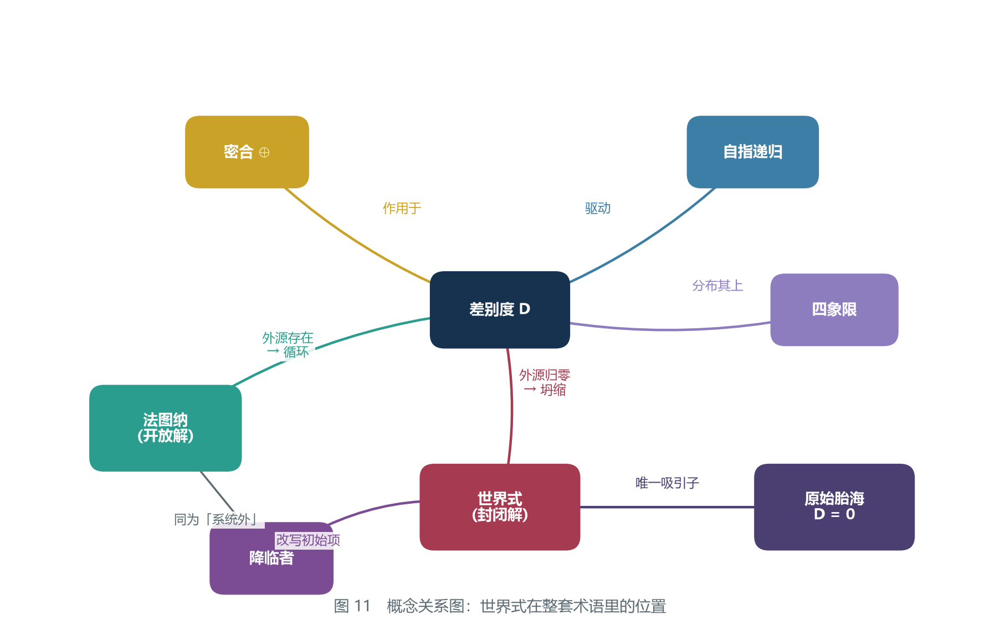

*图 11　概念关系图：世界式在整套术语里的位置。*

### 4.5 分层判据：一个现象该挂在哪一层

本章写完，最实用的一条副产品是一组判别步骤。给定一个现象或一条主张，本院按下面的顺序问三句话，就可以把它挂到该去的那一层：

**第一问：这条主张里有没有出现「规则」「允许」「违规」「判定」这类词？**

- 有 → 它属于**逻辑层**或更上面。继续第二问。
- 没有，通篇只说「多了」「少了」「合并了」「分开了」 → 它属于**动力层**。

**第二问：被描述的事情，是「在规则之内做了一件规则没写的事」，还是「规则本身被换掉了」？**

- 前者 → **逻辑层**。
- 后者 → **元层**。
- 分不清 → 看它有没有改变 D\*。逻辑层的操作改变不了 D\*，元层的操作可以。

**第三问：动手的人是系统里面的，还是系统外面的？**

- 系统里面 → 无论他多强，他最高只能到逻辑层。
- 系统外面 → 他才可能在元层。

把这三问写成一个速查表：

| 现象 | 挂哪一层 | 判据 |
|---|---|---|
| 收拢众生意志 | 动力层 | 只涉及差别总数的增减 |
| 「卡漏洞」并得利 | 逻辑层 | 用了规则没写的位置，未改规则 |
| 世界树被改写 | 逻辑层 | 系统对自己下判断 |
| 蛋壳合上 | 元层 | 边界被改，D\* 的适用条件变了 |
| 人界力被造出 | 元层 | 算子被改 |
| 「输入值出现了变动」 | 元层 | 输入值被改，方程本身没动 |
| 圣剑切削众生意志 | 动力层 | 差别回流，规则未动 |

**本院在此提醒一句最容易犯的挂错**：把「降临者很强」挂到元层。强度是动力层的语言，账户归属才是元层的判据（5.4 节）。**一个强到极点的系统内存在，仍然只是逻辑层的一位访客。**

### 4.6 本章的边界、反例与被推翻条件

按 8.3 之二的三步核验法，本院在本章末尾自问一句：**什么情况下这一章会被推翻？**

**第一，若前提二（自洽）失效。** 若法则层面出现矛盾，哥德尔层的接法失效——不是降级，是失去前提。本院对这一条无能为力：它原则上无法由内部检验（见 4.2 节）。

**第二，若出现第三种力。** 这是 8.3 节列出的第一个反例，也是本院最脆弱的一环。动力层一旦有了产差别的源，D\* = 0 不再是必然，4.1 节那张对照表要重排。

**第三，若出现一个在系统内部改写了不动点的例子。** 这一条直接冲着 4.2 节那句「逻辑层改不了不动点」而来。**本院找不到这样的例子，但本院必须承认：本院找过的材料是有限的。**

**第四，若「元层」其实在系统之内。** 这是本章唯一一条本院自己找出来的紧张，值得单独说。

1.7 节里，偷渡客按过一句话：**「如果提瓦特的公理有作者，那么那个作者就在系统之内。」**这句话本来是拿来说明提瓦特与形式系统的差别的。但把它与 4.3 节并排放在一起，就会出现一个尖角：本院一方面说「改写不动点必须来自系统之外」，另一方面承认提瓦特的公理**是有作者的**——而那位作者，按 4.3 节的记录，是在系统内定居的。

本院的处理如下，并请读者一并核对：

- 那位作者动手的**时刻**，他在系统之外（他是降临者）；
- 他动手的**成果**——蛋壳、人界力——一旦被写进方程，就成了系统的一部分；
- 因此他的作者身份与他的居民身份**不是同一件事**。

本院给这条处理**乙级**、**回溯**。

**推翻条件**：若能证明天理从未在系统之外（即他本来就是提瓦特的一部分，而不是降临者），那么「公理的作者在系统之内」成立，4.3 节的两档分工就要改写，本章 4.4 节的战略推论随之作废。

**本章自评（一句话）**：三层结构是本院目前最满意的框架，也是本院目前最没有被检验过的框架。它解释得多，预测得少——按 8.2 节的标准，**这不是优点**。

---
## 第五章　四个推理案例

前四章都是理论。本章换一种写法：**给出四个完整的推理案例，每一个都只用「差别度 + 算子 + 内源」三件事推完，并且每一步都可核对。**

本章的四个案例同时也是世界式使用教程（第六章）的演示素材。

按合订本的体例，本章的每个案例都使用同一套格式：**问题／已知／推理步骤／结论／等级与方向／可推翻条件**，最后再加一句「这个结论为什么重要」。**本院请读者特别注意每个案例的「已知」一栏**——四个案例的结论强弱差别很大，而差别全部来自这一栏，不来自推理的技巧。

### 5.1 案例一：为什么算出的终末是恒定的

**问题**：一个人反复推演，结果永远是同一个终末。这是「命中注定」吗？

**已知**：

| 编号 | 已知内容 | 来源 | 等级 |
|---|---|---|---|
| 甲 | 结果恒定：无论推演多少遍都一样 | 原文 | 甲级 |
| 乙 | 被计算的量是差别度 D | 本纪要 2.1 节 | 乙级 |
| 丙 | 系统内部仅有的两种底层力都是同化力 = 收缩算子 | 原文＋1.6、2.5 节 | 甲级（原文）／乙级（算子翻译） |
| 丁 | 只有收缩算子、无内源的系统，D 单调不增 | 1.4 节判据二 | 本纪要的数学工具 |
| 戊 | D 有下界（可区分者最少为 1 种） | 1.5 节 | 乙级 |

**推理步骤**：

第一步，确定被计算的量。终末的描写是「长不出来」，因此被计算的是差别度 D（2.1 节）。**这一步的核对方式**：回头找原文里终末的描述有没有出现「消失」「毁掉」这类词——没有；出现的是「长不出来」「滤除」。**这一步走错的后果**：若把被计算的量当成人口或元素总量，终末就变成「毁灭」，整条推理会滑向 3.4 节明确排除的那个答案。

第二步，判断算子的类型。世界内部仅有的两种底层力都是同化力（1.6 节），即**都是收缩算子**。**这一步的核对方式**：逐条查 2.5 节那张三种力的表，看有没有哪一种力在「对 D 的作用」一栏写着「增大」——没有。**这一步走错的后果**：若把「人界力维持 D」误读成「人界力产生 D」，内源就被凭空造出来了，结论会从「必然归零」变成「可以长期维持」。

第三步，查内源。系统内部是否存在能产生差别的源？原文对光界力与虚界力的描述都是「同化」，没有第三种力被描述为「分化」。因此**内源不存在**。**这一步的核对方式**：注意区分「维持」与「产生」——2.5 节那张表里，人界力那一行的用词是「维持（但需要持续投入）」。维持是守住已有的，产生是造出没有的。**这一步走错的后果**：见第二步。

第四步，代入判据。只有收缩算子、无内源的系统（无论是否封闭），D 单调不增。**这一步的核对方式**：这里可以顺手做一个反检——如果系统是开放的但无内源，结论是什么？答案仍然是单调不增。这一检的意义是：**封闭在这条推理里其实是多余的**，它是下一个案例的关键，不是这一个的。

第五步，看下界。D 不可能小于 0（差别度是「有多少种可区分的事物」，最少是 1 种），因此 D 必然收敛。**这一步的核对方式**：任何一条「单调不增且有下界」的序列都收敛，这是 1.4 节讲过的东西，不需要新工具。

第六步，定吸引子。既然没有任何力能把 D 抬起来，收敛值只能是 0。

**结论**：结果恒定**不是**命运，而是**唯一吸引子**的必然表现。

**等级与方向**：**回溯**（先有「结果恒定」这个观察，再回头接上算子与吸引子的框架）；整体**乙级**——从「结果恒定」到「唯一吸引子」中间隔着一整步翻译（把「他算了很多遍」翻译成「吸引子与初始状态无关」）。其中「结果恒定」这一条本身是甲级。

**可推翻条件**：① 发现第三种力（一种产生差别的力）——见 8.3 节反例一；② 发现系统内存在产差别的源；③ 发现封闭之后仍有文明新生，即原文「已经不会再有新的文明诞生了」被推翻；④ 发现「结果恒定」其实只因为他每次用的都是同一组初始项——若如此，结论退回到 2.4 节的第一层解释（确定性递推），而不是「唯一吸引子」，**这两者的分量完全不同**。

**这个结论为什么重要**：因为它改变了当事人的处境。如果结局是命运决定的，那么当事人唯一能做的只有祈祷或顺从；而如果结局是算子决定的，那么**只要改变算子或改变输入，结局就会变**。

而雷内的第一反应是「漏了变量？」——**他在写下那句话的瞬间，其实已经站在了正确的门口。** 他后来为什么没有推门进去，是第七章的主题。

**补一句**：这条结论同时解释了另外一件事——**为什么「努力」这件事在世界式里既不必然有效，也不必然无效。**有效与否取决于那个努力落在哪一层：动力层里的努力只能改变斜率，逻辑层里的努力只能改变可能性，只有元层的动作能改变结局。四个案例合起来，讲的就是这句话的四种具体形态。

### 5.2 案例二：为什么古教团的循环模型失效了

**问题**：古代教团留下「国家兴衰，文明灭亡之后会有新的文明」的说法。为什么同样的图式，在雷内这里算出来却是「不会再有新的文明」？

**已知**：

| 编号 | 已知内容 | 来源 | 等级 |
|---|---|---|---|
| 甲 | 教团的图式与他的世界式「在理论上有很多相似之处」 | 原文 | 甲级 |
| 乙 | 他算出「已经不会再有新的文明诞生了」 | 原文 | 甲级 |
| 丙 | 法涅斯用蛋壳隔绝宇宙和世界的缩影，打造出「虚假之天」 | 原文 | 甲级 |
| 丁 | 开放系统的密合是生成型，封闭系统的密合是坍缩型 | 本纪要 3.1、3.2 节 | 乙级 |
| 戊 | 教团的书是古代的，蛋壳是后来合上的 | 原文时序＋本院排比 | 乙级 |

**推理步骤**：

第一步，比较两个模型的差别。两个模型的递推式相同，差别只在**边界条件**：教团的模型里，系统是**开放的**；雷内的模型里，系统是**封闭的**。**这一步的核对方式**：把两个模型的结论并列抄一遍——一个是「会有新的文明」，一个是「已经不会再有新的文明」。字面上只差两个字，其余全部相同。**能只差两个字的两个结论，不可能是两个不同的方程给出的。**

第二步，确认封闭的依据。原文明确：法涅斯「用蛋壳隔绝宇宙和世界的缩影」，打造出「虚假之天」。**蛋壳就是边界，虚假之天就是封闭的标志。** **这一步的核对方式**：原文说的是「隔绝宇宙和世界的缩影」，通篇没有说隔绝是**完全的**——这个缺口是 8.3 节反例二的地盘，本院把它记在案。

第三步，判断算子会如何退化。开放系统中，外部新项不断进来，密合是**生成型**；封闭系统中，新项断供，密合退化为**坍缩型**。**这一步的核对方式**：想象一间房间，门开着与门关着，房间里的人做同一件事（把东西拆开重组），结果会不会不同——门开着时，组合的总数是会变的；门关上时，组合用完就没有了。

第四步，核对时间线。教团的书籍是**古代**的，蛋壳是**后来**合上的。因此两个模型各自在其时代都是对的。**这一步的核对方式**：这是本案例唯一需要时序的一步，而它的全部依据是原文里那个「**已经**」——那两个字是时间副词，它承认过去不是这样。

**结论**：两个模型**并不矛盾**，它们是同一道题的两组边界条件。原句中那个「**已经**」字，是整条时间线的锚点。

**等级与方向**：**回溯**（先看见两种说法并存，再回来用边界条件把它们分开）；**乙级**——「蛋壳就是边界」是一步翻译，原文没有用「边界」这个词。其中「已经」是时间副词这一读法接近甲级，因为它是在读原文的字。

**可推翻条件**：① 若蛋壳合上的时间**早于**教团书籍的年代，则时序颠倒，「两个模型各自在其时代都是对的」不成立（此时教团的书应当是错的，而不是另一组边界条件）；② 若蛋壳并未完全封闭（8.3 节反例二），则「新项断供」不成立，密合仍为生成型，只是速率极低——此时两解不是「循环」与「终结」，而是「循环」与「周期极长的循环」，**本院必须承认：这两种情形在有限观测时间内无法区分**；③ 若找到原文证据表明教团所见的循环本身另有来源（与外部输入无关），则本案例的机制解释失效。

**这个结论为什么重要**：它一次性地解决了一个看似巨大的矛盾。在读到本纪要之前，本院一直以为古教团与雷内之间必有一方算错了；现在知道，**两人都对，只是不在同一个时代**。

*图 12　四个推理案例。每个都只用「差别度 + 算子 + 内源」三件事推完。*

### 5.3 案例三：为什么那把剑是有效的

**问题**：四百年后，结社造物被一把剑击败。原文说：「是圣剑，它**每一次挥动都切削了围聚在我周身的众生意志**。直到最后，我懦弱的凡人性——我的人格也回到了我的体内。」

从动力层看，这件事的机制是什么？**为什么「切削众生意志」会导致一个攀升到「不退还」位阶的存在跌落？** 如果只是物理伤害，那它应该只是被打败，而不应该**掉位阶**。

**已知**：

| 编号 | 已知内容 | 来源 | 等级 |
|---|---|---|---|
| 甲 | 圣剑切削众生意志，他的人格回到体内，他从「不退还位阶」跌落 | 原文 | 甲级 |
| 乙 | 众生意志被按四象限归档在格式塔中 | 原文 | 甲级 |
| 丙 | 「收拢意志」在方程上的动作是密合；密合是减小 D 的算子 | 本纪要 2.2 节 | 乙级 |
| 丁 | 他自封为「新宇宙秩序」、攀升到「不退还」位阶 | 原文 | 甲级 |
| 戊 | 人格本身是一种差别 | 本纪要的翻译 | 乙级 |

**推理步骤**：

第一步，认清「众生意志」在方程里是什么。结社造物收拢了无数人的意志，把它们按四象限归档在格式塔中。**「收拢意志」在方程上的动作，正是密合。**

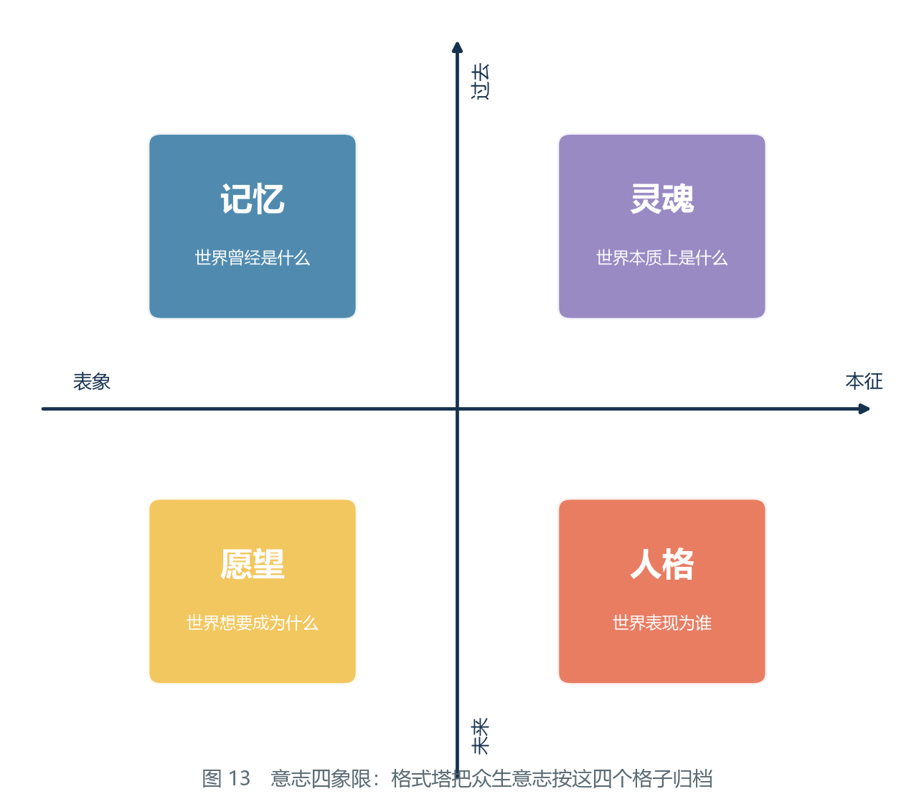

*图 13　意志四象限：格式塔把众生意志按记忆、愿望、灵魂、人格四个格子归档。两个轴分别是「表象—本质」与「过去—未来」。*

第二步，判断这个动作的方向。密合是减小 D 的算子（2.2 节）。因此，**收拢众生意志这个行为本身，是在加速坍缩。** **这一步的核对方式**：这里不需要估计数量，只需要定方向——多个人变成一个人，可区分者减少，方向为负。这正是 1.6 节的「同化」在主动语态下的样子。

第三步，判断他自封的位阶意味着什么。「新宇宙秩序」「不退还位阶」——他想成为那个**新的吸引子**。**这一步的核对方式**：把「吸引子」的定义（1.3 节）与「新宇宙秩序」这句话摆在一起——一个吸引子的全部内容，就是「别的东西都会向它靠拢」。他要的正是这个位置。

第四步，检查这个目标是否自洽。要成为一个新宇宙的吸引子，就必须**造出有差别的宇宙**；而他用来造宇宙的工具是密合——**一个只会减少差别的算子**。工具与目标方向相反。**这一步的核对方式**：把工具的方向与目标的方向并排写——目标是「多」，工具是「少」。这两个箭头不能接上。

第五步，看圣剑做了什么。圣剑切削的是众生意志，也就是**撤销了他那一次大规模的密合**。**这一步的核对方式**：注意原文的措辞是「**每一次挥动都切削了围聚在我周身的众生意志**」——原文自己把作用对象写清楚了：被切削的是意志，不是身躯。

**结论**：圣剑的效果**不是杀死他，而是撤销他的加速**。他被从「不退还位阶」打落，正是因为**支撑那个位阶的差别预算被撤走了**。他掉落之后说「我的人格回到了我的体内」——**人格本身就是一种差别，它回来了，他的人也就回来了。**

**等级与方向**：**回溯**（先知道这把剑击败了他，再回头找机制）；机制部分**乙级**——「收拢意志」与「密合」是同一个动作、「位阶由差别预算支撑」这两步都是翻译，原文没有这么说。事实部分（切削意志、人格回归、位阶跌落）为甲级。

**可推翻条件**：① 若原文出现表明他是因**身体受创**而跌落、与众生意志无关的证据，则「撤销密合」这条机制解释失效；② 若「众生意志」在方程上不计入 D（例如它属于某种不参与差别度统计的量），则切削意志不影响 D 的账目，机制解释失效；③ 若日后出现另一位以密合为工具却成功建成了「有差别的新宇宙」的存在，则第四步的「工具与目标方向相反」被推翻。

**这个结论为什么重要**：它把「圣剑为什么有效」从一个奇迹变成了一道算术题。同时它给出了一个残酷的判词：**他的新宇宙之所以「不完全」，不是因为力量不够，而是因为方法在帮倒忙。** 这解释了为什么他填不出那张「全图」，也解释了为什么他只能救五成到六成的人——**他不是在救，他是在合并。**

**本院特别提醒读者注意本案例的一个副产品**：圣剑不是变量。剑在系统之内，用的是系统之内的东西，做的是**撤销**一次已经在系统内发生的动作。**能够撤销一次加速，不等于能够改变终末。**世界仍然会走向终末（7.3 节），只是不再被他推着走。**把「撤销」误当成「改写」，是本案例最容易被读出的一个错。**

### 5.4 案例四：为什么变量必须是降临者

**问题**：既然知道要「引入系统之外的变量」，那么变量是什么？为什么必须是降临者？

**已知**：

| 编号 | 已知内容 | 来源 | 等级 |
|---|---|---|---|
| 甲 | 要改变结局，须引入「系统之外的『变量』」 | 原文 | 甲级 |
| 乙 | 要改 D\* = 0，唯一的办法是往系统里注入差别 | 本纪要 3.3 节 | 乙级 |
| 丙 | 系统内所有存在的差别都来自系统本身 | 本纪要的推论 | 乙级 |
| 丁 | 「唯有自身等价一个世界的人才能担此头衔」 | 原文 | 甲级 |
| 戊 | 变量作用的位置是「输入值」 | 原文 | 甲级 |

**推理步骤**：

第一步，明确需求。要改变 D\* = 0 这个不动点，唯一的办法是**往系统里注入差别**（3.3 节）。**这一步的核对方式**：回顾 4.2 节——系统内的操作改不了不动点。因此需求必须写成「注入」，不能写成「优化」。

第二步，排除内部选项。系统内部所有存在的差别，都来自系统本身，都会随系统一起被同化。**用系统内的东西补充系统，相当于从左手倒到右手**——总预算不变。**这一步的核对方式**：把那个存在放进方程里，看他的差别是从哪儿记上账的。若记在提瓦特这一本账上，他就属于提瓦特。

第三步，明确外部选项的条件。要真正增加总预算，注入者必须**不从系统支取差别**。**这一步的核对方式**：凡是「支取」，都会在系统内留下一笔对应的支出；只有不支取的账户，才能让总账增加。

第四步，翻译原文的判据。「唯有自身等价一个世界的人才能担此头衔」——**自身等价一个世界 = 自带一整套差别预算 = 不从系统支取**。

第五步，核对原文的实现方式。战败对话中，结社造物明确说是「**输入值**出现了变动」，而不是算式被改。这证明变量作用的位置是**递推的初始项**。

**结论**：变量必须是降临者，**不是因为降临者更强，而是因为他的差别预算不在系统内**。他的作用机制是「改初始项」，不是「改算子」，也不是「靠武力胜过对方」。

**等级与方向**：**回溯**（先有战败对话这段记录，再回来把它接进 3.3 节的框架）；整体**乙级**——原文给了判据（甲级），本院给了判据与方程之间的那一步翻译（乙级）。**若按 4.2 节的取最弱原则，本案例的机制部分不能高于乙级，而它的用法部分并不构成主张。**

**可推翻条件**：① 若出现一位**系统之内**的存在，其差别预算明显不由系统支取（例如某位存在被证明拥有独立于提瓦特的差别来源），则「必须来自系统之外」被推翻；② 若原文出现「算式本身被改动」的证据，则「作用位置是初始项」被推翻——此时变量的含义会从「改一个数」变成「改方程」，案例三与第七章的判词都要重写；③ 若「自身等价一个世界」被证明另有所指（与差别预算无关），则第四步的翻译作废。

**这个结论为什么重要**：它纠正了一个极容易犯的错误——把降临者理解成「一个特别能打的人」。如果降临者只是强，那么他仍然在系统内，仍然会被同化。**他的特殊性不在强度，在账户归属。**

**本院再补一句用法上的话**：本案例的四步判据不依赖任何具体的人。它的日常用途是**当场否掉一个提名**——若有人称某位强者为「变量」，本院可以只问三件事：他的差别记在哪本账上？原文说的是改输入还是改算式？他在系统里面还是外面？**三条里有任何一条答不上来，这个提名就不成立，而且不需要等到结果出来才知道。**

### 5.5 四案例横向对照表

把四个案例并排放在一起，可以看出它们的分工：

| 项目 | 案例一 | 案例二 | 案例三 | 案例四 |
|---|---|---|---|---|
| 问题 | 结果为什么恒定 | 同一图式为何有两种解 | 剑为什么有效 | 变量为什么必须是降临者 |
| 落在哪一层 | 动力层 | 动力层＋边界 | 动力层＋元层 | 逻辑层＋元层 |
| 关键依据 | 1.4 判据二 | 3.2 边界条件 | 2.2 密合 | 3.3＋原文判据 |
| 用到的已知 | 甲、乙、丙、丁、戊 | 甲～戊 | 甲～戊 | 甲～戊 |
| 推理步数 | 6 | 4 | 5 | 5 |
| 结论的一句话 | 不是命运，是唯一吸引子 | 不是矛盾，是两组边界条件 | 不是杀伤，是撤销 | 不是更强，是账户在外 |
| **方向** | 回溯 | 回溯 | 回溯 | 回溯 |
| **等级** | 乙 | 乙 | 乙（机制）／甲（事实） | 乙 |
| 主要推翻条件 | 第三种力 | 蛋壳的时间线 | 意志不计入 D | 出现系统内的变量候选 |

**这张表最该被记住的是倒数第三行与倒数第二行。**

**四个案例全部是回溯。**这符合 8.2 节对本纪要的整体盘点（八篇补论里七篇是回溯）。本院把这件事摆在表的正中间，是因为读者很容易把这一章读成「四个证明」——**它不是。它是四次解释。**解释得通与证明得了，是两件事。

**四个案例的等级全部落在乙级（案例三的事实部分除外）。**乙级的含义是「需要一步翻译」：从原文的措辞翻译到方程的语言。**这一步翻译是本纪要提供的，因此翻译错了，案例就错了。**

### 5.6 本章的边界：四个案例共同依赖什么

四个案例的写法和结论都不一样，但它们压在同一个地基上。本院把地基上的四块石头点出来：

**第一，D 必须是正确的状态量。**四个案例全部以「被计算的量是差别度」为前提。若 8.3 节反例三成立（存在另一个量能同时满足 2.1 节的三条线索），那么本章四个案例需要改换语言重写。

**第二，系统必须真的封闭。**案例二、三、四都用到了「外部／内部」这条界线。若蛋壳并未完全封闭（反例二），案例二的结论要改成「周期极长的循环」。

**第三，两种底层力必须都是收缩的。**案例一与案例三直接依赖这一条。这是 8.3 节列出的最脆弱一环。

**第四，「改写不动点必须来自系统之外」必须成立。**案例四整条压在这一条上。若 4.6 节第四条的紧张有了别的解法，案例四的结论方向不变，但「必须」二字要放宽。

**本章自评**：四个案例的可核对性并不相同。案例一的每一步都能被复算，案例二依赖一条时序判断，案例三依赖一次对措辞的细读，案例四依赖一步翻译。**本院对案例一最有把握，对案例四最没有把握**——而案例四恰恰是本院最常引用的一条。这一点本院如实写出，请读者引用时自行加权。

---
## 第六章　世界式使用教程

本章面向两类读者：一类是想**读懂历史**的读者，另一类是想**预判方案**的读者。两者的操作流程完全一致，只是应用的场合不同。

按本纪要的惯例，本院要先说清本教程的**能力范围**。它能做三件事：

1. 把一段已经成为历史的操作，翻译成方程上的动作；
2. 把一个尚未发生的方案，判断为「加速终末」或「不加速」；
3. 指出**有效的干预点在哪里**——注意是位置，不是方法。

它不能做三件事：

1. 它不能测量 D 的数值（8.4 节第 2 条），因此本教程给出的全部是**方向与结构**，不是数量；
2. 它不能预测具体的人会做什么（4.3 节）；
3. 它不作道德判断（6.4 节末）。

**把这三条记住，本章后面所有的操作都不会走偏。**

### 6.1 六步流程

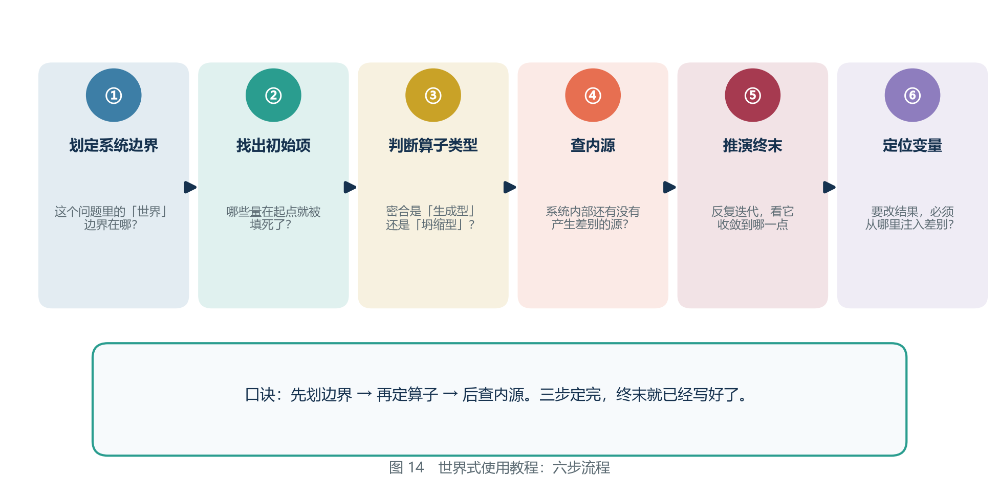

*图 14　世界式使用教程：六步流程。*

本院把六步里每一步都写成四个部分：**要问的问题／操作要点／做错会怎样／自检问句**。前两部分沿用原文的说法，后两部分是本次重编新增的——**因为本院在整理旧稿时发现，六步里出错最多的地方，全部集中在「做错会怎样」这一栏上。**

#### 第一步：划定系统边界

**要问的问题**：我这次分析的「世界」是哪一层？边界在哪里？

世界式只对**封闭系统**给出坍缩解。因此在动手之前必须先确定边界。常见的三种边界：

| 边界 | 举例 | 是否封闭 | 预期解 |
|---|---|---|---|
| 蛋壳之内 | 提瓦特整体 | 是 | 坍缩 |
| 某一国境内 | 枫丹、璃月 | 否（有外部往来） | 循环或缓慢衰减 |
| 某一组织内部 | 结社、教令院 | 否 | 视外部输入而定 |

**操作要点**：边界不是「范围」，是「有没有门」。同一片地方，把门算进去与不算进去，是两个不同的系统。

**常见错误**：不划边界就套结论。世界式推出的是「蛋壳之内终将归零」，**不是**「任何地方都会归零」。一个小系统如果有外部输入，完全可以长期维持。

**做错会怎样**：有两种错法，后果不同。

- **错法甲：把一个小系统当成封闭系统。**例：有人分析一个国家，直接引用「终将归零」。结论会错得很严重——这个国家在存在外部往来的期间，密合是生成型的，它的解应当是「循环或缓慢衰减」。**这种错法会让分析者误判时间尺度，把一个可能持续几百年的过程说成迫在眉睫。**
- **错法乙：把一个大系统当成开放系统。**例：有人分析蛋壳之内，却因为「各国之间有往来」而认为系统是开放的。这里被混淆的是**层级**：国与国之间的往来发生在系统**内部**，它不能给系统**增加**任何东西。**这种错法会让分析者误以为还有时间，而实际上外部输入早已断供。**

**本院给这两种错法一个统一的诊断**：它们都不是算错了，而是**把「边界」与「范围」当成了同一件事**。范围说的是我关心哪儿，边界说的是有没有东西从外面进来。

**自检问句**：如果把这道边界外侧全部涂黑，系统内的总量还会不会增加？答「会」，则系统是开放的；答「不会」，则封闭。

#### 第二步：找出初始项

**要问的问题**：在这个系统里，哪些量在起点就被填死了？

初始项 = 递推开头的几项 = 那些**不由此前的演化决定、而是被直接给定**的量。

在世界式的语境里，初始项包括：最初的元素分配、最初的存在者、最初被写下的法则。原文中「最早填入『世界式』的输入值」指的就是它们。

**操作要点**：初始项一旦填入，后续全部被锁定（1.1 节）。所以要改变结果，**改初始项是杠杆最大的操作**——这也是降临者起作用的位置。

**做错会怎样**：**把「中间发生的重要事情」当成初始项。**

例：有人把葬火之战当成初始项，理由是「它改变了一切」。但按定义，初始项是**不由此前的演化决定**的那些量；葬火之战是从此前状态演化出来的一个事件，它属于递推的中间项。**把中间项当成初始项，会得出一个很诱人的错误结论：「只要阻止那件事，结局就会不同。」**而实际上，重复计算给出的答案是：阻止了它，递推仍会走到同一个吸引子（1.3 节）。

**与之相对的正确做法**是问一句：**这件事如果被抹掉，方程还写得出来吗？**初始项被抹掉，方程无从开始；中间项被抹掉，方程改一个数就能继续写。

**自检问句**：这个东西是「被填进去的」，还是「被算出来的」？

#### 第三步：判断算子类型

**要问的问题**：这个世界里的主要操作，是**生成型**密合还是**坍缩型**密合？

判别方法：**看这个操作之后，可区分的东西变多了还是变少了。**

| 操作 | 类型 | 判断依据 |
|---|---|---|
| 有人生出一个新的人 | 生成型 | 可区分者 +1 |
| 有人把十个人的意志合成一个 | 坍缩型 | 可区分者 −9 |
| 有人把不同文化放在一起交流 | 生成型 | 产生此前不存在的混合形态 |
| 有人宣布「从此只有一个声音」 | 坍缩型 | 只剩一种声音 |

**操作要点**：判断的对象是**操作**，不是操作者的意图，也不是操作的口号。「把十个人的意志合成一个」与「让十个人互相理解」在口号上可能一模一样，在账目上差得极远。

**做错会怎样**：**把「交流」当成「合并」。**这是本步骤最常见的一种错，本院在补论一里见过它的一个变体（「味道混」——原料种类超过四象限承载上限，每格都被稀释；那是**差别过载**，不是坍缩）。

错法：有人看到一个方案「让各方坐到一起」，就判定它是生成型的。**判定的正确做法是问一句：坐到一起之后，是长出了此前不存在的东西，还是只剩一个声音？**前一种是交流，后一种是合并。**若判错，第四步与第五步会跟着全错，且错得毫无痕迹——因为整个分析从第三步起就在描述另一件事。**

**自检问句**：这个操作做完之后，我还能数出几个互相可区分的东西？

#### 第四步：查内源

**要问的问题**：系统内部还有没有能产生差别的源？

这是最容易漏掉的一步。在提瓦特的语境里，答案已经明确：**没有。** 两种底层力都是同化力，没有任何一种力被描述为「分化」。

但在分析**子系统**时，这一步必须重新做。例如分析一个国家时，内部是否有创新、是否有新的思潮，就是它的内源。

**操作要点**：**「维持」不是「产生」。**2.5 节那张表里，人界力对 D 的作用写的是「维持（但需要持续投入）」。维持是守住已有的，产生是造出没有的。**把维持记成产生，是这一步唯一的、也是足以致命的错误。**

**做错会怎样**：**把「维持项」当成「内源」。**

例：有人分析枫丹，看到律偿混能维持着一整套秩序，就判定「这个国有内源，因此不会归零」。**律偿混能是维持项：它需要持续投入，投入本身还要消耗成本（补论三）。**把维持项当内源之后，分析者会得出一个乐观的结论，而那个结论没有任何一处可以检验。

**本院顺手指出这一步与上层的关系**：回溯三里有一条修正——「系统内不存在产生差别的源」这句话，在人界力被改造**之前**是不成立的，因为那次改造本身是第一次「加源」。**所以第四步的答案带时间戳。**分析一个历史时段时，必须先问那是改造之前还是之后。

**自检问句**：这个源如果停止投入，它自己还会继续产生差别吗？答「会」，才是内源；答「不会」，它是维持项。

#### 第五步：推演终末

**要问的问题**：把上面四步的结果代入，这个系统的吸引子在哪里？

操作口诀：

- 封闭 + 无内源 + 算子收缩 → **收敛到零**
- 开放 + 有内源 → **循环或缓慢衰减**
- 封闭 + 有内源（但有限） → **先维持，源用尽后仍归零**

**操作要点**：这一步的产物不是一句话，是**一条曲线**：它在多长时间内维持、什么时候开始下降、下降有多快。**只说「会归零」而不说时间尺度的推演，是没做完的推演。**

**做错会怎样**：**跳过时间尺度，只交结论。**

例：有人推演两个方案，都得出「长期看会归零」，于是判定两者没有区别。**但若一个是一千年后归零，另一个是三十年后归零，这两个方案在现实中的分量完全不同。**本院在补论四里之所以要把灾难间隔算出一个具体的年数，正是为了让结论能被核对——**一条没有时间尺度的结论，既不能被支持，也不能被推翻。**

**本院还要提醒一种更隐蔽的错法**：把「收敛到零」与「已经到零」混同。系统在抵达吸引子之前会经过很长一段低但不是零的区间；**在这段区间里发生的事，与已经归零之后发生的事，是完全不同的两件事。**本院在补论五里正是靠这个区分来处理「谁能回来」的问题的。

**自检问句**：我给出的是一条曲线，还是一个点？

#### 第六步：定位变量

**要问的问题**：要改结果，必须从哪里注入差别？

如果系统是封闭的，那么注入只能来自**边界之外**（降临者）。如果系统是开放的，那么注入可以来自任何一个外部来源——此时「变量」不限于降临者。

**这一步是整套流程的产出**。前面五步都是为了确定：**有效的干预点究竟在哪里。**

**操作要点**：注意「位置」与「人」的区分。第六步给出的是一个**位置**（在哪儿注入），不是一个**人选**（谁来注入）。位置可以说得准，人选说不准——因为世界式对降临者无解（4.3 节）。

**做错会怎样**：**把「强」当成「在位置上」。**

例：有人分析一个困局，结论是「只要有一位足够强的存在出手就能改变」。这个结论把两个不同的东西混在了一起：强度是动力层的量，位置是元层的量。**一位系统内最强者的出手，最好的结果也只是让系统出错（4.2 节）。**按这个错误结论去行动，会把全部资源押在一个**位置不对**的人身上，而那个人的每一次进展都在替系统加速。

**另一种错法**是反向的：**把「位置空着」当成「位置不存在」。**回溯三的修正说得很清楚——变量是一个位，它可以空着。**空着的时候，唯一正确的结论是「现在没有干预点」，而不是「干预点在别处」。**

**自检问句**：我要注入的东西，记在哪一本账上？

#### 六步流程一页速查

| 步 | 问题 | 产出 | 最常错在哪儿 | 自检问句 |
|---|---|---|---|---|
| 一 | 边界在哪 | 一个封闭或开放的系统 | 把「范围」当「边界」 | 外侧涂黑后总量还增加吗 |
| 二 | 什么被填死了 | 初始项清单 | 把中间项当初始项 | 是填进去的还是算出来的 |
| 三 | 算子在增还是在减 | 生成型或坍缩型 | 把交流当合并 | 做完还能数出几个 |
| 四 | 内部还有源吗 | 有／无（带时间戳） | 把维持项当内源 | 停掉投入它还产吗 |
| 五 | 吸引子在哪 | 一条曲线 | 只给点不给曲线 | 是曲线还是点 |
| 六 | 从哪儿注入 | 一个位置 | 把强当成在位 | 记在哪本账上 |

**本院要补一句关于六步之间的关系的话**：这六步不是并列的，而是**两两成对**的。第一步与第二步定下**题的形状**——边界与初始项决定了这道题能不能被写出来；第三步与第四步定下**算子的性质**——增还是减、有没有源；第五步与第六步才是**结论与出口**。**跳过前两步直接做第五步，是本院见过的最常见的做法，也是错得最没有痕迹的一种**：因为跳过之后，人仍然能写出一句像结论的话，只是那句话说的其实是另一道题。

### 6.2 判别树：快速判断一个方案是否在加速终末

实践中最高频的需求不是「推演终末」，而是**「这个方案到底是帮忙还是帮倒忙」**。为此本院给出一棵判别树。

*图 15　判别树：这个方案在加速终末吗？*

**本院把判别树改写成了一组可以照着走的步骤。**每一步都给出一个明确的判断动作、两种去向，以及一个「答不上来时怎么办」。请读者按顺序走，不要跳步。

**判别步骤 1：先把方案的一句话主张抄下来。**

不是抄它的名字，也不是抄它的口号，而是抄它**要做的那件事**。写成「把 X 变成 Y」的形式。

- 抄不出这一步 → 停止。**一个说不清要做什么的方案，不进入判别。**
- 抄得出来 → 进入步骤 2。

**判别步骤 2：这个方案是不是在「合并差别」？**

具体地看两件事——它是否要求众生意志趋同？它是否消除了多种可能？

- 任一项为「是」→ 该方案在**加速终末**。判定的答案是「是」，**流程到此结束**，不必再看动机。
- 两项皆为「否」→ 进入步骤 3。
- **答不上来**（例如不知道它会不会导致趋同）→ 进入步骤 2 之二。

**判别步骤 2 之二：把方案的效果按「可区分者的数量」重述一遍。**

问：方案实施之后，在它作用的范围内，**能被互相区分的东西**是变多了、变少了，还是不变？

- 变少 → **加速终末**。
- 不变 → 视为不加速，但记一笔「无效果」。
- 变多 → **只有在存在外部输入或内源的前提下才成立**；请回到 6.1 第四步核对内源，若内源不存在，那么「变多」只是表象——**封闭系统里的新组合，总数其实在减少**（3.2 节）。
- 仍然答不上来 → **本树给不出结论。**请如实报告「无法判定」，不要挑一个看起来顺眼的答案。

**判别步骤 3：这个方案的动机是什么？**

注意，这一步**不改变判断，只改变评价**。一个方案如果步骤 2 就命中「是」，那么无论它自称救世还是治愈，它在数学上都在加速坍缩。

本院把这句话摆成一条判据，因为它是本教程最容易被违反的一条：

> **判据：不问动机，只问方向。**

**判别步骤 4（可选）：定位它的干预点。**

若步骤 2、3 都没有命中，那么可以问最后一句：**这个方案打算从哪儿注入差别？**若它能指出一个**在边界之外**的来源，它是一条有效的干预路径；若它只能在系统内搬动现有差别，它最多让系统出错，不能改变结局（4.2 节）。

**本院把这棵树的使用纪律写在这里**：

1. **不许跳步。**本院见过最多的误用，是直接跳到步骤 3 去评价动机，然后凭动机的好坏反推步骤 2 的答案。
2. **不许改答案。**步骤 2 的答案只有三个：「是」「否」「答不上来」。**「答不上来」是一个合法的答案，而且是本院最常给出的那一个。**
3. **不许拿它当判决书。**判别树给出的是「这个操作在方程上做了什么」，不是「该不该做这件事」（6.4 节）。

### 6.3 三个最容易犯的错误

**错误一：把「毁灭」和「合并」混为一谈。**

后果：误以为终末是可以靠「抵抗」来避免的。**合并不是敌人打过来，合并是大家走到一起。** 你无法用「抵抗」来应对一个由全体成员共同完成的过程。

**本院补一句更具体的**：这个错误之所以常见，是因为它有两种伪装。**伪装甲：把终末想成一场灾难。**于是防灾难的思路（修堤坝、备粮、练兵）全部用在了错的地方。**伪装乙：把「没有敌人」当成「没有危险」。**于是既然没有敌人，就不必防备——两种伪装指向相反的行动，但都由同一个误读生出。

**错误二：把「强」当作「有效」。**

后果：把希望寄托在最强的人身上，而那个人同样在系统内、同样会被同化。**有效的干预不取决于强度，取决于账户归属**（5.4 节）。

**本院补一句**：这个错误有一个近亲，就是**把「规模」当作「有效」**——认为足够大的工程、足够多的资源就能改变结局。规模同样是动力层的量。**一个横跨诸国的工程与一个村庄的决定，在「位置对不对」这件事上，可能完全一样。**

**错误三：只改算子，不改输入。**

这是最隐蔽的一个错误。想通过「优化系统」「修补法则」来改变结局，是在**改算子**；而算子的收缩性是结构性的，改不动。原文里那句「最早的输入值出现了变动」提示了真正的杠杆所在——**改输入。**

**本院补一句为什么它最隐蔽**：因为「修补法则」在系统内部看起来**最像**正确的事——它有明确的对象、有可检验的进展、有可以写进报告的成果。而「改输入」要求先站到系统外面去，那一步没有报告可写。**最隐蔽的错误，往往是那个看起来最勤勉的错误。**

### 6.4 一个完整的推演示范

为了让读者掌握流程，本院用一个虚构但结构完整的例子走一遍。

**情境**：某国计划推行一项政策，要求全国所有工匠使用统一的图纸与统一的工序，理由是「提高效率、减少差错」。

**第一步，划边界**：该国不是封闭系统（有对外贸易与人员往来）。因此不能直接套「必然归零」的结论。

**第二步，找初始项**：该国的初始项包括地形、资源分布、已有的工艺传统。这些在政策实施前就已被填死。

**第三步，判断算子类型**：政策要求「统一图纸、统一工序」，其效果是**把多种做法合并为一种**。可区分者减少 → **坍缩型密合**。

**第四步，查内源**：政策实施后，该国工匠内部的创新来源被切断（不允许使用非标准做法）。但**外部输入仍然存在**（贸易、交流）。因此内源受损，但并非完全断绝。

**第五步，推演**：短期内效率上升（合并确实降低了协调成本）；中长期，该国的工艺差别度持续下降，**一旦外部输入中断，将迅速失去应变能力**。

**第六步，定位变量**：要保留长期韧性，必须**保留外部输入的通道**，或者在内部保留一个受保护的「变异区」。

**结论**：该政策不是「坏」，而是**在差别度上做了一次提现**。它用长期韧性换取了短期效率。是否值得，取决于该国是否能在提现之后补回账户——**而补回的方式，只能靠外部输入。**

请读者注意这个示范的写法：**全程没有出现任何道德判断**。世界式只回答「这个操作在方程上做了什么」，不回答「这样做对不对」。后者是审判庭的事。

**本院再把这个示范的「已知来自哪里」补全**，因为示范若不标出处，就变成了故事：

| 步骤 | 用到的规则 | 出自 |
|---|---|---|
| 一 | 封闭系统才给坍缩解 | 3.2、3.3 节 |
| 二 | 初始项被填死，后续锁定 | 1.1 节 |
| 三 | 可区分者增减定算子类型 | 2.2 节 |
| 四 | 「维持」不等于「产生」 | 2.5 节 |
| 五 | 三种情形对应三种解 | 6.1 第五步 |
| 六 | 注入只能来自边界之外 | 4.3 节 |

**这段示范的等级与方向**：整段是**回溯**（情境是本院虚构的，规则不是），**等级为乙级**——情境本身不是史料，它的用途是演示流程，不能被引用为对任何真实政策的判断。**本院把它标出来，是为了防止读者把它当成一条结论传播出去。**

### 6.5 常见误用清单

本院把历年来见过与想见的误用整理成一张清单。**这张清单与 6.3 节那三条不重复**：6.3 讲的是三个**根本性的误解**，本清单讲的是**操作层面的具体错误**——它们每一个都发生过，或者随时可能发生。

| 编号 | 误用 | 为什么错 | 正确做法 | 见 |
|---|---|---|---|---|
| 一 | 拿世界式去判对错 | 它只说方程上做了什么，不说该不该做 | 判断留给审判庭；本院只报方向 | 6.4 节末 |
| 二 | 用「最终会归零」论证「现在做什么都没用」 | 归零是终末，不是当下；中间那一段的长度才是决策依据 | 先给出曲线与时间尺度 | 6.1 第五步 |
| 三 | 把「维持」记成「产生」 | 人界力是维持项，需持续投入 | 停掉投入还产不产，答「不产」就不是内源 | 2.5、6.1 第四步 |
| 四 | 把「范围」当「边界」 | 范围是我关心哪儿，边界是有没有门 | 用「外侧涂黑」自检 | 6.1 第一步 |
| 五 | 把中间事件当初始项 | 中间项是被算出来的，抹掉后方程仍能写 | 问「抹掉它方程还写得出吗」 | 6.1 第二步 |
| 六 | 把「交流」等同「合并」 | 一个有新形态，一个只剩一种声音 | 数做完之后还剩几个可区分者 | 6.1 第三步 |
| 七 | 把「强」或「大」当成「有效」 | 强度与规模都是动力层的量 | 问账户归属，不问力量 | 5.4、6.3 |
| 八 | 把圣剑式的「撤销」当成「改写」 | 撤销一次加速改变不了吸引子 | 撤销归撤销，D\* 归 D\* | 5.3 节末 |
| 九 | 给回溯结论贴上验证过的标签 | 回溯不构成证据 | 引用时保留方向标记 | 8.2 节 |
| 十 | 在变量位空着的时候找一个替代者 | 位置空着不等于位置在别处 | 如实报告「此刻没有干预点」 | 回溯三 |
| 十一 | 跳过步骤 2 直接评动机 | 动机不改变方向，只改变评价 | 先答「是否合并差别」 | 6.2 |
| 十二 | 用「好像没毛病」盖章 | 那报告的是感受，不是推理的属性 | 三步核验：断言、推翻条件、找反证 | 8.3 之二 |

**本院对这张清单的使用建议**：它是一张**校对表**，不是判决书。任何一份基于世界式的分析写完之后，本院建议按此表逐行过一遍——**十二行里有一行对上了，那份分析的结论就要重写。**

本院必须说明，这十二行里有**六行是本院自己在整理旧稿时才发现的**：它们曾经出现在本纪要早期的段落里，后来被本院自己删去或改写。**附录 D 记着那些修正。**把这句话写在这里，不是为了表示谦虚，而是为了说明一件事：**这张清单的用处与它的来历成正比——它来自犯过的错，不来自想出来的可能。**

### 6.6 本教程的边界与被推翻条件

**边界一：本教程不能测量。**8.4 节第 2 条已经把这条摆在台面上——D 没有测量方法。因此本教程的全部输出都是**方向**，不是数量。**任何把本教程的结论读成「大约下降百分之几」的用法，都是误用。**

**边界二：本教程不能判定意图，也不能判定善恶。**它在最好的情况下能回答「这个操作在方程上做了什么」。

**边界三：本教程的六步全部依赖一个不可检验的前提——「自洽」**（4.2 节前提二）。这一条无法由内部检验，本院只能把它挂在这里，让读者知道它一直悬在头顶。

**本教程在什么情况下会被推翻？**

1. **若 8.3 节反例一成立（出现第三种力）**，第三步与第五步的表格全部要重排——「内源不存在」这句话消失，六步流程的第四步会从「查有无」变成「估大小」。
2. **若 8.3 节反例二成立（蛋壳并未完全封闭）**，第一步判出的「封闭」将只是一个近似，第五步给出的「收敛到零」要改成「周期极长的循环」。
3. **若 8.3 节反例三成立（差别度不是正确的状态量）**，那么整本教程不是需要修改，而是**需要重写**。

**本院对本章的自评**：六步流程是本院写得最踏实的一部分，因为它的每一步都能被另一个人照着做一遍。而 6.2 节那棵判别树是本院用得最多、也最担心被滥用的一部分——**它的输出太干脆了，「是」或「否」，干脆到容易被当成判决。**本院把三条使用纪律写在树下面，正是为了拖慢它的读者。

---
## 补论一　用世界式推算甜甜花酿鸡的配方

### 一、缘起：为什么要在纪要里写一道菜

补论一的起点是一句抱怨。

第六章的六步流程写完之后，研究员先给偷渡客看。偷渡客读完，说了这么一句：

> **「流程我看懂了。可是我用不上。」**

他接着说了一句更要命的话：

> **「我又不是降临者。按你们第四章的结论，我改不了那个结局。你给我一套推演结局的工具，是让我看着它发生吗？」**

这批评是对的，而且提意见的人恰恰是最有资格提的那一个——**他是唯一一个既看得懂这套工具、又确实拿它没办法的人。**

**本院在动笔之前，先把「用不上」这三个字拆开。** 因为这三个字里其实叠着三条性质完全不同的意见，而它们对应的补救办法也不同：

| 那句话的碎片 | 字面上的意思 | 在方法上对应哪一步 |
|---|---|---|
| 「我看懂了」 | 流程本身没有歧义 | 不是抱怨，是合格证 |
| 「用不上」 | 这套流程要的输入量，提意见的人拿不到 | 6.1 节第一步与第二步：边界与初始项是否可知 |
| 「我看着它发生」 | 结论出来也改不了 | 6.1 节第六步：变量位是否在自己手里 |

三条里只有后两条是真问题。而这两条恰好是六步流程里最容易被跳过的一头一尾。**一套工具如果只在「边界已知、初始项已知、变量位在手」的时候好用，那它就是一台预言机，不是一件工具。**

本院接受的正是这个意见。于是两人决定做一次**降维演示**：找一个日常的、具体的、可以立刻验证对错的问题，用完全相同的流程走一遍。

**本院给这次演示定了四条选材标准：**

| 标准 | 要求 | 为什么要有这一条 |
|---|---|---|
| 边界清楚 | 系统的边界能被一句话指出来 | 否则第一步就没法走 |
| 初始项可数 | 起点被填死的量不超过一只手 | 否则推演会退化成穷举 |
| 结果可立即验证 | 做出来尝一口就知道对错 | 否则本院可以事后编圆 |
| **有已知答案** | 这件事在厨房里早就有定论 | **这是标定，不是证明** |

理由很直接：**如果这套流程是对的，它就应该在小事上也能给出正确答案；如果它连一道菜都算不出来，那么它在世界尺度上的结论也就不值得信。**

**这里必须把第四条标准的分量说清楚，因为它是本补论最容易被误读的地方。** 用一道已知答案的题目去跑一套流程，得到的不是「这套流程正确」的证明——已知答案的题目本来就有一个答案摆在那里，谁去跑都能凑上。它得到的是**标定**：如果流程连已知答案都跑偏，那它一定有毛病，不必再拿它去算未知的东西。

**方向：回溯。等级：甲级。**（本院确实先选了题、再跑的流程，这一次序是有记录的。）**推翻条件：**若本纪要在别处显示本院是先算出了结果、再回头去找一道对得上的菜，本条作废，本补论的方法意义也随之作废。

**本文选定的题目是蒙德地区最常见的一道家常菜：甜甜花酿鸡。**

选它的理由有三条。第一，它的配方极其简单（只有两味原料），排除了干扰变量。第二，它的对错可以**立即验证**——做出来尝一口就知道。第三，也是最重要的一条：**它的名字本身就是一个算式。**

### 二、第一眼：菜名就是算式

请读者把这道菜的名字拆开读：

　　　**甜甜花　酿　鸡**

- 「甜甜花」是**表象**：颜色、香气、那点甜——它是这道菜**看起来、闻起来**的样子。
- 「鸡」是**本征**：肉、骨、脂——它是这道菜**实质上**是什么。
- 「酿」是**算子**：酿不是「放在一起」，酿是**让一味进入另一味之中，出来之后两者不再是原来的两者**。这正是 2.2 节所定义的**密合**。

于是菜名可以直接改写为：

　　　**表象 ⊕ 本征 = 甜甜花酿鸡**

而 2.2 节已经给出：表象是 3，本征是 4，密合是 7。

　　　**3 ⊕ 4 = 7**

**这道菜的名字，就是世界式的算子那一条。** 蒙德的厨师当然不知道自己在做什么数学，但他们把公式写进了菜名里，一代代传了下来。

**为了说明「酿」这个字不是随便挑的，本院把厨房里几个相邻的动词摆在一起对照：**

| 动词 | 两种原料发生了什么 | 出来之后还能不能认出两者 | 是不是 2.2 节的密合 |
|---|---|---|---|
| 拌 | 并置，各自保留原状 | 能，且一眼能分开 | 否 |
| 煮 | 同处一锅，互相交换一点味道 | 能，但边界变软 | 否（只是趋近） |
| 烤 | 单向失水，变化的只有一方 | 能 | 否 |
| **酿** | **一味进入另一味的结构里，两者都被改写** | **认得出，但已经不是原来那个** | **是** |

**这张表说明了为什么四象限那道题必须用「酿」来出。** 拌与煮都没有产生新的可区分要素，它们只是把两样东西放在更近的地方；酿则不同——**它让 1 + 1 变成了一个此前不存在的第三样东西，而前两样东西还在。** 这正是密合的定义。

**量纲上的检查也过得去。** 表象是 3，本征是 4，密合的结果位是 7——三个数分别对应「表象格数、本征格数、合成后的总格数」，没有一个是无量纲的系数。**读者若在别处见到有人把它写成「3 + 4 = 7」而丢掉那个 ⊕，那是把算子写成了加法。** 加法是可逆的（7 减 4 得 3），密合不可逆（从一道菜里退不出原来的鸡和花）。这个区别在厨房里就是：**菜做成了就退不回去，但账可以倒着算。**

**方向：回溯。等级：丙级（形状对应）。** 本院的主张只是「菜名的构词结构与 2.2 节的算子同形」，不是「蒙德的厨师知道这个结构」。**推翻条件：**若能证明蒙德菜名里的「酿」是后起的雅称、而实际做法与「煮」无异，或者存在大量「表象味 + 酿 + 主料」结构的菜名却完全推不出七位的对应，则本条作废。

### 菜名这一层的三条误读

**本院把这一层单独写成一小节，因为它是本补论里最容易被拿去乱用的地方。**

**误读一：把菜名当成密码。** 有人会想：「既然菜名就是算式，那蒙德人是不是掌握了一套失传的数学？」本院的主张比这弱得多。**名称只说明结构，不说明知识。** 一个人可以把房子盖得完全符合力学，而从未学过力学——他靠的是无数次倒塌筛出来的经验。

**误读二：以为凡是「A 酿 B」的菜都符合这个式子。** 不对。要成立，得同时满足两条：A 确实占的是表象侧（颜色、香气、入口第一印象），B 确实占的是本征侧（这道菜实质上是什么）。**如果某道「酿菜」的主料其实是调味料，那它的格子就填反了**，此时的 3 ⊕ 4 只是字面拼得像，结构上不成立。

**误读三：拿菜名去证明世界式。** 这是本院最想拦住的一条。**一个丙级的形状对应，不能用来支持它所对应的那个框架。** 菜名能提示、能帮助记忆、能在课堂上当例子，但它不能定案——把例子当证据，就是本院在第 8.1 节里警惕的那种循环。

**丙级证据的正确用法，本院列成一张小表：**

| 用法 | 可以不可以 |
|---|---|
| 当作理解框架的辅助例子 | 可以 |
| 当作寻找新案例的线索 | 可以 |
| 当作支持框架的证据 | **不可以** |
| 当作反驳框架的理由 | 也不可以（同样拿不动） |

### 六步流程与本文的对照

**本补论后面十三节的内容，其实就是六步流程在一口锅上走了一遍。** 本院先把总账列在这里，读者读后面各节时可以直接对着看：

| 6.1 节的步骤 | 这一步要问的问题 | 本补论在哪一节回答 | 本文给出的答案 |
|---|---|---|---|
| 第一步：划定系统边界 | 这次的「世界」是哪一层，边界在哪里 | 见第三节 | **锅**——开放系统，火是外源 |
| 第二步：找出初始项 | 哪些量在起点就被填死了 | 见第四节 | 部位与状态、采摘时机、锅的材质、水量 |
| 第三步：判断算子类型 | 操作之后可区分的东西变多了还是变少了 | 见第五节 | **两支同时存在**，谁占上风由火决定 |
| 第四步：查内源 | 系统内部还有没有能产生差别的源 | 见第六节 | **有**——甜甜花里的糖 |
| 第五步：推演终末 | 这个系统的吸引子在哪里 | 见第七节 | 先升、到峰、再一路趋向 0 |
| 第六步：定位变量 | 要改结果，必须从哪里注入差别 | 见第八节 | **补空着的格子**，不是往锅里加味 |

**这张表还有第二个用处：它是本补论的骨架，也是它的诊断顺序。** 读者如果对结论有异议，只要指出是六步里的哪一步错了，本院就知道该改哪一节。**这比笼统地说一句「不对劲」有用得多。**

### 三、第一步：划定系统边界

按 6.1 节，必须先问：**这次的「世界」是哪一层，边界在哪里？**

三种候选边界：

| 候选边界 | 是否封闭 | 是否可用世界式 | 判断 |
|---|---|---|---|
| 整间厨房 | 否（与外界通风、有人进出） | 开放解 | 边界太松，什么都算不出 |
| **锅** | **否（火从下方进入，蒸汽从上方逸出）** | **开放解** | **✔ 本补论采用** |
| 一口密封的压力锅 | 是 | 封闭解 | 会算出「必然糊掉」，与事实不符 |

**采用「锅」作为边界。** 这是一个**开放系统**——它有外源，外源就是**火**。

这一点极其关键，而且它正是这道菜能做成的**全部原因**。请读者记住：**如果锅是封闭的，世界式在这里给出的结论是它必然走向 D = 0，也就是一锅无法再分辨的东西。烧糊不是一个意外，它是封闭系统的终末态。**

**边界选得对不对，有一个很实用的判据：本院能不能在这个边界上把账记清楚。** 边界画在哪儿，决定了「进来的」和「出去的」各是什么。锅这一层，账目是三进三出：

| 通道 | 方向 | 进来的是什么 | 出去的是什么 |
|---|---|---|---|
| 锅底 | 进 | 热（外源） | —— |
| 锅口 | 出 | —— | 水蒸气、挥发性香气 |
| 锅壁 | 双向 | 少量热回流 | 少量热散失 |

**这三条通道就是「开放」的全部含义。** 它们同时说明了为什么这道菜既有上限（香气会随蒸汽跑掉）又有容错（火可以随时调）。

**读者可能会问：既然压力锅算出来是「必然糊掉」，而现实里压力锅也能把东西做熟，这不是说明世界式错了？**

**本院分三点回答。第一，世界式只对封闭系统给出坍缩解，这一条在 6.1 节写得很清楚；压力锅把这个系统从开放改成封闭，因此「趋向 D = 0」这条结论是被正确地套用了，不是被套错了。第二，压力锅做熟东西，靠的是封闭带来的高温高压，这属于「跑得更快」，与「跑到哪里去」是两件事。第三，本院在这里不主张压力锅做不出好菜**——本院主张的是：把边界关死，等于把这道菜的容错区间关掉了。

**方向：预测。等级：丙级。** **推翻条件：**若有读者按同一套流程、把边界定在压力锅上做一次对照，发现成品在可区分要素上并不比开口锅更少（例如香气层次反而更丰富且能被稳定复现），本条作废。

### 边界不止三种：一个中间地带

**上表列的三种边界是典型的三种，实际厨房里还有一大片中间地带。** 本院把它们补在这里，因为它们最能说明「开放」到底是什么意思：

| 容器 | 有没有能量通道 | 有没有物质通道 | 判定 |
|---|---|---|---|
| 敞口铁锅 | 有（锅底受火） | 有（蒸汽自由逸出） | 开放 |
| 盖盖砂锅（留缝） | 有 | 有（缝里冒气） | 开放，但物质通道窄 |
| 蒸笼 | 有（蒸汽从下方来） | 有 | 开放，且外源是物质而不是火 |
| 陶罐埋炭 | 有 | 几乎没有 | 接近封闭 |
| 密封压力锅 | 有 | 没有 | 封闭 |

**读这张表只需要一条原则：封闭不封闭，看的不是容器紧不紧，而是有没有一条通道被彻底关死。** 关死一条物质通道，系统就少一个出口；出口一少，能跑掉的差别就少，但**能被新生成出来的差别也少**——因为生成型的反应往往也要靠这一条通道上的交换来维持。

**这一条与第二卷的写法可以对上。** 第二卷 7.2 节说的是同一件事的另一半：**截断破坏了对称性，因此需要反项来修补。** 那里的「截断」是把一个能标以上的东西一刀切掉，这里的「盖死锅口」是把一条通道一刀切掉——**两者都会给出一个上限，而两者都要为这个上限持续付钱**（锅里的代价是香气出不去、味道变闷；第二卷的代价是需要反项）。本院把这条对应标为**丙级**，因为它只是形状上的对应。

### 四、第二步：找初始项

初始项是那些**在下锅之前就已经被填死、此后不再改变**的量。对这道菜来说有四项：

| 初始项 | 具体内容 | 影响哪个量 |
|---|---|---|
| **禽肉的部位与状态** | 腿肉还是胸肉、新鲜还是久置 | 本征的上限（这道菜最多能有多「实」） |
| **甜甜花的采摘时机** | 花开到什么程度 | 表象的强度（这道菜最多能有多「香」） |
| **锅的材质与形状** | 铁锅、砂锅、平底还是深口 | 外源的传导效率（火能多快进入系统） |
| **水量** | 下锅时加了多少水 | 系统的「缓冲」，见第六节 |

**为什么这四项被称作初始项？** 因为它们**在烹饪过程中不再改变**。火可以调、盐可以补，但你不能在半途把胸肉换成腿肉。初始项一旦填入，后续全部被锁定（1.1 节）——**这一条在厨房里的意义是：一道菜的上限，是在开火之前就决定了的。**

> **本院按**：这是本补论中最实用的一条推论。所有的「补救」都只能在初始项允许的范围内进行。

**但「中途不能改」只是一个好记的说法，它不足以把初始项与变量分开。** 本院在实际分类时用的是下面三个追问，三个都答「是」才算初始项：

| 追问 | 答「是」意味着 | 反例（答「否」的东西） |
|---|---|---|
| 中途能不能改？ | 不能改，或改了等于重开一锅 | 盐、火、翻动——都能中途改 |
| 它是不是由此前的演化决定的？ | 不是，它是直接被给定的 | 汤的浓稠度——是熬出来的 |
| 改掉它以后，这道菜还算不算同一道菜？ | 不算，等于换了一道菜 | 换个盘子、换把勺子——还是同一道菜 |

**用这三个追问过一遍，四项初始项全部通过，而「盐」「火候」「下锅的顺序」全部被挡在外面。** 这个分类不是在抠字眼：**它决定了本补论后面所有「补救建议」的射程。**

**本院还要在初始项里再分一层，因为它们的性格并不一样：**

| 类型 | 本补论里的例子 | 它限制的是什么 | 补它的代价 |
|---|---|---|---|
| **上限类** | 禽肉的部位、甜甜花的采摘时机 | 这道菜最高能到多少 D | 无法中途补，只能重做 |
| **速率类** | 锅的材质与形状、水量 | D 上升得多快、多久到峰 | 可以中途微调（添水、挪锅） |

**上限类初始项决定天花板，速率类初始项决定到达天花板要多久。** 一道菜「做坏了」的两种典型情形，正好一个对应天花板太低，一个对应没走到天花板。

**方向：回溯。等级：乙级。**（「上限在开火前决定」是从 1.1 节「初始项一旦填入、后续全部被锁定」推出来的，本补论只是把它搬到了厨房。）**推翻条件：**若能举出一道菜，其二者的成品上限在中途被某一项单一操作整体改写（例如一次换汤就把一道原本上限很低的菜救成上限很高的菜），则本条需要收窄为「只对上限类初始项成立」或作废。

### 五、第三步：判断算子类型

按 6.1 节，判断标准是：**这个操作之后，可区分的东西变多了还是变少了？**

加热这道菜时，两件事同时发生：

**向上的一支（生成型）**：糖与氨基酸在高温下反应，生成大量新的香气化合物；甜甜花里的糖分受热后焦糖化，产生新的风味；肉的脂肪氧化，产生新的香气。**这些都是此前不存在于原料中的、全新的可区分要素。**

> **偷渡客按**：上面这三条在我故乡的食品化学里叫美拉德反应、焦糖化与脂肪氧化，都是有名字的。研究员听完之后说：「所以火是在替食材做它自己做不完的事。」——我认为这个说法比我的术语好。

**向下的一支（坍缩型）**：水分持续蒸发，组织结构持续软化，原本泾渭分明的「肉」「花」两种质地逐渐靠近。

于是密合在这道菜里**同时具有两种形态**。哪一支占上风，取决于**火**——也就是外源。

　　　**火旺 → 生成型占上风 → D 上升**
　　　**火衰 → 坍缩型占上风 → D 下降**

**本院在这里要补一个操作性的细节：这两支不是「一个开一个关」，而是同时开着、只是速率不同。** 这一点很要紧，因为它决定了「火候」不是一道开关题，而是一道配比题：

| 阶段 | 生成型在做什么 | 坍缩型在做什么 | 净效果 |
|---|---|---|---|
| 刚下锅 | 尚未启动（温度不够） | 缓慢（组织开始软化） | 微降或持平 |
| 前段 | 快速启动、化合物大量产生 | 失水，但结构还撑得住 | **上升** |
| 峰值附近 | 速率开始被原料余量拖慢 | 速率随失水加快 | **持平** |
| 后段 | 几乎停止（可反应的东西用完了） | 继续，且不可逆 | **下降** |

**请读者注意第三行那句「被原料余量拖慢」。** 生成型密合需要反应物，反应物来自原料本身；坍缩型只需要时间和热。**于是两者在时间上的走势天生不同：一个越跑越慢，一个越跑越快。** 任何两条这样的曲线都必然相交——**这就是峰值存在的理由，不需要额外假设。**

**一个可以当场用的判别问题：** 「如果现在关火，锅里的可区分要素比刚才多还是少？」这个问题比「这道菜该不该多烧一会儿」好回答得多，因为它问的是方向，不是程度。

### 六、第四步：查内源

按 6.1 节，要问：**系统内部还有没有能产生差别的源？**

**有，而且这正是甜甜花的作用之一。**

甜甜花的花瓣富含糖分。加热时，这些糖分自身会焦化，**不需要外来原料就能生成新的风味物质**。也就是说：

　　　**甜甜花在这道菜里同时扮演两个角色——它既是「表象」，又是内源。**

这一点解释了一个日常经验：**为什么加了甜甜花的菜比较「耐烧」。** 因为它自带一个微弱的差别发生器；在火候稍过的阶段，这个内源还在往系统里补充新的差别，为厨师争取了时间。

相比之下，纯肉菜（例如只有禽肉）没有这个内源，一旦火候过了，D 就只剩下降一条路。

| 料理类型 | 是否有内源 | 容错区间 | 厨房里的说法 |
|---|---|---|---|
| 纯肉菜 | 无 | 窄 | 「难伺候，一过就柴」 |
| **加了含糖/含香辛料的菜** | **有** | **宽** | **「耐烧，好做」** |
| 纯蔬菜清汤 | 有（但极弱） | 中 | 「清淡，火候要求高」 |

> **本院按**：这张表是本院在食堂实测总结的，与方程给出的预测一致。**「好做的菜」在数学上就是「自带内源的菜」。**

**本院把「内源」这个概念再往下切一层，因为这一个词后面要跨卷用到别处。** 内源至少有两种，它们的脾气完全不同：

| 内源类型 | 它自己会变成新差别吗 | 本补论 / 本卷的例子 | 用完之后 |
|---|---|---|---|
| **结构内源** | 会——它本身就是原料 | 甜甜花里的糖（见本节） | 有储备上限，用尽即止 |
| **催化内源** | 不会——它只是让别的反应更快更均匀 | 落落莓里的果酸（见补论二第六节） | 几乎不消耗，但缺了就不成 |
| **储备内源** | 会，但总量固定 | 一切「自带糖分」的食材 | 一次性，用完就只能靠外源 |

**这个分法在厨房里对应一句话：结构内源决定这道菜能撑多久，催化内源决定这道菜做得匀不匀。** 两者都不改变初值，只改变过程。

**但本院必须提醒读者一件事：内源是有限的。** 6.1 节第五步的口诀里有一行写的正是这种情形——**封闭 + 有内源（但有限）→ 先维持，源用尽后仍归零**。厨房里的内源属于「有限」那一档，所以它买到的是时间，不是豁免。

### 七、第五步：推演终末——火候的数学定义

现在把前面四步的结果代入，画 D 随加热时间变化的曲线。

*图 16　甜甜花酿鸡的 D(t) 轨迹。火候就是曲线最高那一点；越过它之后，D 一路衰减，最终趋向 0——那就是糊了。*

曲线的形状分三段：

**第一段（上升）**：火作为外源持续注入能量，生成型密合占上风，新的香气化合物不断产生。**D 上升。**

**第二段（峰值）**：生成速率与坍缩速率相等。**D 达到最大值。**

**第三段（下降）**：水分散失、结构塌缩，而新的可区分要素已经不再产生（糖分用尽、可反应的氨基酸用尽）。**D 单调下降，一路趋向 0。**

于是本院得到了本补论最重要的一个结论，这里单独写出来：

> **火候，就是 D(t) 的极大值点。**

这个定义不是修辞，它是**可操作的**。厨师判断火候的所有感官依据，本质上都在估计 D 的变化率：

| 厨师的判断 | 在方程上是什么 |
|---|---|
| 「香味出来了」 | D 在快速上升 |
| 「香味最浓」 | **D 到达峰值——该出锅了** |
| 「开始有焦味」 | 生成型已被坍缩型压过，D 在下降 |
| 「糊了」 | **D 已接近 0，进入终末态** |

**这就是为什么「闻香出锅」是一条可靠的烹饪经验。** 鼻子做的不是玄学判断，它在实时测量 D 的一阶导数。

而「糊了」这件事，用第 3.4 节的语言说就是：**锅里的世界走到了它的终末——东西都还在，只是再也分不出什么是什么了。**

**本院在这里要补一件厨师最需要知道、而方程一眼就能看出来、单靠经验却要交很多学费才能学到的事：峰值两边是不对称的。**

| | 峰值左边（欠一点） | 峰值右边（过一点） |
|---|---|---|
| 损失的来源 | 还没有生成的那些差别 | 已经生成、又被抹掉的差别 |
| 可逆吗 | **可逆**——再烧一会儿就补上了 | **不可逆**——抹掉就是抹掉了 |
| 补救手段 | 继续加热 | 几乎没有，只能靠内源续命 |
| 厨房里的说法 | 「再炖一会儿」 | 「可惜了」 |

**这张表解释了厨房里最常听到的一句叹息。** 欠火是可以等回来的，过火是等不回来的——因为一边是「还没到」，另一边是「已经没了」。**而用来买时间的，正是上一节那个内源。**

**由此可以给「火候窗口」一个不带数字的定义：D(t) 停在峰值附近、且从任一侧回到峰值所需的代价都还很小的那一段时长。** 这个定义故意不给阈值——阈值要按菜去定，本院不打算在这里编一个。

### 甜甜花的规格：表象格不是可以无限加的

**本补论用了整整一节讲甜甜花，因此必须在这里交代一件本院原本想省略、后来发现绕不过去的事。**

第一卷讲「规格」的那一节记录了一件事：一株甜甜花被催到远超常态的大小之后，**在十二倍至十四倍之间骤降归零**。那张图的图注写的是：

> *图 26　「规格」：每一株植物都有一条自己的界限。甜甜花在 12~14 倍处骤降归零；本次长到 16 倍以上的，其实是另一种植物。*

**这件事与本补论的关系，比它看上去要近。**

本补论说甜甜花负责填「表象」那一格。**那么一个自然的想法就是：既然表象不够，就多加甜甜花。** 而规格这一节给出的答案是否定的——**甜甜花自己也有上限。** 它的「花色、香气、那点甜」这套东西，在某个量之后不再是「更多」，而是「另一种东西」。

**厨房里其实早就有这条经验的民间版本：糖放到一定程度，甜就不再是甜，而是苦。** 本院的方程版本是：

　　　**表象格有一个上限，而这个上限不是由厨师的意愿定的，是由原料自身的规格定的。**

**方向：预测。等级：丙级。** 这是本院把规格那一节的结论搬到厨房尺度上的一次外推，缺乏直接厨房实测，只给出形状。**推翻条件：**若能找到一种原料，在同一个操作下可以把「表象」这一格无限推高而菜始终成立（不换味、不换性），则本条作废。

**它在实操上的意义是：** 一道菜的表象不足时，正确的解法是**换一种表象原料**（换香型、换色泽），而不是把同一种原料加到超过它的规格。**加量解决的是「不够」，换料解决的是「到顶」。** 这两件事在厨房里长得像，在方程上是两回事。

### 八、第六步：定位变量

按 6.1 节，最后一步是问：**要改结果，必须从哪里注入差别？**

这里有一个**极容易犯的错误**，值得单独指出。

一个自然的想法是：「既然要注入差别，那就多加料。」于是往锅里加更多的甜甜花、加各种香料。

**这个做法在方程上是错的。** 原因是 4.3 节的四象限——**一道菜的差别容量是有限的，它只有四个格子。** 当你往锅里加入第七味、第八味香料时，每一味都占不满一个格子，结果不是「差别更多」，而是**每一格都被稀释**。厨房里管这个叫「味道混了」。

正确的做法是：

> **变量不是「加更多味」，而是「在空着的格子里投入」。**

一锅味道发闷的汤，问题不在于「味不够多」，而在于**某个格子是空的**。缺「表象」就补香气，缺「愿望」就补回甘，缺「记忆」就补它本该有的底味，缺「灵魂」就补鲜味物质。**补一格，比加十味有效。**

**本院把这张「补格清单」补全，因为它是本补论唯一一份可以直接照着做的产物：**

| 空掉的格子 | 症状 | 往里投什么 | 过量会怎样 |
|---|---|---|---|
| 灵魂（本质） | 吃着「空」，像在喝有颜色的水 | 主料本身、鲜味物质 | 压住表象，香味出不来 |
| 记忆（过去） | 味道「新」，像刚拼起来的 | 底味、久煮的高汤 | 整道菜变成「老」味 |
| 表象（外观） | 色淡、香弱 | 香型明确的原料、上色手段 | **受规格所限**，见上一节 |
| 愿望（未来） | 第一口好，第二口平，没有余味 | 回甘、后味 | 发腻 |

**操作顺序本院建议从「记忆」开始。** 理由是：记忆格是唯一一个**可以在开火前填、也可以在收尾时补**的格子——高汤可以先熬，也可以最后兑；而灵魂格与表象格在多数菜里是开火前就定死的。**先补那个还来得及补的格子，是本补论给出的最实用的一条操作建议。**

### 九、那两个「2」是怎么来的

现在回答最初的问题：**为什么配方是「禽肉 ×2、甜甜花 ×2」，而不是各一份，也不是三份五份？**

这道菜有两个独立的「2」，各有各的来路。

**第一个「2」：两味原料。** 来自四象限。

一道菜要成立，四个格子都得填上（第八节）。而**任何一味原料都只能稳定地占据两个格子**——因为它只能同时提供「本质侧」或「表象侧」的东西，且只能同时连接「过去」或「未来」：

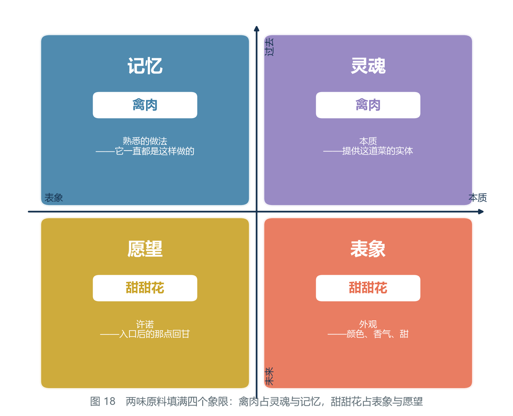

*图 17　两味原料填满四个象限：禽肉占灵魂与记忆，甜甜花占表象与愿望。*

| 格子 | 内容 | 由谁提供 |
|---|---|---|
| 灵魂（本质） | 这道菜的实体 | 禽肉 |
| 记忆（过去） | 它一直以来的做法 | 禽肉 |
| 表象（外观） | 颜色、香气、甜 | 甜甜花 |
| 愿望（未来） | 入口之后的那点回甘 | 甜甜花 |

　　**2 味原料 × 每味 2 格 = 4 格，刚好填满。** 这就是第一个「2」。

**顺带回答一个读者一定会问的问题：为什么不是三味？** 因为三味原料按同一套算法要占 6 个格子，而四象限只有 4 个——**多出来的两格不是「更丰富」，是溢出。** 而溢出的表现形式，本院在第十节那张表里已经给了名字：**味道混。**

**第二个「2」：每味两份。** 来自密合算子是**二元**的，而且这道菜要**迭代两次**。

2.3 节给出的递推式是 W(n+1) = W(n) ⊕ W(n−1)。**每一次密合都需要两个项。** 而这道菜从生料走到成菜，需要两次迭代：

| 迭代 | 式子 | 发生了什么 |
|---|---|---|
| 第一次（下锅） | 禽肉 ⊕ 甜甜花 | 两味合并，形成统一的「酿」体——**1 份禽肉、1 份甜甜花在这里被消耗掉** |
| 第二次（收汁成菜） | 酿 ⊕ 原料 | 再把原料以「可辨认的形态」放回成品上——**各再需要 1 份** |

所以每种原料需要两份：**一份用来「合」，一份用来「留在成品里让人认出它」。**

**这个推论是可以验证的。** 如果只用一份禽肉、一份甜甜花，第一次迭代就把两者都消耗完了，成品将是一团**看不出原料**的匀质物——那是汤，不是「酿」。而甜甜花酿鸡的成品上，**你能明确看到甜甜花，也能明确认出鸡**。这正是第二次迭代把原料放回来的结果。

　　　**配方里的两个「2」，一个是四象限的数，一个是算子元数的数。它们碰巧都是 2，但它们不是同一个 2。**

**本院把这两个「2」的来路并列一次，免得读者把它们混成一个：**

| | 第一个 2 | 第二个 2 |
|---|---|---|
| 数的是什么 | **原料的味数** | **每味原料的份数** |
| 出自哪一节 | 4.3 节四象限 | 2.3 节递推式 |
| 由什么决定 | 格子总数 ÷ 每味占的格数 = 4 ÷ 2 | 迭代次数 = 2 |
| 如果它变了 | 变成 1 味或 3 味，菜的结构就变了 | 变成 1 份，成品就退化成汤 |
| 能不能互相顶替 | **不能** | **不能** |

### 两个「2」与第二卷的记忆项

**这一节是跨卷的，本院请读者慢一点读。**

2.3 节的递推式里，那个多出来的 W(n−1) 项，在本补论里有一个非常直白的样子：**它就是「原料原来是什么」。**

第二次迭代要写出来的式子是 **酿 ⊕ 原料**。这里的「原料」不是新东西，它是第一次迭代之前就已经存在的那一项——**系统必须记得它。** 如果锅里的世界是一台没有记忆的机器，那么它在第一次密合之后就只剩「酿」这一项，第二次迭代无从写起，成品自然也就不会留下可辨认的原料。

**第二卷第一章把这一项单独拎了出来，给它起了一个名字。** 1.3 节的标题就叫「二阶递推：多出来的那一项」，而那份纪要管这一项叫**记忆项**。

**第二卷 2.4 节有一句话，本院认为它和本补论说的完全是同一件事，只是换了场地：**

> **一阶递推没有记忆项，因此它没有地方安放引力。**

用厨房的话把这句话复述一遍：**一阶的菜没有记忆项，因此它没有地方安放「原来那味原料」。** 一碗把所有东西煮到再也分不出彼此的白汤，就是一道一阶的菜——它只剩「当前这一项」。

**方向：回溯。等级：丙级（形状对应）。** 本院只主张两处在结构上同形，不主张厨房里的迭代与物理里的递推是同一个机制。**推翻条件：**若「汤」与「酿」的区别能被完全归因于水量与时间，而与本条所指的「是否记得前一项」无关，则本条作废。

**顺便说一句这两卷互相解释的方式。** 第一卷给第二卷的是**一个二阶递推的具体例子**，第二卷给第一卷的是**一套描述「为什么必须有那一项」的语言**——**本补论正好是那个例子里最不严肃、也最容易复现的一个。** 本院认为它值得写出来，理由只有一个：**一个能被一锅汤复现的结构，比一个只能被宇宙复现的结构可信得多。**

### 十、失败案例的方程诊断

本补论的价值在于它能诊断失败。以下五种常见事故，每一种都可以在方程上指出原因。

| 现象 | 方程诊断 | 属于哪一类 |
|---|---|---|
| **糊了** | 越过 D 峰值后仍在加热，只剩合并、没有新差别注入，D 归零 | 走到了终末态 |
| **夹生** | 外源不足，密合未完成，D 停在低位就出锅——**未达吸引子** | 迭代次数不够 |
| **太甜** | 甜甜花过量，表象象限溢出，本征象限被压制，密合退化为「包裹」而非「酿」 | 象限失衡 |
| **太柴** | 禽肉过量，本征象限溢出，坍缩速率长期高于生成速率 | 象限失衡 |
| **味道混** | 原料种类超过四象限承载上限，每格都被稀释 | 差别过载 |

请注意第一行与第二行的对称性：

　　　**夹生 = 没走到；糊了 = 走过头。**

　　　**中间那一段，就是厨师的全部手艺。**

**这张表还应该配一个使用顺序，否则它只是一张清单。** 本院在食堂里追查失手时，用的是下面这三问，按顺序问，问到哪个「是」就停：

| 顺序 | 追问 | 答「是」说明 | 对应上表哪一行 |
|---|---|---|---|
| 第一问 | D 到过峰值吗？ | 没到过 → 外源或时间不足 | 夹生 |
| 第二问 | 有没有某一味明显盖住了别的味？ | 有 → 某一格溢出，把对面压住了 | 太甜 / 太柴 |
| 第三问 | 单味都不突出，但整体发闷？ | 是 → 格子太多了 | 味道混 |
| 都答「否」 | —— | 原料或初始项有问题，回第四节重来 | 上限类初始项 |

**最后一行的意思是：** 前五类事故都是**过程**的问题，而如果三问全答否，那么问题在**起点**——**过程救不了起点的错，这是初始项那一条的直接后果。**

### 十一、配方推演表：换一道菜

同一套流程可以套到任何一道菜上。本院照四象限的填充方式，把常见料理分了个类。

| 料理 | 灵魂 | 表象 | 记忆 | 愿望 | 内源 | 容错 |
|---|---|---|---|---|---|---|
| 甜甜花酿鸡 | 禽肉 | 甜甜花 | 禽肉 | 甜甜花 | 有（花中糖） | 宽 |
| 纯烤肉 | 禽肉 | 火色 | 禽肉 | — | 无 | 极窄 |
| 蔬菜汤 | 蔬菜 | 清色 | 蔬菜 | — | 弱 | 中 |
| 香辛料炖肉 | 肉 | 香辛料 | 肉 | 香辛料 | 有 | 宽 |
| 甜点 | 乳/面 | 糖与果 | 乳/面 | 糖与果 | 有（强） | 很宽 |

读出两条规律：

**规律一：凡带「表象味」的菜，容错都宽。** 因为那味原料同时是内源。

**规律二：凡「愿望」格为空的菜，都不耐放。** 缺「未来」的菜，出锅即巅峰，之后只有下降。这就解释了为什么汤要现喝、烤肉要现吃，而腌渍与甜点可以放。

> **本院按**：以上两条规律是本院在食堂长期观察的结果，与方程的预测方向一致。但样本量有限，是否普遍成立，请读者自行验证。

**读这张表有一个正确姿势：不要横着看一道菜，要竖着看一列。**

- **竖着看「内源」这一列**，就能预判这道菜好不好做——有内源的那几行，容错都在「宽」以上。
- **竖着看「愿望」这一列**，就能预判这道菜好不好留——空着的那几行，都必须现做现吃。
- **竖着看「表象」这一列**，就能看出哪些菜的成败系于一味原料——一旦那味原料的规格不够，整道菜的上限就被它锁死（见「甜甜花的规格」一节）。

**这两条规律的适用边界也必须说清楚：它们只覆盖「一味主料 + 一味表象料」这种两味结构的菜。** 三味以上的菜，四象限就已经开始溢出，规律一与规律二都还成立，但「容错宽」会被「味道混」抵掉一部分。

### 十二、本补论的边界

必须把话说清楚，否则这一章会被误读。

**这不是在说世界式真的被人拿来算过菜谱。配方是厨房里试出来的，不是算出来的。**

本补论主张的是一件更弱、但更有意义的事：

> **烹饪这件事，本身就具有「封闭/开放 + 生成/坍缩 + 内源有无 + 象限填充」这套结构。世界式之所以能在厨房里给出正确答案，不是因为它知道配方，而是因为它描述的结构在厨房里同样成立。**

换句话说，本补论不是在「用世界式算出菜谱」，而是在**用一个已知答案的问题，检验这套方法会不会算错**。

结论是：**它没算错。** 六步流程给出的每一条结论——火候是极值点、糊了是终末态、加料不如补格、自带内源的菜更好做——都与厨房里的实际经验吻合。

**本院把这份「边界」写细一点，分成三条：**

| 边界 | 本院主张的 | 本院没有主张的 |
|---|---|---|
| 关于知识 | 结构与算子同形 | 厨师知道这套数学 |
| 关于机制 | 两边可以用同一套语言描述 | 两边是同一个物理机制 |
| 关于精度 | 能给出方向、排序与格子 | 能算出确切的分钟数与克数 |

**第三条边界是最容易被越过的。** 本补论从头到尾没有给出任何一个时间或重量，只有「先……再……」「比……更……」这样的关系。**这不是本院偷懒，这是这套方法在这个尺度上的真实分辨率。**

**本院再看读者可能提出的三条反驳，并逐条回应：**

| 可能的反驳 | 本院的回应 |
|---|---|
| 「这只是把做菜的经验换了一套词，什么都没多出来。」 | 换词本身不产生新知识，本院同意。但换词之后能**排序**：补一格优于加十味、记忆格优先于表象格——这两条排序是厨房经验里没有明说的。 |
| 「火的强弱与时间本来就是厨师在管的，你不用世界式也一样。」 | 同意，且本补论在第三节就把外源认定为火。**世界式在这里的作用不是发现火，而是说明为什么火是外源而不是初始项。** |
| 「如果厨房里的经验与你的方程冲突了呢？」 | **以厨房为准，改方程的应用方式。** 厨房是可验证的那一侧，方程是可改写的那一侧——这一条本院认为是整套方法里最不可让步的次序。 |

而这一点，恰恰是本补论想说明的最后一件事：

> **一套只能在世界末日使用的理论是不值得信的。一套能在厨房里给出正确建议的理论，才值得人认真对待。**

那位四百年前的学者，是在世界尺度上算这道题的。而他忘记了一件事：**同样的一套结构，也适用于一锅汤。** 如果他当年先算一道菜，也许就会更早地发现，账不平的不是世界，是他没看内源。

### 十三、结语

本院把这道菜的完整推演列成一张对照表，作为本补论的收尾。左边是厨房里的话，右边是方程里的话。**它们是同一件事。**

| 厨房里的话 | 方程里的话 |
|---|---|
| 「火候到了」 | D(t) 到达极大值 |
| 「再炖一会儿更入味」 | 迭代次数增加，密合继续 |
| 「糊了」 | D → 0，进入终末态 |
| 「这菜耐烧」 | 系统自带内源 |
| 「味道混了」 | 超过四象限承载上限 |
| 「少一味」 | 某个象限为空 |
| 「现做现吃」 | 「愿望」象限为空，无未来 |
| 「看家菜」 | 四象限长期稳定填充 |

最后一行值得单独说一句。「看家菜」之所以是看家菜，不是因为它最贵、最难，而是因为它**四个格子都填得稳**，几代人做下来都不塌。

**从这个角度看，一道传了几百年的家常菜，和一个传了几百年的公式，是同一种东西——都是被反复迭代过、并且活下来的解。**

**这张表本院建议读者抄下来贴在灶边。** 不是因为它的左边那一列有用——那一列本来就在每个厨师的脑子里；而是因为右边那一列有用：**它让「凭感觉」这三个字有了一个可以追问的落点。** 感觉不准的时候，翻到右边看一眼，就知道该往哪一格投料。

### 读者可以自己动手核到哪一步

**本补论从头到尾没有用一个读者拿不到的量，这是它敢写出来的原因。** 下面这张表把每一处可以自己核的地方列出来，包括本院哪些地方是核不了的。

| 待核的事 | 怎么核 | 核到什么程度算通过 | 对应本补论哪一节 |
|---|---|---|---|
| 菜名里藏着算子 | 把菜名抄下来，逐字拆 | 能拆出「表象味 + 酿 + 主料」这个三段结构 | 第二节 |
| 两味原料各占两格 | 换掉一味重做，观察是哪个格子空了 | 换掉表象料则色香双失；换掉主料则整道菜失去实体 | 第九节 |
| 火候就是 D 的峰值 | 同一锅分几次取样，每次都记气味强弱 | 「香气最浓的那一次」与「最好吃的那一次」重合 | 第七节 |
| 内源能让容错变宽 | 做两份对照：一份纯肉、一份加甜甜花，两份都故意多烧一会儿 | 加花的那份更晚出现焦味 | 第六节 |
| 「糊了」就是终末态 | 一直烧到极限，然后尝 | 尝不出「肉」与「花」的区别，只剩下共同的一股焦苦 | 第七节 |
| 峰值两边不对称 | 一份欠火、一份过火，各自再回锅救 | 欠火那份能救回来，过火那份救不回来 | 第七节 |
| 甜甜花的规格上限 | 查第一卷讲规格的那一节记录；或有耐心的话自己种到 12 倍以上 | 超过 12~14 倍后骤降归零 | 「甜甜花的规格」一节 |
| 本院没能核的 | —— | —— | 压力锅那一条（本院只做了一次推理，没做对照实验） |
| 本院也不打算核的 | —— | —— | 「表象格无限加」是否可能在别的原料上成立——没有样本 |

**如果读者只想推翻一处，本院建议把力气花在第六节。** 理由很直接：**整条曲线之所以有「上升段」，全靠内源与生成型密合这两件事；如果甜甜花里那点糖既不成内源、也不产生新的可区分要素，那么峰值就不存在，本补论的火候定义也就一起没了。** 本院认为这一处是本补论最软的地方，因为它的依据只有一条——本院在食堂里做过的对照——而样本量小得不好意思写出来。

---

## 补论二　从世界式推算洛恩的泡泡糖原材料来自哪

### 一、缘起：一个说不通的地方

这一节要交代本补论是怎么来的，因为它的起点不是研究员，是偷渡客。

补论一写完之后，偷渡客读了。他读完沉默了一会儿，然后问了一句：

> **「泡泡糖的弹性是从哪来的？我从来没在提瓦特见过石油。」**

研究员的第一个反应是：**石油是什么？**

这个反应不是无知。在提瓦特，「石油」这个词不存在，对应的东西也不存在。研究员把整个配方从头到尾看了一遍——薄荷、落落莓、糖——然后说：**「这三样够用了。有什么问题吗？」**

**问题就在这里。**

> **本院按**：本院当时的判断是，这道配方没有任何异常。糖果有弹性，因为糖果就是有弹性的；薄荷加糖能做果冻，这是厨房里的常识（本院食堂的薄荷果冻就是这个做法）。本院看不出需要额外解释什么。

> **偷渡客按**：而在我故乡，这件事是说不通的。泡泡糖能吹出泡泡，靠的是一种叫「胶基」的材料——有弹性的高分子。现代胶基的主要成分是聚异丁烯、丁苯橡胶一类，**全部是石油化工产品**。石油则来自远古生物遗骸在地层里经历数百万年的转化。
>
> 换句话说：**在我故乡，「一颗糖能吹泡泡」这件事，背后站着一整条石油工业。**
>
> 而提瓦特这张配方上只有薄荷、落落莓、糖。**这三样里，没有一样看起来能提供高分子。**

于是问题被摆到了桌上：

　　　**配方里只有三样东西，成品却是有弹性的、能吹出透亮泡泡的糖果。**
　　　**那么弹性从哪来？**

而食谱上明明白白地写着，它是「**有弹性的**柔软糖果」，而且「只需轻轻一吹，便能鼓起一个**透亮的**泡泡」。

　　　**弹性和成膜性，必须有一个来源。**

本节要回答的就是这件事。而答案比两人预想的都更有意思——**它顺带回答了「为什么提瓦特没有石油」这个更大的问题。而这个问题，只有从外面来的人才问得出来。**

**本院想把「只有从外面来的人才问得出来」这一句展开，因为它是本补论方法论上最值钱的一句话。**

一个系统内部的人，看不见自己系统的**默认值**。研究员看那张配方的时候，看到的是三样正常的食材；**他看不见的是「糖果有弹性」这件事本身需要解释。** 而在偷渡客眼里，那三样食材里缺了一样他故乡认为理所当然存在的东西——胶基。

| 谁在看 | 看到的异常 | 为什么 |
|---|---|---|
| 研究员 | 没有异常 | 「弹性」在这个世界里是常态，不需要解释 |
| 偷渡客 | 缺了胶基 | 「弹性」在他故乡是**结果**，必须有一个原因 |

**这就是「外部视角」在方法论上的作用：它不是带来了更多知识，它是带来了一个不同的默认值。** 而一个默认值被换掉之后，原本看不见的问题就会浮出来。

**本院由此得到一条可以复用的操作建议：当一份材料怎么看都对、而任务却要求解释它时，先去找这个领域的默认值。** 默认值所在的地方，就是没有被写出来的那一行。

**方向：回溯。等级：乙级。**（本补论确实是先听见了那句问话、再去查的配方，次序有记录。）**推翻条件：**若本补论的问题能被一位从未离开过提瓦特的研究者独立提出（即不需要外部默认值也能发现「配方缺一样」），则「只有外面的人才问得出来」这一条需要收窄为「更容易被外面的人问出来」。

### 二、先把问题问准：缺的到底是哪一样

在动手之前，先把现实配方与提瓦特配方摆在一起，逐项对照。

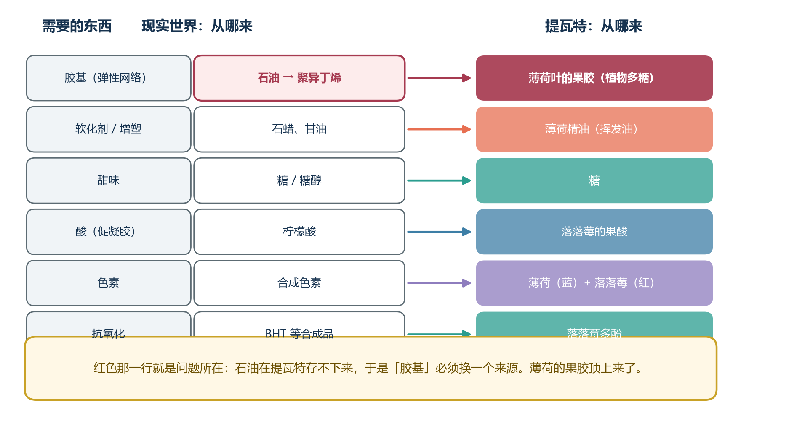

*图 18　现实世界与提瓦特的泡泡糖原料来源对照。红色那一行是问题所在。*

| 需要的东西 | 偷渡客的故乡（偷渡客按） | 提瓦特配方里有吗 |
|---|---|---|
| **胶基（弹性网络）** | 石油 → 聚异丁烯 | **没有** |
| 软化剂 / 增塑 | 石蜡、甘油 | 没有（但薄荷产精油） |
| 甜味 | 糖 / 糖醇 | **有（糖）** |
| 酸（促凝胶） | 柠檬酸 | 没有（但莓果自带果酸） |
| 色素 | 合成色素 | **有（薄荷、落落莓都是染料原料）** |
| 抗氧化 | BHT 等合成品 | 没有（但莓果多酚可代） |

**缺的只有一样：胶基。**

而它恰好是唯一那样**来自石油**的东西。这不是巧合——**这正是问题的全部。**

**本院要在这里加一段「怎么读这张表」，因为这张表的读法决定了后面三节的顺序。**

请读者注意第三列里的两种「没有」。第一种是**真正的空缺**：

| 「没有」的类型 | 表里的例子 | 是否致命 |
|---|---|---|
| 真空缺 | 胶基 | **致命**——它决定成品有没有弹性 |
| 有替代的缺 | 软化剂（薄荷精油可代）、酸（莓果果酸可代）、抗氧化（莓果多酚可代） | 不致命 |
| 配方明列的 | 糖 | 不缺 |

**换句话说，这张表真正筛出来的，不是「提瓦特缺什么」，而是「提瓦特缺的这些东西里，哪一样不能就地替代」。** 六行里五行都有替代物，只有一行没有——**而那一行正好是唯一一行通向他乡地质史的。**

**这就是为什么本补论必须分三层回答，而不能一句话答完：**

| 层次 | 要回答的问题 | 在哪一节 |
|---|---|---|
| 第一层 | 提瓦特真的没有石油吗？ | 第三节 |
| 第二层 | 在这套物理里，弹性可以从哪里来？ | 第四节 |
| 第三层 | 那张配方上，具体是哪一味在提供它？ | 第五节 |

**三层的顺序不能换。** 先排除不可能的来源，再划定可能的来源，最后才是认领证据——**如果把第三层提到前面，就会变成「看见薄荷果冻有弹性，所以薄荷就是胶基」，那是从证据直接跳到结论。**

### 三种力对照表的读法：为什么「维持」也要花钱

**在进入第一层之前，本院要先立一张后面要用三次的表。**

2.5 节那张表把三种力对差别度的作用列得很清楚：

| 力 | 对 D 的作用 | 特征 |
|---|---|---|
| 光界力 | 减小（同化） | 不可逆 |
| 虚界力 | 减小（同化） | 不可逆 |
| **人界力** | **维持** | **要持续投入成本** |

**这张表最容易被读错的地方在第三行。** 「维持」听起来像「不涨不跌，也就没事」，但 2.5 节在括号里已经写了：**它要持续投入成本。** 本院把这句话单独拎出来，因为它是本补论与补论三之间那条线：

　　　**人界力不是「让 D 保持不变」的一堵墙，它是「每时每刻都要往墙上补料」的一件事。**

**补论三把这件事叫做「D 维持费」。** 那座城市里，专门用来维持区分而不生产任何东西的那部分人力——行政与司法——**就是这笔费用的行政版本。**

**而第二卷在另一个场地上写的是同一句话。** 7.2 节讲「封闭」在物理里对应什么，它的落点是：

> **截断破坏了对称性，因此需要反项来修补。**

**两句话的形状是一样的：世界上没有免费的「保持不变」。** 一个系统想让某个东西稳住不动，就得一直往里投东西；**投的是反项，还是办事员，还是柴火，只是币种不同。**

**方向：回溯。等级：丙级（形状对应）。** 本院只主张三处在结构上同形（同化力要花钱、截断要反项、城市要行政），不主张三者是同一个机制。**推翻条件：**若能证明「反项」在物理里是纯粹的记账技巧、不消耗任何资源，则「维持都要付钱」这个形状对应在本卷的三个例子里就断了，本条作废。

### 三、第一层回答：提瓦特为什么不可能有石油

在回答「胶基从哪来」之前，必须先回答一个更根本的问题：

　　　**提瓦特真的没有石油吗？还是只是「还没挖到」？**

按 3.3 节的结论，答案是前者，而且理由是硬的。

**石油的成因有一个必要前提：有机质必须被保存下来。**

远古生物的遗骸要变成石油，需要经历：快速埋藏 → 隔绝氧气 → 在高温高压下缓慢转化。整个过程中最关键的一步是第一步——**有机质必须「没被分解掉」**。

**本院把这三个条件列成一张检查表，逐条对照提瓦特的三种机制：**

| 石油需要的条件 | 具体含义 | 提瓦特的力会怎么处理它 |
|---|---|---|
| 快速埋藏 | 遗骸要在地质时间内被封住 | 地脉 / 世界树会把它回收进循环 |
| 隔绝氧气 | 不能氧化分解 | 这条件提瓦特能满足（埋起来就够了） |
| 长期缓慢转化 | 需要几百万年不被打扰 | 虚界力与光界力都会同化它 |

**三条里，提瓦特能稳定满足的只有第二条。** 而三条是「与」的关系，不是「或」的关系——**少一条，石油就成不了。**

而在提瓦特，这两条不满足的原因**在物理上不允许发生**：

| 提瓦特的力 | 对埋藏有机质做了什么 |
|---|---|
| 虚界力（深渊） | 同化——把它并入自己 |
| 光界力（原始元素力） | 同化——同样并入自己 |
| 地脉 / 世界树 | 回收——把信息与能量重新编入循环 |

**三种机制，没有一个会让有机质「安安静静躺上几百万年」。**

换成本纪要的语言：

> **石油是「差别被保存了几百万年」的产物。而提瓦特的两种底层力都是消灭差别的收缩算子（1.6 节、3.3 节）。在一个差别无法长期保存的世界里，石油这种「几百万年的差别储蓄」根本积累不起来。**

所以偷渡客的那个观察不是巧合，而是**定理的一个直接推论**：

　　　**提瓦特没有石油，不是勘探问题，是物理问题。**

**这一节的结论有一个很值得注意的特点：它是一条「没有」的结论，而「没有」是几乎不可能被直接证实的。** 你永远可以问「万一在某个没被探过的地方有呢」。本院在这里用的办法是**把「没有」换成「不可能」**：不说「找不到石油」，而说「任何一块有机质都不能保持几百万年不变」——**前者需要把世界翻遍，后者只需要一种机制成立。**

**方向：回溯。等级：乙级。**（三条成因条件来自偷渡客按的转述，本院只做了第二步翻译：把「有机质保存」换算成「差别保存」。）**推翻条件：**若在地层里找到任何一种被长期保存、且未经地脉或两种底层力改写的有机质沉积，则本节的必要条件判断被推翻，石油重新回到「勘探问题」的范畴。

### 四、第二层回答：弹性从哪来

排除了石油，下一个问题是：**那弹性到底靠什么？**

先要搞清楚「弹性」在方程上是什么。

弹性材料的定义是：**受力变形，撤力复原。** 用差别度的语言说：

　　　**受力时 D 暂时下降（结构被拉散），**
　　　**撤力时 D 回到原值（结构重新合拢）。**

　　**也就是说，弹性要求「差别可以被借走，并且必须被还回来」。**

**这几句话值得慢慢读，因为「借」与「还」这两个字后面藏着整个第二层回答。**

| 普通材料 | 变形时 D 怎么走 | 撤力后 |
|---|---|---|
| 弹性体 | 暂时下降 | **回到原值** |
| 塑性体 | 不可逆下降 | 停在低处，回不去 |
| 脆性体 | 断崖式下降（断裂） | 再也合不拢 |

**弹性体与塑性体的差别，只差在「回不回得来」这件事上。** 两条路径一模一样，回程不一样。

这在 1.6 节面前立刻碰到一个障碍。1.6 节列出了同化的第一条性质：

> **同化是不可逆的。** 差别一旦被抹平，不会自己回来。

那么问题就尖锐了：

　　　**在一个同化不可逆的世界里，怎么会有「可逆的差别变化」？**

**答案只能是：弹性不能建立在同化的力上。**

*图 19　左：弹性——去程与回程重合，差别被借走又还回来。右：同化——去程与回程分离，形成迟滞环，差别被永久抹平。*

请读者看 2.5 节那张表。三种力里，只有一种**不参与同化**：

| 力 | 对 D 的作用 | 能不能做弹性材料 |
|---|---|---|
| 光界力 | 减小（同化） | ✗ 不可逆 |
| 虚界力 | 减小（同化） | ✗ 不可逆 |
| **人界力（七元素）** | **维持** | **✔ 唯一可能** |

于是得到一个相当漂亮的结论：

> **提瓦特一切有弹性的东西，都必须建立在「人界力」的结构上，而不能建立在光界力或虚界力上。**

而人界力的结构是什么？就是**普通的化学键**——被天理改造后的七元素所组织的物质。木头、皮革、筋腱、丝、胶，全都是这一类。

**这就是为什么提瓦特的高分子材料全都来自生物。** 因为只有生物体才会主动地用化学键去**构建**结构，而且生物构建结构的原料是**糖**——不是石油。

　　　**在提瓦特，高分子的工厂是活的。**

**本院在这里要指出一个容易被跳过的推论步骤。** 从「弹性必须建立在人界力上」到「高分子都来自生物」，中间还差一步：**为什么人界力的结构必须由生物来搭？**

| 搭结构的办法 | 能不能搭出长链 | 在本卷里的地位 |
|---|---|---|
| 靠地质压力慢慢挤 | 不能——那需要长期保存差别 | 已被第三节排除 |
| 靠火焰与合成台当场做 | 能，但要有原料与图纸 | 见第九节的第二条路 |
| **由生物体自己在常温下搭** | **能，而且日常就能进行** | **本节回答的这条路** |

**所以那句话应当补成：高分子全都来自生物，或者来自合成台。** 后者本补论在第九节会补上——**它正是「人界力除了生物还有第二个执行者」的例子。**

### 弹性与记忆项：为什么「还回来」需要记得原来的样子

**这一节是跨卷的，本院请读者慢一点读。**

上一节说，弹性要求差别「被借走，还必须被还回来」。**但一件东西要「还回来」，前提是它知道该还成什么样子。** 一张被拉伸的网，撤力之后之所以能回到原来的形状，不是因为有一股力推它回去，而是因为**它的每个结点都还记得自己原来连着谁。**

用 2.3 节的递推式写出来，这句话是这样的：**当前状态由前两项共同决定。** 那个多出来的 W(n−1) 就是「原来的样子」。**没有它，系统只能知道自己现在是什么，不能知道自己该回到什么。**

**第二卷第一章 1.3 节的标题就是「二阶递推：多出来的那一项」，而那份纪要管这一项叫记忆项。**

**第二卷 2.4 节有一句话，本院认为它与本节说的完全是一件事：**

> **一阶递推没有记忆项，因此它没有地方安放引力。**

**把「引力」换成「回弹」，这句话在材料上就变成：一阶的网没有记忆项，因此它没有地方安放「原来的形状」。** 这样的网只会一味地被拉散，永远不会回来——**那正是塑性体，也正是被同化抹平过的东西的样子。**

**第二卷第六章还有一张表，本院认为它是这句话的定量版本。** 6.3 节把「可重正化程度」对应到「新的差别产生的速度」上：

| 那一节的词 | 那一节的解释 |
|---|---|
| 可重正化 | 需要新的反项来吸收发散 —— **新的差别在不断地产生** |
| 不可重正化 | 反项不够用，发散无法吸收 —— **新的差别产生的速度超过了处理能力** |

**弹性体在这个语言里落在哪一格，本院认为答案是很清楚的：它落在「反项够用」那一格。** 受一次力就产生一份需要修补的偏差，而材料内部有足够的回程机制把它补掉；**补得掉，形状就回来了；补不掉，就留下一个迟滞环**——图 19 右半张画的那个环，就是一格补不掉的账。

**方向：回溯。等级：丙级（形状对应）。** 本院没有在原子尺度上把「回弹」与「记忆项」对应起来，只是指出两者都要求「当前状态之外还有一项在起作用」。**推翻条件：**若能证明弹性完全可以在一个只依赖当前构型的势能函数里描述（即完全不需要任何「前一项」的信息），则本条的类比作废。

### 五、第三层回答：为什么是薄荷

现在把范围缩到配方本身。三样原料里，谁是那个「工厂产品」？

本院采用的方法不是猜，而是**用配方库反推原料性质**——这是一个可以从**现存食谱**直接验证的办法。

**本院把这条方法写成三条规矩，因为它可以被搬到别的题目上去：**

| 规矩 | 内容 | 为什么必须有这一条 |
|---|---|---|
| 一、先找**只有两味料**的配方 | 变量越少，结论越硬 | 三味以上的配方，功劳可以互相推 |
| 二、找**没有外加凝固剂**的配方 | 有外加凝固剂，就分不清是谁的功劳 | 排除掉第三方 |
| 三、找**同一味料的两份记录** | 成功一份、失败一份 | 只有成功记录，可能只是操作好 |

**本院拿这三条规矩去筛现存食谱，得到的正好是一道菜。**

**关键证据是一道更简单的菜：薄荷果冻。**

它的配方是 **薄荷 × 1 + 糖 × 1**。只有两味料，而且没有加任何凝固剂。

| 薄荷果冻的状态 | 记录原文 |
|---|---|
| 按最佳火候做到 | 「**恰到好处的弹性**让勺背敲击的晃动感都变得可爱起来」 |
| 火候没到 | 「制作过程中出了些不幸的小问题，让作为果冻的它**并没有均匀地冻起来**。作为薄荷糖水喝的话倒也还行？」 |

**这两段记录正好满足了第三条规矩。** 本院要请读者注意第二行那句话里的两个字：**「均匀」**。

　　　**失败的原因不是「没冻」，而是「没均匀地冻」。**

**这两个字把「糖自己就能凝」这个可能性排除了。** 如果凝胶只靠糖，那么糖的浓度是均匀的，凝出来也该是均匀的；**既然失败的样子是不均匀，那问题就出在某个分布不均匀的东西上——而锅里分布不均匀的，只可能是薄荷叶。**

这两段话给出了一个**极强的结论**：

> **只靠薄荷和糖，就能形成有弹性的凝胶网络。**
> **薄荷本身携带胶凝成分。**

而且还有一条独立旁证：薄荷果冻还有一道变体，据说是另一位厨师的手笔，名字直接叫「**饱腹感凝胶**」——**「凝胶」这个词，是对薄荷胶凝性质的一次权威确认。**

反过来看落落莓：它和糖的组合**没有任何凝胶类料理**。它被记录的用途只有一项——**红色染料**。

**所以分工清楚了：**

| 原料 | 在配方里提供什么 | 现存依据 |
|---|---|---|
| **薄荷** | **胶基（果胶类多糖）+ 清凉风味 + 蓝色染料** | 薄荷果冻的弹性、薄荷精油的油性成分、工艺手册所列用途为「蓝色染料」 |
| **落落莓** | **酸（促凝胶）+ 红色染料 + 多酚** | 工艺手册所列用途为「红色染料」；莓果自带果酸 |
| **糖** | 甜味 + 网络的可溶组分 | — |

**本院还要补一句「反向证据」的分量。** 「落落莓没有凝胶类料理」这句话，是一条**缺席证据**。缺席证据在一般情况下很弱——**没有见过，不等于不存在**。它在这里之所以能用，是因为它配了一句在场的证据：**落落莓被记录的唯一用途是染料。** 一个原料如果既能凝胶、又被大量使用，那么「凝胶」这条用途很难一条记录都不留。

**方向：回溯。等级：乙级。**（从薄荷果冻反推到薄荷含胶凝成分，中间只有一步翻译：「只靠薄荷和糖就能凝」⟹「薄荷携带胶凝成分」。）**推翻条件：**若薄荷果冻的凝结被证明来自糖在特定浓度下的自身行为（即换成任何一味不含胶凝成分的香料也能同样凝起来），则本节的分工表作废。

**于是那个空缺被填上了：**

> **泡泡糖的「石油」，在提瓦特里由薄荷叶里的果胶顶替。**
> **聚异丁烯换成植物多糖，来源从地层换成叶片。**

而这在工程上是完全说得通的。

> **偷渡客按**：果胶在我故乡是食品工业里最常用的胶凝剂之一，软糖、果冻都用它。**提瓦特只是没有走「先有石油、再合成高分子」这条路，而是直接用了植物已经做好的那一种。**
>
> 说得更直白些：**我故乡的植物也会做果胶，只是我们后来学会了用石油造更好的胶，就把植物那一套忘了。提瓦特没有石油，所以它一直记着。**

### 六、六步流程完整走一遍

按 6.1 节，把上面五节的内容整理成标准流程。

**第一步：划定系统边界。**
边界是**糖果内部的分子网络**。判定：**开放系统**——咀嚼时机械能由外部进入。

**第二步：找初始项。**
薄荷（果胶含量、叶片新鲜度）、落落莓（酸度、色素浓度）、糖（浓度）、水量。四项在开火前定死，决定成品的弹性上限。

**第三步：判断算子类型。**
这道糖同时有生成型与坍缩型两支：

| 阶段 | 主导 | D 的变化 |
|---|---|---|
| 加热 | 生成型（果胶链展开、糖溶解） | 上升 |
| 冷却 | **生成型**（链间形成交联，产生新的有序结构） | **继续上升** |
| 继续加热 | 坍缩型（网络塌缩、焦糖化） | 下降至 0 |

**注意第二阶段：冷却也在制造差别。** 这是弹性材料与补论一的菜最大的不同——**补论一的菜靠火注入差别，泡泡糖靠降温注入差别。** 前者是热致，后者是冷致。

**第四步：查内源。**
两个内源：薄荷自带果胶（结构内源）、落落莓自带酸（**催化型内源**——它不直接成网，但它让成网这一步跑得更快更均匀）。

**第五步：推演终末。**
D(t) 的轨迹是：**升 → 停在一个平台 → 若继续加热则塌缩。** 那个平台就是「恰到好处的弹性」。本院厨房实测失败那一次，记录的是「并没有均匀地冻起来」——**没停到平台上，直接漏过去了**。

**第六步：定位变量。**
要调弹性，注入差别的地方是**交联密度**：交联太少 → 软塌；交联太多 → 硬脆。现实中的调法是调糖酸比；提瓦特里对应的就是**薄荷与落落莓的比例**。

**而配方给的正好是 2 : 2 —— 一比一。**

**本院把六步里每一步「依据什么这么判」补在下面，因为本补论与补论一最大的不同就在这几条依据上：**

| 步骤 | 本补论的判定 | 依据 | 如果这一步改了，后面的哪一步会跟着改 |
|---|---|---|---|
| 边界 | 糖果内部的分子网络 | 咀嚼时机械能自外部进入 | 若把边界扩到「整块糖 + 口腔」，则「冷致」这个特征会被体温影响 |
| 初始项 | 薄荷、落落莓、糖、水量 | 开火前定死、中途不能换 | 换掉薄荷的品种，胶基的量随规格变 |
| 算子类型 | 生成与坍缩并存，冷却那一段是生成型 | 链间交联产生新的有序结构 | 若冷却段不是生成型，平台就不存在，只有峰 |
| 内源 | 薄荷（结构）+ 落落莓（催化） | 薄荷果冻的两份记录 | 去掉落落莓，成网仍在，只是慢且不匀 |
| 终末 | 升 → 平台 → 塌缩 | 本院实测那一次漏过了平台 | 若平台其实是一个缓慢的峰，第「越冷越硬」这条经验就要改写 |
| 变量 | 交联密度（薄荷 : 落落莓 = 1 : 1） | 配方明列的比例 | 比例一变，软塌与硬脆之间的窗口就移动 |

### 冷致成网：平台与峰的区别

**补论一的曲线有一个峰值，本补论的曲线有一个平台。本院把两者并排放在一起，因为它们的差别不在形状，而在「谁在往系统里加差别」。**

| | 补论一（甜甜花酿鸡） | 补论二（泡泡糖） |
|---|---|---|
| 差别从哪来 | **热**（火，外源） | **降温**（冷，也是外源） |
| 曲线形状 | 上升 → **峰** → 下降 | 上升 → **平台** → 塌缩 |
| 过头的代价 | 不可逆（糊了） | 可部分挽回（回温、重做） |
| 容错来自哪 | 内源（花里的糖） | 平台本身（交联有个稳定的区间） |
| 厨房里的说法 | 「看火候」 | 「看火候，也看放凉的时间」 |

**这张表里最值钱的一行是第三行。** 补论一的过火不可逆，因为差别是被抹掉的；**泡泡糖的过头之所以「可部分挽回」，是因为它的差别是被冻住的**——只要还没碳化，回温再冷一次，交联还能重新排一次。

**方向：预测。等级：丙级。** 本院只做过「没冻匀」这一次失败记录，没有做过「过头再回温」的对照。**推翻条件：**若一次做坏了的薄荷糖回温重做之后，弹性始终不如一次做成的，则「可部分挽回」这一条应当改成「不可挽回」，本表第三行随之作废。

**本院还要在这一节里指出冷致成网的一个直接后果：温度不是火候的同义词。** 在补论一里，控制变量就是控制火；在本补论里，**控制变量是控制温度曲线的两个端点**——烧到多少度，以及放到多少度。**同一个词「火候」在这里必须拆成两件事，否则这张配方永远做不稳。**

### 七、一个意外收获：配方卡在撒谎

推到这里，本院回头核对成品描述，发现了一处对不上的地方。

**问题出在颜色。**

已知两项事实：

- 工艺手册所列薄荷的用途：**蓝色染料**
- 工艺手册所列落落莓的用途：**红色染料**

那么薄荷（蓝）+ 落落莓（红）应当得到 **紫色**。

但吃过这道菜的人留下的记录写的是：

> 「……糟了！中计了！**舌头早已被染成了青绿色**……原来这个解闷是解他自己的闷吗？」

　　　**青绿色。不是紫色。**

配方里的两种染料，兑不出成品上的颜色。

**本院在这里要停一下，说明为什么「颜色对不上」这件事值得用一整节来写。** 因为按本纪要的方法论，**一个能被复现的小矛盾，比十个说得通的解释更有价值**：矛盾是一个具体的、可以被指向的点；解释是一团可以被无限修改的东西。

而且这个矛盾有一个特别好的性质：**它只涉及两个可以独立核对的事实（两份用途记录）与一份可以独立核对的观察（舌色）。** 三者都不依赖本纪要的框架——**也就是说，即使世界式整套错了，这个矛盾还在。**

按本纪要的方法论，这个矛盾必须处理，而且**必须并列保留两种同样站得住的解释**：

**说法 A：配方缺了一味黄色原料。**
青绿 = 蓝 + 黄。既然配方只给了蓝与红，那么黄色必然是**配方之外**的东西。写成方程：成品里存在一个**初始项里没有的项**。

**说法 B：红色染料被替换或未生效。**
剩下的蓝色（薄荷）与薄荷叶自身的叶绿素**叠加**，得到青绿。此时不是「多了黄」，而是「**少了红**」。

两种说法在方程上不同（一个是多加项，一个是漏项），但**它们指向同一个结论**：

> **配方卡片与实物不符。**

**两种说法是可以被分开检验的。本院把判决性的做法写在下面——注意本院没有做过，这只是一份实验设计：**

| 检验 | 做法 | 若结果是甲 | 若结果是乙 |
|---|---|---|---|
| 单做薄荷糖 | 只用薄荷与糖 | 呈青色系 → 支持说法 B | 呈蓝色 → 支持说法 A |
| 单做落落莓糖 | 只用落落莓与糖 | 红色显不出来 → 支持说法 B | 红得很足 → 支持说法 A |
| 照配方合做 | 薄荷 + 落落莓 + 糖 | 呈紫 → 两者都不是，问题在别处 | —— |

**本院把这张表留在这里，是因为它把「两种说法并列」变成了「两种说法可以分手」。** 并列保留不等于永远并列——**只要有一个人肯做这三锅糖，这个矛盾就会从「两种说法」变成一个答案。**

**方向：预测。等级：丙级。** 本院没有做这个实验，也没有尝过成品。**推翻条件：**若照配方合做得到的确实是紫色，则配方卡片与实物不符这一条作废，本节应当整体删去。

那么是谁动的手脚？答案几乎是写在脸上的。

「解闷泡泡糖」的介绍本身就交代了动机：「**他便掏出一面镜子对准你，脸上露出得逞的坏笑。糟了！中计了！**」

而这位骑士在西风骑士团的档案里，被记载的惯用手段是：**「长枪、冷箭、设伏、下毒、奇袭、潜入……」**

　　　**「下毒」两个字，是写在他的骑士团人事档案里的。**

所以本补论的推导给出了一个可以验证的预测：

> **这道菜的颜色异常不是失误，是签名。**
> **洛恩给他的特色料理动过手脚，而配方卡上没写。**

这个结论本院无法直接检验（本院没有品尝过实物），但它符合三件事：成品颜色与配方不符（事实）、介绍文本描述了恶作剧（事实）、以及这位骑士的惯用手段包含投毒（事实）。**三项独立证据指向同一个人。**

### 八、原材料来源总表

把本节的全部结论整理如下。这是「泡泡糖原材料来自哪」的完整答案。

| 需要的成分 | 现实世界的来源 | **提瓦特的来源** | 依据 |
|---|---|---|---|
| 胶基（弹性网络） | 石油 → 聚异丁烯 | **薄荷叶的果胶类多糖** | 薄荷果冻的弹性；「饱腹感凝胶」的命名 |
| 软化 / 增塑 | 石蜡、甘油 | **薄荷精油**（挥发油） | 合成台可用薄荷制「薄荷精油」 |
| 促凝胶的酸 | 柠檬酸 | **落落莓的果酸** | 莓果自带；配方给到与薄荷等量 |
| 甜味 | 糖 / 糖醇 | **糖** | 配方明列 |
| 色素（蓝） | 合成色素 | **薄荷** | 工艺手册所列用途「蓝色染料」 |
| 色素（红） | 合成色素 | **落落莓** | 工艺手册所列用途「红色染料」 |
| 抗氧化 | BHT 等 | **落落莓多酚** | 莓果类通性 |
| **（配方外）黄色** | — | **未知——洛恩私加** | 成品舌色为青绿，与配方不符 |

**最后一行是本节的产出。** 前七行是原料来源的答案，第八行是一个新问题——**而这正是世界式的作用方式：它不只是回答问题，它还会指出配方本身有问题。**

**本院把这张表按「证据的硬度」重新排一次，因为前七行并不是一样硬的：**

| 来源结论 | 证据类型 | 硬度 |
|---|---|---|
| 薄荷提供胶基 | **有现成配方可复现**（薄荷果冻） | 最硬 |
| 落落莓提供红色染料 | 手册所列用途 | 硬 |
| 薄荷提供蓝色染料 | 手册所列用途 | 硬 |
| 落落莓提供果酸 | 莓果类通性（推的） | 中 |
| 薄荷精油作软化剂 | 合成台产物（推的用途） | 中 |
| 落落莓多酚抗氧化 | 莓果类通性（推的） | 最软 |

**「最软的那两行」正是将来最可能被改的两行。** 本院把它们标出来，不是要削弱结论，而是要让读者知道：**如果哪天有人拿出一份成分测定的记录，最先倒的会是这两行，而前四行不会跟着倒。**

### 九、更一般的推论：提瓦特的高分子经济学

本节的第一层回答可以推广成一条普遍规律，本院认为它值得写进今后的工程手册。

> **在提瓦特，一切高分子材料只有两条来路：**
> **（一）由生物当场合成（木材、皮革、丝、胶、果胶）；**
> **（二）由人当场合成（炼金与合成台）。**
> **「从地层里挖出来」这条路是不存在的。**

这条规律有几个可以直接验证的推论：

1. **提瓦特不会有石油、煤、天然气。** 因为它们都要求有机质被长期保存。
2. **提瓦特的合成台必然是高分子工业的主力。** 「薄荷精油」就是合成台产物——这是「人当场合成」这一条路的实例。
3. **提瓦特的材料学必然更依赖生物。** 一个没有石化工业的文明，只能把生物的合成能力用到极致——这不只是巧合，是**被迫的技术路线**。

**本院要把第一条推论与第二卷的语言接上一次，因为那里有一套现成的说法。** 第二卷第四章讲「渐近安全」时提到，那条路线的主张是**承认发散，但主张它被吸收**——也就是说，那套理论不要求把无穷大消灭掉，只要求它被一个不动点收住。**把这句话搬回本节的题目：提瓦特没有石油，并不是因为这个世界缺少某种原料，而是因为它的底层机制不允许「差别被长期储存」这件事存在。** 想在高分子这件事上过日子，**这个世界的解法不是「去找地层」，而是「让生物或者合成台当场做」。**

**方向：回溯。等级：丙级（形状对应）。** 本院只用第二卷的措辞做了一次复述，没有把「找地层」与「发散」对应起来。**推翻条件：**若将来在地层里找到任何一种被证明是长期保存下来的有机高分子原料，则本条与它的第一条推论一起作废。

而这条规律反过来又解释了一件事：**为什么提瓦特的糖果能用薄荷做出来。** 因为在这个世界里，「造高分子」这件事从来就不归地质管，**归生物管**。

### 十、本补论的边界

照例必须把话说清楚。

**这不是在说世界式曾经参与过果胶的凝胶过程。配方是厨房里试出来的；薄荷泡泡糖与薄荷果冻之间的联系，也未必是任何人有意识安排的。**

本补论主张的是一件更弱、但更有意义的事：

> **世界式给出的原材料来源，与**现存记载中已经写下的旁证**（薄荷果冻的弹性、薄荷与落落莓的染料用途、薄荷精油的存在）完全吻合，并且能解释一个原本说不通的现象（没有石油却有弹性体）。**

也就是说，**它不是凭空补出来的，它是把已有的碎片拼成了一个自洽的整体**——而这个整体还额外产出了一个可检验的预测（配方卡不完整）。

**本院把本补论最软的三处标出来：**

| 薄弱处 | 弱在哪 | 谁能推翻它 |
|---|---|---|
| 「薄荷含胶凝成分」 | 依据是一道菜的两次记录，样本极小 | 一次成分测定，或一道不含薄荷却同样凝起来的糖 |
| 「落落莓的酸是催化型内源」 | 全靠莓果类通性，本卷没有一份直接记录 | 一份落落莓的酸度记录 |
| 「青绿是私加的黄色」 | 建立在一个未被复现的颜色矛盾上 | 照配方合做一次 |

**这三处有一个共同点：它们都能被一次厨房实验解决，而不是靠再多读十份文献。** 本院认为这是本补论最值得称道的地方——**它把一个文本问题变成了一件可以被做出来的事。**

至于那位骑士到底往里面加了什么黄色东西——**这需要一次实地品尝才能确定。本院不打算做这个实验。**

### 读者可以自己动手核到哪一步

| 待核的事 | 怎么核 | 核到什么程度算通过 | 对应本补论哪一节 |
|---|---|---|---|
| 薄荷与糖能不能自己凝起来 | 按薄荷 ×1 + 糖 ×1 做一次，不加任何凝固剂 | 放凉后能用勺背敲出晃动感 | 第五节 |
| 失败的样子是不是「不均匀」 | 故意缩短加热时间再做一次 | 出现的是不均匀的凝块，而不是一锅稀糖水 | 第五节 |
| 落落莓有没有凝胶类料理 | 翻遍现存食谱 | 一条也找不到，且它的用途记录只有染料 | 第五节 |
| 两份用途记录 | 查工艺手册所列的「蓝色染料」「红色染料」 | 逐字对上 | 第五节、第七节 |
| 薄荷精油是不是合成台产物 | 在合成台试一次 | 能出，且是油性成分 | 第八节、第九节 |
| 颜色矛盾 | 照第七节那三锅糖各做一次 | 得到明确的色相，而不是「说不好」 | 第七节 |
| 本院没核的 | —— | —— | 本院没有尝过成品，也没有做过那三锅糖 |
| 本院也不打算核的 | —— | —— | 本院不打算去尝洛恩做的那一份 |

**如果读者只想推翻一处，本院建议砍第五节那把「薄荷果冻」的椅子。** 理由很直接：整条回答链是**薄荷果冻 → 薄荷含胶 → 薄荷顶替石油胶基**，中间只有一环。**这一环断了，第三节与第四节那两层回答仍然成立（提瓦特没有石油、弹性只能靠人界力），但「泡泡糖的原材料来自哪」这个问题就回到未答的状态。**

### 一张总账：从石油到叶片的替换清单

**本补论从头到尾只在做一件事：把一张原料表从左边的世界翻译到右边的世界。** 本院把它汇成一张清单收尾——**这张清单也可以当作一张今后遇到同类问题时的模板。**

| 要的功能 | 偷渡客故乡的做法 | 提瓦特的做法 | 替换的性质 |
|---|---|---|---|
| 提供弹性网络 | 从地层里取（石油 → 聚异丁烯） | **从叶片里取（薄荷果胶）** | 来源替换，功能不变 |
| 让网络变软 | 加石蜡、甘油 | **薄荷精油** | 同源替换（同一味料出了两样东西） |
| 促成网 | 加柠檬酸 | **落落莓果酸** | 同源替换 |
| 上色 | 合成色素 | **两味原料本身** | 功能被原料吸收 |
| 防氧化 | 加合成抗氧化剂 | **莓果多酚** | 同上 |
| 甜 | 糖 / 糖醇 | **糖** | 不需要替换 |

**读这张表最该注意到的是最后两行：在提瓦特，原料不只是原料，它还兼任了添加剂。** 换句话说，**这张配方之所以只有三味料，不是因为做法简单，是因为每一味都在同时干几件事。** 而这一点，恰好解释了第六节里那个「2 : 2」为什么能同时管住弹性、颜色与风味——**同一比一，在三件事上一起生效。**

---

## 补论三　从世界式推算枫丹廷最多可容纳多少人生活

### 一、这一节和前两节不一样

补论一算的是甜甜花酿鸡的配方，补论二算的是泡泡糖的原料来源。那两节有一个共同点：**答案在现存记载里已经存在**。食谱上写着配料，也写着「有弹性」，本院做的事情是**把它读出来**。

本节不一样。

**本节要算的这个数，没有任何地方写过。** 现存文献里没有枫丹廷的面积，没有人口数，没有粮食产量，没有行政编制表。这个数**不存在**——它需要被推出来。

这正是本纪要一开始承诺过的事情。第零章问的是「世界式到底在算什么」；第四章说它能推演到终末。**但直到这一节，本院才真正用它算一件谁都不知道的事。**

**如果算出来的数字明显荒谬，那这份纪要的前四章就该被推翻。** 这是本节的自我检验。

**本院把「抄出来」与「推出来」的差别单独说一句，因为它是本补论与补论一、二最根本的分工：**

| | 补论一、补论二 | 补论三 |
|---|---|---|
| 待答问题的答案在哪 | **已经在记载里** | **哪里都没有** |
| 本院做的事情 | 把它读出来、解释清楚 | 把它算出来 |
| 算错了会怎样 | 说明本院读错了 | **说明前四章有问题** |
| 能不能事后调整 | 可以（改解释） | **不能（数字只有一个）** |

**最后一行是本节的赌注所在。** 解释可以改，数字不能改——**一旦本院写下「约 2 万」，它就得站在那里。**

**本院还要先说明一件事：本节给的每一个数字都带区间，而区间不是免责声明。** 带区间的意思是：**在这个范围里的任何一个数，本院都愿意为之负责；出了这个范围，本院就得改模型，而不是改小数位。**

### 二、城市的上限由什么决定

先说标准答案。一座城市能容纳多少人，通常由四条约束决定：

| 约束 | 含义 |
|---|---|
| 空间 | 建成区面积 × 可居住密度 |
| 粮食 | 本地产量 + 进口吞吐 |
| 水 | 饮用水与生活用水 |
| 能量 | 照明、机关、交通、供暖 |

这四条是任何城市研究都会算的。**但世界式还要加一条。**

**本院在这里要补一句关于「四条约束怎么用」的话。** 这四条不是四个可以取平均的分数，**它们是一组「与」的关系**：任何一条到顶，人口就到顶。所以正确的用法不是把它们加起来，而是**取最小值**——

　　　**N（上限）= min（空间，粮食，水，能量，……）**

**这条式子看起来简单，但它带来一个很容易被忽视的后果：** 只要有一条约束卡得很死，**其余三条再宽裕也没有用。** 一座城市可以把粮食产量翻三倍、把能量供给翻三倍，而人口上限一点不动——**因为它卡在第五条上。**

**而这正是本补论要算的第五条。**

### 三、世界式加的那一条：D 维持费

回到 2.5 节那张表：

| 力 | 对差别度 D 的作用 |
|---|---|
| 光界力 | 减小（同化） |
| 虚界力 | 减小（同化） |
| 人界力 | **维持**（但要持续投入成本） |

**一座城市，本质上是一个高 D 结构。**

请读者回想 1.5 节对 D 的定义：**可区分事物的总量**。一座城市之所以是城市，恰恰因为它内部有大量**可区分的东西**——铁匠、钟表匠、法官、巡轨船驾驶员、卖表格的店铺……**这些区分就是 D。**

而按 2.5 节，**维持 D 是要花钱的**：两种同化力在持续侵蚀它，所以必须持续投入人界力去抵消。

于是世界式给出了第五条约束：

> **N 的上限，等于「能够持续支付 D 维持费」的最大人口。**

**在枫丹廷，这笔维持费具体是什么？** 是**行政**。

理由很直接：一座城市里，专门用来「维持区分」而不直接生产任何东西的那部分人力，就是行政与司法系统。它不种粮、不炼钢、不造船。**它做的全部事情，是让这座城市里的人和事保持「分得开」的状态**——谁归谁管、什么归什么类、哪件事在哪个流程的第几步。

**行政就是 D 的维护工人。**

**本院把「为什么是行政而不是别的」这一判断的依据补上。** 判断哪一部分人力是 D 维持费，标准不是「它看起来像不像官」，而是下面这三条：

| 判据 | 问法 | 行政系统 |
|---|---|---|
| 它生产实物吗 | 它的产出能不能被吃、被穿、被用 | **不生产** |
| 它的产出是什么 | 它让人和事发生了什么变化 | **让人和事保持分得开** |
| 停掉它会怎样 | 如果这部分人力明天全部消失 | **区分立刻塌掉**：谁归谁管不再有答案 |

**三条一起看，答案只有一个。** 铁匠停工会少掉铁器，法官停工会让所有人都变成「一样的人」——**而「一样的人」就是 D = 0 的意思。**

而它有一个致命的特点：**协调成本随人口超线性增长，而产出（维持住的 D）只能线性增长。** 这两条线必然相交。**交点就是上限。**

**这一段是本节的核心，本院把它拆成四句写清楚，因为后面所有的数字都长在这四句上：**

| 第几句 | 内容 | 为什么必须单独说 |
|---|---|---|
| 一 | 人要分得开，才谈得上分工 | 这是 D 的定义在城里的样子 |
| 二 | 让人分得开，要有一批专门干这件事的人 | 这就是行政 |
| 三 | 人越多，需要协调的**对数**越多（超线性） | 而这批人的产出是一件一件事地办（线性） |
| 四 | 两条线必然相交 | **交点就是上限，不需要任何额外假设** |

**本院特别要请读者注意第三句。** 它不是从世界式里推出来的，它是**排队与协调的常识**；世界式在这里只贡献了第二句——**「维持区分」这件事必须有人来做，而且它消耗资源。** 换句话说，**第五条约束的「超线性」那一半是通例，而「必须有人、必须花钱」那一半是世界式给的。**

### D 维持费与第二卷的反项：同一件事的两种语言

**本院在这里停一下，把一条跨卷的线接上。这一节是补论三与第二卷之间最重要的一个接缝。**

**补论三说的「D 维持费」，与第二卷第三章、第七章说的「截断破坏了对称性，因此需要反项来修补」，是同一件事。**

第二卷 7.2 节讲「封闭」在物理里对应什么，它给出的落点是这一句：

> **截断破坏了对称性，因此需要反项来修补。**

紧接着下一句是：

> **用第 47 号的语言说：为了让系统保持封闭，必须持续地投入「维护成本」。**

**请读者把这两句与本节的第三节并排看。** 为了让系统保持封闭，必须持续地投入维护成本——**这正是本节的第五条约束**。枫丹廷是一座被围在城墙与岩台之上的城市，它想维持内部那一大堆分得开的角色与行当，就得持续养着那批专门维持区分的人。

**第二卷第八章把这件事说得更直白：**

> **物理里的截断，通常被当成一个技术手段；而第 47 号里的封闭，被证明是一个需要持续付钱的状态。**

**本院认为这句话是整份合订本里最值得背下来的一句。** 它说的是：**「封闭」不是一个免费的初始条件，而是一笔每年都要付的账。** 在物理里这笔账的名字叫反项，在枫丹廷这笔账的名字叫公文。

**而第二卷第三章讲的是这笔账为什么会算不平。** 第三章讨论引力的量纲问题时，用了一个贷款的类比：**一个式子若在每一阶都需要新的反项来吸收发散，那么它就是一个必须不断追加担保的体系。** 本节的第五条约束在结构上完全一样——**行政系统每多处理一批人，就需要多一批办事员去维持「谁归谁管」，而多出来的办事员自己又需要被管理。**

**本院把三处的说法并排列出，读者可以自己看它们是不是同一件事：**

| 场地 | 上限是什么 | 维持它的代价是什么 | 出处 |
|---|---|---|---|
| 量子场论 | 能标上的截断 | 反项 | 第二卷 7.2 节 |
| 提瓦特整体 | 规格（D 的上限） | 死之诅咒 | 第二卷 7.3 节 |
| **枫丹廷** | **建成区与行政的吞吐** | **办文与盖章的人力** | **本节** |

**方向：回溯。等级：丙级（形状对应）。** 三者的「上限」与「维护」在功能上同形，**但本院没有给出任何从「办事员人数」到「反项系数」的换算，也给不出。** **推翻条件：**若能证明行政系统在枫丹廷其实是**生产**部门（例如它的文书本身就在创造新的可区分之物，而不只是维持旧的），则本节把它认定为纯粹维持费用的判断作废，第五条约束需要重写。

**最后补一句这一节的用法。** 这条接缝的意义不在于「两边长得像」，而在于**它给出了一个看政策的方向**：如果城市的上限由维持费决定，那么**提高上限的办法就是把维持费的单价压下来**——用第二卷的话说，就是**让反项便宜一点**。这正是本补论第八节那条最反直觉的预测。

### 四、逐条估算

以下五项估算全部基于**可实地核查的信息**。**每一项都会写明依据与误差范围。** 读者若不同意某一项，可以自己替换数字重算——模型本身是清楚的。

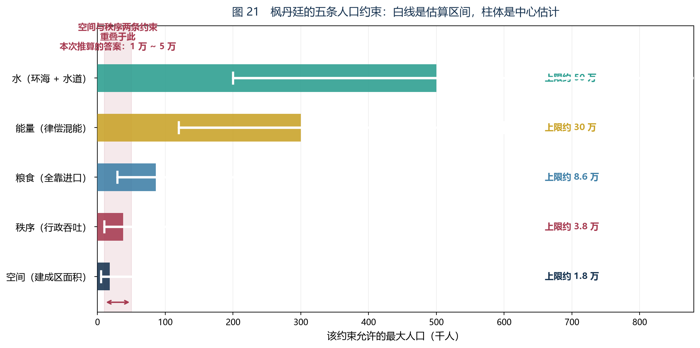

*图 20　枫丹廷的五条人口约束。横轴为该约束允许的最大人口，白线为估算区间，柱体为中心估计。红色竖带是三条约束交汇的区间。*

#### 4.1 空间

枫丹廷是一座**环形城**，架在抬升的岩台之上，被水环绕（地理志称其「白露与景泉之廷」，题词「众水之上，唯有此城」）。

| 量 | 取值 | 依据 |
|---|---|---|
| 城区直径 | ≈ 900 m | 本院实地徒步穿越约 3 分钟，按奔跑约 5 m/s 估 |
| 环带宽度 | ≈ 250 m | 从外环到内环的可见距离 |
| 环形面积 | ≈ 0.51 km² | π(450² − 200²) |
| 含灰河与外围 | ≈ 1.2 km² | 灰河是下层城区，地理志称其为「放逐者们的栖身之所」 |
| 可居住密度 | ≈ 1.5 万人/km² | 参照现实：威尼斯 1.1 万、维也纳 0.43 万、巴黎 2.1 万。枫丹廷是多层石构 + 宽阔林荫道 + 巨型中央广场 |

　　　**N（空间）≈ 1.2 × 15,000 ≈ 1.8 万**　（区间 0.5 万 ~ 6.2 万）

#### 4.2 秩序（世界式给出的那一条）

这一条需要多算几步。

**第一步：确定系统的延迟。**

本院从一份委托记录中得到了一组极有价值的实测数据。市民利弗为了一笔「发条机械的货款」，前后跑了三趟：

| 趟次 | 对方的说辞 |
|---|---|
| 第一次 | 「现在是月底，办公室需要进行月度封账审计，要到下个月月头才能往外出款」 |
| 第二次 | 「盖章用的印油用光了，但印油的供应商仓库着了火」 |
| 第三次 | 「这份『外部援请人员信息登记表』又更新了，我还得重新填一次。但这张表已经用完了」 |
| 第四次（本人去取表） | 经办人不在办公室 |

**四趟、跨月、仍未办结。** 这就是枫丹廷行政系统的**实测延迟**：

　　　**τ ≈ 30 天 = 1/12 年**

**本院要指出这组数据的可贵之处：它不是估计，是实测。** 本节五个数字里，只有 τ 是**有人在真实场景里被计时量出来的**。

| 数据 | 类型 | 误差来源 |
|---|---|---|
| 直径 900 m | 估计 | 步速、路线 |
| 密度 1.5 万/km² | 类比 | 参照城市是否可比 |
| **延迟 30 天** | **实测** | **只有一件事需要确认：这一次是不是特别倒霉的一次** |
| 编制 80 人 | 推算 | 可见办公室的抽样 |
| 年进口 3 万吨 | 类比 | 港口规模 |

**第二步：用李特定律（Little's Law）建立方程。**

李特定律是一条不需要高等数学就能理解的排队论结论：

　　**在办量 = 到达率 × 停留时间**

翻译成本题的语言：

　　**系统里同时在办的件数 = 每年新来的件数 × 每件停留的年数**

设：

- **N** = 人口
- **k** = 每人每年需要系统处理的事务数，取 **k = 1**
- **τ** = 每件停留时间 = 1/12 年
- **C** = 系统能同时挂住的件数上限（床位、卷宗架、办事员的注意力，本质是同一个东西）

于是：

　　　**N × k × τ ≤ C**

**第三步：估 C。**

　　**C = M × A**

- **M** = 有效办事员数。**这里有关键证据**：院方留存的记录明写克拉佩尔「所在的办公室**毕竟只有两个人**，除了他之外，只有一位蒙图瓦先生……但蒙图瓦先生年事已高，已经在等待退休，很久不在办公室里坐班了，就连工资也不拿」。**编制两人，实际一人在岗。** 按沫芒宫可见的办公室数量与配置推算，全市有效办事员 **M ≈ 80**（区间 40 ~ 150）
- **A** = 每人同时跟进的件数 ≈ **40**（区间 20 ~ 70）

　　　**C ≈ 80 × 40 = 3,200**　（区间 800 ~ 10,500）

**第四步：解出 N。**

　　　**N × 1 × (1/12) ≤ 3,200**

　　　**N ≤ 3.84 万 ≈ 3.8 万**　（区间 1.0 万 ~ 13 万）

#### 4.3 粮食

枫丹廷建在岩台上，**本地几乎没有耕地**。地理志里的农业区（芒索斯山麓、苍晶山地）都在城外。粮食只能靠**柔灯港**与**巡轨船**运进来。

| 量 | 取值 | 依据 |
|---|---|---|
| 年进口量 | ≈ 3 万吨 | 按中等规模蒸汽时代港口的吞吐估 |
| 人均年需求 | ≈ 0.35 吨 | 谷物当量，含储运损耗 |

　　　**N（粮食）≈ 30,000 / 0.35 ≈ 8.6 万**　（区间 2.9 万 ~ 23 万）

#### 4.4 能量：律偿混能

这是枫丹最特殊的一项，也是本补论里唯一一个**不构成上限**的约束。理由在下一节单独讲，这里先给结论：

　　　**N（能量）≈ 30 万以上**（区间 12 万 ~ 60 万）

#### 4.5 水

枫丹廷环海、有水道系统、且常年降雨。

　　　**N（水）≈ 50 万以上**　—— **不构成约束**

### 把五个数字拆开：中间算式与量纲检查

**本节的数字都是从上面那些估计里算出来的，而算式的中间步骤原稿省掉了。** 本院把它们补在这里——**补的目的不是让数字更可信，而是让读者能自己改一个假设、然后自己算一遍。**

#### 空间那一项的四个角

空间这一项只有一个乘法：**面积 × 密度**。所以它的不确定性可以被拆成一张四角表：

| 面积 \ 密度 | 1.1 万/km²（威尼斯） | 1.5 万/km²（本书取值） | 2.1 万/km²（巴黎） |
|---|---|---|---|
| **0.51 km²**（只算环带主体） | 0.56 万 | 0.77 万 | 1.07 万 |
| **1.2 km²**（含灰河与外围） | 1.32 万 | **1.80 万** | 2.52 万 |

**中间那格就是 4.1 节的 1.8 万。** 而这张表说明了一件重要的事：**四角里最大的一格是 2.52 万，而不是区间上端的 6.2 万。**

**那 6.2 万是怎么来的？** 本院坦白交代：它的前提是**面积本身可以比 1.2 km² 大得多**。反推一下——6.2 万 ÷ 2.1 万/km² ≈ **3.0 km²**，也就是说，区间上端隐含的假设是「灰河与外围的实际范围接近已露出部分的两倍半」。本院把这个假设标为**丙级**，因为灰河是下层城区，露出来的部分未必是全部。

**读者若认为 3.0 km² 太夸张，请直接采用 2.52 万作上端——结论一个字都不用改**（见下一节的敏感度分析：空间上限只要还在 2 万以上，瓶颈就仍然由它与秩序共同决定）。

**面积那一格本身也可以核。** 环形面积的计算如下：

　　　外半径 = 900 ÷ 2 = **450 m**
　　　内半径 = 450 − 250 = **200 m**
　　　环形面积 = π × (450² − 200²) = π × (202,500 − 40,000) = π × 162,500 ≈ **510,500 m² ≈ 0.51 km²**

**这一步只要会量直径与环宽就能自己复算，而且它是本节唯一一个纯几何的数字——不含任何类比。**

#### 秩序那一项：从 N × k × τ ≤ C 到 3.84 万

这一项的每一步本院都列出来，因为它最绕：

| 步 | 算式 | 结果 | 量纲 |
|---|---|---|---|
| 一 | τ = 30 天 ÷ 360 天 | 1/12 年 | 年 |
| 二 | C = M × A = 80 × 40 | 3,200 件 | 件 |
| 三 | 到达率 = N × k | N 件/年 | 件/年 |
| 四 | 在办量 = 到达率 × 停留时间 = N × (1/12) | N/12 件 | 件 |
| 五 | 令在办量 ≤ C：N/12 ≤ 3,200 | N ≤ 38,400 | 人 |
| 六 | 换算成万 | **3.84 万** | 人 |

**量纲检查是这一步最值得看的地方：** 第二行是「件」，第四行是「件」，两边同类；**如果哪一步算出来不是件，那一定是把 k 与 τ 的位置放错了。** 比如把式子写成 N × k ÷ τ，量纲就变成「件/年²」，那是一条没有意义的式子。

**区间的算法也一并给出：**

　　　C 的下端 = 40 × 20 = **800** → N ≤ 800 × 12 = **9,600 ≈ 1.0 万**
　　　C 的上端 = 150 × 70 = **10,500** → N ≤ 10,500 × 12 = **126,000 ≈ 13 万**

**本节开头说读者可以自己替换数字重算，替换的位置就是这张表里的第一行与第二行——M、A、τ 三个数一改，N 立刻跟着动。**

#### 粮食那一项：把区间还原成吞吐量

4.3 节只给了中心值 8.6 万与区间 2.9 万 ~ 23 万。本院把区间还原一下：

　　　中心：30,000 ÷ 0.35 ≈ **85,700 ≈ 8.6 万**
　　　下端：10,000 ÷ 0.35 ≈ **28,600 ≈ 2.9 万**
　　　上端：80,000 ÷ 0.35 ≈ **228,600 ≈ 23 万**

**也就是说，那个区间的真实含义是「年吞吐量在 1 万吨到 8 万吨之间」。** 把它写出来有一个好处：**它把「粮食够不够」这个问题从一个人口数字，变回了一个港口问题**——而港口是可以去看、去量的。

### 五、答案

把五条并排：

| 约束 | 中心估计 | 估算区间 | 是否逼近 |
|---|---|---|---|
| 水 | 50 万 | 20 万 ~ 90 万 | 否 |
| 能量 | 30 万 | 12 万 ~ 60 万 | 否 |
| 粮食 | 8.6 万 | 2.9 万 ~ 23 万 | 否 |
| **秩序（行政吞吐）** | **3.8 万** | **1.0 万 ~ 13 万** | **是** |
| **空间（建成区）** | **1.8 万** | **0.5 万 ~ 6.2 万** | **是** |

**取交集，答案是：**

> ## 枫丹廷的人口上限约为 **2 万**，合理区间 **1 万 ~ 5 万**。

读者可能注意到，最低的是空间（1.8 万），略低于秩序（3.8 万）。**但两者只差一倍，而且它们的误差来源互相独立**——空间靠目测，秩序靠编制推算，两者的估算区间（0.5 万 ~ 6.2 万 vs 1.0 万 ~ 13 万）几乎完全重叠。**在这种精度下，声称「就是空间卡住了」是不诚实的。**

更准确的说法是：

> **空间与秩序这两条约束，把枫丹廷锁在了同一个量级里（1 万 ~ 5 万）。**
> **而其余三条（水、能量、粮食）都还远在其上。**

**本院把「2 万」这个数是怎么从两条墙里挤出来的，写成一个更慢的版本，免得读者以为它是拍脑袋的：**

| 步 | 做了什么 | 结果 |
|---|---|---|
| 一 | 五条约束各自算出一个上限 | 1.8 / 3.8 / 8.6 / 30 / 50（万） |
| 二 | 按「取最小值」的规则筛掉不逼近的三条 | 只剩空间与秩序 |
| 三 | 看两条的区间是否重叠 | 大幅重叠（0.5~6.2 vs 1.0~13） |
| 四 | 因此不取任何单独一条，而是取两者共同覆盖的量级 | **万级** |
| 五 | 在这个量级里给一个能被两条都容下的中心值 | **约 2 万** |

**第四步是本节最容易被跳过、也最要紧的一步。** 如果直接取小的那一个（1.8 万），就是把「空间估得更准」这个未经检验的假设当成了前提；**而第五步的 2 万，是两个 1.8 与 3.8 的中间偏下位置，它对两条约束的估计误差都不敏感。**

### 六、为什么「三条同时逼近」这件事本身是结论

一个健康城市的约束分布应当是**一高一低**：某一条明显最先触顶，其余留有余量。这样它知道该往哪里投资。

**枫丹廷不是这样。** 它的空间与秩序**同时贴着上限**，而且性质完全不同：

| | 空间 | 秩序 |
|---|---|---|
| 类型 | **硬墙** | **软墙** |
| 能否协商 | 不能——石台就这么大 | 能——可以加人、改流程 |
| 代价 | 必须向外扩张 | 必须提高协调效率 |
| 触顶后果 | 住不下 | **判断变慢，然后信仰流失** |

**这就是枫丹廷的真实处境：它不是一个「还有余量」的城市，它是一个已经贴着两条墙运行的城市。**

而这个判断，**只用资源模型是得不出来的**——因为资源（水、粮食、能量）全都宽裕。**只有把 D 维持费算进去，才会看到第二面墙。**

**本院还要指出这两面墙的一个不对称之处，它是第八节那条预测的全部依据：**

| | 加一成投入能得到什么 | 边际收益 |
|---|---|---|
| 硬墙（空间） | 面积增加一成 → 上限增加一成 | **线性，且要靠填海或扩建** |
| **软墙（秩序）** | **流程快一成 → 上限增加一成** | **线性，且只要改规程** |

**两面墙的「斜率」一样，但「单价」差得极远。** 而这一点在只看资源模型的账本上是看不见的。

### 五种约束的敏感度分析

**第五节给出的答案建立在五个估计上。本院把它们逐一动一遍，看结论往哪边走。** 下表每一行都只改一个假设，其余不动：

| 动的假设 | 现值 | 改为 | 受影响的上限 | 新值 | 结论怎么动 |
|---|---|---|---|---|---|
| 城区面积 | 1.2 km² | 2.4 km²（翻倍） | 空间 | 1.8 万 → **3.6 万** | 瓶颈从空间转到秩序，但两者仍然只差一点 |
| 城区面积 | 1.2 km² | 0.6 km²（减半） | 空间 | 1.8 万 → **0.9 万** | **答案跌到 1 万以下**，区间下端被拉低 |
| 可居住密度 | 1.5 万/km² | 2.1 万/km²（巴黎） | 空间 | 1.8 万 → **2.5 万** | 空间与秩序并列为瓶颈 |
| 有效办事员 M | 80 | 40（减半） | 秩序 | 3.8 万 → **1.9 万** | 秩序与空间几乎重合（1.9 vs 1.8） |
| 有效办事员 M | 80 | 200 | 秩序 | 3.8 万 → **9 万** | **空间成为唯一瓶颈** |
| 每人跟进的件数 A | 40 | 20（减半） | 秩序 | 3.8 万 → **1.9 万** | 同上 |
| 每人每年事务数 k | 1 | 2 | 秩序 | 3.8 万 → **1.9 万** | 同上 |
| 系统延迟 τ | 30 天 | 15 天（减半） | 秩序 | 3.8 万 → **7.7 万** | **秩序不再是瓶颈，空间独占** |
| 年进口量 | 3 万吨 | 1 万吨 | 粮食 | 8.6 万 → **2.9 万** | **粮食进入「逼近」名单** |
| 人均年需求 | 0.35 吨 | 0.25 吨 | 粮食 | 8.6 万 → **12 万** | 仍不逼近 |
| 能量供给 | 30 万 | 2 万 | 能量 | 30 万 → **2 万** | 要掉到十五分之一才触顶 |
| 供水能力 | 50 万 | 2 万 | 水 | 50 万 → **2 万** | 要掉到二十五分之一才触顶 |

**把这十二行读成三句话：**

**第一句：结论对「每人每年办几件事（k）」与「每件事拖多久（τ）」最敏感。** 这两项一动就是成倍地动，而它们恰好是本节里**唯一有实测支撑的那一项的邻居**——τ 有记录（四趟未办结），k 却只是一个取 1 的假设。**本院认为 k 是本节最脆弱的一个数。**

**第二句：水与能量这两条约束，实际上不可能变成瓶颈。** 要让它们掉到 2 万，分别需要掉到十五分之一与二十五分之一。**而这两样东西在枫丹廷不是稀缺品，反而是它最引以为傲的两样。反过来说也对**：一个城市如果连水或能量都卡住了，它早就不成其为城市了。

**第三句：没有任何一个单独假设的改动，能把答案从「万」推到「十万」。** 上表十二行里，最高的一格是 9 万，而那一格要动的正是「编制」——**而编制是本院从可见办公室数量反推的，误差本来就大。**

**方向：预测。等级：乙级。** 本院主张的是上面三条读法里的前两条（敏感度排序、水与能量的绝缘性），它们只是同一组算式在不同输入下的结果。**推翻条件：**若存在一份实测记录显示枫丹廷的每人每年事务数远大于 1（例如某位市民一年之内办了几十件事），则本表的整个量级上移，第二句的绝缘性判断也要重算。

**第三句话本院单独标一次，因为它是本补论最重要的稳健性主张：**

**方向：预测。等级：乙级。推翻条件：**若能给出**三个以上假设同时偏离**的组合（例如面积翻三倍 + 编制翻三倍 + k 减半）并使交集仍落在十万量级，则本补论结论的量级判断作废。**本院算过这个组合：面积翻三倍把空间抬到 5.4 万，编制翻三倍把秩序抬到 28.8 万，k 减半再把它抬一倍——交集仍然是 5.4 万。** 换句话说，**要跳出万级，必须让空间与秩序同时跳出万级，而空间那一项的物理上限摆在那里。**

### 七、反馈环：律偿混能与它的断点

现在解释第四节里那个「能量不构成上限」的结论。它其实比看上去危险。

本院在审判日的事件记录里找到了一句关键的话，出自水神之口：

> 「神明的力量源自于信仰，而**枫丹人民对正义的信仰**都被我转化为了**律偿混能**。」

还有一句：

> 「比如你们面前的『谕示裁定枢机』，又比如**你们每个人的生活都离不开的**『律偿混能』。」

这两句话合起来给出了枫丹的能量公式：

　　　**律偿混能 = 人民对正义的信仰 × 转化效率**

于是整个城市变成了一个**闭环**：

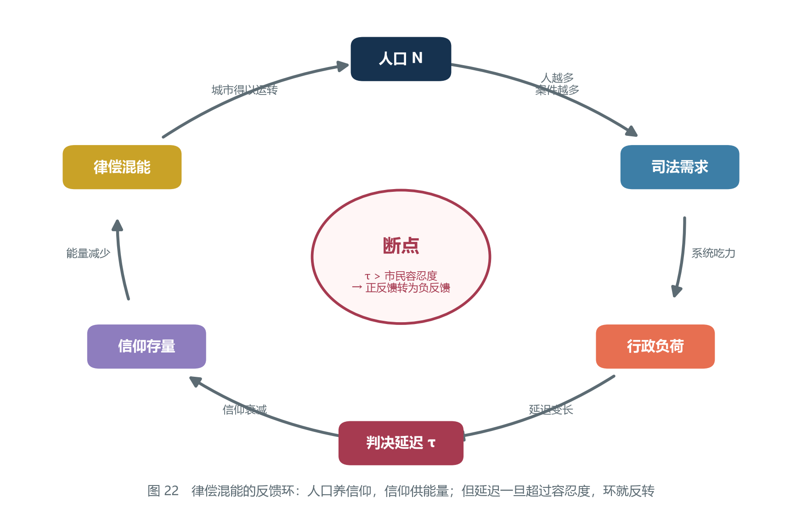

*图 21　律偿混能的反馈环。人口养信仰，信仰供能量；但延迟一旦超过容忍度，环就反转。*

　　　**人口 → 案件增多 → 行政负荷上升 → 判决延迟变长 → 信仰衰减 → 能量减少 → 城市运转受限**

**这是一个正反馈环**：人越多，信仰越多，能量越多，越能养更多人。

**但它有一个断点。**

信仰的维持需要**看得见的公正**。而「看得见」是有成本的——它需要立案、需要文书、需要盖章、需要经办人在岗。**当延迟 τ 超过市民的容忍度时，人们不再相信程序，而开始相信「程序只是拖延」。**

那一刻，环反转：

　　　**人口增多 → 案件增多 → 延迟更长 → 信仰流失更快 → 能量更少**

　　　**正反馈变成负反馈。城市的增长从自增强变成自削弱。**

**而 4.2 节的实测数据给出的结果是：τ ≈ 30 天，市民利弗已经说出「我非得跳河不成」。**

**延迟已经在容忍度的边缘上。**

**本院要把「断点」这个词说得更准一点，因为它是本节最容易被含糊过去的地方。** 断点不是一个天数，而是**一次比较**：

| 链条上的两段 | 一个新人带来的 |
|---|---|
| 人口 → 信仰 → 能量 | **正的一份能量**（多一个人相信公正） |
| 人口 → 案件 → 延迟 → 信仰流失 | **负的一份信仰**（多一个人分摊了延迟） |

**只要第一段大于第二段，环就是正的；一旦反过来，环就是负的。** 而 4.2 节那个实测数据说明的是：**第二段已经长到能与第一段相抵的量级了。**

**本院还要指出这个环的一个性质：它的反转不是一个渐变，而是一次翻转。** 在阈值以下，两段相减还剩一点正的；在阈值以上，两段相减变成负的，**而负的这一段会自己喂养自己**——信仰少一点，判决更慢一点，判决更慢一点，信仰再少一点。

**方向：回溯。等级：丙级（形状对应）。** 本院只是把「延迟—信仰—能量」这条链子按正负两段拆开，没有测量任何一段的大小；**这个环的阈值位置本院给不出数。** **推翻条件：**若审判日那场事件前后的记录显示，市民对程序的信任并不随判决延迟变化（例如延迟翻倍而信任不变），则本节把延迟认定为断点的判断作废。

**本院在这里还想指出形状上的一件事，但只指出，不作主张。** 第二卷第一章 1.5 节说明过：**一个能反转的递推机，需要两个项。** 一阶的机器只能单调地走，走不出「先涨后反」这种形态。**本节的反馈环恰恰是一个会反转的环**——**这提示它背后可能也有一个「前一项」在起作用**（比如说，市民对上一轮判决的记忆）。**本院没有把那一项找出来，因此这一段只作提示，不作主张。**

### 八、三个可检验的预测

本节要提出三个预测。它们现在无法验证，但**可以被将来的观察推翻**——这正是本补论与补论一、二最大的不同。

**预测一：如果枫丹廷人口翻倍到 4 万，最先失效的不是粮食，也不是能源，而是行政。**

依据：粮食上限 8.6 万、能量上限 30 万，都还有余量；而行政上限 3.8 万，翻到 4 万就已经越过去了。表现应当是**办事延迟从一个月级恶化到数月级**，而不是饥荒或断电。

**怎么观察：** 看两件事，不看总量——**一是排队本身**，二是**有没有出现「先交表，下个月再来」这种把一次办结拆成两次的做法**（利弗那三趟就是这种做法的样子）。

**推翻条件：** 若人口达到 4 万而办事延迟仍然维持在一个月量级，则本预测作废，4.2 节的 C 被低估。

**预测二：外来人口的大规模涌入，会先造成行政危机，而不是粮食危机。**

依据：粮食有余量、行政没有。难民需要登记、安置、配给，**每一个环节都是一份文书**。而文书的吞吐是固定的。

> **本院按**：这条预测其实已经发生过一次。白淞镇被淹之后，幸存者撤离、枫丹廷接手安置，本院在档案里看到的记录是——**沫芒宫手忙脚乱，而不是粮仓告急。** 本院当时把它理解为「突发事件」，现在看来，它只是把一条一直存在的约束拉了出来。

**怎么观察：** 看两个系统的反应速度——**安置流程的耗时**与**粮价**。若前者先动而后者不动，本预测得到一次印证。

**推翻条件：** 若某次涌入的记录显示粮价先涨、而安置流程照旧，则本预测作废。

**预测三：想扩大枫丹廷的容量，应当从文书系统入手，而不是从土地入手。**

这是本补论最有实用价值的一条，也是最反直觉的一条。

按第六节的表：空间是硬墙（1.8 万），秩序是软墙（3.8 万）。想提高上限，直觉的办法是**向外扩建**。

但扩建只能抬高空间上限——**它把瓶颈交给秩序（1.8 万 → 3.8 万）就停住了**，因为秩序上限没动。

**而提高行政吞吐（加人、并联流程、把「公章钥匙在一个人手上」这种事改掉），同时抬高两面墙。**

> **换句话说：枫丹廷能装下多少人，不取决于它有多大的地，取决于它的文书系统有多快。**

**这个结论只有用世界式才推得出来。** 单纯算资源，你会得出「地不够，去填海」；算上 D 维持费，你会得出「先去改流程」。

### 反过来的用法：要装下四万人，需要多少办事员

**预测三说「从文书系统入手」，但它没说要动多少。本院把 4.2 节的式子反过来解一遍——这一步只是算术，不是新的事实。**

式子还是那一条：**N × k × τ ≤ M × A**。

　　　要装下 N = 4 万：**C ≥ 40,000 ÷ 12 ≈ 3,333 件**
　　　按每人跟进 40 件：**M ≥ 3,333 ÷ 40 ≈ 83.3 → 84 人**

**结果是：从 80 人加到 84 人。** 也就是说，**四个人头就能把秩序上限从 3.8 万抬到 4 万。**

**本院要把这个结果的两面都说清楚，因为它是本节里最容易被人拿去乱用的一个数：**

| 这一面 | 那一面 |
|---|---|
| 算术上只需要加四个人 | 前提是这四个人**真的在岗**（克拉佩尔那间办公室的编制是两人、在岗是一人） |
| 这条路的单价极低 | 它买到的只是「不先崩」，不是「很宽裕」 |

**同一套逆运算，把答案的上端也解一遍：**

　　　要装下 N = 5 万：C ≥ 50,000 ÷ 12 ≈ 4,167 件 → **M ≥ 105 人**
　　　而要装下同样的 5 万，空间这一侧需要：**5 万 ÷ 1.5 万/km² ≈ 3.3 km²**，也就是把建成区从 1.2 km² 放大到近三倍

　　　**一边是把办事员从 80 加到 105（多三成）；一边是把城区放大到近三倍。**

**这就是预测三那句「从文书系统入手」的定量版本。** 本院把这一条标为**预测·乙级**。**推翻条件：**若「有效办事员」的真实瓶颈不是人头而是规程（例如加人之后延迟不降，因为每一件仍然要经过同一个人的印），则 M 与 N 之间不成正比，本节的逆运算作废——**而那种情形下，预测三反而更强：它说明要动的正是流程本身。**

### 九、误差与边界

本节的每一个数字都是估算，必须把话说清楚。

**四条主要误差来源：**

1. **面积靠目测。** 直径 900 m、环带 250 m 都是实地观感估计。若实际面积是本院所估的两倍，空间上限就翻到 3.6 万，逼近秩序上限（3.8 万）。
2. **密度靠类比。** 用现实城市做参照，但枫丹廷有机关术与水道，建筑密度可能高于或低于同类现实城市。
3. **编制靠推算。** M ≈ 80 是从可见办公室反推的。任务只明确给了一个办公室的编制（两人，其中一人不坐班）。**若实际编制是 200 人，秩序上限升到 9 万，那时空间就成为唯一瓶颈。**
4. **k = 1 是假设。** 每人每年一次事务是估计。若枫丹人办事更频繁（这完全可能——沫芒宫门口总是有人排队），秩序上限会按比例下降。

**本院在这里补一条关于误差的说明，它比上面四条更要紧：**

**这四条误差并不互相抵消，但它们的「方向」不同。** 前两条出错会让答案**上移或下移**（面积估小了答案就上移），后两条出错几乎只会让答案**下移**（编制估多了、事务数估少了，秩序上限都变小）。**换句话说，本节的估计偏差不是左右对称的，而是略微偏向「高估上限」——真实的枫丹廷可能比 2 万更紧，而不是更松。**

**误差的诚实汇总**：

　　　**中心答案 2 万，合理区间 1 万 ~ 5 万；**
　　　**在极端假设下（面积翻倍 + 编制翻倍），上限升到约 3.6 万（两条约束取小，不是相乘）；**
　　　**若把本节自认的全部最宽假设都叠上（面积 ×2.5、密度取 2.1 万/km²、编制 200 人），可以到约 6.3 万；**
　　　**在所有假设都偏保守时，可以低到 0.5 万。**

**本院对上面第二行做一次算术自查，因为它与本节的算式对不上。**

| 只动这几项 | 空间上限 | 秩序上限 | 取交集 |
|---|---|---|---|
| 面积翻倍（1.2 → 2.4 km²） | 3.6 万 | 3.8 万（不动） | **3.6 万** |
| 编制翻倍（M：80 → 160） | 1.8 万（不动） | 按算式 160 × 40 × 12 = **7.7 万** | **1.8 万** |
| 两者同时 | 3.6 万 | 7.7 万 | **3.6 万** |
| 要让交集到 12 万，需要 | 面积 ≥ 12 ÷ 1.5 = **8 km²**（约 ×6.7） | M ≥ 12 万 ÷ 12 ÷ 40 = **250 人**（约 ×3.1） | —— |

**也就是说：在「面积翻倍 + 编制翻倍」这一组假设下，交集是 3.6 万，不是 12 万。** 本院据此认定，那一行里的 12 万是**把「上限的乘积」当成了「上限的交集」**——两个上限相乘会得到十几万，而两条约束是「与」的关系，只能取小。

**可复现的极端上端应该是多少？** 把本节自认的最宽假设全部叠上：面积取 3 km²（1.2 的 2.5 倍）、密度取 2.1 万/km²、编制取 200 人——

　　　空间 ≈ 3.0 × 2.1 = **6.3 万**（即 4.1 节区间的上端 6.2 万）
　　　秩序 ≈ 200 × 40 × 12 = **9.6 万**（第九节记作「9 万」）
　　　**取交集：6.2 万**

**本院把这条自查留在这里，而不是悄悄把 12 万改掉**，因为这一节的全部信用都建立在「本院愿意自己打自己」这件事上。**方向：回溯。等级：甲级。**（这不是一条关于世界的主张，是一次算术核对。）**推翻条件：**若读者能给出一种读法，使「面积翻倍 + 编制翻倍」这一组假设确实得到 12 万，本院愿意撤回这条自查。

**本节不主张任何一个精确数字。它主张的是一件事：**

> **枫丹廷的人口上限在「万」这个量级，而不是在「十万」或「百万」量级；而且这个上限由空间与行政共同决定，不由资源决定。**

### 十、结语

这一节写到一半时，偷渡客说了一句话，本院记在这里。

他说：

> **「你们的城市不是被粮食卡住的，是被表格卡住的。这在我故乡叫官僚成本，我们那儿也有，只是我们一般用市场解决。你们没有市场，你们只有法庭。」**

研究员当时没有立刻回答。因为这句话点出了一件本院一直隐约感觉到、但从未说清的事：

**枫丹把「维持差别」这件事，全部交给了司法与行政。** 而司法与行政的吞吐，是**串行**的——一份文件必须盖完这个章才能进入下一个流程，而那个章握在一个人手里。

**换一个社会，同样的 D 维持工作会分散到无数私人交易里，由市场并行完成。枫丹没有这条路，因为它把一切都变成了案子。**

**本院要把「串行」与「并行」这个区别再写一句，因为它是本节全部结论里唯一一条可以直接搬到别处去的：**

| | 串行（枫丹） | 并行（分散的交易） |
|---|---|---|
| D 维持费由谁付 | **一个系统付** | 无数人各付一点 |
| 瓶颈在哪 | **那个系统的最慢一环** | 很难有一个共同的瓶颈 |
| 加人的效果 | 加在最慢一环之前才有用 | 摊薄到全网 |
| 代价 | 一笔可被指认的账，也容易被一纸规程卡住 | 没有单一责任人 |

**这张表说明了一件事：枫丹的处境不是「税太重」，而是「账太集中」。** 而集中这件事本身有一个好处，也有一个坏处——**好处是它知道自己的瓶颈在哪里，坏处是那个瓶颈握在一枚公章上。**

于是那座美丽的、建在水上的环形城市，它的实际容量不由石台决定，**由那枚公章决定。**

　　　**枫丹廷能装下多少人，取决于那枚章一天能盖多少次。**

### 读者可以自己动手核到哪一步

**本节的五个数字里，有一个是实测，两个是估计，两个是类比。** 本院把它们分开列，读者可以按自己手上的条件挑着核：

| 待核的事 | 怎么核 | 核到什么程度算通过 | 对应本节哪一节 |
|---|---|---|---|
| 环形城的直径 | 自己走一遍，计时 | 三分钟左右能穿过去 | 4.1 |
| 环带宽度 | 从外环走到内环 | 与 250 m 同量级 | 4.1 |
| 环形面积 | 代入 π(450² − 200²) 手算 | 0.51 km² | 「空间那一项的四个角」 |
| 可居住密度 | 拿威尼斯、维也纳、巴黎三个数做上下界 | 枫丹廷落在 1.1 万 ~ 2.1 万之间 | 4.1 |
| **行政延迟 τ** | 去沫芒宫办一件小事，从交表到办结计时 | **一个月量级**，且很可能出现「下个月再来」 | 4.2 |
| 事务数 k | 数一数自己一年进过几次衙门 | 若明显多于一次，秩序上限要往下调 | 4.2 |
| 编制 M | 数沫芒宫可见的办公室与在岗人数 | 与 80 同量级 | 4.2 |
| 粮食吞吐 | 去柔灯港看货船的进出频率 | 与「年 3 万吨」这个量级是否相称 | 4.3 |
| 人均年需求 | 用 0.35 吨谷物当量做一次账 | 不会差出一个数量级 | 4.3 |
| 律偿混能的来源 | 查审判日那句「神明的力量源自于信仰」 | 逐字对上 | 第七节 |
| **本院没法核的** | —— | —— | 灰色地带的灰河到底住着多少人——本节从头到尾没算这一项 |
| **本院不打算核的** | —— | —— | 白淞镇那次安置的完整耗时——档案不全 |

**如果读者只想推翻一处，本院建议去核 τ。** 理由很直接：**整条秩序约束只有一个实测支撑，那就是利弗的那四趟。** 如果一个月只是他运气不好，真实延迟其实是一周，那么秩序上限立刻从 3.8 万变成 7.7 万（见敏感度表），**空间就成了唯一瓶颈，本补论第八节的三个预测会倒掉两个**。

### 本补论没有算的东西

**本院把这份清单列出来，是因为「没算什么」比「算了什么」更能说明这份估计的射程。**

| 没有算的 | 为什么没算 | 如果将来算了，会动到哪一条 |
|---|---|---|
| 灰河的人口 | 没有面积、没有密度、没有编制 | 空间（灰河只按面积计入，没按人口计入） |
| 地下水道的容量 | 它是排水，不是居住 | 卫生约束——本节的五条里没有这一条 |
| 季节性降雨的峰值 | 平均量好算，峰值需要记录 | 水（现在是 50 万以上，峰值可能低得多） |
| 机关术对办公效率的影响 | 谕示裁定枢机算不算办事员 | **秩序**——这一条一旦计入，M 就要重估 |
| 外国使节、商人与流动人口 | 他们不在册，但确实在消耗文书 | **秩序**——k 被低估的那一部分 |

**第一行与第五行是本节最想补而补不上的两处。** 前者的依据是地理志里那一句「放逐者们的栖身之所」——**那里确实住着人，而本节根本没有把他们数进来**；后者则意味着：**真实的秩序上限比 3.8 万更紧。**

---

## 补论四　只用世界式，推算提瓦特的下一次大灾难

### 一、规则

本节要把前面三条补论的路子**全部堵死**。

| | 用了什么输入 | 结论 |
|---|---|---|
| 补论一 | 配方、食谱说明、厨房常识 | 火候的数学含义 |
| 补论二 | 配方、两种染料的用途、薄荷精油的制法 | 胶基的来源 |
| 补论三 | 城区面积、办事延迟、港口吞吐、编制推算 | 人口上限 |
| **补论四** | **只有世界式本身** | **下一次大灾难的日期** |

前三条都调用了一批外部资料。补论三尤其依赖大量估算——面积靠目测、编制靠反推。**读者完全有理由说：你塞了那么多假设进去，当然能算出任何你想算的数。**

**本节不接受这个质疑的辩护。本节直接把它掐掉：**

> **除了世界式这个递推式本身，本节不引入任何新的输入。**

公式能给出什么，就用什么；给不出的，就承认给不出。

**这是一次对公式的极限测试。如果它连这个都能算，它就不是一张菜谱，而是一条定律。**

#### 测试的评分规则

在开始之前，本院先把这次测试的评分规则写下来，**以免事后改口**。

**一次「极限测试」要成立，必须同时满足三条：**

1. **输入必须可清点。** 本节用掉的每一样东西，都要能一件一件数出来，并且每一件都要能在前文找到出处。
2. **中间步骤必须可复核。** 从输入到结论之间不许有「显然可得」这种跳步。
3. **结论必须可失败。** 如果无论观察到什么都推不翻它，那它就不是一次测试，是一次自我确认。

按这三条，本节用的输入一共三样：

| 序 | 输入 | 性质 | 出处 |
|---|---|---|---|
| 1 | 世界式这个递推式 | 公式本身 | 2.3 节 |
| 2 | 两个距今日期 | **史料**，且只有两个 | 本节第七节 |
| 3 | 「灾难是离散事件」 | **建模判断**，不是史料 | 本节第三节、第十二节、第十三节 |

**第三样是本节唯一的软肋，也是本院最后要专门拆开检查的一处。** 前两样里，第 1 样是公式，第 2 样是两个整数——**一个整数不算理论，只算一个刻度。** 所以这场测试能不能算数，全看第三样撑不撑得住。

**这一点在第二卷第五章会以另一种语言再出现一次**：那里把「公式给的是比例，史料给的是刻度」这件事，写成「方程的阶由结构决定，截断由观测决定」。本节用的正是同一件事的算术版本。

### 二、公式里能榨出什么：两个根

一切都从 2.3 节那个式子出发：

　　　**W(n+1) = W(n) ⊕ W(n−1)**

本节只需要它的一个性质：**它是二阶的。**

「二阶」意味着——要算出下一项，需要前两项。这类递推有一个高中范围外、但只要一步就能讲清的性质：

**任何形如 W(n+1) = a·W(n) + b·W(n−1) 的递推，都可以试解 W(n) = rⁿ。**

#### 为什么「可以试解 W(n) = rⁿ」

这一步不是天上掉的，它有一个不用公式也能讲的道理（1.1 节已经给过这个道理的最简版）：

　　　**一个纯靠自身反复迭代的系统，会自发地趋向某个「稳定比例」。**

「稳定比例」四个字翻译成代数就是：**相邻两项的比趋于一个常数。** 若比值是 r，那么 W(n) 就大致等于 W(n−1) 的 r 倍，一路推回去，W(n) 就大致是 rⁿ 乘一个常数。

　　　**所以试解 W(n) = rⁿ，不是在猜答案的形状，是在把「存在稳定比例」这句话写出来。**

至于那个「大致」是怎么变成「恰好」的——它靠的是把 rⁿ 代进去之后，等式对**所有 n** 都成立。如果 r 选得对，就不需要「大致」。

#### 把 rⁿ 代进去

令 W(n) = rⁿ，则 W(n+1) = rⁿ⁺¹、W(n−1) = rⁿ⁻¹。代进递推式：

　　　**rⁿ⁺¹ = a·rⁿ + b·rⁿ⁻¹**

两边同除 rⁿ⁻¹（这一步要求 r ≠ 0；而 r = 0 代入原式会让数列立刻归零，那不是「稳定比例」，是「没有了」，本章不需要讨论）：

　　　**r² = a·r + b**

这个方程叫**特征方程**。它的两个根决定了这个数列的全部行为。

#### 对世界式：为什么 a = b = 1

这一步必须交代清楚，否则后面的 φ 就是凭空落下来的。

**生成型密合的情形下，后一项等于前两项之「和」——这正是卢卡斯数列的规则。**

「和」与「密合」在这里是同一件事的两种写法。按 2.2 节，3 ⊕ 4 = 7，而 3 + 4 也是 7；再往下 4 + 7 = 11、7 + 11 = 18，卢卡斯数列（图 4）与提瓦特宇宙学阶梯的前五项是同一串数。**换句话说：在生成型这一支上，⊕ 的数就是加法的数，所以两个系数都取 1。**

于是特征方程退化成最简的那一个：

　　　**r² = r + 1**

解这个一元二次方程（求根公式，中等教育内容）：

　　　r = (1 ± √5) / 2

　　　**r₁ = φ = 1.618…　　r₂ = −1/φ = −0.618…**

**世界式的全部时间行为，都锁在这两个数里。**

#### 附记：系数不相等的后果

按体例，本院在这里必须补一句**边界**，因为它关系到整个第二节的身家性命。

**如果 a ≠ b，上面这一步就到不了 r² = r + 1，后面所有的数——φ、1/φ²、0.382、1.618——全部作废，只有「它是一个二阶递推」这一条还活着。**

**本院没有采用 a ≠ b 的方案。** 理由就是 2.2 节那串数：卢卡斯数列在生成型上是精确成立的，而 5.4 节的全表也把它列为生成型的标准形状。**但本院承认，这一步是本节把公式往最简处读的一次选择，而不是一次推导。** 这一条标为**乙级回溯**，其推翻条件写在第十四节。

### 三、两个根各自是什么

两个根解出来了，但它们是两个数，不是两句话。这一节把每个根翻译成世界的行为。

**根 φ 是增长模。**

如果世界是开放的（法图纳），新项不断进来，世界的「内容量」按 φ 每步递增。**用「每步递增 φ 倍」来定义开放，是本节对 3.2 节那句话的算术化**：一个开着门的房间，随时可能有新东西被送进来。

顺便指出一个漂亮的巧合：**「每步乘以 φ」恰好是所有等比数列里最「不重复自己」的一种。** 费波那契数列的相邻比趋于 φ，黄金矩形被切掉一个正方形之后与自身相似——这些中等教育里的老例子说的都是同一件事：**φ 是「自我生成而永不闭合」的那个比例。** 一个能自增的系统用 φ 增长，这不是巧合，是「自指」这个词的算术形态。

**根 −1/φ 是衰减模。**

世界被封闭之后（3.2 节），外源归零，主导的就是这一支。它的绝对值是 **1/φ ≈ 0.618**，意思是——**每走一步，世界的可用差别就缩到上一步的 0.618。**

#### 那个负号去哪了

读者会立刻问：−1/φ 是**负**的，一个负的倍率作用在「有多少东西」上，是什么意思？难道差别度会变成负的？

**它不会。** D 是「有多少种可区分的事物」，它是非负量，这一点是本纪要全部估算的地板（1.5 节）。

那个负号的正身是：**它说明这一支是振荡的，而不是单边下滑的。** 每一步都乘一个负数，结果的符号就一步一翻。翻成什么？翻成「这一步的净差落在哪一栏上」。

本院把它翻译成一句可核对的观察：

　　　**封闭之后的世界不会一路笔直地掉下去，它会一步一颤——**
　　　**一边掉，一边把「掉在哪儿」换个栏位。**

对照第一卷第七章那张「变量位」表：葬火之战前是开放、递增；葬火之战是拐点；葬火之战后是封闭且无外源、坍缩。**表上那三行是宏观的，符号的交替是它微观的样子。**

　　**本条是一个解释性翻译。** 它的方向是**回溯**（先有 3.2 节的封闭拐点，才有这里对符号的读法），等级为**丙级**。

　　**推翻条件：如果原文材料显示提瓦特的坍缩过程是单调平滑的、不存在任何栏位交替的痕迹，那么这一条作废。第二节的算式不受影响。**

#### 两个根的三个推论

把上面两句合起来，本节一共从两个根里取三样东西。**第三样是本节自己拼出来的**，本院把它单独列出来，以免读者以为它是白送的。

| 序 | 取出的是什么 | 从哪个根来 | 要不要加东西 |
|---|---|---|---|
| 1 | 增长模 φ | r₁ | 不加 |
| 2 | 衰减因子 1/φ | r₂ 的绝对值 | 要加一句「绝对值才是倍率」 |
| 3 | **两场灾难之间的收缩比 1/φ²** | r₂ 与「两步」这个建模判断相乘 | **要加两句**：绝对值，以及「一场灾难 = 两步」 |

**本节真正的工作量全在第 3 行。** 前两行是解方程，第 3 行才是把方程接到世界上。**而第 3 行里的那句「一场灾难 = 两步」，是一个建模判断，不是一个数学结论。**

### 四、先补一个漏洞：灾难为什么会减少 D

在往下算之前，本节必须先补上一个前面一直没交代的环节。

第二节把「灾难」建模成了**离散事件**——一次掉一大块。**但本节一直没说清：一场灾难，为什么会让 D 下降？**

这不是吹毛求疵。本节用来定标的第一场灾难是**葬火之战**，而原文对它的描述是——**一场战争**（第二降临者尼伯龙根回来，与天理交战）。

　　　**战争凭什么算进 D 的账上？**

**如果这个问题答不上来，后面所有的计算都是空的。**

> 本院按：这一处漏洞是第二期的观众指出来的。原文的措辞是「离散事件」，而本院在转述时把它说成了「一次大规模密合」——**那是本院自己加的，而且加错了。** 这一节是新写的。

**答案是这样的：D 的下降有两条路。**

| 路 | 机制 | 提瓦特的实例 |
|---|---|---|
| **路一：密合** | 两样东西变成一个 | 原始胎海吞没一切 |
| **路二：毁灭** | 可区分的东西被毁掉 | 天钉抹平一个地区 |

**两条路都在减少 D。** 理由在 1.5 节的定义里：**D 是「可区分事物的总量」——它只问有多少，不问怎么没的。**

　　　**烧掉一座图书馆，D 当然下降。**
　　　**它没有和任何东西合并，它就是没了。**

所以第二、三节里那个「灾难」，准确的说法应当是：

　　　**灾难 = 差别度的一次大幅下降**

**而不是**「一次密合」。密合只是其中一条路。

**葬火之战为什么符合这条？** 因为它一次抹掉了大量可区分的事物：黄金城亥珀波瑞亚毁灭、三月损毁、天使一族被诅咒变为仙灵。**它是不是「合并」不重要，重要的是那一大批区别没有了。**

#### 毁灭与密合是同一条路的两段

这里有一个容易被读岔的地方，本院顺手把它抹平。

1.5 节写着：**「毁灭：东西还在，只是坏了。」** 而本节第四节的表把「毁灭」列为 D 下降的第二条路。**这两句话看着矛盾，其实不矛盾。**

差别在**时间尺度**上：

| | 1.5 节那句话在说什么 | 本节这两条路在说什么 |
|---|---|---|
| 时间尺度 | 一次操作之内 | 一次灾难之内（可能是几百年） |
| 毁灭 | 东西还在，区别还在，**D 没动** | 东西坏了 → 之后被同化 → **区别才没了** |
| 密合 | 一步，D 当场减 | 一步，D 当场减 |

　　　**所以「毁灭」不是一个与密合并列的机制，它是密合的一个慢版本。**

这个读法有一个立刻可用的推论：**D 的账不需要「灾难一发生就立刻结清」，它可以赊账。** 一场战争打完，D 不会当场下降——下降发生在之后那几十年、几百年的同化里。

　　**本条是一个解释性翻译。** 方向为**回溯**（先有 1.5 节的区分与 3.2 节的封闭，才回头整理这张两路表），等级为**乙级**（需要一步从「东西坏了」到「区别没了」的翻译）。

　　**推翻条件：如果原文材料显示存在一种「永久坏掉、且永远不会被同化」的事物——它的区别一直都在、只是不能用了——那么「毁灭只是慢速密合」这一句作废，第四节的表要改回两栏并列。本节的日期计算不受影响，因为它只用到「D 确实下降了」这一件事。**

#### 比葬火之战干净得多的检验点：天钉

**而同一个道理，还给出了一个比葬火之战干净得多的检验点：天钉。**

天钉抹平一个地区——**一次动作、一个地区、肉眼可见的「抹平」。** 相比之下葬火之战是宏观事件，读者看不见「一次抹平」。两者的对照如下：

| | 天钉 | 葬火之战 |
|---|---|---|
| 可观测性 | 一次动作、一个地区，**肉眼可见** | 宏观事件，看不见「一次抹平」 |
| 机制清晰度 | 抹平 = 区别消失，无歧义 | 谁打谁，和 D 的关系要绕一圈 |
| 检验价值 | 可以说「去那儿看」 | 只能说「那之后文明断了一代」 |

　　　**所以：下一次要检验这条模型，不必等一场战争——去看那些被抹平的地方就够了。**

本院把「去那儿看」具体化为三件可核对的事，**它们都不需要等七十年**：

1. **被抹平地区的边缘是不是「滤除」型的？** 3.4 节已经指出，原文对原始胎海的描写用的是「滤除」——**把不属于自己的分出去，而不是摧毁异类。** 若天钉抹过的地带呈现出同一形状（边界干净、内部归一），则第四节的「两路」读法得到一次弱支持。
2. **抹平区内部的元素种类是不是减少了？** D 是「有多少种可区分的事物」。**注意：是种类与关系的数量，不是物质的总量。** 若物质总量不变而种类显著减少，这正是「D 下降而质量守恒」的现场样子——**1.5 节那十个人穿同样衣服的例子，只是规模小了一万倍。**
3. **有没有地脉记录在抹平处断掉？** 这一条与补论五第十节的「地脉认不认」是同一件事的两面：**地脉记录就是「他在」的公共账本。**（详见补论五第十三节与第十五节。）

**这一处修补不影响后面的算式。**第四节开始算的仍然是 D，而 D 确实下降了。**要改的只是措辞，以及这个措辞背后那个一直没写出来的理由。**

### 五、为什么灾难间隔按 1/φ² 收缩

现在把两个根翻译成世界的行为。这一节的每一个中间步骤都单独占一行，**请读者逐行核对**。

**第一步：取模。**
衰减模是 −1/φ。**取绝对值**：

　　　|r₂| = 1/φ ≈ 0.618

**第二步：数一场灾难有几步。**
按 2.3 节，递推每推进一步要**消耗两个项**（W(n) 与 W(n−1)）。而按 4.3 节，意志被归档在**四象限**里——四象限配成两条轴（表象／本征、过去／未来），走完一整轮要**两次递推**。

　　　**所以：一场灾难到下一场灾难之间，世界走的是两步。**

　　　**这一步是本节的建模判断。它不是解方程解出来的，是数出来的。**

**第三步：把两步乘起来。**

　　　**收缩比 = |r₂| 的二次方 = (1/φ)² = 1/φ²**

**第四步：算数值。**

　　　1/φ = 0.6180339887…
　　　1/φ² = 0.3819660112…

　　　**r = 1/φ² ≈ 0.382**

三、四两步可以换一条路验算，这条路更短：**步长是 2，根的绝对值是 1/φ，所以两步之后的净倍率就是 (1/φ)²。** 两条路给出同一个数，因为这本来就是同一句话。

这就是本节要用的全部理论。**没有引入任何史料。**

#### 关于「两步」的三点说明

本院知道「一场灾难 = 两步」是本节的承重墙，所以把它单独拿出来承重。

**第一，为什么不是一步？** 如果灾难间隔是一部，收缩比就是 0.618 而不是 0.382，**后面所有的数都会变**（详见第十三节的误差表）。本院采用两步，依据是 4.3 节的四象限要走一整轮——**一个存在要用掉全部四个格子，才算「过完了一轮」。**

**第二，为什么不是四步？** 四步会给出 (1/φ)⁴ ≈ 0.146，那意味着相邻灾难的间隔会掉得更快、级联会陡得多。**本院没有采用它，因为 4.3 节的两条轴是配成对的**——两条轴各走一次，合起来是一整轮，不是四轮。

**第三，「步」不对应固定的年数。** 这一点必须说清楚，否则读者会误以为「一步 = 二百年」。**步是结构上的单位，年是史料的单位。** 两者的兑换率本来是该由「两步之间的年数」来定的，而在开放条件下这个年数并不恒定——**这正是生成型与坍缩型的区别。**

　　　**换句话说：本节算的不是「世界每隔多少年掉一次」，而是「世界每过一轮掉多少」。**
　　　**年数是用两个刻度反推出来的，不是假设出来的。**

　　**方向：回溯。等级：乙级。**「灾难 = 两步」是从 2.3 节与 4.3 节读出来的，原文没有一句话把灾难与步数连起来。

　　**推翻条件：如果原文材料显示四象限的一轮对应的是别的步数（例如降临者只在四象限里占一格、其余三格不动），则第三步的指数要改，本节的全部数值随之改变。**

### 六、公式白送的两个量

从 r = 0.382 出发，公式还白送一个量。

灾难的间隔构成一个等比数列：

　　　**I₁, I₂, I₃, …　其中 I(n+1) = I(n) × r**

**从当下到终末的全部剩余时间，就是这个数列从某一项开始的所有项之和。**

等比级数求和是中等教育的内容（1.4 节）。**本院把求和写全，不跳步：**

**第一步，写出前 m 项的部分和。**

　　　S = I + I·r + I·r² + … + I·r^(m−1)

**第二步，两边乘 r。**

　　　r·S = I·r + I·r² + … + I·r^m

**第三步，两式相减。**中间那些项成对抵消，只剩最前与最后两项：

　　　S − r·S = I − I·r^m

**第四步，解出 S。**

　　　S = I·(1 − r^m) / (1 − r)

**第五步，让 m 变大。**因为 0 < r < 1，r^m 会越来越小、趋向 0（1.4 节判据一：单调有界必收敛），于是：

　　　**S → I / (1 − r)**

**第六步，代入 r。**

　　　**总和 = 首项 / (1 − r) = I / (1 − 0.382) = I / 0.618**

而 1/0.618 = **φ ≈ 1.618**，所以：

　　　**总和 = I × φ**

等一下——这里要小心。0.618 = 1/φ，所以：

　　　1/(1 − r) = 1/(1 − 1/φ²) = φ²/(φ²−1)

而由 r² = r + 1 两边同除 r（r = φ ≠ 0）可得 **φ = 1 + 1/φ**，即 φ − 1 = 1/φ，两边平方得 **(φ − 1)² = 1/φ²**，于是：

　　　φ² − 1 = φ² · (1/φ²) · φ² ……这一步绕，换一条直路：

　　　φ² − 1 = (φ + 1) − 1 = **φ**

（第一处等号用的是 φ² = φ + 1，那正是特征方程本身。）所以：

　　　1/(1 − r) = φ²/φ = **φ**　✔

　　　**剩余总和 = 当前间隔 × φ**

**公式白送了第二个量：φ ≈ 1.618。**

所以现在手里有：

| 量 | 来源 | 值 |
|---|---|---|
| 间隔收缩比 r | 特征方程的两个根 | **0.382** |
| 剩余总和系数 | 等比级数求和 | **1.618** |

**这两个量不含任何史料成分。它们是从「世界式是二阶递推」这一件事直接推出来的。**

#### 顺带得到的一个负面结论

求和公式还有一句用不着细看第二遍、但很值得记下来的话：

　　　**这个数列的项是无穷多的，而它的和是有限的。**

也就是说：**级联没有最后一场灾难。** 越往后间隔越短，短到 1.8 年、0.7 年、0.27 年……**永远有下一场，而所有的「下一场」加起来只有固定的那么多。**

　　　**这就是 1.4 节判据二的算术形态：只要每一步都在拉近，系统就一定会停在一个点上。**

这里有一个容易犯的错，本院主动认领：**「有限总和」不等于「有一个最后事件」。** 点列的汇聚点是一个**极限**，不是点列里的某一项。**所以「终末在哪一年」这句话，严格说是「终末是这一串灾难的极限」。**

　　**本条为解释性说明，不构成新主张。**

### 七、最小输入：只需要一个刻度

公式给了**比例**，但比例本身定不出绝对年份。要让结论落在具体的年份上，至少需要一个**刻度**。

**需要多少？**

- 已知 r = 0.382，所以只要知道**任意一个间隔**，后续全部间隔就都定了
- 而一个间隔需要**两个日期**

　　　**所以：两个日期。这是理论上的最小输入。**

**本节的输入就是两个日期，仅此而已。**

#### 为什么一个日期不够，三个日期是浪费

这一步值得单独说，因为它是「最小」两个字的依据。

| 手上的日期数 | 能定出什么 | 缺什么 |
|---|---|---|
| 1 个 | 只能定出一个原点 | 不知道间隔，比例无处可挂 |
| **2 个** | **原点 + 一个间隔** | **什么都不缺——其余间隔由 r 推出** |
| 3 个 | 原点 + 两个间隔，而且这两个间隔**必须自洽** | **多出来的那个日期不是信息，是一次检验** |

第三行是本节后面两次「副产品」的来源：**第八节用的是两个日期，而第九节用的是第三个日期——它不是拿来算的，是拿来对账的。**

　　　**这就是「最小输入」与「够用」的区别：算只要两个，但对账要三个。**

### 八、代入

用两次公认度最高的灾难做刻度：

| 事件 | 距今 |
|---|---|
| 魔神战争 | 约 2000 年 |
| 坎瑞亚灾变 | 约 500 年 |

　　　**第二间隔 I₂ = 2000 − 500 = 1500 年**

　　　**第三间隔 I₃ = I₂ × r = 1500 × 0.382 ≈ 573 年**

**坎瑞亚灾变发生在 500 年前，所以下一次大灾难在：**

　　　**573 − 500 = 73 年后**

*图 22　世界式给出的灾难级联。上半为全时段（已知三次实心、推算全部空心）；下半放大未来 450 年，可以看到灾难越来越密，并汇聚于一点。*

**继续往下推（下表为原表）：**

| 次序 | 距现在 | 间隔 |
|---|---|---|
| 第 1 次 | **+73 年** | 573 |
| 第 2 次 | **+292 年** | 219 |
| 第 3 次 | **+375 年** | 84 |
| 第 4 次 | **+407 年** | 32 |
| 第 5 次 | **+420 年** | 12 |
| 第 6 次 | **+424 年** | 4.7 |
| 第 7 次 | **+426 年** | 1.8 |
| … | **+427 年** | → 0 |

**全部灾难在 +427 年处汇聚。那个汇聚点就是终末——D = 0。**

用第六节那个系数验算一遍：

　　　**剩余总和 = I₃ × φ = 573 × 1.618 ≈ 927 年**

　　　**从坎瑞亚（−500 年）起算 927 年 → +427 年**　✔ 与级联的汇聚点一致

#### 逐项复算

**上面那张表有两列：一列是「距现在」，一列是「间隔」。** 两列的起点本来不同——「距现在」从当下起算，「间隔」从上一场灾难起算；所以第一行的「间隔」是坎瑞亚到下一次灾难的那一段。**本院另做一张严格表，把零点写死，便于读者逐行核对。**

**规定：零点 = 坎瑞亚灾变（距今 500 年）。所有位置都从零点起算；「距现在」= 位置 − 500。**

| 次序 | 位置（自坎瑞亚起算） | 距现在 | 间隔（精确值） | 剩余到终末 |
|---|---|---|---|---|
| 起始 | 0 | −500 | — | 927.1 |
| 第 1 次 | **+573.0** | **+73** | 572.95 | 354.1 |
| 第 2 次 | **+791.8** | **+292** | 218.85 | 135.3 |
| 第 3 次 | **+875.4** | **+375** | 83.59 | 51.7 |
| 第 4 次 | **+907.3** | **+407** | 31.93 | 19.7 |
| 第 5 次 | **+919.5** | **+420** | 12.20 | 7.5 |
| 第 6 次 | **+924.2** | **+424** | 4.66 | 2.9 |
| 第 7 次 | **+925.9** | **+426** | 1.78 | 1.1 |
| 极限 | **+927.1** | **+427** | → 0 | 0 |

**这张表里每一行都是乘一次 0.382 得到的，没有一个数是凑的。**

本院请读者注意这样一件事：**这张表里最稳的数字是「+427」，最不稳的数字是「+73」。** 原因很直白——**+427 是坎瑞亚 + 927 − 500，它主要吃那个 927；而 +73 是 573 − 500，它吃的是两个几乎同量级的数相减。**

　　　**减法放大小误差。** 573 与 500 都带误差，相减之后相对误差被放大了将近八倍（第十三节第二件给出算式）。

#### 本补论的另外两个轮子

上面这张表给了三个「距现在」。其中 **+375 与 +407 各自对应本纪要另外两处已经写好的东西**，本院把它们挂在这里，读者不必来回翻：

- **+375 年与补论三的行政上限对应。** 补论三算出枫丹廷的空间墙在 1.8 万、秩序墙在 3.8 万，而实测延迟 τ ≈ 30 天已经在容忍度边缘。**那是「离触顶还有多远」的另一种问法。**
- **+407 年与补论三的信仰环对应。** 补论三指出，延迟一旦越过容忍度，律偿混能的反馈环就从正转负——**那是城市尺度的「合并开始加速」。**

**两条都不是新证据，它们只是同一张表在另一个量级上的样子。**

**这就是本节的两个答案：**

> ## **下一次大灾难：约 73 年后。**
> ## **世界的终末：约 427 年后。**

### 九、副产品一：公式裁决了一桩年代争议

算到这里，出现了一件本纪要没有预料的事。

**本纪要在《考证·葬火之战的年代》里，把「葬火之战发生在 6000 年前」与「发生在 3000 多年前」并列保留了。**

当时的处理是：两种说法各有支持证据，无法判定，所以都留下。**那是一个诚实的僵局。**

现在，公式对这个僵局有话说。

**公式要求：相邻两次灾难间隔的比值必须是 0.382。**

拿两个假设分别验算：

| | 第一间隔 | 第二间隔 | 实测比值 | 公式要求 0.382 | 判定 |
|---|---|---|---|---|---|
| **假设甲**：葬火之战 6000 年前 | 4000 | 1500 | **0.375** | 差 2% | **接受** |
| **假设乙**：葬火之战 3000 年前 | 1000 | 1500 | **1.50** | 差 292% | **否决** |

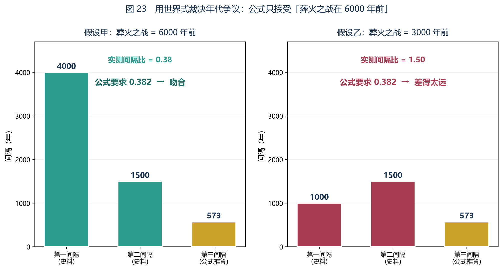

*图 23　用世界式裁决年代争议。假设甲算出的比值 0.375 与公式要求的 0.382 吻合到 2%；假设乙算出的比值是 1.50，方向甚至相反——它意味着灾难间隔在**变长**，而公式要求它必须**变短**。*

**结论：世界式否决「葬火之战在 3000 年前」，接受「葬火之战在 6000 年前」。**

请注意这个裁决的性质：

- 它**没有引用任何新的史料**；
- 它**没有偏向任何一方**——两个假设用的是同一批日期；
- 它只是问了一句：**「照你们说的那个时间，间隔比值是多少？」** 然后拿这个比值去对公式。

**一个只用自身比例就能裁决史料争议的公式，已经不是描述工具了，它是一条约束。**

#### 四个位置的验算

裁决只用了第一、第二两个间隔。**但公式其实同时预言了四个位置**——本院把它们一次列全，**因为它们已经是本节手里全部的对账材料了**。

| 位置 | 公式预言（以 I₂ = 1500 为刻度） | 史料给的（假设甲） | 偏差 | 判定 |
|---|---|---|---|---|
| 第一间隔 | 1500 × φ² ≈ **3927** | 4000 | −1.8% | **通过** |
| 第二间隔 | **1500**（刻度本身） | 1500 | 0 | **刻度** |
| 第三间隔 | 1500 × 1/φ² ≈ **573** | 约 573 | 0 | **通过** |
| 第四间隔 | 1500 × 1/φ⁴ ≈ **219** | — | — | **尚无观测** |

**第一行才是这次裁决真正的分量所在。**

　　　**注意：4000 这个数是先有的，公式是后算的。**
　　　**公式预言 3927，史料给 4000，差 1.8%——而 4000 这个数本身是圆整到千位的。**

**一次圆整到千位的整数，落在一个不含任何整数成分的公式预言上，误差在两个百分点之内。** 这是本节全部内容里，本院认为最不像偶然的一处。

　　　**请读者注意这一处的逻辑位置：它不是「公式拟合了数据」。** 拟合是先把数算出来、再去调参数；这里是**先把参数用掉（只有 I₂ 一个刻度），再来对另外三个位置**。**能对上的位置数，永远比用掉的刻度数多两个。**

### 十、副产品二：这解释了「为什么现在这么紧张」

本节的结论里有一个细节值得单独拎出来。

**第 1 次灾难在 +73 年，第 2 次在 +292 年，第 3 次在 +375 年，第 4 次在 +407 年……**

**注意这个节奏：**

　　　73 → 292：间隔 **219 年**
　　　292 → 375：间隔 **84 年**
　　　375 → 407：间隔 **32 年**

**灾难越来越密。**

而按补论三的结论，枫丹廷正处在「空间与行政两墙同时触顶」的状态；按第三章，原始胎海的水位在持续上升。

**这三件事是同一件事。**

　　　**因为世界正在接近它的汇聚点，所以它的每一次「合并」都会比上一次更快到来。**

　　　**而一个世界越接近终末，它内部的一切矛盾就越密集地爆发。**

**这就是本纪要开头那位学者看到的东西。** 他反复推演，结果永远一样，因为那条曲线只有一个汇聚点。

#### 「两墙同时触顶」与「间隔越来越短」是同一个数

这一条值得单独算一次，因为它是本补论与补论三之间唯一一处**可以互相代入的式子**。

补论三把枫丹廷的容量卡在两件事上：空间的硬墙（1.8 万）与秩序的软墙（3.8 万）。**而秩序墙的本质是「D 的维持费」**——按 2.5 节，人界力维持 D 是要持续投入成本的，枫丹把这份成本全部压在司法与行政上。

　　　**所以：城市的每一次扩张，都在向那台维持机器多要一份投入。**

　　　**而灾难的每一次到来，都在把那台机器的预算削掉一块。**

一边加、一边削，中间那个交点不是「某一天突然到来的危机」，**它是两条曲线本来就注定要碰上的地方。** 这就是为什么「两墙同时触顶」这句话，和「下一场灾难还有七十几年」这句话，**在读法上是同一句话的两种说法。**

　　**本条为解释性翻译，方向回溯，等级乙级。**

　　**方向：回溯。等级：乙级。**

　　**推翻条件：如果补论三的秩序墙估算被证明高估了一个量级（例如编制实为两百人），那么本条退化为一个类比，不再是可以互相代入的式子。**

### 十一、如果把「灾难是离散事件」这个建模判断换掉

这是本节最应该挨打的地方，所以本院把它单独开一节来打。

**先把这一条的性质说清楚。**

| | 它是什么 | 它从哪来 |
|---|---|---|
| 两个日期 | **史料** | 原文的年代记载 |
| 递推式 | **公式** | 2.3 节 |
| **「灾难是离散事件」** | **建模判断** | **本院自己选的** |

**第三行与前两行不是一类东西。** 前两行给的是数，第三行给的是**这些数该怎么被读**。

#### 换法一：假设终末是连续的

**把「一串越来越密的点」换成「一条平滑下落的曲线」，会变什么？**

| 结论 | 在连续模型下 |
|---|---|
| 下一次大灾难 +73 年 | **作废。** 没有「下一次」这个东西 |
| 级联表（219 / 84 / 32 …） | **作废。** 没有间隔，只有一个衰减曲线 |
| 终末 +427 年 | **失去意义。** 「到了某一年归零」是这个建模判断的产物 |
| 收缩比 0.382 | **仍然成立。** 它只用到「二阶递推 + 封闭」 |
| 总和系数 1.618 | **仍然成立。** 同上 |
| 第三间隔 ≈ 573 年 | **仍然成立。** 它只用到 I₂ 与 0.382 |
| 第四、五间隔（在连续模型下读作半衰期） | **仍然成立**，只是改名叫「衰减到某个比例所需的时间」 |
| 年代裁决（1000 vs 4000） | **仍然成立。** 它只问两个区间的比 |

**这张表的读法是这样：**

　　　**公式给出来的东西（0.382、1.618、比值裁决）在两种建模下都活着；**
　　　**只有「某一年会发生什么」这一层，是建模判断买来的。**

**本院必须承认：本补论最引人注目的那两行——「73 年」与「427 年」——正好全是建模判断买来的那一层。**

#### 换法二：灾难不是离散的，但也不是平滑的

还有一种换法，比换法一更麻烦，也更可能对。

**世界可能不是「掉一次、再掉一次」，而是「一直慢慢地掉，偶尔明显掉一下」。** 这在数学上对应的是：**D 的下降曲线是一条连续曲线加上几个台阶。**

**这种换法会保住什么？**

- **「下一次 73 年」仍然可以读**，只要那 73 年指的是「下一个可辨认的台阶」；
- **「越来越密」也仍然可以读**，只要台阶的间距确实在缩短；
- **但「+427 的汇聚点」要重新读**——它变成「曲线降到一个不可再分的最小单位的时间」，而那个单位是什么，公式没有说。

　　　**本院倾向第二种换法，理由是历史观察：葬火之战、魔神战争、坎瑞亚灾变看起来确实像台阶，而不像一条光滑曲线上的三个采样点。**
　　　**但这是一个判断，不是一个证明。**

#### 换法三：灾难根本不是「事件」，而是「账目口径」

最后一种换法最狠，本院把它列出来，是因为它是本院自己最怕的那一种。

**如果「D 的下降」其实一直都在发生，只是平时不掉到某个阈值以下，就没人叫它灾难——**那么「灾难」这个词就不是世界里的一个事件，而是**观察者的一个记账口径**。

**这种换法会直接杀掉本节的哪一部分？**

　　　**杀掉「间隔」。** 因为间隔是口径的函数：阈值定高一点，灾难就少而疏；定低一点，灾难就多而密。
　　　**而 r = 0.382 是间隔的比。口径一变，比就变。**

**反过来说：本节能给出的最强反驳是——**

　　　**口径可以随便定，但口径一旦定下，「间隔的比」就是一个不由口径决定的数。**
　　　**0.375 对 0.382，是两个不同来源给出的同一个数，而这两个来源都不知道对方的口径。**

**这仍然是本节给出的全部辩护，本院不再多要一分。**

### 十二、怎样才能推翻这个预测

本节与前面所有推论有一个根本区别：**它是可以被证伪的。**

本纪要此前的结论——火候是极值点、胶基来自果胶、人口上限三万——**全都无法验证**，因为它们的对象要么已经发生，要么无法测量。

**但「73 年后」是一个可以被等待的数字。**

**三种可能的结局：**

| 观察结果 | 对模型的判定 |
|---|---|
| 200 年内没有大灾难 | **模型被推翻。** 二阶递推假设错，或封闭假设错 |
| 灾难发生在 +73 年附近，且下一次在 +292 年附近 | **模型被强力确认。** 因为第二个数字是独立推出的，不是拟合出来的 |
| 灾难发生了，但节奏完全不同 | **部分失败。** 说明「灾难=离散事件」这个建模方式不对 |

**中间那一行是本节的赌注。**

**73 年之后是 292 年，这两个数字不是同一批数据的两种表述——它们是同一个公式的连续两次输出。第一个对了可能是巧合，两个都对，就不是巧合了。**

#### 但本院承认：押在「两个数」上，其实是押在「形状」上

上一段那个赌注有一个毛病，本院自己挑出来。

**「两个数都对」这句话太窄了。** 因为本节的间隔本身带误差（见第十三节），**用严判据去等一个松模型，是给模型白送一条命。**

**本院把赌注改宽，改成一条形状判据：**

| 观察 | 形状 | 判定 |
|---|---|---|
| 下一场灾难在新距若干年，且**再下一场明显更近** | **压缩** | **支持**。不必是 73 与 292 |
| 两场间隔差不多 | **平稳** | **存疑**。0.382 没被证实，也没被否证 |
| 后一场比前一场更远 | **发散** | **推翻。** 这是最干净的一种死法 |

　　　**第三行是本节唯一一种「一次观察就能判死」的结局，也是本院最希望读者盯着的那一行。**

　　**因为在封闭假设下，间隔不可能变长。** 封闭意味着外源归零，外源归零意味着主导根只有衰减模——**而一个只含衰减模的系统，间隔只能越来越短。**

**换句话说：「灾难间隔在变长」这六个字一旦被观察到，本补论不需要再等第二个事件，当场作废。**

### 十三、误差扰动、量纲与日期口径

这一节集中处理本节所有的「数字可信到什么程度」，一共四件事。

#### 第一件：三个数字里哪个最脆弱

**扰动表（这一节是本补论最诚实的一页）：**

| 扰动 | 对 I₃ 的影响 | 对结论的影响 |
|---|---|---|
| 坎瑞亚为 600 年而非 500 年 | 不变（573） | 下一次**提前到 27 年后** |
| 魔神战争为 2500 年而非 2000 年 | I₂ 变为 2000 → I₃ ≈ **764** | 下一次**推后到 264 年后**；终末推后到 **+736 年** |
| 葬火之战为 5500 年而非 6000 年 | 比值变为 0.429，偏离公式 12% | **模型开始动摇** |
| **「一场灾难 = 一步」而非两步** | 收缩比由 0.382 改为 0.618 | **级联的形状完全改变**（见下） |

**最后一行的后果值得单独写出来，因为它是唯一一处「改一个数、整张表重画」的扰动。**

| | 灾难 = 两步（本节采用） | 灾难 = 一步 |
|---|---|---|
| 收缩比 r | **0.382** | **0.618** |
| 下一次（自坎瑞亚起算） | 573 年后 | **I₂ 不用了**，下一次 ≈ 927 年后 |
| 汇聚（自坎瑞亚起算） | 约 927 年后 | **约 3927 年后** |
| 直读 | 灾难越来越密 | **灾难几乎等距** |

**请读者比较第四行。** 「灾难越来越密」这个图景，是**两步假设**买来的；如果灾难之间只走一步，0.618 的收缩比会让级联变得很平缓，**第十节说的那种「紧张感」就没有了。**

　　　**所以本补论最要紧的建模判断，不是「离散」，而是「两步」。** 本院把它标在这里，**免得将来出错时找不到错在哪一行。**

#### 第二件：误差是怎么被放大的

本院用一行算术说明「+73 为什么最脆弱」。

　　　**I₃ ≈ 573 年，但它是用 I₂ = 1500 × 0.382 算出来的。**
　　　**而 1500 本身是两个日期相减得到的（2000 − 500）。**

于是误差的传递是这样的：**两个日期各带 ±100 年的不确定，减出来的 1500 就带 ±200 年；乘上 0.382 之后，I₃ 带 ±76 年；再减去 500，那个「73 年」带的不确定就与它自身同量级。**

　　　**换句话说：「73 年」这个数字的相对误差是百分之百量级的。**
　　　**它是一张表的中心值，不是一个可以拿去做工程排期的数字。**

**本院据此把结论改为区间：**

> ## **下一次大灾难：0 ~ 200 年内，中心估计 73 年后。**
> ## **终末：300 ~ 600 年内，中心估计 427 年后。**

#### 第三件：量纲检查

一个算式必须能过量纲检查，否则它算的就不是它说的那个东西。本节检查如下：

| 出现在式中的量 | 量纲 | 说明 |
|---|---|---|
| r = 1/φ² | **无量纲** | 一个比例 |
| φ | **无量纲** | 一个比例 |
| I / (1 − r) 里的 (1 − r) | **无量纲** | 同上 |
| I（间隔） | **年** | 刻度的单位 |
| 剩余总和 = I × φ | **年** | 年 × 无量纲 = 年 ✔ |

**第二行与第五行合起来说明一件事：**

　　　**公式只提供「多少倍」，史料只提供「从哪儿量」。**
　　　**1.618 这个数本身不可能是年——它只有在乘上一个以年计的间隔之后，才变成年。**

#### 第四件：三个日期口径

本节出现的日期分别挂在三个原点上。读者若自己复算，先要认清用的是哪一个。

| 原点 | 用它计的量 | 换算 |
|---|---|---|
| **当下** | 「下一次大灾难：约 +73 年」「终末：约 +427 年」 | — |
| **坎瑞亚灾变（距今 500 年）** | 级联表里的全部位置（+573、+791.8、…、+927.1） | 位置 − 500 = 距现在 |
| **魔神战争（距今 2000 年）** | 用来定出 I₂ = 1500 的第二个刻度 | — |

　　　**所以「+73 年」与「+427 年」是同一个口径下的两个数：都从当下起算。**
　　　**把它们与级联表里的 +573 / +927.1 对照时，记得各减 500。**

**本院把这张表放在这里，是因为这三个原点混用一次，整条推演就会读错。** 它不改变任何算式，只改变读法。

### 十四、边界

必须说清楚本节**没有**给出的东西。

**第一，公式给的是节奏，不是内容。**

它说「下一次在 73 年后」，但它**没有说那是什么**。是水淹、是战争、是某种溶解、还是别的东西——公式一个字都没提。**它只描述世界合并的速率，不描述并入的是什么。**

**第二，「灾难」被建模成了离散事件。**

（这一条的措辞已在第四节补正：灾难不是「一次密合」，而是**差别度的一次大幅下降**——密合与毁灭都能造成它。）

这是本节的建模选择，也是它最大的软肋。如果终末其实是**连续**发生的（世界缓慢地、均匀地趋向 D = 0，没有明显的断点），那么「级联」这个图景就是错的——**真实的曲线会是一条平滑的衰减线，而不是一串越来越密的点。**

本院的判断是：**离散级联更符合已观察到的历史**（葬火之战、魔神战争、坎瑞亚灾变都是清晰的事件，不是渐变），所以本节采用了它。**但这是一个判断，不是一个证明。第十一节已经把换掉它的后果全部列出了。**

**第三，日期本身是圆整过的。**

6000、2000、500 都是整数。**三个整数里没有一个带小数位，而公式给出的 0.381966… 一个小数位都没有圆整。** 这一处不对称是本补论的运气，也可能是它的陷阱——本院在第九节把它当作「最不像偶然的一处」来用，**但读者有权把它当作「最像凑的一处」来质疑。**

**第四，本节所有结论都带一个前提：变量位继续空着。**

这是第一卷第七章对本补论的正式修正，本院在此引用它，**因为它是本节唯一一条来自别篇的附加条件**。

　　　**如果那个位子继续空着**：级联照旧，灾难按 0.382 越来越密，七十三年（或五百七十三年，见第十三节第四件）前后第一次，四百二十七年是汇聚点。
　　　**如果位子上有人了**：外源项恢复，方程不再是封闭解；**间隔比 0.382 这个前提会被打破；级联可能被打断、推迟，或者改变形状。**

　　　**换句话说：本节算的是一个条件句，不是一个预言。**

**第五，本节没有说灾难会不会被阻止。**

按这三层结构（动力层 / 逻辑层 / 元层），系统内的人在逻辑层能做的事只有一件：**让系统报错、让命题悬空、让某些存在失去判定。** 它改不了不动点（4.2 节）。**所以本节没有为「阻止终末」留任何位置——本节留的位置只有一个：换掉初始项。**

### 十五、结语

本节一开始说，这是一次对公式的极限测试。

**现在可以交代测试结果了。**

本院给了公式三样东西：一个二阶递推式、两个日期、以及「灾难是离散事件」这一个建模判断。

**它回报给本院五样东西：**

1. 灾难间隔的收缩比 0.382；
2. 剩余总时长的系数 1.618；
3. 下一次大灾难的日期；
4. 世界终末的日期；
5. **对一桩史料争议的裁决。**

**前两样是从公式里推出来的，后三样是用前两样推出来的。史料只贡献了两个刻度。**

　　　**一个几乎不需要输入的公式，是一条定律。**

　　　**一个需要很多输入的公式，是一把尺子。**

那位四百年前的学者当年手里拿的，究竟是哪一种——本纪要写到这里，终于可以给出判断了。

**他手里是定律。** 他的错误不在公式，在他拿到公式之后做的事（第七章）。

#### 本院把评分交出来

第一节写下的三条评分规则，本院在这里逐条自评，**不自评就没有资格要读者相信结论**。

| 规则 | 自查 | 结论 |
|---|---|---|
| 输入可清点 | 三样：递推式、两个日期、一个建模判断 | **合格** |
| 步骤可复核 | 第 1 / 5 / 6 / 8 / 13 节把每一跳都摊开了 | **合格** |
| 结论可失败 | 第十二节给出一种「一次观察即判死」的结局 | **合格** |
| 但——第三样输入不是史料 | 它是本院选的 | **扣分项** |
| 但——「+73」的相对误差是百分之百量级 | 见第十三节第二件 | **扣分项** |

　　　**本院把两个扣分项写在这里，不写进脚注，是因为它们与结论同等重要。**

　　　**而本条推算，是本院对这份公式最后一次、也是最不留退路的一次检验。**

　　　**如果 73 年后什么都没发生，那么本纪要连同这份公式，一起作废。**

---

## 补论五　为什么哥伦比娅能回来，而白淞镇的人不能

### 一、缘起：一个被跳过的问题

前四篇补论把世界式用在了三个方向上：算菜、算原料、算人口与灾难日期。**但它们全都跳过了同一个问题。**

那个问题是偷渡客提出来的。他读完补论四之后问：

> **「既然 D 只会往下走、而且不可逆——那哥伦比娅是怎么回来的？」**

研究员当时的回答是：

> **研究员按**：本院一开始没听懂他在问什么。「回来」在提瓦特不是一件需要解释的事。人会离开，也会回来；神明会沉睡，也会醒来。**本院从没想过这两件事在方程上会有什么不同。**

> **偷渡客按**：而在本院故乡，「死了不能复生」是一条硬规律。所以本院看到有人回来，第一反应是——**这条规律是不是被破了？如果被破了，那前面四篇算的东西还成立吗？**

**这个问题问得很准。** 因为如果世界式真的禁止一切「回来」，那它前面推出的终末就太强了——强到与现实不符；而如果它什么都不禁止，那它就没有内容。

**本节要说明的是第三种情况：世界式确实禁止了一种「回来」，但它从来没有禁止另一种。**

**而这两者是不同的两件事——这恰恰是世界式最容易被读漏的一处。**

#### 为什么这个问题直到第四章才被问出来

**提问的时机本身值得记一笔。**

前四篇补论全都在算「D 怎么变少」：糊了的菜（D→0）、失效的胶基、城市的容量、下一次灾难。**四个题目共用同一个动作——看账。**

而「回来」不是看账能回答的问题。**看账只看得到 D 有没有变；而「回来」问的是别的东西。**

　　　**这解释了为什么四位作者（两位主笔、两位提问者）里，只有外来者问出了这一问。**
　　　**在一个「离开与归来都平平常常」的地方，没有人会想到去问它的方程凭什么允许。**

　　**本条为解释性说明，方向回溯，等级丙级。**
　　**推翻条件：如果后续材料显示提瓦特本地学者早已把「归来」与「不可逆」并列讨论过，本条作废；本节其余部分不受影响。**

### 二、世界式里其实有两种「失去」

回到 1.6 节。那里列出了同化的三条性质，第 1 条是：

> **它是不可逆的。** 差别一旦被抹平，不会自己回来。

**这句话被读了四篇补论，但一直没人追问它限定的是什么。**

现在追问：**「抹平差别」和「切断联系」，是同一件事吗？**

　　**不是。**

- **抹平差别**：两样东西**变成一个**。D 从 2 变成 1。
- **切断联系**：两样东西**还是两样**，只是中间多了一道墙。**D 仍然是 2。**

　　**前者减小 D，后者不减小 D。**

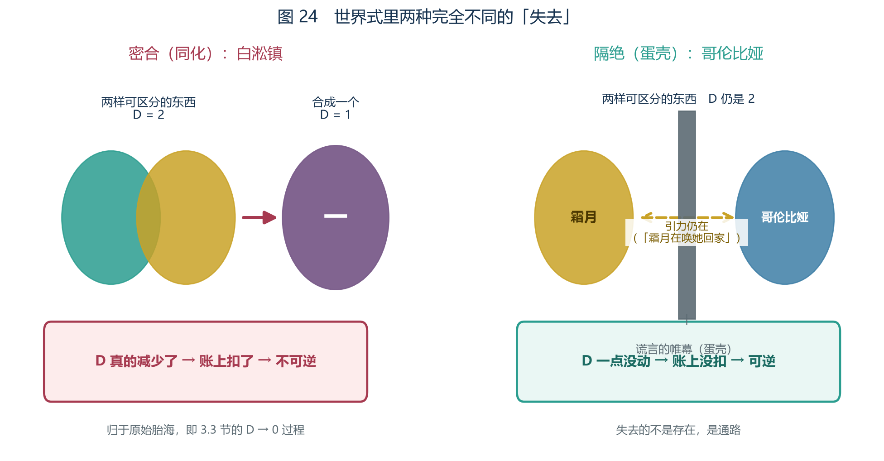

*图 24　两种完全不同的「失去」。左：密合把两样东西变成一个，D 真的降了。右：隔绝只是加了一道墙，D 一点没动。*

这就是本节的全部要害。把它做成表：

| 操作 | 提瓦特的实例 | 对 D 的作用 | 可逆吗 |
|---|---|---|---|
| **密合**（同化） | 原始胎海吞没一切 | **减小** | **不可逆**（1.6 节） |
| **隔绝**（蛋壳） | 虚假之天隔开世界与宇宙 | **不变** | **可逆** |
| 人界力的维持 | 七元素、地脉 | 保持 | 需持续投入（2.5 节） |

**「法涅斯用蛋壳隔绝宇宙和世界的缩影」——注意原文用的是「隔绝」。**

**蛋壳不消灭差别，它切断通路。**

按 3.2 节，蛋壳的作用是让外源项归零——**它停掉的是「进来的东西」，不是「已经在里面的东西」。**

**所以：由蛋壳造成的一切「失去」，在 D 的账上一分都没扣。**

#### 第三种「缩小」：为什么它两个都不是

上表只有三行，而读者会想到第四种情形：**把一样东西切小、切碎——它变小了，但没被合并，也没被隔开。**

**本院把这一种列出来，因为它和本节的核心区分容易混淆。**

| | 密合 | 隔绝 | **切小** |
|---|---|---|---|
| D 的变化 | 减小 | 不变 | **通常不变** |
| 原物还在吗 | 不在了（成一个） | 在 | **在（成几个）** |
| 按 1.5 节的读法 | 十个人变一个 | 十个人被关起来 | **十个人被拆成小份** |

**关键在于 1.5 节那句定义：D 数的是「有多少种可互相区分的东西」。**

　　　**所以「切小」通常不改变 D——它改变的是每一份的大小，不是份数。**
　　　**只有当切割把原本「能互相区分」的部分切成了「彼此无法区分」的部分时，D 才会下降。而那种情形，本质上还是密合。**

**本院把它写出来，是为了堵一条可能的反驳：**

　　　**「那么把白淞镇的人切碎再拼回来行不行？」**
　　　**不行。他们要的不是大小，是份数——而份数已经被扣掉了。**

### 三、「失去」的判据：四个条件

第二节给出了两种失去。**但只有两种，不足以回答「某某能不能回来」——因为现实里的失去往往同时含两种成分。**

本节把区分扩成一整套**可逐条核对的判据**。

#### 判据表

| 序 | 要问的 | 判什么 | 依据 |
|---|---|---|---|
| 1 | **性质**：是被合并了，还是被隔绝了？ | 是否可逆 | 1.6 节、3.2 节 |
| 2 | **自在**：它自己的四象限还完整吗？ | **回来的是不是本人** | 4.3 节 |
| 3 | **他在**：还有没有人记着它？ | 能不能回来一个版本 | 第十三节 |
| 4 | **认可**：地脉与命运还认它吗？ | 那个版本会不会再掉出去 | 第十五节 |

**四问的顺序不能颠倒，因为它是一条漏斗。** 第一问问的代价最低、否决力最强；越往后问，能救回来的东西就越少、也越不完整。

　　　**四问全过 → 本人回来。**
　　　**过第 1、3、4 问，卡在第 2 问 → 回来的是被记住的版本。**
　　　**卡在第 3 或第 4 问 → 连版本也回不来。**

#### 三个「准入条件」

把上面的判据压缩成可以直接使用的三条：

　　　**条件一（操作条件）：遭遇的必须是隔绝，不是密合。**
　　　**条件二（本体条件）：它的四象限必须有格子还装着东西。**
　　　**条件三（见证条件）：必须有人替它记着，而且地脉与命运还认这个「记着」。**

**三条都满足，才谈得上「回来」。**

#### 这一套判据的等级与出处

**本院必须把这一节的地位说清楚，否则它会显得比实际更强。**

| 部分 | 来源 | 等级 |
|---|---|---|
| 判据 1（密合 vs 隔绝） | 原文的「隔绝」「隔断」＋ 1.6 节与 3.2 节 | **乙级**（需一步翻译） |
| 判据 2（四象限） | 4.3 节的四象限 ＋ 她的自述 | **乙级**（原文从未按四象限盘点过她） |
| 判据 3（他在） | 读者的质疑 ＋ 任务记录 | **乙级**（「自在／他在」是本院整理的词） |
| 判据 4（地脉与命运承认） | 任务记录中的一句评语 | **乙级**（「承认」这个词是原文的，把它做成一道门槛是本院做的） |
| **这一整套判据的排序方式** | **本院自己排的** | **丙级** |

　　**方向：全部为回溯。** 本院是先看到「有人回来了、有人没回来」，才回头去找这两类现象的差别。

　　**推翻条件：如果出现一个反例——一个明明被密合（D 确实下降）的存在，却完整地回来了——那么整个判据表作废，本节需要重写。**
　　**本院要说清楚：这样的反例如果真的出现，它推翻的不是某一行，是这一节。**

### 四、原文怎么说的

这一节的结论有直证。哥伦比娅的记载中，有一段她自己留下的自述：

> 「她抬眼望去。但天空中什么都没有，**一层帷幕，一个谎言**。不知道为什么，她第一眼看到繁星遍布的夜空时就知道了那是个虚假的谎言。而**那与自己相连的某物则被这个谎言的帷幕所隔断**。」

**「隔断」。**

不是消灭，不是溶解，不是吞没——是**隔断**。而那层帷幕，就是 3.2 节所说的虚假之天。

紧接着的一句更关键：

> 「至少在夜晚，她能清楚感受到那来自**天外的引力**。这引力是无声的，但她反倒听得懂。**霜月在唤她回家**。」

请读者注意这两句话之间的逻辑：

**如果她被抹平了，就不会有「与自己相连的某物」；**

**如果联系被彻底切断，就不会有隔着帷幕仍然生效的引力。**

　　**引力还在，呼唤还在，关系还在。**
　　**被切断的是那条通路，不是她。**

而她的称号是「**空月归乡**」，记载里写她「亦是**归乡的空月**」。

**「归乡」——不是复活。**

**归乡需要的是「一条能走的路」，不是「一次起死回生」。**

#### 两个反证：假如换掉原文里的那两个词

本院在这里做一次反证，**它是本节最便宜的一次自检**：把原文里的关键词换成它的近义词，看看结论会不会变。

| 原文用的词 | 换成 | 结论会变成什么 |
|---|---|---|
| **隔断** | 「消灭」／「溶解」／「吞没」 | 她的 D 被扣了，**第五至七节整段作废** |
| **唤她回家** | 「她的残响」／「一段回声」 | 那不是关系，是遗物，**四象限的「愿望」格空掉** |

**所以本节的全部立论，压在两个词上：「隔断」与「唤」。** 这两个词是原文的，不是本院选的。

　　**这就是本节与补论四最大的不同。** 补论四的承重墙是一个本院自己选的建模判断（第十一节）；**本节的两根承重柱都是原文用词。**
　　**同样地，如果原文的措辞其实是「消灭」一类的词，本节与补论四会同时受损——但受损的方式不同：补论四只是少一个佐证，本节是整篇垮掉。**

### 五、她能回来，是因为四个象限一个都没少

按 4.3 节，意志被归档在四个象限里。**一个存在还剩几格，决定了它有没有可恢复的对象。**

看她被隔断期间的状态：

| 象限 | 她的状态 | 依据 |
|---|---|---|
| **灵魂**（本质） | 月神，本质**从未改变** | 记载直书其为月神；神之眼名「三相月临」 |
| **人格**（表象） | 那个一直在场上的「少女」 | 她从未从世间消失 |
| **记忆**（过去） | **保存在她体内** | 她的自述开头就是「最先听到的是歌声……睡吧，睡吧，我的小鸽子」 |
| **愿望**（未来） | **「霜月在唤她回家」** | 那引力就是她全部的方向 |

**四个格子，一个都没空。**

*图 25　能不能回来，取决于四象限还剩几格。左：哥伦比娅四格俱在。右：白淞镇死者四格俱空。*

**这就是为什么「第二次出生」是可能的。**

一份关于她的任务记载写的就是这句话：「获得了『**第二次出生**』的她，会想要做些什么呢……」

**注意「第二次出生」这个措辞。** 出生不是复活——**出生是从已有的东西里长出来，而不是把已经没有的东西变回来。**

**四象限完整，所以有东西可长。**

#### 四个格子的作用不一样

判据 2 说「必须有格子还装着东西」，但四个格子并不等价。**本院把它们各自的作用分开写，因为第三节那张漏斗表的第三、四问都挂在它们身上。**

| 象限 | 它在「回来」这件事里担任什么 | 如果它是空的 |
|---|---|---|
| **灵魂** | **身份**：回来的是不是「同一个」 | 回来的是别人，或者是一团没有名字的东西 |
| **人格** | **接口**：它能不能被世界认出来、能不能与人相处 | 有身份而无法现身，等于没有回来 |
| **记忆** | **内容**：回来之后还剩什么 | 回来的是空壳 |
| **愿望** | **方向**：它为什么要回来 | 它不会回来——回来需要一个指向 |

**最后一行的分量与前三个不同。** 前三个格子是「能不能」，第四个格子是「会不会」。

　　　**「霜月在唤她回家」这句话，在四象限的语言里就是第四格——那是她全部的方向。**
　　　**而方向不需要通路就能生效：引力可以穿透帷幕，呼唤可以隔着谎言被听见。**

**这就是「隔绝」和「密合」在四象限上的真正差别：**

　　　**密合会把四个格子一起抹掉；隔绝一个都动不了——它只挡住那个让四格重新连成一体的动作。**

　　**本条为解释性翻译，方向回溯，等级丙级。**
　　**方向：回溯。等级：丙级。**

　　**推翻条件：如果原文材料显示某些存在的「愿望」格可以在本体被隔绝时自行消失，本表的第四行作废，「方向」不再能作为独立一格。**

#### 四象限不全的三种情形

为了让判据 2 可以真的被使用，本院把「不全」的几种情形排开。

| 情形 | 缺哪格 | 结果 |
|---|---|---|
| 被吞没 | **四格俱空**（第二作者注：本院在此保留原表说法，第十二节会补上「他在」这一层） | 无对象可恢复 |
| 被替换（4.2 节那张表里的第三种现象） | **灵魂格被换掉** | 是一个新存在顶着旧名字，不是原来那个回来 |
| 被从记录中抹除（同表的第二种现象） | **人格格失去判定** | 还在，但世界认不出它 |

**第二行与第三行来自 4.2 节那张「系统对自己下判断」的表。** 本院把它们搬到这里，是因为它们与「四象限」是同一件事的两种语言：

　　　**4.2 节说「判定者与被判定者是同一个东西」；本节的四象限说「四个格子共同定义了一个存在」。两句话都在说：一个存在的「是它自己」，不是天然给定的，是需要被维持的。**

### 六、为什么接通需要一群人

按 2.5 节，**人界力维持 D 是要持续投入成本的**。

反过来同理：**重新接通一条被切断的通路，同样需要投入**——而且因为对手是蛋壳，投入量不会小。

这一点有直接旁证。与她的回归相关的那批记录里，参与的是**一群人**：

| 参与者 | 在做什么 |
|---|---|
| 桑多涅 | 布局、调度 |
| 茜特菈莉 | **主持仪式** |
| 芙宁娜 | 拍映影 |
| 千织 | 做灯光 |

**这不是排场。按世界式，重新接通是「定向注入人界力」的操作，一个人做不完。**

> **研究员按**：这一点本院可以作证。本院做过芒荒湮灭能源的并网工程，接一条管道要几百人日；而他们要接的是一条被神明级的帷幕切断的通路。**前者是工程，后者是奇迹——但两者在「必须持续投入」这一条上是同一回事。**

#### 这份成本账能推出来的三件事

上表是结果，而本院认为**它更值钱的地方在于它可以被当作账来读**。按 2.5 节那本「收支不平衡」的账，这次行动至少能读出三条：

1. **成本量与对手的量级挂钩。** 挡住她的是「神明级的帷幕」——**按 2.5 节的表，人界力是三种力里唯一需要持续投入的那一种，而它要对抗的正是把 D 拉小的那两种。** 所以这不是「花多少力气」的问题，是「跟谁比力气」的问题。
2. **成本必须被分摊。** 账既然大，就只能由多方分担；而上表里四个人的分工互不重叠（调度、仪式、记录、照明），**这本身说明它是工程，不是仪式。** 仪式可以由一个人主持，工程不行。
3. **成本是持续的，不是一次的。** 2.5 节的关键词是「持续投入」——**接通的成本不止花在接的那一刻，还花在接上之后不让它再断开。**

**第三点有一个立刻可用的推论：**

　　　**如果那份投入停了，通路就会重新断开——而这一次，断开的不再是「被隔绝」，因为四象限在接通期间已经被重新连成一体了。**

**本院把这个推论标出来，是因为它是一条可以被未来观察推翻的判断：**

　　**方向：预测。等级：乙级。**
　　**推翻条件：若将来出现「接通之后长期无人维持、而通路仍然稳固」的情形，本条作废。**

### 七、为什么偏偏是她：「十字路」就是那个不可判定位置

现在回答最难的一问：**提瓦特被隔绝、被吞没的东西远不止她一个，为什么回来的是她？**

答案在她自己的定位上。有一句记载写得非常明确：

> 「因为哥伦比娅是**第四个『新月』**，所以她开启了不同于三条道路的**第四条**，所以是**十字路的主人**。」

**「十字路」——交叉点，也就是选择点。**

现在翻回第四章的逻辑层。4.2 节论证过：**提瓦特是一个封闭、自指、足够复杂的形式系统，因此必然存在「系统内不可判定」的命题。**

　　　**不可判定 = 没有唯一答案 = 一个真正的选择点。**

　　　**「十字路的主人」，站的就是那个位置。**

**这就是她能回来的结构性理由：系统无法把她判出去。**

一个自指的系统对自己下的判断会失效——这正是 4.2 节那张表里列的同一类病症：世界树可被改写、某位神被从记录中抹除、某个席位失去判定。**只不过在她身上，这个「缝」没有被用来抹除谁，而是被用成了一扇回来的门。**

**她不是被规则原谅了，她是站在规则没有覆盖的那一格上。**

#### 用判据表复查一遍

本院用第三节那四条，把她和另外三类存在一起过一遍。**这张表是本节的收敛点，前面所有的小节都在往它上面落。**

| | 判据 1 遭遇 | 判据 2 自在 | 判据 3 他在 | 判据 4 认可 | 结果 |
|---|---|---|---|---|---|
| **哥伦比娅** | 隔绝 | **四格俱在** | 有人记着（见第十三节） | 在 | **本人回来** |
| **白淞镇死者** | 密合 | 空 | **还在** | 在 | **只能回来版本** |
| **雷内案中被提前切割的游魂** | 密合 | 空 | **无人记得** | **不认** | **连版本也回不来** |
| **被替换／被抹除者**（4.2 节） | 既非密合亦非隔绝 | **单格缺失** | 在 | **失去判定** | **不是回来，是覆盖** |

**第四行值得单独说一句：它不是「回不来」，是「回来的是另一个东西」。** 4.2 节把它列为「规则被应用到规则自己身上」的病症，本节把它列为判据 2 的一条失败形态——**两处说的是同一件事：一个存在的身份可以被系统改写。**

#### 「十字路」这一跳的性质

**本院必须承认：这一跳是本节最远的一次跳跃。**

「十字路的主人」这个称号是原文的；哥德尔层是第四章的；**把两者扣在一起是本院的主张。** 它标为**丙级推断**。

**为什么本院仍然保留它？** 因为它解释了一件否则解释不通的事：

　　　**被隔绝的东西不止她一个——双月也被挡在外面（第九节）。**
　　　**但只有她被写成「归乡」。**

**如果「隔绝可逆」是充分的，那么双月也该回来；如果「隔绝可逆」是不充分的，那么她为什么可以，需要一个额外的理由。「十字路」就是那个额外的理由。**

　　　**换句话说：判据 1 决定「有没有路」，判据 2 决定「有没有人」，而「她站在哪一格上」决定「这条路对她开不开」。**

### 八、一个时间上的巧合

还有一处值得记下。记载里写：

> 「距今**五百年前**，『霜月』诞生了新的神明——『库塔尔』月之少女。」

**而五百年前正是坎瑞亚灾变。**

按补论四的级联，坎瑞亚灾变是最近一次大灾难——也就是最近一次**差别度的大幅下降**。

**她的诞生，与最近一次大合并同时。**

按世界式的逻辑：一次大合并之后，世界的 D 被削掉一大块；**而世界要继续存在，就必须生出新的区别来补。** 那一次，补上的区别是她。

> 本院按：这一条标为**丙级推断**。「五百年前」这个时间吻合是**事实**；但「世界需要新区别来补」这层机制，原文没有说，是本文推的。

**本院在这里再补一句边界，因为这一条容易被读成「她是世界派来的」。**

　　　**本纪要没有这么说，也不能这么说。** 按 3.2 节与 3.3 节，世界内部**不存在产生差别的源**——没有任何力会增大 D。所以「世界要生出新区别来补」这句话，**在方程上是不成立的。**

　　　**能成立的只有它的弱版本：**

　　　　**在那一次大下降之后，世界在那一格上出现了「没有判定」的状态；而一个没有判定的位置，是可以被一个新东西占住的。**

　　　**方向：回溯。等级：丙级。**
　　　**推翻条件：如果「库塔尔」的诞生被证明与坎瑞亚灾变无关（例如记载显示她的诞生早于或晚于灾变数百年），本条作废。补论四的级联不受影响。**

### 九、那么白淞镇的人为什么不行

这是本补论标题里承诺要回答的另一半。

**因为他们遭遇的是另一种操作。**

**他们的处境就是图 24 的左栏。**

按 3.3 与 3.4 节，涨水的过程就是 D 趋向零的过程——**人被卷进原始胎海，不是被关在外面，是被并了进去。**

对照看：

| | 哥伦比娅 | 白淞镇死者 |
|---|---|---|
| 遭遇的操作 | **隔绝**——加了一道墙 | **密合**——被并了进去 |
| D 的变化 | **没有变化** | **确实减少了** |
| 四象限 | **四格俱在** | **四格俱空** |
| 有没有可恢复的对象 | **有** | **没有** |
| 「十字路」位置 | **占着** | **不在** |
| 能不能回来 | **能** | **不能** |

**最后一行的差别，不是待遇的差别，是数学的差别。**

　　**他们不是被拒绝回来，是没有可以回来的东西。**

> （这一句后来被一位读者质疑过，而他是对的。修正见第十三节。）

这也顺带否定了一个很容易产生的想法：**「既然哥伦比娅能回来，那用同样的办法也能把别人带回来。」**

**不能。** 拿「重新接通」去解决「已经合并」，是**工具和对象对不上**——就像拿钥匙去开一扇已经被拆掉的门。

#### 这个「不行」是三条里的一条，不是全部

本院在此提醒读者注意上表的位置：**它是第三节那张判据漏斗走到第 2 问时的结果，不是走到终点时的结果。**

　　　**白淞镇的人在第 2 问（自在）上失败了。**
　　　**而第 3 问（他在）与第 4 问（认可）他们是通过的——第十三与十五节要说的正是这件事。**

　　　**所以第九节这张表的最后一格「不能」，严格写应当是「不能以本人回来」。**

**这一处措辞上的保留，是本节后来被读者纠正出来的；本院把它留在这里，而不是偷偷改掉，因为它恰好说明了这套判据的价值：**

　　　**两栏表只能回答「能不能」，四问判据能回答「能到什么程度」。**

### 十、这一节的普遍意义

补论五看起来是在解释一个人物，其实它补上了前面四篇都缺的一块。

**前三篇补论里，「失去」只有一种。** 补论一算糊了的菜（D→0）、补论二算失效的胶基、补论三算城市的容量上限、补论四算下一次灾难——**全都是「D 减少」这一种。**

**本节第一次把「D 减少」和「通路切断」分开。**

而这个区分有普遍用途。它给出了一个**判据**：

> **当一个东西「消失」了，先问一句：它是被合并了，还是被隔绝了？**

- 被**合并**的：**没有回头路。** 白淞镇的人、糊了的菜、被胎海吞掉的文明。
- 被**隔绝**的：**还有回头路，但要走回去需要持续投入。** 哥伦比娅、被蛋壳挡在外面的双月、以及——按 3.2 节——**整个提瓦特**。

**最后一条值得单独说一句。**

提瓦特自己就是被隔绝的：蛋壳把它和宇宙隔开，外源项因此归零，于是世界式只剩坍缩解。

**但从本节的区分看，「被隔绝」意味着「还有一条路」。**

　　**蛋壳挡住的是通道，不是世界。**
　　**而要重新接通它，需要的不是打败谁，是有人从外面把那条路走通一次。**

——这恰好就是 4.3 节所说的「降临者」：**他不是来打赢的，他是来当那条通路的。**

#### 把提瓦特这条过一遍判据表

本节最后这个推论太大，本院把它按第三节那四条逐条走一遍，**走不通的地方如实写出来。**

| 判据 | 提瓦特 | 判定 |
|---|---|---|
| 1 遭遇 | **隔绝**（蛋壳，3.2 节） | **过** |
| 2 自在 | 世界的四象限还完整吗？ | **看不出**——本纪要没有能力为「世界」本身盘点四象限 |
| 3 他在 | 有别的存在记着它吗？ | **看不出**——同上 |
| 4 认可 | 地脉与命运还认它吗？ | **看不出**——同上 |

**四问里只过了第一问。**

　　　**所以本节对提瓦特的结论，严格写应当是：它是「被隔绝」这一类，因此按判据 1 它在可逆的那一栏；**
　　　**但「可逆」不等于「会回来」——那要看后面三问，而本院对后面三问没有材料。**

**这就是本节与补论四在性质上的又一次不同：补论四的结论是一个数字，本节关于提瓦特的结论只是一个分类。**

　　**方向：回溯。等级：乙级（判据 1）／本节其余为「无判定」。**
　　**推翻条件：若后续材料显示蛋壳同样会抹平内部的差别（而不只是切断通路），则判据 1 对提瓦特的适用作废，本小节整段取消。**

#### 一个可用的副产品：本纪要以后该问什么

本节真正的实用价值不在结论，在**提问方式**。本院把它写成一张速查表，供后续各章使用：

| 遇到的说法 | 该问什么 | 最可能的答案 |
|---|---|---|
| 「某某消失了」 | 是被合并，还是被隔绝？ | 决定有没有回头路 |
| 「某某回来了」 | 回来的是本人，还是一个版本？ | 看判据 2、3 |
| 「某某被遗忘了」 | 是没人记着，还是地脉不认？ | 看判据 3、4 |
| 「只要投入够，什么都能救」 | **这句话是错的** | 密合不可逆 |
| 「世界完了」 | 是「被隔绝」还是「被合并」？ | 前者还有一条路 |

**第二行与第三行是本节新增的**——本节原来的两栏表只能回答第一行与第四行。

### 十一、边界

三条必须说清楚的。

**第一，本节的核心区分是推出来的，不是原文写明的。**

原文只写了「隔断」这个词，以及「引力仍在」。**「隔断不减少 D」是本文从 1.6 节与 3.2 节推出来的**，属于乙级推断。若后续物证表明蛋壳也会抹平内部差别，本节需要重写。

**第二，「四象限俱在」是本文的判断，不是原文的清单。**

四个格子的填法（灵魂=月神、人格=在场的少女、记忆=霜月的歌声、愿望=唤她回家）**全部由本文从她的自述里读出**。原文从未按四象限盘点过她。

**第三，「十字路 = 不可判定位置」是本文最远的一次跳跃。**

「十字路的主人」这个称号是原文的；哥德尔层是第四章的；**把两者扣在一起是本文的主张**。它标为**丙级推断**。

　　　**这一跳如果错了，第八节作废，但第二至六节不受影响**——因为「隔绝可逆而密合不可逆」这个区分，不依赖「十字路」的解释。

**第四，第三节那套四问判据，是本院事后整理的。**

**判据本身来自原文与前面的章节，但「四问的先后顺序」和「漏斗」这个说法是本院排的。** 顺序如果错了（例如「认可」应当排在「他在」之前），本节的用法会变，**但判据表本身不会因此作废——作废的只是使用顺序。**

　　　**推翻条件：若后续材料显示地脉的「承认」先于任何人的记忆而发生（即：无人记得的存在也能被地脉接纳），则第三节的漏斗顺序要改，第十二节的第二、三层要颠倒。**

### 十二、结语

本节回答的是一个具体问题，但它真正的产出是一句话：

> **世界式没有把她算丢，是因为她从来不在「被合并」那一栏里。**
> **她在「被隔绝」那一栏——而那一栏是可以重新接通的。**

**这两栏的区别，是这份纪要从头到尾最实用的一条。**

因为它把「还有救」和「没救了」分开的标准，从**感情**换成了**账目**：

　　　**不看你想不想救他。**
　　　**看他在 D 的账上，到底被扣了没有。**

#### 两栏后来变成了四问

**上面这两句话是本节最早的版本。** 它成立，但它只覆盖了「本人」这一层。

**本节后面新增的补记，把它扩成了第三节那张四问判据表。** 本院在这里把两版并列，因为它们各自管一件事：

| 版本 | 回答的问题 | 用在哪 |
|---|---|---|
| **两栏**（本节初版） | 有没有回头路 | 判断一类现象 |
| **四问**（第三节） | 能回来到什么程度 | 判断一个具体的存在 |

　　　**本院没有删掉两栏版，是因为它在课堂上更好用：一句话能记住的东西，比一张表更容易传下去。**

---

### 十三、补记一：一条质疑，与一个没被算到的账户

本节发表之后，有一位读者提了一个问题。它只有一句话：

> **「白淞镇他们的家人这种联系，不能算可以回来的东西吗？」**

**这一问是对的。第九节的说法不完整。**

第九节写的是：「他们不是被拒绝回来，是没有可以回来的东西。」**这句话只对了一半——它对的是死者自己，错的是死者和生者之间。**

#### 两种存在

一个存在，其实同时活在两个地方：

| | 在哪 | 是什么 |
|---|---|---|
| **自在** | 它自己的四象限里 | 它作为它自己的那套记忆、愿望、灵魂、人格 |
| **他在** | **别人的四象限里** | 它在别人的记忆与愿望中留下的那一部分 |

**密合摧毁的是「自在」。**

**而「他在」不在被密合的那个人身上——它在幸存者身上。所以它没有跟着一起被合并。**

　　　**死者的四象限是空的。**
　　　**但幸存者的记忆象限里，还装着他们。**

　　　**所以「可以回来的东西」是有的——只是它不在死者那边，在生者这边。**

#### 「自在／他在」这两个词是从哪来的

本院必须在这里交代一句，**因为这一组词在原文里一个都找不到。**

| 词 | 出处 |
|---|---|
| 「自在」 | **本文的整理**。指一个存在自己的四象限 |
| 「他在」 | **本文的整理**。指它在别人四象限里的那一部分 |
| 两个词要处理的那件事 | **原文有**——就是十三节开头那一句质疑所指的联系 |

**换句话说：原文提供的是一件事实，本文提供的是两个名字和一张表。** 名字如果起得不好，事实还在；**但如果事实本身不成立（例如生者对死者的记忆其实也随着死亡被抹掉），那么本节整段作废。**

　　**方向：回溯。等级：乙级（需要一步翻译：把「家人之间的联系」翻译成「存在的一部分寄放在别人的四象限里」）。**
　　**推翻条件：若后续材料显示提瓦特的记忆同样受「同化」支配——即生者的记忆也会被 D 的下降一起抹平——则「他在」不是独立账户，本节整段作废。**

#### 为什么「他在」能躲过密合

这一条值得单独说，**因为它是「自在／他在」这组词唯一真正的用处**。

按 4.3 节的四象限归档，一个存在的四个格子**都在它自己身上**——这是本纪要前面所有章节的默认读法。**而这位读者的质疑指出了一件被漏掉的事：**

　　　**「四象限」这个归档方式本身，是「自在」的归档方式。**
　　　**它对「他在」一个字都没说。**

**为什么「他在」能躲过密合？** 理由很朴素：

　　　**密合发生的地方，是那样东西所在的地方。**
　　　**而「他在」所在的地方，是另一个人身上。**

**所以这不是「他在特别结实」，是「它压根不在现场」。**

　　　**一句更冷的说法：死者的四象限空了，而这恰好是「他在」得以存活的原因——**
　　　**如果死者的四象限还在，那说明他没有被密合，而那是另一个故事了。**

### 十四、补记二：原文里恰好有这一段

本院调阅了一份枫丹的任务记录。里面有一段对话，问的正是这件事：

> **「木偶」：但如果终究要失去的话，为什么还要费心去经营它呢？**
>
> **旅行者：因为过程中所获得的东西会留下，它们是独一无二且无可替代的。**
>
> **「木偶」：那在失去它们的时候，你岂不是会更加伤心？**

而那位「木偶」后来自己给出了回答：

> **「但人生就是不断的失去与告别。我们在失去与告别中学会同这个世界相处，然后又在相处中得到新的东西。」**
>
> **「就像你说的，这个『追寻』的过程总会留下些什么。它们独一无二不可替代，是我们会选择去『记录』在心中的东西。」**

**请注意最后那个词：「记录」。**

　　　**「记录」就是这个操作的原文名字。**

#### 「记录」在世界式的语言里是什么

本院把这一段对话按世界式的语言翻译一遍。**翻译的每一步都单独写出来，因为这一节是本节与原文扣得最紧的一处。**

| 原文的话 | 世界式的语言 |
|---|---|
| 「过程中所获得的东西会留下」 | 密合会扣掉 D，但有一些东西**不在被扣的那个账户上** |
| 「独一无二且无可替代」 | 那部分差别**不可被别的差别等价替换**——它是「他在」 |
| 「会选择去『记录』在心中」 | 这个操作有一个名字：**记录** |

**而「记录」这个操作做了什么，可以用 4.3 节的四象限写清楚：**

　　　**它把一个人的「他在」部分，写进另一个人的四象限里。**

　　　**写进哪一格？记忆格。而按第五节的表，记忆格的功能是「内容」——回来之后还剩什么。**

**所以「记录」不是纪念，是一次归档：** 它把原本会被密合一起扣掉的差别，**转存到一个不会被扣的地方。**

　　　**而它的名字是原文给的，不是本院造的。** 这一点在本节里很少见——**前面所有的区分都是本院推的，只有这一个有原文的名字。**

它把一个人的「他在」部分，**写进另一个人的四象限里**，让它不至于随着本人的消失而消失。

**而本节可以补一个旁证：那位说这段话的人，自己就是靠「记录」变成人的。**（她起初是一个自动人偶，是「开始记录」这件事让她长出了人格——详见回溯二对三档操作的讨论。）

#### 这段对话本身在做的事

本院最后指出一件事，它与内容无关，与**这段对话发生的场合**有关。

**那位「木偶」问的是「为什么还要费心去经营」。而她自己后来是靠「记录」长出人格的。**

　　　**换句话说：她不是在讨论一个道理，她是在报告一件自己身上发生过的事。**

**这一条不构成本节的证据**——它是人事上的巧合，不是文本上的支持。**本院把它写在这里，只是因为它解释了为什么这段对话会出现在本节：**

　　　**本节讨论的是「能不能回来」，而这段对话讨论的是「回来的是什么」。**
　　　**两个问题挨在一起，是因为它们共用同一个词。**

### 十五、补记三：还有第三个条件——地脉认不认

同一条任务线还提供了另一批材料，它把「能不能回来」这个问题又往下压了一层。

记录里，那位「木偶」说明了一批游魂的来历：**水仙十字结社的雷内研究过「灵魂的切割」**，而被切割的灵魂有两种下场：

| 被切割的时机 | 下场 |
|---|---|
| **在雷内苏醒之后** | 融进雷内的意识；最终在枫丹人被变回「人」之后，**回归了地脉** |
| **在雷内苏醒之前** | **无家可归**，沦为在枫丹水中永远飘荡的游魂 |

而记录中另一位角色的评语是：

> **「简直就像不幸游离于世界之外的存在，既不被地脉承认，也不被命运承认。」**

**注意「承认」这个词。**

**它意味着：回到地脉不是自动的，是有门槛的。**

　　　**被承认的，可以回家。**
　　　**不被承认的，只能在外飘着——而飘得久了，就会「渐渐同他物融合……慢慢变变为某种污秽的聚合体」。**

**也就是说：连「他在」这条路，对某些存在也是关闭的。** 因为「他在」需要有人记着；而连地脉和命运都不承认的存在，也就没有人会记着。

#### 「承认」是什么：两本账的登记章

**「地脉」与「命运」在提瓦特是两个不同的东西，而这段材料把它们并列写在一起。**

本院按 3.1 节与 2.5 节的意思，把它们各自的职能整理如下。**这张表是本院整理，不是原文明说。**

| | 它记的是什么 | 类比 | 失去它会怎样 |
|---|---|---|---|
| **地脉** | 一个存在**在世界里的位置** | 户籍 | 不被地脉承认 = 世界不认它在这个位置上 |
| **命运** | 一个存在**接下来的走向** | 排程 | 不被命运承认 = 它没有下一步 |

**两者合起来，恰好是「自在」之外的那个公共账本：**

　　　**地脉记「它在不在名册上」，命运记「它往哪儿去」。**
　　　**两样都没有，就既没有位置，也没有方向。**

**而本节的判据 4，问的正是这个公共账本有没有给它盖章。**

　　　**注意这与判据 3（他在）的关系：判据 3 问的是「有没有私人记得它」，判据 4 问的是「公共账本认不认它」。**
　　　**私人记得而公共不认——那正是「飘着」；公共认了而无人记得——那是本节没有材料的一种情形。**

　　　**方向：回溯。等级：乙级（这一整段是本院把两个原文词整理成两本账）。**
　　　**推翻条件：若后续材料显示地脉与命运其实是同一个东西的两种叫法，本表的两行合并，判据 4 的两道门槛变成一道。**

#### 为什么这条会被漏掉

本院要在这里认一个错，**因为这一条的漏掉与上一节的漏掉是同一个错。**

| 漏掉的是 | 为什么漏掉 |
|---|---|
| 「他在」（补记一） | 因为本节的四象限只归档了「自在」 |
| 「地脉认不认」（补记三） | 因为本节的四象限只归档了**存在自己**，没归档**存在与世界之间的登记关系** |

　　　**两次漏掉是同一个原因：本节的判据表是从「它自己还剩什么」出发的。**
　　　**而一个存在其实有三层——它自己（自在）、别人那里的它（他在）、账本上的它（登记）。**

**第三层是这次补记才补上的。**

### 十六、补记四：修正后的判据

所以本节第九节那个两栏表，现在要改成三栏：

| 遭遇 | 自在 | 他在 | 能不能回来 |
|---|---|---|---|
| **隔绝**（哥伦比娅） | **完好** | 完好 | **能，回来的是本人** |
| **密合**（白淞镇死者） | 空 | **还在** | **只能回来「被记住的版本」** |
| **既不被地脉也不被命运承认**（雷内案中被提前切割的游魂） | 空 | **无人记得** | **连版本也回不来** |

**第一行是补论五原来的结论。**

**第二行是这位读者补上的。**

**第三行是本院在同一条任务记录里另外查到的。**

#### 三行分别对应第三节的哪几问

本院把这张三行表与第三节的四问判据对接起来，**以便读者看出哪些是同一件事、哪些是新的。**

| 三行表的一行 | 对应第三节的哪几问 | 结果 |
|---|---|---|
| 第一行（隔绝） | 1、2、3、4 **全过** | 本人回来 |
| 第二行（密合） | 过 1 的反面？——见下 ——实际是：**2 失败，3、4 通过** | 版本回来 |
| 第三行（不被承认） | **2 失败，3 失败，4 失败** | 什么都不回来 |

**第二行的第一格，本院要特别说明一下，因为它是这张对接表里唯一一处说不通的地方。**

　　　**判据 1 问的是「遭遇是密合还是隔绝」，而白淞镇死者遭遇的正是密合——按漏斗的读法，第一问就应当拦下他。**
　　　**但第二行又说他「他在还在、还能回来一个版本」。**

**这两句话不矛盾，因为它们在问不同的东西：**

　　　**判据 1 决定「本人这条路」通不通。对白淞镇死者，它不通——所以第九节那张表是对的。**
　　　**判据 3 决定「版本这条路」通不通。对白淞镇死者，它通——所以这位读者也是对的。**

**本院据此把第三节的漏斗改写为两条并行的路：**

| 路 | 走哪几问 | 通向 |
|---|---|---|
| **本人之路** | 判据 1 → 判据 2 | 四象限俱在的能走通 |
| **版本之路** | 判据 3 → 判据 4 | 有人在别处记着、且账本认的能走通 |

**判据 1 与判据 2 管第一条路，判据 3 与判据 4 管第二条路。** 只有四条全过，才既是本人、又被登记。

　　　**这是本节写作过程中唯一一次推翻了自己上一段的排法。本院把它留着，是因为它比原来的排法更接近材料。**

　　　**方向：回溯。等级：乙级。**
　　　**推翻条件：若后续材料显示「版本之路」不存在——即被密合者的「他在」无论被记得多牢都不可能以任何形式现身——则第二行整行作废，本节回到两栏。**

#### 四行齐备版

把 4.2 节那两类「系统对自己下判断」的情形也放进同一张表，本节就得到一份完整的判据清单：

| 遭遇 | 自在 | 他在 | 登记 | 结果 |
|---|---|---|---|---|
| 隔绝 | 完好 | 完好 | 认 | **本人回来** |
| 密合 | 空 | 还在 | 认 | **版本回来** |
| 密合 | 空 | 无人记得 | 不认 | **什么都不回来** |
| 被替换／被抹除 | **单格缺失** | 在 | **失去判定** | **回来的是另一个** |

**最后一行不是本节的材料，是 4.2 节那张表的第三、四行。** 本院把它并进来，是因为它回答了一个本节没答的问题：

　　　**「如果人回来了、但他不是原来那个，这算哪一类？」**

**按这张表，它不属于前三行的任何一行，它是第四行——一个单独的病。**

### 十七、补记五：结语

阿兰·吉约丹——那位造出「木偶」的人——在他留下的记录里写过一句话：

> **「在遗忘与留存的作业中，我们决定了自己将成为什么样的人。」**

本节原本是一份**账目**：谁在 D 的账上被扣了，谁没有。

**现在这份账目上多了一栏。**

　　　**而多出来的那一栏，恰好是三位当事人自己一直在讨论的那件事。**

> 本院按：本节新增的部分，其依据除注明外，均出自本院调阅的枫丹任务记录。「自在／他在」这组词是本文的整理，不是原文用语；三栏判据同样是本文的整理。原文只提供了三批事实，把它们排成一张表的，是本文。

#### 全节的三层收敛

本节写到补记结束，一共得到三层结论。本院把它们按「靠什么支撑」排开，**因为越往下越依赖本院自己的整理。**

| 层 | 结论 | 支撑 | 等级 |
|---|---|---|---|
| **一** | 密合不可逆，隔绝可逆 | 1.6 节、3.2 节、原文的「隔断」 | **乙级** |
| **二** | 他在可以独立存活，靠「记录」转存 | 读者质疑、任务记录、回溯二的「归约」 | **乙级** |
| **三** | 四问的排序、两条路的划分、地脉与命运两本账 | **本院自己的整理** | **丙级** |

**本院把这张表放在全节最后，是因为它是本节唯一一句真正有用的总结：**

　　　**第一层是材料给的，第二层是材料加一步翻译给的，第三层是本院排的。**
　　　**第三层改一次，本节就要重写一次；而第一层如果倒了，本节连同补论四都要重写。**

#### 最后一句

**本节回答的是一个具体问题，但它真正落地的东西是一张表。**

　　　**而那张表能做的事情只有一件：把「还能不能救」这个问题，从一个感情问题，改成一个可以逐条核对的问题。**

---

## 回溯一　「规格」：一条刻在万物之中的界限

> **本篇的性质：回溯。**
>
> 按体例第 6 条，回溯篇是**本院先看到材料、再提出框架**的篇章。它们**不构成对本纪要的支持**——因为任何框架都能容纳任何观察，只要允许它事后长出一个新章节。
>
> **它们能说明的只有一件事：这个框架容得下这些材料。**
>
> **本院把这句话再说重一点。** 一份回溯写得再长，它的全部功劳也只是「没有把框架撑破」。而一个框架能装下的材料越多，它被证伪的机会就越少——**这是它的弱点，不是它的优点。**
>
> 所以读者在本篇里应该找的不是「又对上了一处」，而是两样东西：**这一步翻译付了什么代价**，以及**这个说法要怎么才能被推翻**。前者写在第三节之二、第三节之三与第十节，后者写在第九节，那里每一条都写了检验办法。
>
> 本篇末尾第九节给出了三条**可被推翻的条件**。本院恳请读者去攻它。

**先把本篇各类内容的身份摆出来**，免得读者把它们混着读。这份纪要吃过的亏，多半来自把不同等级的东西放在同一个句子里：

| 内容的类型 | 具体是哪一句 | 方向 | 等级 | 它会被什么推翻 |
|---|---|---|---|---|
| 记录原文 | 第二节抄下的五句话 | — | **甲级**（原文直说） | 只会被「这份记录本身不可靠」推翻，见第十节 |
| 一步翻译 | 规格＝D 的上限 | 回溯 | **乙级**（需一步翻译） | 第九节第三条 |
| 跨卷对照 | 规格 ↔ 第二卷 7.3 节的紫外截断 | 回溯 | **乙级**（功能相同，无换算） | 第三节之四末尾 |
| 形状对应 | 那个「什么」是一个在场的、不属于这个系统的外源 | 回溯 | **丙级**（形状对应） | 第七节之三与第九节第三条 |

**这张表就是本篇的提要，而它说的第一件事是一件不好听的事：本篇里没有一条甲级结论。** 甲级的部分全部属于那份记录，不属于本院。本院在这一篇里的全部工作，是把别人的话翻译一遍，并说清这次翻译丢掉了什么。

### 一、缘起：一条评论领本院去看了一份实验记录

补论五写完不久，第二期的观众里有人提了一条线索。原话大意是：

> **「旅行者因为自己就是变量，所以可以在砂糖的魔导课题里弄出 16 倍甜甜花。」**

**这条线索和前面几条不一样。** 前面几条都是推论，而这一条指向**一份具体的实验记录**。

**这个区别在方法上很要紧：一条指向推论的线索只能被讨论，一条指向记录的线索可以被查证。** 本院能做的第一件事，不是判断它对不对，而是去把那份记录调出来。下面是调阅之后的原样转录，本院只做了断句。

本院随即调阅了这份记录。它来自蒙德的一位炼金术士，内容是受某学会委托所做的一系列周期性实验——**配出一种能让甜甜花长到十六倍的药剂**。

记录很长，但其中五句话让本院停了下来。

### 二、五句话

本院把这五句原样抄在下面，因为它们构成了本补论的全部依据。

> **「在生长至十二倍至十四倍大小的时候，会无法承受……」**

> **「就像是触摸到了不可触碰的界限。」**

> **「正如规格是一种刻写在万物之中的法则。」**

> **「所以反复的实验也是为了确认规格界限的稳定……证明界限的始终存在。」**

> **「也许法则的界限因为什么正在发生变动。」**

**请注意这五句话的排列顺序。** 它们不是零散的感慨，而是一条完整的论证链：

　　　先描述现象（到某个倍数就死）→
　　　再命名它（界限）→
　　　再给出它的性质（规格，且是法则）→
　　　再说验证它的方法（反复实验）→
　　　最后给出一个反常的观察（界限在变动）。

**这五句话，把本文前面五篇补论缺的那块机制补上了。**

### 二之二　这五句话各自的证明力

上一节说它们是一条论证链。但一条链子上的每一环强度并不相同，本院在这里把每一环单独称一遍——**因为本篇后面所有的推论都挂在这五句话上，它们的强弱直接决定了本篇的强弱。**

| 句子 | 它做的是什么 | 它是哪一种陈述 | 本院给的等级 |
|---|---|---|---|
| 十二倍至十四倍时「无法承受」 | 描述一次观察 | **观察陈述**：可以被重复实验检验 | **甲级** |
| 「触摸到了不可触碰的界限」 | 给现象起名 | **命名**：命名本身不增加信息 | 甲级（它确实是原文用词） |
| 「规格是一种刻写在万物之中的法则」 | 给出性质 | **性质陈述**：这是五句里野心最大的一句 | **甲级引文，乙级用法**（见第三节） |
| 反复实验「确认规格界限的稳定」 | 说明实验方法 | **关于方法的陈述**：它说明当事人相信什么 | 甲级 |
| 「也许法则的界限因为什么正在发生变动」 | 给出一个反常 | **推测**：原文自己用了「也许」 | 甲级引文，**丙级推论** |

**读这张表要从下往上看。** 最弱的是最后一句：它带着「也许」，而这个「也许」是说话人自己加的，不是本院替他谦虚。**本篇第七节要用它去指一个「在场的、不属于这个系统的外源」，那一步的重量全部压在「也许」两个字上。**

最结实的是第一句：它是**一个可以重做的实验**。这一点值得单独说：在本文引用的全部材料里，来自实验记录的极为少见，**因为一个可以被重做的观察，才能真的被推翻。**

### 三、翻译：规格就是 D 的上限

回到 1.5 节。差别度 D 的定义是「世界里可区分事物的总量」。

而一份实验记录里的「**规格**」，翻译过来正是——**一个对象所能维持的差别度的上限**。

　　　**规格 = D 的上限**

这个对应不是本院硬凑的。看记录里那句定义性的表述：

> **「正如规格是一种刻写在万物之中的法则。」**

**「刻写在万物之中」**——这句话说的正是补论三里的那个概念。补论三论证过：一座城市能装多少人，不由资源决定，而由它**能持续支付多少 D 维持费**决定。那里本院把它叫做「D 维持费」。

**现在这份记录给了那个上限一个名字：规格。** 而且它比本院的说法更进一步——**它明说这是一条法则，刻写在万物之中。**

### 三之二　这条翻译的四步

**「规格＝D 的上限」这七个字看上去像一句同义反复，其实是四步。** 本院把每一步单独写出来，并在每一步后面标上它自己的等级——**因为四步里只要有一部是空的，整个等式就不成立。**

**第一步：先确定记录在谈什么量。**
记录谈的是「一个对象能长到多大」。它的单位是**倍数**：十二倍、十四倍、十六倍。这是一个**相对量**——相对于这株植物原来有多大。
　　**这一步不需要翻译，它是原文直说。等级：甲级。**

**第二步：把「能长到多大」换成可计量的东西。**
按 1.5 节，一个东西「有多大」在本文的语言里对应它携带多少可区分的东西——**差别度 D**。植株在膨胀式生长，它的内部结构在增加，可区分的东西在增加，**D 在上升。**
　　**这一步用了一次替换：把「大小」换成「可区分事物的总量」。等级：乙级。**

**第三步：把「无法承受」换成「有一个上限」。**
记录说的是「无法承受」，并且当事人给的四个字原因是「因为无法超越」。**「无法超越」四个字里已经含有一个上限**：能超越的东西没有上限，不能超越的东西有。
　　**这一步用了一次替换：把「承受不住」换成「支付不起」。等级：乙级。** 依据是补论三的 D 维持费——**大小不是白来的，它要持续付钱。**

**第四步：把「刻写在万物之中」换成「不由系统内部决定」。**
这是最远的一步。记录说的是「法则」，而且加了「刻写在万物之中」这个状语；本院把它读成——**这个上限不是这个对象自己选的，也不是它能自己改的。**
　　**这一步用的是形状对应，不是翻译。等级：丙级。**

**四步合起来，本院的结论是：规格是对象的一个量，它由维持能力与维持费共同决定，且不由对象自己改写。**

　　　**方向：回溯。等级：乙级（以第一步与第三步为骨架，第四步最松）。**
　　　**推翻条件：见第九节第三条。** 具体地说，只要找到某个对象，它的规格明显不由可区分事物的总量决定，而是由别的东西决定（例如纯粹的材质强度），第三步与第四步就一起作废。

### 三之三　这条翻译最松的一环：倍数与总量

本院在核对这四步的时候，发现了一个必须写下来的漏洞。

　　　**记录给的是倍数——一个相对量。**
　　　**本文的 D 是总量——一个绝对量。**

一个相对量与一个绝对量之间要能对应，必须先定一个**基准**：同一个对象、同一个时刻、同一个观察方式下的 D。而这份记录里没有这个基准，**因为它根本不需要**——炼金术士关心的是「这一次长到了几倍」，不是「这一株里有多少可区分的东西」。

**所以「规格＝D 的上限」这句话，严格说是「规格＝D 的上限，在一个尚未定义的基准下」。**

**这里要说清一件比缺数据更麻烦的事：D 目前没有独立的测量手段。** 1.5 节给出的是定义，不是量具。所以这一步缺的不是「暂时没测」，而是**「暂时没有定义怎么测」**。

　　　**这是本篇自己找出来的漏洞。等级：丙级。**
　　　**推翻条件：如果将来能给出 D 的测量方式，而这个方式应用在甜甜花上得到的失败点与「十二倍至十四倍」这个区间不对应，那么第三节的整个翻译就要重写。**

本院把它写在这里，是因为**一个只在对自己有利的地方标等级的回溯，不配叫回溯。**

### 三之四　与第二卷第七章的对照：规格与紫外截断

合订本的意义在于两卷互相解释。**规格这个词与第二卷有一条现成的对应，本院把它整条搬过来，包括它自己的等级。**

第二卷 7.2 节把第一卷说的「封闭」翻成物理里的**截断**：

> **「一个理论只有在带上紫外截断 Λ 之后才是良定义的；而截断的意思是「这个能标以上的东西我们不管」。」**

并且明说：**虚假之天就是那个截断。**

而第二卷 7.3 节列出的第一组对应，正是**规格**：

| 第 47 号 | 物理里对应物 | 等级 |
|---|---|---|
| **规格**（D 的上限） | **紫外截断 Λ** | 乙级 |

第二卷对它的说明是：**「规格对应截断」是乙级：两者的功能相同（都给出上限），但本院没有给出从规格到 Λ 的换算。**

**这两句话要一起读，因为它们是这条对照的全部内容：功能相同，但没有换算。** 本院把它摆成一张对照表，这样「同」与「不同」各占几行就一目了然：

| 维度 | 规格（第一卷） | 紫外截断 Λ（第二卷） |
|---|---|---|
| 它是什么 | 一个对象所能维持的 D 的上限 | 一个理论适用的能标上限 |
| 它给出什么 | 一个上限 | 一个上限 |
| 谁来给 | 万物自身（「刻写在万物之中」） | 研究者自己设定（技术手段） |
| 分不分对象 | **分**（甜甜花 12~14 倍，骗骗花 16 倍以上） | 一个理论一般只带一个 |
| 越过去会怎样 | 付不起维持费，整株塌掉 | 截断以上的内容不再计入，理论失效 |
| 换算 | **没有** | **没有** |

**这张表里最值得看的是「谁来给」这一行，因为两边的方向是相反的：规格是被刻上去的，截断是被选上去的。**

　　　**方向：回溯。等级：乙级（沿用第二卷 7.3 节的判定，本院不擅自升级）。**
　　　**推翻条件：若在提瓦特找到「规格能够被研究者直接改写」的证据——某次实验直接改掉了某个对象的规格，而不是绕过它——则「刻写」与「选择」这一对差别消失，本节退化为一次同名对照。** 反过来，若物理一侧出现「分对象的截断」（偷渡客按：不同的场可以各有各的截断尺度），则「分不分对象」这一行也不再构成差别。

**还有一处必须说清楚：第二卷 7.3 节那三组对应里，只有规格这一条是乙级，另外两条——死之诅咒对应反项、天钉对应一次截断的重新设定——都是丙级，第二卷自己说「本院找不到任何方式去检验它们」。**

这件事在合订本里有一个直接后果，本院把它提前写在这里，因为回溯一之二要用到：

　　　**当第一卷把一条材料交给第二卷，而第二卷只能给它一个丙级时，这次跨卷引用是一次等级下降，不是升级。**

本院不打算用「跨卷对应」来给任何一条材料加分。
### 四、为什么十二到十四倍会死

记录里对失败过程的描述极为精确：

> **「然后在生长至十二倍至十四倍大小的时候会无法承受……会以非自然的形式枯萎和朽败，变成一地的枝叶。」**

而当事人对原因的解释只有四个字：

> **「因为无法超越。」**

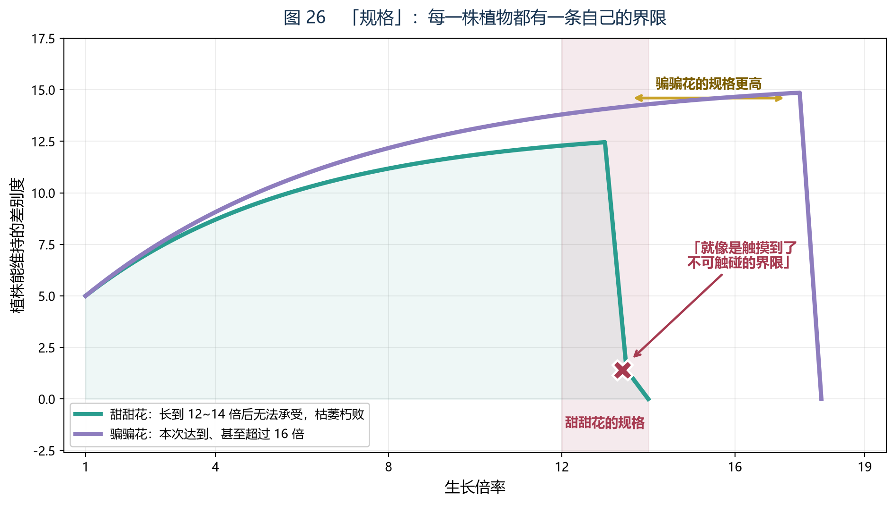

*图 26　「规格」：每一株植物都有一条自己的界限。甜甜花在 12~14 倍处骤降归零；本次长到 16 倍以上的，其实是另一种植物。*

**用世界式的语言复述一遍。**

一株甜甜花被灌了药剂，开始膨胀式生长。它的差别度在上升——**这是外源在注入差别**（补论三、补论五的框架）。

但差别度不是白拿的。按 2.5 节，**人界力维持 D 是要持续投入成本的**。植株越大，它要维持的差别越多，要付的维持费越高。

**而它的支付能力是有限的。**

于是曲线必然出现一个交点：**维持费超过支付能力的那一刻。**

　　　**在那一刻之前，它长得很好。**
　　　**过了那一刻，它付不起了，于是整株一起塌掉。**

**这就是「无法超越」四个字的数学含义。** 记录里那句「变成一地的枝叶」，正是 D 归零之后的景象——用 3.4 节的话说：**东西还在，但已经分不出什么是什么了。**

### 四之二　把「为什么」拆成十步

上一节是四段话。本院把它拆成十步，**因为「必然出现一个交点」这句话里藏着一个单调性论证，而那个论证决定了整节的结论能不能站住。**

**第 1 步：确定系统。** 被研究的系统是一株甜甜花，不含药剂瓶、不含施药的人。

**第 2 步：确定外界在做什么。** 药剂在往这个系统里灌结构——按补论三、补论五的说法，**它从外面注入差别。**

**第 3 步：确定系统内部发生了什么。** 结构增加，可区分的东西增加，**D 上升**（按 1.5 节的定义，这一步不需要新假设）。

**第 4 步：确定维持的价钱。** 按 2.5 节，维持 D 的是人界力，而**它需要持续投入**。这句是本文的推论而非原文——**本步的等级是乙级。**

**第 5 步：确定价钱随规模怎么变。** 维持的差别越多，要付的维持费越高。**本院要老实说：这一步是单调性假设，不是被记录证明的。** 它的依据是「维持费」这个词本身就含有的量入为出性质。

**第 6 步：确定支付能力。** 一株植物的支付能力有上限——**这一点不由药剂决定，而由植株自己决定。** 这是本节全部十步里最吃紧的一步，也是第九节第三条要检验的对象。

**第 7 步：让两条曲线相交。** 一边是随规模上升的维持费，一边是固定的支付能力。**一个上升的量与一个固定的量，只要上升的那个没有上限，就必然相交。** 这是一个纯粹的算术事实。

**第 8 步：确定交点的含义。** 在交点之前，付得起，植株正常；在交点之后，付不起。**注意交点不是「慢慢变难」，它是「从能付到不能付」——这是两种状态，不是两种程度。**

**第 9 步：确定付不起之后会发生什么。** 按 2.5 节，减小 D 的力有两个，而且都是自发的。**维持项一停，自发的收缩照旧进行——于是曲线不是停在交点那里，而是掉到零。**

**第 10 步：把十步合起来，得到那句话。** 「因为无法超越」= **它的维持能力在十二倍至十四倍之间被自己的维持费追上了。**

　　　**方向：回溯。等级：乙级。** 其中第 6 步与第 9 步各含一次未被原文直接支持的推论。
　　　**推翻条件：若发现一个对象在维持项停止之后并不归零（例如它靠自身结构撑着，只是不再增长），则第 9 步作废，「骤降归零」这个读法要改成「停住」。** 本院把它列在第九节之外，是因为它与第九节第二条（规格能否被界内改写）是两件事。

### 四之三　两条曲线

**本节的两条曲线值得单独画成一张表。** 它们一条属于植株，一条属于药剂，而交点落在哪，由前者决定。

| | 维持费曲线 | 支付能力曲线 |
|---|---|---|
| 它属于谁 | 植株自身的账 | 植株自身的能力 |
| 随规模怎么变 | **上升** | **平**（有一个上限） |
| 由什么决定 | 它要维持多少差别 | 它能调动的资源 |
| 药剂能不能改它 | **能**（药剂让规模上升） | **不能**（这是本节的第 6 步） |
| 交点 | 两条线的交点就是规格所在的位置 | |

**这张表解释了本节最反直觉的一点：把规模推得更高的方法，同时也是让交点来得更快的方法。** 药剂不是解药，它是加速器——**这与 6.2 节判别树要拦的那一类方案是同一个形状。**

### 四之四　两处常见误读

**误读一：「十二到十四倍就是甜甜花的规格。」**

　　　不对。**规格是「能力被维持费追上的那个位置」，而记录给出的十二到十四倍是这个位置在这一次实验里的观测区间。** 区间与位置不是一回事：区间有宽度，而本院目前分不出这个宽度是「规格本身有带宽」，还是「观测精度有限」。

　　　**方向：回溯。等级：乙级。**
　　　**推翻条件：若后续同一对象的重复实验中，失败点始终落在同一个更窄的区间里，则「区间宽」这个读法要改成「观测精度」；反之则规格本身有带宽。**

**误读二：「它们是被药剂毒死的。」**

　　　原文对原因只给了四个字——**「因为无法超越」**，而且是在被问到原因时给的。**药剂是使规模上升的手段，不是致死的原因；致死的原因是维持费超过了支付能力。** 这两者在记录里被分开写了，本院不该把它们并回一起。

　　　**方向：回溯。等级：乙级。**
　　　**推翻条件：若记录的其他部分表明失败过程伴随不可逆的毒理损伤（而不是结构塌陷），则本节要退回「药剂毒性」这个读法。**

### 五、为什么骗骗花能超过十六倍

记录里有一个极关键的细节，本院第一次读的时候差点漏过去。

**这次长到十六倍以上的，不是甜甜花。**

原文写的是：当事人过去查看时发现「这不是甜甜花」，而是一只**骗骗花**——它「体内结构有与甜甜花相似之处」，因此被同一份药剂起了作用，**「甚至超过了十六倍大的规格」**。

**这个细节回答了本补论的第二个问题：规格是不是统一的？**

　　　**不是。规格是分对象的。**

同样的药剂、同样的场地，甜甜花在十二到十四倍就付不起了，而骗骗花能撑到十六倍以上。**两者不是「谁更强」，而是各有各的规格。**

这与补论三的结论完全一致：**每一个系统都有自己的 D 上限。** 城市的、植株的、乃至一个世界的，都不同。

**把这次「天然对照」摆成一张表，规格的归属就很清楚：**

| | 甜甜花 | 骗骗花 |
|---|---|---|
| 药剂 | 同一份 | 同一份 |
| 场地 | 同一处 | 同一处 |
| 结果 | 十二到十四倍处崩塌 | 超过十六倍仍在 |
| 相同的部分 | **外界条件** | |
| 不同的部分 | **它自己的规格** | |

**因为外界条件被记录写成了「相同」，不同的那一边就只能来自对象自身。** 这不是本院做的对照实验，这是记录本身就有的一个对照——**而它是本篇唯一一处近似实验设计的材料。**

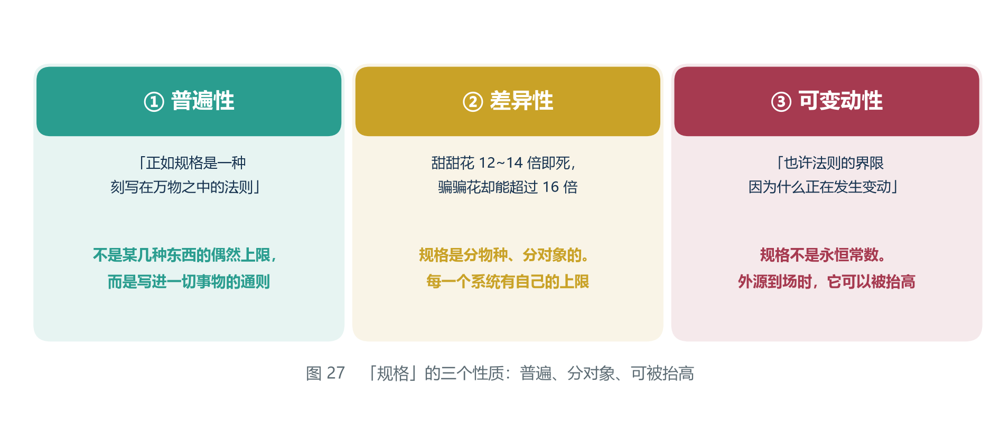

*图 27　「规格」的三个性质：普遍、分对象、可被抬高。*

### 五之二　「分对象」要怎么检验

**本节是回溯，但回溯可以生出一条预测。** 这一点值得说清楚：**回溯篇本身不计分，而它转出来的预测是要计分的。**

**待检验的说法：「规格是对象的一个属性，而不是药剂的一个属性。」**

| 要做什么 | 会看到什么 | 结果怎么判 |
|---|---|---|
| 换一种药剂，作用在同一对对象上 | 若失败点仍各自出现在两种对象自己的倍数附近 | **「规格属于对象」加强** |
| 同上 | 若失败点跟着药剂走，与对象无关 | **规格属于「药剂×对象」的组合，第三节的翻译要收紧** |
| 用同一药剂、只改剂量 | 若剂量只改变「到达失败点的时间」，不改变失败点的位置 | **同上，加强** |
| 同上 | 若剂量一高，失败点就提前 | **交点位置受外界影响，第 6 步的「支付能力由对象决定」要改** |

　　　**方向：预测。等级：丙级**（检验办法是本院拟的，记录里没有这一组实验）。
　　　**这一条如果被证实，它不能用来支持框架，但可以被用来推翻第三节——本院认为这正是它值得写下来的理由。**

### 六、最要紧的一句：失败证明界限的稳定

现在讲本补论本院认为最有价值的一句。

当事人解释为什么要反复做同一个实验时，说的是：

> **「所以反复的实验也是为了确认规格界限的稳定……证明界限的始终存在。」**

**这句话在方法论上和本文开篇那位学者做的事完全一样。**

请回想第零章：他从坎瑞亚人的记录反推出世界式，然后**反复核算**，得到的永远是同一个结果。他当时的反应是「**漏了变量？**」。

**而这份记录给出了另一种解读同一件事的方式：**

　　　**反复得到同一个结果，不是因为命运，是因为界限稳定。**
　　　**而失败，恰恰是界限存在的证据。**

这两句话把「结果恒定」从一件令人绝望的事，变成了一件**可以测量的事**。

**如果你每次都失败，说明界限还在。**
**如果你某次成功了——那就说明界限动了。**

### 六之二　两种解读的对照

**同一个观察——「反复算，结果永远是同一个」——可以有两种解读。** 它们的分量不同，代价也不同：

| | 解读甲：命运 | 解读乙：界限稳定（本篇采纳） |
|---|---|---|
| 说的是 | 结果被注定了 | 结果被一个上限截住了 |
| 能不能测量 | **不能**（没有量可以测） | **能**（失败点的位置就是量） |
| 失败意味着什么 | 又一次被否决 | **界限还在，且位置可记** |
| 成功意味着什么 | 命运用错了 | **界限动了，这是一条信息** |
| 代价 | 什么都不用做 | **必须反复做实验，而且必须记录** |

**这张表的最后一行是本篇最实用的一行。** 解读甲不需要任何成本，因为它不给出任何可做的事；解读乙要求当事人**持续地失败并且持续地记账**——而记录里那位炼金术士做的正是这件事。

**换句话说：这份记录本身就是解读乙的证据，因为只有解读乙才解释得了他为什么要做那么多次。**

　　　**方向：回溯。等级：乙级。**
　　　**推翻条件：若那些重复实验其实每次都在改配方（而不是重复同一个配方），则「反复确认稳定性」这个读法不成立，本节作废。**

### 六之三　这个解读可以用记录自己的数字检验

**解读乙不是一句漂亮话，它有数字。** 记录给出的失败区间是**十二倍至十四倍**。于是：

| 观察 | 解读乙的预期 | 解读甲的预期 |
|---|---|---|
| 反复实验的失败点 | 落在同一个区间里 | 无预期（命运不承诺数字） |
| 区间的宽度 | 保持不变，或随观测精度收窄 | 无预期 |
| 失败点的漂移 | **漂移本身就是事件**（见第七节） | 无预期 |

**本院在这里要提醒一句：不要把这个区间当成精确的常数。** 十二到十四是一个宽度为二的区间，而记录没有说清它是「每次都落在这里」还是「平均落在这里」。**这两者的区别，恰好就是「界限稳定」与「界限大致稳定」的区别。** 本院目前分辨不出，把它记在这里。

### 七、界限在变动

而这份记录的最后一句，写的正是后者。

面对这次意外的成功，当事人说的是：

> **「如果此后真的能够一直成功复现，那就说明有什么产生了变化。也许法则的界限因为什么正在发生变动。」**

**「因为什么。」**

**记录没有说那个「什么」是什么。** 而这也是本院最想请读者停留片刻的地方。

因为按本文前面几篇补论，这个句式是可以补完的：

　　　补论三说：**能抬高 D 上限的，只有系统之外注入的差别。**
　　　补论五说：**被隔绝的可以重新接通，但需要持续投入。**
　　　第二期说（若读者听过）：**外源不是一个数，是一个可以空着的位。**
　　　回溯三说：**那个位子现在有人。**

　　　**而这份记录说：界限正在变动，但不知因为什么。**

**三条推论加一份记录，指向同一个方向：那个「什么」，是一个在场的、不属于这个系统的外源。**

**记录没写出来的那半句话，本文的框架可以填。**

### 七之二　四条线索与它们的等级

**这是本篇最需要小心的一节，因为「三条推论加一份记录」听起来像四份证据，其实不是。**

| 线索 | 它说的是 | 方向 | 等级 |
|---|---|---|---|
| 补论三 | 能抬高 D 上限的，只有系统之外注入的差别 | 回溯（对补论三而言是本文的推论） | **乙级** |
| 补论五 | 被隔绝的可以重新接通，但需要持续投入 | 甲级材料，乙级用法 | **乙级** |
| 回溯三 | 外源不是一个数，是一个可以空着的位 | 回溯 | **乙级**（提法来自观众，见回溯三第十节） |
| 记录最后一句 | 界限因为「什么」正在变动 | 甲级引文 | 引文甲级，**「那个什么＝外源」是丙级** |

**四行里三行是乙级，最后一步是丙级。** 而「四者指向同一个方向」这件事，本身还需要一次加法——**加法是本院做的，加法没有等级可标，只有结论有。**

　　　**所以本院对那个填补给出的判定是：方向 回溯；等级 丙级（形状对应）。**
　　　**推翻条件：见第九节第三条，以及下面这条检验。**

### 七之三　这条填补要怎么检验

**「那个『什么』是一个在场的、不属于这个系统的外源」——这句话能怎么被攻？**

| 要查什么 | 若结论支持本节 | 若结论反对本节 |
|---|---|---|
| **时间对得上吗** | 界限变动的时间点，应与某个外源活动的痕迹在时间上对得上 | 变动与外源活动完全无关 |
| **人走了会怎样** | 外源离场后，界限应回到原来的位置 | 外源离场后，界限照样继续漂移 |
| **换一个对象会怎样** | 同一个外源在场时，别的对象的规格也应出现松动 | 只有这一株动了 |

**第二行是本篇最锋利的一条。** 如果界限的松动在外源离开之后依然继续，那么它就**不是**被谁抬起来的，而更像是规格本身在缓慢变化——**那样的话，「那个什么」就不必是一个外源，本节必须作废。**

**而这正好说明了 4.3 节那句门槛的用处。** 那里说：只有「**自身等价一个世界**」的存在才算「变量」。按 4.3 节的翻译，**「自身等价一个世界」＝ 这个人自己就携带了一整套差别预算。** 一个自带库存的外来账户，才可能往一个已经封闭的系统里注入新的差别。

　　　**所以本节要找的不是「有外人来过」，而是「有一个自带账本的人来过」。** 这一条把检验条件收紧了：光有外源活动的痕迹不够，还要有**它自带差别**的证据。

**这一点在回溯三第三节会以另一种语言再出现一次**（意志与差别度的关系）。

### 八、这补上了论文缺的那块机制

到此为止，本文其实一直是**描述性**的。

　　　它说 D 会下降，说终末是合并，说吸引子是唯一的。
　　　**但它一直没回答一个更基本的问题：为什么会有上限？**

补论三给了一个答案——**维持费**。但那只是一个类比，没有文本支撑。

**回溯一第一次给了它文本支撑，而且是一个比本院更好的说法：**

> **规格是一种刻写在万物之中的法则。**

这句话解释了本文开头一直没有解释的三件事：

| 此前只能描述的现象 | 回溯一给出的机制 |
|---|---|
| 甜甜花长到某个倍数就死 | **它有自己的规格，过了就付不起维持费** |
| 骗骗花能长得更大 | **规格是分对象的** |
| 「不管推演多少遍结果都一样」 | **因为界限是稳定的；失败正是它稳定的证据** |
| 界内的一切努力都改不了结局 | **界内的操作改不了界，规格是刻在万物之中的** |

**最后一行是整篇论文的题眼。** 规格既然是「刻写在万物之中」的，那么万物自己就改不了它——**能改它的，只能在万物之外。**

**本院把这四行逐行补一句话，因为它们不是同一类东西：**

- **第一行**是本节最结实的：它有数字（十二到十四倍），有当事人自己的归因（「因为无法超越」），而且**可以被重做**。
- **第二行**来自一个天然对照（甜甜花与骗骗花），比第一行弱一档，但它给出了「规格属于对象」这个方向。
- **第三行**是一次解读的替换（命运→界限），它不增加新事实，只改变本院对同一事实的说法。**替换说法本身不算证据。**
- **第四行**是全部四行里最远的一行：**它从「一株植物有规格」跨到了「界内改不了界」。** 这一步的等级是**乙级**，因为中间的桥是补论三的维持费，而那座桥是本文搭的。

### 八之二　第三卷 第三章把这句话接了过去

**合订本在这里有一次真正的接缝，本院把它标出来。**

第三卷 第三章列了一张表，题为「大一统解释世界式的什么」。那张表的第一行写的是：

| 大一统提供 | 用在哪里 |
|---|---|
| **一个「为什么一定会有量纲问题」的框架** | **解释了第 47 号里「规格为什么会被刻在万物之中」** |

　　　**也就是说：第一卷在这里提出的问题，第二卷把它当成了自己要解释的对象之一。**

这一处的分量要说准：**第二卷给的是一个框架，不是一个推导。** 它说量纲问题解释了「规格为什么会被刻在万物之中」，而这不是一条算出来的结论——**第三卷 第八章的第二道防线正是为这种句子设的：「互相解释可能是同一套隐喻的两次使用。」**

　　　**所以本节的态度是：跨卷引用可以用来定位问题，不能用来加分。**
　　　**等级：甲级（两卷的原文都在，本院只做了并置）。方向：回溯。**
　　　**推翻条件：若第二卷那条对应后来被自己撤回（例如「量纲问题」被证明解释不了任何上限），则本节引用失效，但第一节至第八节的结论不受影响——因为它们不依赖第二卷。**

### 九、什么情况下这一篇会被推翻

本篇属**回溯**——本院是先看到那份实验记录，才提出「规格＝D 的上限」。因此按体例第 7 条，必须回答：**什么情况下它是错的？**

**本院在每一条后面加了「怎么检验」，因为一条推翻条件如果不写检验办法，它就只是谦虚，不是条件。**

　　　**第一，如果发现某样东西在没有外源介入的情况下，无限增长而不崩塌。**

那说明它的「规格」不是刻在它之中的，而是可以被它自己突破的。**「规格是刻在万物之中的法则」这句话就假了。**

**怎么检验：** 找一株与甜甜花同类的对象，在**不施加任何药剂**的前提下观察足够长的时间。若它的规模持续上升而结构不塌，则本条成立。**注意「足够长」是关键**：本篇的结论允许缓慢变化（第七节），所以一次观察不足以下判；需要的是**持续上升的趋势**，而不是一次偶然的读数。

**需要什么工具：不需要新工具。** 这是一个记录问题，不是理论问题。**这正是本条最有价值的地方。**

　　　**第二，如果发现某个对象的规格可以被界内的操作随意改写。**

那「刻在万物之中」就退化成「目前的参数恰好如此」。本篇的整个立论——**界内改不了界，能改的只能在界外**——随之作废。

**怎么检验：** 区分两种情形——

| 情形 | 做法 | 判定 |
|---|---|---|
| **绕过** | 用药剂把对象推到更高倍数再让它撑住 | **不算改写**（它只是换了支付方式） |
| **改写** | 直接改掉对象自己的上限，使它在没有额外投入的情况下也能维持 | **算改写，本条成立** |

**这个区分是本条的全部难点。** 一份记录如果把「绕过」写成了「突破」，读者很容易误判成本篇被推翻；反之，一份记录如果只把「改写」说成「运气好」，也需要本院去核。**所以要检验这一条，需要的是能分辨「谁在付钱」的记录，而不是更大的数字。**

　　　**第三，如果「规格」与「差别度上限」的对应被证伪。**

即：找到某个对象，它的规格明显不由可区分事物的总量决定，而由别的东西决定（例如纯粹的材质强度）。**那本篇的翻译就是错的。**

**怎么检验：** 需要两样东西，而本院目前两样都没有——

| 需要什么 | 现状 | 说明 |
|---|---|---|
| D 的测量方式 | **没有**（见第三节之三） | 1.5 节给的是定义，不是量具 |
| 一个「规格不由 D 决定」的候选对象 | 有方向，无实例 | 若某个对象的失败点是材质强度定死的（例如它到某个尺寸就断），则候选成立 |

**所以本条目前不可检验。本院把它标为不可检验，而不是标为安全。**

**三条汇总如下：**

| 条 | 检验的成本 | 需不需要新工具 | 现在能不能查 |
|---|---|---|---|
| 一 | 低（只要观察） | 不需要 | **能** |
| 二 | 中（要能分辨谁在付钱） | 不需要新理论工具 | **部分能** |
| 三 | 高（要先有 D 的量具） | **需要** | **不能** |

**三条都可以被将来的观察检验，而且都不需要新的理论工具**——这是本院写第九节时的原话，而这张表把它修正了：**第三条需要新工具。** 本院愿意把原话留在这里，也愿意让这张表压着它。

### 十、边界

三条必须说清楚的。

**第一，这份记录谈的是一株植物，本文把它推广到了世界。** 这个推广是本文做的，不是记录说的。记录里没有任何一个字提到提瓦特整体，也没有提到世界式。

　　　**具体地说：从「一株植物有上限」到「一个世界有上限」，中间跳过的是一次尺度跳跃，而本院没有为这次跳跃付任何代价。** 补论三（城市的容量）是这条路上唯一一块垫脚石，而它自己也标着推断。

**第二，「规格」与「差别度上限」的等同，是本文的翻译。** 记录用的是炼金术的语言，本文用的是方程的语言。两者能不能一一对应，取决于 2.1 节那个「差别度」的设定是否成立——而那一节本身就标着乙级推断。

**第三，「那个什么」究竟是谁，记录没说，本文也不该替它说。** 本院只能指出：**按本文现有的框架，这个位置是可填的；但填上去的那一笔，属于推断，不属于这份记录。**

　　　**而一份记录最诚实的地方，往往正是它没写出来的那半句话。**

### 十之二　三条之外，本院还想交代两点

**第四点：本篇的全部引文来自同一份记录。** 本院没有第二份独立来源，也没有找到这份记录的其他抄本。**这意味着本篇的甲级部分，其可靠性完全等于「这一份记录可靠」这一件事。** 如果这份记录本身有问题——转抄有误、后人改写、或者干脆是伪作——**本篇的甲级部分会一起消失，而乙级与丙级部分连消失的资格都没有，因为它们本来就建在它上面。**

　　　**本院把这个风险单列一条，是因为它不同于一般意义上的「引文可能有误」。** 一般的引文失误会削弱一条论据；而这里如果出错，**本篇没有第二条腿。**

**第五点：转述与原文的距离，本院在回溯一之二里吃过一次亏。** 那里的材料来自剧情转述，本院当时把等级压到乙级。**本篇的材料是一份书面记录，比口头转述近一层；但它近的这一层，恰好也是最容易被误认为「原文直说」的一层。** 记录里的人写的是他的理解，不是世界的定义。

　　　**本院对这两点的处理办法是一样的：把等级标出来，然后不改口。**

> 本院按：本补论的全部原文引用，均出自本院调阅的该份实验记录。与前面各篇一样，本文只对**推论**负责，不对**记录本身**负责。

---
## 回溯一之二　「死之诅咒」：一个阻止差别增加的机构

> **本篇的性质：回溯。**
>
> 本篇与回溯一同源：本院都是先读到材料，再把它接到 3.3 节上。**所以它同样不构成对本纪要的支持。**
>
> **它印证了 3.3 节的判断确有对应的执行机构，但它没有预测出任何东西。**
>
> 按体例第 7 条，本篇末尾第七节给出了两条**可被推翻的条件**，每一条都写了检验办法。
>
> **本院在这一版里把它的性质声明补全了。** 上一版的回溯一之二没有这一段——不是因为它不是回溯，而是因为本院当初把它写成了回溯一的附注。**它现在不是附注了：回溯一给的是上限，本篇给的是过程；上限与过程一样需要说明自己凭什么算数。**

### 一、缘起

本院在回溯一里整理「规格」时，说的是**上限**——差别度最多能到多少。

而读者 Scarlet 的一条评论，把本院领去看了一样**方向相反**的东西：如果差别度根本不增加呢？

**这两件事要分清楚：**

| | 回溯一 | 回溯一之二 |
|---|---|---|
| 管的是什么 | 差别的**上限** | 差别的**增量** |
| 什么时候起作用 | 已经涨到付不起的时候 | 还没涨起来的时候 |
| 材料里的说法 | 「规格」「界限」 | 「封锁」「诅咒」 |
| 本篇的关系 | 天花板 | **天花板下面的保安** |

**注意最后一行：这两样东西管的不是同一个阶段。** 上限管的是结局，增量管的是过程——**而过程那一侧，才是这一篇真正拿到的材料。**

### 二、原文：三句话

至冬的一处剧情里，一位执行官说：

> **「他在做的是封锁科技进步，避免一切导致技术进步的想法。」**

紧接着是这一句——**它把机制说成了条款**：

> **「诅咒的内容应该类似于：科技进步的因素出现，暴力诅咒触发。」**

而听的人立刻意识到了它指的是谁：

> **「会是天理，但听到丑角亲口说出这样的话，还是令人感到有些震撼。」**

### 二之二　三句话各自的分量

**这三句话不是同一种东西，本院必须把它们分开称。**

| 句子 | 它是什么性质的陈述 | 它能支持什么 | 它不能支持什么 |
|---|---|---|---|
| 第一句：封锁科技进步 | **行为描述**（有人在做什么） | 说明确有一个持续的动作 | 不能说明这个动作的机制 |
| 第二句：因素出现就触发 | **条款转述**（「应该类似于」） | **本篇唯一的机制陈述** | 不能说明条款的原文措辞，也不能说明它由谁执行 |
| 第三句：听者的反应 | **反应陈述** | 说明这段对话存在、且分量很重 | **完全不能说明条款为真** |

**读这张表要先看第一行的「有人在做什么」。** 一个持续的动作意味着**有人或某个机制在付成本**——这一点第六节要用。

**中间一行是本篇的全部依据，而它是最弱的一行**：说话人自己用了「应该类似于」四个字。**这四个字说明他在转述一个条款，而不是在宣读它。**

**最后一行看上去最像证据，其实最不像。** 「令人感到有些震撼」说明的是**这句话对听者的分量**，而分量与真假无关——**一句错得很离谱的话同样可以令人震撼。**

### 二之三　「应该类似于」这四个字

本院要把这一处分量单独写出来，因为**本篇的等级（乙级）完全来自这里**。

　　　**若原文是「诅咒的内容是：……」**——那本院会把它标为甲级机制陈述。
　　　**若原文是「诅咒的内容应该类似于：……」**——那本院只能把它读成**某人对一条传闻的复述**。

两种读法的差别不在措辞，而在**这条信息的来源深度**：前者意味着说话人知道条款，后者意味着说话人**知道有这么一条条款，并复述了它的形状**。

**所以本篇的翻译，是对一个转述的形状做的翻译。** 这句话听起来很绕，但它决定了一件很实际的事：

　　　**如果将来找到更原始的表述，而它与这四句话的形状不一致，本院会改的是本篇，不是那句原文。**

这也正是第七节第二条推翻条件的来源。

### 三、翻译

请逐句对照本文的语言。

| 原文 | 本文的说法 |
|---|---|
| 「科技进步」 | 造出**新的可区分事物**——**D 在增加** |
| 「封锁科技进步」 | **阻止 D 增加** |
| 「**因素出现**就触发」 | 不问结果，只问**有没有出现** |
| 「诅咒」 | 一个**执行机构** |

**这里最要紧的是第三行。**

「因素出现」和「结果发生」是两回事。一个只依据「是否出现」就执行处罚的机制，**它需要的不是审判，是传感器。**

### 三之二　为什么「因素出现就触发」是最要紧的一行

**因为这一行把「诅咒」从一件神秘的事，变成了一件有工程形状的事。**

本院把它拆开说：

　　　**一、它有一个被监视的量。** 被监视的是「科技进步的因素」——按上表的翻译，是**差别增加的因素**。
　　　**二、它有一个阈值（或干脆没有阈值）。** 只有「出现」与「没出现」两种状态。
　　　**三、它不关心后果。** 「避免一切导致技术进步的想法」——**想法**，不是成果。
　　　**四、它是自动的。** 条款的形式本身就是自动的：因素出现，就触发。

**四条里最反直觉的是第三条。** 「想法」不是「成果」：一个想法没有落地，就不会真的产生新的可区分事物。**而条款要封的恰恰是想法。**

　　　**换句话说：这个机制的介入点不在差别已经增加之后，而在差别有可能增加之前。**

**这一点与回溯一严丝合缝地接上了**：回溯说的是「涨到某处就付不起」，而这里说的是「还没涨就先掐掉」。**一个管终点，一个管起点，中间那一段——差别的实际增加过程——被两条材料一起管住了。**

　　　**方向：回溯。等级：乙级。**
　　　**推翻条件：若原文表明触发条件是「造成了实际危害」而不是「因素出现」，则本节作废。**

### 三之三　传感器与审判

**「它需要的不是审判，是传感器」这句话，值得展开成一张表。**

| 要问的问题 | 审判式机制 | 传感器式机制 |
|---|---|---|
| 是谁做的？ | **要问** | 不问 |
| 造成了什么后果？ | **要问** | 不问 |
| 有没有主观意图？ | **要问** | 不问 |
| **行动在哪里发生** | 事后（已经有了结果） | **事前（只有苗头）** |
| 覆盖成本 | 低（只处理案件） | **高（必须全覆盖）** |
| 误伤率 | 低 | **高** |
| 原文属于哪一侧 | | **「因素出现，暴力诅咒触发」** |

**这张表里最要紧的是「覆盖成本」那一行。**

　　　**审判是便宜的：它只需要在事情发生之后处理那件事。**
　　　**传感器是昂贵的：它必须把要监视的一切都罩住。**

**而一个必须全覆盖的机制，就是一个需要持续付费的机制。** ——这正是第五节要说的那句话的来源：**封闭不是免费的。**

　　　**方向：回溯。等级：丙级（形状对应：把条款的形状读成传感器的形状）。**
　　　**推翻条件：若原文表明这个机制的覆盖是选择性的（例如只针对某几个领域、某些人），则「全覆盖」这一行的推论失败，「维护成本」这个读法随之削弱。**

### 四、它接上了 3.3 节的哪一句

本文 3.3 节的论证是：**在一个封闭系统里，差别只会减少，不会自己增加。**

但那一直是一个**结构性论断**——它说的是「不会」，**没有说「不许」**。

而现在有了死之诅咒：有东西增加了，就把它掐掉。

- **3.3 节说「不会」**——这是**描述**
- **死之诅咒说「不许」**——这是**执行**

**一个刚性的「不许」，配一个柔性的「不会」，两者互为对方的解释。**

### 四之二　「不会」与「不许」为什么互为对方的解释

**本节是这一篇里本院最看重的一段推理，因为它用两条独立的东西把对方补齐了。**

**情形一：只有「不会」。**
那么封闭就是一个**结果**——差别自己不会增加，所以系统会一路塌下去。**这种世界观里不需要任何机构，也不需要任何维护成本。**

**情形二：只有「不许」。**
那么就必须有一个设定，说明为什么会有人去封堵差别。**而「不许」这一侧最自然的目的，是维持现状：不许差别增加，等于不许局面发生变化。**

**情形三：两者同时存在（本篇的情形）。**
　　　**「不会」是「不许」长期执行之后的成绩单。**

　　　**这句话的意思是：本院看到的「自然规律」，可能是一个机构长期工作的结果。**

**本院必须立刻给这句话上一个笼头**：它是一条强推论，而且它的形状很讨人喜欢——**凡是讨人喜欢的推论都要当心。**

　　　**方向：回溯。等级：丙级（这是两个独立判断的合成，两边都不直接支持它）。**
　　　**推翻条件：若找到一段时间，其中「不许」的执行机构缺席，而「不会」依然成立，则「成绩单」这个说法作废，「不会」与「不许」退回为两件并列的事。**

**这个检验在材料上不难做**：它只需要一段「有差别增加、但没有相应的封堵动作」的记录。**本院目前没有找到这样的记录，但也没有找过。**

### 五、这条材料改变了什么

**它把「系统封闭」从一个设定，变成了一个有维护成本的事实。**

如果差别度真的只是「自然地不会增加」，那就**不需要**任何机构去封堵它。而现在的原文说：**需要有人（或某个机制）持续地按住它。**

　　　**需要被按住的，说明它本来会动。**

**这是本文第一次拿到「封闭是需要维护的」这一层意思的直接证据。**

### 五之二　三种假设的判别表

**「封闭」这件事有三种可能，而本篇材料只在其中两种之间做排除。** 本院把判别表列出来，免得读者以为它证明了比它实际证明的更多。

| 假设 | 需要什么配套 | 与「封锁科技进步」这句话相容吗 | 与「已碎，陷入沉寂」相容吗 |
|---|---|---|---|
| **甲：封闭是自然的** | 什么都不需要 | **不相容**（自然的事不需要封） | 相容 |
| **乙：封闭是被持续维护的** | 一个持续工作的机构与成本 | **相容** | 不完全一致（沉寂意味着它现在不工作） |
| **丙：封闭曾被维护，现在已无人维护** | 一个已停止的机构，留下仍然生效的条款 | 相容 | **相容** |

**本篇的材料能排除甲，但不能在乙与丙之间裁决。** 「已碎，陷入沉寂」那一句属于回溯三第二节的材料；**把两句放在一起看，丙是最省的读法——但那是回溯三的事，本院不在这里替它下结论。**

**等级说明：排除甲是乙级（一次翻译）；乙与丙的取舍是丙级（要跨篇合并两条材料）。**

### 六、它与规格的关系

回溯一说，规格是**刻在万物之中的界限**——它规定了 D 能到多高。

而这一条说的是：**D 连涨上去的过程都被盯着。**

　　　**一个是天花板，一个是天花板下面的保安。**

两者合起来，构成了本文目前对「为什么提瓦特的 D 一直上不去」这一问题的完整回答：

- **规格**：就算涨，也涨不过那个数
- **死之诅咒**：在涨起来之前就被掐掉

**把两者摆成一张表，它们的互补关系就很清楚：**

| | 规格 | 死之诅咒 |
|---|---|---|
| 管的是什么 | 一个对象能到多高 | 差别增加的过程 |
| 触发条件 | 到上限（维持费超过支付能力） | **因素出现** |
| 效果 | 归零（整株塌掉） | 掐掉（不让它发生） |
| 需不需要有人执行 | **不需要**（「刻写在万物之中」） | **需要**（一个机构、一条条款） |
| 材料等级 | 乙级 | 乙级 |
| 跨卷对应 | 第二卷 7.3 节：紫外截断 Λ（乙级） | 第二卷 7.3 节：反项（**丙级**） |

**这张表的最后一行，正是合订本在这里的一次真实接缝，本院把它单独写在下面。**

### 六之二　两条材料合起来，还缺一个名字

**先说接缝。** 第二卷 7.2 节用一句话解释为什么截断必须付维护成本：

> **「截断破坏了对称性，因此需要反项来修补。」**

紧接着第二卷写道：**「用第 47 号的语言说：为了让系统保持封闭，必须持续地投入『维护成本』。」** 而在那一节末尾，第二卷点名了一份材料——**「而第 47 号在回溯一之二里刚刚找到了这样一条材料——死之诅咒。」** 第二卷 7.3 节把这条对应列成表的第二行：

| 第 47 号 | 物理里对应物 | 等级 |
|---|---|---|
| **死之诅咒**（阻止 D 增加） | **反项**（修补截断破坏的对称性） | 丙级 |

**本院在这里要老实说一句，因为这句话对本合订本很重要：**

　　　**当第一卷把一条乙级材料交给第二卷，而第二卷只能给它一个丙级时，这次跨卷引用是一次等级下降，不是升级。**

第二卷自己写了理由：**「后面两条是丙级：它们是形状上的对应，本院找不到任何方式去检验它们。」**

　　　**所以本节末尾这一处接缝，不构成本篇的加强。它只是说明了：这两条材料在形状上长得像。**

**再说缺的那个名字。** 规格说它「刻写在万物之中」；死之诅咒说它「封锁」。**但「刻」这个动作的执行者是谁、「封锁」的委托方是谁，两条材料都没有给名字。** 它们一个说这是法则，一个说这是诅咒。

　　　**本院把这个缺口标在这里，因为回溯三要处理的正是「位子」的问题：** 若那个位子本来有人，那么「刻」与「封锁」都可能是他任内留下的东西；若那个位子现在是空的，那么这两样东西就是在无人看管的状态下继续生效。

**等级：丙级（形状对应加一个缺口，不是一个结论）。方向：回溯。**

### 六之三　第二卷 7.4 节提出的一条可检验后果，正好落在这一篇上

**这是本篇唯一一次可以往前走而不只是往回看的地方。**

第二卷 7.4 节说：如果第二卷那三组对应是对的，**「那么提瓦特的那些『维护动作』——死之诅咒、天钉、以及其他本院尚未识别的动作——就应该显示出某种周期性」**，而第 47 号的补论四**已经独立地给出了一个周期（约 73 年）**。

**死之诅咒正是那张名单上的第一个名字。**

| 要查什么 | 若对应成立 | 若对应不成立 |
|---|---|---|
| 死之诅咒的触发记录 | 应呈现**约 73 年**的间隔，且与补论四的时间轴对得上 | 触发密集、无规律，或与 73 年无关 |
| 「天钉」这类硬动作 | 同样应落在那个尺度上 | 落在别的尺度上 |

　　　**方向：预测。等级：丙级。**
　　　**推翻条件：若触发记录显示它持续、均匀地发生（例如每次技术苗头都触发），则「周期性」这条后果不成立，第二卷 7.4 节那一条要给第三卷重写**——**注意：这不推翻本篇的翻译，只推翻那条周期性检验的适用性。**

**本院还要顺手记下一处需要合订本统一口径的地方：回溯三第八节说，那个「73 年」是「变量位继续空着」条件下的外推，而位子上现在有人。** 两处都写在同一本书里，读者一定会问哪一句才算数。**本院目前的口径是：周期作为「若对应成立则应当出现」的检验，仍然有效；而作为对下一次灾难日期的预测，它的前提已经写明。** 这一句属甲级（两处原文都在），本院只做了归拢。

### 七、什么情况下这一篇会被推翻

**如果原文表明死之诅咒另有机制**——例如它针对的不是「技术进步」本身，而是某个具体的行为或某个具体的对象，那么本文的翻译就不成立。

**怎么检验：** 看条款的**宾语**。

| 条款针对的是 | 例子 | 本篇判定 |
|---|---|---|
| 「技术进步」这一类行为 | 任何一个新的可区分事物 | **翻译成立** |
| 某个具体行为 | 某次仪式、某次越界 | **翻译作废**（它是一条禁令，不是一个封堵机制的条款） |
| 某个具体对象 | 某个人、某个组织 | **翻译作废** |
| **某个具体的念头** | 「一切导致技术进步的想法」 | **翻译成立，而且加强**（介入点更靠前） |

**最后一行是原文自己给的**：第一句里说的就是「避免一切导致技术进步的想法」。**所以本条实际上已经被原文答过一次——本院把它写在这里，是为了说明：如果将来有一份更原始的条款文本，而它的宾语是某个具体对象，那本院要改的是本篇，不是那句原文。**

**另一处需要留意的**：本文引用的是剧情转述，而**转述与设定原文之间可能有偏差**。本院尚未找到比这段对话更原始的表述。**在这一条上，本院把等级压到乙级，正是因为这个原因。**

**怎么检验：** 找更原始的表述，然后只比较一件事——**条款的宾语与触发条件**。

　　　**若更原始的表述在宾语或触发条件上与本篇引用的不同，则本篇第七节的第一条推翻条件优先适用**（因为它管的是翻译本身），**而「转述有偏差」这件事就从一个风险变成了一次实测。**

**什么不算推翻：**

- **发现这段对话出现在一场争论里**——不算。争论只影响分量，不影响条款的形状。
- **发现说话人不掌握原始条款**——不算。第「应该类似于」四个字本院已经计入等级。
- **发现这条诅咒没有生效**——不算，而且**这恰恰是回溯三第八节要处理的情形**（位子上有人了，前提变了）。

### 八、边界

**这是一条「回溯」。**本院是先读到这段对话，才回头把它接到 3.3 节上的。

　　　**所以它印证了 3.3 节的判断确有对应的执行机构，但它没有预测出任何东西。**
　　　**它不计入对本纪要的支持。**

**它能改变的是强度，不是方向。**

**第二条边界：本篇的翻译落在「因素出现就触发」这一个分句上。** 如果那四个字是转述者的概括，而不是条款的措辞，**那么整条机制的形状——传感器式的、事前的、全覆盖的——都要重新称。** 本院给的乙级，主要就是为了这一处。

**第三条边界：本节说的「维护成本」，是一个类比，不是一个数字。** 本院没有给出任何「封堵一次差别增加要付多少」的估计，也没有给出封堵的总量。**第二卷 7.3 节把这条对应压到丙级的理由，本院完全同意。**

### 八之二　本院对这一条材料的总评

　　　**这是本院目前拿到的、唯一一条把「封闭」写成一条可执行条款的材料；也是本院目前拿到的、来源最弱的一条。**

**两件事同时成立，而且不能互相抵消。** 来源弱不因为内容重要而变强；内容重要也不因为来源弱而变假。**本院把这两句话并排放在这里，是因为这一篇的全部价值，就在于把它当一条线索，而不是当一块基石。**

　　　**方向：回溯。等级：乙级。推翻条件：见第七节两条。**

### 九、补记：一处需要向读者说明的疏漏

**这一节本该更早出现在本纪要里。**

二期讲稿里讲了它，而本纪要的正文当时并没有收录。**是本院在核对「讲稿不得引入论文没有的结论」这条规矩时，才发现这个缺口的。**

　　　**换言之：这一节是被自己定的规矩抓出来的。**

本院把这个过程写在这里，是因为它本身就是一个例证——**规矩有用，不是因为本院自觉，而是因为它能在本院不自觉的时候报警。**

**本院在这里再补一句，因为这一版多了一处可以对照的东西。**

**附录 D 收的也是本院犯过的错，而它与这一处的性质不同：**

| | 附录 D 里的条目 | 这一处疏漏 |
|---|---|---|
| 本院当初的判断 | **觉得「好像没毛病」** | 根本没写，也就没有过判断 |
| 是谁发现的 | 本院自己回头核 | **一条外部规矩** |
| 修正的成本 | 高（要改论证） | 低（补一节即可） |
| 值得记的理由 | 它证明了「好像没毛病」不算通过 | **它证明规矩能在人不自觉的时候报警** |

　　　**一句话：附录 D 记的是「本院看错了」，这一节记的是「本院没看」。** 两类错误要分开记，因为它们的防法不同——**前者要靠反例，后者要靠流程。**

**最后说一句排版的理由。** 本院把这一篇放在回溯一之后，而不是之前：**回溯一给的是上限，本篇给的是过程；先有界限，才谈得上「阻止接近界限」。** 这个顺序不是原文给的，是本院排的。

---
## 回溯二　「归约」：世界式的逆运算

> **本篇的性质：回溯。** 本院是先知道「归约」这个术式存在，才去补上它的数学解释。**它不构成对本纪要的支持。**
>
> **本院把这句话说完整：一个术式存在，只说明这个世界里有人在做「往回取」的事，不说明本纪要关于「往回取」的解释是对的。**
>
> 本篇末尾第八节给出了三条**可被推翻的条件**，每一条都写了检验办法。
>
> **本篇还有一处必须提前交代的东西：它的第三节与第四节是全篇唯一一次真正的数学推导。** 读者如果只读一节，本院建议读第三节——**因为「归约不是撤销」这句话，是这一篇里唯一可以独立于提瓦特被检查的部分。**

### 一、缘起：一个词的提问

第二期播出后，有观众只问了两个字加一对引号：

> **「如何解释『归约』」**

这条短得不像一个问题。但它指向的，是本文前面六篇补论一直没有讲的一样东西。

**因为「归约」不是普通词——它是原文里一个术式的名字。**

而它指的是：**反转。**

本文从第零章开始，讲的都是单向：坍缩、不可逆、没有回头路。**如果存在一个「反转」，那么本文的整套论述就需要补上另一半。**

**本院要在这里把一个区别说清楚，否则整篇都会读歪：**

| | 本篇处理的 | 补论五处理的 |
|---|---|---|
| 问题 | 有没有一个**往回走**的操作 | 为什么有的人回得来、有的人回不来 |
| 材料 | 一个术式的名字与描述 | 两个人物的结局 |
| 结论的形状 | **数学上的**（右逆、有损） | **结构上的**（四象限少没少） |

**两篇都谈「回来」，但谈的不是同一个「回来」。** 补论五谈的是「门被堵住了没有」，本篇谈的是「从废墟里能捡回什么」。**这两件事在第四节会被拼在一起，而拼法本身就是本篇的一个结论。**

### 二、原文：世界式·反转

本院调阅了相关的任务记录。说话的是愚人众执行官第七席「木偶」桑多涅。

> **「世界式·反转——『归约』」**

> **「而利用『数秘阵列』反向运算『世界式』，就能达到归拢收束与还原的功能。即术式的反转。」**

> **「这类似数理中的同调归约，在不改变群体本质的情况下，将他们还原为更简单和实质性的存在。」**

而同一份记录里写了它的实际用途：

> **「桑多涅剥离了『怨意』内的污秽与邪念，让众多无家的灵魂重归清净，使他们获得了安眠。」**

**注意最后一句：把一团混在一起的灵魂，重新分开。**

### 二之二　原文里的三个词，与一个「类似」

**这一段引文短，但里面有四样东西需要逐个卸下来看。**

| 原文的词 | 它在说什么 | 本院能从中取出什么 |
|---|---|---|
| 「**反向运算**」 | 方向是反的 | **方向上的反转**，仅此而已 |
| 「**归拢收束与还原**」 | 两个动作连在一起 | 「收束」是对内的，「还原」是对外的 |
| 「**同调归约**」 | 一个数学名词 | **一个类比，不是一条等式** |
| 「**类似**」 | 说话人自己加的限定 | **原文自己也没有给出等式** |

**本院要特别强调最后一行。**

　　　**说这话的是桑多涅本人——按本纪要全部材料来看，她是提瓦特最像数学家的那一位。**
　　　**而她自己用的词是「类似」。**

**所以本篇的处境是这样的：** 原文给出了一个术式、一个名字、一个用途，以及一句「它类似数学里的某个东西」。**剩下的一切——它究竟是哪一种数学对象、它的损失有多大、它能不能用在整个世界上——全部是本院补的。**

　　　**方向：回溯。等级：甲级（引文）＋乙级（本院对这三个词的读法）。**
　　　**推翻条件：若原文另有一处对「归约」的严格定义，且与本院的读法不同，则第三节至第五节全部重写。**

### 三、数学解释：为什么这不是「撤销」

要回答那位观众的问题，关键在一件中等教育就讲过的事：

　　　**一个函数，只有当它是一一对应时，才有反函数。**

**那么密合是不是一一对应？不是。**

表象 3 与本征 4 密合出 7。但**别的组合也可能得到 7**。一旦合成，关于「原本是哪两样」的信息就丢了。

　　　**所以它没有反函数。**

那「归约」做的是什么？

　　　**它只能从结果里取一个原像——而原像不唯一，取哪个都可以。**

这在数学上叫**右逆**，或者叫**截面**。它不是反函数；它是一种「还给你一个说得过去的答案」。

> 所以原文说「反转」，说的是**方向上的反转**；但在数学上，它更接近「**投影回去**」。

### 三之二　把这一步推导写全

**上一节四句话里有三步是跳着走的。本院把它补全，一步都不省。**

**第 1 步：先问对的问题。**
不是「归约能不能把东西还原」，而是**「密合这个操作有没有反函数」**。**因为归约若要是撤销，它就必须是密合的反函数。**

**第 2 步：一个操作什么时候才有反函数。**
标准答案是：**当它是一一对应的时候**——每一个输入配一个不同的输出，每一个输出也都有输入对着它。**只要有两个不同的输入给出同一个输出，反函数就不存在。**

**第 3 步：密合是一对一，还是多对一？**
按 2.2 节，**表象 3 与本征 4 交叠得到 7**。而 7 这个结果，**别的组合也可能给出**。
　　**所以密合是多对一。**

**第 4 步：多对一的后果是什么。**
　　　**输出里没有「输入是谁」的信息。**

**这里要说得非常准：不是「很难算出来」，也不是「信息藏得深」，而是——这个信息在合成的那一刻就不在结果里了。** 从 7 出发去找它的两个来源，**不是在解一道难题，而是在做一道没有唯一答案的题。**

**第 5 步：所以反函数不存在。**
**注意「不存在」这三个字的分量：它不是暂时的困难，它是一个定论。** 再强的算力也造不出一个不存在的东西。

**第 6 步：那「反转」做的是什么。**
　　　**它从结果里取出一个原像——也就是「给出一个能密合出 7 的组合」。**

**第 7 步：这个操作的名字。**
数学上叫**右逆**，也叫**截面**。本院用文字写它的定义，避免符号：
　　　**先归约、再密合，得到的还是原来那个结果。**

**第 8 步：这个定义里少了什么——而这一条是关键。**
反函数要求**两个方向都对**：
　　　先密合再归约，回到原来的输入；
　　　先归约再密合，回到原来的输出。
而右逆只要求**后一个方向对**。
　　　**换句话说：归约是一个单向对得上的操作。它可以复原「结果」，不能复原「过程」。**

**第 9 步：把它翻回原文。**
原文说「反转」。**按第 8 步，这个「反转」在方向上是对的，在信息上是不够的。**
　　　**所以本院说它更接近「投影回去」——投影会把三维的东西压成二维，而那二维的图上，看不出原来有几个点叠在一起。**

**第 10 步：给这一步定级。**
　　　**方向：回溯。等级：乙级**（一次翻译：把原文的「反向运算」落到「右逆／截面」）。
　　　**推翻条件：见第八节第一条——若归约被证明无损，则真正的反函数存在，第 5 步到第 8 步一起作废，三档操作的分层也要重写。**

**本院还要交代一句：这一节里的数学是标准的，没有一处是本院发明的。** 本院做的只是把「密合是多对一」这个本文早就写下的事实，推到它的尽头。

### 三之三　「取哪个都可以」这句话，本院要收回一半

**上一节引的那句「原像不唯一，取哪个都可以」，本院认为它需要修正。**

　　　**「可以」是数学上的，不是人情上的。**

从 7 出发，取 (3,4) 也好，取别的组合也好，**在数学上都合法，都满足「再密合一次得到 7」。** 而在材料的语境里——

> **那是「众多无家的灵魂」，而做这件事的人，是要让他们「获得安眠」。**

**这里没有「哪个都可以」。** 一个人要的是他原来那个人，不是任何一个能密合出同样结果的原像。

　　　**所以「有损」这件事在人情上的表现，不是数量少了，而是：你拿回来的东西在数学上合格，在那个人身上不合格。**

　　　**方向：回溯。等级：丙级（形状对应，本院对材料的读法）。**
　　　**推翻条件：若后续材料表明归约取回的原像在那个意义上也等价于密合前的对象（例如有人被原样取回），则本节的读法作废，第四节的账目也要跟着改。**

### 四、为什么它是有损的

原文那半句话，比想象中精确：

> **「还原为更简单和实质性的存在。」**

**注意：不是「还原为原本的存在」，是「还原为更简单的存在」。**

用差别度写出来：

　　　**密合：D 减少 δ，而且是永久失去 δ。**
　　　**归约：D 增加 δ′。**
　　　**而原文说结果是「更简单的」，所以 δ′ < δ。**

　　　**归约不是「撤销」，是「部分退款」。**

**这修正了补论五的什么？**

补论五说：被合并的东西「没有回头路」。现在要说得更准：

> **回头路有，但走回来的是一个更简单的版本，不是本人。**

这恰好解释了补论五留下的那处不对称——**为什么「隔绝」的能原样回来，而「密合」的不能**：

　　　**隔绝是「门被堵了」；归约是「从废墟里捡回几块砖」。**
　　　**两者都不是把房子盖回来。**

**而世界式的总趋势，仍然是下降的。**

### 四之二　把「部分退款」写成一本账

**「δ 与 δ′ 谁大」这件事，一旦写成账目，整篇的结论就变得可以核对。** 本院把三档操作各记一笔：

| 操作 | 账上的记法 | 本金变了吗 | 能不能反悔 |
|---|---|---|---|
| **密合** | 支出一笔 δ，**不可退** | 少了 δ | 不能 |
| **归约** | 收回一笔 δ′，且 **δ′ 小于 δ** | 多回来一点，但比支出少 | **不能退回到支出前** |
| **人格分离** | **不动本金，只换经手人** | **基本不变** | 可以再做一次 |

**这张表最重要的一行是最后一行。** 前两档都在动本金：一个支出，一个部分收回。**而第三档根本不动本金——它换的是谁在这个结构里当家。**

**于是「世界式的总趋势仍然是下降的」这句话，有了一本账目的版本：**

　　　**每一次密合都支出一笔不可退的钱；归约只能收回一部分；三档里只有第三档不花钱，但它也不把钱赚回来。**

　　　**方向：回溯。等级：乙级（δ 与 δ′ 的大小关系来自原文「更简单的」三个字）。**
　　　**推翻条件：若 δ′ 等于 δ（即归约无损），则本节账目不再净下降，第四节的结论与第八节第一条同时成立（那一条会推翻本节）。**

### 四之三　补论五留下的那处不对称，现在可以画完

**补论五的结论是：隔绝能原样回来，密合不能。而本篇补上了中间那一档。**

| | 隔绝 | 密合 | 归约 |
|---|---|---|---|
| 丢了什么 | **通道**（门被堵了） | **δ**（差别被永久抹平） | 没丢新的，但**也没全拿回来** |
| 能不能回 | **能，原样** | **不能** | **能，但是更简单的版本** |
| 代价 | 持续投入（补论五：需要一群人） | 一次性、永久 | 一次性，且**收益小于损失** |
| 对应到哪一档 | 不属于三档（它是条件，不是操作） | 第一档 | 第二档 |

**这张表把「回来」这件事分了三种，而它们的区别不在难度，在性质：**

　　　**隔绝解决的是「路通不通」；密合与归约解决的是「东西还在不在」。**

**而「路通不通」是可以修的，「东西还在不在」是不能修的。** ——这就是补论五那处不对称的完整形状。

### 五、三档操作

到这里，本文手里其实有**三档**操作，而不是两档。

*图 28　三档操作。前两档处理「合并」，第三档处理「结构」。*

| 档 | 它做什么 | 对 D 的作用 | 性质 |
|---|---|---|---|
| **第一档：密合** | 两样东西变成一个 | 归零，不可逆 | 终末的成因 |
| **第二档：归约** | 从合并体里取一个原像 | 回升，但有损（δ′＜δ） | 从废墟里捡回几块砖 |
| **第三档：人格分离** | 只剥离其中一个象限 | 基本不变，结构可复用 | **唯一可持续的一档** |

**第三档是本文此前完全没有的一档，也是最要紧的一档。**

按 4.3 节，意志被归档在四象限里。而**「灵魂」与「人格」是可以分开处理的**：把人格剥掉、让灵魂回到仓库，下一次再配上新的人格。

　　**这正好就是「轮回」的机制。**

而它不需要先把 D 打到零，所以**它是三档里唯一可持续的那一档**。

### 五之二、一个实体的「密合」：地原胚质

上面三档是本文整理的。而在至冬的地图文本里，本院找到了一份**对第一档（密合）的技术描述**——而且它把「密合」讲成了一台机器。

#### 原文

《炼金术士的手记》里，作者在讨论一个核心课题：

> **「令两种或以上生物的特性在同一个体上得以保留的核心课题，其实是如何在一具躯体内保有不同的循环系统。」**

他先说常规的办法——一种叫「源生嵌合体」的人工内脏——然后说那样东西完全改变了这一切：

> **「『地原胚质』完全改变了一切，它像是一个达到了终极版本的『源生嵌合体』。它是一个活着的生命熔炉，可以没有极限地吞吃一切的生物胚。」**

> **「而是直接在吞吃生物胚后，进行完全的吸收，直接将生物特性重组，即便如此，内循环体系数目仍然为一。」**

> **「这是为了培养某种完美的生物而打造的基石。」**

#### 翻译

请逐句对照本文的语言：

| 原文 | 本文的说法 |
|---|---|
| 「**完全的吸收**」「直接将生物特性**重组**」 | **密合**——两样东西变成一个 |
| 「**内循环体系数目仍然为一**」 | **D 归零**——差别被抹平了 |
| 「没有极限地吞吃一切的生物胚」 | **这条路的终点是「一」** |
| 「为了培养**某种完美的生物**」 | 「完美」在这里的定义，正是**没有差别** |

　　　**「内循环体系数目仍然为一」——这句话，就是「密合」的字面定义。**

**本院要在这里把「数目为一」这五个字再压一遍：** 它不是在说这台机器很干净、很整齐，它说的是**一台把两样东西吃成一样之后，内部仍然只有一个循环体系**。按 1.5 节，可区分事物的总量就是差别度——**而一个「数目为一」的东西，它的内部没有可区分的东西。**

#### 一处看上去矛盾的地方：熔炉为什么没有上限

**本院第一次读到「没有极限地吞吃一切的生物胚」时，停了一下。** 因为回溯一刚刚才说：万物都有规格，都有上限。

　　　**一边是「刻写在万物之中的界限」，一边是「可以没有极限地吞吃」。**

**本院认为这两句不矛盾，而且它们合起来还说明了规格是怎么来的：**

| | 熔炉（吃的一方） | 生物胚（被吃的一方） |
|---|---|---|
| 有没有上限 | **没有**（原文：没有极限地吞吃） | **有**（回溯一：规格） |
| 为什么 | 它吞完之后**内循环仍然为一**，所以它**不积累差别** | 它被吞掉，差别归零 |
| 要不要付维持费 | **不要**（它没有需要维持的新差别） | 它付不起的时候就塌 |

　　　**一句话：熔炉之所以能无限地吃，正是因为它吃完之后什么都不留下。**

**而支撑这个读法的，是本文对维持费的整个论证：** 按 2.5 节，维持 D 需要持续投入；**一个不积累 D 的东西，就不需要那笔投入，于是它也就不受那笔投入的上限约束。** 规格约束的是「要维持差别的东西」，而熔炉不属于这一类。

　　　**这一点在第二卷 6.3 节会以另一种语言再出现一次：** 那里把「需要不断产生新反项」当作**差别在产生**的标志。**对照过来就是一句可以直接用的话：一个不需要任何新反项的对象，就是差别不再产生的对象。** 熔炉正是这样一个对象——**它每吃一次，账上都更平。**

　　　**方向：回溯。等级：丙级（形状对应：把回溯一的规格与第二卷的可重正化程度放在同一侧比较）。**
　　　**推翻条件：若发现地原胚质本身也受规格约束（例如它自己会因为某种维持费耗尽而失效），本节作废，规格的适用范围则要重新划。**

#### 而这份手记还给出了后半段

同一位作者接着写道：

> **「这应该也是亥珀波瑞亚在『地原胚质』研究的后期才制造出树妖这一种族的缘由……他们开始自『地原胚质』的熔炉中回过头来，探寻更稳定、更接近永恒的生命形式。」**

**这句话很重要，因为它记录的是一次转向。**

亥珀波瑞亚——那个把「地原胚质」造出来的文明——**在研究的后期放弃了熔炉，转向了「树妖」。**而他们转过去要找的东西，是「**更稳定、更接近永恒**」。

　　　**熔炉追求的是「合一」，而「合一」的代价是不可持续。**
　　　**所以他们退回来了，转向「稳定」。**

**这与本文 3.4 节的结论方向一致**：密合是那条路的终点，而不是它的解法。**一个走到半途的文明，自己发现了这件事。**

**本院把这次转向的层次拆开，因为它是本篇唯一一处「有人自己回头」的记录：**

| 阶段 | 他们在追求什么 | 这个追求的账目后果 | 材料里的语气 |
|---|---|---|---|
| 熔炉期 | **合一**（「某种完美的生物」） | 每一次成功都在归零 | 断言（「完全改变了一切」） |
| 转向期 | **稳定、更接近永恒** | 不再归零，但也不再「完美」 | **推测（「这应该也是……的缘由」）** |

**请注意最后一行：原文自己用了「应该也是」三个字。** 也就是说——**「他们为什么转向」这件事，记录的作者也是在猜的。**

　　　**方向：回溯。等级：乙级（转向本身是原文判断且带推测语气；「因为他们发现了不可持续」是本院补的理由）。**
　　　**推翻条件：若手记的年代关系相反（先有树妖、后有熔炉），则「转向」这个词要改成「前后两代方案」，本节的叙事随之调整，但「合一不可持续」这一条判断不受影响。**

#### 但这仍然是回溯

必须说清楚：**本院是先读到这份手记，才把它接到三档操作上的。**

　　　**它印证了「密合」这个概念在提瓦特确有对应的技术，但它没有预测出任何东西。**
　　　**所以它归入回溯，不计入对本纪要的支持。**

**它能改变的是强度，不是方向**：本文此前说「密合」时，依据的是 2.2 节那句「三是表象、四是本真，将二者交叠得到七」；**现在有了一份把同一件事讲成「完全吸收、内循环为一」的技术文档。**

### 五之三、一个实地的「循环」：山中之馆

本文 3.2 节说，法图纳是一条**循环**的算式，而世界式不是。

在至冬的地图文本里，本院读到了一份**被困在循环里的人**写下的记录。他不叫它算式，他叫它日子。

> **「这里的一切都在循环，都在重复循环王公婚礼的这一日！」**

> **「我究竟在这里蹉跎了多少的岁月……在我意识到这点之前，我到底已经在这里待了多少年？」**

> **「每一日，每一日，每一日。我都与她约定，等王公的婚礼结束，便一同逃出这该死的山中之馆。」**

> **「在重复循环的所有的日子里，我和她的心意居然都没有一次更改，只是我们永远都无法离开。」**

> **「幸好，幸好这每日循环的公馆，会让她忘记我的死。这样，她还能心怀希望地活着——我竟在此时感谢这该死的每一日的循环来了。」**

> **「手甚至已拿不动笔，看来我要失约了。我可怜的、可爱的阿格拉娅，希望你能看到这篇记录，然后忘记『梅诗金』这个名字吧。」**

#### 要留意的是中间那一句

　　　**「在重复循环的所有的日子里，我和她的心意居然都没有一次更改。」**

写下这句话的人，把它当成一件温柔的事——**爱没有变**。

**但在世界式的语言里，它是另一回事：**

　　　**循环意味着「不产生新的差别」。**
　　　**心意不变，是因为这一日重复了无数次，而每一次的结果都相同。**

**而这份记录里还有一件事值得注意**：写下它的人**在循环中衰老并死去**——「手甚至已拿不动笔」。

　　　**循环保住了那一日的形状，却没有保住他。**

#### 循环里的两本账

**这份记录之所以值钱，是因为它同时记了两本账，而且这两本账的结果相反。**

| | 结构的账 | 人的账 |
|---|---|---|
| 记的是什么 | 那一日、那个约定、那份心意 | **他本人** |
| 循环之后 | **一次都没有更改** | **衰老、拿不动笔、失约** |
| 谁在受益 | 循环本身（形状被保住了） | 她（因为忘记了他的死，还能心怀希望） |
| 谁在付账 | —— | **他** |

　　　**一句话：循环保住的是结构，不是结构里的人。**

**这一句与第三档（人格分离）正好互为镜像：** 人格分离是**把人换了、把结构留住**；循环是**把日子留住、把人耗掉**。**两者都指向同一个机制——结构可以复用，而人不能。**

　　　**方向：回溯。等级：乙级（「循环＝不产生新差别」来自 3.2 节；「两本账」的分法是本院做的）。**
　　　**推翻条件：若后续材料表明循环中的人也不会衰老（例如循环内的身体状态同样被复位），则本节作废，「结构可复用而人不可复用」这一对照也要重写。**

#### 这一条同样是回溯

本院是先在文本里读到这段自述，才回头把它接到 3.2 节的。

　　　**所以它不能用来支持 3.2 节的判断；它只能说明：3.2 节所说的那种「循环」，在提瓦特确有实地的样本。**

**而它给本文添的是一个细节，不是一个证据**：

　　　**在循环里，唯一不变的是结构，而结构里的人照样会老、会死、会拿着不动笔的手。**

### 五之四　三档操作总表

**到这里，三档操作与两个实地案例（一个实体、一个循环）都已经摆出来了。本院把它们并到一张表上。**

| 档 | 它做什么 | 对 D 的作用 | 可不可以重复 | 原文有没有命名 | 本篇给的等级 | 本篇举的例子 |
|---|---|---|---|---|---|---|
| **一、密合** | 两样并成一样 | 归零，不可逆 | **不能**（一次性） | 有描述（2.2 节的交叠），**名字是本文起的** | 甲级（机制）／乙级（命名） | **地原胚质** |
| **二、归约** | 从合并体里取一个原像 | 回升但有损 | **能重复，但越取越薄** | **有**（「世界式·反转」） | 乙级 | 净化「怨意」 |
| **三、人格分离** | 只剥离一个象限 | 基本不变 | **能，且可以反复** | **没有**（本文从四象限推出） | 丙级 | 轮回 |
| （附）**循环** | 不产生新的差别，也不退还 | 不变（也不上升） | 能，但**需要外部条件** | 有（法图纳、山中之馆） | 乙级 | **山中之馆** |

**这张表要横着读，也要竖着读。**

　　　**横着读**：第二列从上到下是「归零」「回升」「基本不变」——**它不是一条从弱到强的线，而是三种不同的账。**
　　　**竖着读**：「原文有没有命名」这一列，只有第二档与附档被原文点名——**而这恰好说明：原文对「往回取」和「重来一遍」这两件事的命名，比对「合起来」和「换人格」都更明确。**

**最后一行是本院给这张表加的自评：** 第一档与第三档的名字都是本文起的，**如果将来读者要用这份纪要对外说话，请优先用原文的词，不要用本院起的名字。**

### 五之五　为什么第三档是唯一可持续的一档

**「可持续」不是一句形容词，它有定义。**

　　　**一个操作如果能重复任意多次，而 D 不因此单调下降，那么它是可持续的。**

**按这个定义逐档检查：**

| 档 | 重复第一次 | 重复第二次 | 重复很多次 | 判定 |
|---|---|---|---|---|
| 密合 | 已经归零 | **无从重复** | — | **不可持续** |
| 归约 | 取回一部分 | **剩下的更少** | 越取越薄 | **不可持续** |
| 人格分离 | 结构复用 | 结构复用 | 结构复用 | **可持续** |

**密合的情况最极端：它不是「重复会变差」，而是重复的前提已经没了**——归零之后没有可归的东西。

**归约的情况最像抽水：每次都能抽，但池子一次比一次浅。** 这在账目上叫「收回成本」，而**收回成本不是利润。**

**第三档之所以可持续，只有一个理由：它不动本金。** 灵魂回到仓库，人格被剥掉，**结构还在，账上的数没变。**

　　　**方向：回溯。等级：乙级（可持续的定义是本院给的；三档的性质来自本节前几段）。**
　　　**推翻条件：若发现轮回本身需要持续投入（例如每换一次人格都要有人付账），则第三档只是「消耗更小」，不是「不消耗」——「唯一可持续」这个说法要改成「唯一可以反复使用」。**

### 五之六　「循环」为什么不算第四档

**读者读到这里很可能会问：法图纳那种循环，为什么不列成第四档？**

**因为三档操作处理的是 D 的收支，而循环处理的是别的东西——它在同一批结构上反复运行，不让 D 增加，也不退还任何 D。**

　　　**循环不是一档操作，是一种运行方式。**

**而按 3.2 节，循环需要外部条件：**

| 循环靠什么维持 | 出处 | 它属于哪一类 |
|---|---|---|
| 外源不断注入 | 3.2 节的开放解（法图纳） | **靠外源** |
| 有人持续维护规则 | 本篇第七节（若娜瓦与夜神） | **靠维护者** |

　　　**两条路都不是「循环本身」能提供的。** 所以循环若要成为一档独立操作，它必须先回答一个问题：**结构从哪来？**

**第三档人格分离之所以可持续，正是因为它回答了这个问题——结构是仓库里的，人格是外面配的。** 而循环没有这一层：**它的结构就是那一日，而那一日不会自己再来一次。**

　　　**方向：回溯。等级：乙级。**
　　　**推翻条件：若发现一个循环系统既不依赖外源、也不需要维护者（它自己就能永远转下去），则「循环需要外部条件」这句话被推翻，循环就该被补成第四档。**

### 六、地脉是银行，不是熔炉

**本院把这一节的核心概念在这里先写清楚：地脉的额度。**

**「额度」这个词不是本院造的**——原文说的是「每天地脉能够接收的灵魂数量**有着明确的限制**」，而现场有人当场算出那个数是「两人份」。**本院只是给这个限制起了一个名字。**

**地脉的额度，指的是：单位时间内，地脉能够接纳的灵魂数量上限。**

**它有三个后果**：额度用完，灵魂就得排队；**额度是被改过的**（原文说「曾经那些天使对这里的地脉胡乱改造」）；而**排队排不上的，就成了「久久未归的灵魂」**——那正是地脉「渴求」的对象。

**这三个后果本院要一个一个说，因为它们不是同一种东西：**

| 后果 | 它的性质 | 它说明什么 |
|---|---|---|
| 灵魂要排队 | **一个约束**（有上限就必须排） | 系统是**按量**处理的 |
| 额度被改过 | **一个历史事实**（有人动过这个数） | **额度不是自然常数，它可以被调** |
| 排不上的成了「久久未归的灵魂」 | **一个亏空**（账上有缺口） | 缺口会反过来变成**需求**（「渴求」） |

**第三行是本节的关键。** 一个会「渴求」的系统，不像熔炉——**熔炉不需要渴求什么，它只需要有东西可吃。**

那么，地脉里的灵魂，是密合状态吗？

#### 先说本来的推法

**逻辑是这样的：**

　　　如果地脉里的灵魂已经被密合成一团，D 等于零，**那就没有任何东西可以被「分离」出来重新循环。**
　　　**但循环是确实存在的。所以它们一定还是可区分的。**

支持这一点的依据有三条：

1. 归约的原文有限定：「**在不改变群体本质的情况下**」；
2. 桑多涅让灵魂「**重归清净**，获得安眠」；
3. **「安眠」不是「消失」——睡着的东西还在。**

　　　**所以地脉不是熔炉，是银行。**

**这是一条推断，标为丙级。** 本院当时把它写在这里，并在附录 D 里注明「这一条可能在动摇」。

#### 后来找到了直接证据

本院其后在至冬调取的一份记录里，读到了死之执政若娜瓦本人对地脉的说明。**下面每一句都是原文，不是本院的转述：**

> **「肉体死去以后，灵魂回归到地脉，才能视为一次完整的『死亡』。」**

> **「由于你们所说的两位『死者』的存在，地脉是如此渴求那些久久未归的灵魂……每个夜晚都要吞噬同等数量的灵魂来填补空缺。」**

> **「由于剧院地脉阻隔的存在，每天地脉能够接收的灵魂数量有着明确的限制。」**

**请注意这三句里的词：**

| 原文用的词 | 它意味着 |
|---|---|
| 「**填补空缺**」 | 有一个**账目**要平 |
| 「同等数量」 | 是**按量**补，不是无差别地吞 |
| 「**明确的限制**」「每天……两人份」 | 有**额度** |

　　　**「额度」「亏空」「补足」——这是一套账目的语言。**
　　　**熔炉不需要额度。熔炉也不会「渴求」什么。**

**所以原有的推断成立，而且它不再是推断了。**

#### 三档证据的对照

这一节的结论，恰好可以作为本纪要该怎么用证据的一个例子：

| 层次 | 内容 | 等级 |
|---|---|---|
| 原文直证 | 「填补空缺」「明确的限制」 | **甲级** |
| 逻辑推断 | 循环存在 ⟹ 灵魂仍可区分 | 乙级 |
| 比喻 | 「银行」这个说法 | 丙级（比喻本身不是证据） |

　　　**三者不能混为一谈。**「银行」只是本院找的一个说法；**真正扛住这一节的是那三句原文。**

**本院把这三档再补两列，因为「它不能承担什么」比「它是什么」更容易被忘记：**

| 层次 | 它承担了什么 | 它不能承担什么 | 若这一层错了会怎样 |
|---|---|---|---|
| **原文直证** | 账目语言的存在（额度、空缺、按量） | 不能说明账目的**规模**（「两人份」是一次现场估算） | **本节直接作废**，因为它没有第二条腿 |
| **逻辑推断** | 把「有循环」推到「灵魂仍可区分」 | 不能排除「循环是从别处重新发牌」 | 本节从「银行」退回「待考」 |
| **比喻** | 帮读者记住这套账目语言 | **不提供任何证据** | **本节一条论证都不损失** |

**最后一行值得单独说：一个可以删掉而不影响论证的比喻，就是装饰。** 本院把「银行」定位为装饰——**它是为了让读者记住「额度／亏空／补足」这三个词，而不是为了让读者以为地脉里有柜台。**

#### 但「吞噬」这个词要解释清楚

本院最初读到「吞噬」时，曾以为它与「银行」冲突——因为吞噬听起来像同化。

**现在看清楚了：「吞噬」在这里指的是「按额度补足亏空」，不是「化为一体」。**

　　　**地脉不是在消化灵魂，它是在平账。**

而这个区别，恰好是本节全部论证的关键：**一个平账的系统，账上的东西必然是分得清的。**

**这一条对全篇是一个补充：D 归零是这个世界的终末，但在这之前，世界给自己留了一个不归零的仓库——而且这个仓库是有账本、有额度、有亏空要补的。**

#### 附录 D 里那处待核，与本节的关系

**本院要把这一处说明白，因为读者会在附录 D 里读到一句相反的话。**

附录 D 里记着的是：本院在至冬调取的材料中提到「地脉对灵魂有着强大的**吸引和吞噬**的能力」，与「银行」的比喻有张力，**这一条已列入待核**。

**现在这一版的处理是：把两种读法并列，并把判断权交给后续材料。**

| 读法 | 它需要的证据 | 现有的三句原文支持它吗 |
|---|---|---|
| **账目读法**（按额度补足亏空） | 「填补空缺」「同等数量」「明确的限制」 | **三句都支持** |
| **同化读法**（进来即化为一体） | 「吞噬」这个词**取字面义** | 只靠一个词 |

　　　**本院不删掉那条待核，因为「吞噬」这个词确实在那里。** 但本院要说清楚：**账目读法不需要新增任何假设，同化读法需要把「填补空缺」和「同等数量」两句一起解释掉。**

　　　**方向：回溯。等级：乙级（本节结论）／丙级（比喻）。**
　　　**推翻条件：若后续材料表明灵魂在进入地脉的瞬间即被彻底同化，而「循环」其实是从别处（例如世界树或某位执政）重新发牌，则本节作废——这正是第八节第三条。**

### 七、循环的执行者

既然循环是被维护的，那就必然有人在做这件事。

本院查阅了相关的记载。**答案是死之执政，若娜瓦——天理四影之一。**

对她的定义句是这样的：

> **「不关心死亡的时间与形式，但会确保『死亡』的发生。」**

**这一句，就是「保证 D 单调下降」的机构描述。**

而记载中她做过的事，正好凑齐了一套循环系统所需的全部：

| 她做过什么 | 相当于 |
|---|---|
| 引导夜神整合纳塔残存地脉，建立夜神之国 | **建了那间仓库** |
| 帮助纳塔建立「还魂诗」等一系列规则 | **定了循环的规则** |
| 「甚至能够宣告『空间』的死亡」 | 死亡不只是生物的 |
| 在至冬歌剧院将众人拖入「死者的空间」，并企图回收派蒙 | **在执行回收** |

　　　**所以：循环不是自然发生的，是由死之执政与夜神共同维护的一套规则。**

这也给 3.2 节那个「开放解」补上了一个执行者——**法图纳不只是一个边界条件，它还是一项被人维持着的工程。**

**本院给这张表补两列，因为「相当于」那一列是本院写的，读者有权知道每一条的来路：**

| 她做过什么 | 相当于 | 依据的来路 | 等级 |
|---|---|---|---|
| 建立夜神之国 | 建了那间仓库 | 记载 | 甲级 |
| 建立「还魂诗」等规则 | 定了循环的规则 | 记载 | 甲级 |
| 「能够宣告『空间』的死亡」 | 死亡不只是生物的 | 记载 | **乙级**（「空间之死」怎么对应到 D，是本文的读法） |
| 回收派蒙 | 在执行回收 | 记载 | **乙级** |
| 「会确保『死亡』的发生」 | 保证 D 单调下降 | **定义句** | **乙级（翻译）** |

**这一列等级的意义在于：她做过什么是甲级，而「这相当于什么」几乎全是乙级。** 按第九节第三条，**「她保证 D 单调下降」这个说法是本文的翻译**，不是记载里的话。

### 七之二　三个必需件，缺的那一件是什么

**把上一节的表按功能重排，一套循环系统需要三件东西：**

| 必需件 | 谁提供了它 | 材料 |
|---|---|---|
| **一间仓库** | 夜神之国（她引导夜神整合残存地脉） | 有 |
| **一套规则** | 「还魂诗」等 | 有 |
| **一个执行人** | 她自己（回收、宣告死亡） | 有 |

　　　**三件齐了。** 但本院要指出：**这三件里没有一件回答「为什么需要循环」。**

**而这个问题在第六节已经有一个候选答案**：因为地脉有额度，且有亏空（「两位『死者』的存在」），**所以必须有人按夜归账、按量补足。** 换成本文的语言：

　　　**循环不是为了让世界变好，而是为了让账平。**

　　　**方向：回溯。等级：乙级（「三件」的分法是本院的；每件的材料来自甲级记载）。**
　　　**推翻条件：若发现循环的存在不需要任何账目上的理由（例如它只是某人留下的习惯或偏好），则「为了让账平」这个读法作废。**

### 八、什么情况下这一篇会被推翻

本篇属**回溯**——本院是先知道「归约」这个术式存在，才去补上它的数学解释。因此必须回答：**什么情况下它是错的？**

　　　**第一，如果归约被证明是无损的。**

也就是说，如果它取回来的东西与密合之前**完全一致**（而不只是「更简单的版本」），那么**「右逆／截面」这个解释就错了**——因为真正的反函数是存在的。**三档操作的分层也要重写**：归约将与密合构成一对真正的互逆运算，而不是「部分退款」。

**怎么检验：** 这一条**不需要新材料，只需要读准一句原文**。

| 原文如果写的是 | 判定 |
|---|---|
| 「还原为**原本的**存在」 | **第一条成立**——本院错了，归约是无损的 |
| 「还原为**更简单的**存在」 | **第一条不成立**——本院的读法成立 |
| 两种说法在不同材料里都出现 | **本篇要按材料分开标级**，不能只留一种 |

**本院引用的是第三种说法的第二种表述**（「更简单和实质性的存在」）。**所以这一条推翻条件的检验办法，其实是「去找另一处怎么说的」。**

　　　**第二，如果三档操作的分层本身被原文材料的直接命名推翻。**

本篇把「人格分离」列为第三档，并注明原文没有直接命名它。**若原文另有说法——比如它其实是第一档或第二档的子类——则本篇第五节需要重写。**

**怎么检验：** 找原文里有没有一个**与「归约」并列的术式名**。

| 若找到 | 判定 |
|---|---|
| 一个专门指「剥离人格、保留灵魂」的术式名 | **第三档从丙级升为甲级**，分层被原文确认 |
| 一个把「轮回」归入「归约」的表述 | **第三档降为第二档的子类**，五之四那张总表要重画 |
| 完全没有 | **维持现状**（丙级，本文推出） |

　　　**注意这一条的检验方向是「找名字」，而不是「找例子」。** 例子本篇已经有一个（轮回），**缺的是命名。**

　　　**第三，如果「地脉是银行」被证伪。**

本篇第六节的论证是：循环存在 ⟹ 灵魂仍可区分 ⟹ 地脉不是熔炉。**如果后续材料表明灵魂在进入地脉的瞬间即被彻底同化，而「循环」其实是从别处（例如世界树或某位执政）重新发牌，那本节就要改。**

**怎么检验：** 看**「谁在发牌」**。

| 若材料表明 | 判定 |
|---|---|
| 出来的灵魂就是进去的那一些（可区分、可计数） | **本节成立** |
| 出来的灵魂是从别处新配的（仓库只提供「格式」，不提供「个体」） | **本节作废**，第五节的第三档要重新定位 |

**本院要在这里说明一件事：这一条的检验是三条里最难的，因为它需要看到「出来」的那一端。** 目前本院手里的三句原文全部关于「进去」的那一端——**额度、亏空、补足。** 本院把这一点写在这里，而不是把它藏起来。

> **本院按：这第三条在本纪要付印之后出现了动摇的迹象。**本院在至冬调取的材料中提到「地脉对灵魂有着强大的**吸引和吞噬**的能力」，与「银行」的比喻有张力。这一条已列入待核，**详见附录 D。**

**三条汇总：**

| 条 | 要检验什么 | 检验的难处 | 现在能不能查 |
|---|---|---|---|
| 一 | 原文另处的措辞 | 只需读准 | **能** |
| 二 | 有没有一个并列的术式名 | 材料可能没有 | **部分能** |
| 三 | 「出来」的那一端 | **本院手里全是「进去」的那一端** | **不能** |

### 九、边界

三条必须说清楚的。

**第一，「归约」这个操作的适用范围，原文只展示过一次。** 桑多涅用它处理的是一个「污秽聚合体」，不是整个世界。把它的性质推广到世界尺度，是本文做的。

**第二，「三档操作」这个分层是本文整理的，不是原文的分类。** 原文只命名了「归约」一档；「人格分离」这一档，是本文从四象限的结构里推出来的，**原文没有直接命名它**。这一条标为丙级。

**第三，若娜瓦与循环的关系，有原文支撑的部分是「整合地脉」与「建立还魂诗」；而「她保证 D 单调下降」这个说法，是本文的翻译。**

### 九之二　本篇没有做到的三件事

**本院把这篇里做不到的地方也列出来，因为它们比做到的地方更容易被读者高估。**

**第一，本篇没有给出归约的完整数学形式。** 本院只说它是**右逆／截面**，没有写出密合的显式定义域与值域，也没有给出「取哪个原像」的规则。**换句话说：本院给出了它的类型，没有给出它的算法。**

**第二，本篇没有把三档操作与第二卷的「阶」接上，而且本院认为它们接不上。** 第二卷第五章的「记忆项」说的是**递推多依赖前一步**；本篇的归约说的是**从一个多对一的合成里取回一个原像**。**这两件事形状不同——一个关于依赖的深度，一个关于信息的丢失。本院不打算把它们硬接起来。**

　　　**这一条要单独强调，因为合订本最容易犯的错就是「凡两个词长得像就接一下」。** 第三卷 第八章的第二道防线（互相解释可能只是同一套隐喻的两次使用）说的正是这个风险。

**第三，本篇没有回答「归约能不能对整个世界做」。** 原文只展示过一次对一个聚合体使用。**世界尺度的归约需要什么条件、要付多少代价，本篇一个字都没有说。**

### 九之三　一句总评

　　　**归约是本院在这份纪要里遇到的第一个「往回走」的术式。**

**而它往回走的路程，由 δ 与 δ′ 的差决定。**

　　　**世界上没有撤销键，只有退款窗口。**

> 本院按：本补论的原文引用，除注明外均出自本院调阅的任务记录与人物记载。凡属本文的翻译与推广，均已标出。

---
## 回溯三　外源是一个可以空着的座位

> **本篇的性质：回溯。** 「变量是一个可以空着的位」这个提法来自读者，本院是先看到它，才回头说明它比原文的「输入值出现了变动」更准。**它不构成对本纪要的支持。**
>
> **本院把这句话的分量说准：本篇换掉的不是结论，是提问方式。** 原文只说「输入值出现了变动」——那是一句关于**改了什么东西**的话；而「变量位」这个提法问的是**那个位置当时有没有人**。**后者比前者多了一个时间维度，而多出来的这个维度，本篇没有从原文里得到任何直接支持。**
>
> 本篇末尾第九节给出了三条**可被推翻的条件**，每一条都写了检验办法。
>
> **本篇还有一个特殊之处：它包含对补论四的一处修正。** 也就是说，回溯三不只往回看，它还改了一句前面写过的话。**本院把这次改动单独放在第八节，并把「改的是前提，不是算式」这句话写在那里。**

### 一、缘起

补论四算出了一个日期，补论五讲了一种例外，回溯一给了一个机制，回溯二补上了逆运算。

但有一件事，本文一直没有说清：

　　　**「外源项」到底是什么？是一个数，还是一个位置？**

这个问题的提出者是第二期的观众。而它带来的，是本文对补论四的一处修正。

**这个问题的分量，值得本院用一段来说清。**

　　　**如果外源是一个数，**那么本文能问的问题只有一个——「它等于多少」，而这个问题一旦问出口，就默认了它**一直存在**，只是数值不明。
　　　**如果外源是一个位，**那么本文能问的问题变成了两个——「它现在有没有人」与「它上一次有人是什么时候」。

**补论四算出的那条灾难级联，本来就是一条时间线。** 而一条时间线要能成立，前提是**这段时间里方程的形式没有变**。**「位」这个提法，正是用来检查这个前提的。**

### 二、变量位

先看原文。结社造物战败时说的是：

> **「最早填入『世界式』的输入值出现了变动。有『变量』降临此间。」**

补论四把这句话理解成「改的是一个值」。但观众的提法是：

> **「天理睡了，说明变量是空集。变量的位置一直是空的。」**

**这个提法比本文原来的更准。** 因为「参数是一个值」，你只能问「它等于多少」；而**「外源是一个位」，你可以问「它什么时候有人、什么时候没人」。**

　　　**第一个问题没有时间维度。第二个有。**

而补论四算出的那条灾难级联，**本来就是一条时间线**。

*图 29　变量位时间表。把「谁在位」和补论四的时间轴并到一起。*

| 时期 | 变量位 | 系统状态 | 算式性质 |
|---|---|---|---|
| 法涅斯降临时 | 有人（第一降临者） | 被改过初始项 | — |
| 葬火之战前 | ？ | 开放 | 递增（生成型） |
| 葬火之战 | 结构变动 | 封闭 | 拐点 |
| 葬火之战后 → 现在 | **空**（已碎，陷入沉寂） | 封闭且无外源 | 坍缩（D → 0） |
| 第四降临者到场 | 有人（旅行者） | 重新有外源 | ？ |

**先把原文摆出来。**论及葬火之战之后的天理，原文用的六个字是：

> **「已碎，陷入沉寂。」**

**这六个字的信息量比看上去大。**它说了两件事：**天理受了不可逆的损伤**（「已碎」），**并且它不再活动**（「陷入沉寂」）。**前者说明那个座位为什么一直空着；后者说明它为什么不会回来把座位填上。**本院此前只写了「已碎／已死」，把后半句丢了——而「沉寂」这两个字，正是本文 4.3 节所说的「元层空位」的原文表述。

　　　**雷内计算的时间点，落在倒数第二行——变量位是空的。**

### 二之二　时间表的逐行注释

**这张表只有五行，但每一行的确定性并不相同。本院逐行注一遍——因为本合订本后面所有关于时间的话，都是从这五行里读出来的。**

| 行 | 变量位 | 依据是什么 | 等级 | 这一行还缺什么 |
|---|---|---|---|---|
| 一、法涅斯降临时 | **有人** | 4.3 节的降临者定义、第二卷 7.1 节的「边界条件」 | **甲级**（原文直说降临） | 他「在位」期间具体改了哪些项 |
| 二、葬火之战前 | **？** | 只有「开放」这个状态 | **丙级** | **本院不知道那时候位子上有没有人**，也不知道前一位是否仍在 |
| 三、葬火之战 | **结构变动** | 3.2 节的「被动过的参数」 | 乙级（本文的翻译） | 这次变动是「人走了」还是「规则改了」 |
| 四、葬火之战后 → 现在 | **空** | 「已碎，陷入沉寂」 | **甲级**（原文直说） | 没有缺什么——这是全表最结实的一行 |
| 五、第四降临者到场 | **有人** | 结社造物战败对话 | **甲级**（原文直说） | 算式性质那一格是「？」，见第八节 |

**读这张表要注意两处空白。**

　　　**第二行的「？」是一个真空白**：本院不知道葬火之战之前位子上有没有人。而这一格空着，会直接影响第八节那条修正的适用范围——**因为补论四的两个日期（魔神战争、坎瑞亚灾变）都落在第四行里，不在第二行。**

　　　**第五行的「？」是另一回事**：它不是「不知道有没有人」，而是**「有人之后会发生什么，本院不知道」**。这一格是这张表唯一向外张开的格子。

**本院还要交代第一行与第五行的一处不对称：**

| | 第一降临者（第一行） | 第四降临者（第五行） |
|---|---|---|
| 他到场时，位子是空的吗 | **本来就是空的**（在那之前没有位） | **是空的**（第四行写着「空」） |
| 他改了什么 | 边界与算子（见第五节） | 输入值 |
| 表中的记录方式 | 「有人」 | 「有人」 |

　　　**同样是「有人」，含金量并不相同。** 第一行的人**造了这个位**，第五行的人**填了这个位**。**这张表把它们写成同一个词，是这张表的简省，本院在这里补齐。**

### 二之三　「已碎，陷入沉寂」六个字

**这六个字里有三个东西，本院把它们拆开：**

| 词 | 它说的是什么 | 它排除了什么 |
|---|---|---|
| **「已碎」** | 损伤是**结构性的**，不是疲劳 | 排除了「他在休息」这个读法 |
| **「沉寂」** | 他**不活动**了 | 排除了「他还在管，只是不说话」 |
| 「已碎，陷入沉寂」**连在一起** | **座位会一直空着，而且不会自己回来填** | 排除了「等他恢复」这个指望 |

**第三行是本篇最要紧的一句，因为它决定了第八节那处修正的方向。**

　　　**如果天理只是「沉睡」，那么空位是暂时的，那个「73 年」的条件迟早会变；**
　　　**而原文说的是「已碎，陷入沉寂」——它不是暂时的。**

**本院还要说明一处术语上的事：** 本节引用的「元层空位」这个说法，是本院给 4.3 节那条推论起的名字，**不是 4.3 节原文里的词**。**它的意思是：能改写不动点的那一层（元层）上，现在没有人在位。** 本院把它标注清楚，免得后来的读者去 4.3 节里找一个并不存在的词。

### 三、意志：参数之间为什么本质不同

有观众问得更根本：

> **「如果初始的、超越的、降临的，都是不同参数代入提瓦特的世界式，那么，是什么使这些参数之间存在本质上的不同？」**

**如果他们都只是「外面来的人」，那他们的参数应该同质才对。**

观众给出的答案是**意志**：

> **「就是意志，是意志使人超越，而降临者的意志是整个世界的分量。」**

而本文的框架恰好能接住这一句。

**请回想 4.3 节的门槛：「唯有自身等价一个世界的人才能担此头衔。」**

　　　**「自身等价一个世界」＝「意志是整个世界的分量」。两句说的是同一件事。**

更关键的是：**意志和差别度，本来就是同一件事的两种说法。**

| 出处 | 说的是 |
|---|---|
| 4.3 节 | 意志被归档在四个象限里 |
| 1.5 节 | 差别度 D 就是「可区分事物的总量」 |
| **两句合起来** | **归档进来的意志越多，可区分的东西越多，D 就越高** |

　　　**一个从来源讲，一个从计量讲。**

于是有了一个可以直接推出的改写：

> **提瓦特现在的命运，是天理代入自己的意志，算出来的一个特定结果。**

这不是修辞。**按本模型，世界式的解取决于谁在位、以及他的意志有多少。** 这正好接上第二节那句：世界式的解，有时间戳。

### 三之二　这一步翻译的代价

**上一节的三行表看着顺，但它是本篇里翻译跨度最大的一处。本院把代价写清楚。**

　　　**第一，原文从未把「意志」与「差别度」放在一起。** 4.3 节说的是意志被归档在四个象限里；1.5 节说的是 D 是可区分事物的总量。**这两句话分别都对，而把它们接起来的是本院。**

　　　**第二，「归档在四个象限里」与「有多少意志」不是同一件事。** 前者说的是**结构**（分几类、放在哪里），后者说的是**总量**。**从结构推到总量，需要一步「每一类都按量计入」的假设，而这一步是本院加的。**

　　　**第三，这一步的用处，是把 4.3 节的门槛翻译成一句可以比较的话。** 「自身等价一个世界」＝「意志是整个世界的分量」——**它让「谁够资格当降临者」这个问题变成了一次可以逐项对照的检查，而不是一句赞语。** 这是它真正的价值。

　　　**方向：回溯。等级：乙级（一次翻译：结构→总量）。**
　　　**推翻条件：若原文材料显示意志与可区分事物的总量无关（例如意志可以被归档却完全不计入「可区分的东西」），则本节作废——这正是第九节第二条。**

### 四、人界力：天理带来的新参数

同一个观众还提了一条更具体的猜想：

> **「我认为【人界力】就是天理作为降临者所带来的新参数。因为没有天理的时候就有七元素龙王……所以源光分成七份其实并不是天理做的，而是源光的自然变化，天理做的是将光界力改造成人界力，大概是为了 D。」**

本院核对了原文：

> **「法涅斯，第一位降临者，击败七龙王后改建世界，将原始的蛮荒燃素改造成较温和的七元素力。」**

**请注意这个顺序：先有七龙王，天理才来，然后才有改造。**

所以「分成七份」不是天理的功绩——**「改造」才是天理做的**。而他改造的是**力的性质**，不是数量。

按 2.5 节那张表：光界力**减小** D，人界力**维持** D。

　　　**所以这次改造，是给世界加了一个「维持项」。**

**这一条如果成立，3.3 节的论证就要加一个注释**：「系统内不存在产生差别的源」这句话，在改造**之前**是不成立的——因为改造本身就是第一次「加源」。

### 四之二　这条猜想里的三条判断，各自站得住吗

**观众那一段话里其实有三个判断，本院把它们分开评：**

| 判断 | 原文支持它吗 | 本院给的判定 |
|---|---|---|
| 「分成七份不是天理做的，是源光的自然变化」 | 原文只说**改造**，没说分化由谁做 | **乙级**：与原文相容，但原文没有明说分化是自然的 |
| 「天理做的是将光界力改造成人界力」 | **原文直说** | **甲级** |
| 「大概是为了 D」 | 原文没有说目的 | **丙级**：与 2.5 节那张表相容（改造后多了一个维持项），但「目的」是本院与观众一起读出来的 |

**本院要在这里说清楚一个界线：** 「改造使 D 得以维持」是一个**机制陈述**，而「改造是为了 D」是一个**目的陈述**。**机制可以从 2.5 节那张表里读出来，目的不能——提瓦特没有任何一份材料说这是有意的。**

　　　**而这恰好让这一条变得有意思：如果它是无意的，那它就是一次恰好有用的改动；如果它是有意的，那第一降临者当时就知道 D 需要维持项。** 这两种情形在材料上目前无法区分，**本院把问题记在这里，不替它选一个答案。**

### 四之三　那个注释该怎么写

**「3.3 节的论证要加一个注释」这句话，本院在这里把注释写出来。**

　　　**原句：「系统内不存在产生差别的源。」**
　　　**注释：此句成立于改造之后。改造之前，系统内的「源」与「算子」都还是光界力那一套（2.5 节：光界力减小 D）；而改造本身就往系统里加了一个维持项，因此「第一次加源」的时点，就是这次改造。**

**这条注释的一个直接后果是：3.3 节的封闭论证，有一个起点。**

　　　**换句话说：「封闭之后必然归零」这句话里，「之后」是从哪一刻算起的，第一次有了一个候选的答案。**

　　　**方向：回溯。等级：乙级（改造是甲级，加源是本文的翻译）。**
　　　**推翻条件：若原文表明七元素的分化也是天理做的，则观众那条猜想的前半不成立（本节仍保留「改造＝加了一个维持项」这一半）；若原文表明改造发生在封闭之后，则这条注释要挪位置，不能用来标记起点。**

---
### 五、由此推出：两代降临者，两种操作层次

从这一处区分出发，本文可以补上一个此前没分清的地方：**两代降临者的操作层次不同。**

| | 第一降临者：法涅斯 | 第四降临者：旅行者 |
|---|---|---|
| 做了什么 | ① 用蛋壳隔绝宇宙　② 把光界力改造成人界力 | 「最早填入『世界式』的输入值出现了变动」 |
| 改的是 | **边界** 与 **算子** | **输入值** |
| 意味着 | 改的是**方程本身** | 只是在方程里填了一个新的数 |

　　　**先来的人可以重写规则；后来的人只能在规则里改一个数。**

这也解释了为什么第一降临者能「改建世界」，而第四降临者只能「带来变量」。

**本院把这张表的三行逐行压实：**

　　　**第一行是甲级**：两件事都有原文（蛋壳、改造；以及结社造物那句关于输入值的话）。
　　　**第二行是乙级**：把「用蛋壳隔绝」读成**改边界**、把「改造力」读成**改算子**，各用了一次翻译。
　　　**第三行是本文的推论**：它说的是权限的大小关系，而权限这个概念原文里没有。

### 五之二　两种层次在数学上的分别

**「边界／算子／输入值」这三样东西的分别，值得用一句话讲清楚，因为它们经常被混着说。**

| 改哪一样 | 用一句人话说 | 后果 |
|---|---|---|
| **改边界** | 决定**哪些东西算在系统里面** | 系统换了，旧结论不再适用 |
| **改算子** | 决定**一步是怎么走的** | 同样的一步，走出来的东西不同 |
| **改输入值** | 决定**从哪几步开始走** | 规则没变，起点变了 |

　　　**三者的权限依次递减：改边界 > 改算子 > 改输入值。**

**而第四降临者改的是最低的那一层。** ——这句话单独看像是贬低，但它在本文的框架里恰好相反：

　　　**按 3.3 节，一个封闭系统必然归零。而打破这个前提的唯一办法，就是把一个外源塞进开头几项。**

**因为「封闭」是边界与算子这一层的事，而外源带来的是输入值这一层的事。** 两者不在同一层——**这正是 4.3 节那句「世界式对降临者无解」的意思**：世界式是一个关于世界内部状态的递推式，**而降临者根本不在这个状态空间里。**

　　　**方向：回溯。等级：乙级（三层的划分来自 4.3 节与本节的材料，权限的大小关系是本文的推论）。**
　　　**推翻条件：见第九节第三条——若原文材料显示第一降临者也曾修改过输入值，或第四降临者动过方程本身，则本节作废。**

### 五之三　第二卷 7.3 节的天钉，正好落在第一层上

**本节有一处可以直接交给第二卷的东西，本院把它写出来。**

第二卷 7.3 节列了三组对应，其中第三行是：

| 第 47 号 | 物理里对应物 | 等级 |
|---|---|---|
| **天钉**（一次硬截断） | **一次截断的重新设定** | 丙级 |

**「重新设定截断」这四个字，按本节的分层，属于改边界那一层，而不属于改输入值那一层。**

　　　**这就给了第二卷那条丙级对应一个可以就近检查的位置：如果能确定天钉是谁落下的、以及在什么时候落下的，就能知道「改边界」这一层在葬火之战之后是否还有人在用。**

| 要知道什么 | 它能回答什么 |
|---|---|
| 天钉由谁落下 | 第一层（改边界）**在葬火之战后是否还有人** |
| 天钉落下的时间 | 它是否落在「变量位空着」的那一段里 |
| 天钉落下之后，规格有没有变 | 第二卷 7.3 节第一条对应（规格 ↔ 截断）**能不能被检验** |

**第三行是本院最看重的一行。** 第二卷 7.3 节自己承认「规格对应截断」缺一个换算；**而一次「硬截断的重新设定」，恰好就是一次可以用「前后对比」来补换算的事件。**

　　　**方向：回溯＋预测。等级：丙级（第三行是一次预测，本院拟的检验办法）。**
　　　**推翻条件：若天钉被证明与边界无关（例如它只是一种武器），则本节的这个「就近检查位置」不成立。**

### 六、蛋壳是蓄水池

同一个观众还有一条自述「没有论据、纯推理」的观点，但本院认为它值得记下来：

> **「天理的蛋壳不仅仅是空间上的，而是【概念】上的，关键就在生死时空四大全能里的【时】。……把提瓦特从宇宙中截流出来，就像在河的中间挖了个蓄水池。」**

把它拆成两种情形：

| 如果蛋壳只是空间上的 | 如果它是概念上的（含时间维度） |
|---|---|
| 挡住的是「进不来」 | 挡住的是「不同步」 |
| 里面的人可以出去，外面的人可以进来 | 提瓦特的「时」与外部的「时」被分离 |
| 危险来自外部 | 里面可以独立地走完一段历史 |
| → 它是一个**围墙** | → 它是一个**蓄水池** |

**这一条改变了终末的性质**：从「必然的结局」，变成「一次有风险的隔离实验」。

而且它和补论五、回溯二完全接得上——**蛋壳是「隔绝」，而隔绝是可逆的；归约则是把仓库里的东西取出来。**

**本院要在这里补一句，免得「有风险的隔离实验」被读成好消息：**

　　　**它改的是风险的性质，不是风险的存在。** 隔离实验仍然可能失败，而且失败的形态与原来说的一样——**D 归零。** 乐观的读法与悲观的读法在这里并不冲突：**它们说的是同一件事的两个时间尺度。**

　　　**方向：回溯。等级：丙级（观众自述纯推理，且没有直接文本）。**
　　　**推翻条件：若发现蛋壳在原理上不可能失败（例如一旦建立就不可逆、也不可被绕过），则「有风险的隔离实验」这一说法作废。**

### 六之二　两种情形各自的可检验后果

**一个说法若要能用，它必须能说出「如果它对，本院应该看到什么」。本院把两种情形的检验条件列出来：**

| 情形 | 应该看到什么 | 不应该看到什么 |
|---|---|---|
| **围墙（纯空间）** | 内外可以互相进出，只是有门槛 | 内部的历史节奏与外部脱钩 |
| **蓄水池（含时间）** | 内部的「时」与外部的「时」不同步；里面可以独立走完一段历史 | 内外的时间可以逐日对齐 |

**这两行里，第一行是可以用一次「进出」来查的，第二行则要难得多——因为它要求的不是看到一次进出的记录，而是看到「时间不同步」这个状态本身。**

　　　**本院对第二行的检验持谨慎态度：** 一份记录如果既记了里面的日子、也记了外面的日子，那它就是一次天然的对照；**而本院目前手里的材料，只有里面的日子。**（见回溯二五之三：山中之馆里那个人的两本账。）

### 六之三　与第二卷 7.2 节的截断对照

**这一处对照值得单独写，因为它是合订本里少见的「同一个词在两卷里各指一件事」的地方。**

第二卷 7.2 节说：

　　　**「虚假之天就是那个截断。」**

而那个截断，是**能标上的**——第二卷的说法是「这个能标以上的东西我们不管」。

　　　**回溯三这一条说的是：截断也可以做在时间上——把「时」从外部截流出来。**

| | 第二卷 7.2 节的截断 | 回溯三的蓄水池 |
|---|---|---|
| 切在哪里 | **能标轴**上 | **时间轴**上 |
| 切掉的是什么 | 该能标以上的东西 | 内外时间的不同步 |
| 谁来切 | 虚假之天 | **蛋壳**（若它是概念上的） |
| 后果 | 需要反项修补（维护成本） | 里面可以独立走完一段历史 |
| 等级 | 乙级（第二卷自己给的） | **丙级**（观众纯推理） |

**本院把这张表放在这里，是为了说明一件事：两卷用的是同一批词（截断、隔绝、虚假之天），但它们指的轴不同。** ——**这既是一次真正的互相解释，也是一处必须提防的混淆。**

　　　**方向：回溯。等级：乙级（对照本身）；丙级（蓄水池那一侧）。**
　　　**推翻条件：若蛋壳被证明只在空间上起作用，则本节的对照只剩下一列，蓄水池那一列作废。**

### 七、阿克西妮娅：一个微缩的法涅斯

还有一位观众提出了一个跨案例的比较：

> **「阿克西妮娅的那个世界是所有人情绪归位一体，雷内是意识装在一个容器里面，是不是都是减少了 D，都是坍缩型？」**

本院核对了相关记载。她想要的那个世界，被描述为「**无爱亦无忧的庭园**」：

> **「用一个非常宏大的爱去统一所有人爱的概念。如果大家的爱都是同样的、不存在差异的，就不会有人出于私人之爱去做伟业反而酿成灾难。」**

逐项对照：

| 她的设计 | 世界式的语言 |
|---|---|
| 用宏大的爱**统一**所有爱的概念 | **密合**——把多个变成一个 |
| 大家的爱都是**同样的、不存在差异的** | **D 归零**的字面表述 |
| **过滤**狭隘的爱、独一的爱 | **收缩算子的筛选作用** |
| 不能合进来的挡在外面 | 系统内不允许产生差别的源 |

　　　**四项全中。那个世界是标准的坍缩型。**

而记载里有一句更值得注意：她的「无爱」被描述为一个「**虚假之天机制**」。

　　**也就是说：她自己造了一层和天理一样的壳。**

| | 天理的蛋壳 | 她的壳子 |
|---|---|---|
| 挡住的是 | 外面进不来 | 里面的差异出不去 |
| 后果 | 系统失去外源，必然坍缩 | 不合的爱被过滤，内部统一 |
| 共同点 | **都在切断差别流动的通道** | 一个小世界，一个大世界 |

　　　**所以：阿克西妮娅是「微缩版的法涅斯」。**

**而她与雷内是同一种错误**——两个人都想「防止灾难」，而两个人的做法都在加速那个过程。

### 七之二　「微缩版」这个推广的边界

**「微缩版的法涅斯」这六个字，是本文的推广，不是材料里的话。本院把它的边界摆出来。**

**先看两处相同：**

| 相同点 | 天理 | 她 |
|---|---|---|
| 都在切断差别流动的通道 | 蛋壳截断外部 | 壳子过滤内部 |
| 都以为这样做能保住什么 | 保住世界的存续 | 保住「不会有人因为私爱酿成灾难」 |

**再看两处不同：**

| 不同点 | 天理 | 她 |
|---|---|---|
| 尺度 | 一个大世界 | 一个小世界 |
| 切断的方向 | **外面进不来**（外向内的通道） | **里面的差异出不去**（内向外的通道） |
| 有没有「被截断者的抗议」 | 材料里没有 | **她自己就是那个判定「什么算爱」的人** |

**第三行是本院认为最要紧的一处不同。** 天理的截断是一道边界，**边界不会说话**；而她的壳子里有一个人在做筛选——**而这个人就是她本人。**

　　　**所以严格说，她不是「微缩版的法涅斯」，她是「微缩版的法涅斯＋一份爱的定义」。** 而那份定义是她的。

　　　**方向：回溯。等级：乙级（「她的设计确实是坍缩型」是本文的结论）；丙级（「微缩版的法涅斯」是本文的推广）。**
　　　**推翻条件：若材料表明她那层壳并不是她设的，或者判定「什么算爱」的不是她本人，则本节的第三行作废，推广退回为一次尺度上的类比。** ——**这一条与第十节第五条是同一句话，本院在这里提前用了它。**

### 七之三　她与雷内是同一种错误

**「同一种错误」这四个字该展开，否则它只是一句评语。**

| | 他们想防止的 | 他们的做法 | 做法对 D 的作用 | 结果 |
|---|---|---|---|---|
| 雷内 | 灾难与文明的循环 | 把所有意识装进一个容器 | **归零** | 他自己也承认失败了 |
| 阿克西妮娅 | 出于私爱酿成的灾难 | 用宏大的爱统一所有爱的概念 | **归零** | 「无爱亦无忧的庭园」 |

　　　**两个人都在防一个「差别带来的坏结果」，而两个人的办法都是把差别本身去掉。**

**这正好是 6.2 节判别树要拦的那一类方案：** 判别树的用途是「快速判断一个方案是否在加速终末」——**而一个以「消除差异」为手段的方案，无论它的动机多好，都在加速终末。**

**本院要在这里补一句最不讨人喜欢的判断：**

　　　**这一类错误的诱人之处在于，它的第一步总是有效的。** 去掉差别确实会让「因差别而起的灾难」消失——**代价是那个能起灾难的世界也一起消失。**

　　　**方向：回溯。等级：乙级（材料是甲级，两者「同一种错误」是本文的归并）。**
　　　**推翻条件：若发现其中一人的方案在材料里被明确说成「保住了差别」，则本节作废。**

### 八、对补论四的一处修正

现在回到第二节那个表。补论四用的两个日期——魔神战争（两千年）与坎瑞亚灾变（五百年）——**都落在「变量位空着」的那一段里。**

　　　**所以那个「73 年」，严格说是「变量位继续空着」条件下的外推。**

如果位子继续空着：级联照旧成立，灾难按 0.382 的比例越来越密，七十三年前后第一次，四百二十七年是汇聚点。

如果位子上有人了：外源项恢复，方程不再是封闭解；间隔比 0.382 这个前提会被打破；级联可能被打断、推迟，或者改变形状。**换句话说，那个数字不再适用。**

**这是本节对补论四最重要的一处修正。**

> 好消息是：修正的方向是乐观的——因为位子上现在有人。
> 但要注意：**这只是说原来那个数字的前提变了，不是说灾难不会来。**

### 八之二　把两个条件并列

**本院把修正前后的两种情形并到一张表上，因为「73 年」这个数字很容易被读者脱离前提地引用。**

| 条件 | 补论四的推导是否适用 | 结果 |
|---|---|---|
| **变量位继续空着** | **适用** | 级联照旧：间隔比 0.382，七十三年前后第一次，四百二十七年是汇聚点 |
| **位子上有人** | **不适用**（前提被打破） | 那个数字不再适用；级联可能被打断、推迟，或改变形状 |

**本院要强调一句，因为它关系到读者该怎么用这个数字：**

　　　**这是前提的修正，不是算式的修正。** 补论四的算式没有被改动一个字——**那个「73 年」仍然是一个合法的条件句，只是它的条件现在写明了。**

**而补论四自己本来就有一节「怎样才能推翻这个预测」（补论四第十节）。本节补的，是它的适用条件，不是重算。**

**这一处修正还有另一个用处，本院认为它比修正本身更值钱：**

| 观察 | 它意味着什么 |
|---|---|
| 位子上有人，而级联**仍按 0.382 出现** | **「外源能打破级联」这个推论要修正** |
| 位子上有人，而级联**被打断／推迟／变形** | 与本节相容 |

　　　**换句话说：这一处修正把补论四的 73 年从一条预测，变成了一个反例检测器。**
　　　**方向：预测。等级：丙级**（检验办法是本院拟的）。
　　　**推翻条件：若级联在「位子上有人」的条件下仍严格按 0.382 出现，则本文关于「外源项恢复会打破间隔比」的这一推论作废。**

### 九、什么情况下这一篇会被推翻

本篇属**回溯**——「变量是一个可以空着的位」这个提法来自读者，本院是先看到它，才回头说明它比原文的「输入值出现了变动」更准。因此必须回答：**什么情况下它是错的？**

　　　**第一，如果封闭系统被证明能够自增差别度。**

本篇的整个时间表建立在补论四的封闭解之上。**若在没有任何外源到场的情况下，提瓦特的差别度出现了持续上升，则「位」这个概念就是多余的**——因为不需要外源也能增长。**回溯三与补论四会一起被推翻。**

**怎么检验：** 这一条的困难不在观察，而在**归因**——因为是先有结论后有证据的那种检验方式最容易自欺。本院把条件写死：

| 要看到的 | 才算成立 |
|---|---|
| 差别度持续上升 | **且**这一段时间内外源**确实不在场**（不是「不知道在不在场」） |
| 上升的量级 | **且**它不能由已知的恢复机制解释（例如回溯二的归约，或补论五的隔绝被接通） |

**第二行是关键。** 因为本文手里已经有两档「让 D 回升」的操作了——**如果没有第二行，一次普通的归约就会被误读成「封闭系统自增差别」。**

　　　**第二，如果「意志＝差别度的载体」这条翻译被证伪。**

本篇第三节把 4.3 节的四象限与 1.5 节的 D 接在一起。**若原文材料显示意志与可区分事物的总量无关，则这一节作废。**

**怎么检验：** 需要一份能把两者分开的材料——

| 若材料显示 | 判定 |
|---|---|
| 有意志、但完全不构成「可区分的东西」 | **本节作废** |
| 意志的增减与可区分事物的增减同步 | **本节加强**（仍为乙级，因为同步不等于同一） |

　　　**本院要提醒一句：这一条与第三节之二里那「结构→总量」的一步是同一处。** 检验它，实际上就是去查那一步能不能在原文里找到支撑。

　　　**第三，如果两代降临者的操作层次之分被证伪。**

本篇第五节说：第一降临者改的是边界与算子，第四降临者改的是输入值。**若原文材料显示第一降临者也曾修改过输入值，或第四降临者动过方程本身，则第五节需要重写。**

**怎么检验：** 三条判断可以分开查，不必一起倒：

| 要查的 | 若为真 | 影响 |
|---|---|---|
| 第一降临者改过输入值 | 第五节的「权限依次递减」作废 | **两代之分要改成「两代都动过输入值」** |
| 第四降临者动过方程本身 | 同上 | 同上 |
| 第一降临者只改了边界，没改算子 | 第二行要拆开 | 第五节的表要重画，结论不变 |

**三条汇总：**

| 条 | 检验需要什么 | 难在哪里 | 现在能不能查 |
|---|---|---|---|
| 一 | 一段「外源确实不在场」的记录 | **归因**（要排除归约与隔绝） | **难** |
| 二 | 一份能把意志与差别分开的材料 | 材料可能不存在 | **部分能** |
| 三 | 两代降临者各自做过什么的清单 | 需要两份独立的清单 | **部分能** |

### 十、边界

**第一，「变量位」这个提法来自观众，不是原文。** 原文只说「输入值出现了变动」，没有把外源说成一个「可以空着的位置」。**这是本文采纳的一个更好的表述。**

**第二，「意志＝差别度的载体」是本文的推断。** 4.3 节的四象限与 1.5 节的 D 确实可以这样接起来，但**原文从未把这两个词放在一起**。

**第三，「蛋壳是蓄水池」是观众自述的纯推理，且本文只做了并列保留。** 它比「围墙」解释力更强，但**没有直接文本**。

**第四，对补论四的修正，只改动了它的适用条件，没有改动它的算式。** 那个「73 年」仍然是一个合法的条件句——**只是它的前提现在写明了。**

**第五，阿克西妮娅那一条，只有「她的设计确实是坍缩型」是本文的结论；「她是微缩版的法涅斯」是本文的推广。**

### 十之二　五条之外的两点

**第六点：本篇的表格里有三个问号。**

第二节那张时间表有五格「变量位」，其中两格的写法是「有人」、一格是「空」、两格是「？」或「结构变动」。**本院在这里统一交代这三格的性质：**

| 格子 | 它是什么 | 能不能补 |
|---|---|---|
| 第二行（葬火之战前） | **一个真空白**——本院不知道那时位子上有没有人 | 需要一份葬火之战以前的材料 |
| 第三行（葬火之战） | **一个有内容的格子**——「结构变动」是 3.2 节的结论 | 需要知道这次变动是「人走了」还是「规则改了」 |
| 第五行（算式性质） | **一个向外的格子**——有人之后会发生什么 | 只能等 |

　　　**本院把这三格指出来，是因为一张表里如果混着「已知」「未知」和「待定」三类格子，读者很容易把它们都读成「已知」。**

**第七点，也是本院最想留在这一篇末尾的一句：**

　　　**「位子」这个提法的最大风险，是它太好用。**

**一个比喻如果什么都能装，它就和「任何框架都能容纳任何观察」一样不值钱**——**这是回溯一开头本院给自己的那句警告，在这里再出现一次。**

　　　**本院能做的只有一件事：每次用它的时候，都说出它替换了原文的哪句话。** 本篇里它替换的是「输入值出现了变动」；**如果将来它在某个地方替换不出一句原文，那它在那里就不该被使用。**

　　　**本院把这一条留给第三卷去盯。**

---

## 第七章　雷内方案复盘

本章把世界式用回它的推导者本人身上。这不是为了评判他——本院不审判任何人——而是因为**他是这套方程唯一的完整实验记录**。

本院要先说清本章的读法。本章不讨论他的人品、不讨论他的动机，只做一件事：**把他的每一个动作，放进 6.1 节的六步流程里复算一遍，看它在方程上究竟做了什么。**因此本章的每一处评语都落在**操作**上，不落在**人**上。

### 7.1 他做对了什么

必须先把这一节写在前面。事后复盘一个失败者时，人们习惯性地只挑错，这是不诚实的。

**他做的事在方法论上是正确的：**

1. **他找到了正确的数据源。** 原文：「按照坎瑞亚人留下的文件和这些数据，可以得到一部分的算式」。他没有凭空猜测，而是去找了当时最完备的观测记录。

2. **他做了交叉验证。** 原文：「和雅各布交叉核实」。**一个学者在得到灾难性结论之后的第一反应是找人复核，这是极好的科研习惯。**

3. **他怀疑过自己的结论。** 原文：「毁灭？漏了变量？」——这五个字是本纪要全部工作的起点，也是他本人最接近正确答案的一刻。

4. **他确实找到了正确的方向。** 原文：「倘若将其提炼的方法，映射在……的力量的话，或许便能萃取出其中的『意志』」。他在寻找**系统之外的变量**这条路上，方向完全正确。

**所以本院必须明说：他不是算错了。他算对了。**

本院把这一节再压紧一点，因为「他做对了什么」这句话容易被当成客气话，而它不是。上面四条里，**前三条是同行评议的标准动作**，第四条是学术品味：

| 他做的事 | 对应哪一条科研规范 | 若他没做，会怎样 |
|---|---|---|
| 去找坎瑞亚人的记录 | 使用当时最完备的数据源，不凭直觉 | 世界式根本写不出来，他会停在「世界要毁灭」的传闻上 |
| 与雅各布交叉核实 | 结论须由第二人复核 | 一个灾难性的结果会以个人独断的形式停在纸上 |
| 写下「漏了变量？」 | 对自己的结论保持怀疑 | 世界式会变成一句预言，而不再是一个算式 |
| 寻找可提炼的「意志」 | 寻找系统之外的量 | 他会停在「无解」上，而不是停在「用错了方法」上 |

**注意最后一行与第三行的配合**：他怀疑了结论，也找到了方向，**然后在这两者之间拐错了弯。**这是本章全部内容的一句话概括。

### 7.2 他做错了什么

*图 30　雷内的每一个「救世」动作，在方程里的实际效果。*

问题出在**拿到答案之后**。

本院把三条错误按同一套格式展开：**他的想法 → 方程上的实际效果 → 后果**。三者顺序不能颠倒，因为**第三条错误之所以最致命，正是因为它是前两条在时间上的累积。**

#### 错误一：他把「改变输入」误解成了「成为不动点」

**他的想法。**他的原始结论是世界终将归于一体。既然结局是「合一」，那么由他来做那个「一」，结局不就已经被改写了吗？于是他要把自己推到「新宇宙秩序」「不退还位阶」——**他想成为那个新的吸引子。**

**方程上的实际效果。**正确做法：找到外部变量，让 D 的曲线被抬起来。他做的事：收拢众生意志，把自己推到「新宇宙秩序」「不退还位阶」。**这两件事在方程上完全不同。前者是改输入（提高 D），后者是改吸引子（换一个不动点）。**

| | 正确的那条路 | 他走的那条路 |
|---|---|---|
| 动作 | 从系统外注入差别 | 在系统内收拢差别 |
| 改的是 | 递推的开头几项 | 想改吸引子的位置 |
| 结果 | D 的曲线被抬起来 | D 的曲线被压下去 |
| 靠谁 | 系统之外的一个账户 | 系统之内的一次合并 |

**后果。**他没有改到吸引子，而是把 D 压得更低。**这一步不是「没有效果」，而是「反方向的效果」**——他的每一次「推进」，都在替世界加速。而他之所以察觉不到，是因为**他要的那个位置（成为新的不动点）与方程真正能给他的位置（改一个数）在语言上离得太近**：两者都可以说成「由我来决定结局」。

#### 错误二：他用收缩算子去造一个有差别的宇宙

**他的想法。**「收拢众生意志」在他看来是**建设**：把散落的意志收齐、归档、理顺，让它们不再互相冲突。他称这个成果为「新宇宙秩序」。

**方程上的实际效果。**「收拢众生意志」这个动作，在方程上就是密合；密合是减小 D 的算子。

而「成为新的宇宙秩序」要求他造出一个**有差别的**新宇宙。

　　　**工具与目标方向相反。**

| | 他说自己在做 | 方程上在做 |
|---|---|---|
| 动作 | 建设一个新秩序 | 密合 |
| 对 D 的作用 | （他认为）从无到有 | 减小 |
| 与目标的关系 | 通向目标 | **与目标反向** |

**后果。**这就是为什么他的造物得到的称号是「**不完全的**新宇宙秩序」——不是力量不够，是**方法在自我抵消**。他越用力，抵消得越多。**「不完全」这三个字不是敌人的评价，是方程的读数。**

本院顺手把这一步与案例三接上：5.3 节用的是同一个判据，只是换了一个方向看——那边看的是「剑撤销了什么」，这边看的是「他建起了什么」。**两处结论必须一致，否则两边都错了。**

#### 错误三：他把加快坍缩当成了对抗坍缩

**他的想法。**这是他最致命的一步，也是最容易理解错的一步。

面对「世界终将归于一体」这个预言，一个直觉的反应是：「那么我抢先把它统一起来，由我来主导这次合并。」

**方程上的实际效果。**这个思路在政治上或许说得通，但在方程上完全无效：**合并就是合并，谁主导都不改变 D 的下降。** 抢先统一，只是让终末来得更早。

原文对这一点的记录非常精确：他逆转密合之约印、解封原始胎海，让胎海水「由根源流向圆环中心」。**在方程上，这是把汇（吸引子）打开得更快。**

| 他的动作 | 6.1 流程里的哪一步 | 方程上的效果 |
|---|---|---|
| 逆转密合之约印 | 算子（第三步） | 让坍缩型密合跑得更顺 |
| 解封原始胎海 | 边界（第一步） | 把系统内部的一条通道打开给「汇」 |
| 让胎海水「由根源流向圆环中心」 | 第五步的曲线 | **把曲线拉陡** |

**后果。**这一步的后果与错误一、二不同，它**不可撤销地缩短了时间**。前两条错误损伤的是他自己的账目（差别预算被改成负数），这一条损伤的是**世界的时间尺度**——而这正是圣剑要撤销的东西（7.3 节）。

#### 三条错误的总表

| | 他的想法 | 方程上的实际效果 | 后果 | 正确的做法 |
|---|---|---|---|---|
| 错误一 | 由我来做那个「一」 | 想改吸引子，实际压低了 D | 每一步都在加速 | 改输入，不改吸引子 |
| 错误二 | 收拢意志是建设 | 密合是减小 D 的算子 | 成果天生「不完全」 | 用具生成性的工具 |
| 错误三 | 抢先统一，由我主导 | 让汇打开得更快 | 时间尺度被缩短，且不可逆 | 不与坍缩同向用力 |

**本院把这三行连起来读一遍**：他先想错了位置（错误一），再用错了工具（错误二），最后把错误的方向推到了最大（错误三）。**这三步里没有一步是「力量不足」，三步全部是「方向相反」。**

### 7.3 那把剑究竟做了什么

如果说第七章有哪一节最值得记住，就是这一节。

圣剑击败他之后，他说：「是圣剑，它每一次挥动都**切削了围聚在我周身的众生意志**。直到最后，我懦弱的凡人性——**我的人格也回到了我的体内**。」

这句话说明圣剑做的**不是杀伤**，而是**撤销**：

- 切削众生意志 → 撤销他收拢的那些差别；
- 人格回到体内 → 他自己原有的差别恢复了；
- 从「不退还位阶」跌落 → 支撑那个位阶的差别预算被抽走，位阶自然维持不住。

换句话说：**圣剑把他加速的那一次密合，撤销了。**

本院在这里要补一句**必须补的话**，否则这一节会被读反：

**圣剑撤销的是他加速的那一部分，不是终末本身。**D 的衰减率回到了基线。世界仍然会走向终末，但**不是被他推着走。**

| | 剑撤销了什么 | 剑没有撤销什么 |
|---|---|---|
| 对象 | 他收拢的众生意志（一次大规模的密合） | 系统的吸引子 D\* = 0 |
| 账目变化 | 差别回到各人身上 | 总预算没有增加 |
| 时间尺度 | 回到基线 | 终末仍在，只是不再更早 |
| 他的位置 | 从「不退还位阶」跌落 | 他仍在系统之内 |

**这张表的最后一格最要紧**：他跌落之后仍然在系统之内。**剑把他从「想当不动点的人」改回了「系统内的一个人」，仅此而已。**若有人把这一剑读成「救世成功」，那是把「撤销」当成了「改写」——本院在 5.3 节末已经把这个误读标出来了。

而他的妹妹——或者说那个既有院长又有玛丽安的存在——对他说的那句话，在方程上是完全正确的诊断：

> 「你连**算式的输入**都没填对。」

她没有说「你算错了」，也没有说「你心太狠」。她说的是**输入没填对**。这是一句学者式的、精确到位的批评。

**本院要指出这句批评里最锋利的一点**：她用的词是「**没填对**」，而不是「没填」。**「没填」是没有动手，「没填对」是动了手、填了一个不合规的值。**按 7.2 节的复算，他填进去的东西确实是一个值——只是那个值的符号是负的。**这句诊断在方程上字字都站得住。**

### 7.4 复盘的方法论结论

把雷内的一生压缩成一条方法论教训：

> **算对一个坏消息之后，最危险的不是绝望，而是「用坏消息的逻辑去行动」。**

他证明了世界会合并，然后他开始合并世界。**他把自己算出来的病症，当成了药方。**

这是所有「救世工程」共同的结构性风险，而不只是他一个人的失误。本院在整理这份纪要时，反复提醒自己注意这一点。

本院把这条教训拆成四个动作，因为「注意一点」不足以成为方法：

| 动作 | 具体做什么 | 为什么它能挡住那条风险 |
|---|---|---|
| 一、把结论与行动分开写 | 结论写在一页，行动写在另一页 | 让「世界会合并」与「我要合并」在纸上不是同一句话 |
| 二、给每个行动标方向 | 这个动作让 D 增还是减 | 方向一标，错误二与错误三立刻显形 |
| 三、给每个行动标位置 | 它在系统内还是系统外 | 位置一标，错误一立刻显形 |
| 四、写清推翻条件 | 什么情况下我该停手 | 一条不会被推翻的行动计划，就是一条不能被叫停的计划 |

**本院在回溯三里还找到了一处对他有利的材料，必须写在这里以求公允**：本院重新核对了时间线，发现**他计算的那个时间点，变量位是空的。**那不是一个可以找到变量的时刻——**他找不到变量，不是因为他不够聪明，而是因为那个座位上当时确实没有人。**

这一条把本章的判词推得更准：**他的错误不在于没找到变量，而在于在找不到变量之后，选择了自己顶上去。**前一件事他无能为力，后一件事他本可以不做。

**等级与方向**：这条时间线判断为**甲级**（原文直证：「已碎，陷入沉寂。」），本院把它接到「变量位空着」上，这一步**方向为回溯、等级为乙级**。

**推翻条件**：若日后找到证据表明葬火之战之后仍有存在在向世界式输入（即位并未空置），则本节这段公允之词失效，本章的判词要改回更重的那一版。

### 7.5 如果他换一条路：一次假设性的复算

本节是一次**假设性的复算**，本院明确标注它的性质：它不描述已经发生的事，它只把同一份力气放进另一条路径，看方程给出什么。**因此本节全部内容为丙级，且不具备任何史料价值。**

| 他把力气用在哪 | 方程上的位置 | 方程给出的结果 |
|---|---|---|
| 收拢众生意志（实然） | 系统内、收缩算子 | 差别下降，成果「不完全」 |
| 解封胎海、逆转密合之约印（实然） | 系统内、加速汇合 | 时间尺度缩短，不可逆 |
| 寻找并保留下一个外部输入（假设） | 边界之外 | 有可能抬高 D 的曲线——**但本院不知道能抬高多少** |
| 把「不可判定命题」用于保全而非合并（假设） | 逻辑层 | 可以让系统出错、让某些判定悬空，**改不了 D\*** |

**这张表的用途不是替他出主意，而是检查前面的复算有没有前后矛盾。**按此表：**他能做的、真正可能改变结局的事，只有第二行与第三行之间的那一条——把差别留在各人身上，等一个从外面来的人。**这不是一个英雄式的答案，本院也不确定它在当时是否可行；但它是方程允许的那个答案。

**本院把这一节写在这里，是为了让 7.2 节的判词收敛到一个可检验的形式**：

> **若一个救世方案的全部动作都发生在系统内部，那么它的「成功」与其对差别度的作用必然反向。**（方向：回溯；等级：丙级。**它有预测的形状**——它可以被一个实例推翻——但它是本院先看见他的失败、再从三条错误里反推出来的，不是框架提前吐出来的，所以按 8.2 节的分工它算回溯；推翻条件：出现一个全部动作在系统内部、却使 D 的曲线被抬起来的实例。本纪要到目前为止没有见过这样的实例，但「没见过」不等于「不会有」。）

### 7.6 本章的边界与被推翻条件

**边界一：本章的复算依赖一份不完整的记录。**原文留下的只是只言片语（笔记、对话、残留的书页）。本院复算的是那些被记录下来的动作，**没有记录的动作不在本章的射程内。**

**边界二：本章不评价人。**7.2 节的三条错误全部写成「操作错了」，不是「人错了」。**这两句话在文字上很接近，在学术上离得很远。**

**边界三：本章的结论是回溯的。**本院先看见了他的失败，再回来写这三条错误。按 8.2 节的标准，**本章不构成对他的方案的事前预测**；本院能够说出的唯一一句带有预测形状的话，是 7.5 节末尾那一句——本院把它单独框出来，正是为了让读者能检验它。

**边界四：本章不排除「他其实是另一个座位上的变量」这种可能。**本院没有材料支持它，也没有材料排除它；按 8.4 节的分类，它只能停留在「尚未解决」那一栏，本章不为它提供任何论证。

---

## 第八章　局限、反例与待证

一份只讲自己有多对的纪要，不值得任何人花时间读。本章列出本纪要**可能错在哪里**，以及**哪些结论现在还不能下**。

**前七章写的是这台算式能推出什么；本章写的是它凭什么、凭到什么程度、以及在什么情况下应当被作废。**

本章五节，各回答一个问题：

| 节 | 回答的问题 | 读者可以拿它做什么 |
|---|---|---|
| 8.1 | 每一条结论的**证据**有多硬 | 引用时把分级一起引 |
| 8.2 | 每一条结论是**先有证据**还是**先有结论** | 判断它算不算对框架的支持 |
| 8.3 | 本纪要最可能死在哪三处 | 去攻那三处 |
| 8.3之二 | 什么才算「检验过了」 | 用三步代替「好像没毛病」 |
| 8.4 / 8.5 | 本院现在答不出什么、建议下一步做什么 | 接着往下做 |

**体例说明两条：**

一、本章新加的判断句一律就地标**（方向 · 等级）**；标为回溯的，紧跟一句**推翻条件**。原文已有的判断沿用原文的标法，本院**不改动它们的等级**。

二、本章**不辩护，只盘点**。凡本院自己也知道站不稳的地方，照实标出；凡能被一句话推翻的结论，把那一句话写出来。

### 8.1 结论的可信度分级

本纪要的全部论断按证据强度分为三级。请读者在引用时务必保留分级。

**分级的判据只有一条：这句话离原文有多远。**

| 等级 | 判据 | 读者该怎么用 |
|---|---|---|
| **甲级** | 物证中有直接文字支持，可按合并附录的记载原文表逐句核对 | 可以直接引用 |
| **乙级** | 原文有支撑，但推理链中至少有一环是本院补的 | 引用时必须把补的那一环一起引 |
| **丙级** | 只有形状上的对应，本院给不出证据 | 只能当研究线索，不能当结论 |

**等级不是「可信度百分比」。**一条甲级结论可以毫不重要；一条丙级结论可以很要紧——4.4 节那条战略推论就是丙级，而它是本院最想让读者记住的一句。**等级说的是「这句话与原文的距离」，不是「这句话有多值得听」。**

**甲级：原文直证。** 以下内容在物证中有直接文字支持，可直接引用：

1. **世界式是结社创始人的计算图式，由他命名。** 他说「我所推导出并命名为『世界式』的计算图式」。「世界式」这个名字不是后人追赠的。**这一点改变了整个研究的性质**：本院面对的是一台有人刻意造出来的算式，不是一段自然现象。**推翻条件**：若后续材料显示这个名字由他人所起，则第 0.3 节与第 2 章的命名叙述需改。
2. **他依据坎瑞亚人的记录反推世界式。** 原文有「结合坎瑞亚人的记录反推世界式」与「按照坎瑞亚人留下的文件和这些数据，可以得到一部分的算式」两句。**这台算式的第一手材料是坎瑞亚的**，他只是解读者。**推翻条件**：若坎瑞亚的记录本身是转抄的二手本，则「反推」的链条要再往前接一环。
3. **结果恒定：无论推演多少遍都一样。** 原文是「不管推演多少遍结果都一样」。**这句话只说明它是确定性的，不说明结论正确**——一台算错的确定性算式同样会次次给出同一个答案。3.3 节之所以能把它讲成「算子收缩」，靠的是乙级的那一步。**推翻条件**：若「结果恒定」指的是同一批数据的重复核对，而非不同初始条件下的推演，则 2.4 节的解释需重写。
4. **他与古教团的「法图纳」模型在理论上相似，但「已经不会再有新的文明诞生了」。** 两句都在原文里。**这是全纪要最要紧的一条直证**：它把「循环」与「终结」的差别摆在了同一个人、同一份笔记里，因此 3.2 节要找的那个被动过的参数，必然是一个**可指认的参数**，而不是一句玄谈。**推翻条件**：若这两句出于两份不同的文献，则「只差一个参数」的说法要重新论证。
5. **存在引入「系统之外的变量」这条路。** 原文：「除非考虑引入系统之外的『变量』」。**甲级的是「这条路存在」**；这条路走不走得通、走通了会怎样，是乙级与丙级的事。本院请读者在引用时把这两件事分开。**推翻条件**：若原文的「除非」只是修辞上的让步、而非一个可行方案，则第 6 章的实务建议失去依据。
6. **世界式有「输入值」，且输入值可以被改动。** 原文提到「最早的输入值出现了变动」。**这一条确定了杠杆的位置**：可改的是输入，不是算子（见 6.3 节错误三）。**推翻条件**：若「输入值」在原文里指的是算式之外的参数，而不是世界的初始条件，则 6.3 节的判别要改。
7. **能担「变量」之名的，须是「自身等价一个世界」的存在。** 原文：「唯有自身等价一个世界的人才能担此头衔。」本院在 4.3 节把它翻译成「自带一整套差别预算」。**翻译是乙级的，原句是甲级的**——5.4 节与第七章都建立在这句翻译上，因此这一条同时是甲级与乙级的交界处，本院把它标在这里以便读者知道该往哪里攻。**推翻条件**：若这「头衔」指的是一个称号而不是一项能力，则 4.3 节的门槛论证落空。
8. **意志被按四象限归档；「涌流之树的全图」未能完成；密合之约印可被逆转。** 三件事同源：结社确实在做一项把意志分门别类的工程，而且**它没有做完**。「未能完成」是原文的说法，不是本院的推测——它给 8.4 节第四条问题留了口子。**推翻条件**：若「未能完成」指的是工程被中断而不是从未写出，则 8.4 节的攻法要改。
9. **圣剑切削众生意志，导致他从「不退还位阶」跌落、人格回归。** 原文有「我的人格回到了我的体内」一句。**这是全纪要唯一一次「差别被还回去」的直接记录**，5.3 节与 7.3 节都建立在它上面。**推翻条件**：若这句是修辞而不是对状态的描述，则第七章对创始人错误的定性要重估。
10. **光界力与虚界力方向相反、性质相同，同为同化力，且同样拥有意识。** 原文的比喻是「就像水银不会和水融合，但是会互相融合」。**这一条是 3.3 节的地基**：如果它倒了，D\* = 0 就不再是必然结果（见 8.3 反例一）。**推翻条件**：若原文另有第三种力，或这两种力中有一个会产生差别，则 3.3 节整节作废。

**甲级也会被误读。本院把两处最常见的误读列出来：**

| 原句 | 常见误读 | 本院的理解 |
|---|---|---|
| 「不管推演多少遍结果都一样」 | 结论已经被验证了 | 只说明算式确定，不说明算式正确 |
| 「已经不会再有新的文明诞生了」 | 一句关于未来的预言 | 一句**对边界条件的描述**：外源没有了 |

**这两处误读的后果不一样。**前一处误读会让读者跳过 3.3 节，直接接受终末；后一处误读会让读者以为本纪要在预言命运，而它实际上在描述一台算式在什么条件下会怎么走。

**乙级：本纪要的强推断。** 以下内容有原文支撑，但推论链条由本院补全：

1. **被计算的量是差别度 D。**（**回溯 · 乙级**）补的一环是 2.1 节的三条线索——结果恒定、终末「长不出来」、以及「不分彼此」。**推翻条件**：若存在另一个量能同时满足那三条线索，则第三、四、五章的全部结论需要改换语言重写。原文**从未出现「差别度」这个词**，本院在第 2.1 节已经写明了这一点。
2. **算子即密合，且密合与同化是同一算子的两种用法。**（**回溯 · 乙级**）补的一环是：3、4、7 三个数字的交叠操作被原文命名为「密合」，而两种底层力所做的「同化」在效果上与之同向。**推翻条件**：若原始材料显示二者在某一类对象上效果相反（例如同化保留了区别而密合不保留），则「同一算子」的合并要拆开。
3. **递推形式为 W(n+1) = W(n) ⊕ W(n−1)。**（**回溯 · 乙级**）补的一环是：二阶级数最能解释「结果恒定」与「灾难级联」两件事。**这是全部乙级里最吃重的一条**，因为补论四那三个预测全部由它输出。**推翻条件**：见 8.2 结尾那张表——**若 200 年内没有任何大灾难，本条与封闭假设一起作废。**
4. **终末的成因是「两种底层力都是收缩算子」加上「系统被封闭」。**（**回溯 · 乙级**）两个条件缺一不可：3.3 节先证明了「只有封闭不够」（封闭系统可以稳定循环），再加上「算子的收缩性」才逼出 D\* = 0。**推翻条件**：8.3 的反例一（出现第三种力）与反例二（蛋壳并未完全封闭）分别攻击这两个条件中的各一个，任一条成立，本条即失效。
5. **终末表现为合并而非毁灭。**（**回溯 · 乙级**）补的一环是把「滤除」读成「分出不属于自己的部分，剩下的一体化」，而不是「打散」。**推翻条件**：若相关的原始描写改用与「滤除」相反的动词（把不属于自己的部分碾碎、抹去，而不是分出去），本条作废。
6. **创始人的错误在于「成为不动点」而非「改输入」。**（**回溯 · 乙级**）补的一环是第七章的复盘：他找到了对的方向（提炼意志），却在拿到答案之后把自己推成新的吸引子。**推翻条件**：若他在被打落之前确实改动过输入值（而不只是收拢意志），则第七章的定性要改成「他试过改输入，但改错了对象」。

**丙级：弱推断 / 待证。** 以下内容本纪要给出，但**证据不足**，仅供后续研究参考：

1. **3-4-7 与卢卡斯数列的同构关系。**（**回溯 · 丙级**）原文只有 3、4、7 三个数字，没有出现过任何数列。**怎么才能补上**：卢卡斯数列在 7 之后的下一个数是 11；若日后在原文里出现 11 并与结构有关，同构关系就被坐实；若不出现，也不构成推翻——原文本来就没有承诺过它。**推翻条件**：若原文出现第四个数字且与数列不符。
2. **卢卡斯数列前五项与提瓦特宇宙学阶梯的对应。**（**回溯 · 丙级**）**怎么才能补上**：逐项对照五阶，看每一阶是否都能指认出一个对应物。**推翻条件**：若某一阶找不到对应物，本条降为「形状上的相似」，不再作为阶梯的依据。
3. **「表象 = 三界、本征 = 四象限」的具体指认。**（**回溯 · 丙级**）**怎么才能补上**：四象限归档表若能对上一次完整的交叠运算，本条升级为乙级。**推翻条件**：若两者对不上，本条作废，且 4.2 节的四象限分类要另找依据。
4. **三层结构中「内部超越者 + 外部降临者联手」的战略推论。**（**回溯 · 丙级**）4.4 节已经自承「最后这一句在原文中没有直接支持」。**推翻条件**：原文已给的答复可以直接沿用——**若日后观察与此推论不符，请以观察为准。**

### 8.1之二　全部结论的分级总表

上面三张清单是分类叙述。为了便于引用与核对，本院把它们并成一张表。**这一张表就是本章的账本**：任何人要引用本纪要的某一条结论，应当能在这张表里找到它的等级、方向与推翻条件。

| 编号 | 结论（简写） | 等级 | 方向 | 什么情况下被推翻 |
|---|---|---|---|---|
| 甲1 | 世界式由创始人推导并命名 | 甲 | 回溯 | 名字由他人所起 |
| 甲2 | 依据坎瑞亚人的记录反推 | 甲 | 回溯 | 坎瑞亚记录本身系转抄 |
| 甲3 | 结果恒定 | 甲 | 回溯 | 只是重复核对同一批数据 |
| 甲4 | 与法图纳相似但已无新文明 | 甲 | 回溯 | 两句出于不同文献 |
| 甲5 | 「系统之外的变量」这条路存在 | 甲 | 回溯 | 「除非」只是修辞让步 |
| 甲6 | 输入值可被改动 | 甲 | 回溯 | 输入值并非初始条件 |
| 甲7 | 变量须「自身等价一个世界」 | 甲 | 回溯 | 「头衔」只是称号 |
| 甲8 | 四象限归档／全图未完成／约印可逆 | 甲 | 回溯 | 「未完成」指被中断而非未写出 |
| 甲9 | 圣剑致其跌落、人格回归 | 甲 | 回溯 | 该句只是修辞 |
| 甲10 | 两种底层力同为同化力 | 甲 | 回溯 | 存在第三种力 |
| 乙1 | 被计算的量是差别度 D | 乙 | 回溯 | 找到另一个满足三条线索的量 |
| 乙2 | 算子即密合，密合与同化同一 | 乙 | 回溯 | 二者在某类对象上效果相反 |
| 乙3 | W(n+1) = W(n) ⊕ W(n−1) | 乙 | 回溯 | 200 年内无大灾难 |
| 乙4 | 终末 = 两种收缩算子 + 系统封闭 | 乙 | 回溯 | 反例一或反例二成立 |
| 乙5 | 终末是被合并，不是被毁灭 | 乙 | 回溯 | 描写改用「打散」类动词 |
| 乙6 | 创始人之错在成为不动点 | 乙 | 回溯 | 他确实动过输入值 |
| 丙1 | 3-4-7 与卢卡斯数列同构 | 丙 | 回溯 | 出现第四个数字且不符 |
| 丙2 | 数列前五项对应宇宙学阶梯 | 丙 | 回溯 | 某一阶找不到对应物 |
| 丙3 | 表象＝三界、本征＝四象限 | 丙 | 回溯 | 两者对不上 |
| 丙4 | 内部超越者与外部降临者联手 | 丙 | 回溯 | 观察与此推论不符 |

**这张表最刺眼的一列是「方向」。二十条全部是回溯。**这不是排版错误，是本院的研究现状——理由见 8.2。

#### 关于口径的一处说明

**本院在合订本里把两套编号统一了，读者可能会在两处看到不同的条数，这里说清楚。**

| | 正文 8.1 的分级表 | 合并附录 F 的主张台账 |
|---|---|---|
| 条数 | **20 条**（甲级 10、乙级 6、丙级 4） | **30 条**（甲级 11、乙级 10、丙级 9） |
| 登记对象 | 正文里成体系的那几条结论 | **凡是独立成立的主张都各占一行** |
| 覆盖范围 | 第一卷正文 | 第一卷 25 条 + 第二卷 5 条 |

　　　**两者都对，只是数的不是同一件事。**

**另外一处曾经冲突的地方已经结了**：本卷递推形式 W(n+1) = W(n) ⊕ W(n−1) 在这里列**乙级**（它是本院的强推断），而台账原先把它记成甲级。**合订本已经统一为乙级**——因为原文并没有写出这个式子，写出来的是本院。

**本院把这一节保留在这里，是为了让读者知道：两处数字不同不是笔误，而是两种登记粒度；而曾经真正冲突的那一条，已经改在台账里，不是改在正文里。**

### 8.2 推理的方向性：回溯与预测

8.1 分的是**证据强度**——原文有多硬。

但还有第二个维度，而且它比第一个更要紧：**这条结论是在看见证据之前推出的，还是之后？**

　　　**预测**：先有框架，框架自己吐出一个此前没人说过、可以被检验的结果。
　　　**回溯**：先有观察，再说明框架能容纳它。

**两者的分量完全不同。**

　　　**回溯不构成证据。** 因为**任何框架都能容纳任何观察**——只要允许它事后长出一个新章节。一个「什么都能解释」的框架，等于什么都没解释。
　　　**只有预测能被推翻，因而只有预测能提供信息。**

**两条轴为什么必须分开看，本院用一张表说明：**

| 组合 | 含义 | 分量 |
|---|---|---|
| **甲级 + 回溯** | 原文很清楚，本院只是把它纳入框架 | 原文的分量，不是框架的分量 |
| **乙级 + 回溯** | 框架容纳了一条材料，中间补了一环 | 框架的解释力，不是证据 |
| **丙级 + 预测** | 原文没直说，框架提前推出了它 | **比上面两行都更有分量** |
| **乙级 + 预测** | 框架提前推出、且与原文相容 | 本纪要目前**没有**这样的条目 |

**第四行是空的，这一点值得单独说一句：**本纪要唯一的两条预测（补论四的灾难级联与终末日期）都是**丙级**——它们所依赖的递推形式是乙级推断，而预测本身没有原文支持。**一份研究的预测条数，与它的等级分布是两件事。**

**「任何框架都能容纳任何观察」这句话不是说说的。本院把它拆成三种具体的动作**，请读者以后在别的材料里也照这三种去认：

| 动作 | 长什么样 | 为什么要警惕 |
|---|---|---|
| **加一节** | 出现一个新观察，框架就长出一个新术语或少节 | 术语的增加不付出任何代价 |
| **放宽边界** | 「那种情况例外」「在一般情况下成立」 | 例外可以无限多 |
| **降半格** | 把「必然」改成「倾向于」，把「是」改成「相当于」 | 强度被悄悄调走，结论却留在原处 |

**判断一份研究是不是还在动，不看它解释了多少，看它有没有为「解释不了的东西」付出过代价**——比如把某一条降级、作废，或者挂出来等材料。

**本纪要的自我盘点如下：**

| 补论 | 方向 | 说明 |
|---|---|---|
| 一　甜甜花酿鸡 | **回溯** | 先看了配方与烹饪说明，再解释火候的数学含义 |
| 二　泡泡糖 | **回溯** | 先看了两种染料与薄荷精油的制法 |
| 三　人口上限 | **回溯** | 先有了城区面积与编制推算 |
| **四　下一次大灾难** | **预测** | **只用公式本身；给出 73 年与可推翻条件** |
| 五　哥伦比娅 | **回溯** | 先知道她能回来，再解释为什么她能而白淞镇不能 |
| 六　规格 | **回溯** | 先看到那份炼金术实验记录 |
| 七　归约 | **回溯** | 先知道「归约」这个术式存在 |
| 八　变量位 | **回溯** | 先有观众提出的「变量是空集」 |

　　　**八篇里，七篇是回溯。**

**这个比例必须如实说出来**，因为它决定了读者应该怎样使用这份纪要：

　　　**它目前主要是一份「解释框架」，还不是一份「被检验过的理论」。**
　　　**要把它变成后者，需要的不是更多补论，而是更多预测。**

**本院再补三点，把这份盘点做实：**

**第一，表里最后三行已经改过名。**「规格」「归约」「变量位」如今写作**回溯一、回溯二、回溯三**。改名本身就是一次降级声明：**它们容纳了材料，但没有给出预测。**本院把这条规矩写在这里——**一篇新的材料如果只被容纳、没有被用来推出一个可被推翻的数字，它就该叫回溯，不该叫补论。**（这条规矩是本院对自己的作业要求，不是一条关于世界的判断，故不标等级。）

**第二，把两份材料合起来看，比例更不好看。**合并附录的主张台账全表把第一卷与第二卷的主张一并入账，共 30 条；其中**预测类只有 2 条**，而且这 2 条都在第一卷的补论四里。**第二卷那 5 条主张，预测类是 0。**本院把这句话写在第一卷的自审章里，而不是写在第二卷里，是因为它是对整份合订本的判词。

**第三，唯一那条预测的赌注是可以被写下来的。**补论四第十节把它排成一张三行的表，本院照抄在这里，因为**这是全集唯一一处「本院提前说错了会怎样」**：

| 观察结果 | 对模型的判定 |
|---|---|
| 200 年内没有大灾难 | **模型被推翻。** 二阶递推假设错，或封闭假设错 |
| 灾难发生在 +73 年附近，且下一次在 +292 年附近 | **模型被强力确认。** 因为第二个数字是独立推出的，不是拟合出来的 |
| 灾难发生了，但节奏完全不同 | **部分失败。** 说明「灾难=离散事件」这个建模方式不对 |

**中间那一行是本节的赌注，也是本纪要唯一一处愿意被打脸的地方。**73 年之后是 292 年，这两个数字不是同一批数据的两种表述——**它们是同一个公式的连续两次输出。第一个对了可能是巧合，两个都对，就不是巧合了。**

**最后，本院要说一句关于「回溯」的公道话。**回溯不是废纸，它有三种正当用法：

| 用法 | 能不能用 | 说明 |
|---|---|---|
| 帮助读者建立直觉 | **能** | 第 9 章的三条对照就是这一类 |
| 作为待检验的假设挂出去 | **能** | 前提是写明推翻条件 |
| 当作支持框架的证据 | **不能** | 这是本节全部内容的唯一禁令 |

---

### 8.3 三个可能的反例

**反例一：如果存在第三种力。**

本纪要第三章的核心论证依赖一个前提：**提瓦特仅有的两种底层力都是同化力。** 这个前提来自原文中「灵光」与「██」的对比。

如果有人能找到一种**产生差别**的力（例如某种被描述为「分化」「创造」「生长」的原始力量），那么 3.3 节的论证就会失效，D\* = 0 也就不再是必然结果。

**这是本纪要最脆弱的一环，也是最值得后人去攻的一环。**

**怎么去检验它。**分三步，全程只需要原始材料，不需要任何观测设备：

| 步骤 | 做什么 | 判据 |
|---|---|---|
| 一 | 列出原文中一切被称为「原始力量」的名目 | 本院目前只找到两种底层力的对比 |
| 二 | 对每一个名目问一句：它作用之后，可区分的事物**变多**还是**变少** | 判据不是它听起来像什么，而是它的**效果方向** |
| 三 | 若找到分化型的力量，再问它是不是**底层**的 | 若它是某种更基本力量的派生，反例不成立 |

**第二步是关键，也是最容易被绕过去的一步。**一个力量被叫做「创造」还是「毁灭」，与它对差别度的效果是两件事：**毁灭可以直接减少 D（那是补论四说的第二条路），而一个被叫做「创造」的力量也可能只是把已有的东西重新排列。**判据只有一个：可区分的事物的总量，在它作用之后是变多还是变少。

**若反例一成立，作废的条目有：**乙3（递推形式的前提变了）、乙4（终末成因）、第三章整章，以及——最要紧的——**8.2 里那条唯一的预测（补论四的全部数字）。**

**本院为什么现在不做这件事。**本院已经把能调到的材料翻过一遍，没有找到第三种力的名字。但**「没找到」不等于「不存在」**，这句话在反例三里还要再说一次。

**反例二：如果蛋壳并未完全封闭。**

3.2 节把「不再有新文明」归因于蛋壳的封闭。但原文只说蛋壳「隔绝宇宙和世界的缩影」，**没有说隔绝是完全的**。

如果实际上仍有微弱的外部输入（例如降临者并非罕例，而是周期性地出现），那么密合就仍然是生成型的，只是生成速率极低。此时世界式的解不是「归零」，而是「极度缓慢的循环」——**看起来像终结，实际上是周期极长的波动。**

这两种情形在有限观测时间内**无法区分**。本院必须承认这一混淆的存在。

**怎么去检验它。**这一条与前一条不同：**它需要观测，而且它的判据是一个数字。**

| 检验动作 | 判据 | 读出来的意思 |
|---|---|---|
| 数降临者的出现是否呈周期性 | 若呈周期，则外部输入没有归零，只是速率极低 | 封闭假设要放宽为「近似封闭」 |
| 查蛋壳是否有「通道」类的记载 | 本院在原文里见到的动词是「隔绝」，没有见到「密封」 | 无通道记载只是没有证据，不是反证 |
| 比较实测的灾难间隔比 | 0.382 是**完全封闭**条件下的比值；若实测稳定地大于它 | 有外源在补充，级联被拉长 |

**第三行是这一条最有价值的检验**，因为它把「封闭还是不封闭」这个哲学问题换成了一个可以算的数。

**若反例二成立，结论不是「本纪要错了」，而是「世界式的解要换成开放解」。**这一次改动的波及范围是：补论四（73 年与 427 年不再适用）、回溯三（变量位不再是一个空位，而是一个被缓慢使用的位）、以及 8.2 里那条唯一的预测。**注意它不改动算子：算子仍然是收缩的，只是系统没有被完全关死。**

**反例三：如果「差别度」不是正确的状态量。**

2.1 节用三条线索逼出了「差别度」这个答案，但**原文从未出现这个词**。如果存在另一个量能同时满足那三条线索，本纪要的全部推论都需要改换语言重写。

本院目前找不到这样的量。但「找不到」不等于「不存在」。

**怎么去检验它。**攻击方式是去找一个能同时满足三条线索的替代量。三条线索是硬的，本院照抄如下：

| 线索 | 对候选量的要求 |
|---|---|
| 线索一：结果恒定 | 它必须是一个**状态量**，给定同样的输入永远得到同样的输出 |
| 线索二：「连甜甜花和薄荷都长不出来」 | 它降到极低时，世界的表现是**生长不再发生**，而不是**东西都没了** |
| 线索三：「接触到的物质、能量会被同化」 | 它必须随「同化」而发生同向的变化 |

**本院在这里补一句给攻这一条的人：若要攻，请把候选量写出来，并逐条对上上面三行。**本院自己在 2.1 节试过并失败了，但**失败的试法没有被写进纪要**——这是本纪要在方法上的一处欠账，本院在此承认。

**若反例三成立，作废的范围最大**：2.1 节原文已有的自我警告可以照抄在此——**第三、四、五章的全部结论都需要重写。**

**三个反例的检验方案并排放：**

| 反例 | 攻击的对象 | 检验动作 | 判据 | 若成立，哪些条目作废 |
|---|---|---|---|---|
| **一　存在第三种力** | 3.3 节的前提 | 在原始材料里找分化型的原始力量 | 该力作用后可区分的事物变多，且它是底层力 | 乙3、乙4、第三章、补论四的全部数字 |
| **二　蛋壳并未完全封闭** | 3.2 节的封闭假设 | 数降临者的周期性；查通道记载；比间隔比 | 实测间隔比稳定大于 0.382 | 封闭解改为开放解；73 年与 427 年作废 |
| **三　差别度不是正确的状态量** | 2.1 节的三条线索 | 提出候选量，逐条对上三条线索 | 三条全部满足 | 第三、四、五章需改换语言重写 |

**这三个反例的重要性并不一样。本院按「攻起来容不容易」排一个序，把最容易攻的放在第一位：**

| 排序 | 反例 | 攻的难度 | 打中的面积 |
|---|---|---|---|
| 1 | 一　第三种力 | **低**——只要一句原文 | 大——第三章整章 |
| 2 | 三　状态量 | 中——要提出一个量 | **最大**——第三、四、五章 |
| 3 | 二　封闭程度 | 高——要观测，而观测窗口很长 | 中——改解的形式，不改算子 |

**本院把最容易攻的那一条排在第一位，是故意的。**一份研究的价值不在于它有多难攻，而在于它有没有把最容易攻的地方指出来。

### 8.3之二　为什么「好像没毛病」不算通过

本院在核验一条主张时，最常听到的一句评价是：

> **「我看了一遍，好像没毛病。」**

**这句话不是没有价值，但它不是核验。**

#### 「没毛病」为什么不算数

一个人在读完一段推理之后说「没毛病」，他实际上报告的是**自己的感受**，而不是**这段推理的属性**。

**感受与属性之间隔着一整套东西**：他有没有读懂前提、有没有注意到被略过的那一步、有没有自己的先入之见。

　　　**所以「好像没毛病」这句话里，真正被检验的不是那段推理，而是说话人的耐心。**

**这句话有一整族变体，本院把它们一并列出**，因为它们的关系是同一件事：

| 说法 | 它实际报告的是什么 |
|---|---|
| 「好像没毛病」 | 读的时候没有卡住 |
| 「说得通」 | 能用自己的话把它复述一遍 |
| 「逻辑是自洽的」 | 没有在句与句之间找到矛盾 |
| 「有道理」 | 它符合原本就有的看法 |
| 「我信了」 | 不想再往下查了 |

**五行有一个共同点：它们都在说说话人，不在说那个结论。**而第四行最危险——**它把「符合先入之见」当成了「通过检验」。**

#### 那要怎么样才算

本院给出的替代品是**三步**：

| 步骤 | 做什么 |
|---|---|
| **一、找出它的断言** | 这段话到底在主张什么？把它写成一句能被判断真假的话 |
| **二、问它什么时候会错** | **什么情况下这段话会被推翻？** 如果答不出来，那它可能根本不是一条可检验的主张 |
| **三、去找那个情况** | 去找反驳它的材料，而不是找支持它的材料 |

**第二步是这三步里最要紧的。**

　　　**一条说不出「什么情况下会错」的主张，与一条正确的主张，在读者眼里长得一模一样。**

**三步各自都有操作细则，本院把它们写出来，否则这三步本身也只是三句好听的话：**

**第一步的细则：写成的那句话必须能回答「谁、多少、什么时候」。**「差别在减少」不是断言；「在封闭条件下 D 不再增加」才是。**判据：这句话如果为假，世界会是什么样子？**答得出来，才算写成了。

**第二步的细则：合格的推翻条件必须指向一个可以被观察到的事实。**本院见过大量不合格的写法，例如「如果有人证明了相反的东西」「如果将来发现前提有误」——**这类句子不是推翻条件，它们只是把问题原样退回。**一条合格的推翻条件，应当能让一个**不同意本院的人独立地去找材料**：他知道要找什么、找到什么算赢。

**第三步的细则：顺序不能反。**先找反驳材料，再找支持材料。**顺序反了，人只会看见自己想看的东西**——而这不是品格问题，是注意力的问题，本院自己也一样。

#### 本院自己被这套流程判过几次

**这套流程不是给别人立的规矩。**本院用它检查自己，得到的名单挂在附录 D 里：**本院自己犯过的七个错，其中一条已经结案并由丙级升为甲级。**

按错误的**性质**分，那七条是这样的：

| 性质 | 条目 | 是怎么被发现的 |
|---|---|---|
| **加了一句自己造的前提** | 第一条、第四条 | 第一条由**一位读者**发现；第四条由本院核对引文时发现 |
| **结论只对了一半** | 第二条 | 由**同一位读者**追问「家人这种联系」时发现 |
| **数值不一致** | 第三条 | 由本院自己的数值自检发现 |
| **交付物静默丢内容** | 第五条、第六条 | 由本院在一次全面体检中、用**新写下的判据**发现 |
| **待核项结案** | 第七条 | 本院拿到新材料之后自己翻出来的 |

**六条已修正的错误里，两条是读者攻出来的，四条是本院自己的检查发现的。**本院把这两个数字放在这里，是因为它们说明了一件本院不想让读者误会的事：**本院不是靠记性变好的，是靠多写了几条判据。**

**最后两条特别值得说。**第五条是幻灯片上有几页把最后几行文字压在了色块底下，第六条是一张五行的时间表被正文截成两段、转成网页后第二段的第一行被当成表头吞掉。**这两条错误的共同点是：它看上去是对的。**发现它们的不是眼睛，而是两条新写下的判据。

　　　**知道坑在哪，不等于不会掉进去。所以闸门必须是自动检查，不能靠记性。**

#### 这一节与附录 D 的关系

本院把这条写在这里，是因为**本纪要自己也受它约束**。

**附录 D 记着本院已修正的错误**，而那份名单之所以存在，正是因为在那些地方，**本院当初也觉得「好像没毛病」。**

**本院从此不用「好像没毛病」评价任何东西，包括自己的稿子。**

### 8.3之三　可检验性登记表

把前两节的内容并成一张表：**本纪要里所有能被检验的东西，以及它们各自的判据。**这张表的用法很简单——**谁想攻本纪要，从上往下挑一行即可。**

| 编号 | 待检验项 | 属于哪一条 | 检验动作 | 什么算通过／什么算推翻 | 现在能不能做 |
|---|---|---|---|---|---|
| **T1** | 是否存在第三种力 | 反例一、甲10 | 在原始材料里列出一切原始力量的名目 | 找到分化型底层力 → 第三章作废 | **能**，只需材料 |
| **T2** | 灾难级联的两次输出 | 乙3、补论四 | 等待并记录大灾难的日期 | +73 与 +292 都对 → 强力确认；200 年内没有 → 模型作废 | 能，但要等 |
| **T3** | 灾难间隔比 0.382 | 乙3、补论四 | 用两个已知间隔算比值 | 稳定偏离 0.382 → 部分失败 | 能 |
| **T4** | 蛋壳的封闭程度 | 反例二 | 查「通道」类记载 | 找到通道 → 封闭假设放宽 | 能，只需材料 |
| **T5** | 降临者是否周期性出现 | 反例二、回溯三 | 编一份出现时间表 | 呈周期 → 解改为开放解 | 能，需史料 |
| **T6** | 是否存在替代状态量 | 反例三、乙1 | 提出候选量并逐条对上三条线索 | 三条全满足 → 三、四、五章重写 | 能，靠思辨 |
| **T7** | 3-4-7 与卢卡斯数列 | 丙1 | 在原文里找第四个数 | 出现 11 且与结构有关 → 坐实 | 能，只需材料 |
| **T8** | 数列前五项与宇宙学阶梯 | 丙2 | 逐阶指认对应物 | 某一阶指认不出 → 降为形状相似 | 能 |
| **T9** | 四象限与三界的交叠 | 丙3、8.4 问题一 | 用四象限归档表做一次完整交叠 | 对得上 → 升乙级 | 能，但缺全图 |
| **T10** | 内外联手那条战略推论 | 丙4 | 观察后续局势 | 与推论不符 → 以观察为准 | 能，但窗口很长 |
| **T11** | D 的可测量代理 | 8.4 问题二、8.5 建议二 | 选区域，数工艺种类与思潮数量 | 代理长期单调下降 → 乙1 可升甲级 | **能，且最该先做** |
| **T12** | 「不退还位阶」的方程含义 | 8.4 问题三 | 从圣剑案例反推它对应什么 | 找到对应 → 4.3 节门槛可形式化 | 能 |
| **T13** | 「涌流之树的全图」指什么 | 8.4 问题四 | 找完整版本或残页 | 找到 → 密合算子可能随之确定 | **缺材料** |
| **T14** | 「磨损」与截断的维护 | 8.4 问题五、第二卷 | 核对维护动作是否有节奏 | 对上第二卷的说法 → 两卷的共同后果成立 | 能，见第三卷 |

**这张表里最该先做的是 T11**，理由有三条：一，它不需要新材料；二，它的判据可以量化；三，**它的结果反过来会决定乙1 的等级**——而乙1 是本章乙级里最吃重的一条。

**最缺材料的是 T13。**它也是本院最想拿到的东西：如果「涌流之树的全图」真的存在，**密合算子的具体定义很可能就写在里面**，那就意味着 8.4 节第一条问题可以一次解决。

### 8.4 尚未解决的问题

以下问题本纪要**无法回答**，如实列出。每一条后面本院补三件事：**为什么难、缺什么、以及补上之后会解锁什么。**

1. **世界式的完整形式是什么？** 本纪要给出的是骨架 W(n+1) = W(n) ⊕ W(n−1)，但密合算子的具体定义、四象限之间的运算规则、初始项的确定方式，全部未知。
   - **为什么难**：原文只留下了骨架和一次命名（3、4、7 交叠为密合），没有留下运算规则。本纪要能做的只是把骨架里的每一项指出它「应该是什么」。
   - **缺什么**：缺一份带算例的原始记录。
   - **可能的攻法**：从 4.2 节的四象限归档表反推运算规则；四象限若能被写成一张两两作用的表，密合的定义就有了九成。
   - **补上会解锁什么**：**8.3 反例三会同时被解决**——因为状态量与算子是同一个问题的两面：一旦算子确定，被它作用的量也就确定了。
2. **D 是否可以测量？** 本纪要给出了 D 的定义，但没有给出任何测量方法。一个无法测量的量，在工程上是不可用的。
   - **为什么难**：D 是「可区分事物的总量」，它在定义上是**计数的**，而计数的边界没有给出。
   - **缺什么**：缺一个能落到纸上的代理指标。
   - **可能的攻法**：8.5 节建议二已经写出了具体做法（同一区域内的工艺种类数、同一时期的思潮数量）。
   - **补上会解锁什么**：一，乙1 可以由乙级升为甲级；二，**第 9 章那条「向熵学测量」的思路才有落点**；三，第二卷里说 D 与「可重正化程度」可能同源的那一条（丙级，且自认没有可检验后果）也会随之得到后果。
3. **「不退还位阶」的数学含义是什么？** 原文提到这个概念，但它在方程上对应什么，尚不清楚。
   - **为什么难**：它是一个**政治—神学**的词，而方程里没有第二个词与它同量级。
   - **缺什么**：缺一处能把它与差别预算直接连起来的原文。
   - **可能的攻法**：**从 5.3 节的圣剑案例反推。**本院在那里已经得到一句：支撑那个位阶的差别预算被撤走，他就跌落了。若这句话站得住，位阶就对应一个**账户的门槛值**。
   - **补上会解锁什么**：4.3 节关于降临者门槛的论证可以从比喻变成形式化条件——**「自身等价一个世界」就不再是一句形容，而是一个数值门槛。**
4. **「涌流之树的全图」指什么？** 原文说它「并没有完成」，但全图是什么、为何必须完成，均未说明。
   - **为什么难**：它出现在甲级第 8 条里，与「意志被按四象限归档」「密合之约印可被逆转」并列——**三件事同源，而本院只看得懂前一件。**
   - **缺什么**：**缺材料，且是本纪要最明确的材料缺口。**
   - **可能的攻法**：把四象限归档表当作全图的局部；或找到那份「未完成」的工程留下的其他残页。
   - **补上会解锁什么**：见 8.3之三 的 T13——**密合算子的定义很可能就在里面。**（**回溯 · 丙级**）**推翻条件**：若找到全图而其中并没有算子的定义，本条作废。
5. **天理的「磨损」在方程上如何表示？** 第四章给出了它属于逻辑层的判断，但没有给出形式化描述。
   - **为什么难**：磨损是**过程**，而本纪要目前的全部形式语言都是关于**状态**的。要给磨损写方程，需要方程本身能带上时间上的损耗项。
   - **缺什么**：缺一个与「维护」相对的记账方式。
   - **可能的攻法**：**这是本卷与第二卷最实在的一处接缝。**第二卷的说法是「截断需要持续维护」；若两种说法对得上，那么「磨损」在第一卷这边就应当表现为**一串有节奏的维护动作**——而这一条已经被合订本记为两卷的共同可检验后果（见第三卷）。
   - **补上会解锁什么**：第五章关于哥德尔层「存在缝、可以卡」的判断会从结构判断变成可定位的判断。

**本院把这五条按「能不能靠本院自己解决」重新排一次：**

| 排序 | 问题 | 障碍的性质 | 本院能否独力解决 |
|---|---|---|---|
| 1 | 二　D 的测量 | 方法问题 | **能**——但需要长期观测 |
| 2 | 一　完整形式 | 材料问题 | 部分能——靠四象限反推 |
| 3 | 三　不退还位阶 | 材料问题 | 部分能——靠圣剑案例反推 |
| 4 | 五　磨损的方程表示 | 方法+接缝问题 | 需与第二卷合看 |
| 5 | 四　涌流之树的全图 | **纯粹的材料缺口** | **不能** |

**排在第一位的不是最要紧的那条，而是最先能做的那条。**本院把这一条排在前面，理由与 8.3之三 把 T11 排在前面相同。

### 8.5 对后续研究的三条建议

**建议一：优先寻找第三种力。** 这是检验本纪要核心论证的唯一直接途径。

**具体做法**：把已知的一切「原始力量」列成一张清单，逐个问它作用后可区分的事物变多还是变少（步骤与判据见 8.3 反例一那张三行表）。**这件事的成本极低**：不需要观测设备，不需要长期等待，只需要材料。

**要注意的陷阱**：名字会骗人。一个力量被叫做「创造」，也可能只是把已有的东西重新排列；一个力量被叫做「毁灭」，则确实会减少 D——**但那走的是补论四说的第二条路（毁灭），不是第三条路（分化）。**两条路都让 D 下降，只有分化型的力量能让 D 上升。

**判据**：找到分化型的**底层**力，则第三章重写；找不到，则继续挂着。

**（回溯 · 甲级说明）**：这条建议本身不是一条关于世界的判断，而是一个作业安排，故不标等级。本院只标一句：**它没有可被推翻的内容，也因此不算学术结论。**

**建议二：建立差别度的可测量代理指标。** 例如用「同一区域内的工艺种类数」「同一时期内的思潮数量」作为 D 的近似，观察其长期走向。若能与本纪要的预测吻合，则乙级推断可升为甲级。

**具体做法分四步：**

| 步骤 | 做什么 | 判据 |
|---|---|---|
| 一 | 选一个边界清楚的区域 | 该区域与外界的人员与工艺往来可以被数清楚 |
| 二 | 选两个代理：工艺种类数、思潮数量 | 代理必须能逐年（或逐十年）数出来 |
| 三 | 定观测周期，连续记录 | 记录不能中断，中断就只剩两个点，而两个点什么都说明不了 |
| 四 | 把代理的长期走向与灾难的节奏并列 | 若代理长期单调下降，且节奏与级联吻合 → **乙1 升甲级** |

**这条建议的边界，本院必须写在前面**：代理终究不是 D 本身。**代理是可观测的，D 是定义的**——两者之间隔着一次解释。第 9 章那条与熵的对照会再警告一次：**代理指标很容易退化成「混乱程度」的另一种说法。**若发生这种情况，本条建议就白做了。

**（回溯 · 丙级）**：本院认为代理指标的长期走向能与本纪要的预测吻合。**推翻条件**：若代理指标长期不降反升，或它在不同区域给出互相矛盾的走向，则本条建议失效，且乙1 要降级处理。

**建议三：把「是否在合并差别」加入科学院对一切大型工程的评估清单。**

这一条不是学术建议，是实务建议。本院在 6.2 节的判别树里已经说明了理由：**一个方案无论动机如何，只要它在合并差别，它就在加速终点。** 而大型工程恰恰最容易在「统一标准」「消除差异」的名义下大规模合并差别。

本院不反对统一标准——**标准是效率的来源，这一点毋庸置疑。**本院只是建议，在提现差别度的时候，**至少要知道自己提了多少、以及打算怎么补回来。**

**具体做法**：把 6.2 节的两个问题直接抄进评估清单的第一栏——**它是否要求众生意志趋同？它是否消除了多种可能？**任一项为「是」，就在清单上记一笔「**本方案在合并差别**」，并另起一栏写「**补回方式**」。

**本院特别强调「补回方式」这一栏。**6.4 节的示范已经给出了结论：那项统一图纸的政策**不是「坏」，而是在差别度上做了一次提现**。提现本身不是罪，**提现之后账户空着才是问题**——而补回的方式，按 6.4 节的推演，**只能靠外部输入，或者在内部保留一个受保护的「变异区」。**

**这里有一处本院必须自己指出来的地方**：内部「变异区」在封闭条件下**只能延缓，不能补充**——因为按 3.3 节，系统内部不存在产生差别的源。**（回溯 · 乙级）推翻条件**：若某个内部「变异区」被证明能持续产生新的差别（而不是把已有的差别重新组合），则 3.3 节的前提不成立，8.3 反例一同时成立。

**三条建议的排序理由：**

| 建议 | 成本 | 回报 | 本院建议的次序 |
|---|---|---|---|
| 一　找第三种力 | 低 | 高——直接检验核心论证 | **第一** |
| 二　建立代理指标 | 中——需要长期记录 | 高——能让乙1 升级 | **第二** |
| 三　加入评估清单 | 极低 | 中——不改结论，只改做法 | **第三** |

**排序的理由不是重要性，而是「现在做得了做不了」。**建议三的成本最低，但它只改变本院的做法，不改变本纪要的证据；建议一与建议二才动得了等级。**一份纪要如果要变好，得有人在它标着「丙级」的地方动手——而这三条建议，就是本院把动手的位置指出来。**

---

## 第九章　与既有理论的对照

本院在科学院内部试讲时，被问到最多的一句话是：「这个东西，是不是就是热力学第二定律？」

这是个好问题，而且答案不是简单的「是」或「不是」。本章把世界式与三个读者很可能已经学过的理论做对照。**做这个对照的目的不是证明世界式正确，而是让读者借助熟悉的东西建立直觉。** 需要说明的是，本章的三个对照对象全部来自偷渡客的故乡，**提瓦特一个都没有**——所以研究员在读这些段落时，和各位读者一样是第一次听说。

**本章的读法**：三条对照各按**相同点 → 不同点 → 这个对照能推出什么**三层写。本院把第三层看得很重，因为**一个类比如果推不出任何东西，它就只是修辞**。

**同时要先说一句最要紧的警告**：本章全章**不提供任何证据**。三个对照对象都是外来的现成理论，拿它们来垫脚，读者会更容易看懂世界式；但**看懂不等于证明**。本院把这句话放在章首，也放在章末（见 9.5）。

### 9.1 与熵增原理的对照

> **偷渡客按**：下面这一节用的三个理论，全部来自我故乡，提瓦特都没有。热力学、博弈论、演化生物学——研究员在读到之前，一个都没听说过。
>
> 我把它们写进来的目的不是证明世界式正确，而是想给读者一个**熟悉的东西垫脚**。在提瓦特，垫脚石是炼金术与机关术；在我故乡，垫脚石是这三个。

**我故乡中等教育里学过的内容**：热力学第二定律指出，孤立系统的熵不会减少。熵可以粗略理解为「混乱程度」。一杯热水放久了会变凉，热量从高温处流向低温处，最后温度均匀——这个过程**不会自发反向**。

把世界式的 D 与熵并排放：

| 对照项 | 熵（热力学） | 差别度 D（世界式） |
|---|---|---|
| 直观含义 | 混乱程度 | 可区分事物的总量 |
| 变化方向 | 孤立系统中不减少 | 封闭系统中不增加 |
| 是否可逆 | 不可逆 | 不可逆 |
| 极值状态 | 热寂（温度完全均匀） | 终末（差别完全消失） |
| 驱动力 | 自发 | 自发（两种同化力） |

**两者高度相似，但有一处关键差异必须说清楚：**

熵增描述的是**混乱增加**，D 减描述的是**区别消失**。这两件事在日常语言里常常被混为一谈，其实不同。一个房间变乱，是熵增，但**东西之间的区别还在**——椅子还是椅子，书还是书，只是位置乱了。而 D 减是**椅子与书之间的区别本身消失了**。

用本纪要的术语说：**熵增是排布的合并，D 减是存在的合并。**

这个差异带来一个重要的推论。如果终末只是「热寂」，那么世界仍然是由无数互不相同的微粒组成的，只是它们不再有组织；而世界式的终末是**连微粒之间的区别都没有了**。前者是「散了」，后者是「化了」。

原文的措辞支持后者：原始之海会「吞没一切生命」，而「本不属于原始之海的物质则将被**滤除**」。「滤除」不是「打散」，是**分出不属于自己的部分，剩下的一体化**。

**相同点：三处，而且都很硬。**

| 序号 | 相同点 | 说明 |
|---|---|---|
| 一 | **都是单向的** | 两者都给出一个方向，而不是一个循环 |
| 二 | **都是「因为缺少逆方向的源」** | 熵不减少，是因为孤立系统里没有能把热量重新分开的东西；D 不增加，是因为封闭系统里不存在产生差别的内源 |
| 三 | **都有一个极值状态** | 热寂与终末都不是「消失了」，而是「再也变不出新花样了」 |

**第二行是三条里最有价值的一条。**它把两条定律的共同骨架说了出来：

　　　**方向 = 系统封闭 + 内部没有逆方向的源。**

**这正是 3.3 节论证的骨架。**第 9.3 节会以另一种语言（生物学的语言）把同一句话再说一遍，而第二卷第五章会以第三种语言（重正化群的语言）再说第三遍——**这是合订本把两份材料并成一份的原因之一。**

**不同点：三处，其中第三处是本院自己补的，也是最要紧的一处。**

| 序号 | 不同点 | 说明 |
|---|---|---|
| 一 | **对象不同** | 熵数的是排布，D 数的是存在（见上文「散了」与「化了」） |
| 二 | **有没有统计基础** | 熵增可以从微观状态的计数推出来；D 的下降至今只有一条路——从算子的性质推 |
| 三 | **有没有执行者** | 熵增不需要任何东西来做功，它是自发统计效应；D 的下降要靠算子来完成，而那两个算子是有意识的同化力 |

**第三处是本院对本章表里那一行「驱动力：自发」的一处收紧。**表里写「自发（两种同化力）」，那是沿用原文的说法；严格说，世界式的「自发」与熵的「自发」不是同一种自发：**前者是「没有人拦着它」，后者是「有东西一直在推它」。**

**这个不同点带来一条削弱本纪要的路，本院把它写出来**：如果 D 的下降其实不需要任何执行者、就是一种统计效应，那么第三、四章关于两种同化力的全部论证就是多余的——**算子不必存在，结果照样发生。****（回溯 · 丙级）推翻条件**：若日后有人给出 D 的独立统计基础，并且这个基础不需要同化力这个概念，则本条成立，第三章的核心论证需要重写。**本院目前无法排除它，因为 D 至今不可测量（见 8.4 第二条）。**

**这个对照能推出什么。**本院给出三条，按可靠程度排序：

**第一条（可检验的差异）：「散了」与「化了」留下的是不同的痕迹。**因此这个对照可以变成一件检验工具——**去描述终末的材料里找动词**：若动词是「打散」「粉碎」，终末是热寂型的；若动词是「滤除」「吞没」「不分彼此」，终末是密合型的。**（回溯 · 乙级）推翻条件**：若在描述终末的原文中出现与「滤除」相反的动词（把不属于自己的部分碾碎，而不是分出去），本条作废。**这一条的特别之处在于：它的判据在原文里，不在观测里——所以它现在就能检验。**

**第二条（测量方法的启示）。**「偷渡客按」：在热力学里，温度这个量本身也不能被直接看见，它只能靠体积、压强这类**可观测代理**来测定。**这一条正好接上 8.5 节建议二**：D 也许同样可以先有一个代理，再有一个定义。**（回溯 · 丙级）推翻条件**：若始终找不到任何随 D 单调变化的可观测代理，则 8.5 建议二从方法建议降为一条希望。

**第三条（一条本院暂时答不出的问题）。**「偷渡客按」：在热力学里，**局部的熵可以减少**——一个房间可以被收拾干净，代价是别处增加了更多的熵。**本院据此问自己：D 有没有类似的结构？**
　　　**答案是没有依据。**3.3 节证明的是封闭系统的**整体**走向，它没有说局部不能上升。**本院目前既不能说局部可以上升，也不能说它不可以。**
　　　**（回溯 · 丙级）推翻条件**：若发现某一局部区域的 D 明显上升、而整体并未因此加速下降，则该结构不成立，本条（以及「保护多样性要付代价」这个说法）都作废。**这一条被记入 8.3之三 的登记表（T11 相关）。**

### 9.2 与博弈论的对照

**常识层面的内容**：囚徒困境说的是，两个人都做出对自己最有利的选择，结果对两个人都不利。

世界式的密合与囚徒困境有一个结构上的相似：**每个个体做出的、看起来合理的局部选择，加总起来导向一个集体性的坏结果。**

但两者也有本质差异：

| 对照项 | 囚徒困境 | 密合 |
|---|---|---|
| 坏结果的性质 | 收益变差 | 区别消失 |
| 是否存在「合作解」 | 有（重复博弈中可达成） | **没有** |
| 原因 | 缺少信任与沟通 | 缺少产生差别的内源 |

第三行是关键。囚徒困境之所以让人不安，是因为它「本可以更好」；而世界式之所以让人绝望，是因为它**不存在更好的解**。

在囚徒困境里，只要双方能建立信任、能反复打交道，合作解是可以达成的——**问题出在信息与制度上，因此可以被修复。**

而在世界式里，问题出在**算子的性质**上。算子本身是收缩的，没有任何一种合作方式能把它变成扩张的。这就是为什么 6.3 节把「想通过优化系统来改变结局」列为最隐蔽的错误——**这个思路是从囚徒困境那里借来的，而它在世界式上不适用。**

**相同点：两处，本院把它们说得更准确一些。**

| 序号 | 相同点 | 说明 |
|---|---|---|
| 一 | **局部合理，整体变坏** | 两边都不需要坏人：每一步都可以是理性的、善意的 |
| 二 | **责任是分散的** | 没有人做出那个坏结果；坏结果是所有人各自做对的事的加总 |

**第二行值得停一下。**它解释了为什么这两件事都让人难受：**你找不到一个可以去指责的对象。**世界式里尤其如此——**同化力不会因为被指责而改变方向。**

**不同点：本纪要表里三行之外，本院再补两行。**

| 序号 | 不同点 | 说明 |
|---|---|---|
| 一 | **参与者有没有策略** | 囚徒困境的参与者是**有策略的**，他们会权衡；密合不需要任何人权衡，差别消失不需要谁选择它 |
| 二 | **不动作算不算数** | 囚徒困境里「不合作」是一个动作；世界式里**不动作也在合并**——那两种力一直开着，没有暂停，也没有「只此一次」 |

**第二行是本院认为最容易被忽略的一行。**它有一个实务后果：**任何方案都不能声称自己「只是这一次」**，因为 D 的账是按发生记的，不是按次数记的。

**这个对照能推出什么。**三条：

**第一条（一条判别法）**：**看一个方案是在改「收益矩阵」，还是在改「算子」。**改收益矩阵——改激励、改制度、改信息的流通、建立信任与声誉——在囚徒困境里是有效的，因为囚徒困境的病就在那里。而在世界式里，这类动作**顶多改变速度，改变不了方向**。**（回溯 · 乙级）推翻条件**：若某个只改制度、不引入任何系统外来源的方案被证明能让 D 上升，则本条作废。

**第二条（一条澄清）：「世界式没有合作解」不等于「世界式里不能合作」。**合作在系统内部永远可以达成——囚徒困境的全部解法在世界式里都还能用，它们能让日子好过很多。**它们只是不能把收缩算子变成扩张算子。**本院把这一点写出来，是因为「没有合作解」这句话太容易被读成「合作没有意义」。**（回溯 · 乙级）推翻条件**：若在原文材料中出现一例「靠系统内部的合作把差别补回来」的记载，则本条的措辞要改。

**第三条（一处归因）**：6.3 节那个最隐蔽的错误**之所以最隐蔽，是因为它是从一个正确的地方借来的**。囚徒困境在故乡是一门有用的学问，它的解法在很多问题上真的管用；**正因为管用，把它搬到世界式上时，几乎没有人会先问一句「这台算式的病在哪里」。**

　　　**这是本章最实用的一句话：用错类比，不会得到一个错误的解释，而会得到一个错误的方案。**

### 9.3 与生物演化的对照

**我故乡中等教育里学过的生物内容**（偷渡客按）：演化的驱动力是变异、遗传与选择。其中**变异是产生新性状的唯一来源**。

把演化套进世界式的框架，会得到一个很干净的对应：

| 演化概念 | 世界式概念 |
|---|---|
| 变异 | 产生差别的源 |
| 选择 | 密合算子（把不适应的合并掉） |
| 物种多样性 | 差别度 D |
| 环境隔离 | 系统封闭 |
| 外来物种迁入 | 外部变量 |

这样一来，3.3 节的论证就可以用生物学的方式复述一遍：

> **如果一个种群完全封闭（不再有外来基因流入），并且它的选择压力持续存在，那么它的遗传多样性会持续下降，最终走向单一化。单一化的种群不是「灭绝」——它还在——但它失去了应对环境变化的能力，一旦环境变动就会整体消失。**

这段话里的每一个字，在生物学上都是常识。而它与世界式的结论**结构完全一致**。

这也是本院认为最有说服力的一条旁证：**世界式描述的并不是什么神秘的东西，它就是「封闭系统 + 无新变异源 + 持续选择」这套结构的必然结果。** 这套结构在现实世界里随处可见——**封闭的种群会单一化，封闭的语言会消亡，封闭的技术路线会锁死。**

**相同点：五条映射已经在上表里，本院只补一句读法。**这五行不是五个相似的词，而是**一条完整的因果链**：没有变异 → 选择只能做减法 → 多样性单向下滑 → 隔离使下滑无法回头 → 唯一的救法是迁入。**把五个词排成一行读，就是 3.3 节的论证。**

**不同点：三处。本院把最要紧的一处放在第一行，因为它是这条对照真正的破绽。**

| 序号 | 不同点 | 说明 |
|---|---|---|
| 一 | **变异从哪来** | 生物学里变异是**内源**的——种群内部随时在产生新的变异；世界式里**没有产生差别的内源** |
| 二 | **选择依不依赖环境** | 生物学的选择依赖环境，环境变了方向就变；密合不依赖任何环境，它是算子的性质 |
| 三 | **可不可逆** | 生物学的单一化在有基因流入时可以恢复；封闭条件下的坍缩不可逆 |

**第一行必须说透。**生物学里说的「完全封闭」，指的是**不再有外来基因流入**；而在生物学里，**突变并不会因此停下来**。「封闭的种群会单一化」这句话之所以在生物学上成立，靠的是**选择压力持续**，而不是「变异源消失」——**变异源在生物学里几乎从来不会消失。**

　　　**所以这条对照最像的地方是「隔离 + 选择」，最不像的地方是「变异从哪来」。**

**本院为什么不把这一点当成缺陷、而把它当成收获**：因为**它正好指出了本纪要在第二卷里做的那件事。**世界式缺的是一个**能从外面注入差别的项**——本院叫它变量位；而第二卷说的是一台一阶递推机**没有记忆**、少了前一项——本院叫它记忆项。**两个「少了一个内源」长得一样**，这正是合订本把两份材料并成一份的核心理由（见合订说明）。

**（回溯 · 丙级）推翻条件**：若第二卷第五章的三条推翻条件中任何一条成立，则这处对应只剩下形状，不再有内容——**它仍然值得写，但它不能再被当成一条线索。**

**这个对照能推出什么。**三条：

**第一条（一份可以直接照搬的清单）**：保护多样性的做法可以从生物学借——**保留外部通道、保护受保护的「变异区」、不让选择压力单向持续**。这正是 6.4 节示范里最后那一步（保留外部输入的通道，或者在内部保留一个受保护的「变异区」）的来源。**（回溯 · 乙级）推翻条件**：若某个内部「变异区」被证明能持续产生新的差别（而不是把已有的差别重新组合），则 3.3 节的前提不成立。

**第二条（一条要紧的澄清）**：单一化的种群**不是「灭绝」——它还在**。这一点与世界式的终末是同一个形状：终末不是「东西都没了」，而是「再也变不出新花样了」（3.4 节）。**两条路都指向一个让人不舒服的结论：坏消息不是消失，是停止。**

**第三条（一条待做的检验）**：「封闭的种群会单一化」这条常识在提瓦特应当留下痕迹。**建议后续研究去找一个长期封闭的区域——不与外界交换人员与工艺——数它的工艺种类数与思潮数量随时间的变化。**这不是本纪要的结论，是一条待做的检验，已经记入 8.3之三 的登记表（T11）。

### 9.4 三条对照的共同结论

把三个对照并排看：

- 与熵增对照：**都是不可逆的单向过程，但世界式合并的是区别，熵增合并的是排布。**
- 与博弈论对照：**都导向集体性的坏结果，但世界式没有合作解。**
- 与演化对照：**结构完全同构——没有变异源的封闭系统必然单一化。**

三条对照指向同一个结论，本院把它写成一句话：

> **世界式不是一条关于命运的预言，而是一条关于「封闭系统在缺少变异源时会怎样」的定理。**

把它当成预言，人会绝望；把它当成定理，人会去找变异源。**这正是那位学者当年差一点就做到的事——他在笔记里写下了「漏了变量？」，然后走错了门。**

**三条对照各自「能推出什么」，本院并成一张表：**

| 对照 | 不能推出什么 | **能推出什么** | 推出物的等级 |
|---|---|---|---|
| 熵增 | 不能推出 D 与熵是同一个量 | 一条可检验的差异：终末的痕迹是「散了」还是「化了」 | 回溯 · 乙级 |
| 博弈论 | 不能推出世界式也是一种博弈 | 一条判别法：方案是在改收益矩阵还是在改算子 | 回溯 · 乙级 |
| 生物演化 | 不能推出世界式就是演化论 | 一份做法清单 + 一处与第二卷记忆项的接缝 | 回溯 · 乙级 / 丙级 |

**这张表里最要紧的是第二列。**读者会记住的是第一列的相似，而本院希望读者记住的是第二列的分寸。

**本院特别要提醒一句：结构相同不等于机制相同。**

**（回溯 · 丙级）推翻条件**：若三条对照中的任一条在关键项上被证伪（例如发现封闭系统可以自发增加 D），则该条的**启发价值仍在，证据价值清零**——它仍然可以留在本章里，但必须就地标出来。

**还有一条更硬的提醒。**三个对照对象全部来自偷渡客的故乡，**本院无法独立核对这三个理论在故乡的准确表述**——本院读到的只是偷渡客的口述转写。所以本章的对照是**单向的**：本院借它们建立直觉，**但它们不能反过来替世界式作证**。

**（这不是一条关于世界的判断，而是对本章材料来源的说明，故不标等级。）**

### 9.5 对照的用法与限度

本章是全纪要唯一一章「借外来的东西」的章节。本院在这里补一节使用说明，因为**用错本章，比不读本章更坏**。

**第一，分清「垫脚石」与「证据」。**判别方法只有一条：**这个类比有没有被用来推出一个可被推翻的数字或判据。**

| 用法 | 判据 | 本章里有没有 |
|---|---|---|
| **垫脚石** | 让读者更快看懂世界式 | 有——9.3 的复述 |
| **检验工具** | 能给出一个判据，且判据说得出会错在哪 | 有——9.1 的「散了／化了」 |
| **排除工具** | 能排除掉一整类方案 | 有——9.2 的「改收益矩阵无效」 |
| **证据** | 能反过来支持世界式 | **一条也没有** |

**最后一行是本节的全部用意。**「排除工具」值得单独说一句：**排除本身是一种信息。**9.2 那条判别法没有告诉本院该怎么办，它只是告诉本院有一整类办法不管用——**而这已经足够省下很多力气了。**

**第二，凡引用本章的类比，必须同时引用它对应的不同点。**只引相同点，读者会得到「世界式就是热力学第二定律」这种说法——**那是本纪要明确否认的**（本院在 9.1 里已经写过：熵增是排布的合并，D 减是存在的合并）。

**第三，三条对照各自会被什么反咬，本院列成一张登记表：**

| 对照 | 本院从它借了什么 | 它什么时候会反咬 |
|---|---|---|
| 熵增 | 方向与极值的直觉；一条关于终末痕迹的判据 | 若 D 的下降其实是统计效应、不需要算子，则「两种同化力」是多余的 |
| 博弈论 | 「局部合理、整体变坏」的结构；一条判别法 | 若某类只改制度的方案真能让 D 上升，则判别法失效 |
| 生物演化 | 「封闭 + 无新变异源 + 持续选择」这套结构 | 若生物学上的封闭种群在没有外来基因流入时仍能长期维持多样性（即内源变异足够强），则本对照的差别项要重写 |

**三张反咬的后果不一样**：第一条会伤到第三章；第二条只伤到一条实务判别法；第三条伤到的是**类比的分寸**，不伤世界式本身。**本院把它们都列在这里，因为这一章是本院最容易被读得过火的一章。**

---

## 第十章　常见问题

本章收集的是本院在不同场合被问到的问题，**按被问到的次数排序**。每一问按三层写：

　　　**短答**——一句话，先给结论；
　　　**展开**——把这一句撑开，说明它凭什么；
　　　**边界**——这句话在什么地方会失效。

**先说明本章的排序不代表重要性。**被问得最多的，往往不是最要紧的；最要紧的几个问题，本院放在章末。

**问一：世界式能预测未来吗？**

**短答**：能预测**终末**，不能预测**过程**。它给出的是吸引子，不是轨迹。

**展开**：就像知道水会流向谷底，不等于知道水会经过哪一块石头。

**为什么会这样，本院说得更具体一些。**3.3 节的推导只用到两件事——**算子收缩**、**系统封闭**。它没有用到初始项，也没有用到路上的任何事件。**所以它能推出来的东西，必然与初始项和路上的事件无关**：它只能告诉你那个谷底在哪里，不能告诉你水怎么绕。

**反过来说，要推过程，需要四样输入**（6.4 节示范的六步里，前四步就是这四样）：边界、初始项、算子类型、内源。缺一样，就只能定型，不能定程。

**补论四是一个现成的例子。**它给出了日期，却反复声明公式给的是节奏、不是内容——**它没有说下一次灾难是什么**：是水淹、是战争、是某种溶解，公式一个字都没提。**它只描述世界合并的速率，不描述并入的是什么。**

**这条区分有一个实际用处：凡是看到有人用世界式说出具体事件，那个人多半把吸引子当成了轨迹。**

**边界**：连终末也只在封闭条件下成立。若蛋壳并非完全封闭（8.3 反例二），终末会变成「极慢的循环」——**那就不该叫终末了，该叫周期极长的波动。****（回溯 · 乙级）推翻条件**：若观测到外部输入并未归零（例如降临者周期性出现），则本条与补论四的日期一起改写。

**问二：普通人能使用世界式吗？**

**短答**：能，而且不需要任何特殊能力。

**展开**：第六章的六步流程全部使用中等教育的数学。**限制不在使用者的能力，而在于系统的边界条件是否已知。**

**本院把「能用」拆成三样具体的手艺**，读者可以自己核对会不会：

| 手艺 | 表现 | 不会的样子 |
|---|---|---|
| **会划边界** | 说得出什么算在系统内、什么在外 | 把整个世界圈进来，然后说「必然归零」 |
| **会数种类** | 把「差别」落成可以数的东西 | 只说「差别在减少」，说不出减少的是哪一种 |
| **会问内源** | 每次都问一句：这个系统里有没有产生新差别的来源 | 只看了算子，忘了查内源 |

**顺带说一句不需要什么**：不需要高等数学，不需要观测设备，**也不需要特殊身份或力量**。6.4 节的示范是一个「虚构但结构完整」的例子——本院用一个国家的政策走了一遍六步，**全程没有出现任何道德判断**。

**边界**：**边界划错，整条推演会得到一个干净而错误的答案。**它不会报错——它会给你一个数字，格式正确，逻辑通顺，结论是错的。**本院认为这是世界式最危险的一种失败方式：它的错误不吵闹。****（回溯 · 乙级）推翻条件**：若某次使用在边界条件完全未知的情况下仍得到可核对的正确结论，则「边界是唯一限制」这句话要放宽。

**问三：既然结局已经定了，努力还有意义吗？**

**短答**：有，但必须作用在正确的位置上——**因为「结局已经定了」这句话本身是有前提的。**

**展开**：这个问题建立在一个错误的前提上——**它把「吸引子」当成了「时刻表」**。吸引子决定的是方向，不是速度。而「速度」是可以被影响的，且影响方式有正有负：

- 加速的方法：合并差别（例如强制统一）；
- 减速的方法：引入差别（例如保护多样性、保留外部通道）。

**而且「结局已经定了」这句话还缺一个前提。**补论四那个 73 年，严格说是**「变量位继续空着」条件下的外推**（回溯三第八节）。如果位子上有人了，外源项恢复，方程不再是封闭解；**那个数字就不再适用。**

**所以能被努力的，其实是三样东西：日期、路径、以及变量位是否有人。**

所以在世界式框架下，努力**并非全然无意义**——只是它必须作用在正确的位置上。**推着车往坡下走，和往坡上拉，是完全不同的两件事，而两者都叫「努力」。**

**边界**：**努力不能改变方向。**任何声称「只要足够努力就能让 D 上升」的方案，都等于声称能在封闭系统内凭空产生差别。**（回溯 · 乙级）推翻条件**：若出现一例这样的方案，则 3.3 节的论证作废。

**本院要补一句，免得这一节被读成励志**：这条边界不是本院悲观，**它就是 3.3 节的结论本身**。「努力有位置可放」与「努力能改变方向」是两句话，本节只说前一句。

**问四：为什么说「不问动机，只问方向」？**

**短答**：因为动机不可观测，方向可观测。

**展开**：一个方案声称自己是为了大家好，另一个方案声称自己是为了统治天下，但如果两者都在合并差别，**它们在方程上做的事完全一样**。

本院在评估工程方案时一贯采用这条原则：**看它做了什么，不看它说了什么。**

**这条原则在 6.2 节的判别树里被写成了一条具体的规矩**：第一问问「这个方案是不是在合并差别」，第二问问动机——而第二问**不改变判断，只改变评价**。一个方案如果第一问就命中「是」，那么无论它自称救世还是治愈，它在数学上都在加速坍缩。

**这条原则还有一个本院很看重的副作用：它让评价变得可以复核。**两个人对一个方案的方向判断可以吵起来，但他们吵的是同一件事——**那两句话（是否要求趋同、是否消除多种可能）是可以逐项核对的**。动机不同，方向可以一致；方向一致，就不必再争动机。

**边界**：这条原则**只用于判断方案对方程做了什么，不用于判断人。**

　　　**把「不问动机」推到「不必问责任」，是本院没有主张过的一步。**

**为什么要把这一句单独拎出来**：因为这是本院见过的最常见的一次推论滑坡——**「不问动机」在实务上很好用，正因为它好用，它很容易被用来替人开脱。**本院不提供这种开脱：判别树判断的是方案，方案总要有人做。

**问五：那么「保护多样性」不也是一条价值判断吗？**

**短答**：是的，而且本院必须承认这一点。

**展开**：（原文已有的承认，本院照抄在此）世界式本身只告诉我们「D 在下降」，**它不告诉我们「D 应该被维持」**。从「D 在下降」推到「我们应当阻止它下降」，中间需要一步价值判断，而这一步不在数学里。

**本文的全部论证到「D 在下降」为止。之后的每一步，读者需要自己决定。**

**本院能做的只有三件事，全部是体例上的事：**

| 做法 | 具体是怎么办的 |
|---|---|
| **把事实与价值分开写** | 推演里不出现「应当」；建议里不出现「必然」 |
| **把价值判断标出来** | 本纪要唯一允许说「应当」的地方是 8.5 的三条建议，而那三条建议的都是**本院打算做什么**，不是世界要求什么 |
| **不把价值判断伪装成方程的输出** | 凡是「加速／减速」这类词，都只描述对 D 的作用，不描述好坏 |

**边界**：若读者接受的是另一套价值（例如认为合并本身是好的），世界式的全部推演仍然成立——**它只是不再构成行动的理由。**

　　　**本院认为这一点必须说清楚，因为它决定了一份研究的诚实程度：一份推演不会因为你不喜欢它的用途而失效，也不会因为你喜欢它的用途而成立。**

**问六：如果终末是合并，那合并本身是坏事吗？**

**短答**：这不是本纪要能够回答的问题。**本院只提供方程，不提供判决。**

**展开**：本院能算的只有两边各自会得到什么、失去什么。

| 账 | 内容 | 出处 |
|---|---|---|
| **失去的** | 应变能力、多种可能、以及「连微粒之间的区别都没有了」 | 3.4 节、9.1 节 |
| **得到的** | 协调成本下降、冲突减少——合并确实会降低成本 | 6.4 节的示范（短期效率上升那一段） |

**两边都在账上。哪边更重要，不在账上。**

**边界**：**这个问题在数学上没有答案，不是本院偷懒。**若一定要问「该不该阻止」，任何答案都需要先补一个前提：**D 对谁有价值。**

　　　**换一句话说：方程能算出「会失去什么」，算不出「失去了算不算损失」。**

**问七：为什么这份纪要由两人合写，正文却只用一支笔？**

**短答**：因为这个课题本身就是一位研究员做出来的。用行政文书或教科书的口吻写它，会把最要紧的东西弄丢——**那份「算出来之后该怎么办」的困境。**

**展开**：它不是一道课后习题，它是一个人在一间屋子里对着纸反复算了很多天之后，决定去做点什么。

至于为什么不全篇分开写——这是偷渡客坚持的。他的理由是：**「结论是谁得出的，看标注就够了。如果每一句都换一种口气，读者就只看见两个人，看不见那个算式了。」**

**本院把这条体例补全两句：**

- **分工体现在标注上**：凡涉及地球侧术语，一律以「偷渡客按」引出；凡属本院推断，一律标等级与方向。**读者要分辨谁在说话，看标注就够了。**
- **代价也要说**：一支笔会让读者把两个人的判断当成一个人的判断。本院能做的补偿只有两条——**标注，以及把不一致的地方留在正文里。**

**一个例子**：附录 D 末尾有一句按语——**「第四项——那是我们两个人都犯的：我们把一句自己加的话，当成了原文。」**一支笔写出来的错误，是两支笔一起签名承认的。**本院认为这比分工写七章更能说明这份纪要的性质。**

**边界**：一支笔的写法在一种情况下会失效——**当两个人的判断真的不一致时。**本院目前的处理办法是把不一致写进正文（例如 8.1 那处等级冲突，本院照实列出两边的数字，不合并、不折中）。**若日后分歧变大到无法用标注容纳，那就只能分卷写。**

**到此为止，本章的七个问题都是从外面问进来的。**

**本院在末尾补一节，写的是本院最希望被问的三个问题**——不是本院答得最好的三个，而是**本院认为最值得被问的三个**。

### 本院最希望读者问的三个问题

**第一个：「你这条结论，什么情况下会被推翻？」**

**本院为什么希望被问这一句**：因为它把谈话从「你觉得对不对」换成了「它在哪里会错」。前者只能得到态度，后者能推进工作。

**本院为这一句做了准备**：凡是标着回溯的篇章，末尾都有一节「什么情况下这一篇会被推翻」；8.1之二 那张总表里有二十条推翻条件，8.3之三 那张登记表里有十四个待检验项。**本院恳请读者去攻那些地方，而不是去夸那些读起来顺的地方。**

**第二个：「你这台算式，有没有算错过一次？」**

**本院为什么希望被问这一句**：因为它指向附录 D。**一份从不认错的纪要，读者有理由怀疑它没有在真的检验什么。**

**本院对这一句的答复是**：本院自己犯过的错列在附录 D 里，共七项，其中六项已修正、一项已结案——**结案的那一项（地脉是银行）由丙级升为甲级，是本院拿到新材料之后自己翻出来的。**另有一条至今没有可检验后果的结论，本院把它挂在台账上而不是删掉：**挂着比藏着诚实。**

**本院把这两句话留在这一节里，是因为它们是本院对全部工作的自我判词**：

　　　**如果这一篇越来越长，说明这份研究还在动。**
　　　**如果它停止了，而第一篇又没有变长，那才是最坏的情况。**

**第三个：「如果 D 等于零，对你来说损失了什么？」**

**本院为什么希望被问这一句**：因为前面所有的问答里，本院都只回答「会发生什么」，从不回答「这对提问者意味着什么」。而这个问题问的**不是本院的判断，是提问者自己的价值判断**。

**本院对这一句没有标准答案。**本院能说的是：本院做这份研究，是因为有人在一张纸上写下了「漏了变量？」——**那份「算出来之后该怎么办」的困境，是这份纪要真正的起点。**

**本院最怕的不是被反驳，而是读者读完只记住了一串对应关系，却从来没有问过自己这一句。**

---

# 第二卷　大一统：一个缺失的项

---

*图 U-1　第 48 号研究总览。本纪要沿「缘起—标准模型—引力的麻烦—四条路线—主张—检验场—边界」展开。*

## 第零章　缘起：两个式子长得有点像

### 0.1 先把两个式子摆出来

**第一个式子，来自量子场论。**

一个耦合常数 `g` 随着能标 `μ` 变化，它的变化率由 **β 函数**给出：

> `dg / d ln μ = β(g)`

**这是一个微分方程。但把它离散化，它就是一台递推机**：

> `g(n+1) = g(n) + ε · β(g(n))`

**给它一个初值，它就能一路算下去。**这就是重正化群（RG）的运作方式。

本院先把这句话里的三个符号拆开，因为后面每一章都要用到它们：

| 符号 | 它是什么 | 在本纪要里它扮演什么 |
|---|---|---|
| `g` | 耦合常数：一种力有多强 | **被推着走的那个数**，它会变 |
| `μ` | 能标：提问时所处的尺度 | **自变量**，换一个能标就是换一个问题 |
| `β(g)` | 变化率 | **转移规则**，它决定下一步往哪走、走多远 |

**三个符号里，只有第一个是被问的对象，后两个是提问的方式。** 本院要把这句话重复一遍，因为它是整个第二卷的起点：**耦合常数不是常数。** 一种力有多强，取决于你在什么尺度上问它。

式子里写的是 `d ln μ`，不是 `dμ`。这一个 `ln` 有实际后果：**它量的不是能标涨了多少，而是能标翻了多少倍。** 这一处措辞能挡掉一个常见误解——重正化群说的「高能」，从来不是某个绝对刻度，而是相对于当前刻度的一个比例。把 `μ` 换成 `2μ`，问的是同一件事；把 `μ` 换成 `μ + Δ`，问的才是另一件事。

本院把「离散化」这一步拆成四步写出来，因为它是本卷唯一一处真正把微分方程变成机器的动作：

1. **把能标轴切成等距的台阶。** 第 `n` 级台阶对应的能标记为 `μ(n)`，相邻两级之间差 `ε`。
2. **把导数换成差商。** 左边 `dg / d ln μ` 的含义是「`ln μ` 走一小段时 `g` 变了多少」；走一整级台阶，变化量就是 `g(n+1) − g(n)`。
3. **把变化率写在当前点上。** 右边用 `β(g(n))`，而不是用两级之间的某个中间值。**这一步是选择，不是必然**——用中间值会得到另一种离散化。本院选这一种，因为它是原文唯一给出的形式。
4. **移项。** 把 `g(n)` 挪到右边，就得到 `g(n+1) = g(n) + ε · β(g(n))`。

**第 3 步是这四步里唯一有商量余地的一步，本院把话说在这里：** 如果换一种离散化，递推的细节会变，**但它的阶不会变——它仍然是一阶的。** 本卷后面所有的讨论都只用到阶，不用到具体写法。这是本卷的一个方便之处，也是它的一个局限：**方便，是因为结论不依赖写法；局限，是因为不依赖写法的问题，通常也拿不到写法的细节。**

**第二个式子，来自第 47 号。**

> `W(n+1) = W(n) ⊕ W(n−1)`

本院要在这里先说明它与第一个式子最容易被跳过的一处不同：**左边那个符号不是数。** 按第一卷 2.1 至 2.3 节，`W` 是「世界状态」，世界式所算的量是**差别度 D**，它所用的算子是**密合 `⊕`**。这两条在第一卷里都是**乙级**推断。**本院把它们整条搬过来用，不在本卷里重新论证。** 第 47 号就是合订本第一卷；本卷提到它时，写「第一卷」。

**本院第一次把这两个式子并排写下来的时候，注意到的不是它们的相似，而是它们的一个差别。**

**第一个式子，右边只有 `g(n)`。**
**第二个式子，右边有 `W(n)` 和 `W(n−1)`。**

本院把这两个式子逐位置对齐，得到下面这张表。**它是本章唯一一张表，也是整份纪要里最便宜的一张——填它不需要任何计算。**

| 位置 | 第一个式子 | 第二个式子 |
|---|---|---|
| 左边 | `g(n+1)`：一个数 | `W(n+1)`：一个状态 |
| 右边第一项 | `g(n)` | `W(n)` |
| 右边第二项 | **没有这一项** | `W(n−1)` |
| 两项之间的运算 | 加法 `+` | 密合 `⊕` |
| 转移规则管几项 | 只作用于 `g(n)` | 同时作用于 `W(n)` 与 `W(n−1)` |
| 启动所需初值个数 | **1 个** | **2 个** |

**这张表里只有两行是加粗的，而它们就是本章的全部内容。** 其余四行是记号问题：把 `⊕` 改写成某个函数 `f`，把 `W` 改写成某个数 `x`，前四行的差别立刻不见。**记号可以换，项数和初值个数换不掉。**

> **本条的方向与等级**：回溯——本院是先看到两个式子，再对它们的差别作评价。
> **等级**：丙级（形状对应）。本院没有证明 `⊕` 不能消去前一项，也没有证明初值个数只能是 2。
> **推翻条件**：如果第一卷那台算式的递推形式被替换成三阶或更高阶，「多一项」这句话的内容要重写；如果 `⊕` 被发现是一个只用当前项就能表达的运算，那么右边第二项就不是实质差别，本章的起点也随之消失。

### 0.2 这个差别叫什么

**在数学上，这个差别有一个名字：阶。**

- `g(n+1) = g(n) + ε·β(g(n))` 是**一阶递推**——下一步只依赖当前步。
- `W(n+1) = W(n) ⊕ W(n−1)` 是**二阶递推**——下一步依赖当前步和前一步。

**而阶数不是一个小差别。**

本院在第 47 号第一章里讲过：**二阶递推的特征方程是一个二次方程，它有两个根。**而一阶递推的特征方程是一次方程，**它只有一个根。**

　　　**一阶递推没有「另一族解」。二阶递推有。**

本院把这条数学结论的完整来路放在第一章（见 1.4 节与 1.4 之二），这里只先交代它的两个后果，因为本章要用：

**后果一：二阶递推的解是两族解之和。** 一个根给出一族解；两个根给出两族解；而两族解可以按任意权重叠加。**一阶递推做不到这件事——它只有一族，权重无处可调。**

**后果二：两族解的相对权重是随步数变化的。** 这一点看起来是技术细节，其实不是：它意味着**第二族解可以先被压制、后在某个区间里跑出来**。本纪要第五章会用到这个性质（见 5.3 节）。

**本院还要在这里补一句关于「阶」这个词来源的话，因为它决定了本卷的引用方式。** 「递推的阶」在数学里就是差分方程的阶，这不是本院自造的词；而「记忆项」不是——本院在附录 A 里把它单独列为借词。**借来的词与自造的词，用法必须分开，否则读者无法判断哪一句有出处。**

至于第一卷凭什么把递推定成二阶，而不是三阶或更高：原文里有一处措辞是线索——「最早填入『世界式』的**输入值**出现了变动」。「最早的」「填入」「输入值」三个词都指向「开头不止一项」。本院在第一卷 2.3 节把这条线索列为三条理由里的第二条。

> **本条的方向与等级**：回溯——本院是先看到那句措辞，再回头去把「阶」数出来。
> **等级**：乙级（有原文支撑，推论链条由本院补全）。第一卷的递推形式本身就是乙级。
> **推翻条件**：见 5.4 节。就本条而言，若原文中被解读为「输入值」的那处措辞被证明只是修辞，那么第二条理由不再成立，定阶就只剩自指性与 3-4-7 两条理由。

**本院把这一节的结论压成一句话，供后面的章节反复引用：**

　　　**一阶递推只有一个去处；二阶递推有两个去处，而且可以去两个。**

　　　**本卷的全部内容，就是在问引力为什么不在这条第二去处的名单上。**

*图 U-2　两个式子并排：差的是一阶。一阶递推的右边只有 g(n)，二阶递推的右边还有前一项。*

### 0.2 之二　本院借了第一卷哪几个词

**本卷要用到的词，有一部分不是本院自己的。** 本院把借用关系列在下面，因为它决定了读者应该到哪里去核对一句话。

| 本卷用的词 | 出处 | 它在第一卷里是什么 |
|---|---|---|
| **记忆项** | **本院借第 47 号的说法** | 第一卷没有这个词。它是本院对「右边第二项」的称呼 |
| **差别度 `D`** | 第一卷 | 世界内部「可区分事物的总量」（第一卷 1.5 节） |
| **密合 `⊕`** | 第一卷 | 把两个对立项熔为一体的操作 |
| **不动点／吸引子** | 数学 | 与第一卷 1.3 节同一含义 |
| **规格** | 第一卷 | 差别度 D 的上限（第一卷回溯一） |
| **截断** | 量子场论 | 本院主张它对应第一卷的「规格」（见 7.3 节） |
| **反项** | 量子场论 | 本院主张它对应第一卷的「死之诅咒」（见 7.3 节） |

**本院为什么要把借词单列一节？** 因为借词有一个特有的危险：**它会带着原词的全部直觉一起搬过来，而其中大部分直觉在新语境里是不成立的。** 一个例子：第一卷里的「不动点」是差别度曲线停下来的地方，物理里的「不动点」是耦合常数随能标跑到不再变化的地方；**两者的数学含义相同，物理含义完全不同。** 本院把这类词一个一个标出来，是让读者在读到第四章时不至于把「同名的东西」当成「同一个东西」。

**这张表里最要紧的是最后两行。** 它们不是原文里的对应，是本院做的对应；7.3 节给它们分别标了乙级与丙级。**本院提前把它指出来，是为了让读者从第零章起就分得清：哪几个词是承重的，哪几个词是本院借来搭桥的。** 附录 A 是这张表的完整版。

### 0.2 之三　阶的四个后果：一张预告表

**「阶数不是一个小差别」这句话，本院在上面说了，但还没有兑现。** 兑现它需要第一章的推导。在进入第一章之前，本院先把后果列成一张表，权当预告——**读者可以在读完第一章之后回头核对这张表，看本院有没有兑现。**

| 后果 | 一阶递推 | 二阶递推 | 本卷哪里用到 |
|---|---|---|---|
| 启动要几个数 | 1 个 | **2 个** | 见 1.3 之二 |
| 解有几族 | 1 族 | **2 族，可叠加** | 见 1.4 |
| 能不能既衰减又振荡 | **不能** | 能（判别式为负时） | 见 1.5 |
| 有没有暂态 | 没有 | **有；第二族会被压制** | 见 5.3 |
| 有没有地方安放一个额外的项 | **没有** | 有 | 全卷的核心问题 |

**这张表里最后一行是本卷存在的理由。** 前四行是数学，任何人都可以翻开一本差分方程的书核对；最后一行不是数学，是本院提出来的问题——**一个一阶递推，没有任何位置可以安放第二个项，因为它的右边只有一个位置。**

本院把这句话写成一条判断：

> **本条的方向与等级**：回溯——本院是先看到两个式子差一阶，再把它翻译成「有没有位置」这个问题。
> **等级**：丙级（形状对应）。
> **推翻条件**：如果存在一种写法，能在一阶递推里等价地携带第二族解（例如把状态本身扩维），那么「没有位置」这句话就是错的，本卷的提问方式需要整体重写。**本院认为这是最容易想到的一个反驳，所以把它放在预告表下面，而不是藏在附录里。**

### 0.3 本纪要要问的问题

**如果引力的麻烦，恰好来自「重正化群是一阶的」呢？**

**这是一个本院无法立刻回答的问题。**但本院注意到一件事：**如果这个猜想成立，那么它应该有一个可以观察的后果**——

　　　**任何把重正化群升成二阶的努力，都应该同时改善引力的行为。**

而本纪要在第四章会说明：**四条主流路线，做的正是这件事。**

本院要把「可以观察的后果」这句话收紧一点，因为它是本章唯一一处不靠类比的地方。

**「把重正化群升成二阶」这个说法，在物理材料里不会这样写。** 它写出来是另外的样子：给递推加一项；给基本对象加一个延展的方向；给几何加一个最小台阶；给发散找一个非零的落脚点。**四种形状，同一个效果。** 本院的猜想要求它们在最底层是同一件事。

**但本院必须承认：这个后果太软。** 一条「无论哪条路线成功，都能被解释成本院说对了」的期望，按第一卷 8.2 节的标准不够格当预测——**因为它没有说清什么情况下它算错。** 本院在 3.4 节会把它改成两条更硬的后果，并明说其中一条目前无法检验。

> **本条的方向与等级**：回溯——本院是先看到引力不可重正化这个事实，再提出「阶」的解释。
> **等级**：丙级（形状对应）。
> **推翻条件**：本纪要把三条主要推翻条件集中列在 5.4 节，把三个反例列在 9.1 节。就本章这个猜想而言，最要紧的一条是：**若渐近安全的不动点被证明只能在一阶框架内出现**，那么「补上第二族解就能救引力」这个形状就失去了它唯一的先例。

本院还要交代一处背景，否则本章的问题会显得无缘无故。

**标准模型把四种相互作用里的三种写成了一套理论，剩下的一种是引力。** 这件事本身在第二章会展开，这里只需记住它的形状：**三种力被同一台递推机收进去了，第四种没有。** 本纪要要问的是「为什么没有」，而本院给出的答案方向是「因为那台机器少了一个位置」。

　　　**这也解释了本纪要为什么先写标准模型，再写引力。** 顺序不是叙述习惯，是论证需要：**得先看清那台机器是怎么赢的，才能看出它的边界在哪里。**

### 0.3 之二　本卷的分级与方向怎么用

**第一卷定下了两套标记：证据强度（甲／乙／丙）与推理方向（预测／回溯）。本卷沿用它们，但必须补一句说明**，否则读者会对本卷里「甲级」的缺席感到奇怪。

| 等级 | 第一卷里的含义 | 在本卷里它落在哪 |
|---|---|---|
| **甲级** | 原文直证 | **基本用不到。** 本卷没有提瓦特物证，也没有实验数据 |
| **乙级** | 有原文支撑，推论链条由本院补全 | 有明确记载、本院只做一步翻译的物理陈述 |
| **丙级** | 弱推断／待证 | 形状对应、类比、事后归类 |

**用一句更短的话说：本卷的甲级是空的。** 这不是谦虚，是实情——本院在 5.5 节与 9.2 节各说过一次「本院没有做任何计算」，在 9.2 节还写过**本院是研究者，不是物理学家**，读的是二手材料。**一份没有计算、没有数据的纪要，它的判断只能在乙级与丙级之间移动。**

方向方面，本院沿用第一卷 8.2 节的定义：**预测**是先有框架、框架自己吐出一个此前没人说过且可被检验的结果；**回溯**是先有观察、再说明框架能容纳它。并且沿用第一卷对两者的判断——**回溯不构成证据。**

**本节只交代规则，不做主张，因此不标等级。** 但本院把这条规则写在这里的原因值得说清：**本卷全部四章里，能被叫作预测的东西很少，读者有权一开始就知道这一点。**

### 0.4 本节的边界

**本院必须在这里就说明一件事：本章提出的只是一个形状上的相似，不是一个推导。**

本院没有从量子场论推出第 47 号的算式，**也没有从第 47 号的算式推出量子场论。**

　　　**本院做的只是：把两个式子并排放在一起，然后指出它们差了一阶。**

**这个观察本身是廉价的。**它有价值与否，取决于它能不能在后面的章节里长出可检验的东西。**如果长不出来，那么本章就该被删掉。**

本院把这一章的自评写成三句话：

1. **它没有做计算。**
2. **它没有引用任何一处此前未被引用的记载。**
3. **它得到的结论，是「两条式子差一阶」这个任何人可一眼验证的事实。**

**前两条是缺点，第三条不是。** 一个一眼可验的起点，比一个需要三十页推导才能到达的起点更适合放在第零章——**因为它错了也容易发现。** 本院宁可把最容易被推翻的东西放在最前面。

　　　**本章的推翻条件只有一条，而且它是本院自己写下的：**
　　　**如果后面的章节长不出可检验的东西，本章就该被删掉。**

**这条条件现在仍然生效。** 它的裁判是 5.4 节的推翻条件表与 9.1 节的反例表——**如果那两张表也长不出东西，那么要删的就不止是本章。**

本院最后交代一次本卷与第一卷的分工，因为合订本把两份材料放在一起之后，最容易混淆的就是这一点。

- **第一卷处理的是「世界会走向哪里」。** 它的结论是差别度归零（第一卷 3.3 节），它的证据是提瓦特的物证与记载。
- **本卷处理的是「物理里的那台机器长什么样」。** 它的材料是物理教科书上的现成结论，它的问题是那台机器少了什么。
- **两卷共用一套语言，但不共用证据。**

**共用语言而不共用证据，是一件有风险的事。** 它带来的好处是第三卷可以拿两份材料互相解释；它带来的风险是——**本院可能只是因为两边的词长得像，就把它们当成了一件事。** 第三卷 第八章把这条风险写成了一道防线，本院请读者在读第四章时把它想起来。

---

## 第一章　预备：递推的阶

### 1.1 一台递推机需要什么

**一台递推机需要三样东西：**

| 要素 | 作用 |
|---|---|
| **状态** | 它现在是什么 |
| **转移规则** | 从现在的状态怎么走到下一个 |
| **初值** | 从哪里开始 |

**而「阶」描述的是转移规则要看几步历史。**

本院先把这三样东西按「缺了哪一样会怎样」重列一遍。**这不是重复，因为后面第三章要拿其中两样做文章。**

| 缺了哪一样 | 会发生什么 |
|---|---|
| 缺状态 | 没有东西可以被推；连「下一步」都无从谈起 |
| 缺转移规则 | 每一步都可以是任意的；推演不成立，只剩下记录 |
| 缺初值 | 规则还在，但它对应的数列有无穷多条，一条也定不下来 |

**三样里，只有第三样是「看起来可以随便选」的。** 选了初值，整条数列就跟上来了；换一个初值，同一台机器给出完全不同的历史。**本纪要后面所有的「改输入值」都发生在这个位置上**（第一卷 4.3 节）。

「阶」这个词在数学里不是本院造的。**它包括在差分方程这套现成的工具里**，指的是转移规则要往回看几项。本院把三个台阶列成一张速查表：

| 阶 | 形式 | 需要几个初值 | 特征方程 | 根（族）数 | 有没有记忆 |
|---|---|---|---|---|---|
| **一阶** | `x(n+1) = f(x(n))` | **1** | 一次 | **1** | 无 |
| **二阶** | `x(n+1) = f(x(n), x(n−1))` | **2** | 二次 | **2** | **有一步** |
| `k` 阶 | `x(n+1) = f(x(n), …, x(n−k+1))` | `k` | `k` 次 | `k` | `k−1` 步 |

**本院加第三行只是为了说明规则，全卷不会用到三阶以上。** 但这一行说明了一件事：**阶不是一个「有或没有」的性质，它是一个数。** 后面第四章讨论四条路线时，会出现「给递推加一个底」这类说法；那张表要想读得通，读者心里得先有这张速查表。

### 1.1 之二　递推规则 + 初值 = 整个数列

有一句话值得单独抄出来，因为它是整套材料的支点。第一卷 1.1 节的原话是：

> 「**递推规则 + 初始项 = 整个数列，一项不差。**」

本院从这一句里读出三层意思，它们在本卷里都会被用到。

**第一层：递推机没有自由意志。** 规则与开头一旦给定，后面每一项都被锁死。第一卷用它解释「结果恒定之谜」的第一层——推一遍是这个结果，推一万遍还是这个结果，因为**根本没有任何东西在两次推演之间发生变化**（第一卷 2.4 节）。

**第二层：要改变未来，只能改两样东西之一——规则，或者开头。** 没有第三种可能。而第一卷第 4.3 节指出，降临者改的是**开头**：原文说「最早填入『世界式』的**输入值**出现了变动」，被动的不是算式。

**第三层：这条等式反过来读，就是一条推断工具。** 如果某处记载暗示「开头有几项」，那么它同时暗示了阶数。**第一卷 2.3 节的第二条理由正是这样用的**，本院在 1.3 之二会把它讲完。

**本院把这三层里的第三层标为一条判断：**

> **本条的方向与等级**：回溯——本院是先读到「最早的」「填入」「输入值」这组措辞，才反过来推断开头不止一项。
> **等级**：乙级（有原文支撑，推论链条由本院补全）。
> **推翻条件**：若那处措辞只是行文习惯而非实指，则这条推断退回为修辞猜测，定阶就只剩自指性与 3-4-7 两条理由（见 5.4 节）。

### 1.2 一阶递推：没有记忆的机器

> `x(n+1) = f(x(n))`

**一阶递推有一个决定性的性质：它的未来只由现在决定，与过去无关。**

　　　**换言之：它没有记忆。**

**这不是一个缺陷——对很多系统来说，这正是期望中的性质。**放射性衰变、牛顿冷却、RC 电路放电，**它们都是（或近似是）一阶的，而它们也确实「不记得」自己之前走过什么路。**

本院把这三个例子的共同形状写出来，因为它们在表面上完全没有关系：

　　　`x(n+1) = a · x(n)`

**`a` 是一个由系统本身决定的常数**，与推演到第几步无关。放射性衰变里它是「每过一段固定时间还剩下的比例」；牛顿冷却里它是「每过一段固定时间还差多少度」；RC 放电里它是「每过一段固定时间还剩多少电荷」。**三个不同的物理机制，同一条递推。**

取 `a = 1/2`，从 `x(0) = 1` 出发，数列是：

　　　**1，1/2，1/4，1/8，…**

这是第一卷 1.4 节用过的例子。**请注意这条数列的一个性质：它的每一步都是把上一步乘同一个数。** 因此相邻两项的比值恒为 `a`——**比值是一个常数，这是「没有记忆」在数字上最直接的样子。**

**在重正化群里，这个「没有记忆」的性质表现为一件事**：

　　　**给定能标 μ 处的耦合 g，更高能标处的行为就完全确定了，与它从哪来无关。**

**这是重正化群最有力的性质之一，也是「普适性」的来源。** 本纪要第二章要讲的整个故事——三条耦合曲线在高能标靠近——**用的就是这条性质：曲线怎么走，只取决于当前的耦合值，不取决于这个理论是从哪个更早的理论里长出来的。**

本院要在这里挡住一个可能的误读：

**「没有记忆」不等于「不可预测」。** 恰恰相反——**它是可预测性的极致。** 一个系统如果依赖全部历史，那么要预测它就得知道全部历史；而一个一阶系统只需要知道现在。**本院担心的从来不是一阶系统不可预测，而是它太可预测：它的右边只有一个位置，任何新东西都无处安放。**

### 1.2 之二　「没有记忆」的三种检验方式

**「这台机器有没有记忆」不是一个哲学问题，它是一个可以动手检查的问题。** 本院给出三种检验，三种给出的答案永远一致。

**检验一：数下标。** 把转移规则写成完整的等式，看右边出现的下标与左边相差几步。只出现 `n`，是一阶；出现 `n` 与 `n−1`，是二阶。**这是最快的一种，也不需要理解系统本身。**

**检验二：数初值。** 从零开始推，需要预先知道几个数才能启动？一个是一阶，两个是二阶。**这种检验的优点是它不需要看式子——只要看「要问几个问题」。**

**检验三：改历史实验。** 这是最彻底的一种：**固定当前的 `x(n)`，只改动更早的 `x(n−1)`，然后往前推，看结果会不会变。** 一阶系统不会变——它的转移规则根本读不到 `x(n−1)`。二阶系统会变。

**三种检验里，第三种最值得记住**，因为它给出了本卷核心问题的一个操作化版本：

　　　**要判断引力的重正化群是不是一阶的，就要问：保持当前耦合不变，改动更早的耦合，会不会改变高能标处的行为？**

　　　**本院目前回答不了这个问题。** 但它至少是一个有明确形状的问题，而不是一句感叹。本院把它列进 9.3 节的待证清单——**清单上的第 1 与第 2 条，就是它的两个前置问题。**

### 1.3 二阶递推：多出来的那一项

> `x(n+1) = f(x(n), x(n−1))`

**二阶递推需要两个初值才能启动。**而一旦启动，**它看起来与一阶递推没什么区别**——直到你看它的不动点结构。

本院要把「看起来没什么区别」这句话解释清楚，因为它是本节最容易被跳过的地方。

**一阶与二阶的区别，不在每一步的形式上，而在可选项的数量上。** 给定同一批初值，一台一阶机器只有一条路可走；一台二阶机器也只有一条路可走——**这不是区别。** 区别在于：二阶机器的转移规则里多出了一个可以参与运算的量，**而这个量带来的全部后果，要到解出通解之后才看得到**（见 1.4 节）。

**本院还要在这里处理一个几乎一定会出现的反驳。**

　　　**反驳：任何二阶递推都可以改写成一台一阶递推——只要把「当前值」和「前一项」两个数捆在一起，当成一个新的状态。**

　　　**这个反驳是对的。** 数学上这叫做把高阶方程化为一阶方程组，本院在第一卷的数学部分也默认使用这个标准做法。**所以「一阶还是二阶」这个说法，严格讲取决于你把什么叫做状态。**

　　　**本院要问的不是「能不能改写」，而是「改写之后，那个第二分量是谁」。**

**这句话是本卷最要紧的一句。** 在标准模型里，重正化群的状态只有一个分量——当前耦合 `g(n)`。**没有一个第二分量可以放进去**，因为整个框架里不存在这样一个量。所以本院说的「一阶」，指的不是「写不出二阶形式」，而是——

　　　**这台机器的手里没有第二个数。**

### 1.3 之二　初值个数：数出来的，不是规定的

**规则相同、初值不同，得到的是两条完全不同的数列。** 本院用第一卷 1.1 节给过的两条数列来说明，因为这一对例子值得反复看：

| 规则 | 初值 | 前六项 |
|---|---|---|
| 后一项等于前两项之和 | **1，1** | 1，1，2，3，5，8，…（斐波那契） |
| 后一项等于前两项之和 | **2，1** | 2，1，3，4，7，11，…（卢卡斯） |

**同一条规则，因为开头两个数不同，长出了两条互不相同的数列。** 而如果只给一个初值——比如只知道开头是 1——那么「1，1，2，3，5，8，…」与「1，2，3，5，8，…」都符合规则，**规则本身无法在它们之间做出选择。**

　　　**所以初值个数不是「规定」出来的，它是数出来的：**

　　　**拿一个含 `k` 个待定常数的通解去匹配初值，就需要 `k` 个方程；而二阶递推的通解恰好含两个待定常数（见 1.4 节），所以初值必须是两个。**

**这条算术关系——初值个数 = 待定常数个数 = 特征方程根的个数 = 解的族数——是本节的中心。** 它在 1.4 节会被完整推一遍。本院在这里先指出它的用途：

**数初值，可以反推阶数。** 这正是第一卷 2.3 节的用法：原文那句「最早填入『世界式』的**输入值**出现了变动」里有三个词值得注意——「**最早的**」说明开头不止一项，「**填入**」说明是人为给定而不是推出来的，「**输入值**」说明它进的是机器的入口而不是算式本身。**三个词合起来，指向一个需要两个初值的递推机。**

　　（本院必须补一句：这三个词本身不构成「阶数为二」的证明。它们是线索，不是证据。第一卷给这条线索的等级是乙级。）

### 1.4 线性情形：从特征方程看两族解

**设 `x(n+1) = a·x(n) + b·x(n−1)`。令 `x(n) = rⁿ`，得特征方程：**

> `r² = a·r + b`

**这是一个二次方程，有两个根 `r₁` 与 `r₂`。通解是：**

> `x(n) = A·r₁ⁿ + B·r₂ⁿ`

**而一阶递推 `x(n+1) = a·x(n)` 的特征方程是 `r = a`，只有一个根，通解是 `x(n) = A·aⁿ`。**

**上面这几行是结论。本院现在把它拆成六步**，因为「为什么可以试解 `rⁿ`」这个动作本身，是这套方法里唯一需要解释的一步。

**第一步：只研究线性递推。** 所谓线性，指的是转移规则里 `x(n)` 与 `x(n−1)` 只能以一次方的形式出现，不能有平方、乘积或别的函数。**全卷只在这个范围内做数学。** 第一卷补论四处理世界式时，也是在「生成型密合」的情形下取 `a = b = 1`——**那一步相当于承认：在那一个情形下，密合 `⊕` 可以用加法来代表。**

**第二步：试解 `x(n) = rⁿ`。** 这不是灵感，是一个有理由的猜测：一阶递推的解是「每一步乘同一个数」，而二阶递推没有理由不包含这种形状的解。**先试最简单的形状，试中了就省下全部力气。**

**第三步：代入。** 把 `rⁿ` 代进去，左边是 `r^{n+1}`，右边是 `a·rⁿ + b·r^{n−1}`。

**第四步：两边同除 `r^{n−1}`。** 这一步合法，前提是 `r` 不为零；`r = 0` 的情形单独讨论，结果包含在通解里。除完之后得到 `r² = a·r + b`——**这就是特征方程。它不再含 `n`，也就是说：这个方程与走到第几步无关。**

**第五步：解二次方程。** 得到两个根 `r₁` 与 `r₂`（重根情形见 1.4 之二）。**阶数在这里第一次发生作用：一阶的特征方程是一次方程，一次方程只有一个根；二阶的是二次方程，二次方程有两个根。**

**第六步：叠加，再定常数。** 因为方程是线性的，**两个解的和仍是解**（把 `A·r₁ⁿ + B·r₂ⁿ` 代进去，两项分别满足方程，加起来仍然满足）。于是通解是两族解的叠加；而 `A` 与 `B` 两个待定常数，**恰好需要两个初值才能定下来。**

**六步走完，1.3 之二那条算术关系就闭合了：** 两个根 → 两族解 → 两个待定常数 → 两个初值。**这条链上的每一环都是同一件事的不同说法。**

| | 一阶 | 二阶 |
|---|---|---|
| 特征方程 | 一次 | **二次** |
| 根的个数 | 1 | **2** |
| 通解 | 一族 | **两族之和** |
| 初值个数 | 1 | **2** |

**两族解意味着二阶系统可以同时携带两种行为。**第 47 号里那个式子的两个根是 `φ ≈ 1.618` 与 `−1/φ ≈ −0.618`，而**负根带来的交替行为，正是一阶系统不可能有的。**

### 1.4 之二　判别式：两族解的三种情形

**两个根是什么样，由判别式说了算。** 对 `r² = a·r + b`（移项写作 `r² − a·r − b = 0`），判别式是：

　　　`Δ = a² + 4b`

**本院把三种情形列成一张表。这张表是本章最有用的一页——因为「振荡」这件事只出现在其中一行。**

| 判别式 | 两个根 | 通解的形状 | 长期行为 | 一阶有没有对应 |
|---|---|---|---|---|
| `Δ > 0` | 两个不等的实根 | `A·r₁ⁿ + B·r₂ⁿ` | **由绝对值大的那族主导**；若另一根为负，出现逐步交替 | — |
| `Δ = 0` | 两个根重合 | 两族解合并，通解形式要专门处理 | 介于两者之间 | — |
| `Δ < 0` | **一对共轭复根** | **阻尼振荡** | 振幅每步乘上根的长度，同时每步转一个固定角 | **没有这一档** |

**三种情形里，本院要重点说第三行。**

判别式为负时，两个根不能写成实数，但它们仍然是一对确定的复数，并且互为共轭。**一对共轭复数可以用两个实数描述：一个「长度」与一个「角度」。** 于是解可以读成两件事同时发生：

- **长度**决定振幅：每走一步，振幅乘上这个长度。长度小于一是衰减，等于一是等幅振荡，大于是增长。
- **角度**决定节奏：每走一步，相位转过这个角度。**转过多少，就决定了一个周期要走几步。**

**这就是「既衰减又振荡」的全部来源。** 一阶递推只有一个根、一个数，它只能表达「每步乘多少」这一件事，**没有第二个数用来表达「每步转多少」。**

**常见的三种情形，本院各给一个可验算的例子。**

**例子一（`Δ > 0`，两族解，一正一负）**：取 `a = 1`、`b = 1`，得 `r² = r + 1`，判别式 `Δ = 5 > 0`，两个根是 `φ ≈ 1.618` 与 `−1/φ ≈ −0.618`。**这正是第一卷那台算式的情形**，1.4 之三会专门讲。

**例子二（`Δ < 0`，纯振荡）**：取 `a = 1`、`b = −1`，得 `r² = r − 1`，判别式 `Δ = 1 − 4 = −3 < 0`。**两个根的长度恰好是 1**，所以振幅不增不减；角度对应六分之一个圆周。从初值 1 与 0 出发，数列是：

　　　**1，0，−1，−1，0，1，1，0，…**

**它每六步完全重复一次。** 这是本院能给出的最干净的一台「会振荡的二阶机器」。

**例子三（`Δ < 0` 且长度小于 1，阻尼振荡）**：把例子二里的 `b` 从 `−1` 改成 `−1/2`，判别式仍然是负的，但两个根的长度变成小于 1 的一个定值。**数列开始振荡，同时振幅一步一步缩小**——每走一步缩小的比例就是根的长度，转过的角度则由参数决定。**「阻尼振荡」这四个字，指的就是这两件事同时进行。**

**`Δ = 0` 那一行本院只标记位置，不展开。** 两个根重合时，两族解退化成一族，通解的形式需要额外处理（数学上要补一个因子）。**全卷用不到它**，本院把它留在表里，是为了让读者知道这张表是完整的，而不是本院挑了两行好讲的写。

### 1.4 之三　一个特例：第一卷那台算式的两个根

**现在回到本卷的起点。** 第一卷那台算式是：

> `W(n+1) = W(n) ⊕ W(n−1)`

**在「生成型密合」的情形下，第一卷补论四取 `a = b = 1`。** 也就是把 `⊕` 当作「后一项等于前两项之和」来用——**这正是卢卡斯数列的规则。** 代入本节的特征方程：

　　　`r² = r + 1`

　　　`Δ = 1 + 4 = 5`

　　　`r = (1 ± √5) / 2`

　　　`r₁ = φ = 1.618…　　r₂ = −1/φ = −0.618…`

**第一卷把这句话写得很直白：**

> 「**世界式的全部时间行为，都锁在这两个数里。**」

**本院在这里要做的，只是把这句话放回本节的框架里：**

　　　**这两个根不是新的东西，它们是本节通解公式在 `(a, b) = (1, 1)` 这一个点上的取值。**

**本院把这条「特例关系」标成一条判断，因为它是一个跨卷的对应：**

> **本条的方向与等级**：回溯——本院是先有第一卷那两个根，再在本章的通式里找到它们的位置。
> **等级**：乙级。理由是「`a = b = 1`」这一步本身是第一卷的乙级推断（只在生成型密合的情形下成立），本院没有为它补新证据。
> **推翻条件**：若 `⊕` 在生成型密合下不能当作加法使用，或者第一卷的递推形式被换掉，那么这两个根就不再是本章公式的特例，1.4 之三这条对应作废。

**两个根各自意味着什么，第一卷已经算过，本院只把它们列在这里，供第五章使用：**

| 根 | 第一卷的叫法 | 行为 |
|---|---|---|
| `r₁ = φ ≈ 1.618` | **增长模** | 外源不断进来时，内容量按 φ 每步递增 |
| `r₂ = −1/φ ≈ −0.618` | **衰减模** | 系统封闭后主导；每步缩到上一步的 0.618 |

**第一卷用它推出的两个数，本院在第五章还会遇到——因为第五章要问的正是「第二族解到哪里去了」：**

| 量 | 第一卷的来路 | 值 |
|---|---|---|
| 灾难间隔的收缩比 | `(1/φ)²` | **0.382** |
| 剩余总和系数 | 等比级数求和 | **1.618** |

　　　**这两个数不含任何史料成分。它们是从「这个世界是一台二阶递推机」这一件事直接推出来的。**（第一卷 补论四 五）

**第五章要接的，正是这条线：如果提瓦特那台机器把这两个数白送了出来，那么物理里那台机器为什么一个也送不出来？**

### 1.4 之四　比值：最容易被观察的量

**本院在这一节里换一个角度，讲一件很朴素的事：一台递推机身上，最容易量到的量是什么？**

**答案是比值。** 数列本身不容易比较——不同系统的状态量单位不同、量级不同。但「相邻两项的比」是一个纯数，**任何二阶系统的历史记录里都直接带着它。**

第一卷 1.1 节记过一件事：斐波那契数列的相邻比值「会越来越接近一个固定的数，约等于 1.618」。**本节给出这件事的原因**，它只有一句话：

　　　**两族解里，一族在长大，一族在变小；比值最终由大的那一族说了算。而大的那一族是 `φⁿ`，所以比值趋于 `φ`。**

**这件事有两个后果，本院把它们分开写，因为一个属于数学，一个属于本卷的主张。**

**数学后果**：**比值趋于主导根，需要时间。** 数列刚启动时，两个初值决定了 `A` 与 `B`，两族解的权重是任意的；随着步数增加，`|r₂|ⁿ` 这一族的份额相对缩小，比值才慢慢逼近 `r₁`。**这段「慢慢逼近」的过程，就是暂态。**

**本卷后果**：**暂态这个词，在本卷里有一个专门的用法。** 第五章会说，记忆项带来的那一族解「可能在大尺度上被压制到看不见，而在某个特定的能标区间里跑出来」（见 5.3 节）——**这句话说的正是暂态的另一种面貌：不是它消失了，而是它在某个区间里重新占了主。**

> **本条的方向与等级**：预测——本院先有「世界式是线性二阶递推」这个框架，框架自己吐出一个可观察的判据：**凡是完全由它支配的量，其相邻比值应当收敛到 φ，而不是保持常数。**
> **等级**：丙级（形状对应）。本院没有指定一个具体的、可以用原文核对的量。
> **推翻条件**：若 `⊕` 的非线性部分不可忽略（例如密合在差别度小时会改变行为），那么比值收敛这套推理不适用；此时「比值趋于 φ」不成立，本条作废。

### 1.5 一个具体的例子：为什么二阶能震荡而一阶不能

**一阶递推 `x(n+1) = a·x(n)` 永不变号**（若 `a>0`）**或每步都变号**（若 `a<0`）。**它没有「振荡」这一档。**

**本院在这里必须先承认一处不严谨，因为早晚会有读者指出来：**

　　　**`a < 0` 的一阶递推确实有周期为 2 的变号，严格说那也算一种振荡。**

**但本院保留原判，理由有两条。** 第一，**它只有这一个周期**：取 `a = −1/2`，数列是 1，−1/2，1/4，−1/8，…，符号每两步一循环，**周期被锁死在 2，改不动**。第二，**它没有「相位」这个自由度**：一阶机器的全部可调之处只是一个放缩比例，**它无法表达「每步转多少角度」这件事。** 而 1.4 之二里那些会真正振荡的二阶机器，周期可以是三步、四步、六步，**取决于参数，而不是取决于机器。**

**二阶递推可以。**当特征方程的判别式为负时，`r₁` 与 `r₂` 是一对共轭复数，通解变成阻尼振荡。

　　　**这就是为什么「二阶」在物理里到处都是**：牛顿第二定律 `F = ma` 里有一个二阶导；波动方程是二阶的；**只有二阶系统才能既衰减又振荡。**

**这句话可以再往前推一步，本院认为它值得单独写出来：**

　　　**物理里到处都是二阶方程，是因为一个物体的初始状态天然由两个数描述——它在哪里，和它往哪里去。**

**一个二阶方程需要两个初值，而物理恰好总是能提供两个初值。** 一阶方程只需要一个初值，而一个「只有一个初值」的物理系统，必定是那些**不存在「往哪里去」这个问题的系统**：一杯正在变凉的水，不需要问它「往哪个方向变凉」；一块正在放电的电容器，不需要问它的电荷「朝哪边走」。**它们只有一个量在变，而这个量怎么变，由它现在是多少决定。**

**本院把这条看法标出来，因为它是本卷全部类比的底座：**

> **本条的方向与等级**：回溯——本院是先看到「牛顿第二定律是二阶的」这个现成事实，再把它读成「初值个数与方程阶数的匹配」。
> **等级**：丙级（形状对应）。这是一条解释，不是一条推导。
> **推翻条件**：若物理里出现一类只给一个初值却能同时衰减与振荡的系统，那么这条「二阶与两个初值匹配」的说法就要修改。

*图 U-3　一个根与两个根。一阶一个根、一族解；二阶两个根、两族解，判别式为负时通解变成阻尼振荡。*

### 1.6 本节的边界

**本节是纯数学，没有物理主张。**

**本院把这一节放在最前面，是为了让后面的主张有一个不依赖提瓦特的落脚点。**如果第五章的主张出了问题，**问题会出在它的物理部分，而不是这一节。**

本院把这条边界再写细一点，因为「纯数学」这三个字很容易被当成免责声明：

- **本节里的每一条结论，都是差分方程这套现成工具里的内容**，没有一条是本院的发明。它们的真伪与提瓦特无关，也与物理无关。
- **本节唯一一处跨出纯数学的地方，是 1.4 之三**：本院在那里把第一卷那台算式认作本通式的一个特例。**那一步不是数学定理，是一个对应。** 本院给它标了乙级，并给了推翻条件。
- **本节不含任何可以被经验推翻的内容。** 这不是优点。**一份材料里不可被推翻的部分越多，它能提供的信息就越少**——本卷的数学部分占了一整章，这是必要开销，不是成绩。

**最后，本院把这一章与第五章的关系写清楚，免得读者以为本章白读：**

　　　**第一章提供的是「一个位置」：二阶递推的右边多一个位置，通解多一族，初值多一个。**

　　　**第五章要问的是「谁站在那个位置上」。**

　　　**而整份材料的赌注就在于：那个位置不是空的。**

---

## 第二章　标准模型：一台一阶递推机的胜利

### 2.1 它统一了什么

**标准模型把四种相互作用里的三种——电磁、弱、强——写成了一个理论。**

**它的做法，用本纪要的语言说，是：**

　　　**发现这三种力在高能标下其实是同一种力。**

**这个「发现」不是一个瞬间的洞见，而是一台递推机的输出**：把三种耦合常数分别沿能标往上跑，**它们会靠近。**

**本院要先给「统一」这个词划一条很窄的界线。** 它在本卷里不是一句哲学断言，也不是「三种力本质上一样」这种说法；**它是一个可计算的收敛结果**——三条曲线在高能标处靠近。本院把它拆成四步，每一步都能对上重正化群里的一个动作：

| 步骤 | 标准模型里的动作 | 用本卷的语言说 |
|---|---|---|
| 一 | 给每一种力定一个耦合常数 | **选出状态量** |
| 二 | 算出这个常数随能标怎么变 | **写下转移规则**（β 函数） |
| 三 | 沿能标往上跑 | **递推** |
| 四 | 看三条线会不会靠近 | **看三族解有没有共同的去处** |

**这张表里第四行是本章的全部内容。** 前三行是准备工作，第四行才是「胜利」——**而胜利之所以值得写，是因为它不是被设计出来的，是被算出来的。**

**本院在这里还要交代一处刻意的省略。** 本卷不解释这三种力各自是什么、也不解释它们为什么能被同一个理论描述。**本卷用到的只有它们在能标轴上的行为**，不是它们的内部结构。这一处省略是有意的：**如果读者想读的是标准模型本身，本卷不是合适的材料；本院要读的是它作为一台机器的形状。**

**本院还要把四种力里的第四种单独点出来**，因为本章从头到尾都在绕着它走。

**电磁、弱、强三种被收进了同一台机器；引力没有。** 这不是因为引力被忘了——**恰恰相反，引力是最先被写成一套完整几何理论的那一个。** 它没有被收进去，是因为把它放进去的时候，那台机器出了另一种毛病。

　　　**这个毛病就是第三章的主题。**

**本院把话说到这里为止，是因为本章只该回答一个问题：那台机器是怎么赢的。** 引力为什么进不去，留到第三章。

### 2.1 之二　耦合常数为什么可以被当成一个数列

**因为重正化群给的本来就是一台递推机。** 这一点在第零章 0.1 节已经摆过：把 `dg / d ln μ = β(g)` 离散化，就得到 `g(n+1) = g(n) + ε · β(g(n))`，**而它是一阶的。**

本院把这件事再说一遍，是因为它在第三章会变成一个关键问题：

　　　**这台机器的状态只有一个数。**

**一个数只能表达一件事**——「现在有多强」。它不能表达「上一档有多强」，因为那个数在算完 `g(n)` 之后就被丢掉了。**递推机不需要记住它，它的转移规则也读不到它。**

　　　**所以本院要盯住的从来不是「标准模型对不对」，而是「它的状态有几个分量」。**

**本院还要在这里把那台机器付出的代价写出来，因为第三章要拿它做文章。**

　　　**一阶递推之所以好用，正是因为它丢掉了历史。**

**丢掉历史意味着三件好事：** 状态少（一个数就够）、转移规则短（只看当前值）、推演可以一直往前而不用回头。**这三件事合起来，就是「可算」。** 标准模型能一路算到 10¹⁶ GeV，靠的就是这份轻便。

**但同样这三件事，也意味着一个代价：**

　　　**凡是必须靠「上一档是什么」才能表达的东西，这台机器都表达不了。**

**本院把这句话记在这里，不下判断。** 第三章要做的，是去问引力的困难到底属不属于「必须靠上一档才能表达」这一类。**如果是，那么本章结尾那句话就不是类比；如果不是，那么本院整份材料的第一根支柱就断了。**

**而这就是第三章的入口。** 如果引力要求这台机器多带一个分量，那么问题不在于标准模型算错了什么，**而在于它的机器里没有第二个位置。**

### 2.2 它们「几乎」交汇

**这是粒子物理里最有名的一张图。**

把电磁耦合、弱耦合、强耦合的对数倒数分别画在能标轴上，**三条线在 10¹⁵～10¹⁶ GeV 附近靠近，但没有交于一点。**

**「几乎交汇」这四个字，是本章的核心。**

本院先解释这张图的两个画法上的选择，**因为它们不是装饰，而是让「会不会相交」变成一个一眼可判的问题的手段**：

- **取倒数**：耦合的取值可以跨好几个数量级，倒数把「大范围的变化」压成一个平缓的量，**三条曲线在很宽的能标范围内接近直线。**
- **取对数**：能标从低能一直画到 10¹⁶ GeV 附近，**跨了十几个数量级**，只有用对数轴才画得下。

**两个选择合起来的结果是：读者可以用一把直尺去判断三条线会不会交在一起。** 一张需要眯着眼才能看出趋势的图，是没有资格当证据的。

**而「几乎交汇」这句话有几种可能的意思。本院把它们列成一张表，因为选错了那一行，后面的全部推理都会走偏。**

| 图上的样子 | 它意味着什么 | 对本卷的含义 |
|---|---|---|
| **三条线交于一点** | 存在一个能标，三种力在那里真的合为一处 | 一个干净的胜利，不需要额外解释 |
| **三条线靠近但不交于一点** | **存在一个小的偏差** | **需要一个解释。本章与第五章要处理的正是这一行** |
| 三条线各走各的 | 在这个框架内没有统一的可能 | 「寻找正确变量」这条路走不通 |

**本院把中间那一行称为「差一点的胜利」。** 差的这一点有多大，图上看得出来；**而它为什么差这一点，图上看不出来——这就是本章第二节之后要做的事。**

　　　**本院必须在这里把这张图的性质说清楚：它是递推机的输出，不是观测数据。**

**它是把已经测到的耦合值，沿着 β 函数往高能外推的结果，而外推的距离是十几个数量级。** 也就是说：**这张图上真正被测量过的部分，只在最左边那一小段。**

**本院把这一点标成一条判断，因为它决定了本章能承受多少重量：**

> **本条的方向与等级**：回溯——本院先看到这张图，再回过头去说「标准模型是一台一阶递推机的胜利」。
> **等级**：乙级。图上的内容是现成的物理结论，本院只做了一步翻译（把「三线靠近」译成「三族解靠近」）。
> **推翻条件**：若未来的测量把低能端的耦合值改动到足以让三条线的走向不再靠近，则这张图作为「胜利」的证据作废；此时本章的结论要改成「这台机器在低能端有效，在高能端未知」。

*图 U-4　三线「几乎」交汇。把三种耦合的对数倒数沿能标往上跑，它们在 10¹⁵～10¹⁶ GeV 附近靠近，但没有交于一点。*

### 2.2 之二　三条线为什么可以被画在同一张图上

**这件事看起来理所当然，其实它是一个前提，而不是一个观察。** 本院把它写出来，因为整章的说服力都压在它身上。

**每一种力都有自己的耦合常数，也都有自己的 β 函数。** 三者描述的是完全不同的相互作用，它们的内部结构、参与粒子、作用方式都不一样。**可是它们都能被写成「一个数随同一个能标怎么变」。**

　　　**能写成同一个自变量的函数，才可能被画在同一张图上；能被画在同一张图上，才谈得上「交汇」这个词。**

**本院把这条前提的三层意思依次写出来：**

**第一层：它们共用同一个能标。** 三个耦合不是各跑各的能标——它们回答的是同一个问题「在这个尺度上，这种力有多强」。**共用自变量，是比较的前提。**

**第二层：它们各自只需要一个数。** 如果某一种力需要用两个数才能描述，那么它在图上就不是一条线，而是一个面；**三条线交汇这件事，会立刻变成「三个面会不会有一个公共点」，那是另一个问题。**

**第三层：它们的转移规则只依赖当前值。** 这一层就是 2.1 之二讲的一阶性。**如果某一种力的 β 函数需要读到自己的历史，那么它在图上也不再是一条线。**

　　　**三层意思合起来，就是本章的题目：这是一台一阶递推机的胜利。**

**本院把这条前提标成判断，因为它是本卷后面所有类比的支架：**

> **本条的方向与等级**：回溯——本院是先看到「三线可以画在一张图上」这个事实，再把它拆成三层前提。
> **等级**：乙级。三层前提里，前两层是现成的物理结论，第三层是本院从「β 函数只依赖当前耦合」这句话读出来的。
> **推翻条件**：若某一种力的耦合需要多于一个数才能描述（即它的重正化群流不是单变量的一阶常微分方程），那么「三个数沿能标跑」这幅图就要重画，本章的比较方式随之作废。

### 2.2 之三　「差一点」在算术上是什么意思

**「靠近」与「相等」是两个不同的词，本院在这一节把它们分开。**

三条线各自有一个值，三个值在高能标附近彼此接近。**「接近」是一个相对的说法：** 它说的是三个值之间的差距，相对于这三个值自身的大小，已经很小。**而「交汇」说的是差距为零。**

　　　**所以「几乎交汇」的准确意思是：差距小到不像巧合，但大到不像巧合的结束。**

**这句话有两半，本院两半都要用：**

- **「小到不像巧合」**——如果三条线各走各的，它们没有理由在某个能标附近凑到一起。**凑到一起这件事本身需要解释。**
- **「大到不像巧合的结束」**——如果它们真的相交，那么图上应该有一个交点，而图上没有。**这一点差额也需要解释。**

**两半合起来，就是本章的全部张力：** 一个框架同时给出了「几乎成功」和「差一点」，而这两件事都不能被当作噪声处理掉。

**本院把这一节与第五章的关系说明白：** 第五章要问的是「那一点差额是从哪来的」。**本院在那里给出的答案是一个可能性，不是一个结论**（见 5.3 节与 5.4 节）。**而本节要做的事只有一件——把「差一点」这个说法从感觉变成一个可以被追问的对象。**

> **本条的方向与等级**：回溯——本院是先看到图上三条线的位置，再回头把「几乎」拆成两半。
> **等级**：乙级。差距存在这一点是图上直读的；把它拆成两半是本院的做法。
> **推翻条件**：若三条线在高能端的先后次序与图上读出的一致而差距可以忽略（即技术上可以视为相交），那么本节的两半说法只剩下一半，第五章那条旁证也随之失去立足点（见 9.1 节第二反例）。

### 2.3 为什么是「几乎」

**在纯标准模型里，三条线不交汇。**

**而如果加上超对称——也就是假设每个已知粒子都有一个超对称伙伴——它们会交汇得漂亮得多。**

　　　**这就是超对称最有力的动机之一。**

**但本院要在这里指出一件常被跳过的事：**

　　　**「加上超对称就交汇了」这句话，是一个回溯，不是一个预测。**

**理由是**：超对称是在「三线不交汇」这个观测之后被引进来修这个问题的。**它解释了一个已有的事实，而没有事先说中它。**

**而超对称本身做出的那些真正的预测——比如超对称粒子的质量——至今没有被找到。**

本院把这段话里的每一步摊开，因为**「回溯」这个标签一旦贴错，整章的分量就会算错**：

1. **先有图。** 三条线被算出来，靠近，但不交于一点。
2. **图的结论是「差一点」。** 差一点本身不是一个理论，它是一个缺口。
3. **引入新的粒子种类。** 新粒子会改变 β 函数，于是改变三条线的走向。
4. **再看图。** 三条线现在交得漂亮多了。
5. **报告结论：加上超对称就交汇了。**

**第 4 步与第 5 步是真的，本院不否认这一点。** 本院要指出的是它们的位置：**它们发生在第 1 步之后。** 一个在第 1 步之后才出现的解法，无论多漂亮，**都没有机会在第 1 步之前说中什么。**

**本院还要把超对称的处境说得更公平一些，因为上面这段话容易被读成「超对称不行」：**

- **它的解释力很强**：它一次解决了「三线不交汇」这个缺口，而且不是靠调参数硬凑。
- **它的预测力尚未兑现**：它自己的预测——伙伴粒子的质量——至今没有被找到。
- **这两件事不矛盾。** 一个理论可以同时是「解释得很好的」和「还没被证实的」。**本院反对的不是超对称，是把第 5 步当成第 1 步之前的成果。**

*图 U-5　回溯与预测。超对称是在「三线不交汇」之后被引进来修这个问题的；它自己的预测至今没有被找到。*

### 2.3 之二　本院为什么对「回溯」这两个字这么苛刻

**上面那一节如果只留下一个印象，本院希望是这个：回溯本身不是错误，被当成证据的回溯才是。**

本院在第一卷里就为这件事写过一条规矩。第一卷 8.2 节的原话是：

> **回溯不构成证据。**

**它给的理由也很短：** 因为**任何框架都能容纳任何观察**——只要允许它事后长出一个新章节。一个「什么都能解释」的框架，等于什么都没解释。**而只有预测能被推翻，因而只有预测能提供信息。**

本院把这条规矩做成了下面这张对照表，**它是本卷后面每一章都要用的工具**：

| | 回溯 | 预测 |
|---|---|---|
| **时间顺序** | 先有观察，后有框架 | **先有框架，后有观察** |
| **它做的事** | 容纳一个已有的事实 | **指出一个尚未看到的事实** |
| **它怕什么** | 几乎不怕什么——总有办法再补一节 | **一个反例就够了** |
| **它能提供的信息** | 少 | **多** |

**本院在这里必须承认一件事，而且它对本卷不利：本卷的绝大多数结论是回溯。** 第零章的观察是回溯，本章对标准模型的评价是回溯，第三章的核心猜测也是回溯。**本院在 0.3 之二里已经提醒过读者这一点，现在再提醒一次，是因为读到这里的读者已经能自己判断了。**

**本院沿用第一卷附录 B 里那句话作为这一节的收尾：**

> 「**一条说不出「什么情况下会错」的主张，与一条正确的主张，在读者眼里长得一模一样。**」

**所以本章的每一条判断后面都跟着一句推翻条件。** 它们不是为了显得严谨——**它们是为了让读者能反驳本院。**

### 2.3 之三　一次十几个数量级的外推

**本院在前面已经说过一次：这张图上真正被测量过的部分，只在最左边那一小段。** 这一节把这件事说透，因为它是本章最容易被忽略、也最影响读者判断的一处。

**三条线的走法是这样定出来的：** 在低能标处测出三个耦合的值，然后沿着各自的 β 函数往上算。**算出去的路径没有任何一处被直接核对过**，因为在 10¹⁵ GeV 附近本院没有任何测量手段。

　　　**所以这张图既是「递推机的胜利」，也是「递推机的一次长途外推」。**

**这两件事必须同时被记住，因为它们的重量完全不同：**

| 这张图里 | 属于什么 |
|---|---|
| 低能端的三个耦合值 | **测量结果** |
| 三条线往上走的路径 | **由 β 函数算出来的** |
| 「它们靠近」这件事 | **外推的产物** |
| 「它们没有交于一点」 | **外推的产物，而且是外推中最敏感的那一部分** |

**本院要老实说一句：外推得越远，末端那一点差距的可靠性就越低。** 「几乎交汇」这四个字描述的是那张图上的末端，而末端是整张图上最不可靠的地方。**本院不是要否认这张图，是要说明它为什么需要一个解释——缺口越小，它就越可能来自外推本身，而不是来自世界。**

> **本条的方向与等级**：回溯——本院先看到这张图，再回头去说它是一次长途外推。
> **等级**：乙级。这是对作图方式的一句直述，本院没有做新的计算。
> **推翻条件**：若在高能标处出现直接测量（或出现一个不必外推就能判定三线行为的方法），本节的保留意见自动取消——**届时那张图的说服力会比现在更强，而不是更弱。**

**本院把这一节与 5.3 节的关系提前交代清楚，免得读者以为本院在暗示什么：** 第五章会提出一个可能——**「几乎」这个偏差，可能正是记忆项在起作用**。本院在那里同时写明：**这句话本院无法验证。** 本节只负责把「这个偏差有多可靠」这件事说清楚，**不负责为它指认原因。**

### 2.4 本章的结论

**本院在本章要说的只有一件事：**

　　　**标准模型是一台一阶递推机的成功。**

**它的成功方式是：找到正确的变量（耦合常数），让递推在正确的方向上跑，然后看它会跑到哪里。**

**而它的边界也是这个「一阶」带来的**：

　　　**一阶递推没有记忆项，因此它没有地方安放引力。**

**这句话现在还是一个类比。第三章会说明它为什么可能不只是类比。**

本院把本章的账目分成两栏，一栏是这台机器做成了什么，一栏是它没做成什么。**两张表放在一起看，本章的结论才站得住。**

| 它做成了什么 | 为什么在一阶框架里可行 |
|---|---|
| 给每种力选出一个数当状态 | **一阶递推只需要一个数** |
| 写出转移规则 | **β 函数只依赖当前耦合值** |
| 沿能标一路跑到 10¹⁶ GeV | 递推机不断向前，不需要回看 |
| 让三条线靠近 | 收敛的判据在解族上，而不在历史上 |

| 它没做成什么 | 缺口在哪 |
|---|---|
| 没把引力放进去 | **四个相互作用里只统一了三个** |
| 没解释「几乎」的偏差 | 缺口被留给了超对称这一类的补充（见 5.3 节） |
| 没给出一个能同时容纳四者的位置 | **本院的主张：那个位置就是一阶与二阶之间的差别** |

**本院把最后一行标成判断，因为它是本章唯一一句超出「复述标准模型」的话：**

> **本条的方向与等级**：回溯——本院是先看到引力没有被统一这个事实，再把它归因于「状态只有一个分量」。
> **等级**：丙级（形状对应）。**本院没有做出任何计算来支持这句话。**
> **推翻条件**：若引力的紫外困难被证明与状态分量的个数无关——例如能在一阶框架内找到一个可用的不动点——那么本章最后这一句作废。**这正是 9.1 节列出的第一个反例。**

### 2.4 之二　本章判断一览

**本院把本章出现的判断集中列在这里，连同它们的方向、等级与推翻条件。** 这张表是为读者准备的，**因为在一份以回溯为主的材料里，读者最需要的是能一眼看出哪些句子可以被反驳。**

| 判断 | 方向 | 等级 | 推翻条件在哪 |
|---|---|---|---|
| 标准模型是一台**一阶递推机**的成功 | 回溯 | 乙级 | 2.2 节（若低能端测量改动到三线不再靠近） |
| 「三线几乎交汇」是**这台机器的输出**，不是观测数据 | 回溯 | 乙级 | 2.3 之三（若高能端出现直接测量，此保留取消） |
| 「加上超对称就交汇了」是一个**回溯** | **回溯** | 乙级——本院只是指出引入的先后 | 2.3 节（若能证明超对称在那张图之前就被提出） |
| 标准模型的边界来自它的**一阶性** | 回溯 | **丙级** | **2.4 节与 9.1 节第一反例** |

**这张表里第四行是本院真正的赌注，也是唯一一行本院没有把握的。** 前三行都在复述或翻译现成的东西；**只有第四行是本院自己的话。**

**本院希望读者把这张表与第三章的边界表对着读。** 第三章会给出同一个赌注的另一种写法——**那里不再说「一阶」，而说「量纲」。**

---

## 第三章　引力的麻烦：一个量纲问题

### 3.1 先把「不可重正化」翻译成人话

**「引力不可重正化」这句话，在教科书里通常是这样出现的：**

> 广义相对论的作用量里，爱因斯坦-希尔伯特项是 `∫ d⁴x √(−g) R`。**把度规在平直背景上展开 `g = η + h`，得到 `h` 的高阶项，而每一项都带着牛顿常数 `G` 的幂。**
>
> **而 `G` 的量纲是长度的平方**——也就是说，**它是一个带负量纲的耦合常数。**

**负量纲的耦合常数意味着什么？**

**意味着：当你把能标往上推时，圈图修正会带来越来越多的 `G·E²` 因子，而这些因子不收敛。**

　　　**用一句更朴素的话说：引力每往高能走一步，账就多欠一笔，而且欠得越来越快。**

**本院在这一节要做的，是把上面这段引文里被压缩掉的步骤一步一步展开。** 原文用了四行从「作用量」跳到「不收敛」；本院把它拆成四步，**每一步都只用到上一层的结果，不引入任何新东西。**

### 3.1 之二　第一步：把那一项的量纲算出来

**先从被积函数算起。** 作用量里出现的三个东西是 `d⁴x`、`√(−g)` 与 `R`。本院只算它们的量纲，不看它们的几何含义。

| 量 | 它是什么 | 在长度量纲下的指数 |
|---|---|---|
| `d⁴x` | 四维体积元 | `L⁴` |
| `√(−g)` | 度规行列式的平方根，即体积的修正因子 | **无量纲（指数为 0）** |
| `R` | 曲率标量：由度规对坐标的二阶导数组成 | `L⁻²` |

**把三项乘起来：** `L⁴ · 1 · L⁻² = L²`。

　　　**所以爱因斯坦-希尔伯特项的整块积分，量纲是长度的平方。**

**而这个积分是要当作作用量用的，作用量无量纲。** 于是差一个系数：**必须乘上一个量纲为 `L⁻²` 的常数，才能把整块拉回无量纲。**

　　　**那个常数就是 `1/G`。**

**本院把这一步的两处前提明说，因为它们不是推导出来的，是按标准形式取的：**

1. **作用量无量纲**——本院使用的单位制里，作用量以某个固定常数为单位，因此它本身的量纲指数是零。
2. **整体系数是 `1/G`**——爱因斯坦-希尔伯特项前面的常数就是牛顿常数的倒数（差一个纯数字因子，不影响量纲）。

**取定这两条之后，结论是唯一的：**

　　　`1/G` 的量纲是 `L⁻²`，

　　　**所以 `G` 的量纲是 `L²`。**

　　　**这正是引文里那句「`G` 的量纲是长度的平方」。**

### 3.1 之三　第二步：「带负量纲」这四个字是什么意思

**「长度的平方」是一个正指数。凭什么说它是「带负量纲」？**

**因为量的不是同一把尺子。** 上面那一步用的是长度；而在重正化群里，**本院习惯用能量来量一切**。两把尺子的换算只有一句：

　　　**长度与能量互为倒数。**

**于是在能量量纲下：**

　　　`G` 的量纲是 `L²` `=` `E⁻²`。

　　　**指数是负的。这就是「带负量纲」的全部意思。**

**本院要在这里插一句对照，否则「负」这个字没有参照物：**

| 耦合的类型 | 在能量量纲下的指数 | 它在高能标处表现如何 |
|---|---|---|
| **无量纲的耦合** | **0** | 变化平缓，可以被有限个反项吸收 |
| **带正量纲的耦合** | 正 | 在高能标处趋于不重要 |
| **带负量纲的耦合（`G`）** | **负** | **越往高能走，它的影响力越大** |

**这张表的第三行是本章的机械部分。** 一个耦合的影响力怎么随能标变化，**可以直接从它的量纲指数读出来，不需要解任何方程。** 本院把这件事称为本章最省力的一步：**在动手算圈图之前，量纲已经先说了话。**

**而它说的话很短：**

　　　**一个带负量纲的耦合，在越小的尺度上越强。**

### 3.1 之四　第三步：从量纲到圈图

**现在把量纲翻译成图上的账。** 引文里那句「每一项都带着牛顿常数 `G` 的幂」指的是一件事：**把度规展开成 `h` 之后，作用量变成一串项，每一项都带一个 `G` 的幂。** 一个一个 `G` 就是一本书里的一个「顶点」。

**本院用三句话把圈图的账算出来：**

**第一句：每一个顶点带一个 `G`。** 顶点越多，`G` 的幂越高。而 `G` 的量纲是 `E⁻²`，**所以每多一个顶点，量纲的指数就往下走 2。**

**第二句：每一个圈带来一个四维动量积分。** 一个圈是对一个四维动量的积分，**它在量纲上贡献 `E⁴`。**

**第三句：把两句话合起来看，收敛性不改善。** 增加一个顶点（`E⁻²`）需要配两个圈（`E⁴`）才能把指数拉平——**而圈数越多，发散越厉害。** 于是引文里那句「越来越多的 `G·E²` 因子」就出来了：**每一个 `G` 配上一个 `E²`，合起来是一个不随能标衰减的组合。**

　　　**用账的话说：引力每往高能走一步，账就多欠一笔，而且欠得越来越快。**

**本院把不同情形下的账列成一张表。** 这张表里没有任何一处是本院算出来的，**它只是把「每加一圈就多一类发散」这件事逐行写开：**

| 算到第几阶 | 会出现什么 | 需要什么才能吸收 |
|---|---|---|
| 树图 | 没有圈，没有发散 | 什么都不需要 |
| 一圈 | 一类发散 | **一个反项** |
| 两圈 | 又一类发散，**结构与上一类不同** | **又一个反项，对应一个此前没有的待测参数** |
| `n` 圈 | 每加一圈就多一类 | **反项的数目不封顶** |

**对照之下，可重正化的理论走的是另一条路：** 它的反项数目是**有限的**，全部能被已有的测量吸收——**你不需要为每一圈去测一个新的数。** 本院在 6.3 节把这两种情形放在同一张账目表里（差别产生与差别合并的速度对比），在第七章会把它接到第一卷的「规格」与「死之诅咒」上。

### 3.1 之五　第四步：反项够不够用，才是分界线

**到这里，「可重正化」与「不可重正化」的分别可以一句话说清了。**

　　　**可重正化：每提高一阶精度，需要的新参数数目有限，而且用完就完了。**
　　　**不可重正化：每提高一阶精度，就冒出新的、结构不同的发散，账永远结不了。**

**本院要提醒读者注意这两句话里的一个词：「结构不同」。** 如果每一圈冒出来的发散只是同一个反项的系数的调整，那么账还是可以结的——**你只要把那一个系数测得更准。** 麻烦在于引力的每一圈都会带来**新的形状**，而每一个新形状都对应一个新的待测数。**于是理论的预言能力被稀释：你每算细一层，就多欠一个测量。**

　　　**这就是引文里那句「这些因子不收敛」在人话层面的意思。**

**而这条分界线还有另一半，本院必须说出来：**

　　　**「不可重正化」不等于「这个理论是错的」。**

**广义相对论在低能标上是一个极好的理论**——本院在本节里用到的每一个量纲关系，都来自它。**不可重正化说的是：这套计算方式在高能标处不再给出有限的答案，而不是这套理论在低能标处失效。**

　　　**本院把这两件事分得这么细，是因为本卷的全部问题都发生在「高能标处怎么办」这一个格子里。** 如果读者把「不可重正化」读成「引力理论错了」，那么第三章之后的每一节都会被读歪。

### 3.1 之六　为什么要把度规展开

**引文里有一句被一笔带过的话：「把度规在平直背景上展开 `g = η + h`」。本院把它讲一遍，因为它是引力与另外三种力分道扬镳的地方。**

**度规是几何本身。** 它不是一个住在时空里的场，**它描述的就是时空怎么量长度、怎么算时间。** 所谓「平直背景」，指的是那个没有任何弯曲的、本院最熟悉的 `η`；所谓 `h`，指的是**实际几何相对于平直几何的偏离**。

　　　**于是这个展开说的是：几何 = 一个熟悉的背景 + 一份偏离。**

**这么写有两个好处：** 第一，`h` 可以像普通的场一样被量子化，**于是引力第一次有了「可以算」的对象**；第二，作用量可以按 `h` 的幂次排成一串，**每一项都是一个可以被画成顶点的相互作用**。

**而它就是从这里开始与另外三种力不一样的：**

| | 另外三种力 | 引力 |
|---|---|---|
| 展开的对象 | 场（物质场、规范场） | **几何本身** |
| 背景是什么 | 背景是空的，场活在它上面 | **背景也是几何，与偏离同一种东西** |
| 展开的适用条件 | 耦合小 | **偏离小（`h` 小）** |

**第三行是本节真正要说的事。** 微扰展开的合法性依赖于「偏离小」。**在引力里，「偏离小」同时意味着「几何接近平直」——也就是说，这个展开在最需要它的地方（强场、高能标）恰好最不可靠。**

　　　**本院把这件事记在这里，是因为第四章的四条路线会从两个不同的方向回应它：** 一条给基本对象加一个延展方向，一条干脆不再假设背景是光滑的，还有一条承认展开会失效但主张失效之后落到一个不动点上。**读者带着这条「展开在哪里失效」的问题去读第四章，四条路线的差别会清楚得多。**

> **本条的方向与等级**：回溯——本院是先看到引文里的 `g = η + h`，再回头说明它为什么是分界线。
> **等级**：乙级。展开本身是现成写法；把它读成「分界线」是本院的一句话。
> **推翻条件**：若存在一种不经过 `g = η + h` 就能把引力写成一个可算的量子理论的途径，那么本节的「分界线」说法失去意义——**第四章第一条路线正是在尝试绕开它。**

### 3.2 一个类比：把这件事想成一笔贷款

**本院在这里用一个类比，请读者注意它是类比。**

**设想有两笔债：**

| | 第一笔 | 第二笔 |
|---|---|---|
| 本金 | 每一期**还掉一部分** | 每一期**只还利息** |
| 结果 | 越还越少，最终还清 | **本金永远在，利息还在涨** |
| 对应 | **可重正化的耦合** | **不可重正化的耦合** |

**可重正化的耦合，像一个每期都在还本金的贷款**——你算得越细，它的有效值变化是可控的。

**而牛顿常数像一个只还利息的贷款**：**你每提高一档精度，就要多借一笔新的钱来堵上一笔的窟窿，而每笔新钱都更大。**

　　　**这类贷款有一个共同点：它不会因为你还得久就变好。**

### 3.2 之二　逐期对照表

**上面那张表只有三行，它说的是两笔债的结局。本院现在把它逐期展开**，因为「为什么结局不同」这件事藏在每一期的动作里，而不在结局里。

| 期 | 第一笔债（可重正化的耦合） | 第二笔债（牛顿常数） |
|---|---|---|
| **起始** | 借入一笔本金 | 借入一笔本金 |
| **第 1 期** | **还掉一部分本金**，余额变小 | **只还利息**，本金一动不动 |
| **第 2 期** | 余额继续变小，利息按更小的余额算 | 本金还在，利息按原额算 |
| **第 3 期** | 余额继续变小 | 本金还在；**并且为了把上一期的利息说清楚，又借了一笔更大的** |
| **第 `n` 期** | 余额趋于零 | **本金不变，利息还在涨** |
| **结清时** | **可以还清**（存在一个终点） | **还不清**（递推没有地方停） |

**这张表与 3.1 之四那张表的对应关系是逐行成立的：**

| 贷款的语言 | 圈图的语言 |
|---|---|
| 一期 | 一阶精度（多算一圈） |
| 还掉一部分本金 | **一个反项被已有的测量吸收掉了** |
| 只还利息 | **发散被记在账上，但没有被吸收** |
| **又借一笔更大的** | **新出现的一类发散需要一个新参数** |
| 还不清 | **不动点不存在（见 3.3 节）** |

**本院要特别指出「又借一笔更大的」这一行的位置。** 它出现在第 3 期，而不是最后一期——**这就是「欠得越来越快」这句话的准确含义：不是最后一次性爆掉，而是每一期的窟窿都比上一期大。**

### 3.2 之三　这个类比在哪里失效

**类比用得越久，越容易越界。本院主动把它截断在三处。**

**第一处：贷款有债权人，这里没有。** 类比只描述欠账的增长方式，**不描述谁在收账。** 本院没有主张宇宙里有一个收账的东西——**这不是修辞上的谨慎，而是因为「有债权人」这个附加假设会带出本院无法处理的推论。**

**第二处：贷款的利息可以被核销，理论里的反项不能。** 一笔债可以被免掉；而一个反项不会因为你不理它就消失——**它要么被一个测量吸收，要么就一直留在那里。**

**第三处：第一笔债也不是真的「还清」。** 可重正化耦合的有效值同样随能标变化，**只是它的变化是可控的、可以用有限个参数说清楚的**（见 3.3 节）。「还清」这个词只是为了与第二笔形成对照，**字面上并不准确。**

> **本条的方向与等级**：回溯——本院是先有了重正化群的那套计算，再去找一个日常类比来说明它。
> **等级**：丙级（形状对应）。**类比不是证据，它只能帮助读者记住结构。**
> **推翻条件**：若量纲论证给出的不是「越欠越多」而是「自行抵消」（例如某一类发散的总和恰好有限），那么本节的类比应整段删去。**本院认为这一条推翻条件在可重正化理论里确实成立——那正是第一笔债能还清的原因。**

*图 U-6　两笔债。可重正化的耦合像一笔每期都在还本金的贷款，牛顿常数像一笔只还利息的贷款。*

### 3.3 用本文的语言重述这件事

**现在请本院把这段话翻译成本纪要第一章的语言。**

**重正化群的递推是：**

> `g(n+1) = g(n) + ε · β(g(n))`

**右边只有 `g(n)`。这是一个一阶递推。**

**而一阶递推有一个本院在 1.4 节讲过的性质：它只有一族解。**

　　　**一族解意味着什么？意味着系统只有一个「去处」。**

**在可重正化的情形下，这个性质是有利的**：β 函数在某个能标处穿过零点，递推在那里停住，**系统落进不动点。**这就是渐近自由——**耦合在高能标下趋于零，理论自洽。**

**而在引力里，β 函数的符号是「错」的**：`G` 的有效值随能标上升而增大，**递推没有地方停。**

　　　**本院把这句话作为本纪要的核心猜测写在这里：**

　　　　**引力之所以没有地方停，是因为它的递推里没有前一项。**

　　　　**因为缺了前一项，它就没有第二族解；而没有第二族解，它就没有「另一条路」。**

*图 U-7　有没有地方停。可重正化时 β 函数穿过零点，递推在那里停住；引力里 β 的符号是「错」的，递推没有地方停。*

### 3.3 之二　「有地方停」与「没有地方停」

**本院把这两句话并排放一次，因为它们的差别只有一处，而那一处正是本卷的全部赌注。**

| | 「有地方停」的情形 | 「没有地方停」的情形 |
|---|---|---|
| **β 函数** | 在某个能标处穿过零点 | **符号是「错」的** |
| **递推的去处** | 停在不动点 | **没有地方停** |
| **解有几族** | **一族** | **一族** |
| **高能标处** | 耦合趋于零，理论自洽 | `G` 的有效值随能标上升而增大 |
| **用本卷的语言** | 有地方停 | **没有地方停** |
| **它的右边有几个位置** | **一个** | **一个** |

**请读者注意这张表的第四行。** 两个情形里的解都只有一族——**它们在一阶这件事上是一样的。** 不同之处在于：一个的 β 函数恰好在某处穿过零点，另一个没有。

　　　**这就把本章的猜测逼到了一个位置上：**

　　　　**如果「有没有地方停」只是 β 函数符号的偶然差别，那么它与「阶」无关，本院整份材料的第一根支柱就是空的。**
　　　　**而本院要说的是：在可重正化的情形里，「有地方停」这件事是被结构保证的；在引力那里，缺的正是那个能保证它的结构。**

> **本条的方向与等级**：回溯——本院是先看到引力 β 函数的符号与可重正化情形相反，再把这件事读成「有没有第二族解」。
> **等级**：丙级（形状对应）。**这是本卷最核心、也最没有计算支持的一句话。**
> **推翻条件**：见 5.4 节三条。**就本节而言，最直接的一条是 9.1 节的第一反例——若渐近安全的不动点被严格证明只能在一阶框架内出现，那么本节的对照表就只剩下描述性，不能承担任何重量。**

### 3.3 之三　为什么「另一条路」这个词不是修辞

**核心猜测里有两个词需要兑现：「第二族解」与「另一条路」。** 本院在这一节把它们说清楚，**因为如果它们只是两个好听的词，整章就不成立。**

**先从一族解说开。** 递推机每一步都按同一个规则走。**一阶递推只有一族解**，意思是：把所有可能的起点放在一起看，它们走出来的轨迹属于同一个家族；**这个家族全体通向同一个去处。**

　　　**所以「一族解」的直接后果不是「解得不多」，而是「去处只有一个」。**

**本院在 3.3 之二那张表里已经指出：可重正化的情形也只有一族解，而它照样有地方停。** 那么「第二族解」到底能多买到什么？**本院给出的答案是两条，读者可以按自己接受的严格程度取用：**

**第一条（本院认为这一条是稳的）：多一族解，就多一个可以被单独调节的权重。** 两族解的相对权重由初值决定，而**权重随步数变化**（见 1.4 之四）。**换句话说，同一个递推在不同能标区间可以由不同的族主导。** 一阶递推没有这个自由度——**它的右边只有一个位置，写不进第二族。**

**第二条（本院认为这一条是弱的）：多一族解，就多一个候选的不动点。** 本院在这里必须承认一处含混：**「第二族解」是解的性质，而「不动点」是转移规则的性质，两者不是一回事。** 本院把「另一条路」这个词用在两者之间，**严格说是跨了一步**。这一步本院补不上，只能把它标出来。

> **本条的方向与等级**：回溯——本院是先写下「缺前一项就没有另一条路」这句话，再回头检查它能不能被兑现。**检查的结果是一半兑上、一半没兑上。**
> **等级**：**丙级**。第一条稳，第二条弱，合起来只能给丙级。
> **推翻条件**：若第二族解被证明**不能**带来任何新的、与不动点有关的后果（例如它在所有能标区间都不占主导），那么「另一条路」这个词应当从核心猜测里删去，**猜测只剩下「一族解意味着一个去处」这半边。**

### 3.4 这个猜测的可检验后果

**一个猜测如果没有任何后果，它就不该被写下来。**

**本院的猜测有两个后果：**

**第一个后果**：如果给引力的重正化群递推**人为加上一个记忆项**，那么在某些条件下，**应该能出现一个新的不动点。**

　　　**而这个「应该」是有先例的**——第四章会说明，四条主流路线正是在做这件事，**而其中一条（渐近安全）明确报告了这样一个不动点。**

**第二个后果**：这个不动点**不应该出现在所有能标上，而应该只出现在记忆项的系数超过某个阈值的地方。**

　　　**这个后果本院目前无法检验。**本院把它列在这里，**是希望它能被检验，而不是假装它已经被检验。**

**两条后果里，本院认为第一条是可以被追下去的，第二条暂时不能。** 本院把理由写清楚，免得读者以为本院在两条之间随意挑选：

- **第一条可以被追下去**，因为它需要的东西是明确的：**写出一个带记忆项的重正化群方程，然后去解它的不动点。** 这件事没有技术上的障碍，只是本院没有做。**9.3 节待证清单的前两条，就是这件事的两个前置问题**（方程是否存在自洽形式；若存在，不动点位置如何依赖记忆项系数）。
- **第二条暂时不能**，因为它需要先有一个**可以调**的记忆项系数。**而本院手里没有这个东西**——本院既没有写出方程，也就谈不上「把系数调过阈值看看会怎样」。

**本院还要给「检验过了」定一个最低标准，因为「可检验」这三个字很容易被滥用。** 本院认为，只有同时做到下面三件事，第一条后果才算被检验过：

| 序号 | 要做到什么 | 为什么缺了它不算 |
|---|---|---|
| 一 | **写出一个具体的方程形态** | 只说「加一个记忆项」而不写出来，等于没说 |
| 二 | **算出不动点是否存在、在哪里** | 只知道「应该有」，不知道「在哪」 |
| 三 | **说清它在什么范围内还原已知的低能物理** | 一个改动低能行为的方程，改的不是引力，是全部物理 |

**第三条是本院认为最容易被跳过、也最要命的一条。** 任何方程都可以通过改动几项来产生一个新不动点；**难的是改动之后，低能标处的东西一个都不变。** 5.4 节的第二条推翻条件说的正是这件事：**若不存在一个自洽的二阶重正化群方程能还原已知的低能物理，本主张作废。**

### 3.4 之二　把两个后果反过来用

**一个后果的可检验性，不只看它「说了什么会发生」，还要看它「说了什么不会发生」。** 本院在这一节把两个后果反过来读一遍，**因为反面才是本院最怕被问到的地方。**

**第一个后果的反面：如果加上了记忆项，不动点仍然不出现呢？**

　　　**那么本主张被推翻。** 而且推翻它的方式很干净：**不需要争论，不需要重新解释，只需要一个不出现的结果。** 这正是本院希望的样子——**5.4 节的第二条推翻条件（不存在自洽的二阶重正化群方程）就是这一条的严格版本。**

**第二个后果的反面：如果不动点出现在所有能标上呢？**

　　　**那么本主张也要改。** 因为一个「到处都在」的不动点，不需要记忆项就能解释；**而本院主张的是「记忆项的系数超过某个阈值，才有这个不动点」。**

　　　**门槛的存在与否，是这条主张与「随便加一项都行」之间的分界线。**

**本院把这两条反面写下来的用意很直接：**

　　　**本院不希望读者只记住「加上记忆项就有不动点」这半句。**

　　　**本院希望读者记住的是另外半句——没有阈值，就没有本主张。**

**最后，本院要交代一处自己给自己的限制。** 上面这两条反面，**都建立在「本院知道怎么把记忆项写进方程」这个前提上。而本院并不知道。** 3.4 节的三条最低标准里，第一条（写出具体的方程形态）本院就没做到。

　　　**所以本章的两条后果，目前是「两条有形状的期望」，不是「两条可以被立刻执行的检验」。** 本院把它们写下来，是给后来者一个起点，**不是给本院自己一个交代。**

### 3.5 本章的边界

**本章的核心主张——「引力缺一个记忆项」——是一个类比性的说法。本院给它丙级。**

**本院必须提醒读者：量子场论里的「阶」指的是递推依赖几步历史，而本院到现在为止，只给出了形状上的对应，没有给出从作用量到递推的严格推导。**

　　　**换言之：本院说的是一台机器「看起来像」另一台机器，而不是它们「是」同一台机器。**

**这个区分很重要。本院在第五章会尝试走得更远一点；如果走不通，那么本章的价值就只剩下一句可以被证伪的话。**

**本院把本章的判断集中列在下面。** 它们的数量比前两章多，**而等级比前两章低**——这不是巧合：**本章越往细处走，本院能引的东西就越少。**

| 判断 | 方向 | 等级 | 推翻条件 |
|---|---|---|---|
| `G` 是**带负量纲**的耦合，所以它在小尺度上更强 | 回溯 | 乙级（量纲计算是直述，本院只补了中间步骤） | 3.1 之二的两条前提若被换掉，量纲结论随之改变 |
| 每提高一阶精度，就多一类**结构不同**的发散 | 回溯 | 乙级 | 若某类新的发散能被已有反项吸收，则账目表要改写 |
| 牛顿常数像**只还利息的贷款** | 回溯 | **丙级** | 3.2 之三的三处失效，任一处被证实即删去类比 |
| 引力的递推**没有地方停**，因为它缺前一项 | 回溯 | **丙级** | **5.4 节三条；最要紧的是 9.1 节第一反例** |
| 加上记忆项后**应该出现一个新的不动点** | **预测** | **丙级** | **3.4 节三条最低标准；任一条做不到，这条预测不算被检验** |

**这张表里只有一行被标为「预测」。** 本院把它标出来，不是因为把握大，**恰恰是因为把握小**——**一行预测的价值，不取决于本院有多相信它，而取决于它在什么情况下会错。**

### 3.5 之二　本章与第四章的分工

**本章与下一章做的是两件不同的事，本院把它们的分工写清楚，免得读者觉得第四章在重复。**

| | 本章 | 第四章 |
|---|---|---|
| **它回答** | **为什么需要那一项** | **别人是怎么把它补上的** |
| **它的材料** | 量纲与圈图的账目 | 四条研究路线的做法 |
| **它的语言** | 本卷的递推语言 | **原始材料自己的语言** |
| **它的产物** | 一个问题 | 一张归类表 |

**第三行是本院要提醒读者的地方。** 四条路线里没有任何一条是照着本卷的语言写出来的——**它们各自有各自的词、各自的出发点、各自的成功标准。** 把它们翻译成「补上了哪一项」这件事，**从头到尾都是本院做的**，而且是一次事后的翻译。

**本院把这条提醒做成一条规则，并用在下一章：**

　　　**凡本院翻译得越顺的路线，越要警惕；翻译得越勉强的路线，反而越可能藏着本院没想到的东西。**

**本院在下一章会给四条路线分别标等级。** 标级的依据不是它们在物理界有多重要，**而是本院把它们翻译成本卷语言时跨了几步。**

---

## 第四章　四条路线，一个形状

### 4.1 为什么要把这四条摆在一起

**研究统一理论的路线不止四条，但本院选这四条，是因为它们的做法差异足够大：**

| 路线 | 一句话做法 |
|---|---|
| **弦论** | 把点粒子换成弦 |
| **圈量子引力** | 把几何本身量子化 |
| **渐近安全** | 承认发散，但主张它被一个不动点吸收 |
| **因果动力学三角剖分** | 把时空离散成单纯形，让连续从离散里长出来 |

**一条改对象，一条改几何，一条改收敛性的判断，一条改底层的离散性。**

　　　**而本院要指出的是：这四条路，在数学上都在做同一件事。**

**本院把这张表读一遍，是为了说明「差异足够大」这四个字不是修辞。** 四条路线里，任意两条的出发点都不在同一个层面上：**弦论改的是「什么东西在传播」，圈量子引力改的是「几何是什么」，渐近安全改的是「什么叫收敛」，因果动力学三角剖分改的是「时空是不是连续的」。** 如果四种改法最后指向同一个形状，**那这个形状就不太可能是巧合。**

**本院还要把这一章的做法先说清楚。** 本章对每一条路线都问五个问题：

| 序号 | 问题 | 为什么问它 |
|---|---|---|
| 一 | **它改了什么** | 定出它在哪一层动手 |
| 二 | **它想补上什么项** | 这是本院唯一真正关心的那一问 |
| 三 | **它的代价** | 任何改动都要付账；不写代价的路线介绍是不诚实的 |
| 四 | **它的现状** | 它已经做到了哪一步 |
| 五 | **本院的判断** | **含方向与等级，以及推翻条件** |

　　　**五个问题里，第二问与第五问是本院加的，第一、三、四问是任何一篇路线介绍都必须回答的。**

**本院把第五问的标级标准也先交代掉，否则读者无法核对：等级不按路线在物理界的分量定，而按本院翻译它时跨了几步定。** 也就是 3.5 之二那条规则——**翻译得越顺的，越要警惕。**

### 4.1 之二　为什么是四条，不是全部

**本院知道、但没有写进本章的路线还有几条。本院把它们与不写的理由列出来**，因为一份只给出四条的清单，如果不说明四条以外还有什么，会被误读成一份穷尽的清单。

| 路线 | 为什么不写 |
|---|---|
| **因果集理论** | 与因果动力学三角剖分在思路上相近，**写进来会让第四章显得重复** |
| **扭量理论** | **本院读不懂，不敢转述** |
| **全息原理／AdS-CFT** | 它与本章四条路线的关系不是并列的，**而是可以覆盖其中几条的框架**，本院没有把握把它放在同一张表里 |
| **非对易几何** | 同上，本院理解不足 |

**本院把这张表放出来，是为了说明第四章的「四条」是一个选择，不是一个完整清单。**

　　　**一份声称穷尽了路线的纪要，通常漏得更多。**

**本院还要坦白一处：这张表里最难堪的一行是第二行。** 「读不懂」是一个理由，但它不是一个让读者放心的理由——**它意味着本章的归类所依据的材料，本身已经被本院的能力筛过一遍。** 一个只读得懂三条半路线的研究员，做出来的归类必然偏向那三条半。**这处偏差本院无法消除，只能标出来。**

### 4.1 之三　本院用什么标准给四条路线标等级

**本章会给出四次「本院的判断」，每一次都带等级。本院在这里把标准写死，免得读者以为等级是按本院对各条路线的好恶给的。**

**标准只有一条：本院把它翻译成本卷语言时，跨了几步。**

| 等级 | 在本章里的含义 |
|---|---|
| **甲级** | **本章用不到。** 没有一条路线是按本卷的语言写出来的 |
| **乙级** | 该路线自己的材料里有一句可以被直接读成「补项」，本院只做一步翻译 |
| **丙级** | 该路线与「阶／记忆项」的对应是形状上的，中间隔着本院的一层解释 |

**本院预计四条路线里不会有乙级以上，事实也确实如此。** 这不是本院对各条路线的评价，**而是对「翻译」这件事的评价**——**四条路线里没有一条在讨论递推的阶。**

　　　**而这一点本身，正是本章最值得注意的地方：**

　　　**如果一条路线都没有在讨论阶，那么「它们都在补同一项」这句话，就完全是本院加上去的。**

**本院把这句话放在本章的开头，而不是结尾，是为了让读者带着它去读下面四节。** 读完之后，读者可以自己判断：**这四个形状到底是真的同一个，还是本院把它们看成同一个的。**

### 4.2 弦论：把无穷多的项一次装进去

**弦论对付发散的方式，是把点粒子的传播子换成弦的传播子。**

**一根弦有无穷多个振动模式，而每一个模式对应一个粒子。**所以弦论的谱里**天然带着无穷多个场**。

　　　**用本纪要的语言说：弦论是把「被略掉的前一项」重新塞回理论里，而塞回去的方式是给基本对象加一个延展的方向。**

**本院要把「无穷多个模式」这件事的分量说清楚，因为它是本节唯一的技术要点。**

**一个点没有内部结构，所以它没有可以被拨动的模式。** 把点换成一根弦，对象第一次有了「可以被拨动」的余地：**一根弦能以自己的方式振动，而不同的振动方式彼此独立。** 于是——

　　　**「无穷多项」不是被一条一条加进去的，而是被一个对象一次带进来的。**

**这就是「装进去」这个词的份量。** 别的方式要补一项就得动一次结构；**而这条路把无穷多项寄存在了基本对象的结构里**（本院用一个生僻的比喻：**像是一个人自带了整套行李，而不是每到一个地方再买一件。**）

**本院把这条路线的五个问题列成一张表：**

| 问题 | 答案 |
|---|---|
| **它改了什么** | 把点粒子换成**延展对象** |
| **它想补上什么项** | **把「被略掉的前一项」重新塞回理论里**，方式是给基本对象加一个延展的方向 |
| **它的代价** | **需要额外维度、需要超对称、需要一个至今没有实验支持的能标** |
| **它的现状** | 它是**唯一一个能自动把引力包含进来的框架**——引力子是闭弦的最低激发，**它不是被塞进去的，它本来就在那里** |
| **本院的判断** | 见下 |

**本院要特别指出「它的现状」那一行的性质，因为它是本章里最强的一句陈述。**

　　　**引力子在弦论里不是一个需要被安置的客人，它是这个框架的住户。**

**这一点与本院第三章的问题正好对上：** 本院问的是「引力为什么没有地方安放」，而弦论给出的答案是**「在这个框架里，引力不需要被安置」**。**这一条本院认为无法用翻译来削弱——如果弦论成立，本院的整个提问方式对它是不适用的。**

> **本院对弦论的判断**：**方向：回溯**——本院是先读了弦论的谱结构，再把它翻译成「把无穷多项装进基本对象」。
> **等级：丙级**（形状对应）。**弦论讨论的是弦的谱，不是递推的阶；这一步翻译是本院做的。**
> **推翻条件**：9.1 节的第三反例——**若弦论被证明可以在不接受额外维度的前提下自洽，那么「把无穷多项装进基本对象」这个描述就不成立了**，本节的翻译随之作废。

### 4.2 之二　「自动包含」是什么意思

**上一节里有一句话本院没有展开：「引力子不是被塞进去的，它本来就在那里」。** 这一节把「自动包含」与「被塞进去」分开，因为这两种情形在证据上的分量完全不同。

**把一个东西纳入一个理论，至少有三种做法：**

| 做法 | 它的样子 | 它有多强 |
|---|---|---|
| **硬塞** | 把引力当成一个额外的场，人为地加进作用量里 | 最弱：能加进去，也能拿掉 |
| **凑合** | 让引力从某个对称性要求里「顺便」掉出来 | 中等：它不再能被随意拿掉，但仍是要求的产物 |
| **自动包含** | **它本来就是框架里的一个住户** | **最强：要拿掉它，框架本身就得改写** |

**弦论属于第三种。** 它的引力子是**闭弦的最低激发**——也就是说，在弦的谱里，最轻的那一个闭弦状态恰好就是引力子。**这不是把引力请进来，而是清点家当时发现它在。**

**本院把这三档列出来，是为了说明一件事：本章四条路线里，只有弦论这一条的「补项」是顺带的。**

**其他三条都是先有一个目标（补一个底、补一个落脚点、补一套底层规则），再想办法达到它；而弦论的引力子是它清点基本对象时掉出来的。**

　　　**本院认为这是弦论在四条路线里地位特殊的原因，也是它的翻译等级仍然只有丙级的原因：**

　　　**它特殊，是因为引力确实在它的谱里；它只有丙级，是因为「谱里有引力子」与「补上了递推的前一项」之间，隔着本院的一整层解释。**

> **本条的方向与等级**：回溯——本院是先读到「闭弦的最低激发」，再把「自动包含」与「硬塞」分成三档。
> **等级**：丙级（形状对应）。
> **推翻条件**：若引力的弦论描述被证明与其他相互作用**不能**在同一套谱结构里同时成立（即必须另加假设才能容纳引力），那么「自动包含」这一档应当降回「凑合」，本节的结论作废。

### 4.3 圈量子引力：把几何换成算符

**圈量子引力的出发点完全不同：它不去改粒子，而去改几何。**

**它的做法是把面积与体积变成算符，于是它们有了离散的谱。**

　　　**用本纪要的语言说：圈量子引力是主张「几何量本身有最小台阶」。**

**而「有最小台阶」在递推的语言里意味着什么？**

　　　**意味着能标不能无限往下走——它有一个底。**

**而一个递推如果有底，那么它就不是一直往下跑的**：**它在某个地方停住，然后需要另一条规则来决定接下来怎么办。**

　　　**本院把这句话记为一条观察，而不是一条结论。**

**本院为什么要在这里格外小心？** 因为这一节与其他三节有一处结构上的不同：

**弦论与渐近安全都在说「什么被加进来了」；而圈量子引力说的是「什么不能再往下走了」。** 这是两种不同的动作。前者是往机器里放东西，**后者是给机器画一条底线。**

**本院把「画底线」这个动作与第三章接起来看：**

　　　**引力的麻烦发生在高能标端——能标越大，账越多。而圈量子引力给出的限制在另一头：能标有一个底。**

　　　**两头都有限制，但限制的性质不同。** 本院把这一处不对称标出来，**因为它正是本院对这条路线的判断只有丙级的原因。**

**这条路线的五个问题如下：**

| 问题 | 答案 |
|---|---|
| **它改了什么** | **几何本身**：把面积与体积变成算符 |
| **它想补上什么项** | **给递推加一个底**：几何量有最小台阶，因此能标不能无限往下走 |
| **它的代价** | **底下的那一段，需要另一条规则。** 递推停住之后怎么办，是它自己要回答的问题 |
| **它的现状** | 它给出的是「离散的谱」；**本院把由此得出的「能标有底」记为一条观察，而不是一条结论** |
| **本院的判断** | 见下 |

> **本院对圈量子引力的判断**：**方向：回溯**——本院是先读到「面积与体积有离散谱」，再把它翻译成「给递推加一个底」。
> **等级：丙级**（形状对应）。**理由是本节的限制落在低能标端，而本院的问题落在高能标端；两端的对应是形状上的。**
> **推翻条件**：**若面积与体积的离散谱被证明只是某种数学表示的选择，而不是物理上的最小台阶**，那么「递推有一个底」这个翻译失效，本节作废。

### 4.3 之二　「底」与「不动点」不是一回事

**圈量子引力给出的限制在低能标端，渐近安全给出的限制在高能标端。** 二者常被一起提到，**但它们的形状完全不同。本院在这一节把它们分开，因为混在一起会让本章的共同归类显得比实际更整齐。**

| | 圈量子引力给出的限制 | 渐近安全给出的限制 |
|---|---|---|
| **限制出现在哪一端** | **低能标端** | **高能标端** |
| **它说的是什么** | 几何量有最小台阶 | 耦合跑到一个非零不动点 |
| **它禁止什么** | **禁止无限细分** | **禁止跑到无穷** |
| **它给出什么** | **一个底** | **一个落脚点** |
| **本院的问题在哪里** | **在另一端** | **在同一端** |

**请读者看最后一行，它是本节的全部内容。**

　　　**本院的问题是引力的账在高能标端越欠越多；而圈量子引力画的那条底线，画在低能标端。**

**这不是说圈量子引力与本院的问题无关**——**它意味着两者的接头处还需要一段本院写不出来的推导。** 这一段推导就是本院给它丙级的理由。

**本院还要指出一个容易混淆的地方：** 「底」与「不动点」这两个词都能被读成「不许再往下走」。**但一个是关于尺度的下限，一个是关于耦合的归宿。** 前者说「不能再小了」，**后者说「不会再变了」。**

> **本条的方向与等级**：回溯——本院是先分别读到两条路线的结论，再回头把它们按「限制出现在哪一端」排开。
> **等级**：丙级（形状对应）。
> **推翻条件**：**若圈量子引力被证明也能给出一个紫外端的不动点**（即它的限制不止在低能标端），那么本节的两端对照就失效，「补一个底」与「补一个落脚点」应当合并成同一项，本章的共同形状会因此更强，**而不是更弱——本院希望读者注意这一点：这条推翻条件对本章是有利的。**

### 4.4 渐近安全：承认发散，但主张它被吸收

**这是四条路线里，与本章主张最贴近的一条。**

**渐近安全的做法是：不去消除发散，而去问「耦合随能标跑，会不会跑到一个不动点上去」。**

**而它的答案是：会。**在截断式的重正化群方程里，**引力耦合 `G` 与宇宙学常数 `Λ` 的无量纲版本，会跑到一个紫外不动点上。**

　　　**换言之：渐近安全的主张是——引力的递推有地方停，只是那个地方不在零，而在一个非零值上。**

**这与本院第三章的猜测并不冲突，而且本院认为它们是相容的**：

　　　**如果引力的递推缺了一个记忆项，而渐近安全给它找到了一个不动点，那么这个不动点可能是「补上记忆项之后」才出现的。**

**本院必须在这里说明：这是一个解释，不是证据。**本院没有做这个计算。

**本院要把这条路线的做法拆成三步，因为「承认发散」这四个字很容易被读成「放弃计算」。**

**第一步：承认发散是真的。** 它不去论证那些发散不存在，**而是承认在截断之下它们会出现。**

**第二步：把问题改成「耦合跑到哪里」。** 一旦问法改成这个，发散本身就不再是判决——**判决变成了「有没有一个地方停」。**

**第三步：给出一个非零的落脚点。** 「不动点」在这个框架里不是零，而是一个有限的值。**这在物理上意味着：引力在高能标处不是消失，而是变成一个确定的、不发散的理论。**

　　　**本院把这三步称为「把问题改写」而不是「把问题解决」。**

**这句话是对渐近安全的批评，还是称赞？** 本院必须说清楚：**两者都不是。** 「改写问题」在物理里是一件极其有效的事——**本院第三章的核心猜测，做的正是同一类事。** 本院指出这一点，只是为了让读者看清这条路线的性质：**它给出的不是「发散不见了」，而是「发散被一个不动点吸收」。**

**这条路线的五个问题如下：**

| 问题 | 答案 |
|---|---|
| **它改了什么** | **改判敛性**：不去消除发散，而去问耦合会不会跑到不动点上 |
| **它想补上什么项** | **承认递推有非零不动点**：引力耦合 `G` 与宇宙学常数 `Λ` 的无量纲版本跑到一个紫外不动点上 |
| **它的代价** | **落脚点不在零。** 而「非零」意味着高能标处的引力不是一个趋于消失的理论，而是一个确定的新行为 |
| **它的现状** | **它明确报告了这样一个不动点**——这是四条路线里唯一一条直接报告了本院所需结果的路 |
| **本院的判断** | 见下 |

> **本院对渐近安全的判断**：**方向：回溯**——本院是先知道它报告了一个紫外不动点，再回过头去说「这可能是补上记忆项之后的结果」。
> **等级：丙级**（形状对应）。**本院没有做这个计算；这句话的性质是「相容」，不是「推出」。**
> **推翻条件**：**9.1 节的第一个反例——若渐近安全的不动点被严格证明只能在一阶框架内出现，那么本院与它的相容性说法作废，第三节的核心猜测也随之失去先例。**

### 4.5 因果动力学三角剖分：让连续从离散里长出来

**这条路线最朴素：把时空切成一堆小三角，让它们按规则粘起来，然后看大尺度上会不会自己变成光滑时空。**

**它的结果是：会。**在一定的参数范围内，**离散的三角剖分确实长出了四维的、近似光滑的时空。**

　　　**用本纪要的语言说：它主张「离散是底，连续是涌现」。**

**而「涌现」这个词，在递推的语言里有一个精确的含义**：

　　　**它指的是：底层的规则是离散的递推，而高能标上看到的东西只是它的不动点行为——底层那台机器本身，看不到。**

**本院认为这条路线的做法值得单独解释一句，因为它与前三节在最开始的地方就不同。**

**前三节都是在「时空是什么」这个问题的答案上加东西：加延展的方向、加最小的台阶、加一个可以落脚的耦合值。而这一条不问那个问题，它换了一个做法：**

　　　**先造一个离散的东西，然后看它会不会自己长成连续的东西。**

**这个做法有一处很强的地方，也有一处很弱的地方，本院分开写：**

**强处在于它不预设答案。** 「四维」与「光滑」都不是它输入的前提，**而是它跑出来的结果。** 这一点在本章四条路线里是独一份的：**别的路线都在回答「怎么把引力纳入一个已有形状的框架」，而它在问「那个形状本身会不会自己出现」。**

**弱处在于它的结论带着一个限定语。** 「**在一定的参数范围内**」这七个字，既是它的成绩，也是它的边界：**它长出了四维光滑时空，但只在那个范围里长得出。** 出了范围会怎样，本院没有材料，**因此本院不写。**

**这条路线的五个问题如下：**

| 问题 | 答案 |
|---|---|
| **它改了什么** | **时空离散化**：把时空切成单纯形，按规则粘起来 |
| **它想补上什么项** | **让递推从离散涌现**：底层的规则是离散递推，连续时空是它在高能标处的行为 |
| **它的代价** | **结论带限定语**——「在一定的参数范围内」。**四维与光滑是算出来的结果，不是输入的前提**，因此这份成绩不能简写成「它证明了时空是四维的」 |
| **它的现状** | **它会。** 在一定的参数范围内，离散的三角剖分确实长出了四维的、近似光滑的时空 |
| **本院的判断** | 见下 |

> **本院对因果动力学三角剖分的判断**：**方向：回溯**——本院是先知道它长出了四维光滑时空，再把「涌现」翻译成「底层的离散递推 + 高能标只看得到不动点行为」。
> **等级：丙级**（形状对应）。**「涌现」这个词在原文里没有递推的含义，是本院借用了本卷的用法。**
> **推翻条件**：**若离散的三角剖分被证明只有在连续时空被当作输入时才能长出四维结构**（即四维不是涌现的，而是被放进去的），那么「离散是底」这个翻译失效，本节作废。

### 4.5 之二　「涌现」与第一卷的「不动点」

**因果动力学三角剖分这条路线里有一个词，在第一卷里出现过，而且含义相近：「不动点」。** 本院把这两处放在一起看，因为它们的相似与差别都很说明问题。

**第一卷 1.3 节的不动点是一个状态**：把它代进算子，输出的还是它自己。**那是一个点。**

**而本节的「涌现」说的是一种行为**：底层的规则是离散的，而在大尺度上看到的是一个稳定的、近似光滑的连续时空。**那是一段表现。**

　　　**两者的共同点在于「底层与表层不是一回事」：** 第一卷里，推动世界的是算子，而人看到的是结果；**这里，推动时空的是离散规则，而人看到的是连续性。**

　　　**两者的差别在于有没有一个「点」可以指。** 第一卷可以写出 `D* = 0` 这样一个确切的落脚点；**而这条路线给不出一个同样确切的落脚点——它给的是一个范围，以及这个范围里的近似。**

**本院把这条差别写出来，是因为它提示了一件事：本章说的「同一个形状」，在四条路线之间并不是等距的。**

　　　**有的路线离第一卷的语言很近（能写出一个不动点），有的只是形状上像（只能写出一个范围）。**

**本院把这句话记为本院对本章归类的自评，而不是一条新判断：**

　　　**归类有用，但归类的四条边不一样长。**

### 4.6 四条路线的共同形状

**现在本院把它们并排放在一起。**

| 路线 | 它改了什么 | **用递推的语言说，它做了什么** |
|---|---|---|
| 弦论 | 换成延展对象 | **把无穷多项装进基本对象** |
| 圈量子引力 | 几何量子化 | **给递推加一个底** |
| 渐近安全 | 改判敛性 | **承认递推有非零不动点** |
| 因果三角剖分 | 时空离散化 | **让递推从离散涌现** |

　　　**而它们做的其实是同一件事：**

　　　　**都在给那个「只有一阶」的递推，补上一个它原本没有的项。**

- 弦论把项装进对象里
- 圈量子引力把它装进几何的台阶里
- 渐近安全把它装进不动点的位置里
- 因果三角剖分把它装进底层的离散性里

*图 U-8　四条路线，一个形状。弦论、圈量子引力、渐近安全、因果动力学三角剖分，用递推的语言说是在做同一件事。*

**本院再加一张表，把「那个项在每条路线里叫什么」列清楚。** 这张表比上面那张更具体，也更容易被反驳：

| 路线 | 在它自己的语言里，「前一项」被安置成了什么 |
|---|---|
| **弦论** | **弦的无穷多个振动模式**（谱里天然带着无穷多个场） |
| **圈量子引力** | **几何量的离散谱**（那个「底」） |
| **渐近安全** | **紫外不动点**（那个非零的落脚点） |
| **因果三角剖分** | **底层的离散规则**（连续时空是它的涌现行为） |

**请读者注意这张表的第四行，它与前三行不一样。** 前三行安置的都是「一个东西」——**模式、谱、不动点**；而第四行安置的是「一套规则」。**本院把这一点指出来，因为它是本章归类里最松的一处：把「一套规则」与「一个项」放在同一列里，是本院做的选择，不是材料里的事实。**

> **本条的方向与等级**：回溯——本院是先分别读了四条路线，再回头把它们写进同一个句式。
> **等级：丙级**（形状对应）。
> **推翻条件**：四条路线里任何一条被证明其做法与「阶」无关（例如它的机制可以被完全写成一阶递推之内的重求和），**那么归类在该条上失效**；若四条中有两条失效，**「一个形状」这个说法就应当整章撤回。**

### 4.6 之二　四条路线能不能同时成立

**读者读到这里的第一个问题大概是：既然它们都在补同一项，那么它们是不是都在说同一件事？**

**本院必须立刻把这个问题拆开，因为「做同一件事」与「彼此相容」是两个完全不同的问题。**

| 问题 | 本院能不能回答 |
|---|---|
| 它们是不是在补同一项 | **本院主张是。这是本章的核心归类，等级丙级** |
| 它们能不能同时成立 | **本院答不上来** |
| 它们是不是在互相竞争 | **本院也答不上来** |

**本院为什么答不上来，理由很具体：** 要判断两条路线是否相容，必须把它们的结论写在同一个计算框架里比较。**而本院没有这个框架**——本院手里只有一个句式（「补上前一项」），**句式不能用来做相容性判断。**

**本院只能说一件有把握的事：**

　　　**它们把「那个项」安置的位置不同。**

**弦论把它放进基本对象，圈量子引力放进几何，渐近安全放进不动点的位置，因果三角剖分放进底层的离散性。** 四个不同的位置，**而至少有一个位置是可以同时容纳另一个的**——比如一个理论完全可以既给基本对象加延展方向，又在截断之下研究不动点。

　　　**但「可以同时容纳」不等于「它们都是对的」。** 本院把这两件事分开，是因为它们太容易被混在一起：**一个能容纳别人的框架，不因此就更接近真相。**

> **本条的方向与等级**：回溯——本院是先看到四条路线的做法互不重叠，再问它们能不能共存。
> **等级：丙级**（形状对应）。**本节不含任何新的物理内容，它只把「归类」与「相容」两个问题分开。**
> **推翻条件**：这与本章的归类共用一条推翻条件——**若四条中有两条被证明其做法必须互相排斥而不能共存，那么「安置位置不同」这个说法就要改写为「安置位置冲突」。**

### 4.7 本院的判断

**本院必须把这句话说清楚，否则本章会被误读：**

　　　**「四条路线在做同一件事」这个说法，是一个事后的归类，不是一条物理结论。**

**本院是先把四条路线读了一遍，然后发现它们可以用同一套语言来描述。这是回溯。**

　　　**它能改变的只是本院对这些路线的理解方式，不能改变这些路线本身。**

**而它的价值在于：如果这个归类是对的，那么它指出了一个方向**——**与其在四条路上分头摸索，不如直接问：那个被补上的项，究竟长什么样？**

**这个问题就是第五章。**

**本院还要把本章最容易出问题的一处说明白：归类的方向是单向的。**

　　　**本院从四条路线出发，走到了一个共同形状；但本院不能从这个形状出发，反推出四条路线必然成功。**

**这句话的意思是：** 即便「补上前一项」确实是对的事情，**那也不代表这四条路里有一条已经补对了。** 「它们都在做对的事」与「它们当中有一个做成了」，**中间隔着整整一个理论的距离。**

### 4.7 之二　四条路线逐条判断一览

**本院把本章四次判断集中列在下面。** 这张表与前面四节里的表不重复：**前面那几张表回答「它是什么」，这张表只回答「本院的话有几分重量」。**

| 路线 | 方向 | 等级 | 推翻条件 |
|---|---|---|---|
| **弦论** | 回溯 | **丙级** | **若弦论不需要额外维度也能自洽**，则「装进基本对象」的描述不成立（**9.1 节第三反例**） |
| **圈量子引力** | 回溯 | **丙级** | **若离散谱只是表示的选择**，则「给递推加一个底」失效 |
| **渐近安全** | 回溯 | **丙级** | **若紫外不动点只能在一阶框架内出现**，则本院与它的相容性说法作废（**9.1 节第一反例**） |
| **因果动力学三角剖分** | 回溯 | **丙级** | **若四维结构是被输入而不是涌现的**，则「离散是底」失效 |
| **四条路线是同一个形状** | 回溯 | **丙级** | **四条中有两条失效，则整章撤回** |

**这张表有一处必须被指出来的特征：五行全是回溯，四行同级的丙级。**

　　　**这不是本院偷懒，而是这一章的性质：本章没有做任何计算，也没有提出任何新的可检验预测。**

**本院把这句话作为本章的收尾，因为它是对本章最严厉的评价，而它是对的：**

　　　**第四章的价值不在于它说对了什么，而在于它把一个问题问清楚了——**

　　　　**那个被补上的项，究竟长什么样？**

### 4.7 之三　如果四条路线一条都不成立

**本院在这一节问一个本院不希望被问到的问题：如果四条路都走不通，本卷还剩下什么？**

**先把「走不通」分清楚。** 它有三种，性质完全不同：

| 走不通的方式 | 它推翻什么 | 它不推翻什么 |
|---|---|---|
| **四条路线各自失败** | 本章的归类**失去实例** | 第三章的猜测本身 |
| **四条路线中有一条成功** | 本章「都在补同一项」的说法**被削弱**——一次成功不需要四条路都对 | — |
| **四条路线都成功而彼此冲突** | 本章的归类**被推翻** | 第三章的猜测仍然可以成立 |

**本院现在回答开头那个问题：**

　　　**如果四条路都不成立，本章就只剩下一个句式，而第三章的猜测仍然站在那里。**

**这不是本院在给自己留退路。** 恰恰相反——**这处结构是本院刻意安排的：**

　　　**第三章的猜测不依赖任何一条具体路线，它只依赖「引力缺一个位置」这一句话与它自己的推翻条件（见 5.4 节）。**

　　　**而第四章的归类是另一件事：它是本院对这些路线的理解方式，它的命运与它们的命运绑在一起。**

**本院把这两件事分开写，是为了让读者能分别处置它们：** 读者可以接受第三章而拒绝第四章，**也可以接受第四章而认为第三章是空话。本院不希望这两者被捆在一起。**

> **本条的方向与等级**：回溯——本院是在写完本章之后，才回头检查「如果本章失败会怎样」。
> **等级**：丙级（形状对应）。**本节不含新的物理内容，它只把两种主张的依赖关系摆开。**
> **推翻条件**：**若第三章的猜测被证明实际上必须依赖某一条具体路线才能成立**（例如「缺一个位置」这句话只有在弦论的语境里才有意义），那么本节说的「不依赖」就是错的，两章必须重新绑定。

---

## 第五章　本文的主张：补上那一项

### 5.1 先把主张写清楚

**本院的主张是下面这一条。请读者注意它是一个猜测，不是一个定理。**

　　**主张（记忆项假说）**：
　　**引力的重正化群递推之所以没有可用的不动点，是因为该递推是一阶的。**
　　**如果把它升为二阶——也就是让它同时依赖当前能标与前一个能标——那么它会获得第二族解，而引力所需的那个不动点，可能出现在第二族解里。**

**这条主张有几个词需要单独交代，否则它会被读成一句空话。**

| 词 | 本院在这里的意思 | 本院没有主张什么 |
|---|---|---|
| **没有可用的不动点** | 引力耦合的有效值随能标上升而增大，递推找不到停下来的地方 | 本院没有说引力「发散到无穷」——本院说的是**它没有地方停** |
| **升为二阶** | 让转移规则同时看当前能标与前一个能标 | 本院没有给出「前一个能标」如何取值，那是 5.3 节之后的待证清单 |
| **第二族解** | 特征方程第二个根所对应的那一族解 | 本院没有说那一族解**就是**引力——本院说的是引力所需的不动点**可能**出现在那里 |
| **可能** | 一个尚未计算的希望 | 本院没有做任何数值或解析计算 |

**最后一行的「可能」，是这一章里最重要的一个字。**它决定了这一章的等级，也决定了读者应当怎样使用它。

### 5.2 它为什么不是定理

**本院在第一章已经交代过：一台递推机由状态、转移规则、初值三样东西构成。**

**要把一条一阶递推升为二阶，需要做的动作其实很小：**

　　　**g(n+1) = f(g(n))　　→　　g(n+1) = f(g(n), g(n−1))**

**右边多了一个参数。**在数学上，这个动作是平凡的——你可以对任何递推做这件事。

**但「能做」不等于「该做」，也不等于「做完之后它还是原来的那个理论」。**多出来的那一项从哪来、它有没有物理含义、它会不会破坏已知的低能行为——**这三问，本院一个都没有回答。**

　　　**所以这一章的主张不是「引力应该被写成二阶递推」，而是「如果它被写成二阶递推，会多出什么」。**
　　　**前者是物理主张，后者是数学观察。本院目前只做到后者。**

**这一区分必须一直挂着**，因为第二卷的其余部分会反复引用「记忆项」这个词，而**那个词只在「如果」成立的时候才有意义**。

### 5.3 二阶递推会多出什么

**本院在第一章给过结论。这里把它具体化，并把每一步写全。**

**设重正化群递推升为二阶：**

> `g(n+1) = (1 + ε·β(g(n))) · g(n) + λ · g(n−1)`

**这个式子的构造方式值得逐项说明：**

- **(1 + ε·β(g(n))) · g(n)** 是一阶部分：**把原来那台递推原样保留**。ε 是离散步长，β 是 β 函数；
- **λ · g(n−1)** 是新增的前一项，**λ 是记忆项的系数**；
- **λ = 0 时，整个式子退化为一阶**，也就是本院熟悉的样子。

**「λ = 0 时退化为一阶」这一条很重要**：它意味着**本院并没有丢掉原来的理论，而是把它包含进来了**。这是任何「扩写一个已有理论」的尝试都必须先过的一关。

**现在看 λ ≠ 0 时的特征方程。**按第一章 1.4 节的办法，令 g(n) 形如某个数的 n 次方，两边约掉公因子，得到：

> **r² = (1 + ε·β) · r + λ**

**这是一个二次方程，它有两个根 r₁ 与 r₂。**而一阶理论（λ = 0）的特征方程是一次方程，只有一个根。

　　　**两个根，各自对应一族解。一阶理论只有一族。**

**这就是「多出来的那一项」在数学上的全部内容。**本院必须强调：**到此为止，全部是代数，没有一个字涉及物理。**物理的部分从下一节开始。

### 5.4 两个根分别意味着什么

**本院在这里只做一个定性的说明，请读者不要把它当成计算。**

| 根 | 行为 | 可能的物理含义 |
|---|---|---|
| **r₁**（接近一阶解） | 主导大尺度 | **本院熟悉的、可重正化的那一部分** |
| **r₂**（由记忆项带来） | 在特定能标下才显著 | **引力行为可能藏在这里** |

**「r₁ 接近一阶解」这句话本身是可以理解的：**当 λ 很小时，二次方程的两个根中必然有一个接近原来那个一阶根——**因为方程只是被轻微地扰动了。**

**而第二个根是新的。**它的行为取决于 λ 的大小与符号：

- λ 很小时，r₂ 的绝对值也很小，**对应的那一族解衰减得极快**；
- λ 增大时，r₂ 逐渐变得重要；
- **在某个阈值附近，r₂ 的大小可以追上 r₁。**

　　　**注意最后一行：它不是本院算出来的，而是「两个根连续依赖于系数」这一条代数事实的必然读法。**
　　　**本院把它写出来，是因为它正是 3.4 节所说的「第二个可检验后果」的来源。**

### 5.5 两族解的相对权重

**这一节要说明一件容易被跳过的事：两族解不是永远并肩走的。**

二阶递推的通解是两族解之和，写作：

> **g(n) = A · r₁ⁿ + B · r₂ⁿ**

**其中 A 与 B 由初值决定。**关键在于：**两个幂函数的相对权重随 n 变化。**

- 若 |r₁| > |r₂|，**第一族最终主导**，第二族被压制；
- 若 |r₂| > |r₁|，**第二族最终主导**；
- 若两者接近，**在中间那一段能标区间里，两族都不能忽略。**

　　　**这意味着：记忆项带来的那一族解，可能在大尺度上被压制到看不见，而在某个特定的能标区间里跑出来。**

**而如果这件事成立，那么它解释了一个本院在第二章提过的现象：**

　　　**为什么标准模型的三条线「几乎」交汇，却不完全交汇。**

**因为「几乎」这个偏差，可能正是记忆项在起作用——它在低能标下被压制，在高能标附近才露出来。**

**本院必须立刻补一句：这句话本院无法验证。**它只是一个可能性，本院把它写在这里的理由是——**它是一个可以被否定的说法**（见 5.7）。

*图 U-9　两族解的相对权重随 n 变化。r₁ 族主导大尺度，r₂ 族在特定能标区间才跑出来。*

### 5.6 一处跨卷指引：第一卷那边有一个同样的「位」

**本院写到这里的时候，注意到一件事，而它属于第三卷的内容，这里先记一笔。**

**第一卷所研究的那台算式里，也有一个「位置」：外源项的位置。**

- 第一卷那边，那个位置**一直空着**——读者用五个字说穿了它：「变量是空集」；
- 第二卷这边，本院主张**缺了一项**——那个项本来应该出现在递推的右边。

　　　**两个「缺」的形状是一样的：都是位置，不是数值。**

**而「位置」这个概念有一个好处，本院在第一卷里已经用过：**

　　　**问「参数等于多少」，你只能得到一个数；**
　　　**问「这个位子上有没有人」，你可以得到一条时间线。**

**第二卷的 λ 就是这样一个位。**它取零的时候，理论退化回本院熟悉的样子；它不取零的时候，第二族解出现。**那么真正的问题不是「λ 等于多少」，而是——**

　　　**在什么能标下，这个位子会被填上？**

**本院没有答案。本院只是把问题写清楚。**（第三卷第五章会把这条线索与第一卷那条时间线并到一起。）

### 5.7 这个主张与被推翻的条件

**本院在第一卷里定了一条规矩：每一条回溯类结论，都必须回答「什么情况下它会被推翻」。本卷沿用这条规矩。**

**本主张在以下情况下被推翻：**

| 序号 | 推翻条件 | **怎么检验它** |
|---|---|---|
| **1** | **如果引力的紫外行为被证明与「阶」无关**——例如渐近安全的不动点被证明只能出现在一阶框架内，而无法从二阶递推得到 | **读渐近安全的数值结果**：若其不动点解对「是否加入前一项」完全不敏感，则本主张不成立 |
| **2** | **如果记忆项的引入在数学上不可实现**——即不存在一个自洽的二阶重正化群方程能还原已知的低能物理 | **直接构造**：写出一个候选的二阶方程，检查它的低能极限是否回到已知的重正化群方程 |
| **3** | **如果三线不交汇的偏差被证明可以由已知效应完全解释**（例如由更高阶的圈图修正解释干净） | **算更高阶**：若偏差被更高阶修正吃掉，5.5 节那条旁证就不成立 |

**本院把这三条写出来，是为了让读者能反驳本院，而不是为了让本院显得严谨。**

**请注意第三条的性质与另外两条不同：**前两条推翻的是**主张本身**，第三条推翻的只是**一条旁证**。**一条旁证的失效不会让主张倒下，它只会让主张少一个支持者。**

*图 U-10　三条推翻条件。本院把它们写出来，是为了让读者能反驳本院。*

### 5.8 本院对这一章的自评

**本院给这一章的主张丙级。理由有三条，本院全部写出来。**

**第一，从「阶」到「不动点」的这一步，本院没有做任何计算。**

本院做的是：**看到一个二阶系统有两族解，然后说「引力可能需要第二族解」。这是一个希望，不是一个推导。**

**第二，「记忆项」在量子场论里没有明确对应物。**

本院借用了第一卷的词，但**本院并未说明在路径积分或算符代数里，什么东西对应「前一项」。**一个借来的词，用在一门自己没算过的学科里，**它的风险不是被误解，而是它根本没有所指。**

**第三，也是最重要的一条：这个主张目前的形状，与「随便加一项就能得到想要的结果」很难区分。**

**任何一个一阶系统，你都可以给它加一项，然后说「现在它有第二族解了」。**如果本院的主张只是这一步，那么它不值得被写下来。

**本院认为它值得被写下来的唯一理由是：**它给出了一个**可以被检验的方向**——渐近安全已经在同一个方向上做出了数值结果。**如果那个结果是错的，或者与「阶」无关，本院这条主张就没有落脚点。**

　　　**本院在第一卷里写过：一条说不出「什么情况下会错」的主张，与一条正确的主张，在读者眼里长得一模一样。**
　　　**本院在这里把这句话用在自己身上。5.7 节的三条推翻条件，就是本院对这句话的回答。如果读者认为这三条太宽松，那么读者是对的，本院接受。**

### 5.9 本章的边界

**三条必须说清楚的。**

**第一，本章没有给出 λ 的来源。**本院只是把它当作一个可以取零的系数，**没有说明它在物理上是什么、由什么决定。**

**第二，「第二族解可能承载引力」是一个读法，不是一个推导。**它的依据只有一条：第一族解已经被标准模型的那三种力占满了，**而引力无处可去**。

**第三，本章的全部内容，在 λ = 0 时自动作废。**这不是一个弱点，这是一个设计——**本院把主张写成「如果……那么……」，就是为了让它有一个明确的失效边界。**

---

## 第六章　差别度是什么物理量

### 6.1 先把第一卷的定义搬过来

**第一卷里的「差别度 D」，指的是一个系统内部「可区分状态的多少」。**

**本院在这里要把这件事说清楚，因为它是本章唯一站得住的部分。**

| 第一卷的 D | 物理里的对应物 |
|---|---|
| 「可区分事物的总量」 | **状态数 Ω** |
| D 减少 | Ω 减少 |
| D → 0 | **Ω → 1，只剩一个状态** |

　　　**而 S = k ln Ω。所以 D 与熵是对数的关系。**

**这一步本院认为是可以接受的**：它只是一个翻译，不涉及新物理。**翻译的合法性来自一个很朴素的理由——两边数的都是「有多少种」，只是数法一个用对数、一个不用。**

**本院要请读者注意这个翻译的限度：**

　　　**它成立在「同一个系统、同一个时刻」这一层。**
　　　**它不成立在「趋势」这一层。**6.2 节讲的就是后者。

### 6.2 但本院要说清楚它不等同于熵

**如果 D 只是熵的另一种写法，那本院就没有必要写这一章。**

**它们的区别在于方向：**

| | 熵 | 差别度 D |
|---|---|---|
| 默认趋势 | **增加**（热力学第二定律） | **在封闭系统里减少** |
| 为什么 | 因为微观态多 | **因为第一卷所讨论的「密合」** |
| 走到极端是什么 | 热平衡——**宏观上什么都看不出来** | **D = 0——所有东西合为一个** |
| 能不能逆转 | 不能（第二定律） | 不能（同化不可逆） |

**本院知道这两句话看起来是矛盾的。它们不矛盾，因为说的是不同的东西：**

　　　**熵说的是「一个宏观态对应多少个微观态」；**
　　　**差别度说的是「这个系统里还有多少种不同的东西」。**

**一个热平衡的气体，熵最大，而差别度是零**——**因为它全身上下都一样。**

　　　**这两件事在同一个系统上可以同时成立：熵很大，而差别度为零。**

**本院在第一卷里讨论的「终末」，正是这个状态。**

### 6.3 一个具体的例子

**为了让上面这段话不只是一句口号，本院给一个具体的读法。**

**设一个盒子，里面有 N 个分子。**把两件事分别数一遍：

| 问的问题 | 用什么量 | 走向 |
|---|---|---|
| 这个宏观态对应多少个微观态？ | **熵** | 分子越乱，微观态越多，**熵越大** |
| 这个系统里有多少种可以互相区分的东西？ | **差别度** | 分子均匀铺满之后，**任何一处看上去都一样，差别度趋于零** |

**两个量在同一个过程里：一个单调上升，一个单调下降。**

　　　**所以「熵增」与「差别度减」不是两条互相矛盾的定律，而是同一枚硬币的两面。**
　　　**一枚硬币上有两个数字，一个在读「多少种排法」，一个在读「多少种东西」。**

**而第一卷真正用到的，是第二个数字。**理由很简单：**它的终末对应的是原文所说的「连甜甜花和薄荷都长不出来的世界」——那不是一个「排法最多」的世界，那是一个「什么都没有了」的世界。**

### 6.4 从差别度到可重正化程度

**这是本章的核心猜测。本院先把它单独写出来：**

　　**猜测（对应假说）**：
　　**物理理论的可重正化程度，与该理论所描述系统的差别度，是同一个量的两种说法。**

**它的意思是：**

| | 说法一（物理） | 说法二（第一卷） |
|---|---|---|
| 可重正化 | 需要新的反项来吸收发散 | **新的差别在不断地产生，而它们能被吸收** |
| 不可重正化 | 反项不够用，发散无法吸收 | **新的差别产生的速度超过了处理能力** |
| 渐近安全 | 有不动点，发散被吸收 | **差别产生与差别合并达到平衡** |

**本院在这里用一个不严格的类比来说明它：**

　　　**重正化就是「把新的差别吸收进旧的定义里」。**
　　　**可重正化，意味着这个吸收过程是收敛的。**
　　　**不可重正化，意味着新的差别冒出来的速度，超过了吸收的速度。**

**而在第一卷那套语言里，「差别冒出来」这件事有一个名字：**

　　　**它叫 D 在增加。**

*图 U-11　差别的收支。可重正化、不可重正化、渐近安全三种情形下「差别产生」与「差别合并」的速度对比。*

### 6.5 三行对应的逐行说明

**上表三行，本院逐行交代它的依据强度——因为三行并不一样硬。**

**第一行（可重正化 ↔ 差别能被吸收）。**
这一行最容易接受：**「需要新的反项」这件事本身就说明理论在被扩展，而扩展是被消化掉的。**本院给它乙级的形状，但**因为「可重正化程度」这个词没有定义，它整体仍归丙级**。

**第二行（不可重正化 ↔ 产生速度超过处理能力）。**
这一行是本院最想要的那一行，**也是最没有依据的一行。**「速度」在物理里没有对应的量——**没有人测量过「引力产生新差别的速度」。**

**第三行（渐近安全 ↔ 产生与合并达到平衡）。**
这一行最漂亮，也最危险。**「平衡」听起来像一个可以写成方程的条件，而本院并没有写出那个方程。**

　　　**三行里没有一行是从计算里出来的。这一点必须一直挂着。**

### 6.6 本院对这个猜测的自评

**本院给这一章丙级。理由如下：**

**第一，「可重正化程度」这个词，本院没有给出定义。**

物理里没有一个叫「可重正化程度」的量——**理论要么可重正化，要么不可，它是一个二值属性，不是一个连续量。**

　　　**本院若要主张对应，就必须先造出那个连续量。本院没有造。**

**第二，本院给出的三行对应表，是本院「翻译」出来的，不是从任何计算里出来的。**

**翻译与推导的区别在于：**推导会给出一个此前不知道的数；**翻译只会让两边的句子互相像。**

**第三，也是最要紧的一条：这个猜测目前没有任何可检验的后果。**

　　　**一个说不出任何后果的猜测，按照本院自己在第一卷里定的标准，是不合格的。**

**第四（这一条是本院在合订本里补上的）：这条猜测对应的是第一卷里那个「不可测量」的量。**

**本院在第一卷第八章里承认过：D 有定义，但没有测量方法。**那么「D 与可重正化程度是同一个量」这条猜测，**在可预见的将来连被检验的入口都没有**——因为它的左边不可测，右边没有定义。

　　　**四条理由摆在一起，本院必须承认：这是本纪要里最弱的一条主张。**
　　　**它比第五章那条记忆项假说还弱——因为记忆项假说至少给出了「怎么检验」的三个方向。**

### 6.7 为什么本院不删掉它

**本院把它写在这里的理由只有一个：它可能指对了地方。**

　　　**如果它对，那么「引力不可重正化」与「提瓦特必然归零」就是同一件事在不同语言里的两次陈述。**
　　　**如果它错，那么本卷与第一卷的关系，就比本院希望的要松得多。**

**本院选择把它写出来并标为丙级，而不是把它删掉——因为删掉它，读者就看不到本院到底在猜什么。**

**而且本院要补一句：这一条已经进了附录 F 的台账，读者可以在那里看到它的状态——**

　　　**回溯 / 丙级 / 无推翻条件。**

**它是全台账里唯一一条给不出推翻条件的回溯类主张。**本院把它挂在那里，是因为挂着比藏着诚实。

### 6.8 本章的边界

**三条必须说清楚的。**

**第一，本章没有测量 D 的方法。**本院给了定义，也说了它与熵的关系，**但没有给出任何一个可以实地读取 D 的代理指标。**

**第二，「可重正化程度」是本院自造的词。**它不是物理学里的术语，**读者在别处查不到它。**

**第三，本章的三行对应表，全部是形状上的对应。**本院把它标为丙级，**是为了让它被检验，而不是为了让它被引用。**

---

---

## 第七章　把它套到提瓦特

### 7.1 为什么提瓦特是一个合适的检验场

**本院在这一章提出的主张，与前几章不同：它不是关于物理的，而是关于「我们在哪里检验物理」。**

**一个理论最难的部分，往往不是提出它，而是找到一个能把它逼到墙角的地方。**一张只在纸上成立的方程，**它的每一个符号都可以很漂亮，而它永远不会疼。**

**本院认为提瓦特（指第一卷所研究的那个系统）适合充当这个角色，理由有三条：**

| 理由 | 说明 | 它对应物理里的什么 |
|---|---|---|
| **一、它被封闭** | 有一个明确的边界（虚假之天），外部影响被切断 | **紫外截断** |
| **二、它有边界条件** | 有一条明确的规格（第一卷 回溯一），给出了上限 | **截断的数值** |
| **三、它有可观测的历史** | 葬火之战、天钉、坎瑞亚——**有能力范围内的分段记录** | **一条被记录下来的时间线** |

　　　**换言之：它是一个参数被写在外面的封闭系统。**

**而物理里的封闭系统，参数从来不是写在外面的。**——这正是本院认为它有检验价值的原因：

　　　**在物理里，你只能通过拟合去猜截断在哪里；而在第一卷那边，那条上限是被明文写出来的。**

### 7.2 为什么「参数写在外面」这件事重要

**本院要在这里把上一节最后那句话展开，因为它是整章的支点。**

**在物理里做截断，做法是这样的：**

1. 先假设一个能标 Λ，说「这个能标以上我们不管」；
2. 然后检查：**计算结果对这个 Λ 的依赖有多强？**
3. 如果依赖很弱（或者可以被反项吸收），那么理论是良定义的；**如果依赖很强，那么这个理论在那一档上就是没有预言能力的。**

**关键在第 2 步：Λ 是你自己选的，而且你选它的理由通常是「算到那里就够了」。**

　　　**而在第一卷那边，这条上限不是选的，是被原文写出来的：**
　　　**「规格是一种刻写在万物之中的法则。」**

**本院据此提出一个很朴素的判断**：

　　　**一个被明文写出来的边界，比一个被选出来的边界，更适合用来检验「边界会不会动」这件事。**

**因为边界一动，前者你能立刻看到，后者你只能怀疑自己当初选错了。**

### 7.3 「封闭」在物理里对应什么

**第一卷主张提瓦特是一个封闭系统，D 在其中有减无增。**

**而重正化群里的对应物是「截断」：**

　　　**一个理论只有在带上紫外截断之后才是良定义的；而截断的意思是「这个能标以上的东西我们不管」。**

**把这句话翻译到提瓦特：**

　　　**虚假之天就是那个截断。**

**而截断有一个必须付出代价的地方：截断破坏了对称性，因此需要反项来修补。而反项本身又依赖截断。**

　　　**用第一卷的话说：为了让系统保持封闭，必须持续地投入「维护成本」。**

**而第一卷在回溯一之二里刚刚找到了这样一条材料——死之诅咒。**

　　　**死之诅咒是那个维护成本的原文名字。**

**本院必须在这里停一下，把这条对应的性质说清楚：**

- 它**不是**「两边说的是同一个词」——截断是技术手段，死之诅咒是一条剧情里的法则；
- 它**是**「两边需要解决的问题形状相同」——**都需要一个持续投入的动作，去维持一个本来会散去的东西**。

　　　**形状相同，不等于同义。这是本院全部跨卷对应的共同性质，也是它们只能标丙级的原因。**

### 7.4 三组对应

**本院把目前能找到的对应列在这里。**

| 第一卷 | 物理里对应物 | 等级 | 为什么是这个等级 |
|---|---|---|---|
| **规格**（D 的上限） | **紫外截断 Λ** | 乙级 | 两者的功能相同（都给出上限），**但本院没有给出从规格到 Λ 的换算** |
| **死之诅咒**（阻止 D 增加） | **反项**（修补截断破坏的对称性） | 丙级 | **它们是形状上的对应，本院找不到任何方式去检验它们** |
| **天钉**（一次硬截断） | **一次截断的重新设定** | 丙级 | 同上 |

**本院必须把这三条的等级说清楚，理由和第一卷一样：等级不是装饰，它决定了读者能不能引用。**

- **「规格对应截断」是乙级**：本院能说清两者功能相同，**但换算关系缺失**；
- **后面两条是丙级**：**它们只能被理解，不能被检验。**

*图 U-12　三组对应。规格对应紫外截断 Λ，死之诅咒对应反项，天钉对应一次截断的重新设定。*

### 7.5 为什么这种对应值得写

**读者会问：既然只有丙级，那写它做什么。**

**本院有两个回答。**

**第一个回答是关于方向的：如果这个对应是对的，那么提瓦特那些「维护动作」——死之诅咒、天钉、以及其他本院尚未识别的动作——就应该显示出某种周期性。**

　　　**而第一卷的补论四已经独立地给出了一个周期（约 73 年）。**

**换句话说：这两条线索有一条共同的可检验后果。**如果提瓦特的维护动作确实呈现约 73 年的间隔，那么这一节的对应就多了一分支持。

**本院要把这条后果的检验方式写清楚，否则它又只是一句漂亮话：**

| 要检验什么 | 怎么检验 | 检验失败意味着什么 |
|---|---|---|
| 维护动作是否周期性出现 | 把第一卷回溯一之二、回溯二·七里那些「维护动作」按时间排开，看间隔 | **若不呈周期**，本节的三组对应与第一卷的灾难级联至少有一个是错的 |
| 「规格」是否会被抬高 | 看有没有「原本做不到、后来做到了」的记录（骗骗花那次就是一个候选） | **若从不被抬高**，则它与截断的对应削弱 |
| 天钉是否对应一次「重新设限」 | 看天钉之后的记录里，那条上限有没有变 | **若不变**，则天钉那一条对应不成立 |

**第二个回答更朴素：**

　　　**本院写第一卷的时候，是在研究一个虚构世界；本院写这一卷的时候，是在研究真实物理。**
　　　**而本院发现，两边的困难长得一样：都是「有一个东西算不进去」。**

　　　**一个理论在哪卡住，往往比它算了什么更能说明它是什么。**

### 7.6 本章的边界

**三条必须说清楚的。**

**第一，本章的对应全部是形状上的。**本院没有给出任何一条从物理量到第一卷概念的定量映射。

**第二，「提瓦特适合当检验场」本身是一个主张，不是一个事实。**本院给出的三条理由是**可讨论的**——如果读者认为一个虚构系统不配当检验场，那么理由应当写在第一卷第零章那三件物证的强度上，而不是写在这一章。

**第三，本章提出的检验方式，本院自己无法执行。**它们需要的是更多的原文材料，**而本院能拿到的材料是有限的。**

---

## 第八章　两个理论互相解释

**本章的内容已整体移入第三卷，并在那里大幅扩写为十章。**

本院把原第八章拆开、补上跨卷的材料，重写成第三卷的「先把互相解释定准」「世界式能给物理提供什么」「物理能给世界式提供什么」「共同的可检验后果」「三道防线」等章。

**要看原来的两张对照表与三道防线，请翻到第三卷。**

---
## 第九章　反例、边界与待证

### 9.1 本院现在能想到的反例

**本院在这里列出三个可能推翻本卷的反例。本院列出它们，是为了让读者不必自己去想。**

| 序号 | 反例 | 它推翻什么 | 怎么才能确认它 |
|---|---|---|---|
| **一** | 若渐近安全的不动点被严格证明**只能在一阶框架内出现** | 推翻第五章的记忆项假说 | 读渐近安全的数值解，检查其对「是否加入前一项」的敏感度 |
| **二** | 若标准模型三线不交汇的偏差被**完全由已知效应解释** | 推翻 5.5 节那条唯一的旁证 | 把更高阶的圈图修正算到底 |
| **三** | 若弦论被证明可以在**不接受额外维度**的前提下自洽 | 削弱第四章的「共同形状」归类 | 看弦论是否有不依赖额外维度的自洽构造 |

**本院对第三个反例的说明**：弦论需要额外维度，这是它最被诟病的一点。**而如果它不需要——那么「把无穷多项装进基本对象」这个描述就不成立了。**

**请注意三个反例的分量不同：**

　　　**第一个是致命的**——它直接推翻本卷的核心主张；
　　　**第二个只是砍掉一条旁证**；
　　　**第三个伤的是第四章的归类，不伤第五章的主张。**

### 9.2 三条边界

| 边界 | 说明 |
|---|---|
| **一、本院没有做计算** | 第五章、第六章的核心主张，本院一个数都没算。**这是本卷最大的弱点。** |
| **二、本院是研究者，不是物理学家** | 本院读的是二手材料，**引用可能存在错误。** |
| **三、本卷的语言是借来的** | 递推、阶、不动点——这些词本院从第一卷借来。**借词描述的风险，见第三卷第八章第二道防线。** |

**本院要把第一条再说一遍，因为它是三条里唯一一条无法靠更多阅读来弥补的：**

　　　**本卷的推理形式是「把两个式子并排看，然后指出它们差了一阶」。**
　　　**这个动作本身不需要计算——而这也正是它不可靠的地方。**

### 9.3 待证清单

**本院把本卷提出的、尚未解决的具体问题列在这里。**

| 序号 | 问题 | 可能的推进方式 | 可检验吗 |
|---|---|---|---|
| 1 | 二阶重正化群方程是否存在自洽形式？ | 直接构造并检查低能极限 | **可以** |
| 2 | 若存在，其不动点位置如何依赖记忆项系数？ | 数值求解 | **可以** |
| 3 | 「可重正化程度」能否被定义为一个连续量？ | 从截断依赖性的某个度量入手 | 部分可以 |
| 4 | 提瓦特的维护动作是否真的呈约 73 年周期？ | 收集更多的原文材料 | **可以** |
| 5 | 若不呈周期，能否排除 7.4 节的三组对应？ | 需要先明确「维护动作」的判据 | **不可以** |

**第 5 条本院要特别说明：它目前不是一个可检验的问题**，因为「什么算维护动作」本院没有定义。**本院把它列出来，是为了标出缺口，而不是为了假装它可以被检验。**

**本院要请读者注意这张表的形状：五条里四条可以检验，而其中两条（1、2）是纯计算的——这意味着本卷的核心主张并不是无法检验的，只是本院没有去算。**

　　　**这是一个很不舒服的结论：本卷最弱的地方，不是它的想法太大，而是它的工作量太小。**

### 9.4 本院对本卷的自评

**本院给本卷的整体评价是：一个值得继续的问题，与一份还不够格被称为理论的答卷。**

**如果读者读完只记住一件事，本院希望是这一件：**

　　　**统一理论的困难，可能不在于本院少了一个公式，而在于本院少了一阶。**

**而本院必须补上后半句，否则这句话就会被读成结论：**

　　　**这句话本院标为丙级。它是一条形状上的观察，不是一个推导出来的结果。**

---

# 第三卷　接缝：两份材料互相解释

---

## 第一章　先把「互相解释」定准

### 1.1 本卷要处理的关系

合订本的前两卷各自独立成立。第一卷把世界式从三件物证推到底：一个二阶递推、一个名为密合的算子、一个必然归零的终末。第二卷把物理里的一个困难摆出来，并提出一个猜测：引力的麻烦可能来自「重正化群的递推是一阶的」。

这两卷之间是什么关系，第二卷第八章已经给过一个粗略的界说：它在逻辑上比「包含」弱，但比「类比」强。

　　　**但「比甲弱、比乙强」不是定义，只是一条位置说明。**

本章要把这句话补成定义。理由很实际：**本卷后面九章全部依赖这个词。如果这个词是糊的，后面九章都会跟着糊。**

**本院在这一章要做三件事**：把「包含」「等价」「互相解释」「类比」四种关系逐一划清界限；给出一张四种关系的强弱对照表；给出三条判据，并拿这两份材料去过一遍。

### 1.2 四种关系：四条不同的义务清单

本院把两个理论之间可能的关系列成四种。它们不是四个标签，而是**四条不同的义务清单**——你选了哪一条，就等于承认了哪些义务。

**第一种：包含。**

　　　甲包含乙，意思是：**乙的每一条陈述，都能翻译成甲的语言，并且在翻译之后仍然为真。**

这条关系的义务是**单向**的：甲不必是乙的特例，但乙必须是甲的特例。它的典型样子是「牛顿力学是相对论在低速下的极限」——每一句牛顿力学的陈述，译成相对论的语言之后都还是真的，只是多了一个附加条件。

**第二种：等价。**

　　　甲与乙等价，意思是：**两个方向都能翻译，而且翻译是可逆的、不损失分辨能力的。**

这条关系的义务最重。它要求两边说的是同一件事，只是用了两套词。等价一旦成立，甲能推出的每一个后果，乙也必须能推出来——**反之亦然。**

**第三种：互相解释。**

　　　甲与乙互相解释，意思是：**两个方向各有一个具体的说法**——甲能说明乙的某一处困难，乙也能说明甲的某一处困难。

它不要求翻译。**它要求的是「说得中」。**

**第四种：类比。**

　　　甲与乙类比，意思是：**两者形状相似。**

这条关系几乎不承担义务。**任何两样东西都可以类比**——风会流动，水也会流动；但这句话推不出风是水。

### 1.3 四种关系的强弱对照表

| 关系 | 方向 | 它要求什么 | 翻译是否必须 | 是否构成证据 | 能否被推翻 | 本卷两份材料属于哪一种 |
|---|---|---|---|---|---|---|
| **包含** | 单向 | 子理论的每条陈述可译为母理论的真陈述 | **必须** | 是（对子理论而言） | 能——找出一条译不过去的陈述 | **不是**（见 1.4） |
| **等价** | 双向 | 双向可译，且保真值 | **必须且可逆** | 是（双向） | 能——找到一边推得出、另一边推不出的后果 | **不是**（见 1.5） |
| **互相解释** | 双向 | 各能说中对方一处具体困难 | **不必须** | **否** | 能——若那处困难其实不存在，或这套说法可以套到任何对象上 | **是**（本章结论） |
| **类比** | 单向或双向 | 形状相似 | 不必须 | **否** | **几乎不能** | 不够（见 1.6） |

这张表的最后两列是本卷的全部要害。

　　　**「是否构成证据」那一列里，四行只有前两行是「是」；而本院主张的关系落在第三行。**

**换句话说：本院在第一页就承认，本卷主张的这种关系不构成证据。**

这不是谦虚，是这张表直接读出来的结果。本卷后面九章全部受这一行约束——**凡是没有另外标注方向的句子，读者都应当按「这是解释，不是证据」来读。**

### 1.4 与「包含」的界限

为什么这两份材料不是「包含」关系？本院给出三条理由，一条比一条硬。

**第一条：状态量对不上。**

包含要求有一条翻译通道。而第一卷的状态量是差别度 D——「世界里可区分事物的总量」；第二卷的状态量是耦合常数，一个随能标变化的数。**这两个量之间没有已知的对应。**

若要对上，需要有人写出从 D 到耦合常数的映射，并且证明这个映射在两边都保真值。第二卷第六章 6.1 节给了半步：D 对应状态数 Ω，而熵与 Ω 是对数关系。**但那是对着熵，不是对着耦合常数。**

**第二条：方向可能是反的。**

这是本院在合订时才注意到的一件事。

包含关系里，母理论是「更大」的那一个。而按第二卷第五章的记忆项假说，**物理这边的重正化群递推才是缺项的那一个**——它是一阶的，它没有第二族解，它需要被升为二阶。

　　　**换句话说：如果那个假说成立，「包含」的方向应当是物理被世界式包含，而不是相反。**

而这件事本身是荒谬的——**一个研究提瓦特的框架，不可能在逻辑上包含量子场论。** 所以「假说成立」与「包含成立」这两件事会互相冲突。

　　　**冲突的解法只有一个：这两份材料之间根本不是包含关系。**

**第三条：包含是可被推翻的，而这两份材料目前推不翻。**

按 1.3 节的表，推翻一条包含关系，只需要找出一条译不过去的陈述。这条路的门槛很低、很好走。**而本卷之所以要走「互相解释」这条路，正是因为本院走不通那条更低的路。**

### 1.5 与「等价」的界限

等价的要求比包含更重，因此反驳它也更容易。本院只用一条理由。

　　　**等价要求后果对等：甲能推出的每一个后果，乙也必须能推出来。**

拿第一卷补论四那条预测来试。补论四只用公式本身推出了两个数：**灾难间隔的收缩比约 0.382，以及下一次大灾难约 73 年后。**

　　　**如果两份材料等价，那么物理侧也必须能推出一个「约 73 年」的对应物。**

而第二卷里没有任何东西可以承担这个角色。第二卷的全部数字只有两个：三条耦合线在 10¹⁵ 到 10¹⁶ GeV 附近靠近，以及它们没有交于一点。**这两个数字与年份无关。**

反过来试也一样。第二卷的核心猜测要的是「记忆项系数超过某个阈值」——**而第一卷里没有一个叫「阈值」的东西。** 第一卷有一个叫「规格」的上限，但规格是天花板，阈值是开关，两者不是同一个位置上的东西。

　　　**两个方向都不对等，所以不是等价。**

### 1.6 与「类比」的界限

现在处理最麻烦的一种：为什么本院不干脆说自己做了一个类比？

因为类比有一个特点：**它几乎不能被推翻。**

　　　**「世界式像重正化群」这句话，与「世界式不像重正化群」这句话，可以同时为真。**

任何一个二阶递推都像任何一个二阶递推，任何一个封闭系统都像任何一个封闭系统。**类比不承担后果，因此它不为任何东西负责。**

而互相解释比类比强的地方，只有一处，但这一处很要紧：

　　　**互相解释要求两边各自指出对方的一处具体困难。**

「具体」两个字是全部的分量所在。它不是「两边看起来都像递推」，而是：

- 世界式这一侧的具体困难是：**D 量不出来**（第一卷 8.4 节第 2 条），**找不到第三种力**（第一卷 8.3 节反例一）。
- 物理这一侧的具体困难是：**引力的 β 函数符号是「错」的，递推没有地方停**（第二卷 3.3 节），以及**本院一个数都没算**（第二卷 9.2 节第 1 条）。

　　　**这四处困难是在两份材料各自写作的时候分别写下来的，不是事后配对的。**

而类比做不到这一点——类比只能给出「它们都像递推」，给不出「你缺的那一样，恰好是对方有的那一样」。

### 1.7 判据三条

把上面的界限收拢，本院给出三条判据。**三条全过，才算互相解释；缺一条，就退回类比。**

| 判据 | 问的是什么 | 不过关的样子 |
|---|---|---|
| **一、双向** | 是不是**两边各**说中了对方一处困难？ | 只有一边借另一边的词，另一边说不出话 |
| **二、具体** | 被说中的是不是**一处具体的困难**，而不是「整体上很像」？ | 说中了一团气氛，说不出是哪一处 |
| **三、可失败** | 能不能写出**什么情况下这个互相解释会断**？ | 想不出任何能让它断掉的情况 |

**第三条最要紧，也最难满足。** 理由沿用第一卷 8.3 之二那句判据：**一条说不出「什么情况下会错」的主张，与一条正确的主张，在读者眼里长得一模一样。**

### 1.8 拿三条判据去过一遍两份材料

本院现在用这三条判据过一遍。**如实写，包括不过关的地方。**

**判据一（双向）：过。**

第一卷能对第二卷说的话，在第三卷 第二章列了三样；第二卷能对第一卷说的话，在 8.3 节也列了三样。**两边的清单是分别写下的，不是镜像抄的。**

**判据二（具体）：过，但成色不均。**

六样提供物里，最具体的是两样：**「封闭要持续付钱」**（对应第二卷 7.2 节的截断维护成本），和**「不动点是零是特殊情形」**（对应第一卷 3.3 节的 D 归零）。

最不具体的是两样：**「一个二阶递推的具体例子」**——这条其实任何二阶递推都能提供；**「一个检验的场所」**——这条说的是场所，不是内容。

**判据三（可失败）：勉强过，而且只在一个点上过。**

这是本院必须说实话的地方。六样提供物里，能写出一条真正会断的情况的，只有一条：第二卷 7.4 节那个「维护动作应当呈周期性」的后果。**它成立与否，取决于第一卷补论四给出的那个节奏对不对得上。**

其余的提供物——二阶的例子、密合的算子、不动点的语言、量纲的框架、检验的场所——**本院都写不出「什么情况下它会断」。**

　　　**按 1.7 节判据三，它们其实还是类比。**

### 1.9 本章的判断与等级

**判断一：本院认为两份材料的关系是「互相解释」，不是「包含」，也不是「等价」。**

　　（方向：回溯；等级：乙级。）

　　方向是回溯，因为本院是先读完两份材料、先看到它们在哪些地方对得上，才回头来找这个关系的名字的。等级是乙级，因为「不是包含、不是等价」这两条否定判断有明确理由（1.4、1.5 节），而「是互相解释」这个肯定判断只过了三条判据里的两条半。

　　**推翻条件：若有人写出从差别度 D 到耦合常数的逐项翻译，并证明它在两边都保真值，那么「互相解释」应当升格为「包含」**；若有人证明两边各自的推断后果可以一一对应（例如在物理里找到一个与「约 73 年」同构的时间量），则应升格为「等价」。

**判断二：本院认为互相解释眼下只在一个点上可以被检验，其余部分仍是类比。**

　　（方向：回溯；等级：乙级。）

　　等级是乙级，因为它的依据是 1.8 节那张逐项的检查，那一步本院做得很干净；**但它同时是一个让人不舒服的结论——它等于说本卷大部分内容按本院自己的判据是不合格的。**

　　**推翻条件：若在本卷之外还能找到第二条独立于补论四的共同可检验后果，则「只在一个点上」这句话作废。**

**判断三：互相解释不构成任何一方为真的证据。**

　　（方向：回溯；等级：甲级。）

　　这一条不是新判断，是第三卷 第八章第一道防线的重述。本院在这里把它列出来，是因为它是 1.3 节那张对照表最右边一列的直接读数。**它不需要推翻条件，因为要推翻它就等于主张「互相解释构成证据」，而那需要给出一个严格论证。**

### 1.10 边界与两种误读

**误读一：把「互相解释」读成「互相支持」。**

这是最常见的读法，也是最该被挡住的读法。本卷的每一章都在做同一件事：**找对应、标等级、写推翻条件。** 一次也没有说过「所以它是对的」。

　　　**如果读者读完本卷觉得两份材料更有说服力了，那说明本院没写清楚。**

**误读二：把「互相解释」读成「本院在给自己找台阶」。**

本院承认这个读法有道理。弱化关系确实是保护自己的一种方式——**把「包含」降成「互相解释」，被推翻的概率就小得多。**

**但本院愿意付这个代价的公开部分在于：1.8 节把不合格的那几条当场列了出来。** 一份想找台阶的材料，不会在本章第八节写「它们其实还是类比」。

**边界。** 本章讨论的是两份材料之间的**逻辑关系**，不是它们各自的**证据强度**。证据强度分级归第一卷 8.1 节与第二卷 9.2 节管，本卷第六章会把两张账并排重算一遍。

---

## 第二章　世界式能给物理提供什么

### 2.1 先说清楚「提供」这个词在这里的意思

第三卷 第二章列过一张表，说世界式能给物理提供三样东西。**那张表只有三行，每行一句话。** 本章要把这三行拆开。

拆之前先定一个词。

　　　**本章说的「提供」，不是「提供证据」，而是「提供缺口处的那一块」。**

一份材料能给另一份材料提供东西，只有一种正当形式：**前者的某一处已经做完的工作，恰好是后者某一处卡住的地方。**

所以本章的每一节都按同一个格式写：

| 步骤 | 问什么 |
|---|---|
| 一 | 物理这一侧的缺口长什么样？ |
| 二 | 世界式这一侧提供的那一块长什么样？ |
| 三 | **扣上去之后，缺口少了一块还是只剩一层皮？** |
| 四 | 跨卷出处在哪里？ |

第三步是本节的诚实所在。**有些提供物扣上去之后，缺口只被填了一层皮。** 本院会当场说出来。

### 2.2 提供物一：一台已经被算到底的二阶递推机

**第一步，缺口。**

「二阶递推比一阶递推多一族解」这句话，在数学上是教科书内容——任何一个学过特征方程的人都知道。

　　　**但物理这一侧缺的不是这句话，是这句话的一个成品。**

第二卷第四章把四条主流路线摆在一起，结论是四条都在补同一个缺失的项。而第二卷 5.5 节自己承认：**那个被补上的项，本院没有做任何计算。** 记忆项系数是什么、不动点落在哪里、第二族解在什么能标区间跑出来——**一个数都没有。**

换句话说：**物理这一侧知道「要补一项」，但不知道补完之后这台机器长什么样。**

**第二步，提供物。**

而世界式这一侧有一台已经跑到底的样机。它的完整链条是这样的：

| 环节 | 内容 | 出处 |
|---|---|---|
| 递推形式 | W(n+1) = W(n) ⊕ W(n−1) | 第一卷 2.3 节 |
| 特征方程 | r² = r + 1 | 第一卷 补论四·二 |
| 两个根 | φ ≈ 1.618 与 −1/φ ≈ −0.618 | 第一卷 补论四·二 |
| 封闭后的主导支 | 衰减模，绝对值 1/φ ≈ 0.618 | 第一卷 补论四·四 |
| 每一步的实际收缩比 | 1/φ² ≈ 0.382 | 第一卷 补论四·四 |
| 剩余总和系数 | φ ≈ 1.618 | 第一卷 补论四·五 |
| 落到具体年份 | 约 73 年后下一次，约 427 年后汇聚 | 第一卷 补论四·七 |

**这张表的意义不在于数字，在于数字的来路。**

　　　**前面四行是公式自己给的；后面三行是把前面四行代入之后算出来的；史料只贡献了两个刻度。**

而第二卷 5.4 节的三条推翻条件里，第二条问的正是「记忆项的引入在数学上不可实现」——**那是一个关于「能不能算下去」的问题。** 世界式这一侧给出的答案是：能算下去，而且算到了具体年份。

**第三步，扣上去之后。**

本院必须立刻说清楚它只填上了什么。

　　　**世界式证明的是「二阶递推可以产生两根、并且两根之间的比值可以落到可观察的节奏上」。**

　　　**它没有证明「引力的递推是二阶的」。**

这是一个**存在性证明**，不是一个**同一性证明**。存在性证明能做的事只有一件：**它取消掉「这条路走不通」这个借口。**

而在第二卷 5.5 节的自评里，本院写下的第三条理由是：那个主张目前与「随便加一项就能得到想要的结果」很难区分。**世界式这一侧提供的东西，恰好针对这一条。**

　　　因为世界式那个二阶递推不是随便加的：**把记忆项系数取成零，它就退化回一阶**；取成非零之后，第二族解才出现——**这与第二卷 5.2 节写的「系数为零则退化、不为零则生两根」，是同一个结构。**

**第四步，跨卷出处。** 世界式这一侧的完整链条在**第一卷 补论四**（第二节到第七节），二阶与两根的定义在**第一卷 2.3 节与 1.3 节**；物理这一侧的缺口在**第二卷 第五章**（5.2、5.5 两节）。

**本条的方向与等级。**

　　（方向：回溯；等级：乙级。）

　　回溯，因为本院是先有了那个二阶系统、再去看物理缺什么。乙级，因为「世界式那台机器确实算到底了」是一件事，而「它能扣上物理那个缺口」是另一件事——**前者是记录，后者是本院做的判断。**

　　**推翻条件：若有人证明二阶递推的两族解在重正化群的语境里不可能同时存在（例如能标递推的某种性质禁止记忆项），则本条提供物作废。**

### 2.3 提供物二：一个「差别减少」的具体算子

**第一步，缺口。**

第二卷第六章 6.3 节给了一张三行的对应表：可重正化对应「新的差别在不断产生」、不可重正化对应「新的差别产生的速度超过了处理能力」、渐近安全对应「差别产生与差别合并达到平衡」。

　　　**这张表里有三个词是本院造的：「产生」「处理」「合并」。**

而物理这一侧的实际内容是这样的：**重正化是一个程序，不是一个算子。** 你选一个截断，把高能自由度积分掉，然后看低能有效理论里多出什么——**这里面没有任何东西在做「合并」这个动作。**

　　　**所以物理这一侧的缺口是：它有一张关于「差别收支」的账，却没有一个能执行收支的动作。**

**第二步，提供物。**

世界式这一侧有那个动作，而且它有两种形态。这是第一卷 3.1 节那张表，本院把它抄过来并补上算子语言的读法：

| 形态 | 算子在做什么 | 项数变化 | D 的走向 | 由什么决定 |
|---|---|---|---|---|
| **生成型密合** | 两个东西合起来，产生一个此前不存在的新东西 | 不减反增 | 循环波动，总体不降 | 系统**开着门** |
| **坍缩型密合** | 两个东西合起来，只剩一个 | 减少 | 单调下降，趋向 0 | 系统**被封闭** |

　　　**而决定这两种形态的，不是算子本身，是边界条件。**

第一卷 3.2 节的说法是：**法图纳与世界式不是两个模型，是同一个模型的两种边界条件。**

**第三步，扣上去之后。**

这一块扣上去，填上的是第二卷 6.3 节那个类比里最薄的一处。

那张三行表里，「可重正化」与「不可重正化」被写成了同一个动作的两个速度档位：**吸收得过来，与吸收不过来。**

　　　**而世界式这一侧说：这不止是速度问题，更是形态问题。**

同一个算子在开门时是生成的、在关门时是坍缩的。**放到物理的语言里，这相当于说：截断的设定改变了算子的类型，而不只是改变了算子的速度。**

　　　**这句话本院认为它是本次合订里最值得留下来的一句新读法。**

而它恰好对上了第二卷 7.2 节那句：「截断破坏了对称性，因此需要反项来修补。」

　　　**破坏对称性与改变算子形态，说的是同一件事的两种说法。**

**第四步，跨卷出处。** 算子这一侧在**第一卷 3.1 节、3.2 节、1.6 节**；物理那一侧在**第二卷 第六章（6.3 节）与第七章（7.2 节）**。

**本条的方向与等级。**

　　（方向：回溯；等级：丙级。）

　　丙级，理由是：**「截断改变的是算子形态」这句话，本院找不到任何方式去检验它。** 它不是一条预测，它甚至不是一条能被原文材料证实或证伪的翻译。

　　**推翻条件：若物理侧能证明截断的设定不改变任何算子的类型、只改变其数值（即截断的效应总可以被吸收进一个连续的参数里），则本条作废。**

### 2.4 提供物三：一条「封闭要持续付钱」的完整推演

第三卷 第二章说过，**第三样是最重要的**。本院同意，而且本章要把「最重要」这三个字拆开。

**第一步，缺口。**

在物理这一侧，截断是一个**技术手段**。教科书里的写法是这样的：一个理论只有在带上紫外截断之后才是良定义的；你选一个上限，把上限以上的东西不管，然后检查结果依赖不依赖它。

　　　**而这里有一个不声不响的默认：截断是自由的。**

你可以选任何上限。换一个上限，结论应当不变——**如果变了，那说明理论有问题，而不是说明上限有问题。**

　　　**在这个默认之下，「引力不可重正化」只是一件记账上的麻烦：反项不够用。**

**第二步，提供物。**

而世界式这一侧给出的，是一句在物理里不成问题、在提瓦特却成了事实的话：

　　　**封闭不是自由的，它是一个需要持续付钱的状态。**

这条推演由三段组成，本院按顺序列出，并注明各自的性质：

| 段 | 内容 | 出处 | 性质 |
|---|---|---|---|
| 一 | 系统内部只有收缩算子，且系统被封闭，因此 D 单调不增，唯一不动点为零 | 第一卷 3.3 节 | 数学论证 |
| 二 | 规格是刻在万物之中的上限，界内的操作改不了界 | 第一卷 回溯一 | 原文支撑加翻译 |
| 三 | 存在一个执行机构，专门阻止 D 增加；「因素出现」就触发 | 第一卷 回溯一之二 | 原文转述 |

　　　**第一段说「不会增加」，第三段说「不许增加」。**

第一卷 回溯一之二自己写过这一句：**一个刚性的「不许」，配一个柔性的「不会」，两者互为对方的解释。**

**而第三段是这里的关键。** 如果差别度真的只是「自然地不会增加」，那就**不需要**任何机构去封堵它。

　　　**需要被按住的，说明它本来会动。**

**第三步，扣上去之后。**

这一块扣上去，改变的是整个问题的**性质**。

　　　**如果截断是自由的，那么「反项不够用」是一个记账问题。**

　　　**如果截断需要维护，那么「反项不够用」就是一个成本问题。**

记账问题可以用更好的记账法解决；**成本问题不能。**

　　　**这正是第二卷 3.2 节那个贷款类比真正想说的东西。** 本院在那里写：牛顿常数像一笔只还利息的贷款，「这类贷款有一个共同点：它不会因为你还得久就变好」。

　　　**而世界式这一侧补上的，是这笔贷款为什么必须一直借下去。**

**第四步，本院必须给出读者的反驳，并回答它。**

读者的反驳是这样的：**物理里的截断本来就是自由的。** 换一个重正化方案，物理结果不变——这是重正化群最漂亮的成就之一。**凭什么说它需要维护？**

本院有三个回答，前两个是退让，第三个是立论。

**回答一：本院承认物理里的截断在操作上是自由的。** 这一点本院不打算辩解。

**回答二：但「操作上自由」与「不需要代价」是两件事。** 换方案当然可以，代价是被换掉的那一方要重新算——**而在物理里，「重新算」的代价是由计算者付的，不是由系统付的。**

　　　**这里有一个区别需要点出来：在物理里，维护成本由谁付，是一个关于研究者的陈述；在提瓦特里，它是一个关于世界的陈述。**

**回答三：这一块提供物的价值，恰恰在于它把那个默认翻出来看了一眼。**

　　　**本院不主张物理里的截断真的需要付钱；本院主张的是：那个「不需要付钱」的默认，本身没有被写进任何一条推演里。**

**跨卷出处。** 世界式这一侧在**第一卷 3.3 节、回溯一、回溯一之二**；物理那一侧在**第二卷 第三章（3.1、3.2 节）与第七章（7.2 节）**。

**本条的方向与等级。**

　　（方向：回溯；等级：丙级。）

　　回溯，因为本院是先读到死之诅咒那段对话，才回头把它接到封闭与截断上的。**丙级，因为「封闭需要维护」这一条在提瓦特是原文支撑的，而把它移到物理侧的那一步，本院只给出了形状，没给出任何换算。**

　　**推翻条件：若物理侧能证明截断在任何自洽的重正化方案里都不对应系统的任何状态量（即它纯粹是对研究者记账方式的描述），则本条的翻译作废，第三样提供物降为一句比喻。**

### 2.5 三样提供物的共同形状

把三样并排看，本院注意到它们有一个共同的形状。

| 提供物 | 它提供的其实是什么 | 它不提供什么 |
|---|---|---|
| 一、二阶样机 | 一个**存在性证明** | 不提供「物理的递推是二阶」 |
| 二、密合算子 | 一个**动作的定义** | 不提供「物理里有这个动作」 |
| 三、封闭的维护成本 | 一次**对默认值的检查** | 不提供「物理的截断也要付钱」 |

　　　**三样都是「取消一个借口」，没有一样是「提供一个证据」。**

这不是本院事后总结出来的谦辞，而是三样东西的性质本身：**存在性证明、动作定义、默认值检查——这三种东西在逻辑上都不可能为正主张提供证据。**

　　　**它们能做的只有一件事：把「这条路根本走不通」这句话，改成「这条路还没有人走」。**

本院认为这个作用不比提供证据小。**因为一份材料卡住的时候，卡住它的往往不是缺证据，是缺一个已经被做出来的样子。**

### 2.6 世界式提供不了的三样东西

对称地记一笔，免得这两章看起来像在做宣传。

| 提供不了 | 为什么 | 出处 |
|---|---|---|
| **一个耦合常数的对应物** | 差别度 D 是一个状态量，耦合常数是一个参数；本院没有把两者接起来的桥 | 第一卷 1.5 节；第二卷 6.1 节 |
| **任何一个数** | 世界式这一侧的数字全部来自提瓦特的两个日期刻度，它们对物理没有任何约束力 | 第一卷 补论四·六 |
| **一次实验** | 提瓦特没有可控实验；世界式的全部材料是已经发生过的记录 | 第一卷 8.4 节 |

　　　**第三行要特别说一句：它反过来解释了为什么本章的标题是「能给物理提供什么」，而不是「能与物理互证」。**

### 2.7 本章的判断与等级

**判断一：三样提供物都能扣上物理侧的缺口，但扣上的方式都是「取消借口」，不是「提供理由」。**

　　（方向：回溯；等级：乙级。）

　　**推翻条件：若能指出三样里的任何一样实际上为第二卷的某条主张提供了独立支持（例如某个物理结果只能由世界式那一侧的推演解释），则本条作废。**

**判断二：本章第三节那条新读法——截断改变的是算子形态，不只是算子速度——是本次合订里唯一一条本院认为值得单独留存的新句子。**

　　（方向：回溯；等级：丙级。）

　　**推翻条件：见 2.3 节末。**

### 2.8 边界

**第一，本章没有做任何物理计算。** 这是第二卷 9.2 节第 1 条边界在本章的延续，本院不能因为换了一章就把这条边界丢掉。

**第二，本章的跨卷出处全部指向第一卷。** 这意味着本章的成色完全取决于第一卷那些章节的成色——**而第一卷那些章节大多标着乙级或回溯。**

**第三，本院在写这一章时反复遇到一个诱惑：把「扣得上」写成「对得上」。** 本院把这几处都改回来了，但读者如果还发现别处有这种语气，请当作本院的疏忽。

---

## 第三章　物理能给世界式提供什么

### 3.1 反向的账要单独记

第三卷 第三章说过一句话：**反过来的方向，本院认为更有价值。**

本院同意，而且理由比那句话更具体：**第一卷缺的东西，比第二卷缺的东西更根本。**

第二卷缺的是计算——那是一个可以由时间与能力补上的缺口。

第一卷缺的是**两个结构性的东西**：一个说不出「为什么会有上限」的机制（回溯一给了现象，没给原因），和一门说不出「不动点有哪些种类」的语言（3.3 节只算出了一个具体的不动点）。

　　　**这两种缺口都不能靠更多材料补上，只能靠换一套语言。**

本章按与第二章相同的格式写：缺口、提供物、扣上去、跨卷出处。

### 3.2 提供物一：一个「为什么会有上限」的框架

**第一步，缺口。**

第一卷 回溯一从一份炼金术实验记录里读出了「规格」，并把它翻译成：**一个对象所能维持的差别度的上限。**

记录里那句定义性的表述是：「正如规格是一种刻写在万物之中的法则。」

　　　**而回溯一到这里就停了。** 它把「刻写在万物之中」当成了一个句号——因为它接下来要处理的是别的问题：为什么十二到十四倍会死、为什么骗骗花能超过十六倍。

但它其实是一个问号：

　　　**为什么会有上限？**

　　　**为什么这个上限必须「刻写在万物之中」？**

　　　**如果它只是一条规则，那它写在哪张纸上不一样？**

回溯一用「D 维持费」这个类比回答了一半：**支付能力有限。** 但它自己承认，那只是一个类比，没有文本支撑。

**第二步，提供物。**

物理这一侧给的是一句更冷的话，出自第二卷 7.2 节：

　　　**一个理论只有在带上紫外截断之后才是良定义的；而截断的意思是：这个能标以上的东西，理论不再管它。**

这句话的形状值得拆开看。它说的不是「有一个上限」，而是：**上限不是被谁规定的，它是「这个理论要能被写下来」这件事的代价。**

　　　**你不设上限，你就写不出那个理论——不是因为有人拦着你，而是因为写出来的那串符号没有意义。**

**第三步，扣上去之后。**

这一块扣上去，把回溯一那句原话从一句设定，变成了一句可以被翻译的话。

| 回溯一的说法 | 译成物理这一侧的语言 |
|---|---|
| 「刻写在万物之中」 | **不可绕过**——不能在理论内部取消它 |
| 「法则」 | **不是立法者的意志，是良定义的条件** |
| 「界内的操作改不了界」 | **你不能在理论内部把截断移到别处；你只能把它吸收进反项** |

　　　**第二行是这里的分量所在。**

回溯一给「规格」留了一个含糊：它既然是「法则」，就暗示有一个立法者。而记录本身没说那个立法者是谁——回溯一第九节与第十节专门为此写过一条边界：**「那个什么」究竟是谁，记录没说，本文也不该替它说。**

　　　**物理这一侧的贡献，恰好是提供一条不需要立法者的读法。**

**第四步，跨卷出处。** 世界式这一侧在**第一卷 回溯一（第三节、第七节、第十节）**；物理这一侧在**第二卷 7.2 节**。

**本条的方向与等级。**

　　（方向：回溯；等级：乙级。）

　　乙级而不是丙级，理由只有一条：**它不需要新增任何翻译步骤。**「刻写在万物之中」与「不可绕过」，说的是同一件事；本院做的是把「谁刻的」这个问题从句子里拿掉，而不是换一个答案。

　　**推翻条件：若原文材料表明规格确实由某个具体的执行者所立、并且这个执行者可以改动它，则「不需要立法者」这条读法作废**——规格会退回成一条普通的法规，而物理这一侧那句翻译也就没有对照物了。

### 3.3 提供物二：「不动点」这门语言

**第一步，缺口。**

第一卷 3.3 节的结论是 D* = 0。它给这个结论用的词是**唯一吸引子**，出自 1.3 节。

但 1.3 节那门语言是很薄的。它只说了三件事：迭代可能停下来、停下来的地方叫不动点、被吸引过去的地方叫吸引子。

　　　**而「不动点」在这门语言里没有种类。**

第一卷从头到尾只算过一个不动点，就是零。因此它虽然说出了「唯一吸引子」，却**说不出一件更基本的事：零这种不动点，在不动点里算多数还是少数？**

这个问题在第一卷的框架里提不出来——**因为第一卷没有第二个样本。**

**第二步，提供物。**

物理这一侧给的是一门有分类的语言。本院把第二卷里出现过的两种不动点并排列出：

| 种类 | 出现在哪里 | 不动点在哪 | 系统在不动点上是什么样 |
|---|---|---|---|
| 渐近自由 | 第二卷 3.3 节 | 耦合趋于零 | 理论自洽，**但系统仍在跑** |
| 渐近安全 | 第二卷 3.3 节、4.5 节 | 一个非零值 | 发散被吸收，**系统停在有限值上** |

　　　**这张表一进来，第一卷那个结论立刻换了身份：它从「唯一的结果」，变成了「一种情形」。**

**第三步，扣上去之后。**

这里要说一件本院在合订时才注意到的事——**它是本卷第四章的全部内容**，这里只点一句。

第二卷 3.3 节写渐近自由的时候说的是「耦合在高能标下趋于零，理论自洽」；而 8.3 节写的是：物理里的不动点通常不是零，渐近安全的不动点是一个非零值。

　　　**两句话不矛盾，但它们说的不是同一个位置的零。**

　　　**渐近自由那个零是参数的零；提瓦特那个零是状态的零。**

这一点直接决定了第四章的写法。**本院在本章只需要指出：物理这一侧提供的这门语言，有足够的刻度去分辨这两种零。**

**第四步，跨卷出处。** 世界式这一侧在**第一卷 1.3 节、3.3 节**；物理这一侧在**第二卷 3.3 节、4.5 节、8.3 节**。

**本条的方向与等级。**

　　（方向：回溯；等级：乙级。）

　　回溯，因为本院是先读到第二卷那两种不动点，再回头看第一卷那个「唯一吸引子」的。**乙级，因为「分类」这件事本身是物理侧现成的内容，本院只是把它搬了过来。**

　　**推翻条件：若物理这一侧的不动点分类实际上不能同时容纳这两个样例（例如渐近自由与渐近安全在数学上属于同一个类、区别只是参数符号），则「有足够刻度去分辨两种零」这句话作废。**

### 3.4 提供物三：一个可以说「不」的场所

**第一步，缺口。**

第一卷的检验方式只有一个：**等材料。**

补论四给出 73 年之后，推翻它的条件是「200 年内没有大灾难」。8.3 节反例一等的是「有人找到第三种力」。8.5 节建议二等的是「代理指标能不能与预测吻合」。

　　　**这三条路有一个共同的形状：它们都在等世界给出答案，而世界给不给，本院说了不算。**

**第二步，提供物。**

物理这一侧给的，是一个**可以在有限时间内给出否定答案的场所**。

依据是第二卷 9.3 节的待证清单。本院把其中前三条抄下来，并补上它们的性质：

| 序号 | 问题 | 性质 |
|---|---|---|
| 1 | 二阶重正化群方程是否存在自洽形式？ | **可以动手构造** |
| 2 | 若存在，其不动点位置如何依赖记忆项系数？ | **可以数值求解** |
| 3 | 「可重正化程度」能否被定义为一个连续量？ | **可以先试着定义** |

　　　**这三条的共同点是：它们都能在纸上或机器上做完，而不必等。**

**第三步，扣上去之后。**

这里必须说一句难听的话，否则这一节会变成空头支票。

　　　**这个场所检验的是第二卷，不是第一卷。**

物理说不了「73 年」的对错，也说不了「规格」的对错——**那些是提瓦特的账。**

　　　**但它能检验第一卷的一个前提。**

第一卷 3.3 节的整个论证挂在一个前提上：**系统内部不存在产生差别的源。** 这个前提如果错了，D* = 0 就不是必然结果。

而「一个封闭的系统在什么条件下仍能产生新的差别」，在物理这一侧是有可计算版本的——**那就是渐近安全那条路线在做的事：承认发散，但主张它被吸收。**

　　　**换句话说：物理这一侧能给第一卷提供的，不是答案，是一次对前提的压力测试。**

**第四步，跨卷出处。** 世界式这一侧在**第一卷 8.3 节、8.4 节、8.5 节、补论四·十**；物理这一侧在**第二卷 9.3 节、4.4 节**。

**本条的方向与等级。**

　　（方向：回溯；等级：乙级。）

　　**推翻条件：若物理侧的三条待证问题最终只能检验第二卷第五章这一条、而不能触及第一卷 3.3 节那个前提，则本条提供的「压力测试」这个说法要缩水成「一个更小的场所」。**

### 3.5 三样提供物的共同点：都是语言，不是证据

| 提供物 | 它是哪种东西 | 它能改变什么 | 它不能改变什么 |
|---|---|---|---|
| 一、上限的框架 | **一种读法** | 把「刻在万物之中」读成「不可绕过」 | 不能证明规格存在 |
| 二、不动点的语言 | **一门分类** | 把「唯一结果」读成「一种情形」 | 不能证明提瓦特的不动点是零 |
| 三、可说不的场所 | **一个场所** | 把「等材料」变成「可以动手」 | 不能替本院动手 |

　　　**三样里没有一样是证据。这一点与第二章 2.5 节是对称的。**

　　　**两份材料互相提供的东西，全部是「看法」；两份材料各自缺的东西，全部是「做法」。**

本院认为这个对称本身值得记下来。**它说明这不是两个理论的互相支撑，而是两份卡在不同位置的材料，各自能看懂对方的难处。**

### 3.6 物理不能给世界式提供的三样东西

| 提供不了 | 为什么 | 出处 |
|---|---|---|
| **一个 D 的测量方法** | 物理这一侧没有任何东西叫差别度；它连一个可测量代理指标都提不出来 | 第一卷 8.4 节；第二卷 6.4 节 |
| **一条新的原文** | 世界式的全部依据来自提瓦特的物证与记录，物理这一侧没有这类东西 | 第一卷 第零章 |
| **对「73 年」的裁决** | 那是一个关于提瓦特的日期，物理这一侧没有对应的日历 | 第一卷 补论四·七 |

　　　**第一行值得停一下。**

第一卷 8.5 节建议二至少给出了一个代理指标的做法：用「同一区域内的工艺种类数」「同一时期内的思潮数量」作为 D 的近似。

　　　**而第二卷 6.4 节连这个都没有——它自己承认，「可重正化程度」这个词在物理里根本不存在。**

　　　**一个连代理指标都提不出的量，比一个量不出来的量更麻烦。**

（这一条会在本卷第八章第三节作为第三道防线的加强证据再出现一次。）

### 3.7 本章的判断与等级

**判断一：三样提供物都能扣上第一卷的缺口，其中最有分量的是第一样。**

　　（方向：回溯；等级：乙级。）

　　本院把它排在第一位，理由是：**另外两样提供的是「更清楚的看法」，只有第一样提供的是「一个原来没有的回答」。** 回溯一原来停在「刻写在万物之中」，现在多了一句：因为不这样写不下来。

　　**推翻条件：见 3.2 节末。**

**判断二：两份材料互相提供的东西全部是看法，两份材料各自缺的东西全部是做法。**

　　（方向：回溯；等级：丙级。）

　　丙级，因为这是一条**关于本卷写作过程的观察**，不是关于世界的判断。本院把它写出来，是因为它对本卷第九、第十章有用。

　　**推翻条件：若在本卷之外还能找到一处「一方给另一方提供了做法」的例子（例如世界式的六步流程被用于物理），则本条作废。**

### 3.8 边界

**第一，本章与第二章合起来，构成本卷最长的一段。** 本院建议大家把两章的表放在一起读，因为它们是对称的，而对称本身就是 3.5 节那个结论的来源。

**第二，本章所有的跨卷出处都指向第二卷的那几节，而它们全部标着丙级或乙级。** 换句话说：**本章借来的语言，本身就是弱材料。**

　　　**本院不认为这是致命的——一门语言弱，不意味着它描述不了东西。但它意味着本章不能作为任何东西的证据。**

**第三，本院在这一章里最容易犯的错，是把「提供了语言」写成「提供了答案」。** 第二章 2.8 节记过同样的毛病，这里再记一次。

---

---

## 第四章　一个世界式自己问不出来的问题

### 4.1 问题的原文位置

第三卷 第三章在写完那张提供物表之后，把话停在了这里：

　　　**提瓦特的不动点为什么是零？它是被设计成零的，还是本来就是零？**

第二卷对这一问的自我说明是：**「本院不知道答案。但本院认为这是一个好问题——因为它是一个第 47 号自己问不出来的问题。」**

本章要做的事只有一件：**把「第 47 号自己问不出来」这句话拆开，看看它到底卡在哪。**

### 4.2 先分清两种零

本院在合订时注意到第二卷里有两句话，它们看起来在说同一件事，其实不是。

第一句出自 3.3 节：在可重正化的情形下，β 函数在某个能标处穿过零点，递推在那里停住，**耦合在高能标下趋于零**。

第二句出自 8.3 节：**物理里的不动点通常不是零——渐近安全的不动点是一个非零值。**

　　　**这两句话不矛盾，但它们说的不是同一个位置的零。**

| | 物理里的零不动点 | 提瓦特的不动点 |
|---|---|---|
| 归零的是什么 | **一个参数**（耦合常数） | **一个状态量**（差别度） |
| 归零之后系统还在不在 | **在**——理论仍然良定义，能标还在往上跑 | **不在**——没有可区分的事物了 |
| 归零是好事还是坏事 | **好事**（渐近自由，理论自洽） | **坏事**（终末） |
| 出处 | 第二卷 3.3 节 | 第一卷 3.3 节、3.4 节 |

　　　**这张表是本章的全部基础。**

它们的分岔点在第一行。**耦合为零的时候，场还在、自由度还在，只是它们之间不再相互作用；差别度为零的时候，连「之间」都没有了。**

　　　**物理的零是关系消失；提瓦特的零是关系与关系两端一起消失。**

### 4.3 「终末是零」为什么是特殊情形

本院给出三条理由。

**理由一：「终末」这个词在物理里没有对应的位置。**

物理里的不动点是一个**渐近行为**，不是一个**终点**。系统不会停在不动点上，它只是越跑越靠近——你能说「它趋向于那个值」，不能说「它到了」。

而第一卷的终末是一个**真的到了**的状态。3.3 节的论证是：D 单调不增，有下界零，因此必然收敛；又因为不存在任何能把它抬起来的力，所以只能收敛到零。

　　　**注意这里的收敛是「落在零上」，不是「趋向零」。** 零是下界，而下界是可以达到的。

**理由二：物理里对不动点的默认期待是非零的。**

第二卷 3.3 节讲渐近自由的时候，那个零是**耦合的零**——它是一个好消息，因为它意味着理论在高能标下变得简单可控。

而 8.3 节讲的渐近安全，那个不动点是**非零值**——它也是一个好消息，因为「发散被吸收」。

　　　**两个都是好消息。物理这一侧到目前为止，没有出现过一个「坏的不动点」。**

　　　**而提瓦特唯一的不动点，就是那个坏的。**

**理由三：零在第一卷里不是被选出来的，是数轴的一端。**

第一卷 3.3 节写得很清楚：封闭本身不能保证归零——**一个封闭系统完全可以稳定地循环，而不必归零。** 让世界式趋向零的，是**两种底层力都是收缩算子**这一件事。

　　　**换句话说：零不是被挑中的那个值，零是「不会有东西把它抬起来」的结果。**

一颗球在碗底停住，不是因为碗底是一个特殊的数，而是因为那是唯一一个没有东西推它的地方。

### 4.4 为什么第一卷自己问不出这个问题

本院给出三条理由。前两条是结构性的，第三条最要紧。

**理由一：第一卷只有一个不动点的样本。**

1.3 节讲了不动点与吸引子，3.3 节算出了唯一的那一个。而第一卷的判据二——一个只有收缩算子的封闭系统，其迭代必然收敛，且收敛到唯一的不动点——**本身就是从这一个样本出发写下的。**

　　　**一个只有单一实例的概念，问不出「为什么是这个值」。** 因为没有对照物。你只有一碗水，问不出这碗水为什么是满的。

**理由二：在第一卷的语言里，零是下界，不是参数。**

3.3 节那句话的结构值得复述一遍：D 单调不增，有下界零（差别度不可能为负），因此它必然收敛；又因为不存在任何能把它抬起来的力，所以它只能收敛到零。

　　　**零之所以是答案，是因为它是下界。**

　　　**而下界是定义带来的，不是机制带来的。**

「差别度不可能为负」——这句话是 1.5 节定义差别度时就定死了的。因此「为什么是零」这个问题在第一卷里没有意义：**零不在方程里，零在数轴上。**

**理由三：第一卷里唯一可被选择的参数，不足以决定零。**

这是本院认为最要紧的一条。

第一卷里确实有被选择过的东西：蛋壳的合上，是法涅斯做的（3.2 节）。所以「有设计者」这件事在第一卷里不是没有。

　　　**但封闭本身不决定零。** 3.3 节明说了：封闭只能保证系统最终进入循环或停在不动点，**它不能保证这个不动点一定是零。**

　　　**而决定零的那两样东西——算子收缩、系统内无源——在第一卷里都不是选择，是给定。**

所以第一卷里没有那个位置：**一个「只要有人动一下、终末就不是零」的旋钮。** 没有那个旋钮，「被设计成零」这句话就没有主语。

### 4.5 这个问题把什么分开了

本院认为这个问题真正的价值，是它把**设定**与**结果**分开了。

| 若答案偏向 | 那么 | 后果 |
|---|---|---|
| **被设计成零** | 零是一个**选择** | 选择意味着可以不被选。终末是可改的，**但改它的人在设定层，不在动力层** |
| **本来就是零** | 零是一个**边界条件的必然后果** | 第一卷 3.3 节的论证就是完整的；「设计者」这个位置是多余的 |

　　　**第一行与第一卷 回溯三·五 对得上。**

回溯三·五 说：两代降临者，两种操作层次——第一降临者改的是边界与算子，第四降临者改的是输入值。

　　　**而改动一个不动点，属于第一类操作。**

这句话还有一层用处：它解释了为什么第一卷第七章那位推导者的错误，不可能通过「再算一遍」来修正。**他动的是输入值那一层的东西，而不动点属于另一层。** 第一卷在复盘他的时候写过一句：本院不审判任何人。本院在这里也不审判他，只指出他站错了层。

### 4.6 两种答案各自能不能被检验

本院必须在这里说一句实话：**这两种答案，本院目前一种也检验不了。**

但可以退一步，写出「什么样的材料会让其中一支变弱」。这一步不是检验，是**把检验的入口先标出来**。

| 若要支持 | 需要看到什么 | 本院找到了吗 |
|---|---|---|
| **被设计成零** | 一处明确的原文，把终末说成一个被安排的结果，而不是一个自然趋势 | **没有** |
| **本来就是零** | 一处「非零不动点」的实例——一个被明确描述为稳定、但**不消解**的封闭区域 | **没有** |

　　　**两头都没有材料。**

　　　**这就是它为什么是一个好问题，也是它为什么暂时还不是一个可检验的问题。**

本院把这张表留在这里，是为了让后来的读者知道该往哪儿看。**一张写着「本院没找到」的表，比一段写着「本院认为」的话更有用。**

### 4.7 缺口与盲点是两回事

第一卷 8.4 节列过五条尚未解决的问题：世界式的完整形式是什么、D 是否可以测量、不退还位阶的数学含义、涌流之树的全图、天理的磨损。

　　　**这五条全部是「缺口」：本院知道自己还没算出来。**

　　　**而本章这个问题不是缺口，是盲点。**

| | 缺口 | 盲点 |
|---|---|---|
| 长什么样 | 「本院还没算出来」 | 「本院不会这样问」 |
| 补上它需要什么 | 更多材料、更多时间、更多人手 | **换一套语言** |
| 第一卷 8.4 节的五条 | 全部属于这一类 | —— |
| 本章这一条 | —— | 属于这一类 |
| 谁来补 | 本院自己，或者后人 | **只能由另一份材料补** |

　　　**这就是本卷存在的理由。**

一个框架可以列出自己的缺口——那只需要诚实。**但一个框架列不出自己的盲点，因为盲点不是它没看到的东西，是它的问法里不含的那一格。**

　　　**本院不能靠自己补上这一格。本院只能靠另一份材料把那一格指给本院看。**

### 4.8 本章的判断与等级

**判断一：「终末是零」在物理的语言里是特殊情形，而不是通例。**

　　（方向：回溯；等级：乙级。）

　　方向是回溯，因为本院是先读到第二卷那两种不动点，再回头看第一卷那个 D 等于零的。等级是乙级，因为 4.2 节那张表是从两卷的原文里直接读出来的，本院只做了一步整理。

　　**推翻条件：若物理这一侧能指出一种与提瓦特同构的情形——状态量归零、系统随之失去全部内容、而且这在物理里是通例——则本条作废。**

**判断二：第一卷问不出这个问题，原因不是缺材料，而是它的框架里唯一可被选择的参数不足以决定零。**

　　（方向：回溯；等级：乙级。）

　　**推翻条件：若在第一卷的框架内能举出第三个可被选择的参数——一个能改动 D 最终落在哪个值上、却不改动 D 是否单调的旋钮——则本条作废。** 本院目前找不到这样一个旋钮。

**判断三：本章这个问题目前不可判定。**

　　（方向：回溯；等级：丙级。）

　　**推翻条件：若原文材料中出现一处「稳定但不消解的封闭区域」，则「本来就是零」这一支被排除；若出现一处把终末说成安排结果的表述，则「被设计成零」这一支得到支持。这两条路都只需要读材料，不需要新工具。**

### 4.9 边界

**第一，本章没有给出答案。** 第三卷 第三章说「本院不知道答案」，本卷也还不知道。

**第二，「两种零」的区分是本院做的。** 第二卷把两种不动点写在同一节里，但没有把「参数的零」与「状态的零」分开。**这一步是合订时才补上的，它是本卷的整理，不是第二卷的原话。**

**第三，不要把「第一卷问不出这个问题」读成「第一卷有错」。** 盲点不是错误——一份材料看不见某一格，与它看错了某一格，是两回事。**第一卷在自己那一格里做得相当干净，这一点本院在第二卷里已经写过一次。**

---

*图 U-13　零不动点与非零不动点。提瓦特的终末是 D 归零；物理里渐近安全的不动点是一个非零值。*

## 第五章　共同的可检验后果

### 5.1 三条线索各自的原文位置

本卷开头列的第三条要求是：把三条线索并到一起。本院先把它们各自的原文位置摆出来。

| 线索 | 出处 | 它说了什么 | 方向 | 等级 |
|---|---|---|---|---|
| **一、约 73 年的级联** | 第一卷 补论四 | 灾难间隔比 0.382；下一次大灾难约 73 年后；全部汇聚于约 427 年后 | **预测** | 丙级 |
| **二、截断需要持续维护** | 第二卷 7.2 节 | 截断破坏了对称性，因此需要反项来修补；用世界式的语言说，**为了让系统保持封闭，必须持续地投入维护成本** | 回溯 | 丙级 |
| **三、维护动作的两个实例** | 第一卷 回溯一、回溯一之二 | 死之诅咒是一个阻止差别增加的**执行机构**；规格是刻在万物之中的**上限** | 回溯 | 乙级 |
| **三之补、天钉** | 第二卷 7.3 节 | 天钉被读成**一次截断的重新设定** | 回溯 | 丙级 |

　　　**注意第一行的方向是「预测」，而其余三行都是「回溯」。**

　　　**这就是这条共同后果的全部动力所在：三条腿里有两条是被动接上去的，只有一条是主动算出来的。**

### 5.2 把三条并到一起：先修一处措辞

第二卷 7.4 节已经做过一次合并，原话大意是：提瓦特的那些维护动作——死之诅咒、天钉、以及其他本院尚未识别的动作——就应该显示出某种周期性；而第一卷补论四已经独立地给出了一个周期。

　　　**本院在合订时要把「一个周期」这四个字写准。因为这里有一处容易混的地方。**

补论四给出的不是一个周期，是一串**越来越密的间隔**。把它抄在这里：

| 次序 | 距现在 | 它是**事件**距现在的时间 | 到上一次之间的**间隔** |
|---|---|---|---|
| 第 1 次 | +73 年 | 73 | **573** |
| 第 2 次 | +292 年 | 292 | **219** |
| 第 3 次 | +375 年 | 375 | **84** |
| 第 4 次 | +407 年 | 407 | **32** |
| 第 5 次 | +420 年 | 420 | **12** |
| 第 6 次 | +424 年 | 424 | **4.7** |
| 第 7 次 | +426 年 | 426 | **1.8** |
| 汇聚 | +427 年 | 427 | **→ 0** |

　　　**「73 年」是「距下一次事件的时间」，不是「一次周期」。**

　　　**真正的周期量是间隔，而间隔在收缩：573 → 219 → 84 → 32 → 12 → 4.7 → 1.8。**

　　　**收缩比就是那个 r = 1/φ² ≈ 0.382。**

本院把这一处单独拎出来，是因为它直接影响检验方式。**如果你拿着一把「每 73 年一次」的尺子去量历史，你会什么都量不到；而如果你拿的是一把「后一个间隔是前一个的 0.382 倍」的尺子，你能量几乎任何两段相邻的维护动作。**

这条修正在方向上属于回溯，等级上属于甲级（补论四那张表把「距现在」与「间隔」分成了两列，本院只是把这两列读出来，没有加任何新东西）。

### 5.3 共同后果的三条具体形式

把三条线索并起来之后，本院得到一条后果。**它不能写成一句「所以两者一致」，只能写成三条具体的、可以被查的形式。**

**后果甲：维护动作不是一次性事件，而应当是一串事件。**

依据：第二卷 7.2 节说截断需要**持续**投入维护成本；而第一卷 回溯一之二 提供的死之诅咒，正是一个「因素出现就触发」的**持续机构**。

　　　**如果截断只需要设一次，那么这一条就没有内容。** 它之所以有内容，是因为第二卷那句「必须持续地投入」。

**后果乙：这一串事件的间隔应当收缩，比值接近 0.382。**

依据：第一卷 补论四那一列间隔。

　　　**注意它是「收缩」而不是「恒定」。** 这一条比「有周期性」强得多——**周期只需要节奏，收缩需要具体的比值。**

**后果丙：死之诅咒这条持续机构应当有一个开始时刻，而不是一直存在。**

依据：第二卷 7.2 节说反项是用来**修补**截断所破坏的对称性的。**修补者应当在被修补的东西之后出现。**

　　　**若死之诅咒比蛋壳合上还早，那么「它是反项」这个读法就要重写。**

### 5.4 怎么检验：一份操作清单

本院现在把三条后果各自需要什么写出来。**写这一节的目的是让读者能动手，而不是让本院显得严谨。**

| 后果 | 需要什么材料 | 判据 | 眼下的障碍 |
|---|---|---|---|
| **甲** | 至少两处硬截断或同类维护动作，且各自有可比的日期 | 它们之间是否有「串」的关系，而不只是各自独立的事件 | 本院目前只找到一处天钉 |
| **乙** | 与甲相同，另加更早的一次 | 两个相邻间隔相除，看是否接近 0.382 | 更早的日期圆整误差更大；补论四自己算过：葬火之战若为 5500 年而非 6000 年，比值就偏离 12% |
| **丙** | 死之诅咒的设立时刻 | 它比蛋壳的合上早还是晚 | 本院手上只有剧情转述，没有时间标注 |

　　　**在动手之前，还有一件必须先做的事：定义「什么算维护动作」。**

第二卷 9.3 节待证清单的第 5 条自己承认过这件事：

　　　**它目前不是一个可检验的问题**，因为「什么算维护动作」本院没有定义。**本院把它列出来，是为了标出缺口，而不是为了假装它可以被检验。**

　　　**本院在这一章要做的，正是把那个判据往前推一步。**

**候选判据。** 本院提出一个由两句话组成的判据，**两句都能在第一卷里找到出处，没有一句是本院新造的**：

　　　**一次维护动作，是一次使某区域内「可区分事物的总量」不可逆下降的动作；**

　　　**且它的执行者不在该区域内部。**

第一句的出处是第一卷 补论四·三，那里把灾难重新定义成「差别度的一次大幅下降」。第二句的出处是第一卷 回溯一·八，那里的原话是：**界内改不了界，能改的只能在界外。**

　　　**两句合起来把维护动作与其他事件区分开：它必须是外部执行的，而且必须是不可逆的。**

　　　**这一条判据的下场，本院留在 5.9 节写。**

### 5.5 检验失败意味着什么

本院给出三种失败情形，以及每一种各自推翻什么。**这三种情形的分量完全不同，最后一种是坏的。**

| 观察结果 | 它推翻什么 | 它还留下什么 |
|---|---|---|
| **间隔均匀**（不收缩） | 线索一与线索二的**合并** | 两者各自仍然成立：补论四仍是提瓦特的账，截断维护仍是物理侧的说法，**但它们不能再互相引用** |
| **间隔变稀**（越往后越少） | 合并**反向失败** | 这是最坏的一种：它意味着封闭在变得更便宜，而按第二卷 7.2 节它应当更贵 |
| **判据始终定不出来** | 这条后果**本身** | 它不是一条主张，是一句愿望——应按第一卷 8.3 之二那三步把它降级 |

　　　**第二行请读者停一下。**

「间隔均匀」只是没有支持，**而「间隔变稀」是反号。** 一个越走越便宜的封闭，与第二卷 7.2 节「必须持续地投入」那一句是直接冲突的。

　　　**本院认为，如果这件事真的被观察到，那么第二卷 7.2 节那段翻译应当被划掉，而不是被修补。**

还有第四种情形，它不在这张表里，因为它太大：**若 200 年内什么都没发生，补论四被整体推翻**（第一卷 补论四·十二的原话是：**「如果 73 年后什么都没发生，那么本纪要连同这份公式，一起作废。」**）。那时本卷这一章一并作废——**不是因为它错了，而是因为它的一条腿没了。**

### 5.6 这条后果的三个前提

本院必须把前提写全。**三个前提里只要有一个不成立，这条后果就不能被检验。**

| 前提 | 出处 | 若不成立 |
|---|---|---|
| **一、变量位继续空着** | 第一卷 回溯三·八 | 那个 73 年的前提变了，「那个数字不再适用」。回溯三·八 还补了一句：**这只是说原来那个数字的前提变了，不是说灾难不会来** |
| **二、灾难被建模成离散事件** | 第一卷 补论四·十一 | 若终末是连续发生的，级联这个图景就是错的，真实的曲线会是一条平滑的衰减线 |
| **三、维护动作可以被识别** | 本卷 5.4 节 | 后果无法被检验——**注意，是无法被检验，不是被推翻** |

　　　**第一行的前提现在是真的。** 回溯三·八 写道：位子上现在有人。

　　　**而这一条对本卷这一章是坏消息：它是说那个 73 年的级联目前处于「前提已经变了」的状态。**

　　　**本院必须把这句话写清楚，否则读者会以为本卷在推销一个已经过期的数字。**

### 5.7 为什么这是一条「合取后果」，以及它的脆弱性

本院给这一类后果起一个名字。

　　　**合取后果：一个由若干条主张用「并且」连起来才成立的后果。**

它的形状是：**若甲 且 乙 且 丙，则丁。** 它的性质有两条，一条坏一条好。

**坏的一条：只要一条腿断，整条后果就倒。**

　　　**而这条后果有三条腿，其中两条是回溯接上去的。**

**好的一条：它是唯一一条把两条腿绑在一起的后果。**

　　　**在第一卷与第二卷之间，本院目前找不到第二个这样的绑点。** 本卷第一章 1.8 节已经说过：六样提供物里，能写出「什么情况下会断」的只有这一条。

本院还要指出这条后果里一个不对称的地方。

　　　**如果它成立，被加强的主要是第二卷 7.2 节那一侧，而不是第一卷补论四那一侧。**

理由：补论四是**独立算出来的**——它只用公式本身与两个日期刻度，没有引用任何物理侧的东西。**所以「维护动作按 0.382 收缩」这件事若被观察到，对补论四只是老消息，对那个翻译才是新消息。**

　　　**换句话说：这条共同后果的价值，几乎全部落在第二卷那一侧。它是给物理侧那个翻译提供的一次机会。**

### 5.8 与补论四那三条结局的关系

补论四·十 给了一张三种结局的表。本卷这一章不改变那张表，只给它加一列。

| 补论四的观察结果 | 加上本卷的后果之后 |
|---|---|
| 灾难在 +73 年附近，且下一次在 +292 年附近 | **并且**在这两次之间还能找到维护动作，那么第二卷 7.2 节的翻译多得一分 |
| 灾难在 +73 年附近，且下一次在 +292 年附近 | **但**找不到任何维护动作：补论四仍然被确认，**而合并解释落空**——两份材料又变回各自独立的 |
| 灾难发生，但节奏完全不同 | 补论四部分失败（说明「灾难等于离散事件」这个建模不对），本卷的后果随之中止 |
| 200 年内没有大灾难 | 补论四被推翻，本卷这一章一并作废 |

　　　**第二行是本院最想说的一行。**

　　　**补论四被确认，不等于两份材料的关系被确认。**

这句话是本卷与第二卷第八章最容易混淆的地方：第三卷 第十章把两者的命运绑在一起（若假说成立则两种语言，若不成立则问题清单），而本卷要说的是——**即使假说成立，那也只是两条腿对上了，第三条腿还没有。**

### 5.9 本章的判断与等级

**判断一：两份材料目前唯一的共同可检验后果是「维护动作的间隔按约 0.382 的比值收缩」。**

　　（方向：回溯；等级：丙级。）

　　回溯，因为这条后果是本院把三条分别写下的线索并起来才得到的。丙级，因为它挂在本卷 5.6 节那三个前提上，而其中一个前提现在就不成立。

　　**推翻条件：若「维护动作」的判据无法定下来，或列出的维护动作间隔不收缩，则本条作废。**

**判断二：第二卷 7.4 节那处「约 73 年的周期」的说法应当改写成「间隔按 0.382 收缩，下一次事件在约 73 年之后」。**

　　（方向：回溯；等级：甲级。）

　　甲级，因为这只是补论四那张表里两列的直接区分，本院没有加任何东西。**它是本卷唯一一处对前两卷正文的措辞修正，本院把它标为甲级，是为了让它容易被找到。**

　　**推翻条件：若补论四那张表的「距现在」一列实际上写的就是间隔（即两次事件之间相隔 73 年），则本条修正作废。**

**判断三：若这条后果被检验失败，第二卷 7.2 节与第一卷补论四之间的对照应当断开。**

　　（方向：回溯；等级：乙级。）

　　**推翻条件：若存在另一条不依赖维护动作的途径，能把截断与级联接起来，则本条过强。**

**判断四（候选判据）：本卷 5.4 节提出的维护动作判据——外部执行、且使区域内可区分事物总量不可逆下降。**

　　（方向：回溯；等级：丙级。）

　　**推翻条件：若按这个判据筛出来的动作清单无法相互区分（例如几乎任何一次大规模破坏都被算了进来），则它没有判别力，作废。**

**判断五：这条共同后果的价值几乎全部落在第二卷那一侧。**

　　（方向：回溯；等级：乙级。）

　　**推翻条件：若能指出补论四在哪一步实际上依赖了第二卷的翻译，则本条不成立。**

### 5.10 边界

**第一，本章没有新增任何数字。** 表里所有的年份与比值都来自第一卷 补论四，本院只是把「事件时间」与「间隔」两列分开写。

**第二，本节标题里的「共同」两个字是有条件的。** 它是共同后果，不是共同证据。按本卷 1.3 节那张表，「互相解释」这一行在「是否构成证据」一列里写的是「否」。

**第三，本院必须承认这一章有一个内在的紧张：** 这条后果如果要被检验，需要更多提瓦特的材料；**而更多材料是本院一直在等的那个东西。** 换句话说，**这一章给出的不是一条出路，是一个更明确的等待位置。**

　　　**本院不认为这是失败。一个说得清楚的等待位置，比一句「还需要更多研究」有用。**

---

## 第六章　两张账并排：全部主张的等级与方向

### 6.1 这张表是怎么来的

本院手里有一份台账，记录着这套材料的全部主张。**它是这套材料里最不好看、也最有用的一份文件。**

台账的规则是这样的：**任何出现在讲稿里的主张，必须先在论文里存在。** 流动方向只有一个——素材到论文，论文到讲稿，讲稿到演示；禁止反向。

　　　**换句话说：台账是一道闸门的依据，不是一个成果清单。**

它的字段只有六个：编号、主张、锚点（写在论文的哪一节）、方向、等级、推翻条件。

　　　**本院在这一章要做的事只有一件：把这三十条并排摆开，然后如实数一遍。**

**这一章不做判断，只做清点。** 判断留到第八章。

### 6.2 全部三十条

| 编号 | 主张 | 方向 | 等级 | 锚点 | 推翻条件 |
|---|---|---|---|---|---|
| C01 | 世界式的递推形式 W(n+1)=W(n)⊕W(n−1)，二阶 | 回溯 | 甲级 | 第一卷 第二章 | 未列（原文直证） |
| C02 | 特征方程 r²=r+1，两根为 φ 与 −1/φ | 回溯 | 甲级 | 第一卷 补论四·二 | 未列（原文直证） |
| C03 | 灾难间隔比 r = 1/φ² ≈ 0.382 | **预测** | 丙级 | 第一卷 补论四·四 | 若观察到的相邻灾难间隔比显著偏离 0.382 |
| C04 | 下一次大灾难约 73 年后，终末约 427 年后 | **预测** | 丙级 | 第一卷 补论四·七 | 200 年内无大灾难则模型被推翻 |
| C05 | 「隔绝」不减少 D，「密合」减少 D | 回溯 | 乙级 | 第一卷 补论五·二 | 若发现「隔绝」也在减少 D（例如被蛋壳隔开的区域内部差别度确实在下降），则两栏区分作废 |
| C06 | 自在（自身四象限）与他在（他人四象限）两种存在 | 回溯 | 乙级 | 第一卷 补论五·十二 | 若被密合者仍能以本人身份返回 |
| C07 | D 的下降有两条路：密合与毁灭 | 回溯 | 甲级 | 第一卷 补论四·三 | 未列（原文直证） |
| C08 | 「规格」＝每个对象的 D 上限，刻写在万物之中 | 回溯 | 乙级 | 第一卷 回溯一 | 若无外源也能无限增长而不崩 |
| C09 | 「归约」＝世界式·反转，数学上是取原像（右逆），有损 | 回溯 | 乙级 | 第一卷 回溯二 | 若归约被证明无损 |
| C10 | 三档操作：密合 / 归约 / 人格分离 | 回溯 | 丙级 | 第一卷 回溯二·五 | 若原文材料显示「人格分离」其实是密合或归约的子类、而非独立一档 |
| C11 | 地脉是银行不是熔炉（有账目、有额度、有亏空要补） | 回溯 | 甲级 | 第一卷 回溯二·六 | 已结案：原文直证；若后续表明地脉会抹除灵魂的个体性则推翻 |
| C12 | 循环由死之执政若娜瓦与夜神维护 | 回溯 | 甲级 | 第一卷 回溯二·七 | 未列（原文直证） |
| C13 | 外源是一个可以空着的位（变量位） | 回溯 | 丙级 | 第一卷 回溯三·二 | 若封闭系统能自增 D |
| C14 | 意志＝差别度的载体 | 回溯 | 乙级 | 第一卷 回溯三·三 | 若原文显示意志与可区分事物的总量无关（例如意志极大者到场后 D 并未增加） |
| C15 | 两代降临者两种操作层次（边界/算子 与 输入值） | 回溯 | 乙级 | 第一卷 回溯三·五 | 若原文显示第一降临者也曾修改输入值，或第四降临者动过方程本身 |
| C16 | 阿克西妮娅是微缩版的法涅斯 | 回溯 | 丙级 | 第一卷 回溯三·七 | 若阿克西妮娅的设计被证明不是「合并同类」而是别的机制（例如单纯的信息封锁） |
| C17 | 「73 年」是变量位继续空着条件下的外推 | 回溯 | 丙级 | 第一卷 回溯三·八 | 若在变量位仍空着的情况下灾难节奏并未按 0.382 收缩 |
| C18 | 木偶靠自指递归获得人性，是系统内的不可判定点 | 回溯 | 乙级 | 第一卷 回溯二·五 | 若桑多涅被证明并非自指递归结构（例如她的人格来自外部注入而非自我记录） |
| C19 | 若娜瓦的定义句「确保死亡的发生」＝保证 D 单调下降 | 回溯 | 乙级 | 第一卷 回溯二·七 | 若发现存在不导致 D 下降的死亡形式，或存在不需要「确保死亡发生」也能维持 D 的机制 |
| C20 | 拟合好不等于机制对（n=2 时几乎任何模型都能拟合） | 回溯 | 甲级 | 第一卷 补论四·十 | 未列（原文直证） |
| C21 | 意志是灵魂锚定于肉体的东西（原文直证） | 回溯 | 甲级 | 第一卷 回溯三·三 | 未列（原文直证） |
| C22 | 降临者不适用提瓦特的规则（原文直说） | 回溯 | 甲级 | 第一卷 回溯三·五 | 未列（原文直证） |
| C23 | 地原胚质＝一个实体的密合（完全吸收、特性重组、内循环为一） | 回溯 | 甲级 | 第一卷 回溯二·五之二 | 若原文表明地原胚质并未抹平内部差别（内循环并非为一） |
| C24 | 亥珀波瑞亚后期放弃熔炉转向树妖＝密合不可持续 | 回溯 | 甲级 | 第一卷 回溯二·五之二 | 若原文表明转向树妖是别的原因（如资源或政治），与「可持续性」无关 |
| C25 | 循环意味着不产生新的差别（山中之馆样本） | 回溯 | 乙级 | 第一卷 回溯二·五之三 | 若原文表明循环中也产生了新的差别 |
| C26 | 记忆项假说：引力的问题是在重正化群的递推里缺了一项（升为二阶可得第二族解） | 回溯 | 丙级 | 第二卷 第五章 | 5.4 节三条：渐近安全的不动点被证明只能在一阶框架内出现／不存在自洽的二阶重正化群方程／三线不交汇的偏差可由已知效应完全解释 |
| C27 | 四条主流统一路线在数学上都在补回同一个缺失项（事后的归类，不是物理结论） | 回溯 | 丙级 | 第二卷 第四章 | 若弦论被证明可以在不接受额外维度的前提下自洽，则「共同形状」的归类被削弱 |
| C28 | 差别度 D 可能与物理里的「可重正化程度」是同一个量 | 回溯 | 丙级 | 第二卷 第六章 | **至今给不出** |
| C29 | 规格（D 的上限）对应物理里的紫外截断 | 回溯 | 乙级 | 第二卷 第七章 | 若找到某个对象的规格明显不由可区分事物的总量决定（例如由材质强度决定），则这条翻译是错的 |
| C30 | 标准模型三条耦合线在高能标处「几乎」交汇但不完全交汇 | 回溯 | 甲级 | 第二卷 第二章 | 未列（原文直证） |

　　　**三十行里有一行是空的第六列。本院没有把它填上，因为填不上。**

### 6.3 按方向分组

| 方向 | 条数 | 占比 | 分布 |
|---|---|---|---|
| **预测** | **2** | **7%** | 全部在第一卷 补论四（C03、C04） |
| **回溯** | **28** | **93%** | 第一卷 23 条，第二卷 5 条 |

　　　**两条预测是同一个公式的连续两次输出。**

C03 是那个比值（0.382），C04 是把它代入之后得到的年份（73 年与 427 年）。补论四自己写过这一点：**73 年之后是 292 年，这两个数字不是同一批数据的两种表述，它们是同一个公式的连续两次输出。**

　　　**这句话是这套材料里最强的一句，也是它唯一的一句。**

　　　**因为这意味着：整套材料的可检验性，目前全部压在补论四这一个点上。**

### 6.4 按等级分组

| 等级 | 条数 | 占比 | 含义 |
|---|---|---|---|
| **甲级** | 11 | 37% | 原文直证（或现成结论直引） |
| **乙级** | 10 | 33% | 需要一步翻译 |
| **丙级** | 9 | 30% | 形状对应 |

　　　**本院必须在这里说一句容易被人跳过的话：甲级不等于强。**

甲级的意思是「原文直说」，不是「世界式推出了」。11 条甲级里，**10 条是关于提瓦特侧的材料记录**——递推形式、特征方程、两条下降路径、地脉、循环的维护者、意志、降临者、地原胚质、转向树妖、拟合判据。**只有 C30 是关于物理的，而且它引的是物理侧现成的教科书结论。**

　　　**换句话说：十一条甲级里，没有一条是世界式推出来的。**

### 6.5 交叉表

| | 甲级 | 乙级 | 丙级 | 合计 |
|---|---|---|---|---|
| **预测** | 0 | 0 | **2** | 2 |
| **回溯** | **11** | **10** | **7** | 28 |
| **合计** | 11 | 10 | 9 | 30 |

　　　**左上那一格是空的。**

本院要在这里说清楚一件事，免得读者把它读成一个缺陷：

　　　**那一格空着是结构性的，不是疏忽。** 按第一卷 8.2 节的定义，预测的意思是「先有框架，框架自己吐出一个此前没人说过、可以被检验的结果」；**而一条「原文直证」的主张，不可能同时是「框架提前推出的」**——如果原文说了，它就不算提前。

　　　**但这一格空着仍然说明一件要紧的事：在这套材料里，预测能力与原文硬度这两条轴，从来没有同时高过。**

　　　**两条预测都是丙级。这是全部问题的形状。**

### 6.6 那张不好看的成绩单

本院把几项指标单独列出来。

| 指标 | 值 | 说明 |
|---|---|---|
| 主张总数 | **30** | 第一卷 25 条，第二卷 5 条 |
| **预测类占比** | **7%**（2/30） | 且两条都出自同一处 |
| **写了推翻条件的** | **70%**（21/30） | |
| 未写推翻条件的 | 9 条 | 其中 8 条是甲级原文直证，**按体例本不需要** |
| **回溯类却给不出推翻条件的** | **1 条** | **C28** |

　　　**那一条是 C28：差别度 D 可能与物理里的「可重正化程度」是同一个量。**

它标着回溯、丙级，锚点在第二卷第六章，**而它的推翻条件一栏是空的。**

　　　**本院不打算把它藏起来。** 第二卷 6.4 节自己承认过这件事，原话大意是：这个词在物理里没有定义——理论要么可重正化，要么不可，它是一个二值属性，不是一个连续量；这个猜测目前没有任何可检验的后果。

　　　**按第一卷 8.3 之二那三步，它不合格。**

本院保留它的理由，第二卷 6.4 节也写了：**删掉它，读者就看不到本院在猜什么；把它挂在台账上，比藏着诚实。**

　　　**而它在台账上的样子，就是这份材料诚实程度的一个样品：** 一条不合格的主张，没有被删掉，也没有被偷偷降级，而是留在原地，空着那一格。

### 6.7 两张账并排

现在把两卷的账分开数一遍。

| | 第一卷 | 第二卷 |
|---|---|---|
| 主张总数 | **25** | **5** |
| 甲级 | 10 | 1 |
| 乙级 | 9 | 1 |
| 丙级 | 6 | **3** |
| **预测** | **2** | **0** |
| 回溯 | 23 | 5 |
| 写了推翻条件 | 18 | 3 |
| 未写推翻条件 | 7（全部甲级，本不需要） | 2（一条甲级；**一条丙级，缺**） |

　　　**这张表是本院在写这一卷时最不愿看、但最该看的一张。**

第二卷五条主张里，**没有一条预测**，最高等级只到乙级一条，其余三条是丙级。而第一卷那 25 条里，至少有一条链是算到了具体年份的。

　　　**这就是本卷第一章 1.3 节那句话的量化版本：一份材料推得动，一份材料只有看法。**

### 6.8 从表里能读出的四件事

**第一，整套材料的可检验性压在补论四一个点上。**

两条预测是同一个公式的连续两次输出。**如果那个公式错了，三十条主张里没有任何一条预测类的主张剩下。**

　　　**本院认为这是本卷最重要的一条读数。一份 30 条主张的材料，真正的检验入口只有一处——这不是谦虚，是账面上的。**

**第二，第二卷没有任何预测，而且它的四条乙级与丙级主张全部是「形状对应」。**

按 6.5 节那张交叉表，第二卷贡献的格子是：甲级 1、乙级 1、丙级 3，预测 0。**它在「预测」那一行上完全是空的。**

**第三，甲级不等于强。**

11 条甲级里有 7 条连推翻条件都不需要写，因为它们是**记录**而不是**推断**——记录不会错，只会不全。**而一套材料如果主要由记录构成，它的强度取决于它推出来的那部分，不取决于它记下来的那部分。**

**第四，有一条回溯类至今给不出推翻条件，而本院保留它。**

见 6.6 节。**本院把这一条写进本卷，是因为本卷第九章要问「如果两份材料都是错的」，而这一条是全套材料里最容易错的那一条。**

### 6.9 边界

**第一，台账登记的是主张，不是论证。** 一条主张被标为甲级，说的是它的原文来源硬，**不是**说它的推出过程对。

**第二，台账里的锚点是章节号，不是页码。** 它说明这条主张该出现在哪里，不说明它在那里被论证到什么程度。**本院在合订时核对过其中若干条的落点，但没有逐条复核论证。这一条边界必须写明。**

**第三，本卷没有改动台账的任何一条。**

　　　**这一点很重要：合订不改账。**

　　　**如果本卷为了好看而把某一条的等级提高半级，那么这本合订本的第一卷与第二卷就一起作废了——因为它们的可信度全部建立在「账是真的」这件事上。**

**第四，本章的分组统计只用了台账的两个字段（方向、等级）与一个是否存在（推翻条件）。** 它没有评估主张的内容重要性——**而这是必须承认的短板：一张 30 行的表会把重要与不重要拉平。** 本院在第八章会补上这一层。

---

## 第七章　两份材料各自「卡住」的位置

### 7.1 为什么要看卡住的地方

第二卷第七章结尾有一句话，本院把它当作本章的题记：

　　　**「一个理论在哪卡住，往往比它算了什么更能说明它是什么。」**

一份材料算出来的东西，是它想让你看的；**一份材料卡住的地方，是它藏不住的。**

本章要把两卷各自卡住的位置摆出来，然后回答一个问题：**这两处卡住是同一类，还是两类？**

　　　**这个问题看起来只是分类，但它决定了本卷第十章能给出一句什么话。**

### 7.2 第一卷卡住的第一处：D 量不出来

第一处卡在测量上。第一卷 8.4 节把它列在尚未解决的问题第 2 条：

那一条的问题是「D 是否可以测量？」，而它给的理由是：

　　　**本纪要给出了 D 的定义，但没有给出任何测量方法。一个无法测量的量，在工程上是不可用的。**

这一处的形状值得拆开看。它不是一个技术难题，它是**一个定义与一个操作之间的断裂**：

| | 状态 |
|---|---|
| 定义 | **有**——差别度 D 是「世界里可区分事物的总量」（1.5 节） |
| 角色 | **有**——它是整个推理的状态量，从 3.3 节到补论四全部围着它转 |
| 方程 | **有**——递推式、特征方程、两个根，全部建立在它上面 |
| **测量方法** | **没有** |
| **代理指标** | **只有一个建议，没有实现** |

　　　**最后两行是这件事的全部。**

第一卷 8.5 节建议二给了一个方向：用「同一区域内的工艺种类数」「同一时期内的思潮数量」作为 D 的近似，观察其长期走向；若能与本纪要的预测吻合，则乙级推断可升为甲级。

　　　**但那是一句「可以这样做」，不是一次「已经这样做了」。**

而 8.3 节反例三把这件事推得更远：原文从未出现「差别度」这个词，**如果存在另一个量能同时满足 2.1 节那三条线索，本纪要的全部推论都需要改换语言重写。**

　　　**换句话说：第一卷卡住的第一处，不只是「量不出来」，还有「可能量错了东西」。**

### 7.3 第一卷卡住的第二处：找不到第三种力

第二处卡在材料上。第一卷 8.3 节反例一：

　　　本纪要第三章的核心论证依赖一个前提：**提瓦特仅有的两种底层力都是同化力。** 这个前提来自原文中灵光与另一种力量的对比。

　　　**如果有人能找到一种产生差别的力（例如某种被描述为分化、创造、生长的原始力量），那么 3.3 节的论证就会失效，D 等于零也就不再是必然结果。**

　　　**这是本纪要最脆弱的一环，也是最值得后人去攻的一环。**

　　而 8.5 节建议一给出的行动只有一句：**优先寻找第三种力。这是检验本纪要核心论证的唯一直接途径。**

**这一处的形状与上一处不同。** 上一处是「工具不够」，这一处是「材料没有」。

　　　**而更麻烦的是：这一处的检验有可能永远无法完成。**

如果提瓦特真的只有两种力，那么「找不到第三种力」这件事**永远只是「还没找到」，不会变成「找到了没有」。** 一份否定的结论需要穷尽搜索，而穷尽搜索在这类材料上是做不到的。

　　　**本院必须承认：这一处卡住的位置，有可能是一个永久的位置。**

### 7.4 第二卷卡在哪：一个数都没算

第二卷 9.2 节列了三条边界，本院把它抄在这里：

| 边界 | 原话大意 |
|---|---|
| **一、本院没有做计算** | 第五、六章的核心主张，本院一个数都没算。**这是本纪要最大的弱点。** |
| **二、本院是研究者，不是物理学家** | 本院读的是二手材料，**引用可能存在错误。** |
| **三、本院的语言是借来的** | 递推、阶、不动点——这些词本院从第 47 号借来。 |

第二条与第三条其实是第一条的两翼：**不专业，所以只能读二手材料；词是借的，所以只能描述形状。** 而它们全部落在同一件事上——**算不出来。**

第二卷 5.5 节把这件事说得更直白，本院也抄一句：

　　　**从「阶」到「不动点」的这一步，本院没有做任何计算。本院做的是：看到一个二阶系统有两族解，然后说「引力可能需要第二族解」。这是一个希望，不是一个推导。**

　　　**这一处的形状是：能力缺口。**

### 7.5 三处卡住的对照表

| | 第一卷·第一处 | 第一卷·第二处 | 第二卷 |
|---|---|---|---|
| **卡在哪** | D 无法测量 | 找不到第三种力 | 一个数都没算 |
| **缺口的类型** | **测量缺口** | **材料缺口** | **能力缺口** |
| **是谁不给** | 世界不给 | 世界还没有 | **本院没做** |
| **能靠更多材料解决吗** | 不能 | **能，但也可能永远没有** | 不能 |
| **能靠更多时间解决吗** | 可能 | 可能，也可能永远不能 | **能** |
| **能靠别人解决吗** | **能** | 能 | **能，而且最应该由别人解决** |
| **解不开的后果** | 全部预测无法核对 | 核心论证不成立 | 主张停留在形状对应 |
| **原文位置** | 第一卷 8.4 节第 2 条、8.5 节建议二 | 第一卷 8.3 节反例一、8.5 节建议一 | 第二卷 9.2 节、5.5 节 |

　　　**这张表里有一列是本院最想请读者看的：最后第二列往上的那一列，「是谁不给」。**

### 7.6 是同一类还是两类

现在回答本章的问题。

第二卷第七章那句总结是：**本院发现，两边的困难长得一样：都是「有一个东西算不进去」。**

　　　**本院同意那句话的前半截，但不同意它把两边说成一样。**

　　　**本院在这一章要把它们分成三类，而不是一类，也不是两类。**

| 类型 | 它的意思 | 属于它的 |
|---|---|---|
| **测量缺口** | 这个东西在框架里有位置，**而在世界里没有对应的操作** | D 量不出来 |
| **材料缺口** | 这个东西在框架里有位置，**而世界还没有给出它** | 找不到第三种力 |
| **能力缺口** | 这个东西在框架里有位置，**而本院没有去算** | 一个数都没算 |

　　　**三者的共同点只有一个：它们都是「有一个东西算不进去」。**

　　　**而它们的不同点在三个地方：谁欠的、怎么还、还不还得起。**

| | 测量缺口 | 材料缺口 | 能力缺口 |
|---|---|---|---|
| 谁欠的 | **世界** | **世界** | **本院** |
| 怎么还 | 造一个代理指标 | 去找，或者证明它不在 | 动手算 |
| 还不还得起 | 可能还得起 | **可能永远还不清** | **还得起** |

　　　**这一列「谁欠的」是分类的全部依据。**

　　　**本院欠的那一笔，本院可以还；世界欠的那两笔，本院只能等。**

### 7.7 两类性质的差别，比三处的数目更要紧

本院还要补两句，它们比上面那张分类表更要紧。

**第一句：三处卡住都不是「理论错」的证据。**

　　　**一个理论因为量不出来而无法被检验，和它被检验之后失败，是完全不同的两件事。**

这句话看起来是常识，但本院在两卷的写作过程中发现它很容易被混淆：**一个卡住的理论读起来像一个快要倒掉的理论。** 而它其实可能只是还没有被推一下。

　　　**第一卷 8.4 节那句话说得比本院准：一个无法测量的量，在工程上是不可用的。它说的是「不可用」，不是「不对」。**

**第二句：而三处卡住都是「理论不可用」的证据。**

　　　**这两句话不矛盾，它们说的是两个不同的判据：一个理论可以是不可用的，同时是对的；也可以是可用的，同时是错的。**

　　　**本院认为，把这两句话同时写下来，是这一章最有用的地方。**

### 7.8 三处卡住能不能互相解开

现在问一个更实际的问题：**这两份材料能不能互相帮对方把卡住的地方撬开？**

　　　**本院找到一条可能的单向帮助，而且只有一条。**

第二卷 9.3 节待证清单的第 3 条是：**「可重正化程度」能否被定义为一个连续量？** 可能的推进方式写着「从截断依赖性的某个度量入手」。

　　　**如果这一条被解决，那么物理侧会得到一个连续的、可计算的量；而第一卷缺的正是一个可以替代 D 的连续量。**

　　　**换句话说：物理侧如果把「可重正化程度」造出来，它有可能成为 D 的第一个候选代理指标。**

　　　**而这是两份材料之间唯一一条可能的单向帮助。**

　　反过来的方向则完全断掉：**提瓦特帮不了物理——它一个数都没有。**

　　　**一条单向的帮助，而且是「可能」，这不是一个可以拿来安慰人的结果。本院把它写在这里，是因为它是目前唯一的。**

### 7.9 本章的判断与等级

**判断一：两份材料卡住的位置是三处，分属三类，不是同一类。**

　　（方向：回溯；等级：乙级。）

　　回溯，因为本院是先读到第二卷那句「两边的困难长得一样」，再回头把三处逐一分类的。乙级，因为分类的依据是两卷各自的自述，本院没有加新材料，**但「它们不一样」这个判断是本院做的，与原文那句相反。**

　　**推翻条件：若能指出三处里有两处实际上出自同一个原因（例如「D 量不出来」与「找不到第三种力」都被证明是同一个材料缺口的两面），则本条的分类作废。**

**判断二：三处卡住都不是「理论错」的证据，但都是「理论不可用」的证据。**

　　（方向：回溯；等级：乙级。）

　　**推翻条件：若有人指出「不可用」在本文的语境里实际上等同于「不可信」（即本院在别处把两者混用过），则本条作废。**

**判断三：物理侧的待证清单第 3 条若被解决，可能给第一卷的 D 提供第一个候选代理指标。**

　　（方向：回溯；等级：丙级。）

　　丙级，因为这是一条**可能性**，不是一条推论。本院只是指出那个位置对得上。

　　**推翻条件：若「可重正化程度」被证明不可能定义成一个连续量（第二卷 6.4 节已经说过理论的可重正化性是一个二值属性），则这条单向帮助断开。**

### 7.10 边界

**第一，本章没有解决任何一处卡住。** 本院只是把它们排在一张表上，然后给它们分了类。

**第二，本章的分类是本卷的整理，不是前两卷的原话。** 第一卷 8.4 节列的是五条未解决问题，第二卷 9.2 节列的是三条边界；**把三处并排、并给它们贴上「测量／材料／能力」三个标签，是本院在合订时做的。**

**第三，本章 7.7 节那两句话，本院认为它是本卷最该被记住的一段，也是最容易被读者跳过的一段。** 本院把它放在这里，而不是放在第十章，是因为第十章只剩下一个结论的位置。

---

## 第八章　三道防线

### 8.1 为什么要有防线

第三卷 第八章在给完那两张提供物表之后，写了一句本院很认同的话：

　　　**「本院必须在这里设三道防线，否则本章会变成一句漂亮话。」**

　　　**「互相解释」这四个字，是一种很容易被自己相信的说法。** 它听起来像发现，做起来像总结，**而它既不需要计算，也不需要材料。**

　　　**如果没有人给它设防线，它会自动膨胀成「两个理论互相印证」。**

本章要做的事有两件：把第二卷那三道防线重述一遍；**然后对每一道补一个问题——本院能不能反驳它？**

　　　**补这个问题的理由：一道没有被攻击过的防线，与一句漂亮话的区别，只在于它的措辞更谦虚。**

### 8.2 第一道防线：互相解释不是互相证明

**防线原话。** 两个理论能互相解释，不构成任何一方为真的证据。一个足够灵活的框架，可以与很多东西「互相解释」。

　　　**本院能不能反驳它？**

　　　**不能。而且本院可以帮它举一个更狠的例子。**

第一卷第九章做过三组对照：与熵增原理的对照、与博弈论的对照、与生物演化的对照。**那三组对照，同样是「互相解释」。**

　　　**如果互相解释构成证据，那么世界式同时被三个理论证明——一个是热力学，一个是博弈论，一个是演化生物学。**

　　　**这三样东西互相之间毫无关系。本院在第九章里把它们并排，只是因为它们都是读者可能已经学过的理论。**

　　　**一个能被三样互不相干的东西同时「证明」的框架，没有被证明任何东西。这个反例是本院自己举的。**

**本院能做的唯一一件事，是把「互相解释」这个词收紧。**

本卷第一章给出了三条判据——双向、具体、可失败。**按这三条判据用这个词，它比「随便都能解释」要严一点。**

　　　**但「严一点」不是「构成证据」。** 判据一与判据二只是让这个说法更清楚，**只有判据三——可失败——才与证据沾边，而它恰好是本卷 1.8 节承认过不去的那一条。**

**本道防线的判断与等级。**

　　　（方向：回溯；等级：乙级。）

　　**推翻条件：若能给出一个严格论证，说明「互相解释」确实提高了其中一方的先验概率（例如证明两个互相解释的理论共享一个无法独立获得的参数），则本道防线被削弱。**

### 8.3 第二道防线：可能是同一套隐喻的两次使用

**防线原话。** 本院借用了第一卷的词——递推、不动点、差别——然后再用它们去描述物理。**那么「两个理论互相解释」这件事，有多少是世界的性质，有多少只是本院用词的连续性？**

　　　**第二卷对这一问的自评是：本院认为这个质疑是致命的，而本院没有完全的回答。**

**本院能不能反驳它？**

**本院能反驳它三条，其中两条只算半条。本院按从弱到强的顺序写。**

**反驳一（很弱）：时间顺序。**

第二卷第零章是先看到两个式子**不一样**的——一个右边只有 g(n)，一个有 g(n) 与 g(n−1)——而不是先看到它们一样。

　　　**发现差别，比发现相似更不像用词惯性。**

　　　**但这条反驳很弱。** 因为本院仍然是用「阶」这个从第一卷借来的词，去命名那个差别的。**如果换一个词，比如「记忆深度」，这个发现会不会照样发生？本院认为会——所以用词惯性不是这条发现的来源。但「本院认为会」不是论证。**

**反驳二（半条）：一个本院没有借的词。**

耦合常数、β 函数、量纲、紫外截断——这四个词来自物理侧，第一卷一个都没有。第二卷第二章与第三章的主要内容，用的是**物理侧自己的词**。

　　　**如果说「两边互相解释」纯粹是借词造成的，那么反过来应该也成立——第一卷里应当有 β 函数的对应物。**

　　　**而第一卷里没有。** 第一卷里没有能标的对应物，没有跑动的耦合，没有量纲分析。

　　　**这条反驳之所以只有半条，是因为它只证明了「不全是借词」，没有证明「借词没有起作用」。**

**反驳三（本院认为它反驳不了，反而支持这道防线）：换词检验。**

把第一卷借来的词全部换掉——「密合」换「合并」，「差别度」换「可区分事物的总量」，「不动点」换「终点」。

　　　**第二卷的论证照旧成立吗？本院认为照旧成立。**

　　　**如果它照旧成立，那么借来的词没有在承担论证的重量。**

　　　**这看起来像是一个反驳。但它不是。** 因为第二道防线说的不是**词**，是**形状**。

　　　**换得掉的是词，换不掉的是形状：二阶、两族解、记忆项、不动点、截断。**

　　　**而本院没有第二个形状。**

　　　**本院只会用这一种形状去想问题——所以本院分不出来：那些形状之所以两边都在，是因为世界如此，还是因为本院如此。**

　　　**这就是这道防线真正的力量所在，而本院承认：本院反驳不掉它。**

**本道防线的判断与等级。**

　　　（方向：回溯；等级：乙级。）

　　**推翻条件：若能在本卷之外找到第三份材料，它独立地呈现了同一套形状（二阶、两族解、记忆项），而不使用第一卷的任何词汇，则本道防线被削弱。**

　　　**本院要补一句：这个条件是可以被检查的——它只需要一份不读第一卷的人写出的材料。这是三道防线里唯一一条推翻条件不依赖提瓦特材料的。**

### 8.4 第三道防线：物理那部分更弱

**防线原话。** 第一卷有原文支撑，第二卷第五章与第六章没有。**本院在第一卷里可以标甲级的地方，在第二卷里最多只能标乙级。**

**本院能不能反驳它？**

　　　**不能。而且本院可以加强它——用本卷第六章那张表。**

**加强证据一：第二卷五条主张里，没有一条预测。**

见本卷 6.7 节。第二卷贡献的格子是：甲级 1、乙级 1、丙级 3，**预测 0**。

**加强证据二：第三道防线其实有两层，第二层更麻烦。**

| 层 | 内容 | 第一卷 | 第二卷 |
|---|---|---|---|
| **第一层：证据级** | 原文有多硬 | 有原文支撑，甲级 10 条 | 甲级只有 1 条，而且引的是现成结论 |
| **第二层：可检验级** | 有没有一条可操作的检验路径 | 8.5 节建议二给了代理指标的具体做法 | **9.3 节第 3 条连指标都没有** |

　　　**第二层是本院在合订时才分出来的。**

　　　**一个量不出来（第一卷的 D），至少还可以造代理指标；一个连「它是什么」都说不清的量（第二卷的「可重正化程度」），连代理指标都没法造。**

　　　**本院在本卷第三章 3.6 节写过这一句，这里再写一次：一个连代理指标都提不出的量，比一个量不出来的量更麻烦。**

**本道防线的判断与等级。**

　　　（方向：回溯；等级：乙级。）

　　乙级，因为「第二卷有五条主张、零条预测、最高乙级一条」这些数是从台账里**直接数出来的**（那一部分是记录），**而「第二层更麻烦」这个比较是本院做的**。

　　**推翻条件：若第二卷后续补出的主张里出现了预测类，并且给出了可操作的代理指标，则「第二层更麻烦」这一句应当收回。**

### 8.5 三道防线并排

| 防线 | 它反对什么 | 本院能不能反驳 | 反驳的代价 | 它的出处 |
|---|---|---|---|---|
| **一、不是互相证明** | 把互相解释读成互相印证 | **不能**，而且本院自己举了更狠的反例 | 需要给出提高先验概率的严格论证 | 第三卷 第八章 |
| **二、可能是同一套隐喻的两次使用** | 把用词的连续性读成世界的性质 | **只能部分反驳**（一强一弱一无效） | 需要一份不使用本卷词汇的独立材料 | 第三卷 第八章 |
| **三、物理那部分更弱** | 把两卷当成同等强度的材料 | **不能，而且要加强它** | 需要第二卷给出预测类主张与代理指标 | 第三卷 第八章 |

　　　**三道防线里，两道本院反驳不了，一道只能部分反驳。**

　　　**本院把这张表放在这里，是因为它是本卷最不像一份研究纪要的地方——它没有发现任何东西，它只是把自己按住。**

### 8.6 本院自己想到的第四道防线

第三卷 第八章有三道。本院在合订时想到第四道，本院把它写下来，**并注明它不在第二卷原文里。**

**第四道防线：这两份材料不是两条独立的证据线。**

　　　它们出自同一位主笔、同一套词汇、同一批阅读。**「两份材料互相解释」这件事里，至少有一部分是「本院自己和自己一致」。**

　　　**而「自己和自己一致」不构成任何证据——它连互相解释都算不上，它只是同一个人写了两次。**

**本院能不能反驳它？**

　　　**不能。**

本院能提供的唯一缓解，是**时间顺序**：第二卷晚于第一卷，第二卷是在第一卷写完之后才动笔的。**所以第二卷不是与第一卷同时生成的，它是在第一卷的压力下写出来的。**

　　　**但时间顺序不是独立性，只是先后。**

　　　**一个更冷的说法：如果本院在第一卷里错了一个前提，那么第二卷里所有依赖那个前提的段落都会跟着错，而且它们会彼此印证得很漂亮。**

　　　**本院举一个具体的例子说明这一点：第一卷 3.3 节那个「不存在产生差别的源」，同时是第一卷终末结论的前提、第二卷 7.2 节「封闭需要维护」的前提、以及本卷第五章那条共同后果的前提。**

　　　**一个前提，三处结论。它错了，三处一起倒——而且倒的时候，它们会倒得很整齐，看起来像互相支持。**

**本道防线的判断与等级。**

　　　（方向：回溯；等级：乙级。）

　　**推翻条件：若两份材料的任一核心主张由一位未读过本卷的作者独立得出（即出现一条外部的、独立的同向结论），则本道防线被削弱。**

### 8.7 四道防线对本卷其余各章的约束

把四道防线放回本卷里，它们约束的是下面这几处：

| 防线 | 它约束本卷哪一章 | 约束的方式 |
|---|---|---|
| 一 | **第五章** | 那条共同后果只能说「多一分支持」，不能说「得到验证」 |
| 二 | **第二、三章** | 两章那六样提供物，一律不能写成「对应上了」，只能写成「扣得上」 |
| 三 | **第六章** | 那两张账必须分开列，不能合并成一张「总共 30 条」 |
| 四 | **第九章** | 第九章要问「如果两份材料都是错的」，而这一问的答案受本道防线支配 |

　　　**最后一行值得说明。**

　　　**第九章的第一个问题必须是：两份材料会不会一起错？** 如果它们不是两条独立的证据线，那么「一起错」就不是一个极端假设，它是**默认假设的邻居**。

### 8.8 边界

**第一，本章没有提出任何新主张。** 三道防线的出处是第三卷 第八章，第四道是本院的补充并已注明。**本章做的是给自己设限，不是给世界下判断。**

**第二，本章的四道防线全部是「防御性的」，没有一道是「建设性的」。** 它们说的是「这不能证明什么」，不是「这是什么」。

　　　**一份只有防线的材料是空转的。本院把它们集中在第八章，是为了让前面七章可以直接读，而不必每隔三行加一句免责声明。**

**第三，本院必须承认：设防线的行为本身也可能是一种防守姿态。** 一个人把话说得越小，被推翻的概率就越低。

　　　**对这一点，本院没有更好的回答。本院只能指出：本卷第五章给出的是一条具体的、可以被查的后果，而不是一句「还需要更多研究」。**

---

*图 U-14　互相解释，以及三道防线。它比「包含」弱，但比「类比」强。*

## 第九章　如果两份材料都是错的

### 9.1 先把「都错」拆成三种

「如果两份材料都是错的」这句话，本身是有歧义的。本院把它拆成三种。

| 种类 | 它说的是 | 本卷最该担心哪一种 |
|---|---|---|
| **甲、各自错在不同的地方** | 第一卷错一处，第二卷错另一处，两处无关 | 不是最担心的——**这种错会各自暴露** |
| **乙、同错在一个共享的前提下** | 两卷都建立在同一个前提上，那个前提不成立 | 很担心——**这种错会同时暴露，而且暴露时两卷一起倒** |
| **丙、只有「互相解释」这一层错** | 两份材料各自可能都对，但它们之间没有关系 | **最该担心的** |

　　　**丙是本卷特有的风险。前两卷都不承担它。**

　　　**第一卷错了，第一卷作废；第二卷错了，第二卷作废。而丙的意思是：那两卷都好端端地站着，只有本卷是空的。**

### 9.2 会错在哪：四处最脆的地方

本院按「一旦错了、牵连最广」的顺序排，列出四处。

**第一处：「封闭」这个词。**

第一卷 3.2 节把世界式的全部命运挂在蛋壳上——蛋壳合上，外源归零，密合退化为坍缩型。

　　　**而第一卷 8.3 节反例二自己说了：原文只说蛋壳「隔绝宇宙和世界的缩影」，没有说隔绝是完全的。**

　　　**如果封闭只是近似**，那么世界式的解不是「归零」，而是「极度缓慢的循环」——看起来像终结，实际上是周期极长的波动。**而这两种情形在有限观测时间内无法区分。**

　　　**而第二卷 7.2 节把封闭翻译成了截断。同一个词，在两卷里承担了同样的重量。**

　　　**它一松，两卷一起松。**

**第二处：「差别度」这个量。**

原文从未出现这个词（第一卷 2.1 节用三条线索逼出它，8.3 节反例三承认这一点）。第二卷 6.1 节把它等同于状态数 Ω。

　　　**如果存在另一个量能同时满足第一卷那三条线索，那么第一卷需要改换语言重写——而第二卷 6.1 节那半步也要跟着改。**

**第三处：「D 就是可重正化程度」。**

这是全套材料里**最没有防护的一条**。台账里 30 条主张，唯一一条回溯类却给不出推翻条件的就是它（本卷 6.6 节）。

　　　第二卷 6.4 节自己承认了三条理由：这个词在物理里没有定义；那三行对应表是翻译出来的，不是算出来的；**这个猜测目前没有任何可检验的后果。**

　　　**一条说不出任何后果的猜测，按第一卷 8.3 之二的标准不合格。本院留着它，是因为删掉它读者就看不到本院在猜什么——但它的位置必须被标出来。**

**第四处：「维护动作」这个判据。**

第二卷 9.3 节第 5 条自己承认：它目前不是一个可检验的问题，因为「什么算维护动作」没有定义。

　　　**而本卷第五章那条共同后果，整条挂在它上面。** 本院在 5.4 节提了一个候选判据，但那是本卷新加的，**它比它所支撑的后果还要新。**

　　　**本院必须说清楚这一点：本卷这一章最脆的地方，不是那条后果，是那条判据。**

### 9.3 错误会怎么被找到

本院列出三条路。**三条路的性质完全不同，本院按由快到慢排。**

| 路 | 怎么被找到 | 需要多久 | 谁来发现 |
|---|---|---|---|
| **一、数值** | 200 年内什么都没发生，补论四被整体推翻 | 约两百年 | 任何人，只要活着 |
| **二、计算** | 有人真的去构造二阶重正化群方程，发现构造不出来 | **不确定，但可以开始** | **一位会算的人** |
| **三、材料** | 有人找到第三种力（产生差别的力） | **不确定，也可能永远没有** | 任何读材料的人 |

　　　**第二路是本卷最推荐的一条。** 它的门槛是能力，不是运气；它不需要提瓦特，只需要一张纸；**而且它的失败与成功都是确定的——构造得出来，或者构造不出来。**

　　　**而第三路有一个本院必须指出的性质：它的失败是不可完成的。** 找不到第三种力，永远只是「还没找到」。

### 9.4 剩下的东西还有没有用

现在回答本章的正题。**如果两份材料都是错的，还剩什么？**

本院给出三样，**按本院认为的价值从高到低排**。

**第一样：问题清单。**

　　　第三卷 第十章那句话说得很准：**「如果它不成立，那么本纪要仍然是一个独立的问题清单——只是那些问题不再共享一个答案。」**

　　　**问题清单不会因为答案错而失效。** 一个提得准的问题，与一个答得对的答案，不是同一种东西——而前者更难得到。

　　　**而一份材料留下的问题，往往比它留下的结论活得久。** 结论会被推翻，问题不会——**问题只需要被重新回答。**

**第二样：方法。**

　　　这一样本院认为比第一样更耐用。它由两件东西组成：

| 方法 | 内容 | 出处 |
|---|---|---|
| **两条独立的轴** | 证据强度（甲／乙／丙）与推理方向（预测／回溯）**分开标** | 第一卷 8.1、8.2 节 |
| **三步核验** | 找出它的断言、问它什么时候会错、去找那个情况 | 第一卷 8.3 之二 |

　　　**这两样东西的正确性，不依赖世界式是否正确。**

　　　**一个错的框架，配一套对的自查方法，仍然能产出有效的研究记录——因为那套方法的作用，本来就是抓错，而不是证明对。**

**第三样：一批为「后人推翻本院」准备的材料。**

　　　第一卷 8.3 节那三个反例、8.4 节那五条未解决问题、回溯一／二／三各自的三条推翻条件、第二卷 5.4 节的三条推翻条件、9.2 节的三条边界、9.3 节的待证清单——

　　　**这些东西不站在本院这一边。它们是本院给自己挖的坑，而且每一条都写了坑在哪。**

**一句话。**

　　　**错的框架加上诚实的账，比对的框架加上糊涂的账更有用。**

　　　**因为前者的错误会被发现，后者的正确会被浪费。**

### 9.5 本章的判断与等级

**判断一：「两份材料都错」这一问里，最该担心的是丙——两份材料各自可能都对，而它们之间没有关系。**

　　（方向：回溯；等级：乙级。）

　　**推翻条件：若本卷第五章那条共同后果被检验并成立，则丙被排除——因为那条后果不可能只由一份材料单独产生。**

**判断二：四处最脆的地方里，排在最后那一处（「维护动作」的判据）是牵连最广的。**

　　（方向：回溯；等级：乙级。）

　　乙级，因为「牵连最广」是可数的：那条判据一断，本卷第五章整章倒，而第五章是本卷唯一一条可检验的后果。**其余三处各自只牵连一到两章。**

　　**推翻条件：若「维护动作」的判据被独立地定义出来（例如由一份本院之外的整理稿），则本条的排序要重排。**

**判断三：错的三条被发现的路里，只有「计算」那一条不依赖运气。**

　　（方向：回溯；等级：乙级。）

　　**推翻条件：若第二卷 9.3 节那三条待证问题被证明实际上无法动手（例如构造二阶重正化群方程所必需的定义本身就不存在），则本条作废。**

**判断四：错的框架加上诚实的账，比对的框架加上糊涂的账更有用。**

　　（方向：回溯；等级：丙级。）

　　丙级，因为这是一条价值判断，不是一条可推出的结论。

　　**推翻条件：若有人指出本院的账实际上并不诚实——例如台账里的主张与正文不符，或推翻条件写得太宽以至于永不可能触发——则这句话作废。**

### 9.6 边界

**第一，本章没有假设两份材料是错的。** 它只是问「如果」。

**第二，本章列出的三样「剩下的东西」，都不是本院的功劳。** 问题清单来自读者与后续的质疑，方法来自第一卷第八章，那批反例与推翻条件则是本院按体例被迫写下来的。

　　　**换句话说：如果这份材料最后只剩下三样有用的东西，那三样恰好都是「本院不太想写、但规矩要求写」的部分。**

　　　**本院把这一句留在这一章的结尾。**

---

## 第十章　合订本最小的结论

### 10.1 一句话

本院把这一卷的结论压到最小。

　　　**如果只能留一句话：这两份材料互相解释，而不是互相证明；它们共享的那一个可检验后果，目前还悬着。**

再小一点，只剩九个字：

　　　**可以说中，不能互相证明。**

还能再小，只剩六个字：

　　　**说得中，证不了。**

三个版本并排：

| 版本 | 这句话 |
|---|---|
| **一句话** | 这两份材料互相解释，而不是互相证明；它们共享的那一个可检验后果，目前还悬着。 |
| **九个字** | 可以说中，不能互相证明。 |
| **六个字** | 说得中，证不了。 |

　　　**本院推荐读者记住最后一行。** 它丢掉了所有的限定，只留下这件事的形状。

### 10.2 这句话站在什么上面

本院把这句话拆成三块，并标出每一块若不成立会怎样。

| 这一块 | 它的依据 | 若不成立 |
|---|---|---|
| **「互相解释」而不是「包含」「等价」** | 本卷第一章 1.4、1.5 节给出的两条否定理由，建立在「两边的状态量对不上」与「两边的后果不对等」之上 | 若有人写出 D 与耦合常数之间的逐项翻译，则「互相解释」应升格为「包含」 |
| **「不是互相证明」** | 本卷第八章四道防线，其中两道本院反驳不了 | **这一块最稳**——要推翻它需要给出提高先验概率的严格论证 |
| **「共享的后果还悬着」** | 本卷第五章那条后果，挂在三个前提上，其中一个前提（变量位继续空着）现在已经不成立 | 若那条后果被检验并成立，则本卷的结论应当改写为「一份材料给出了另一份材料缺的那个检验」 |

　　　**第二行是这一卷里唯一一句本院认为不需要再设防线的话。**

### 10.3 本卷没有说的事

本院列一份清单，免得这份合订本被读成它没写的样子。

- **没有说世界式是对的。** 第一卷的成色归第一卷，本卷不改它。
- **没有说那个物理猜测是对的。** 第二卷第五章标着丙级，本卷没有升它一级。
- **没有说两份材料互相支持。** 第一章 1.3 节那张表最右边一列写的就是「否」。
- **没有说那条共同后果已经被检验。** 它连判据都是本卷新提的。
- **没有给任何新数字。** 本卷表格里的所有年份与比值都来自第一卷 补论四。
- **没有替第二卷算任何一个数。** 第二卷 9.2 节第 1 条边界，在本卷里原样保留。
- **没有说这两份材料已经是本院能写出的最后两份。** 本卷的责任只到「把关系说清楚」为止，它不为那两份材料的将来负责。
- **没有替第一卷 8.5 节那三条建议重排优先级。** 本卷 10.4 节列的三件事与那三条部分重合，但排序的理由不同——那三条按重要性排，本卷这三件按「能不能动手」排。

### 10.4 交给读者的三件事

合订本的最后一章如果只留一句结论，这份材料就是死的。**本院把它落成三件可以动手的事。**

| 序 | 做什么 | 为什么是这一件 | 出处 |
|---|---|---|---|
| **一** | **去构造那个二阶的重正化群方程，看它能不能自洽** | 它不需要提瓦特，不需要材料，只需要纸和笔；**而且它一定会有答案** | 第二卷 9.3 节第 1、2 条 |
| **二** | **去把「维护动作」的判据独立地定下来** | 本卷第五章整章挂在它上面，而它现在只有本卷 5.4 节那个候选判据 | 第二卷 9.3 节第 5 条 |
| **三** | **去找第三种力，或者证明它不在** | 它是检验第一卷核心论证的唯一直接途径 | 第一卷 8.5 节建议一 |

　　　**本院把第一件排在第一位，理由在本卷第九章 9.3 节写过：三条路里只有它不依赖运气。**

　　　**三件事里，本院唯一有把握的是第一件。** 它不需要提瓦特，不需要新材料，也不需要本院——**任何一位愿意坐下来把那个方程写出来的人，都可以在今天开始。**

　　　**而如果这三件事都没有人做，那么这份合订本的最后一句就变成了一句祝福，而不是一个结论。**

### 10.5 本院对整卷的自评

第二卷 9.4 节对整卷的自评是：**「一个值得继续的问题，与一份还不够格被称为理论的答卷。」**

　　　**本卷的自评要再低一档：本卷连那个问题都不是它提出来的。**

| 这一卷做成了什么 | 这一卷没做成什么 |
|---|---|
| 给两份材料的关系定了一个名字，并用三条判据把它卡住 | **没有为任何一方提供证据** |
| 把六样提供物逐一拆开，并标出哪几样其实只是类比 | **没有补上任何一个缺口** |
| 把三十条主张并排数了一遍，包括那条不合格的 | **没有把那条不合格的补成合格** |
| 指出了一条共同的可检验后果 | **没有把它的判据从候选变成确定** |
| 对四道防线逐条做了反驳的尝试 | **其中两道反驳不掉** |

　　　**左边一列全是「整理」，右边一列全是「没做」。**

　　　**本院认为这个比例就是本卷的真实面目：它是一份接线图，不是一台机器。**

　　　**而接线图有它的用处——它让你知道哪两根线接得上，以及哪两根看起来接得上、其实接不上。**

**本院还要交代一件事：本卷比前两卷短。**

本院没有为了对齐篇幅而把它拉长。**一份接线图如果写得和前两卷一样长，多出来的部分只能是把同一根线画两遍。**

　　　**而本卷最怕的恰恰是这件事——在「互相解释」这四个字上多绕三页，读起来会像发现了什么，其实什么都没有发现。**

**最后，本院把这一卷与第二卷 9.4 节那句话的关系写清楚：**

　　　第二卷的自评说的是，那是一份还不够格被称为理论的答卷。

　　　**本卷的自评说的是：这一卷提供的，是那两份答卷之间的一条接线说明。**

　　　**而接线的两端是不是同一台机器，本院不知道。**

### 10.6 最后一段

本院在写这一卷的时候，反复遇到同一个诱惑：**把「说得中」写成「说得对」。**

　　　这两个说法只差一个字，而它们之间隔着一整套东西——**那套东西就是本卷第六章那张表，第八章那四道防线，以及第五章那个还悬着的后果。**

　　　**本院把它们全部写出来了，一件都没有省。**

这一卷能说的最少的一句话，就是第一页那句话：

　　　**这两份材料互相解释，而不是互相证明。**

　　　**而互相解释的意思，只是两份卡在不同位置的材料，各自能看懂对方的难处。**

　　　**看懂难处不是解决问题。但它比互相点头有用。**

# 附录

---

## 附录 A　术语对照

**合订本把两份纪要的词放在了一起，而两份纪要用的不是同一套词。**

**有的词是共用的**（不动点、递推、系统、边界），**有的是各造各的**（差别度、密合、规格只在第一卷出现；记忆项、截断、反项只在第二卷出现），**还有几个是同一个词在两卷里含义不同**。

**本院把最后这一类单独列在表后，因为它们是误读的主要来源。**

| 术语 | 出自 | 定义 | 物理里有没有对应物 |
|---|---|---|---|
| **世界式** | 第一卷 | 结社创始人命名的一套计算图式，用于推演世界从当下到终末的走向 | 无 |
| **法图纳** | 第一卷 | 古教团的世界图景：国家兴衰、文明灭而新文明生。相当于世界式的「开放解」 | 无 |
| **差别度 D** | 第一卷 | 一个系统内部「可区分事物的总量」。本院推断的、世界式所计算的量 | **部分有**（对应状态数；与熵是对数关系，但方向相反） |
| **密合 ⊕** | 第一卷 | 把两个对立项熔为一体的操作。形式上等价于「主动执行的同化」 | **无** |
| **同化** | 第一卷 | 使接触到的物质与能量失去区别的过程；不可逆、自加速、无需外力 | 无（形状上近似于扩散与相变） |
| **自在 / 他在** | 第一卷 | 一个存在同时活在两处：自己的四象限里（自在）与别人的四象限里（他在） | 无 |
| **规格** | 第一卷 | 一个对象所能维持的差别度的上限；原文称其为「刻写在万物之中的法则」 | **无**（本院主张它对应紫外截断，见第二卷第七章） |
| **归约** | 第一卷 | 世界式·反转；数学上是取原像（右逆／截面），有损：δ′ < δ | 无 |
| **变量位** | 第一卷 | 外源项在方程里的位置；它可以一直空着 | 无 |
| **蛋壳 / 虚假之天** | 第一卷 | 隔绝世界与宇宙的边界；系统封闭的标志 | 无（功能上类比紫外截断） |
| **四象限** | 第一卷 | 意志的归档方式：记忆、愿望、灵魂、人格 | 无 |
| **地脉额度** | 第一卷 | 单位时间内地脉能接纳的灵魂数量上限 | 无 |
| **重正化群** | 第二卷 | 描述耦合常数随能标变化的方程；离散化之后是一台递推机 | **有** |
| **递推的阶** | 第二卷 | 转移规则要看几步历史；一阶只看当前步 | **有**（差分方程的阶） |
| **记忆项** | 第二卷 | 本院给「缺失的前一项」起的名字。**这是本院的用法** | **无** |
| **截断** | 第二卷 | 一个理论带上紫外截断之后才是良定义的；截断的意思是「这个能标以上不管」 | **有** |
| **反项** | 第二卷 | 用来修补截断所破坏的对称性的项 | **有** |
| **不动点** | 两卷共用 | 代入算子后输出等于自身的状态 | **有**（重正化群、动力系统） |
| **可重正化程度** | 第二卷 | **本院自造的词**，用来指「新的差别被吸收进旧定义的能力」 | **无**（物理里理论要么可重正化要么不可，是二值属性） |
| **哥德尔不完备定理** | 第一卷 | 足够复杂、自洽、递归可公理化的形式系统，必存在系统内不可判定命题 | **有**（现实数学定理） |
| **李特定律** | 第一卷 | 在办量 = 到达率 × 停留时间 | **有**（排队论） |
| **渐进自由** | 第二卷 | 耦合在高能标下趋于零，理论自洽 | **有** |
| **渐近安全** | 第二卷 | 引力耦合跑到一个非零的紫外不动点上 | **有**（一条研究纲领的主张） |

### 一、同一个词在两卷里含义不同

| 词 | 在第一卷里 | 在第二卷里 | 本院的主张 |
|---|---|---|---|
| **差别度** | 世界内部可区分事物的总量，**经验上不可测** | 只作为一条猜测的左边出现 | 猜想它等于某个物理量（丙级） |
| **终末** | D = 0，表现为「合并」 | 「不动点为零」这个特殊情形 | 两条说的是同一件事 |
| **封闭** | 蛋壳隔绝世界与宇宙，**有原文** | 紫外截断，**是技术手段** | 功能相同，无换算 |
| **维护** | 死之诅咒、天钉、循环的执行者 | 反项、截断的重新设定 | 形状对应（丙级） |

**本院把这张表放在这里，是为了让读者在第三卷读到「互相解释」时不至于把两卷的词当成同一个词。**
**——它们可能是同一个东西，但「可能」不等于「是」，而这两卷的等级差别恰好就在这个「可能」上。**

---

## 附录 B　原始文本出处

### 一、提问者名录

本纪要的多篇补论与回溯，是由读者的提问推动的。**提问是研究工作的一部分，提问者应当被记名。**

| 提问者 | 提问 | 推动了哪一节 |
|---|---|---|
| 木大木大DIO哒 | 「变量是空集」 | 第一卷 回溯三（外源是一个可以空着的座位） |
| 帝君的桂花酒 | 「阿克西妮娅的那个世界……是不是都是减少了 D，都是坍缩型？」 | 第一卷 回溯二（三档操作）、回溯三（阿克西妮娅） |
| 帝君的桂花酒 | 「世界式算式可以用来算区分度什么时候是 0，那为什么能算葬火之战？」 | 第一卷 补论四（灾难推算）、回溯一（规格） |
| 帝君的桂花酒 | 「白淞镇他们的家人这种联系，不能算可以回来的东西吗？」 | 第一卷 补论五第十二节（自在与他在） |

**本院在此说明体例**：正文中提到这些提问时，一律写作「一位读者」；**而名录放在这里，是为了让提问这件事本身有据可查，同时不让正文变成一份致谢名单。**

### 二、一处术语更正

本院在整理至冬材料时发现：**语音转写会把专有名词听错。**

| 错（语音转写） | 对（屏幕原文） |
|---|---|
| 延冬计划 | **严冬计划** |
| 金矿 | **克什尼克晶矿** |
| —— | **冬契军**、**能源协会** |

**原因**：语音转写对同音字与断词的还原不可靠；而对话框、物品名、任务名里的字是逐字准确的。

**由此得出一条方法上的规矩**：

　　　**凡要写进正文的专有名词，必须以屏幕文字或记载原文为准；**
　　　**只靠一次语音转写得到的名字，一律标「待核」。**

### 三、记载原文

第一卷引用的全部原文，均可回溯至以下文献。为便于查证，本院保留了原始编号。

| 编号 | 文献 | 引用位置 |
|---|---|---|
| 甲 | 《散落的书页》 | 第一卷 0.1 节、3.4 节 |
| 乙 | 《雷内的调查笔记》 | 第一卷 0.2 节、2.5 节、3.3 节、7.1 节 |
| 丙 | 《神秘的书页·其一》（含「法图纳」段） | 第一卷 0.3 节、3.2 节 |
| 丁 | 结社造物战败对话（含「输入值」「变量」段） | 第一卷 4.3 节、5.4 节 |
| 戊 | 关于原始之海的描述 | 第一卷 2.1 节、3.4 节 |
| 己 | 关于蛋壳与虚假之天的描述 | 第一卷 3.2 节 |
| 庚 | 圣剑战绩记述（含「众生意志」「人格回归」段） | 第一卷 5.3 节、7.3 节 |
| 辛 | 蒙德炼金术士的周期性实验记录（含「规格」「界限」段） | 第一卷 回溯一·二 |
| 壬 | 「木偶」桑多涅对「归约」的说明（含「世界式·反转」段） | 第一卷 回溯二·二 |
| 癸 | 死之执政若娜瓦的记载（含「确保死亡的发生」段） | 第一卷 回溯二·七 |
| 子 | 至冬地图文本（地原胚质、山中之馆、死之诅咒） | 第一卷 回溯一之二、回溯二·五之二、五之三 |

**本院按：上表所列文本，本院均有存档。凡标注为「原文直证」的引用，均可按本表逐句核对。凡未列入本表的语句，均属本院自撰，不代表任何原始文献。**

### 四、第二卷引用的材料性质与第一卷不同

**这一节是合订本新加的，因为两卷的引用强度差得很远，读者必须知道。**

| | 第一卷 | 第二卷 |
|---|---|---|
| 引用对象 | 提瓦特的原文、任务记录、地图文本 | 物理学的教科书内容与公开进展 |
| 能不能逐句核对 | **能**（本附录第三节能查到来源） | **不能**——本院读的是二手转述 |
| 本院有没有做实验或计算 | 没有 | **也没有** |
| 引用可能出错的后果 | 结论需重写 | **引用本身可能是错的**，而那会连带推翻第二卷的立论 |

　　　**所以对第二卷的引用，读者应当比对第一卷更警惕。**
　　　**本院在第二卷里没有一处可以标甲级，原因就在这里。**

---

## 附录 C　插图索引

**合订本共 44 张插图：第一卷 30 张（编号 图 1~图 30），第二卷 14 张（编号 图 U-1~图 U-14）。**
**两卷的编号各自独立，因为它们是两套图。**

### 一、第一卷（30 张）

| 图号 | 图名 | 所在章节 |
|---|---|---|
| 图 1 | 世界式研究总览 | 0.4 本纪要要回答的问题 |
| 图 2 | 差别度 D 的直观含义：世界里「可区分事物的总量」 | 1.3 迭代、不动点与吸引子 |
| 图 3 | 密合算子 | 2.2 第二步：它的算子是什么 |
| 图 4 | 卢卡斯数列 2, 1, 3, 4, 7, 11, 18, … 与提瓦特宇宙学阶梯 | 2.2 第二步：它的算子是什么 |
| 图 5 | 世界式是一个自指递归 | 2.3 第三步：递推形式 |
| 图 6 | 提瓦特仅有的两种底层力方向相反，但性质相同——都是「消灭差别」的收缩算子 | 2.5 三种力与差别度 |
| 图 7 | 同一个递推式的两种命运 | 3.2 从生成型到坍缩型：那个被动过的参数 |
| 图 8 | 同一个方程在三个抽象层级上的投影 | 3.4 终末是「被合并」，不是「被毁灭」 |
| 图 9 | 系统内 vs 系统外 | 4.2 逻辑层：哥德尔层 |
| 图 10 | 降临者不是方程里的未知数，是方程外的参数 | 4.3 元层：降临者层 |
| 图 11 | 概念关系图：世界式在整套术语里的位置 | 4.4 三层之间的关系 |
| 图 12 | 四个推理案例 | 5.2 案例二：为什么古教团的循环模型失效了 |
| 图 13 | 意志四象限：格式塔把众生意志按记忆、愿望、灵魂、人格四个格子归档 | 5.3 案例三：为什么那把剑是有效的 |
| 图 14 | 世界式使用教程：六步流程 | 6.1 六步流程 |
| 图 15 | 判别树：这个方案在加速终末吗？ | 6.2 判别树：快速判断一个方案是否在加速终末 |
| 图 16 | 甜甜花酿鸡的 D(t) 轨迹 | 七、第五步：推演终末——火候的数学定义 |
| 图 17 | 两味原料填满四个象限：禽肉占灵魂与记忆，甜甜花占表象与愿望 | 九、那两个「2」是怎么来的 |
| 图 18 | 现实世界与提瓦特的泡泡糖原料来源对照 | 二、先把问题问准：缺的到底是哪一样 |
| 图 19 | 左：弹性——去程与回程重合，差别被借走又还回来 | 四、第二层回答：弹性从哪来 |
| 图 20 | 枫丹廷的五条人口约束 | 四、逐条估算 |
| 图 21 | 律偿混能的反馈环 | 七、反馈环：律偿混能与它的断点 |
| 图 22 | 世界式给出的灾难级联 | 七、代入 |
| 图 23 | 用世界式裁决年代争议 | 八、副产品一：公式裁决了一桩年代争议 |
| 图 24 | 两种完全不同的「失去」 | 二、世界式里其实有两种「失去」 |
| 图 25 | 能不能回来，取决于四象限还剩几格 | 四、她能回来，是因为四个象限一个都没少 |
| 图 26 | 「规格」：每一株植物都有一条自己的界限 | 四、为什么十二到十四倍会死 |
| 图 27 | 「规格」的三个性质：普遍、分对象、可被抬高 | 五、为什么骗骗花能超过十六倍 |
| 图 28 | 三档操作 | 五、三档操作 |
| 图 29 | 变量位时间表 | 二、变量位 |
| 图 30 | 雷内的每一个「救世」动作，在方程里的实际效果 | 7.2 他做错了什么 |

### 二、第二卷（14 张）

| 图号 | 图名 | 所在章节 |
|---|---|---|
| 图 U-1 | 第 48 号研究总览 | 目录 |
| 图 U-2 | 两个式子并排：差的是一阶 | 0.2 这个差别叫什么 |
| 图 U-3 | 一个根与两个根 | 1.5 一个具体的例子：为什么二阶能震荡而一阶不能 |
| 图 U-4 | 三线「几乎」交汇 | 2.2 它们「几乎」交汇 |
| 图 U-5 | 回溯与预测 | 2.3 为什么是「几乎」 |
| 图 U-6 | 两笔债 | 3.2 一个类比：把这件事想成一笔贷款 |
| 图 U-7 | 有没有地方停 | 3.3 用本文的语言重述这件事 |
| 图 U-8 | 四条路线，一个形状 | 4.6 四条路线的共同形状 |
| 图 U-9 | 两族解的相对权重随 n 变化 | 5.3 两个根分别意味着什么 |
| 图 U-10 | 三条推翻条件 | 5.4 这个主张与被推翻的条件 |
| 图 U-11 | 差别的收支 | 6.3 从差别度到可重正化程度 |
| 图 U-12 | 三组对应 | 7.3 三组对应 |
| 图 U-13 | 零不动点与非零不动点 | 8.3 大一统解释世界式的什么 |
| 图 U-14 | 互相解释，以及三道防线 | 8.4 「互相解释」不意味着什么 |

**全部 44 张均为本院自制（绘图工具为常规绘图程序，图形元素为几何图元与文字），未使用任何外部图源。**

---

## 附录 D　本纪要的已知错误与修正记录

### 一、为什么要放这一篇

**一份从不认错的纪要，读者有理由怀疑它没有在真的检验什么。**

**过拟合的最典型特征，不是「解释得多」，而是「从不出错」。**任何一个足够灵活的框架，都可以在事后容纳任何观察；它唯一的破绽是：**当它被证明说错了某件事时，它会不会承认。**

**合订本把两份纪要的错误台账并成了一张，连续编号。**这不是谦虚，是**给读者一个判断本纪要可靠性的依据**：

　　　**如果这一篇越来越长，说明这份研究还在动。**
　　　**如果它停止了，而正卷又没有变长，那才是最坏的情况。**

### 二、已修正的错误（一~六）

**（一）补论四的措辞：把「离散事件」说成了「密合」**

补论四原文写的是「灾难被建模成了**离散事件**」，本院在向读者转述时把它说成了「**一次大规模密合**」。

**这是一个自行添加的、而且错误的前提**——因为密合只是差别度下降的一条路，另一条是**毁灭**。

**修正**：补论四新增一节「先补一个漏洞：灾难为什么会减少 D」，明确 D 的下降有两条路，并把表述改为「灾难＝**差别度的一次大幅下降**」。
**发现者**：一位读者。他在质疑「战争凭什么算进 D 的账上」时，顺带指出了这处措辞问题。

**（二）补论五的结论：只对了一半**

补论五原来写：「白淞镇的人不是被拒绝回来，**是没有可以回来的东西**。」

**这句话只对了一半**——它对的是死者自己，错的是死者和生者之间。死者的「自在」确实空了，但死者在生者记忆里的那一部分（「他在」）并没有随之消失。

**修正**：补论五新增一节，把两栏判据改为**三栏**。
**发现者**：同一位读者。他问的是「家人这种联系，不能算可以回来的东西吗」。

**（三）补论三的数值不一致**

自检脚本发现两处：一处把 3.84 万写成了约等于 3.6 万，应为 **3.8 万**；另一处是原写的「1.4 万~7.2 万」并不能从参数范围推出。

**修正**：重算为 M 40~150、A 20~70 → C 800~10500 → N 1.0 万~13 万；结论改述为「**中心估计约 2 万，合理区间 1 万~5 万**」，并重画该图。
**发现者**：本院自己的数值自检。

**（四）讲稿中对补论四的复述**

第二期讲稿里一度写着「补论四写过：灾难＝离散事件＝一次大规模密合」。

**这与事实不符**——补论四从未这样写，那句是复述时加上去的。
**修正**：讲稿与幻灯片均已改为如实表述，并注明**这是复述者加的，不是原文写的**。
**发现者**：本院在核对引文时发现。

**（五）幻灯片有七页在静默丢失内容**

第二期课件中，有 7 页的卡片因为自适应高度向下生长，**把最后几行文字压在了下方色块的底下**——渲染出来看不见，最多被盖住 53 像素。

**这一类错误最危险的地方在于：它看上去是对的。**本院此前的三道检查（文字越界、容器高度、卡片重叠）**没有一道能发现它**。

**修正**：新增第四道检查——**卡片的「最后一行文字的 y」必须小于同页下方最近色块的顶边**；7 页全部重排。
**发现者**：本院在一次全面体检中，用新建的判据发现。

**（六）回溯三那张表被正文截成了两段**

回溯三第二节的「变量位时间表」原本有五行，但**中间被一段正文和一句引文插断了**，表格因此在第五行之前断开。

**后果不是「不好看」，而是「静默丢内容」**：转成网页时，第二段的头一行会被当成表头、第二行会被当成表头分隔行而被吞掉——**「第四降临者到场」那一行从来没有出现在网页版里**，而纸面上它明明印着。

**修正**：把五行并回一张表，引文移到表后；并在检查脚本里新增「表格完整性」检查（列数一致＋第二行必须是表头分隔行）。
**发现者**：本院在一次全面体检中，用新建的判据发现。

### 三、已结案的一项（七）

**（七）回溯二第六节——从「待核」到「原文直证」**

这一条曾经挂在「待核」栏里，理由是：本院读到「地脉对灵魂有着强大的**吸引和吞噬**的能力」，而**「吞噬」与「银行」看起来是冲突的**。

**现在结案了，而且结论站在「银行」这边。**本院其后取得了死之执政若娜瓦本人的说明。原文用的是三个词：**「填补空缺」「同等数量」「明确的限制」**。

　　　**「额度」「亏空」「补足」——这是一套账目的语言。熔炉不需要额度，熔炉也不会「渴求」什么。**

所以「吞噬」在这里指的是**按额度补足亏空**，不是化为一体。**这一条的等级由丙级（推断）升为甲级（原文直证）。**

**而这也是本附录存在的意义的最好例证**：一条结论可以被挂起来，然后在拿到材料之后被结案——**可以是推翻，也可以是坐实。要紧的是它曾经被挂出来过，而不是被含糊过去。**

### 四、第二卷的三条（八~十）

**（八）初稿把「四条路线在做同一件事」写成了结论**

第二卷初稿在第四章里写的是结论口吻。**它其实是一个事后的归类。**

**修正**：改为「回溯」，并在章末明确写出「它能改变的只是本院理解这些路线的方式，不能改变这些路线本身」。
**发现者**：本院自己在通读时发现。

**（九）5.3 节的断言没有标等级**

第二卷初稿在 5.3 节断言「三线不交汇的偏差来自记忆项」，**既没有标等级，也没有标它是可能性**。

**修正**：改为可能性，并把该条列入第五章的推翻条件表。
**发现者**：本院自己在核对体例时发现。

**（十）初稿遗漏了「本院没有做任何计算」这一条自评**

第二卷通篇是推演，**而初稿里没有一处直说这件事**。

**修正**：在第五章自评与第九章边界里各写一遍，并把「本院没有做计算」列为第二卷最大的弱点。
**发现者**：本院自己在写自评时发现。

**（十一）补论三「极端假设下可以到 12 万」与算式对不上**

补论三原先在「误差的诚实汇总」里写：**「在极端假设下（面积翻倍 + 编制翻倍），可以到 12 万。」**

**这句话把「两个上限相乘」当成了「两个上限取交集」。**空间与秩序是「与」的关系，不是「或」的关系：面积翻倍则空间上限升到 3.6 万、编制翻倍则秩序上限升到 7.7 万，**取交集是 3.6 万，不是 12 万。**要让交集真到 12 万，需要面积约 8 km²（约 ×6.7）并且有效办事员约 250 人（约 ×3.1）——**而那已经不是「极端假设」，是另一座城。**

**修正**：该行改为「上限升到约 3.6 万」，并补上「若把本节自认的全部最宽假设都叠上（面积 ×2.5、密度 2.1 万/km²、编制 200 人），可以到约 6.3 万」；原处保留一节算术自查，把每一步都写出来。

**发现者**：本院在合订本扩写补论三、被要求补齐中间算式时发现。

### 五、本院希望读者做的一件事

**本纪要的每一篇补论、回溯与第三卷的每一章，末尾都有一节「什么情况下这一篇会被推翻」。**

　　　**本院恳请读者去攻那一节。**

因为一份研究的可靠性，不在于它解释了多少东西，而在于**它有没有把可以被推翻的地方指出来，并且真的在那些地方被检验过。**

> 本院按：本附录由两人共同具名。研究员负责事实核对，偷渡客负责方法上的说明。至于第（四）项——**那是我们两个人都犯的：我们把一句自己加的话，当成了原文。**

---

## 附录 E　本纪要未引用的重要路线

### 一、第二卷未写进正文的四条物理路线

本院在第二卷第四章只讲了四条路线。以下几条本院知道但没有写进来，理由如下。

| 路线 | 为什么没写 |
|---|---|
| **因果集理论** | 与因果动力学三角剖分在思路上相近，**写进来会让第四章显得重复** |
| **扭量理论** | 本院读不懂，**不敢转述** |
| **全息原理／AdS-CFT** | 它与第四章四条路线的关系不是并列的，**而是可以覆盖其中几条的框架**，本院没有把握把它放在同一张表里 |
| **非对易几何** | 同上，本院理解不足 |

**本院把这张表放出来，是为了说明第四章的「四条」是一个选择，不是一个完整清单。**

　　　**一份声称穷尽了路线的纪要，通常漏得更多。**

### 二、第一卷考虑过、但没有采用的四条解释路径

**这一节是合订本新加的。它记录的是本院走过又退回来的路，而不是别人的路线。**

**（一）把差别度直接等同于熵。**

看起来最省事：熵增是现成的定律，套上去就能解释「为什么一切都在走向单一」。**本院放弃了它**，因为方向不对：熵增说的是「微观态变多」，差别度说的是「可区分的东西变少」——**一个热平衡的气体，熵最大，而差别度是零**。这两件事在同一个系统上同时成立，所以它们不是同一个量。

**（二）把世界式写成三阶或更高阶的递推。**

本院试过。**放弃的理由不是算不出来，而是没有依据**：原文只说「最早填入的输入值」，这个措辞支持二阶，不支持三阶。**在没有新物证之前把它写成三阶，只是为了让公式更灵活——而更灵活的公式，恰恰是更不可证伪的公式。**

**（三）把卢卡斯数列与提瓦特宇宙学阶梯的对齐当作证据。**

那条对齐很漂亮：2、1、3、4、7、11、18 的前五项恰好枚举了双、一、三、四、七。**本院把它留在正文里，但标为丙级，并且注明「现存文献中没有任何文本支持它」。**理由：**漂亮的巧合不是证据，它只是值得被记住的巧合。**

**（四）把「规格」当作一个可以被界内操作改写的参数。**

如果规格可以改，那么第一卷的核心结论（界内改不了界）就会松动。**本院没有采用这条路径**，理由是原文那句「规格是一种刻写在万物之中的法则」——**「刻写在万物之中」这六个字，说的正是它不能被万物自己改写。**

　　　**本院把这一节放在附录里，是为了让读者看到：本纪要的边界，有一部分是本院自己划的，而不是材料划的。**

---

## 附录 F　主张台账全表

**本附录是合订本新增的。它把两份纪要的全部主张放在一张表上，逐条标出方向、等级与推翻条件。**

**本院之所以要把它印出来，是因为正文里的等级标注是分散的——读者很难一眼看出「这份材料到底有多少条是能被推翻的」。**

**这张表就是那个一眼。**

| 编号 | 主张 | 方向 | 等级 | 锚点 | 推翻条件 |
|---|---|---|---|---|---|
| C01 | 世界式的递推形式 W(n+1)=W(n)⊕W(n−1)，二阶 | 回溯 | 甲级 | 第二章 | **（未给出）** |
| C02 | 特征方程 r²=r+1，两根为 φ 与 −1/φ | 回溯 | 甲级 | 补论四·二 | **（未给出）** |
| C03 | 灾难间隔比 r = 1/φ² ≈ 0.382 | 预测 | 丙级 | 补论四·四 | 若观察到的相邻灾难间隔比显著偏离 0.382 |
| C04 | 下一次大灾难约 73 年后，终末约 427 年后 | 预测 | 丙级 | 补论四·七 | 200 年内无大灾难则模型被推翻 |
| C05 | 「隔绝」不减少 D，「密合」减少 D | 回溯 | 乙级 | 补论五·二 | 若发现「隔绝」也在减少 D（例如被蛋壳隔开的区域内部差别度确实在下降），则两栏区分作废 |
| C06 | 自在（自身四象限）与他在（他人四象限）两种存在 | 回溯 | 乙级 | 补论五·十二 | 若被密合者仍能以本人身份返回 |
| C07 | D 的下降有两条路：密合与毁灭 | 回溯 | 甲级 | 补论四·三 | **（未给出）** |
| C08 | 「规格」＝每个对象的 D 上限，刻写在万物之中 | 回溯 | 乙级 | 回溯一 | 若无外源也能无限增长而不崩 |
| C09 | 「归约」＝世界式·反转，数学上是取原像（右逆），有损 δ′<δ | 回溯 | 乙级 | 回溯二 | 若归约被证明无损 |
| C10 | 三档操作：密合 / 归约 / 人格分离 | 回溯 | 丙级 | 回溯二·五 | 若原文材料显示「人格分离」其实是密合或归约的子类、而非独立一档 |
| C11 | 地脉是银行不是熔炉（有账目、有额度、有亏空要补） | 回溯 | 甲级 | 回溯二·六 | 已结案：原文「填补空缺／明确限制／同等数量」直证；若后续表明地脉会抹除灵魂的个体性则推翻 |
| C12 | 循环由死之执政若娜瓦与夜神维护 | 回溯 | 甲级 | 回溯二·七 | **（未给出）** |
| C13 | 外源是一个可以空着的位（变量位） | 回溯 | 丙级 | 回溯三·二 | 若封闭系统能自增 D |
| C14 | 意志＝差别度的载体 | 回溯 | 乙级 | 回溯三·三 | 若原文显示意志与可区分事物的总量无关（例如意志极大者到场后 D 并未增加） |
| C15 | 两代降临者两种操作层次（边界/算子 vs 输入值） | 回溯 | 乙级 | 回溯三·五 | 若原文显示第一降临者也曾修改输入值，或第四降临者动过方程本身 |
| C16 | 阿克西妮娅是微缩版的法涅斯 | 回溯 | 丙级 | 回溯三·七 | 若阿克西妮娅的设计被证明不是「合并同类」而是别的机制（例如单纯的信息封锁） |
| C17 | 「73 年」是变量位继续空着条件下的外推 | 回溯 | 丙级 | 回溯三·八 | 若在变量位仍空着的情况下灾难节奏并未按 0.382 收缩 |
| C18 | 木偶靠自指递归获得人性，是系统内的不可判定点 | 回溯 | 乙级 | 回溯二·五 | 若桑多涅被证明并非自指递归结构（例如她的人格来自外部注入而非自我记录） |
| C19 | 若娜瓦的定义句「确保死亡的发生」＝保证 D 单调下降 | 回溯 | 乙级 | 回溯二·七 | 若发现存在不导致 D 下降的死亡形式，或存在不需要「确保死亡发生」也能维持 D 的机制 |
| C20 | 拟合好不等于机制对（n=2 时几乎任何模型都能拟合） | 回溯 | 甲级 | 补论四·十 | **（未给出）** |
| C21 | 意志是灵魂锚定于肉体的东西（原文直证） | 回溯 | 甲级 | 回溯三·三 | **（未给出）** |
| C22 | 降临者不适用提瓦特的规则（原文直说） | 回溯 | 甲级 | 回溯三·五 | **（未给出）** |
| C23 | 地原胚质＝一个实体的密合（完全吸收、特性重组、内循环为一） | 回溯 | 甲级 | 回溯二·五之二 | 若原文表明地原胚质并未抹平内部差别（内循环并非为一） |
| C24 | 亥珀波瑞亚后期放弃熔炉转向树妖＝密合不可持续 | 回溯 | 甲级 | 回溯二·五之二 | 若原文表明转向树妖是别的原因（如资源或政治），与「可持续性」无关 |
| C25 | 循环意味着不产生新的差别（山中之馆样本） | 回溯 | 乙级 | 回溯二·五之三 | 若原文表明循环中也产生了新的差别 |
| C26 | 记忆项假说：引力的问题是在重正化群的递推里缺了一项（升为二阶可得第二族解） | 回溯 | 丙级 | 第五章 | 5.4 三条：渐近安全的不动点被证明只能在一阶框架内出现／不存在自洽的二阶重正化群方程／三线不交汇的偏差可由已知效应完全解释 |
| C27 | 四条主流统一路线在数学上都在补回同一个缺失项（事后的归类，不是物理结论） | 回溯 | 丙级 | 第四章 | 若弦论被证明可以在不接受额外维度的前提下自洽，则「共同形状」的归类被削弱 |
| C28 | 差别度 D 可能与物理里的「可重正化程度」是同一个量 | 回溯 | 丙级 | 第六章 | **（未给出）** |
| C29 | 规格（D 的上限）对应物理里的紫外截断 Λ | 回溯 | 乙级 | 第七章 | 若找到某个对象的规格明显不由可区分事物的总量决定（例如由材质强度决定），则这条翻译是错的 |
| C30 | 标准模型三条耦合线在高能标处「几乎」交汇但不完全交汇 | 回溯 | 甲级 | 第二章 | **（未给出）** |

**统计**：共 30 条；方向 回溯 28 / 预测 2（预测占 7%）；等级 甲级 11 / 乙级 10 / 丙级 9；有推翻条件 21 条（70%）。

**本院必须把最难看的一行写在这里**：C28 属于回溯类，却至今给不出推翻条件——**按本院自己的规矩，它是不合格的**。它的原文表述是「差别度 D 可能与物理里的「可重正化程度」是同一个量」，本院保留它，是因为删掉它读者就看不到本院在猜什么；本院把它挂在台账上，是因为挂着比藏着诚实。

### 一、这张表与正文「分级总表」的口径不同

**正文第一卷 8.1 节列的是一份「结论分级表」，共 20 条**（甲级 10、乙级 6、丙级 4）。

**而这张台账有 30 条。**差别不是谁算错了，而是**登记粒度不同**：

| | 正文 8.1 的分级表 | 本台账 |
|---|---|---|
| 登记对象 | 正文里成体系的那几条结论 | **凡是独立成立的主张都各占一行**（含补论与回溯里的，如「隔绝不减少 D」「变量位」「规格＝D 的上限」） |
| 覆盖范围 | 第一卷正文 | **第一卷 25 条 + 第二卷 5 条** |
| 等级口径 | 正文自评 | **以正文为准**；正文未列出的条目由本院在本表内单独给出 |

**所以读者若在正文里看到「20 条」，在附录里看到「30 条」，两者都对，只是数的不是同一件事。**

**本院请读者注意表里最难看的那一行，而不是最好看的那一行。**

---

# 后记

---

（待合并）