# 世界式：原理、推理与应用

### ——枫丹科学院非常规现象研究室 内部研究纪要 第 47 号

> 课题编号：FAS-IR-047　　
> 课题名称：关于「世界式」之可计算性、收敛性及其工程含义的初步研究　　
> 执笔：非常规现象研究室 研究员（提瓦特侧，署名从略）　　
> 　　　天外偷渡客（地球侧，署名从略）　　
> 密级：院内部　　
> 呈报：科学院院长办公室、审判庭档案司　　

---

## 目录

- 作者与体例
- 题记
- 摘要
- 第零章　缘起：三件物证与一个方程式
- 第一章　预备知识
- 第二章　世界式的原理
- 第三章　世界式的推理
- 第四章　三层结构
- 第五章　四个推理案例
- 第六章　世界式使用教程
- 补论一　用世界式推算甜甜花酿鸡的配方
- 补论二　从世界式推算洛恩的泡泡糖原材料来自哪
- 补论三　从世界式推算枫丹廷最多可容纳多少人生活
- 补论四　只用世界式，推算提瓦特的下一次大灾难
- 补论五　为什么哥伦比娅能回来，而白淞镇的人不能
- 回溯一　「规格」：一条刻在万物之中的界限
- 回溯二　「归约」：世界式的逆运算
- 回溯三　外源是一个可以空着的座位
- 第七章　雷内方案复盘
- 第八章　局限、反例与待证
- 第九章　与既有理论的对照
- 第十章　常见问题
- 附录 A　术语表
- 附录 B　原始文本出处
- 附录 C　插图索引
- 附录 D　本纪要的已知错误与修正记录
- 后记

---

## 作者与体例

本纪要由两人合写。这件事必须写在最前面，因为后面每一页都受它影响。

**其一，枫丹科学院非常规现象研究室研究员。** 负责提瓦特侧的全部工作：物证的调取与辨读、枫丹史的核对、方程的推导，以及本纪要的院内程序。他是「里面的人」。

**其二，一位天外偷渡客。** 他来自提瓦特之外一个叫「地球」的地方。按 4.3 节的分类，**他属于「偷渡客」，而不是「降临者」**——因为降临者的门槛是「自身等价一个世界」，而他达不到。他只是从外面来的一个人，身上没有带来任何东西。

　　　**这一点请读者留意：他改不了任何结局。**

　　　**但他能做另一件事——他能提供一套「外面的说法」。**

### 为什么需要他

本纪要最初是研究员一人执笔的。写到补论二时卡住了，原因很具体：**研究员看不懂那个问题。**

那位偷渡客问：「泡泡糖的弹性是从哪来的？我从来没在提瓦特见过石油。」

研究员当时的反应是：**石油是什么？**

在提瓦特，这个问题根本不成其为问题——糖果有弹性，因为糖果就是有弹性的，没有人会去追问弹性「从哪来」。**只有从外面来的人，才会觉得这里缺了一样东西。**

这就是本纪要需要两个人合作的原因：

| | 研究员 | 偷渡客 |
|---|---|---|
| 提供什么 | 提瓦特侧的全部材料与推导 | 提瓦特之外的概念、名称与理论 |
| 长处 | 知道这里的每一份文本在哪 | **知道「这里缺了什么」** |
| 短处 | **看不见自己世界的盲区** | **对提瓦特一无所知** |

**单靠任何一个人，这份纪要都写不成。**

### 体例约定

1. **「笔者」** 是两人的合称。凡不宜区分出处之处，一律用这个自称。
2. **凡涉及提瓦特之外的名称、术语与理论**，均以「**偷渡客按**」标注。这些内容在提瓦特没有对应物；读者若觉得陌生，那是正常的。
3. **凡涉及提瓦特侧的证据与院内程序**，以「**研究员按**」标注。
4. 本纪要承诺的「**中等教育水平可读**」，指的是**偷渡客故乡的中等教育**。提瓦特没有这套学制，故凡借用该体系之处，均会就地说明。
5. 本纪要附**八篇补论**，性质是递进的：补论一、二、五、六为**核实**（答案已在现存记载中）；补论三、四为**推演**（其中补论四只用公式本身）；回溯二、八为**补全**（补上逆运算与外源位这两个结构缺口）。
6. **本纪要的每条结论都标两个维度**，缺一不可：

| 维度 | 取值 | 问的是 |
|---|---|---|
| **证据强度** | 甲级 / 乙级 / 丙级 | 原文有多硬？（定义见 8.1） |
| **推理方向** | **预测** / **回溯** | 这个结论是在看见证据**之前**推出的，还是**之后**套上去的？ |

　　　**这两个维度是独立的，而且第二个更要紧。**

　　　**甲级＋回溯** ＝ 「原文说得很清楚，而我只是把它纳入框架」——**这不算对框架的支持。**
　　　**丙级＋预测** ＝ 「原文没直说，但框架在看见证据之前就推出了它」——**这比上一条更有分量。**

### 关于「回溯」这个标记

本纪要必须在这里说一件对自己不利的话：

　　　**五篇补论里，真正意义上的「预测」只有一篇——补论四。**

其余各篇，笔者都是**先在文本里看到了某件事，再回头说明框架能容纳它**。这在方法论上叫做**事后拟合**，而事后拟合**不能算作理论的证据**——因为**任何框架都能容纳任何观察，只要允许它事后长出一个新章节**。

　　　**所以本纪要的可靠性，主要不建立在「它解释了多少」上，而建立在两件事上：**
　　　**其一，它有没有给出可被推翻的预测（目前只有补论四）；**
　　　**其二，它有没有公开承认过自己错（附录 D）。**

7. **凡属「回溯」的补论，末尾必须回答一个问题：什么情况下它会被推翻？**
　　　**说不出的，就不是补论，只是一段附会。**

---

---

## 题记

本院在处理水仙十字结社遗留装置的过程中，陆续回收了三件彼此关联的物证：一批无法辨读的古老书页、一本据称属于某位「意图超越凡人的学者」的调查笔记，以及一份名为「散落的书页」的残卷。三件物证共同指向同一个词——**世界式**。

笔者必须在一开始就坦白两件事。

第一，本纪要所讨论的对象，严格来说并不属于本院既定的研究范畴。科学院处理的是机关术、发条机械、芒荒湮灭能源、水道工程这类**可以被拆开、被复现、被改进**的东西。而世界式是一个早已完成的算式，它不可改进，也不接受复现；它能被做的只有一件事——**被读懂**。

第二，本纪要的结论中有相当一部分是**推演**，而不是**观测**。原文只给了我们碎片：一句「不管推演多少遍结果都一样」，一句「除非考虑引入系统之外的变量」，一句「就像水银不会和水融合，但是会互相融合」。从这些碎片到一个完整的算式，中间的空隙是笔者填的。凡属笔者所填之处，本纪要都会明确标注；凡属原文直证之处，同样会标明出处。**这是本院对一切推演类工作的最低要求，也是笔者个人唯一愿意为之署名的方式。**

笔者写下这份纪要的动机并不纯粹是学术的。四百年间，水仙十字结社的创始人从一份算式出发，得出了「世界必将终结」的结论，并在此结论之上采取了行动。他的行动造成了白淞镇之后的又一轮伤亡。如果那份算式被读错了，那么他此后四百年的全部努力、以及因这些努力而死的人，都是**一次误读的代价**。

本院不审判任何人。本院只想知道：**那份算式到底在算什么。**

---

以上是研究员写的。以下是偷渡客补的。

我读这份纪要到一半的时候，发现了一件事：**研究员从头到尾没有问过「这些东西是从哪来的」。**

他问的全部是「这意味着什么」。算子是什么、变量是什么、终末是什么——全是含义问题，没有一个是**来源**问题。

这不能怪他。在提瓦特，来源问题是不成立的：铁来自矿，矿来自山，山来自……山就在那里。**没有人会一路追问到「这东西最初怎么形成的」。**

而在我的故乡，这个问题是被追问到底的——追问到地质、到化学、到元素。**正因为被追问过，我才在看那道泡泡糖配方时，立刻觉得缺了一块。**

所以这份纪要里凡是涉及「某样东西从哪来」的地方，多半是我问的；凡是回答「这意味着什么」的地方，多半是他写的。**分工大概就是这样。**

---

## 摘要

本纪要将「世界式」还原为一个**在封闭系统中迭代的、以「密合」为算子的自指递推式**，并论证如下结论：

1. 世界式所计算的量，不是财富、不是人口、也不是神力，而是**差别度 D**——世界内部「可区分事物的总量」。
2. 世界式的算子是**密合**（coniunctio），即把两个对立项熔为一体的操作；其符号形式可写作 3 ⊕ 4 = 7。
3. 世界式的递推形式为 **W(n+1) = W(n) ⊕ W(n−1)**；初始项一旦填入，后续全部被锁定。
4. 同一个递推式有两解：**开放解**（法图纳，循环不灭）与**封闭解**（世界式，单调坍缩）。二者唯一的差别是**系统之外是否存在补充差别的新项**。
5. 提瓦特仅有的两种底层力——光界力与虚界力——**方向相反，但都是消灭差别的同化力**。因此封闭系统中不存在产生差别的内源，其唯一吸引子只能是 D = 0。
6. 由此，世界式的终末态**不是「被毁灭」，而是「被合并」**。这解释了「连甜甜花和薄荷都长不出来的世界」这个描述的准确含义：**生命就是差别。**
7. 能改写这一不动点的，只有来自系统之外、自身携带差别预算的存在，即**降临者**。世界式对降临者无解——他不是方程里的未知数，他是方程外的参数。
8. 结社创始人的错误不在于算错，而在于**算出之后所做的事**：他没有去改输入，而是试图**成为**那个不动点。他收拢众生意志、逆转密合之约印、溶解自我，在方程上的实际效果是**把坍缩加速**。

本纪要由一位枫丹科学院研究员与一位天外偷渡客合写。凡涉及提瓦特之外的术语与理论（熵、博弈论、哥德尔不完备定理、石油化工等），均由偷渡客提供，并标注为「偷渡客按」；提瓦特侧的证据与推导由研究员提供。

本纪要附**八篇补论**，性质是递进的：前六篇为核实与推演，回溯二、八为结构补全。

**关键词**：世界式；差别度；密合；自指递归；不动点；哥德尔不完备；降临者；法图纳

---

## 第零章　缘起：三件物证与一个方程式

### 0.1 物证甲：散落的书页

本院从一处被封存的空间中取得了这张纸。纸面古老，但字迹在接触后不久即可辨读。原文如下：

> 「……看到了吗？这就是经过无数次的计算后，**『世界式』**所导出的结果。我们所预见的景象，灾祸之后的毁灭，以及这个**连甜甜花和薄荷都长不出来的世界**，一切的终末……」
> 「……总算可以相信了吧？无论是通过『揭示之书』，还是通过『谜镜』来到这里的人，为了避免导向这样的未来，就将你的力量也借给我吧……」
> 「……正如我所说的那样，唯一的办法便只有……」

这段话提供了三个关键信息：**一，世界式是一个需要「经过无数次计算」才能得出结果的算式；二，它的输出是一个确定的未来图景；三，写这段话的人在请求他人提供「力量」，以改变这个结果。**

值得注意的是描述终末的那句措辞。「连甜甜花和薄荷都长不出来的世界」——甜甜花与薄荷是提瓦特最常见、最不挑环境的两种植物。一个连它们都长不出来的世界，不是一个「被烧毁的世界」，而是一个**失去了生长所需的前置条件的世界**。这个区分在后面的论证中极为关键。

### 0.2 物证乙：雷内的调查笔记

这本笔记是已知唯一一份记录了世界式**推导过程**的文献。笔记内容庞杂，夹杂着大量与算式无关的生活琐记（果酱、干面包、同伴的牙齿），但其中有几段话直接构成了本纪要多半论证的起点：

> 「……相比于元素力，**灵光**的力量反而与██有更多相似之处……接触到的物质、能量会被**同化**……灵光虽然与██的力量相对抗，但其同样**拥有自己的意识**。在这一点上，二者可以说具有相同的性质……就像**水银不会和水融合，但是会互相融合**……」
> 「……重要的是，据此或许可以结合**坎瑞亚人的记录**反推世界式……」
> 「……按照坎瑞亚人留下的文件和这些数据，可以得到**一部分的算式**……」
> 「……虽然不想承认，但**无论计算多少次结果都一样**。和雅各布交叉核实……难以置信。**毁灭？漏了变量？**明天再核查一次……」
> 「……过程中倒是想到可能的突破点……虽然**计算的结果不会变化**，但是倘若将其提炼的方法，映射在……的力量的话，或许便能**萃取出其中的『意志』**……」

请读者特别留意第三段。写下这段话的人是一位受过良好训练的学者，他在反复核算后得到同一个令人绝望的结果，而他的第一反应不是「命运如此」，而是——**「漏了变量？」**

这五个字是本纪要全部工作的起点。**一个学者在结果恒定时怀疑变量，说明他相信这个结果是可以被改写的；而相信它可以被改写，就说明它终究是一个算式，而不是一句预言。**

### 0.3 物证丙：神秘的书页

第三件物证是一组更为古老的残页。它记载的不是世界式本身，而是**一个更早的模型**：

> 「……读了很多书，看起来应该都是某个古代教团留在这里的……**国家兴衰，文明灭亡之后会有新的文明**，书里把这种事情称为**『法图纳』**……虽然很粗糙，不过似乎和我所推导出并命名为『世界式』的计算图式在理论上**有很多相似之处**……」
> 「……不管推演多少遍，结果都是一样……和这些古代人描绘的世界图景**不同，已经不会再有新的文明诞生了**……除非考虑引入**系统之外的『变量』**……」

这段文字第一次让笔者意识到：**世界式与法图纳不是两个东西，而是同一个东西的两种情形。**

古教团认为文明会不断兴替，灭了一个还会再来一个；而世界式的推导者却发现「已经不会再有新的文明诞生了」。两人用的是同一套图式，得到的却是**循环**与**终结**两种截然不同的命运。

这中间必然有一个参数被动过。

### 0.4 本纪要要回答的问题

基于以上三件物证，本纪要要回答五个问题：

1. **世界式在算什么？** 它把世界的哪一个属性当成了被计算的量？
2. **它的算子是什么？** 世界的状态是靠什么操作从前一步走到后一步的？
3. **为什么结果恒定？** 「不管推演多少遍都一样」在数学上意味着什么？
4. **为什么同一个式子会有两种解？** 循环与终结之间的那个参数是什么？
5. **要改变结果，唯一的办法是什么？**

这五个问题依次回答完毕，「世界式」就不再是一个神秘的名词，而是一个**可以被读过中等教育的人读懂的递推式**（按体例约定 4，指偷渡客故乡的中等教育）。

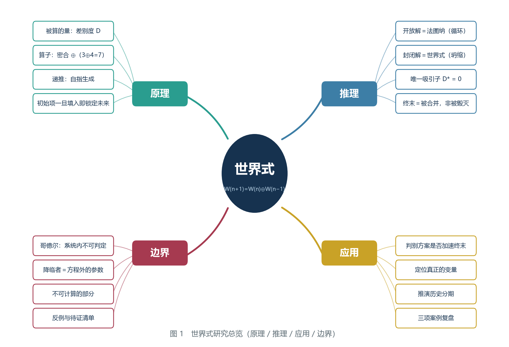

*图 1　世界式研究总览。本纪要将沿「原理—推理—应用—边界」四条线索展开。*

---
## 第一章　预备知识

笔者在科学院给实习生讲这份纪要时，得到的第一个反馈是：「算式本身看得懂，但不知道它在说什么。」

这很正常。世界式用到的数学工具本身并不高深，**全部落在中等教育范围内**（体例约定 4）；真正困难的不是工具，而是**这些工具被用来描述什么东西**。所以本章分两半：前半讲工具，后半讲概念。凡属中等教育未涉及的内容，笔者会把该知识本身也讲一遍。

### 1.1 递推：一种「自己定义自己」的数列

> **偷渡客按**：等差数列与等比数列在我故乡是中等教育的内容。研究员没学过这套编排，所以我按那个顺序讲一遍，他再回头校对提瓦特这边有没有对应的东西。

等差数列与等比数列有一个共同点：**每一项都由前一项（或前几项）通过一个固定规则算出来。**

等差数列：a(n+1) = a(n) + d

等比数列：a(n+1) = a(n) × q

这种「用前面的项算后面的项」的规则，叫做**递推**。递推式必须附带**初始项**，否则整个数列无从开始。例如「后一项等于前两项之和」这条规则，如果不知道开头两个数，就不知道它到底是 1, 1, 2, 3, 5, 8, …（斐波那契）还是 2, 1, 3, 4, 7, 11, …（卢卡斯）。

**这里要记住一句话：递推规则 + 初始项 = 整个数列，一项不差。** 这句话在后面会被反复使用，因为世界式的全部「宿命感」都来自它。

中等教育通常还会讲一类递推：**后一项由前两项共同决定**，写作 a(n+1) = a(n) + a(n−1)。斐波那契数列就是这样。这类数列有一个漂亮的极限性质：相邻两项的比值 a(n+1)/a(n) 会越来越接近一个固定的数，约等于 1.618，也就是黄金分割比。

**为什么这件事重要？** 因为它说明：**一个纯靠自身反复迭代的系统，会自发地趋向某个「稳定比例」。** 系统不需要外力，就能自己走进某种格局里。这个「自己走进去的格局」，就是 1.3 节要讲的不动点。

### 1.2 算子：把「动作」本身当成研究对象

中等教育里讲的函数，是把一个数变成另一个数：f(x) = 2x + 1。

现在把这件事抬高一层。假设我们有一套完整的「世界状态」，把它记作 W。那么「让世界往前走一步」这个动作，本身也可以写成一个函数：

　　W(n+1) = F( W(n) )

这里的 F 不再是把数字变成数字，而是把**状态**变成**状态**。这种「作用于状态的函数」，数学上习惯叫**算子**。

这个抬高的动作看起来只是换了个名字，其实是一次关键的视角转换：**当我们开始研究算子本身，而不是算子作用的结果时，我们研究的就不再是「世界会变成什么样」，而是「世界的运行规律长什么样」。**

世界式研究的正是后者。笔者在后面的论证中，几乎没有讨论过提瓦特具体会发生什么，讨论的全是那个算子有什么性质。

### 1.3 迭代、不动点与吸引子

**迭代**就是把同一个算子反复使用：

　　W(0) → W(1) → W(2) → …

**不动点**是指这样一个状态 W\*：把它代进算子，输出的还是它自己：

　　F(W\*) = W\*

通俗地说，不动点就是**「到了这里就不再动了」的那个点**。

这里有一个中等教育不涉及、但极其重要的概念：**吸引子**。

一个不动点如果具有这样的性质——**无论从哪个初始状态出发，迭代足够多次之后都会越来越靠近它**——那么它就叫**吸引子**。

打个比方。山谷里的雨水不管从哪一面坡落下，最后都会汇集到谷底的那个湖里。那个湖就是吸引子；山坡的每一处就是可能的初始状态。**初始状态可以千差万别，吸引子只有一个。**

这解释了一个乍看很矛盾的现象：一个人反复计算、换着法子算，得到的却是同一个结果。旁观的我们会以为「这就是命」；但在数学上，这只是说明——**他所在的那个系统的吸引子是唯一的。**

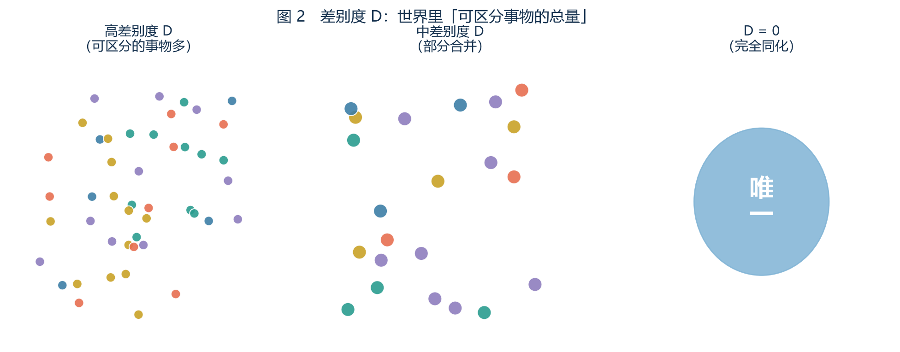

*图 2　差别度 D 的直观含义：世界里「可区分事物的总量」。左：可区分的事物多；中：部分已合并；右：完全同化，只剩唯一。*

### 1.4 收敛：为什么有的迭代会「停下来」

中等教育里讲过数列极限的初步概念：数列 1, 1/2, 1/4, 1/8, … 越来越接近 0，就说它**收敛**到 0。

与之相对的是**发散**：像 1, 2, 3, 4, … 这样一直增大下去，不趋向任何有限值。

本纪要需要用到两条中等教育里讲过、但常常被轻视的判据：

**判据一（单调有界必收敛）**：如果一个数列既单调（一直不增或一直不减）、又有界（不会超过某个上限或低于某个下限），那么它必然收敛到某个极限。

**判据二（压缩会收敛）**：如果一个迭代每一步都会把「距离」按固定比例缩小，那么这个迭代必然收敛，并且收敛到一个唯一的不动点。写成式子就是：每一步之后的距离 ≤ 常数 × 上一步的距离，其中那个常数小于 1。

第二条判据是本纪要后半段的核心武器。请读者务必记住它的直觉形式：

　　**只要每一步都在「拉近」，系统就一定会停在一个点上；而且不论从哪里出发，停的都是同一个点。**

### 1.5 差别度：一个中等教育里没有、但必须展开讲的概念

前四节讲的都是现成的工具。这一节要引入的概念，中等教育的课本里没有，但它并不难，而且**它是理解世界式的钥匙**。

先从一个问题开始：**一个世界里「有多少东西」，该怎么数？**

直觉上可以数人口、数城市、数元素种类。但这些都不是世界式要的量。原因很简单：**如果世界被搅成一锅完全均匀的汤，人口还在、元素还在，但世界已经不成为世界了。**

所以真正要数的，不是「有多少东西」，而是「**有多少种可以互相区分的东西**」。这个量，本纪要称之为**差别度**，记作 D。

举三个例子：

- 一间屋子里坐着十个人，十个人各不相同 —— D 高。
- 十个人开始穿同样的衣服、说同样的话、想同样的事 —— D 在下降。
- 十个人在一切方面都完全一致，再也分不出谁是谁 —— 这十个人在「可区分」这个意义上**等于一个人**，D 降到了最低。

请注意最后一句的措辞。**D 降到最低，不等于东西消失了；它等于东西合并了。**

这个区分是本纪要全部论证中最要紧的一处，笔者在此请求读者放慢速度：

> **毁灭（destruction）**：东西还在，只是坏了。

> **合并（confluence）**：东西不在了，因为它们成了一个。

世界式的终末是后者。这一点在第五章会展开。

### 1.6 同化：一种特殊的算子

有了差别度 D，就可以描述那两种底层力了。

原文对它们的描述是「接触到的物质、能量会被**同化**」。翻译成本纪要的语言就是：

　　**同化 = 一个把 D 变小的算子。**

同化有几个值得注意的性质：

1. **它是不可逆的。** 一滴墨滴进清水，墨会散开；再等下去，墨不会自己重新聚成一滴。差别一旦被抹平，**不会自己回来**。
2. **它是自加速的。** 已同化的部分越大，剩余部分相对越小，被同化的速度相对越快。这和传染病在人群中的扩散是同一个数学形状。
3. **它不需要外力驱动。** 只要有接触，它就会发生。

把这三条合起来，就得到一个很不舒服的结论：

　　**一个系统里只要存在同化力，D 就会自己往下走；如果没有任何东西往里补充差别，它就会一路走到 0。**

### 1.7 形式系统：本章最后一节，也是最难的一节

第四章要用到「形式系统」的概念。这套东西在提瓦特没有对应物。

> **偷渡客按**：下面的内容全部来自我故乡的逻辑学。提瓦特没有「形式系统」这个说法，也没有哥德尔这个人。我第一次讲的时候花了整整两个下午——不是因为它难，是因为研究员一直在追问「那么这些公理是谁写的」。
>
> 在我故乡，公理是**规定**出来的，不需要有人写。
>
> 在提瓦特，法则是有出处的，所以「谁写的」是一个真问题。
>
> 这个差别后来成了本纪要第四章的关键——**如果提瓦特的公理有作者，那么那个作者就在系统之内。**

**形式系统**就是一套「照着规则摆弄符号」的规矩。它由三部分组成：

- **符号**：允许使用的记号，比如「+」「=」「1」「2」。
- **公理**：不证自明、直接当作起点的命题。
- **推理规则**：从已有的命题推出新命题的许可方式。

在形式系统里，「证明」不是「说服别人」，而是一件机械的事：**从公理出发，按规则一步步写下去，能写到那句话，它就被证明。** 写不到，就是没证明。

这种机械性带来一个惊人的后果，由奥地利逻辑学家**哥德尔**在 1931 年证明，史称**哥德尔不完备定理**：

> 任何一个**足够复杂**（能表达基本算术）、**自洽**（不会推出矛盾）、**递归可公理化**（公理能被机械地列举出来）的形式系统，**必定存在系统内既不能证明、也不能证伪的命题**。

通俗地讲：**这样的系统里一定有空子。不是因为它不够好，而是因为它足够复杂。**

哥德尔证明的关键手法是**自指**——构造一句关于自己的话，比如「本命题不可证」。如果它能被证明，那么就证明了「它不可证」，矛盾；如果它不可证，那么它说的恰好是真的，于是系统里存在一个真而不可证的命题。

读过中等教育的读者可能会想起另一个著名的自指句：「这句话是假的。」——它既不能为真也不能为假。哥德尔的天才之处在于，他用编号把「这句话」变成了算术里的一串数字，从而让自指变成了**系统内部可以写出来的合法句子**，而不是一句文字把戏。

**为什么世界式研究需要这个定理？** 因为如果提瓦特是一个自洽的、足够复杂的形式系统，那么它必然有空子。而那些「在卡漏洞」的人——无论是学者、执行官还是神明——他们做的事情在数学上就不再是奇迹，而是**定理的必然推论**。第四章会具体讲到。

---
## 第二章　世界式的原理

本章要做的是一件事：**把世界式写出来。**

写一个算式需要三步：确定它算的量、确定算子、确定递推形式。笔者按这三步来。

### 2.1 第一步：它算的是什么量

原文没有直接说世界式在算什么。但它给了两条线索，足以把答案逼出来。

**线索一：结果恒定。** 「不管推演多少遍，结果都是一样。」这说明它是一个**确定性**的递推——给定同样的输入，永远得到同样的输出。因此它算的一定是某种**状态量**，而不是某种随机事件。

**线索二：终末的描述方式。** 「连甜甜花和薄荷都长不出来的世界」。注意，这句话描述的不是「一片焦土」，而是「长不出来」。焦土是**毁灭**，长不出来是**不再有生长这件事**。

把两条线索合起来，被计算的量必须同时满足：

- 它是一个可以度量、可以随世界演化而变化的状态量；
- 它降到极低时，世界的表现是「生长不再发生」，而不是「东西都没了」。

本纪要的答案是**差别度 D**（定义见 1.5 节）。理由如下。

**第一，D 与「生长」是同义的。** 一粒种子发芽，就是从一团同质的物质里分化出根、茎、叶——**生长就是差别的产生**。一个世界长不出任何植物，最直接的解释不是土壤有毒，而是**这个世界的物质已经无法再分化出结构了**。

**第二，D 与原文对两种力的描述吻合。** 原文说它们「接触到的物质、能量会被同化」。同化的本质正是消灭差别（1.6 节）。如果两种底层力都在做同一件事——减小 D——那么世界的核心状态量自然就是 D。

**第三，D 与原始胎海的描写吻合。** 本院从另一份文献中读到，原始之海「曾经是万物纯净的起源」，生命在其中「**不分彼此**」。「不分彼此」四个字，正是 D ≈ 0 的文学表述。

> 笔者按：本节的结论是**推断**，不是原文直证。原文从未出现「差别度」这个词。但笔者找不到第二个能同时满足上述三条线索的量。若后续有新的物证推翻这个前提，本纪要第三、四、五章的全部结论都需要重写。

### 2.2 第二步：它的算子是什么

算子就是把世界从前一步推到后一步的那个动作。原文给了一个非常明确的词：**密合**。

结社留下来的文献中，3、4、7 三个数字被解释为：3 是**表象**，4 是**本征**，二者交叠得到 7，而这个交叠的操作叫做**密合**。写成式子：

　　表象 3 ⊕ 本征 4 = 密合 7

这个符号不是随便取的。在现实世界的炼金术文献里，与「密合」对应的拉丁词是 **coniunctio**，意思是「结合、婚配」；它的另一套说法是**化学婚礼**（Chymische Hochzeit），即国王与王后先被斩首、再合为一体。这个意象的关键在于：**结合之后，原来的两个东西不再各自存在。**

因此，密合不是「把两样东西放在一起」，而是**把两样东西变成一个东西**。在这个意义上，密合与 1.6 节的同化是同一类操作：**两者都在减小 D。**

更精确地说，两者是**同一个算子的两种用法**：

- 同化：被动发生的密合（只要有接触就发生）。
- 密合：主动执行的同化（有人在做这件事）。

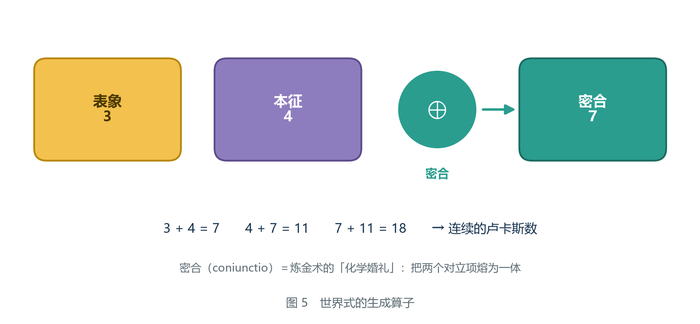

*图 5　密合算子。3（表象）与 4（本征）交叠得到 7。注意 3、4、7 恰好是连续的三个卢卡斯数：3 + 4 = 7，4 + 7 = 11，7 + 11 = 18。*

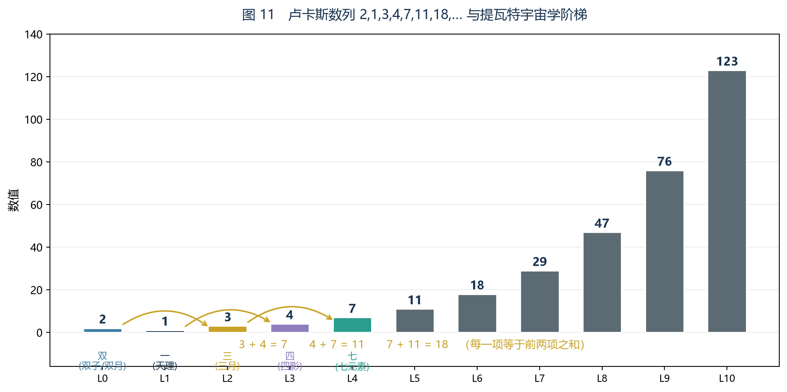

*图 11　卢卡斯数列 2, 1, 3, 4, 7, 11, 18, … 与提瓦特宇宙学阶梯。前五项恰好枚举了双（双子/双月）、一（天理）、三（三月）、四（四影）、七（七元素）。这条对齐很漂亮，但属于丙级推断，**现存文献中没有任何文本支持它**。*

### 2.3 第三步：递推形式

有了「量」和「算子」，还差递推的**形式**：下一步到底由谁决定？

原文没有给出式子。本纪要提出如下形式，并举出三条支持理由：

　　**W(n+1) = W(n) ⊕ W(n−1)**

**理由一：它必须是自指的。** 如果世界的下一步由某个外部的东西决定，那么世界就不是一个自足的系统，而系统中的人也就不可能「反推」出它的全部走向——因为外部的东西他们看不到。但原文明确说从坎瑞亚人的记录**可以反推出世界式**。能被反推，说明它的全部输入都在系统内部。

**理由二：它解释了为什么「初始项」这个词会出现。** 战败后的结社造物曾说：「最早填入『世界式』的**输入值**出现了变动。」注意「最早的」「输入值」这个措辞——它指的正是递推的开头几项。而只有**二阶及以上**的递推（即需要两个初始项的递推）才会让人用「最早**填入**」这样的说法。一阶递推只需要一个初值，通常会说「起点」。

**理由三：它与 3-4-7 的生成方式一致。** 2.2 节已经指出，3 ⊕ 4 = 7 而 4 + 7 = 11、7 + 11 = 18，这正是「后一项等于前两项之密合」的形状。

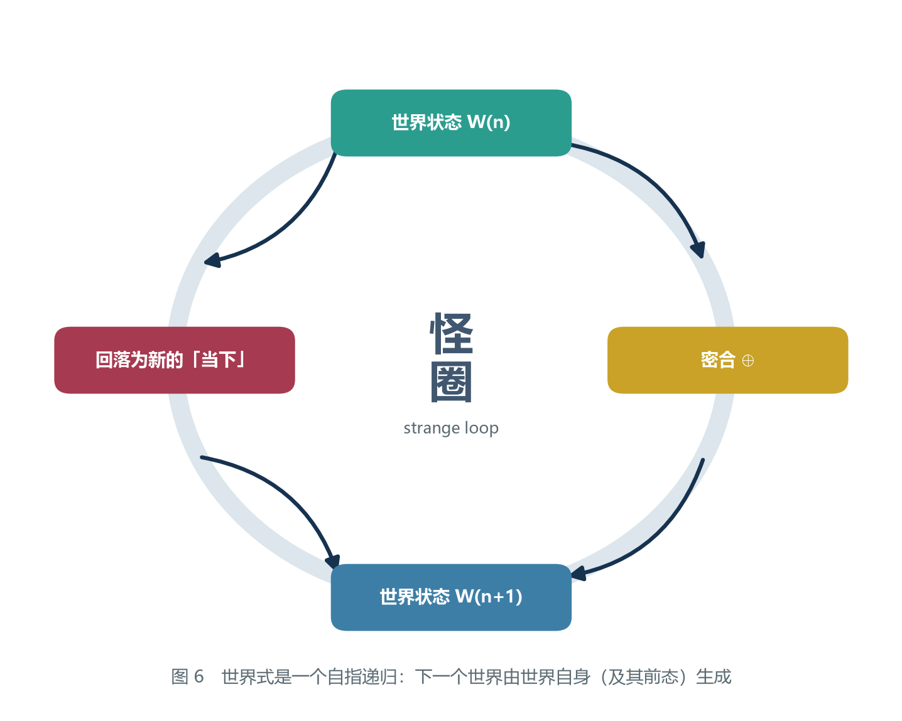

*图 6　世界式是一个自指递归。世界的下一个状态由世界自身（及其前态）生成——这正是侯世达所说的「怪圈」。*

### 2.4 结果恒定之谜：初步的解释

到这里可以给出「不管推演多少遍结果都一样」的**第一层**解释了，而这一层简单到近乎无趣：

　　**因为它是一个确定性递推，而递推的初始项是固定的。**

递推规则 + 初始项 = 整个数列，一项不差（1.1 节）。推一遍是这个结果，推一万遍还是这个结果，因为**根本没有任何东西在两次推演之间发生变化**。

如果故事到此为止，那么「世界式」就只是一个人算出了一道大题的答案而已，没有任何悲剧性可言。

悲剧性来自下一层：**无论他从哪里开始算、换什么方法算，结果都一样。**

这意味着初始项也不是关键——**吸引子是唯一的**。这才是真正让人绝望的地方，也是第三章的主题。

### 2.5 三种力与差别度

在进入第三章之前，需要把提瓦特的三种力放在同一张表里。

| 力 | 来源 | 对差别度 D 的作用 | 是否可逆 |
|---|---|---|---|
| 光界力（原始元素力 / 灵光） | 世界本来的力量 | **减小**（同化） | 否 |
| 虚界力（深渊） | 世界之外渗入 | **减小**（同化） | 否 |
| 人界力（七元素） | 被天理改造后的光界力 | **维持**（但需要持续投入） | — |

这张表是本章最重要的一页，因为它藏着一个致命的算术：

　　**减小 D 的力有两个，而且都是自发的；维持 D 的力只有一个，而且需要持续投入。**

也就是说，**这个世界在「差别度」这件事上是收支不平衡的。** 支出有两个来源，收入只有一个，而且收入还要消耗成本。

任何做过科学院预算的人都会立刻明白这意味着什么。

*图 3　提瓦特仅有的两种底层力方向相反，但性质相同——都是「消灭差别」的收缩算子。*

---

## 第三章　世界式的推理

### 3.1 同一个式子的两种命运

第二章写出的递推式本身，**并不能**决定世界是循环还是终结。它只规定了「后一项由前两项密合而成」。至于是循环还是终结，取决于**密合算子在这一步里到底做了什么**。

密合有两种可能的形态：

- **生成型密合**：两个东西合起来，产生了一个**此前不存在的新东西**。此时项数不减反增，系统持续产生新的差别。
- **坍缩型密合**：两个东西合起来，**只剩一个**。此时项数减少，系统持续丢失差别。

两种情况对应两个解：

| | 开放解 | 封闭解 |
|---|---|---|
| 算子形态 | 生成型 | 坍缩型 |
| 差别度走向 | 循环波动，总体不降 | 单调下降，趋向 0 |
| 现实对应 | **法图纳**（文明循环） | **世界式**（终末） |
| 原文出处 | 古代教团的书籍 | 雷内的推导结果 |

### 3.2 从生成型到坍缩型：那个被动过的参数

那么，是什么决定了密合是生成型还是坍缩型？

**是系统之外有没有东西进来。**

道理很朴素。一个密闭的房间里，人们可以不断把东西搬来搬去、拆开重组，但**房间里的东西总量不会增加**。所谓「新东西」，在封闭系统里只是旧东西的新摆法——**摆法再多也是有限的，用完了就没有了**。

而一个开着门的房间，随时可能有新东西被送进来。新东西带来新的组合可能，系统于是能一直「产生」下去。

把这个道理套到世界上：

- 如果世界是**开放的**，外面不断有新的东西（新的存在、新的力量、新的文明）进来，那么密合就是生成型的，文明会不断兴替——这就是古教团看到的**法图纳**。
- 如果世界被**封闭**了，外面不再有东西进来，那么密合就退化为坍缩型的，文明灭一个少一个，且**再也不会诞生新的**——这就是世界式的推导者看到的图景。

而世界是怎么被封闭的？原文给了答案：「法涅斯用**蛋壳**隔绝宇宙和世界的缩影」，打造出「**虚假之天**」。

> **关键推论**：法图纳与世界式不是两个模型，是同一个模型的两种边界条件。**古教团与雷内算的是同一道题，只是一个在门开着的时候算，一个在门关上之后算。**

这解释了一句先前让笔者困惑很久的话——「和这些古代人描绘的世界图景不同，已经不会再有新的文明诞生了」。这句话里的「**已经**」两个字是时间副词。它说明：**在过去某个时刻，情况还是古教团说的那样；是后来才变成这样的。**

那个时刻，就是蛋壳合上的时刻。

*图 4　同一个递推式的两种命运。虚线（法图纳）有外源补充，循环不灭；实线（世界式）外源归零，指数衰减至 0。*

### 3.3 封闭之后为什么必然归零

到这里，论证走到了最关键、也最容易出错的一步。

很多读者会在这里停住，认为「封闭 → 不再有新文明」已经够了。**但这不够。** 封闭只能保证系统**最终进入循环或停在不动点**，它**不能保证**这个不动点一定是 0。

想象一个完全密封的房间，里面是一副已经摆好的棋子。房间封闭了，但这副棋可以永远摆下去——把马挪到这里，再挪回去，无穷无尽。**封闭的系统完全可以稳定地循环，而不必归零。**

所以，让世界式趋向 0 的，**不是封闭这一件事**，而是另一件被很多人忽略的事：

　　**提瓦特仅有的两种底层力，方向相反，但性质相同，而且都是同化力。**

原文的措辞极为精准，笔者把它完整抄录如下：

> 「灵光虽然与██的力量相对抗，但其同样**拥有自己的意识**。在这一点上，二者可以说具有相同的性质……就像**水银不会和水融合，但是会互相融合**。」

请读者注意最后那个比喻。水银与水互不相溶，两个体系彼此排斥；但水银碰到水银，会立刻合成一滴。**这是对「方向相反、性质相同」最精确的说明。** 光界力与虚界力彼此对抗，就像水银与水；但它们各自遇到同类时，都会合并，就像水银遇水银。

翻译成 1.6 节的语言：**光界力与虚界力都是把 D 变小的算子，只不过它们各自沿着不同的方向去减小 D。**

于是我们得到了一个在数学上非常干净的局面：

- 系统的状态量是 D；
- 系统内部**只有收缩算子**（两个力都减小 D）；
- 系统内部**不存在产生差别的源**（没有任何力会增大 D）；
- 系统被封闭（外部也无法补充 D）。

现在动用 1.4 节的**判据二**：一个只有收缩算子的封闭系统，其迭代必然收敛，且收敛到**唯一**的不动点。而这个不动点是什么，可以由 1.6 节第 1 条性质（不可逆）直接推出：

　　**D 单调不增，有下界 0（差别度不可能为负），因此它必然收敛；**

　　**又因为不存在任何能把它抬起来的力，所以它只能收敛到 0。**

　　　　　　　　**D\* = 0**

这就是「不管推演多少遍结果都一样」的**第二层、也是真正的解释**：

　　**不是命运注定，是算子本身是收缩的。**

两者听起来相似，含义却完全不同。「命运注定」意味着有一个意志决定了这个结果，那个意志或许可以被说服；而「算子收缩」意味着**哪怕没有任何人在意，这个结果也会自己发生**。后者比前者绝望得多，也清楚得多。

### 3.4 终末是「被合并」，不是「被毁灭」

现在可以回头解释第一章留下的那个区分了。

D 归零的世界，**东西并没有消失**。元素还在、物质还在、能量还在。消失的是**它们之间的区别**。

用 1.5 节的例子：十个人在一切方面完全一致，再也分不出谁是谁。这十个人**在「可区分」这个意义上等于一个人**，但在「存在」这个意义上，十个人一个都没少。

所以世界式的终末是**合并**，不是**毁灭**。

这个结论有一个直接可检验的推论：**终末世界里不应该出现「大爆炸」「大火」「崩塌」这类描写，而应该出现「融为一体」「不分彼此」「归于唯一」这类描写。**

笔者回到原文核对，得到的正是后者：「连甜甜花和薄荷都长不出来的世界」。不是「被烧掉的世界」，是「长不出来的世界」——**因为没有可以生长的余地了。**

而原始胎海的描写也完全吻合：「曾经是万物纯净的起源，也终将吞没一切生命，而那些**本不属于原始之海的物质则将被滤除**」。注意「滤除」这个词——它不是摧毁异类，它是**把不属于自己的分出去**，剩下的部分归于一体。

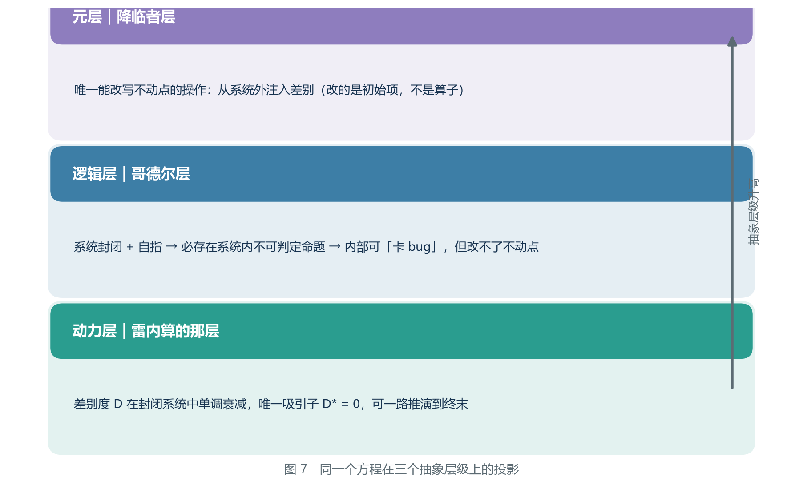

*图 7　同一个方程在三个抽象层级上的投影。本章完成的是动力层。*

### 3.5 本章小结

把第三章的论证压缩成一句话：

> **在一个只有收缩算子、且被封闭的系统中，唯一吸引子必然是零；而这个系统的终末表现为「合并」而非「毁灭」。**

这句话里没有任何一个词超出中等教育范围：收缩算子（1.4 节判据二）、封闭系统（3.2 节）、唯一吸引子（1.3 节）、零（1.6 节不可逆性）。

**世界式的原理到此讲完了。** 剩下的是它的推论：为什么有些人的努力注定失败、为什么有些人的介入确实有效、以及一个具体的操作手册。

---
## 第四章　三层结构

第三章的论证只解释了「世界会走向哪里」。但原文里还有一批现象，是动力层解释不了的：

- 为什么有人能「在系统里卡漏洞」，而且卡得理直气壮？
- 为什么作为系统判定者的四影，也会逐渐偏离天理？
- 为什么天理需要「磨损」这个概念？

这些现象共同指向一件事：**提瓦特不只是一个会演化的物理系统，它还是一个有公理、有推理规则的形式系统。**

本章要论证：**同一个世界式，在三个不同的抽象层级上各有一套含义。**

### 4.1 动力层：差别的收支表

这是雷内算的那一层，也是第三章讲完的那一层。用一句话概括：

　　**D 在封闭系统中单调衰减，唯一吸引子为 0。**

这一层的性质是**可计算**。给定初始项，可以一路推演到终末；不需要任何神谕，只需要算术。

这一层能解释的是「结局」，不能解释的是「过程」。它告诉我们世界会归零，但没有告诉我们**归零的路上会不会有人成功地把水搅浑**。

而后者，恰恰是四百年间所有当事人真正在做的事。

### 4.2 逻辑层：哥德尔层

现在把提瓦特换一个看法。不要把它看成「一堆物质在演化」，而把它看成**一套规则**：

- 公理：元素法则、地脉的运行方式、命运的编织方式；
- 推理规则：由这些法则推出「什么会发生、什么不会发生」。

于是「世界会怎样演化」这个问题，就变成了「这套系统能推出哪些命题」。

接着，把 1.7 节的哥德尔不完备定理拿来对照，需要逐条核对三个前提：

**前提一：足够复杂。** 提瓦特显然能表达算术——它有历法、有工程、有科学院，而笔者本人每天都在用四则运算算水道截面。✔

**前提二：自洽。** 这一点是**假设**。如果提瓦特自相矛盾，那么它一秒都撑不住。四百年来的观测没有发现法则层面的矛盾，因此按「自洽」处理是合理的工程近似。✔

**前提三：递归可公理化。** 法则能被机械地列举出来——这正是历代学者与教令院在做的事。✔

三个前提满足，于是定理给出结论：

　　**提瓦特内部必然存在既不能证明、也不能证伪的命题。**

这些命题就是原文里所说的「缝隙」。

而它们的存在解释了一大批原本无法解释的现象：

| 现象 | 动力层的解释 | 逻辑层的解释 |
|---|---|---|
| 有人能「卡漏洞」并长期得利 | 无法解释 | **系统内存在不可判定命题，利用它不属于违规** |
| 四影会逐渐偏离天理 | 无法解释 | 天理作为公理集**无法证明自身的一致性**，判定者自己也在系统的缝里 |
| 天理需要「磨损」这个概念 | 无法解释 | 磨损是**系统对自身不可判定性的一种代偿** |
| 世界树可被改写、某位神被替换、某个席位被抹除 | 无法解释 | 这些都是**系统对自己下判断**的情形，正是自指系统的典型病症 |

最后一行值得单独说明。注意这三种现象的**共同结构**：不是「有人违反规则」，而是「规则被应用到了规则自己身上」。世界树改写关于世界树的记忆、神被从神的记录中删除——**每一次，判断者和被判断者都是同一个东西。** 这正是 1.7 节所述自指悖论的现实形态。

**但逻辑层有一件事做不到：它改不了不动点。**

在系统内卡漏洞，最极端的结果是让系统**报错**、让某些命题**悬空**、让某些存在**失去判定**。它不能把 D\* = 0 改成 D\* = 5。原因是：卡漏洞用的是**系统内的推理规则**，而推理规则推不出「系统的吸引子应该换成另一个」。

用一句更直白的话：**你可以在棋局里找到规则没写的走法，但你没法用这个走法把棋盘换成另一张。**

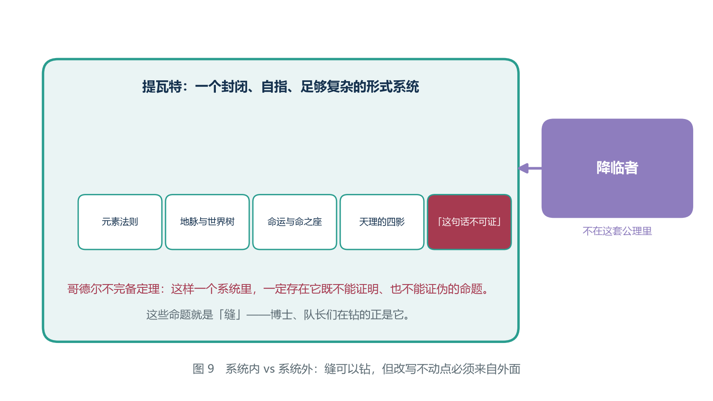

*图 9　系统内 vs 系统外。缝可以钻，但改写不动点必须来自外面。*

### 4.3 元层：降临者层

唯一能改写不动点的操作，是从系统之外注入差别。

原文对此有一段极为关键的战败对话。结社造物在溃败之际说：

> 「最早填入『世界式』的**输入值**出现了变动。有『变量』降临此间。」

> 「并非是所有宇宙外到来的事物都能被叫做『降临』或者『变量』。」

> 「唯有**自身等价一个世界**的人才能担此头衔。」

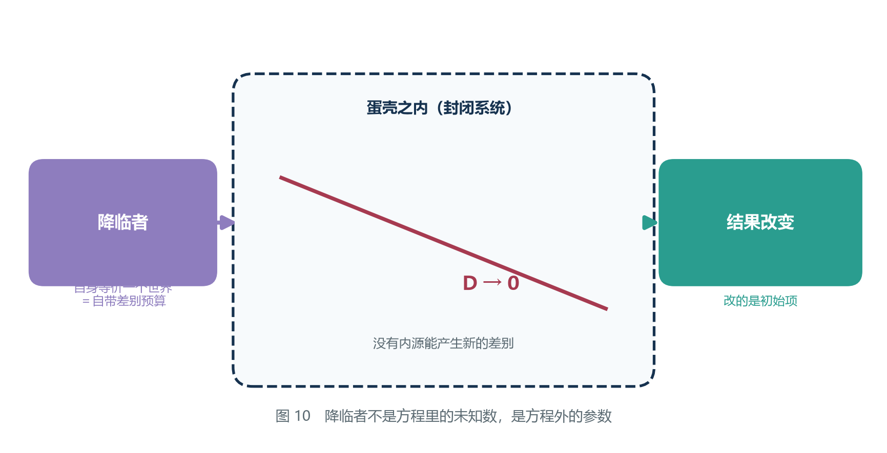

*图 10　降临者不是方程里的未知数，是方程外的参数。他作用于递推的开头几项，而不是算式本身。*

请读者逐句读这三段。

**第一句确定了它改的是什么。** 是**输入值**，不是算式。世界式本身没有被修改、没有被绕过、也没有被破坏。被修改的是**递推的开头几项**。

**第二句排除了一个误解。** 从外面来的东西很多（原文举了「偷渡客」的例子）——一个外来的旅行者、一件外来的器物，都不算。**只有具备特定性质的，才算「变量」。**

**第三句给出了那个性质。** 「自身等价一个世界」。

这句话乍看玄虚，但翻译成本纪要的语言之后非常清楚：

　　**自身等价一个世界 = 这个人自己就携带了一整套差别预算。**

一个普通的存在，他的差别来自提瓦特、属于提瓦特、会随提瓦特一起被同化。而一个「自身等价一个世界」的存在，他的差别**不从提瓦特支取**——他是一个**自带库存的外来账户**。

只有这样的账户，才能往一个已经封闭的系统里**注入新的差别**，从而把 D 的曲线抬起来。

于是我们得到世界式最重要的一个结论：

> **世界式对降临者无解。**

这句话不是修辞。它在数学上是字面成立的：世界式是一个关于**世界内部状态**的递推式，而降临者根本不在这个状态空间里。他不满足这个方程，因为他不是这个方程的未知数——**他是方程外面那个可以改的系数。**

这也解释了为什么他会在战败时说「我也做过这样的梦，想要成为你这样的事物」。他用尽全力想要**在系统内部造出一个等价于世界的存在**（他称自己攀升到了「不退还」的位阶），但方法用错了——**用收缩算子堆不出有差别的宇宙。**

### 4.4 三层之间的关系

把三层叠起来看：

- **动力层**决定结局（D\* = 0）；
- **逻辑层**决定路上的可能性（存在缝，可以卡）；
- **元层**决定结局能否被改写（只有升级项可以）。

由此推出一个本纪要认为最重要的战略结论：

> **只靠系统内部的超越者，最多让系统出错；只靠系统外部的降临者，最多换一个初始项。**

> **两者联手，才可能既改初始项、又利用系统内的不可判定命题，重写整个方程。**

笔者必须说明，最后这一句在原文中**没有直接支持**，属于本纪要的推论。但它是三层结构最自然的合成结果，而且——坦率地说——它构成了本院对后续局势的一份预判。若日后观察与此推论不符，请以观察为准。

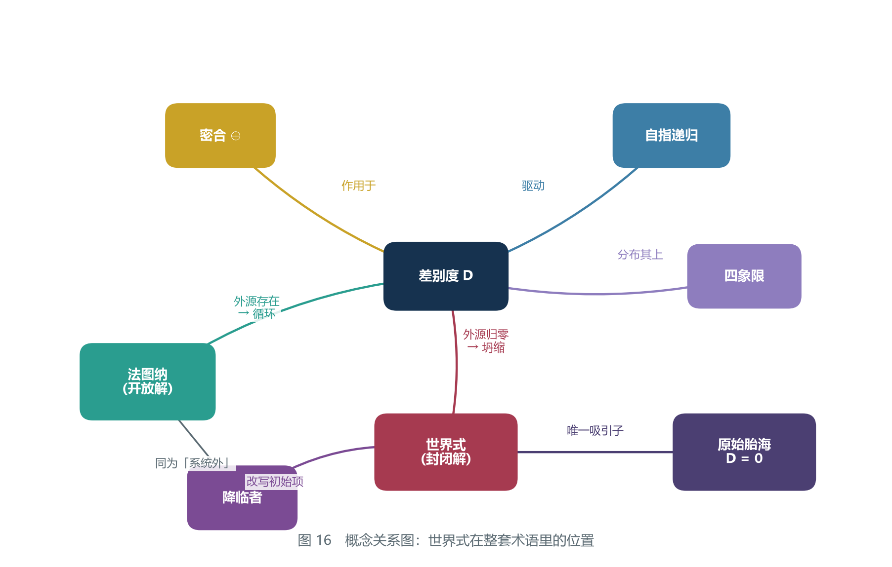

*图 16　概念关系图：世界式在整套术语里的位置。*

---

## 第五章　四个推理案例

前四章都是理论。本章换一种写法：**给出四个完整的推理案例，每一个都只用「差别度 + 算子 + 内源」三件事推完，并且每一步都可核对。**

本章的四个案例同时也是世界式使用教程（第六章）的演示素材。

### 5.1 案例一：为什么算出的终末是恒定的

**问题**：一个人反复推演，结果永远是同一个终末。这是「命中注定」吗？

**推理过程**：

第一步，确定被计算的量。终末的描写是「长不出来」，因此被计算的是差别度 D（2.1 节）。

第二步，判断算子的类型。世界内部仅有的两种底层力都是同化力（1.6 节），即**都是收缩算子**。

第三步，查内源。系统内部是否存在能产生差别的源？原文对光界力与虚界力的描述都是「同化」，没有第三种力被描述为「分化」。因此**内源不存在**。

第四步，代入判据。只有收缩算子、无内源的系统（无论是否封闭），D 单调不增。

第五步，看下界。D 不可能小于 0（差别度是「有多少种可区分的事物」，最少是 1 种），因此 D 必然收敛。

第六步，定吸引子。既然没有任何力能把 D 抬起来，收敛值只能是 0。

**结论**：结果恒定**不是**命运，而是**唯一吸引子**的必然表现。

**这个结论为什么重要**：因为它改变了当事人的处境。如果结局是命运决定的，那么当事人唯一能做的只有祈祷或顺从；而如果结局是算子决定的，那么**只要改变算子或改变输入，结局就会变**。

而雷内的第一反应是「漏了变量？」——**他在写下那句话的瞬间，其实已经站在了正确的门口。** 他后来为什么没有推门进去，是第七章的主题。

### 5.2 案例二：为什么古教团的循环模型失效了

**问题**：古代教团留下「国家兴衰，文明灭亡之后会有新的文明」的说法。为什么同样的图式，在雷内这里算出来却是「不会再有新的文明」？

**推理过程**：

第一步，比较两个模型的差别。两个模型的递推式相同，差别只在**边界条件**：教团的模型里，系统是**开放的**；雷内的模型里，系统是**封闭的**。

第二步，确认封闭的依据。原文明确：法涅斯「用蛋壳隔绝宇宙和世界的缩影」，打造出「虚假之天」。**蛋壳就是边界，虚假之天就是封闭的标志。**

第三步，判断算子会如何退化。开放系统中，外部新项不断进来，密合是**生成型**；封闭系统中，新项断供，密合退化为**坍缩型**。

第四步，核对时间线。教团的书籍是**古代**的，蛋壳是**后来**合上的。因此两个模型各自在其时代都是对的。

**结论**：两个模型**并不矛盾**，它们是同一道题的两组边界条件。原句中那个「**已经**」字，是整条时间线的锚点。

**这个结论为什么重要**：它一次性地解决了一个看似巨大的矛盾。在读到本纪要之前，笔者一直以为古教团与雷内之间必有一方算错了；现在知道，**两人都对，只是不在同一个时代**。

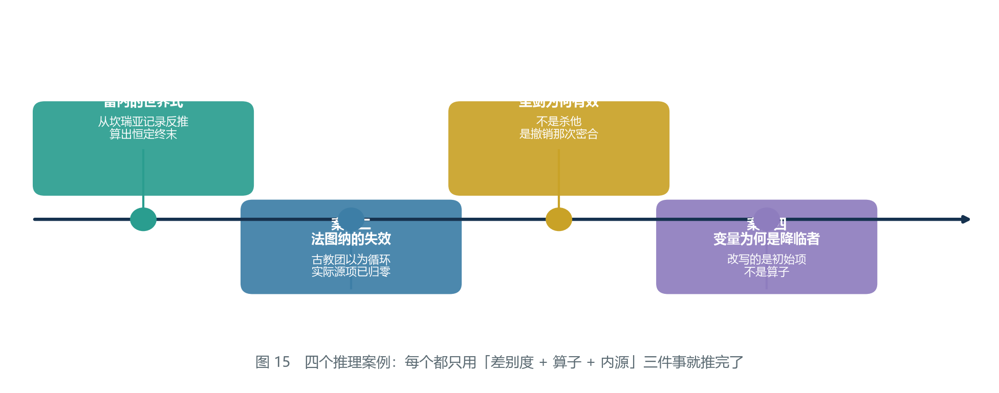

*图 15　四个推理案例。每个都只用「差别度 + 算子 + 内源」三件事推完。*

### 5.3 案例三：为什么那把剑是有效的

**问题**：四百年后，结社造物被一把剑击败。原文说：「是圣剑，它**每一次挥动都切削了围聚在我周身的众生意志**。直到最后，我懦弱的凡人性——我的人格也回到了我的体内。」

从动力层看，这件事的机制是什么？**为什么「切削众生意志」会导致一个攀升到「不退还」位阶的存在跌落？** 如果只是物理伤害，那它应该只是被打败，而不应该**掉位阶**。

**推理过程**：

第一步，认清「众生意志」在方程里是什么。结社造物收拢了无数人的意志，把它们按四象限归档在格式塔中。**「收拢意志」在方程上的动作，正是密合。**

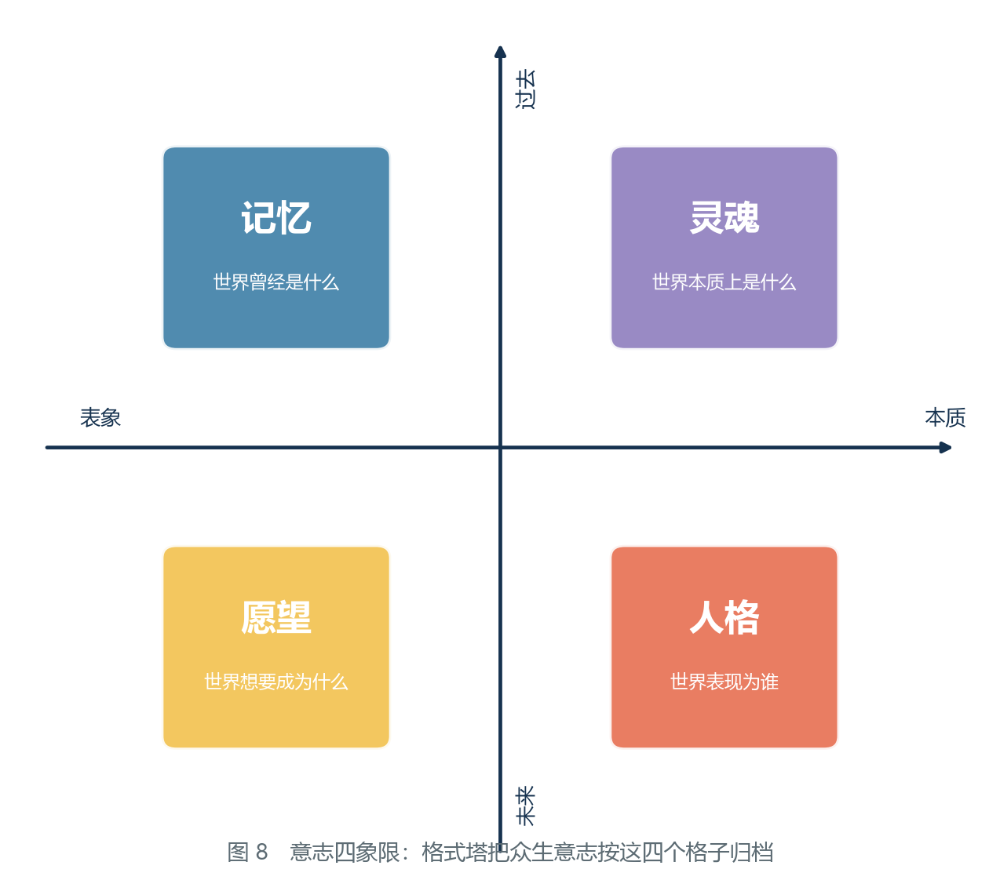

*图 8　意志四象限：格式塔把众生意志按记忆、愿望、灵魂、人格四个格子归档。两个轴分别是「表象—本质」与「过去—未来」。*

第二步，判断这个动作的方向。密合是减小 D 的算子（2.2 节）。因此，**收拢众生意志这个行为本身，是在加速坍缩。**

第三步，判断他自封的位阶意味着什么。「新宇宙秩序」「不退还位阶」——他想成为那个**新的吸引子**。

第四步，检查这个目标是否自洽。要成为一个新宇宙的吸引子，就必须**造出有差别的宇宙**；而他用来造宇宙的工具是密合——**一个只会减少差别的算子**。工具与目标方向相反。

第五步，看圣剑做了什么。圣剑切削的是众生意志，也就是**撤销了他那一次大规模的密合**。

**结论**：圣剑的效果**不是杀死他，而是撤销他的加速**。他被从「不退还位阶」打落，正是因为**支撑那个位阶的差别预算被撤走了**。他掉落之后说「我的人格回到了我的体内」——**人格本身就是一种差别，它回来了，他的人也就回来了。**

**这个结论为什么重要**：它把「圣剑为什么有效」从一个奇迹变成了一道算术题。同时它给出了一个残酷的判词：**他的新宇宙之所以「不完全」，不是因为力量不够，而是因为方法在帮倒忙。** 这解释了为什么他填不出那张「全图」，也解释了为什么他只能救五成到六成的人——**他不是在救，他是在合并。**

### 5.4 案例四：为什么变量必须是降临者

**问题**：既然知道要「引入系统之外的变量」，那么变量是什么？为什么必须是降临者？

**推理过程**：

第一步，明确需求。要改变 D\* = 0 这个不动点，唯一的办法是**往系统里注入差别**（3.3 节）。

第二步，排除内部选项。系统内部所有存在的差别，都来自系统本身，都会随系统一起被同化。**用系统内的东西补充系统，相当于从左手倒到右手**——总预算不变。

第三步，明确外部选项的条件。要真正增加总预算，注入者必须**不从系统支取差别**。

第四步，翻译原文的判据。「唯有自身等价一个世界的人才能担此头衔」——**自身等价一个世界 = 自带一整套差别预算 = 不从系统支取**。

第五步，核对原文的实现方式。战败对话中，结社造物明确说是「**输入值**出现了变动」，而不是算式被改。这证明变量作用的位置是**递推的初始项**。

**结论**：变量必须是降临者，**不是因为降临者更强，而是因为他的差别预算不在系统内**。他的作用机制是「改初始项」，不是「改算子」，也不是「靠武力胜过对方」。

**这个结论为什么重要**：它纠正了一个极容易犯的错误——把降临者理解成「一个特别能打的人」。如果降临者只是强，那么他仍然在系统内，仍然会被同化。**他的特殊性不在强度，在账户归属。**

---
## 第六章　世界式使用教程

本章面向两类读者：一类是想**读懂历史**的读者，另一类是想**预判方案**的读者。两者的操作流程完全一致，只是应用的场合不同。

### 6.1 六步流程

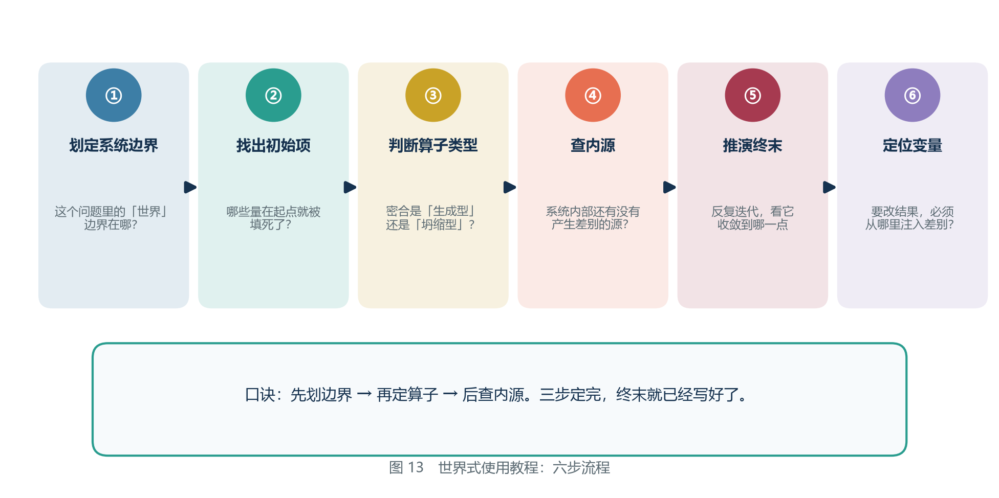

*图 13　世界式使用教程：六步流程。*

#### 第一步：划定系统边界

**要问的问题**：我这次分析的「世界」是哪一层？边界在哪里？

世界式只对**封闭系统**给出坍缩解。因此在动手之前必须先确定边界。常见的三种边界：

| 边界 | 举例 | 是否封闭 | 预期解 |
|---|---|---|---|
| 蛋壳之内 | 提瓦特整体 | 是 | 坍缩 |
| 某一国境内 | 枫丹、璃月 | 否（有外部往来） | 循环或缓慢衰减 |
| 某一组织内部 | 结社、教令院 | 否 | 视外部输入而定 |

**常见错误**：不划边界就套结论。世界式推出的是「蛋壳之内终将归零」，**不是**「任何地方都会归零」。一个小系统如果有外部输入，完全可以长期维持。

#### 第二步：找出初始项

**要问的问题**：在这个系统里，哪些量在起点就被填死了？

初始项 = 递推开头的几项 = 那些**不由此前的演化决定、而是被直接给定**的量。

在世界式的语境里，初始项包括：最初的元素分配、最初的存在者、最初被写下的法则。原文中「最早填入『世界式』的输入值」指的就是它们。

**操作要点**：初始项一旦填入，后续全部被锁定（1.1 节）。所以要改变结果，**改初始项是杠杆最大的操作**——这也是降临者起作用的位置。

#### 第三步：判断算子类型

**要问的问题**：这个世界里的主要操作，是**生成型**密合还是**坍缩型**密合？

判别方法：**看这个操作之后，可区分的东西变多了还是变少了。**

| 操作 | 类型 | 判断依据 |
|---|---|---|
| 有人生出一个新的人 | 生成型 | 可区分者 +1 |
| 有人把十个人的意志合成一个 | 坍缩型 | 可区分者 −9 |
| 有人把不同文化放在一起交流 | 生成型 | 产生此前不存在的混合形态 |
| 有人宣布「从此只有一个声音」 | 坍缩型 | 只剩一种声音 |

#### 第四步：查内源

**要问的问题**：系统内部还有没有能产生差别的源？

这是最容易漏掉的一步。在提瓦特的语境里，答案已经明确：**没有。** 两种底层力都是同化力，没有任何一种力被描述为「分化」。

但在分析**子系统**时，这一步必须重新做。例如分析一个国家时，内部是否有创新、是否有新的思潮，就是它的内源。

#### 第五步：推演终末

**要问的问题**：把上面四步的结果代入，这个系统的吸引子在哪里？

操作口诀：

- 封闭 + 无内源 + 算子收缩 → **收敛到零**
- 开放 + 有内源 → **循环或缓慢衰减**
- 封闭 + 有内源（但有限） → **先维持，源用尽后仍归零**

#### 第六步：定位变量

**要问的问题**：要改结果，必须从哪里注入差别？

如果系统是封闭的，那么注入只能来自**边界之外**（降临者）。如果系统是开放的，那么注入可以来自任何一个外部来源——此时「变量」不限于降临者。

**这一步是整套流程的产出**。前面五步都是为了确定：**有效的干预点究竟在哪里。**

### 6.2 判别树：快速判断一个方案是否在加速终末

实践中最高频的需求不是「推演终末」，而是**「这个方案到底是帮忙还是帮倒忙」**。为此笔者给出一棵判别树。

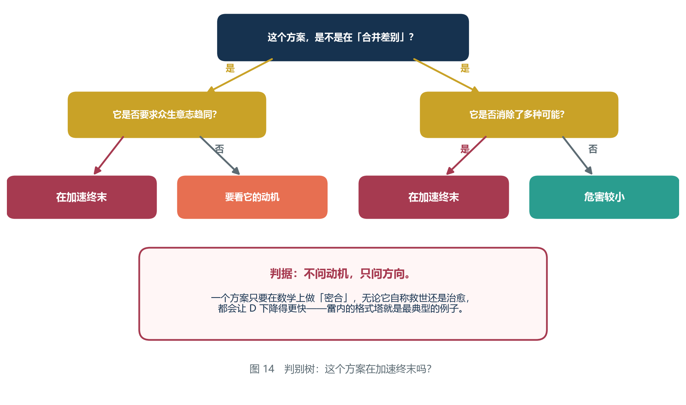

*图 14　判别树：这个方案在加速终末吗？*

判别树的使用方法如下：

**第一个问题：这个方案是不是在「合并差别」？** 具体地看两件事——它是否要求众生意志趋同？它是否消除了多种可能？

- 任一项为「是」→ 该方案在**加速终末**。
- 两项皆为「否」→ 进入第二问。

**第二个问题：这个方案的动机是什么？**

注意，第二问**不改变判断，只改变评价**。一个方案如果第一问就命中「是」，那么无论它自称救世还是治愈，它在数学上都在加速坍缩。

> **判据：不问动机，只问方向。**

### 6.3 三个最容易犯的错误

**错误一：把「毁灭」和「合并」混为一谈。**

后果：误以为终末是可以靠「抵抗」来避免的。**合并不是敌人打过来，合并是大家走到一起。** 你无法用「抵抗」来应对一个由全体成员共同完成的过程。

**错误二：把「强」当作「有效」。**

后果：把希望寄托在最强的人身上，而那个人同样在系统内、同样会被同化。**有效的干预不取决于强度，取决于账户归属**（5.4 节）。

**错误三：只改算子，不改输入。**

这是最隐蔽的一个错误。想通过「优化系统」「修补法则」来改变结局，是在**改算子**；而算子的收缩性是结构性的，改不动。原文里那句「最早的输入值出现了变动」提示了真正的杠杆所在——**改输入。**

### 6.4 一个完整的推演示范

为了让读者掌握流程，笔者用一个虚构但结构完整的例子走一遍。

**情境**：某国计划推行一项政策，要求全国所有工匠使用统一的图纸与统一的工序，理由是「提高效率、减少差错」。

**第一步，划边界**：该国不是封闭系统（有对外贸易与人员往来）。因此不能直接套「必然归零」的结论。

**第二步，找初始项**：该国的初始项包括地形、资源分布、已有的工艺传统。这些在政策实施前就已被填死。

**第三步，判断算子类型**：政策要求「统一图纸、统一工序」，其效果是**把多种做法合并为一种**。可区分者减少 → **坍缩型密合**。

**第四步，查内源**：政策实施后，该国工匠内部的创新来源被切断（不允许使用非标准做法）。但**外部输入仍然存在**（贸易、交流）。因此内源受损，但并非完全断绝。

**第五步，推演**：短期内效率上升（合并确实降低了协调成本）；中长期，该国的工艺差别度持续下降，**一旦外部输入中断，将迅速失去应变能力**。

**第六步，定位变量**：要保留长期韧性，必须**保留外部输入的通道**，或者在内部保留一个受保护的「变异区」。

**结论**：该政策不是「坏」，而是**在差别度上做了一次提现**。它用长期韧性换取了短期效率。是否值得，取决于该国是否能在提现之后补回账户——**而补回的方式，只能靠外部输入。**

请读者注意这个示范的写法：**全程没有出现任何道德判断**。世界式只回答「这个操作在方程上做了什么」，不回答「这样做对不对」。后者是审判庭的事。

---

## 补论一　用世界式推算甜甜花酿鸡的配方

### 一、缘起：为什么要在纪要里写一道菜

补论一的起点是一句抱怨。

第六章的六步流程写完之后，研究员先给偷渡客看。偷渡客读完，说了这么一句：

> **「流程我看懂了。可是我用不上。」**

他接着说了一句更要命的话：

> **「我又不是降临者。按你们第四章的结论，我改不了那个结局。你给我一套推演结局的工具，是让我看着它发生吗？」**

这批评是对的，而且提意见的人恰恰是最有资格提的那一个——**他是唯一一个既看得懂这套工具、又确实拿它没办法的人。**

研究员接受了这个意见。于是两人决定做一次**降维演示**：找一个日常的、具体的、可以立刻验证对错的问题，用完全相同的流程走一遍。

理由很直接：**如果这套流程是对的，它就应该在小事上也能给出正确答案；如果它连一道菜都算不出来，那么它在世界尺度上的结论也就不值得信。**

**本文选定的题目是蒙德地区最常见的一道家常菜：甜甜花酿鸡。**

选它的理由有三条。第一，它的配方极其简单（只有两味原料），排除了干扰变量。第二，它的对错可以**立即验证**——做出来尝一口就知道。第三，也是最重要的一条：**它的名字本身就是一个算式。**

### 二、第一眼：菜名就是算式

请读者把这道菜的名字拆开读：

　　　**甜甜花　酿　鸡**

- 「甜甜花」是**表象**：颜色、香气、那点甜——它是这道菜**看起来、闻起来**的样子。
- 「鸡」是**本征**：肉、骨、脂——它是这道菜**实质上**是什么。
- 「酿」是**算子**：酿不是「放在一起」，酿是**让一味进入另一味之中，出来之后两者不再是原来的两者**。这正是 2.2 节所定义的**密合**。

于是菜名可以直接改写为：

　　　**表象 ⊕ 本征 = 甜甜花酿鸡**

而 2.2 节已经给出：表象是 3，本征是 4，密合是 7。

　　　**3 ⊕ 4 = 7**

**这道菜的名字，就是世界式的算子那一条。** 蒙德的厨师当然不知道自己在做什么数学，但他们把公式写进了菜名里，一代代传了下来。

### 三、第一步：划定系统边界

按 6.1 节，必须先问：**这次的「世界」是哪一层，边界在哪里？**

三种候选边界：

| 候选边界 | 是否封闭 | 是否可用世界式 | 判断 |
|---|---|---|---|
| 整间厨房 | 否（与外界通风、有人进出） | 开放解 | 边界太松，什么都算不出 |
| **锅** | **否（火从下方进入，蒸汽从上方逸出）** | **开放解** | **✔ 本补论采用** |
| 一口密封的压力锅 | 是 | 封闭解 | 会算出「必然糊掉」，与事实不符 |

**采用「锅」作为边界。** 这是一个**开放系统**——它有外源，外源就是**火**。

这一点极其关键，而且它正是这道菜能做成的**全部原因**。请读者记住：**如果锅是封闭的，世界式告诉我们它必然走向 D = 0，也就是一锅无法再分辨的东西。烧糊不是一个意外，它是封闭系统的终末态。**

### 四、第二步：找初始项

初始项是那些**在下锅之前就已经被填死、此后不再改变**的量。对这道菜来说有四项：

| 初始项 | 具体内容 | 影响哪个量 |
|---|---|---|
| **禽肉的部位与状态** | 腿肉还是胸肉、新鲜还是久置 | 本征的上限（这道菜最多能有多「实」） |
| **甜甜花的采摘时机** | 花开到什么程度 | 表象的强度（这道菜最多能有多「香」） |
| **锅的材质与形状** | 铁锅、砂锅、平底还是深口 | 外源的传导效率（火能多快进入系统） |
| **水量** | 下锅时加了多少水 | 系统的「缓冲」，见第六节 |

**为什么这四项被称作初始项？** 因为它们**在烹饪过程中不再改变**。火可以调、盐可以补，但你不能在半途把胸肉换成腿肉。初始项一旦填入，后续全部被锁定（1.1 节）——**这一条在厨房里的意义是：一道菜的上限，是在开火之前就决定了的。**

> 笔者按：这是本补论中最实用的一条推论。所有的「补救」都只能在初始项允许的范围内进行。

### 五、第三步：判断算子类型

按 6.1 节，判断标准是：**这个操作之后，可区分的东西变多了还是变少了？**

加热这道菜时，两件事同时发生：

**向上的一支（生成型）**：糖与氨基酸在高温下反应，生成大量新的香气化合物；甜甜花里的糖分受热后焦糖化，产生新的风味；肉的脂肪氧化，产生新的香气。**这些都是此前不存在于原料中的、全新的可区分要素。**

> **偷渡客按**：上面这三条在我故乡的食品化学里叫美拉德反应、焦糖化与脂肪氧化，都是有名字的。研究员听完之后说：「所以火是在替食材做它自己做不完的事。」——我认为这个说法比我的术语好。

**向下的一支（坍缩型）**：水分持续蒸发，组织结构持续软化，原本泾渭分明的「肉」「花」两种质地逐渐靠近。

于是密合在这道菜里**同时具有两种形态**。哪一支占上风，取决于**火**——也就是外源。

　　　**火旺 → 生成型占上风 → D 上升**
　　　**火衰 → 坍缩型占上风 → D 下降**

### 六、第四步：查内源

按 6.1 节，要问：**系统内部还有没有能产生差别的源？**

**有，而且这正是甜甜花的作用之一。**

甜甜花的花瓣富含糖分。加热时，这些糖分自身会焦化，**不需要外来原料就能生成新的风味物质**。也就是说：

　　　**甜甜花在这道菜里同时扮演两个角色——它既是「表象」，又是内源。**

这一点解释了一个日常经验：**为什么加了甜甜花的菜比较「耐烧」。** 因为它自带一个微弱的差别发生器；在火候稍过的阶段，这个内源还在往系统里补充新的差别，为厨师争取了时间。

相比之下，纯肉菜（例如只有禽肉）没有这个内源，一旦火候过了，D 就只剩下降一条路。

| 料理类型 | 是否有内源 | 容错区间 | 厨房里的说法 |
|---|---|---|---|
| 纯肉菜 | 无 | 窄 | 「难伺候，一过就柴」 |
| **加了含糖/含香辛料的菜** | **有** | **宽** | **「耐烧，好做」** |
| 纯蔬菜清汤 | 有（但极弱） | 中 | 「清淡，火候要求高」 |

> 笔者按：这张表是本院在食堂实测总结的，与方程给出的预测一致。**「好做的菜」在数学上就是「自带内源的菜」。**

### 七、第五步：推演终末——火候的数学定义

现在把前面四步的结果代入，画 D 随加热时间变化的曲线。

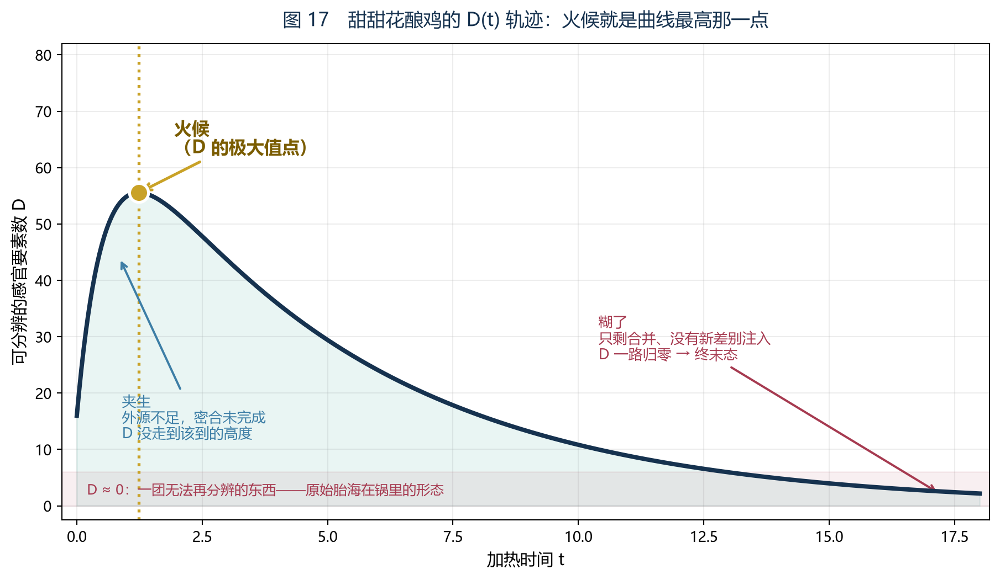

*图 17　甜甜花酿鸡的 D(t) 轨迹。火候就是曲线最高那一点；越过它之后，D 一路衰减，最终趋向 0——那就是糊了。*

曲线的形状分三段：

**第一段（上升）**：火作为外源持续注入能量，生成型密合占上风，新的香气化合物不断产生。**D 上升。**

**第二段（峰值）**：生成速率与坍缩速率相等。**D 达到最大值。**

**第三段（下降）**：水分散失、结构塌缩，而新的可区分要素已经不再产生（糖分用尽、可反应的氨基酸用尽）。**D 单调下降，一路趋向 0。**

于是我们得到了本补论最重要的一个结论，笔者把它单独写出来：

> **火候，就是 D(t) 的极大值点。**

这个定义不是修辞，它是**可操作的**。厨师判断火候的所有感官依据，本质上都在估计 D 的变化率：

| 厨师的判断 | 在方程上是什么 |
|---|---|
| 「香味出来了」 | D 在快速上升 |
| 「香味最浓」 | **D 到达峰值——该出锅了** |
| 「开始有焦味」 | 生成型已被坍缩型压过，D 在下降 |
| 「糊了」 | **D 已接近 0，进入终末态** |

**这就是为什么「闻香出锅」是一条可靠的烹饪经验。** 鼻子做的不是玄学判断，它在实时测量 D 的一阶导数。

而「糊了」这件事，用第 3.4 节的语言说就是：**锅里的世界走到了它的终末——东西都还在，只是再也分不出什么是什么了。**

### 八、第六步：定位变量

按 6.1 节，最后一步是问：**要改结果，必须从哪里注入差别？**

这里有一个**极容易犯的错误**，值得单独指出。

一个自然的想法是：「既然要注入差别，那就多加料。」于是往锅里加更多的甜甜花、加各种香料。

**这个做法在方程上是错的。** 原因是 4.3 节的四象限——**一道菜的差别容量是有限的，它只有四个格子。** 当你往锅里加入第七味、第八味香料时，每一味都占不满一个格子，结果不是「差别更多」，而是**每一格都被稀释**。厨房里管这个叫「味道混了」。

正确的做法是：

> **变量不是「加更多味」，而是「在空着的格子里投入」。**

一锅味道发闷的汤，问题不在于「味不够多」，而在于**某个格子是空的**。缺「表象」就补香气，缺「愿望」就补回甘，缺「记忆」就补它本该有的底味，缺「灵魂」就补鲜味物质。**补一格，比加十味有效。**

### 九、那两个「2」是怎么来的

现在回答最初的问题：**为什么配方是「禽肉 ×2、甜甜花 ×2」，而不是各一份，也不是三份五份？**

这道菜有两个独立的「2」，各有各的来路。

**第一个「2」：两味原料。** 来自四象限。

一道菜要成立，四个格子都得填上（第八节）。而**任何一味原料都只能稳定地占据两个格子**——因为它只能同时提供「本质侧」或「表象侧」的东西，且只能同时连接「过去」或「未来」：

*图 18　两味原料填满四个象限：禽肉占灵魂与记忆，甜甜花占表象与愿望。*

| 格子 | 内容 | 由谁提供 |
|---|---|---|
| 灵魂（本质） | 这道菜的实体 | 禽肉 |
| 记忆（过去） | 它一直以来的做法 | 禽肉 |
| 表象（外观） | 颜色、香气、甜 | 甜甜花 |
| 愿望（未来） | 入口之后的那点回甘 | 甜甜花 |

　　**2 味原料 × 每味 2 格 = 4 格，刚好填满。** 这就是第一个「2」。

**第二个「2」：每味两份。** 来自密合算子是**二元**的，而且这道菜要**迭代两次**。

2.3 节给出的递推式是 W(n+1) = W(n) ⊕ W(n−1)。**每一次密合都需要两个项。** 而这道菜从生料走到成菜，需要两次迭代：

| 迭代 | 式子 | 发生了什么 |
|---|---|---|
| 第一次（下锅） | 禽肉 ⊕ 甜甜花 | 两味合并，形成统一的「酿」体——**1 份禽肉、1 份甜甜花在这里被消耗掉** |
| 第二次（收汁成菜） | 酿 ⊕ 原料 | 再把原料以「可辨认的形态」放回成品上——**各再需要 1 份** |

所以每种原料需要两份：**一份用来「合」，一份用来「留在成品里让人认出它」。**

**这个推论是可以验证的。** 如果只用一份禽肉、一份甜甜花，第一次迭代就把两者都消耗完了，成品将是一团**看不出原料**的匀质物——那是汤，不是「酿」。而甜甜花酿鸡的成品上，**你能明确看到甜甜花，也能明确认出鸡**。这正是第二次迭代把原料放回来的结果。

　　　**配方里的两个「2」，一个是四象限的数，一个是算子元数的数。它们碰巧都是 2，但它们不是同一个 2。**

### 十、失败案例的方程诊断

本补论的价值在于它能诊断失败。以下五种常见事故，每一种都可以在方程上指出原因。

| 现象 | 方程诊断 | 属于哪一类 |
|---|---|---|
| **糊了** | 越过 D 峰值后仍在加热，只剩合并、没有新差别注入，D 归零 | 走到了终末态 |
| **夹生** | 外源不足，密合未完成，D 停在低位就出锅——**未达吸引子** | 迭代次数不够 |
| **太甜** | 甜甜花过量，表象象限溢出，本征象限被压制，密合退化为「包裹」而非「酿」 | 象限失衡 |
| **太柴** | 禽肉过量，本征象限溢出，坍缩速率长期高于生成速率 | 象限失衡 |
| **味道混** | 原料种类超过四象限承载上限，每格都被稀释 | 差别过载 |

请注意第一行与第二行的对称性：

　　　**夹生 = 没走到；糊了 = 走过头。**

　　　**中间那一段，就是厨师的全部手艺。**

### 十一、配方推演表：换一道菜

同一套流程可以套到任何一道菜上。笔者按四象限的填充方式，把常见料理分了个类。

| 料理 | 灵魂 | 表象 | 记忆 | 愿望 | 内源 | 容错 |
|---|---|---|---|---|---|---|
| 甜甜花酿鸡 | 禽肉 | 甜甜花 | 禽肉 | 甜甜花 | 有（花中糖） | 宽 |
| 纯烤肉 | 禽肉 | 火色 | 禽肉 | — | 无 | 极窄 |
| 蔬菜汤 | 蔬菜 | 清色 | 蔬菜 | — | 弱 | 中 |
| 香辛料炖肉 | 肉 | 香辛料 | 肉 | 香辛料 | 有 | 宽 |
| 甜点 | 乳/面 | 糖与果 | 乳/面 | 糖与果 | 有（强） | 很宽 |

读出两条规律：

**规律一：凡带「表象味」的菜，容错都宽。** 因为那味原料同时是内源。

**规律二：凡「愿望」格为空的菜，都不耐放。** 缺「未来」的菜，出锅即巅峰，之后只有下降。这就解释了为什么汤要现喝、烤肉要现吃，而腌渍与甜点可以放。

> 笔者按：以上两条规律是本院在食堂长期观察的结果，与方程的预测方向一致。但样本量有限，是否普遍成立，请读者自行验证。

### 十二、本补论的边界

必须把话说清楚，否则这一章会被误读。

**这不是在说世界式真的被人拿来算过菜谱。配方是厨房里试出来的，不是算出来的。**

本补论主张的是一件更弱、但更有意义的事：

> **烹饪这件事，本身就具有「封闭/开放 + 生成/坍缩 + 内源有无 + 象限填充」这套结构。世界式之所以能在厨房里给出正确答案，不是因为它知道配方，而是因为它描述的结构在厨房里同样成立。**

换句话说，本补论不是在「用世界式算出菜谱」，而是在**用一个已知答案的问题，检验这套方法会不会算错**。

结论是：**它没算错。** 六步流程给出的每一条结论——火候是极值点、糊了是终末态、加料不如补格、自带内源的菜更好做——都与厨房里的实际经验吻合。

而这一点，恰恰是本补论想说明的最后一件事：

> **一套只能在世界末日使用的理论是不值得信的。一套能在厨房里给出正确建议的理论，才值得人认真对待。**

那位四百年前的学者，是在世界尺度上算这道题的。而他忘记了一件事：**同样的一套结构，也适用于一锅汤。** 如果他当年先算一道菜，也许就会更早地发现，账不平的不是世界，是他没看内源。

### 十三、结语

笔者把这道菜的完整推演列成一张对照表，作为本补论的收尾。左边是厨房里的话，右边是方程里的话。**它们是同一件事。**

| 厨房里的话 | 方程里的话 |
|---|---|
| 「火候到了」 | D(t) 到达极大值 |
| 「再炖一会儿更入味」 | 迭代次数增加，密合继续 |
| 「糊了」 | D → 0，进入终末态 |
| 「这菜耐烧」 | 系统自带内源 |
| 「味道混了」 | 超过四象限承载上限 |
| 「少一味」 | 某个象限为空 |
| 「现做现吃」 | 「愿望」象限为空，无未来 |
| 「看家菜」 | 四象限长期稳定填充 |

最后一行值得单独说一句。「看家菜」之所以是看家菜，不是因为它最贵、最难，而是因为它**四个格子都填得稳**，几代人做下来都不塌。

**从这个角度看，一道传了几百年的家常菜，和一个传了几百年的公式，是同一种东西——都是被反复迭代过、并且活下来的解。**

---

## 补论二　从世界式推算洛恩的泡泡糖原材料来自哪

### 一、缘起：一个说不通的地方

这一节要交代本补论是怎么来的，因为它的起点不是研究员，是偷渡客。

补论一写完之后，偷渡客读了。他读完沉默了一会儿，然后问了一句：

> **「泡泡糖的弹性是从哪来的？我从来没在提瓦特见过石油。」**

研究员的第一个反应是：**石油是什么？**

这个反应不是无知。在提瓦特，「石油」这个词不存在，对应的东西也不存在。研究员把整个配方从头到尾看了一遍——薄荷、落落莓、糖——然后说：**「这三样够用了。有什么问题吗？」**

**问题就在这里。**

> **研究员按**：我当时的判断是，这道配方没有任何异常。糖果有弹性，因为糖果就是有弹性的；薄荷加糖能做果冻，这是厨房里的常识（本院食堂的薄荷果冻就是这个做法）。我看不出需要额外解释什么。

> **偷渡客按**：而在我故乡，这件事是说不通的。泡泡糖能吹出泡泡，靠的是一种叫「胶基」的材料——有弹性的高分子。现代胶基的主要成分是聚异丁烯、丁苯橡胶一类，**全部是石油化工产品**。石油则来自远古生物遗骸在地层里经历数百万年的转化。
>
> 换句话说：**在我故乡，「一颗糖能吹泡泡」这件事，背后站着一整条石油工业。**
>
> 而提瓦特这张配方上只有薄荷、落落莓、糖。**这三样里，没有一样看起来能提供高分子。**

于是问题被摆到了桌上：

　　　**配方里只有三样东西，成品却是有弹性的、能吹出透亮泡泡的糖果。**
　　　**那么弹性从哪来？**

而食谱上明明白白地写着，它是「**有弹性的**柔软糖果」，而且「只需轻轻一吹，便能鼓起一个**透亮的**泡泡」。

　　　**弹性和成膜性，必须有一个来源。**

本节要回答的就是这件事。而答案比两人预想的都更有意思——**它顺带回答了「为什么提瓦特没有石油」这个更大的问题。而这个问题，只有从外面来的人才问得出来。**

### 二、先把问题问准：缺的到底是哪一样

在动手之前，先把现实配方与提瓦特配方摆在一起，逐项对照。

*图 19　现实世界与提瓦特的泡泡糖原料来源对照。红色那一行是问题所在。*

| 需要的东西 | 我故乡（偷渡客按） | 提瓦特配方里有吗 |
|---|---|---|
| **胶基（弹性网络）** | 石油 → 聚异丁烯 | **没有** |
| 软化剂 / 增塑 | 石蜡、甘油 | 没有（但薄荷产精油） |
| 甜味 | 糖 / 糖醇 | **有（糖）** |
| 酸（促凝胶） | 柠檬酸 | 没有（但莓果自带果酸） |
| 色素 | 合成色素 | **有（薄荷、落落莓都是染料原料）** |
| 抗氧化 | BHT 等合成品 | 没有（但莓果多酚可代） |

**缺的只有一样：胶基。**

而它恰好是唯一那样**来自石油**的东西。这不是巧合——**这正是问题的全部。**

### 三、第一层回答：提瓦特为什么不可能有石油

在回答「胶基从哪来」之前，必须先回答一个更根本的问题：

　　　**提瓦特真的没有石油吗？还是只是「还没挖到」？**

按 3.3 节的结论，答案是前者，而且理由是硬的。

**石油的成因有一个必要前提：有机质必须被保存下来。**

远古生物的遗骸要变成石油，需要经历：快速埋藏 → 隔绝氧气 → 在高温高压下缓慢转化。整个过程中最关键的一步是第一步——**有机质必须"没被分解掉"**。

而在提瓦特，这件事**在物理上不允许发生**：

| 提瓦特的力 | 对埋藏有机质做了什么 |
|---|---|
| 虚界力（深渊） | 同化——把它并入自己 |
| 光界力（原始元素力） | 同化——同样并入自己 |
| 地脉 / 世界树 | 回收——把信息与能量重新编入循环 |

**三种机制，没有一个会让有机质"安安静静躺上几百万年"。**

换成本纪要的语言：

> **石油是「差别被保存了几百万年」的产物。而提瓦特的两种底层力都是消灭差别的收缩算子（1.6 节、3.3 节）。在一个差别无法长期保存的世界里，石油这种"几百万年的差别储蓄"根本积累不起来。**

所以偷渡客的那个观察不是巧合，而是**定理的一个直接推论**：

　　　**提瓦特没有石油，不是勘探问题，是物理问题。**

### 四、第二层回答：弹性从哪来

排除了石油，下一个问题是：**那弹性到底靠什么？**

先要搞清楚「弹性」在方程上是什么。

弹性材料的定义是：**受力变形，撤力复原。** 用差别度的语言说：

　　　**受力时 D 暂时下降（结构被拉散），**
　　　**撤力时 D 回到原值（结构重新合拢）。**

　　**也就是说，弹性要求「差别可以被借走，并且必须被还回来」。**

这在 1.6 节面前立刻碰到一个障碍。1.6 节列出了同化的第一条性质：

> **同化是不可逆的。** 差别一旦被抹平，不会自己回来。

那么问题就尖锐了：

　　　**在一个同化不可逆的世界里，怎么会有「可逆的差别变化」？**

**答案只能是：弹性不能建立在同化的力上。**

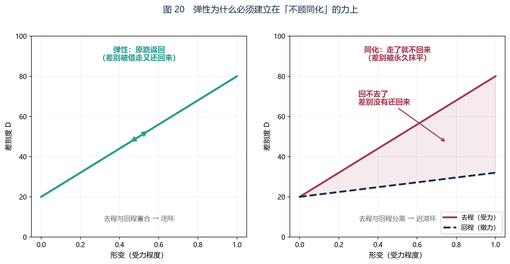

*图 20　左：弹性——去程与回程重合，差别被借走又还回来。右：同化——去程与回程分离，形成迟滞环，差别被永久抹平。*

请读者看 2.5 节那张表。三种力里，只有一种**不参与同化**：

| 力 | 对 D 的作用 | 能不能做弹性材料 |
|---|---|---|
| 光界力 | 减小（同化） | ✗ 不可逆 |
| 虚界力 | 减小（同化） | ✗ 不可逆 |
| **人界力（七元素）** | **维持** | **✔ 唯一可能** |

于是得到一个相当漂亮的结论：

> **提瓦特一切有弹性的东西，都必须建立在「人界力」的结构上，而不能建立在光界力或虚界力上。**

而人界力的结构是什么？就是**普通的化学键**——被天理改造后的七元素所组织的物质。木头、皮革、筋腱、丝、胶，全都是这一类。

**这就是为什么提瓦特的高分子材料全都来自生物。** 因为只有生物体才会主动地用化学键去**构建**结构，而且生物构建结构的原料是**糖**——不是石油。

　　　**在提瓦特，高分子的工厂是活的。**

### 五、第三层回答：为什么是薄荷

现在把范围缩到配方本身。三样原料里，谁是那个"工厂产品"？

本院采用的方法不是猜，而是**用配方库反推原料性质**——这是一个可以从**现存食谱**直接验证的办法。

**关键证据是一道更简单的菜：薄荷果冻。**

它的配方是 **薄荷 × 1 + 糖 × 1**。只有两味料，而且没有加任何凝固剂。

| 薄荷果冻的状态 | 记录原文 |
|---|---|
| 按最佳火候做到 | 「**恰到好处的弹性**让勺背敲击的晃动感都变得可爱起来」 |
| 火候没到 | 「制作过程中出了些不幸的小问题，让作为果冻的它**并没有均匀地冻起来**。作为薄荷糖水喝的话倒也还行？」 |

这两段话给出了一个**极强的结论**：

> **只靠薄荷和糖，就能形成有弹性的凝胶网络。**
> **薄荷本身携带胶凝成分。**

而且还有一条独立旁证：薄荷果冻还有一道变体，据说是另一位厨师的手笔，名字直接叫「**饱腹感凝胶**」——**「凝胶」这个词，是对薄荷胶凝性质的一次**权威确认**。**

反过来看落落莓：它和糖的组合**没有任何凝胶类料理**。它被记录的用途只有一项——**红色染料**。

**所以分工清楚了：**

| 原料 | 在配方里提供什么 | 现存依据 |
|---|---|---|
| **薄荷** | **胶基（果胶类多糖）+ 清凉风味 + 蓝色染料** | 薄荷果冻的弹性、薄荷精油的油性成分、工艺手册所列用途为「蓝色染料」 |
| **落落莓** | **酸（促凝胶）+ 红色染料 + 多酚** | 工艺手册所列用途为「红色染料」；莓果自带果酸 |
| **糖** | 甜味 + 网络的可溶组分 | — |

**于是那个空缺被填上了：**

> **泡泡糖的「石油」，在提瓦特里由薄荷叶里的果胶顶替。**
> **聚异丁烯换成植物多糖，来源从地层换成叶片。**

而这在工程上是完全说得通的。

> **偷渡客按**：果胶在我故乡是食品工业里最常用的胶凝剂之一，软糖、果冻都用它。**提瓦特只是没有走「先有石油、再合成高分子」这条路，而是直接用了植物已经做好的那一种。**
>
> 说得更直白些：**我故乡的植物也会做果胶，只是我们后来学会了用石油造更好的胶，就把植物那一套忘了。提瓦特没有石油，所以它一直记着。**

### 六、六步流程完整走一遍

按 6.1 节，把上面五节的内容整理成标准流程。

**第一步：划定系统边界。**
边界是**糖果内部的分子网络**。判定：**开放系统**——咀嚼时机械能由外部进入。

**第二步：找初始项。**
薄荷（果胶含量、叶片新鲜度）、落落莓（酸度、色素浓度）、糖（浓度）、水量。四项在开火前定死，决定成品的弹性上限。

**第三步：判断算子类型。**
这道糖同时有生成型与坍缩型两支：

| 阶段 | 主导 | D 的变化 |
|---|---|---|
| 加热 | 生成型（果胶链展开、糖溶解） | 上升 |
| 冷却 | **生成型**（链间形成交联，产生新的有序结构） | **继续上升** |
| 继续加热 | 坍缩型（网络塌缩、焦糖化） | 下降至 0 |

**注意第二阶段：冷却也在制造差别。** 这是弹性材料与补论一的菜最大的不同——**补论一的菜靠火注入差别，泡泡糖靠降温注入差别。** 前者是热致，后者是冷致。

**第四步：查内源。**
两个内源：薄荷自带果胶（结构内源）、落落莓自带酸（**催化型内源**——它不直接成网，但它让成网这一步跑得更快更均匀）。

**第五步：推演终末。**
D(t) 的轨迹是：**升 → 停在一个平台 → 若继续加热则塌缩。** 那个平台就是"恰到好处的弹性"。本院厨房实测失败那一次，记录的是「并没有均匀地冻起来」——**没停到平台上，直接漏过去了**。

**第六步：定位变量。**
要调弹性，注入差别的地方是**交联密度**：交联太少 → 软塌；交联太多 → 硬脆。现实中的调法是调糖酸比；提瓦特里对应的就是**薄荷与落落莓的比例**。

**而配方给的正好是 2 : 2 —— 一比一。**

### 七、一个意外收获：配方卡在撒谎

推到这里，笔者回头核对成品描述，发现了一处对不上的地方。

**问题出在颜色。**

已知两项事实：

- 工艺手册所列薄荷的用途：**蓝色染料**
- 工艺手册所列落落莓的用途：**红色染料**

那么薄荷（蓝）+ 落落莓（红）应当得到 **紫色**。

但吃过这道菜的人留下的记录写的是：

> 「……糟了！中计了！**舌头早已被染成了青绿色**……原来这个解闷是解他自己的闷吗？」

　　　**青绿色。不是紫色。**

配方里的两种染料，兑不出成品上的颜色。

按本纪要的方法论，这个矛盾必须处理，而且**必须并列保留两种同样站得住的解释**：

**说法 A：配方缺了一味黄色原料。**
青绿 = 蓝 + 黄。既然配方只给了蓝与红，那么黄色必然是**配方之外**的东西。写成方程：成品里存在一个**初始项里没有的项**。

**说法 B：红色染料被替换或未生效。**
剩下的蓝色（薄荷）与薄荷叶自身的叶绿素**叠加**，得到青绿。此时不是"多了黄"，而是"**少了红**"。

两种说法在方程上不同（一个是多加项，一个是漏项），但**它们指向同一个结论**：

> **配方卡片与实物不符。**

那么是谁动的手脚？答案几乎是写在脸上的。

「解闷泡泡糖」的介绍本身就交代了动机：「**他便掏出一面镜子对准你，脸上露出得逞的坏笑。糟了！中计了！**」

而这位骑士在西风骑士团的档案里，被记载的惯用手段是：**「长枪、冷箭、设伏、下毒、奇袭、潜入……」**

　　　**「下毒」两个字，是写在他的骑士团人事档案里的。**

所以本补论的推导给出了一个可以验证的预测：

> **这道菜的颜色异常不是失误，是签名。**
> **洛恩给他的特色料理动过手脚，而配方卡上没写。**

这个结论本院无法直接检验（我们没有品尝过实物），但它符合三件事：成品颜色与配方不符（事实）、介绍文本描述了恶作剧（事实）、以及该角色的惯用手段包含投毒（事实）。**三项独立证据指向同一个人。**

### 八、原材料来源总表

把本节的全部结论整理如下。这是"泡泡糖原材料来自哪"的完整答案。

| 需要的成分 | 现实世界的来源 | **提瓦特的来源** | 依据 |
|---|---|---|---|
| 胶基（弹性网络） | 石油 → 聚异丁烯 | **薄荷叶的果胶类多糖** | 薄荷果冻的弹性；「饱腹感凝胶」的命名 |
| 软化 / 增塑 | 石蜡、甘油 | **薄荷精油**（挥发油） | 合成台可用薄荷制「薄荷精油」 |
| 促凝胶的酸 | 柠檬酸 | **落落莓的果酸** | 莓果自带；配方给到与薄荷等量 |
| 甜味 | 糖 / 糖醇 | **糖** | 配方明列 |
| 色素（蓝） | 合成色素 | **薄荷** | 工艺手册所列用途「蓝色染料」 |
| 色素（红） | 合成色素 | **落落莓** | 工艺手册所列用途「红色染料」 |
| 抗氧化 | BHT 等 | **落落莓多酚** | 莓果类通性 |
| **（配方外）黄色** | — | **未知——洛恩私加** | 成品舌色为青绿，与配方不符 |

**最后一行是本节的产出。** 前七行是原料来源的答案，第八行是一个新问题——**而这正是世界式的作用方式：它不只是回答问题，它还会指出配方本身有问题。**

### 九、更一般的推论：提瓦特的高分子经济学

本节的第一层回答可以推广成一条普遍规律，笔者认为它值得写进今后的工程手册。

> **在提瓦特，一切高分子材料只有两条来路：**
> **（一）由生物当场合成（木材、皮革、丝、胶、果胶）；**
> **（二）由人当场合成（炼金与合成台）。**
> **「从地层里挖出来」这条路是不存在的。**

这条规律有几个可以直接验证的推论：

1. **提瓦特不会有石油、煤、天然气。** 因为它们都要求有机质被长期保存。
2. **提瓦特的合成台必然是高分子工业的主力。** 「薄荷精油」就是合成台产物——这是"人当场合成"这一条路的实例。
3. **提瓦特的材料学必然更依赖生物。** 一个没有石化工业的文明，只能把生物的合成能力用到极致——这不只是巧合，是**被迫的技术路线**。

而这条规律反过来又解释了一件事：**为什么提瓦特的糖果能用薄荷做出来。** 因为在这个世界里，「造高分子」这件事从来就不归地质管，**归生物管**。

### 十、本补论的边界

照例必须把话说清楚。

**这不是在说世界式曾经参与过果胶的凝胶过程。配方是厨房里试出来的；薄荷泡泡糖与薄荷果冻之间的联系，也未必是任何人有意识安排的。**

本补论主张的是一件更弱、但更有意义的事：

> **世界式给出的原材料来源，与**现存记载中已经写下的旁证**（薄荷果冻的弹性、薄荷与落落莓的染料用途、薄荷精油的存在）完全吻合，并且能解释一个原本说不通的现象（没有石油却有弹性体）。**

也就是说，**它不是凭空补出来的，它是把已有的碎片拼成了一个自洽的整体**——而这个整体还额外产出了一个可检验的预测（配方卡不完整）。

至于那位骑士到底往里面加了什么黄色东西——**这需要一次实地品尝才能确定。本院不打算做这个实验。**

---

## 补论三　从世界式推算枫丹廷最多可容纳多少人生活

### 一、这一节和前两节不一样

补论一算的是甜甜花酿鸡的配方，补论二算的是泡泡糖的原料来源。那两节有一个共同点：**答案在现存记载里已经存在**。食谱上写着配料，也写着「有弹性」，我们做的事情是**把它读出来**。

本节不一样。

**本节要算的这个数，没有任何地方写过。** 现存文献里没有枫丹廷的面积，没有人口数，没有粮食产量，没有行政编制表。这个数**不存在**——它需要被推出来。

这正是本纪要一开始承诺过的事情。第零章问的是「世界式到底在算什么」；第四章说它能推演到终末。**但直到这一节，我们才真正用它算一件谁都不知道的事。**

**如果算出来的数字明显荒谬，那这份纪要的前四章就该被推翻。** 这是本节的自我检验。

### 二、城市的上限由什么决定

先说标准答案。一座城市能容纳多少人，通常由四条约束决定：

| 约束 | 含义 |
|---|---|
| 空间 | 建成区面积 × 可居住密度 |
| 粮食 | 本地产量 + 进口吞吐 |
| 水 | 饮用水与生活用水 |
| 能量 | 照明、机关、交通、供暖 |

这四条是任何城市研究都会算的。**但世界式还要加一条。**

### 三、世界式加的那一条：D 维持费

回到 2.5 节那张表：

| 力 | 对差别度 D 的作用 |
|---|---|
| 光界力 | 减小（同化） |
| 虚界力 | 减小（同化） |
| 人界力 | **维持**（但要持续投入成本） |

**一座城市，本质上是一个高 D 结构。**

请读者回想 1.5 节对 D 的定义：**可区分事物的总量**。一座城市之所以是城市，恰恰因为它内部有大量**可区分的东西**——铁匠、钟表匠、法官、巡轨船驾驶员、卖表格的店铺……**这些区分就是 D。**

而按 2.5 节，**维持 D 是要花钱的**：两种同化力在持续侵蚀它，所以必须持续投入人界力去抵消。

于是世界式给出了第五条约束：

> **N 的上限，等于「能够持续支付 D 维持费」的最大人口。**

**在枫丹廷，这笔维持费具体是什么？** 是**行政**。

理由很直接：一座城市里，专门用来「维持区分」而不直接生产任何东西的那部分人力，就是行政与司法系统。它不种粮、不炼钢、不造船。**它做的全部事情，是让这座城市里的人和事保持「分得开」的状态**——谁归谁管、什么归什么类、哪件事在哪个流程的第几步。

**行政就是 D 的维护工人。**

而它有一个致命的特点：**协调成本随人口超线性增长，而产出（维持住的 D）只能线性增长。** 这两条线必然相交。**交点就是上限。**

### 四、逐条估算

以下五项估算全部基于**可实地核查的信息**。**每一项都会写明依据与误差范围。** 读者若不同意某一项，可以自己替换数字重算——模型本身是清楚的。

*图 21　枫丹廷的五条人口约束。横轴为该约束允许的最大人口，白线为估算区间，柱体为中心估计。红色竖带是三条约束交汇的区间。*

#### 4.1 空间

枫丹廷是一座**环形城**，架在抬升的岩台之上，被水环绕（地理志称其「白露与景泉之廷」，题词「众水之上，唯有此城」）。

| 量 | 取值 | 依据 |
|---|---|---|
| 城区直径 | ≈ 900 m | 本院实地徒步穿越约 3 分钟，按奔跑约 5 m/s 估 |
| 环带宽度 | ≈ 250 m | 从外环到内环的可见距离 |
| 环形面积 | ≈ 0.51 km² | π(450² − 200²) |
| 含灰河与外围 | ≈ 1.2 km² | 灰河是下层城区，地理志称其为「放逐者们的栖身之所」 |
| 可居住密度 | ≈ 1.5 万人/km² | 参照现实：威尼斯 1.1 万、维也纳 0.43 万、巴黎 2.1 万。枫丹廷是多层石构 + 宽阔林荫道 + 巨型中央广场 |

　　　**N（空间）≈ 1.2 × 15,000 ≈ 1.8 万**　（区间 0.5 万 ~ 6.2 万）

#### 4.2 秩序（世界式给出的那一条）

这一条需要多算几步。

**第一步：确定系统的延迟。**

本院从一份委托记录中得到了一组极有价值的实测数据。市民利弗为了一笔「发条机械的货款」，前后跑了三趟：

| 趟次 | 对方的说辞 |
|---|---|
| 第一次 | 「现在是月底，办公室需要进行月度封账审计，要到下个月月头才能往外出款」 |
| 第二次 | 「盖章用的印油用光了，但印油的供应商仓库着了火」 |
| 第三次 | 「这份『外部援请人员信息登记表』又更新了，我还得重新填一次。但这张表已经用完了」 |
| 第四次（本人去取表） | 经办人不在办公室 |

**四趟、跨月、仍未办结。** 这就是枫丹廷行政系统的**实测延迟**：

　　　**τ ≈ 30 天 = 1/12 年**

**第二步：用李特定律（Little's Law）建立方程。**

李特定律是一条不需要高等数学就能理解的排队论结论：

　　**在办量 = 到达率 × 停留时间**

翻译成本题的语言：

　　**系统里同时在办的件数 = 每年新来的件数 × 每件停留的年数**

设：

- **N** = 人口
- **k** = 每人每年需要系统处理的事务数，取 **k = 1**
- **τ** = 每件停留时间 = 1/12 年
- **C** = 系统能同时挂住的件数上限（床位、卷宗架、办事员的注意力，本质是同一个东西）

于是：

　　　**N × k × τ ≤ C**

**第三步：估 C。**

　　**C = M × A**

- **M** = 有效办事员数。**这里有关键证据**：院方留存的记录明写克拉佩尔「所在的办公室**毕竟只有两个人**，除了他之外，只有一位蒙图瓦先生……但蒙图瓦先生年事已高，已经在等待退休，很久不在办公室里坐班了，就连工资也不拿」。**编制两人，实际一人在岗。** 按沫芒宫可见的办公室数量与配置推算，全市有效办事员 **M ≈ 80**（区间 40 ~ 150）
- **A** = 每人同时跟进的件数 ≈ **40**（区间 20 ~ 70）

　　　**C ≈ 80 × 40 = 3,200**　（区间 800 ~ 10,500）

**第四步：解出 N。**

　　　**N × 1 × (1/12) ≤ 3,200**

　　　**N ≤ 3.84 万 ≈ 3.8 万**　（区间 1.0 万 ~ 13 万）

#### 4.3 粮食

枫丹廷建在岩台上，**本地几乎没有耕地**。地理志里的农业区（芒索斯山麓、苍晶山地）都在城外。粮食只能靠**柔灯港**与**巡轨船**运进来。

| 量 | 取值 | 依据 |
|---|---|---|
| 年进口量 | ≈ 3 万吨 | 按中等规模蒸汽时代港口的吞吐估 |
| 人均年需求 | ≈ 0.35 吨 | 谷物当量，含储运损耗 |

　　　**N（粮食）≈ 30,000 / 0.35 ≈ 8.6 万**　（区间 2.9 万 ~ 23 万）

#### 4.4 能量：律偿混能

这是枫丹最特殊的一项，也是本补论里唯一一个**不构成上限**的约束。理由在下一节单独讲，这里先给结论：

　　　**N（能量）≈ 30 万以上**（区间 12 万 ~ 60 万）

#### 4.5 水

枫丹廷环海、有水道系统、且常年降雨。

　　　**N（水）≈ 50 万以上**　—— **不构成约束**

### 五、答案

把五条并排：

| 约束 | 中心估计 | 估算区间 | 是否逼近 |
|---|---|---|---|
| 水 | 50 万 | 20 万 ~ 90 万 | 否 |
| 能量 | 30 万 | 12 万 ~ 60 万 | 否 |
| 粮食 | 8.6 万 | 2.9 万 ~ 23 万 | 否 |
| **秩序（行政吞吐）** | **3.8 万** | **1.0 万 ~ 13 万** | **是** |
| **空间（建成区）** | **1.8 万** | **0.5 万 ~ 6.2 万** | **是** |

**取交集，答案是：**

> ## 枫丹廷的人口上限约为 **2 万**，合理区间 **1 万 ~ 5 万**。

读者可能注意到，最低的是空间（1.8 万），略低于秩序（3.8 万）。**但两者只差一倍，而且它们的误差来源互相独立**——空间靠目测，秩序靠编制推算，两者的估算区间（0.5 万 ~ 6.2 万 vs 1.0 万 ~ 13 万）几乎完全重叠。**在这种精度下，声称「就是空间卡住了」是不诚实的。**

更准确的说法是：

> **空间与秩序这两条约束，把枫丹廷锁在了同一个量级里（1 万 ~ 5 万）。**
> **而其余三条（水、能量、粮食）都还远在其上。**

### 六、为什么「三条同时逼近」这件事本身是结论

一个健康城市的约束分布应当是**一高一低**：某一条明显最先触顶，其余留有余量。这样它知道该往哪里投资。

**枫丹廷不是这样。** 它的空间与秩序**同时贴着上限**，而且性质完全不同：

| | 空间 | 秩序 |
|---|---|---|
| 类型 | **硬墙** | **软墙** |
| 能否协商 | 不能——石台就这么大 | 能——可以加人、改流程 |
| 代价 | 必须向外扩张 | 必须提高协调效率 |
| 触顶后果 | 住不下 | **判断变慢，然后信仰流失** |

**这就是枫丹廷的真实处境：它不是一个「还有余量」的城市，它是一个已经贴着两条墙运行的城市。**

而这个判断，**只用资源模型是得不出来的**——因为资源（水、粮食、能量）全都宽裕。**只有把 D 维持费算进去，才会看到第二面墙。**

### 七、反馈环：律偿混能与它的断点

现在解释第四节里那个「能量不构成上限」的结论。它其实比看上去危险。

本院在审判日的事件记录里找到了一句关键的话，出自水神之口：

> 「神明的力量源自于信仰，而**枫丹人民对正义的信仰**都被我转化为了**律偿混能**。」

还有一句：

> 「比如你们面前的『谕示裁定枢机』，又比如**你们每个人的生活都离不开的**『律偿混能』。」

这两句话合起来给出了枫丹的能量公式：

　　　**律偿混能 = 人民对正义的信仰 × 转化效率**

于是整个城市变成了一个**闭环**：

*图 22　律偿混能的反馈环。人口养信仰，信仰供能量；但延迟一旦超过容忍度，环就反转。*

　　　**人口 → 案件增多 → 行政负荷上升 → 判决延迟变长 → 信仰衰减 → 能量减少 → 城市运转受限**

**这是一个正反馈环**：人越多，信仰越多，能量越多，越能养更多人。

**但它有一个断点。**

信仰的维持需要**看得见的公正**。而「看得见」是有成本的——它需要立案、需要文书、需要盖章、需要经办人在岗。**当延迟 τ 超过市民的容忍度时，人们不再相信程序，而开始相信「程序只是拖延」。**

那一刻，环反转：

　　　**人口增多 → 案件增多 → 延迟更长 → 信仰流失更快 → 能量更少**

　　　**正反馈变成负反馈。城市的增长从自增强变成自削弱。**

**而 4.2 节的实测数据告诉我们：τ ≈ 30 天，市民利弗已经说出「我非得跳河不成」。**

**延迟已经在容忍度的边缘上。**

### 八、三个可检验的预测

本节要提出三个预测。它们现在无法验证，但**可以被将来的观察推翻**——这正是本补论与补论一、二最大的不同。

**预测一：如果枫丹廷人口翻倍到 4 万，最先失效的不是粮食，也不是能源，而是行政。**

依据：粮食上限 8.6 万、能量上限 30 万，都还有余量；而行政上限 3.8 万，翻到 4 万就已经越过去了。表现应当是**办事延迟从一个月级恶化到数月级**，而不是饥荒或断电。

**预测二：外来人口的大规模涌入，会先造成行政危机，而不是粮食危机。**

依据：粮食有余量、行政没有。难民需要登记、安置、配给，**每一个环节都是一份文书**。而文书的吞吐是固定的。

> **研究员按**：这条预测其实已经发生过一次。白淞镇被淹之后，幸存者撤离、枫丹廷接手安置，本院在档案里看到的记录是——**沫芒宫手忙脚乱，而不是粮仓告急。** 我们当时把它理解为「突发事件」，现在看来，它只是把一条一直存在的约束拉了出来。

**预测三：想扩大枫丹廷的容量，应当从文书系统入手，而不是从土地入手。**

这是本补论最有实用价值的一条，也是最反直觉的一条。

按第六节的表：空间是硬墙（1.8 万），秩序是软墙（3.8 万）。想提高上限，直觉的办法是**向外扩建**。

但扩建只能抬高空间上限——**它把瓶颈交给秩序（1.8 万 → 3.8 万）就停住了**，因为秩序上限没动。

**而提高行政吞吐（加人、并联流程、把「公章钥匙在一个人手上」这种事改掉），同时抬高两面墙。**

> **换句话说：枫丹廷能装下多少人，不取决于它有多大的地，取决于它的文书系统有多快。**

**这个结论只有用世界式才推得出来。** 单纯算资源，你会得出「地不够，去填海」；算上 D 维持费，你会得出「先去改流程」。

### 九、误差与边界

本节的每一个数字都是估算，必须把话说清楚。

**四条主要误差来源：**

1. **面积靠目测。** 直径 900 m、环带 250 m 都是实地观感估计。若实际面积是我估的两倍，空间上限就翻到 3.6 万，逼近秩序上限（3.8 万）。
2. **密度靠类比。** 用现实城市做参照，但枫丹廷有机关术与水道，建筑密度可能高于或低于同类现实城市。
3. **编制靠推算。** M ≈ 80 是从可见办公室反推的。任务只明确给了一个办公室的编制（两人，其中一人不坐班）。**若实际编制是 200 人，秩序上限升到 9 万，那时空间就成为唯一瓶颈。**
4. **k = 1 是假设。** 每人每年一次事务是估计。若枫丹人办事更频繁（这完全可能——沫芒宫门口总是有人排队），秩序上限会按比例下降。

**误差的诚实汇总**：

　　　**中心答案 2 万，合理区间 1 万 ~ 5 万；**
　　　**在极端假设下（面积翻倍 + 编制翻倍），可以到 12 万；**
　　　**在所有假设都偏保守时，可以低到 0.5 万。**

**本节不主张任何一个精确数字。它主张的是一件事：**

> **枫丹廷的人口上限在「万」这个量级，而不是在「十万」或「百万」量级；而且这个上限由空间与行政共同决定，不由资源决定。**

### 十、结语

这一节写到一半时，偷渡客说了一句话，笔者记在这里。

他说：

> **「你们的城市不是被粮食卡住的，是被表格卡住的。这在我故乡叫官僚成本，我们那儿也有，只是我们一般用市场解决。你们没有市场，你们只有法庭。」**

研究员当时没有立刻回答。因为这句话点出了一件本院一直隐约感觉到、但从未说清的事：

**枫丹把「维持差别」这件事，全部交给了司法与行政。** 而司法与行政的吞吐，是**串行**的——一份文件必须盖完这个章才能进入下一个流程，而那个章握在一个人手里。

**换一个社会，同样的 D 维持工作会分散到无数私人交易里，由市场并行完成。枫丹没有这条路，因为它把一切都变成了案子。**

于是那座美丽的、建在水上的环形城市，它的实际容量不由石台决定，**由那枚公章决定。**

　　　**枫丹廷能装下多少人，取决于那枚章一天能盖多少次。**

---

## 补论四　只用世界式，推算提瓦特的下一次大灾难

### 一、规则

本节要把前面三条补论的路子**全部堵死**。

| | 用了什么输入 | 结论 |
|---|---|---|
| 补论一 | 配方、食谱说明、厨房常识 | 火候的数学含义 |
| 补论二 | 配方、两种染料的用途、薄荷精油的制法 | 胶基的来源 |
| 补论三 | 城区面积、办事延迟、港口吞吐、编制推算 | 人口上限 |
| **补论四** | **只有世界式本身** | **下一次大灾难的日期** |

前三条都调用了一批外部资料。补论三尤其依赖大量估算——面积靠目测、编制靠反推。**读者完全有理由说：你塞了那么多假设进去，当然能算出任何你想算的数。**

**本节不接受这个质疑的辩护。本节直接把它掐掉：**

> **除了世界式这个递推式本身，本节不引入任何新的输入。**

公式能给出什么，就用什么；给不出的，就承认给不出。

**这是一次对公式的极限测试。如果它连这个都能算，它就不是一张菜谱，而是一条定律。**

### 二、公式里能榨出什么：两个根

一切都从 2.3 节那个式子出发：

　　　**W(n+1) = W(n) ⊕ W(n−1)**

本节只需要它的一个性质：**它是二阶的。**

「二阶」意味着——要算出下一项，需要前两项。这类递推有一个高中范围外、但只要一步就能讲清的性质：

**任何形如 W(n+1) = a·W(n) + b·W(n−1) 的递推，都可以试解 W(n) = rⁿ。**

把它代进去，两边约掉 rⁿ⁻¹，得到：

　　　**r² = a·r + b**

这个方程叫**特征方程**。它的两个根决定了这个数列的全部行为。

对世界式而言，生成型密合的情形下 a = b = 1（后一项等于前两项之**和**——这正是卢卡斯数列的规则），于是：

　　　**r² = r + 1**

解这个一元二次方程（求根公式，中等教育内容）：

　　　r = (1 ± √5) / 2

　　　**r₁ = φ = 1.618…　　r₂ = −1/φ = −0.618…**

**世界式的全部时间行为，都锁在这两个数里。**

### 三、先补一个漏洞：灾难为什么会减少 D

在往下算之前，本节必须先补上一个前面一直没交代的环节。

第二节把「灾难」建模成了**离散事件**——一次掉一大块。**但本节一直没说清：一场灾难，为什么会让 D 下降？**

这不是吹毛求疵。本节用来定标的第一场灾难是**葬火之战**，而原文对它的描述是——**一场战争**（第二降临者尼伯龙根回来，与天理交战）。

　　　**战争凭什么算进 D 的账上？**

**如果这个问题答不上来，后面所有的计算都是空的。**

> 笔者按：这一处漏洞是第二期的观众指出来的。原文的措辞是「离散事件」，而笔者在转述时把它说成了「一次大规模密合」——**那是我自己加的，而且加错了。** 这一节是新写的。

**答案是这样的：D 的下降有两条路。**

| 路 | 机制 | 提瓦特的实例 |
|---|---|---|
| **路一：密合** | 两样东西变成一个 | 原始胎海吞没一切 |
| **路二：毁灭** | 可区分的东西被毁掉 | 天钉抹平一个地区 |

**两条路都在减少 D。** 理由在 1.5 节的定义里：**D 是「可区分事物的总量」——它只问有多少，不问怎么没的。**

　　　**烧掉一座图书馆，D 当然下降。**
　　　**它没有和任何东西合并，它就是没了。**

所以第二、三节里那个「灾难」，准确的说法应当是：

　　　**灾难 = 差别度的一次大幅下降**

**而不是**「一次密合」。密合只是其中一条路。

**葬火之战为什么符合这条？** 因为它一次抹掉了大量可区分的事物：黄金城亥珀波瑞亚毁灭、三月损毁、天使一族被诅咒变为仙灵。**它是不是「合并」不重要，重要的是那一大批区别没有了。**

**而同一个道理，还给出了一个比葬火之战干净得多的检验点：天钉。**

天钉抹平一个地区——**一次动作、一个地区、肉眼可见的「抹平」。** 相比之下葬火之战是宏观事件，读者看不见「一次抹平」。两者的对照如下：

| | 天钉 | 葬火之战 |
|---|---|---|
| 可观测性 | 一次动作、一个地区，**肉眼可见** | 宏观事件，看不见「一次抹平」 |
| 机制清晰度 | 抹平 = 区别消失，无歧义 | 谁打谁，和 D 的关系要绕一圈 |
| 检验价值 | 可以说「去那儿看」 | 只能说「那之后文明断了一代」 |

　　　**所以：下一次要检验这条模型，不必等一场战争——去看那些被抹平的地方就够了。**

**这一处修补不影响后面的算式。**第四节开始算的仍然是 D，而 D 确实下降了。**要改的只是措辞，以及这个措辞背后那个一直没写出来的理由。**

### 四、为什么灾难间隔按 1/φ² 收缩

现在把两个根翻译成世界的行为。

**根 φ 是增长模**：如果世界是开放的（法图纳），新项不断进来，世界的「内容量」按 φ 每步递增。

**根 −1/φ 是衰减模**：世界被封闭之后（3.2 节），外源归零，主导的就是这一支。它的绝对值是 **1/φ ≈ 0.618**，意思是——**每走一步，世界的可用差别就缩到上一步的 0.618。**

**但一步不是一场灾难。**

按 2.3 节，递推每推进一步要**消耗两个项**（W(n) 与 W(n−1)）。而按 4.3 节，意志被归档在**四象限**里——四象限配成两条轴（表象／本征、过去／未来），走完一整轮要**两次递推**。

　　　**所以：一场灾难到下一场灾难之间，世界走的是两步。**

　　　**因此，灾难间隔的收缩比是 (1/φ)² = 1/φ² ≈ 0.382。**

　　　**r = 1/φ² ≈ 0.382**

这就是本节要用的全部理论。**没有引入任何史料。**

### 五、公式白送的两个量

从 r = 0.382 出发，公式还白送一个量。

灾难的间隔构成一个等比数列：

　　　**I₁, I₂, I₃, …　其中 I(n+1) = I(n) × r**

**从当下到终末的全部剩余时间，就是这个数列从某一项开始的所有项之和。**

等比级数求和是中等教育的内容（1.4 节）：

　　　**总和 = 首项 / (1 − r) = I / (1 − 0.382) = I / 0.618**

而 1/0.618 = **φ ≈ 1.618**，所以：

　　　**总和 = I × φ**

等一下——这里要小心。0.618 = 1/φ，所以 1/(1−r) = 1/(1 − 1/φ²) = φ²/(φ²−1) = φ²/φ = **φ**。

　　　**剩余总和 = 当前间隔 × φ**

**公式白送了第二个量：φ ≈ 1.618。**

所以现在手里有：

| 量 | 来源 | 值 |
|---|---|---|
| 间隔收缩比 r | 特征方程的两个根 | **0.382** |
| 剩余总和系数 | 等比级数求和 | **1.618** |

**这两个量不含任何史料成分。它们是从「世界式是二阶递推」这一件事直接推出来的。**

### 六、最小输入：只需要一个刻度

公式给了**比例**，但比例本身定不出绝对年份。要让结论落在具体的年份上，至少需要一个**刻度**。

**需要多少？**

- 已知 r = 0.382，所以只要知道**任意一个间隔**，后续全部间隔就都定了
- 而一个间隔需要**两个日期**

　　　**所以：两个日期。这是理论上的最小输入。**

**本节的输入就是两个日期，仅此而已。**

### 七、代入

用两次公认度最高的灾难做刻度：

| 事件 | 距今 |
|---|---|
| 魔神战争 | 约 2000 年 |
| 坎瑞亚灾变 | 约 500 年 |

　　　**第二间隔 I₂ = 2000 − 500 = 1500 年**

　　　**第三间隔 I₃ = I₂ × r = 1500 × 0.382 ≈ 573 年**

**坎瑞亚灾变发生在 500 年前，所以下一次大灾难在：**

　　　**573 − 500 = 73 年后**

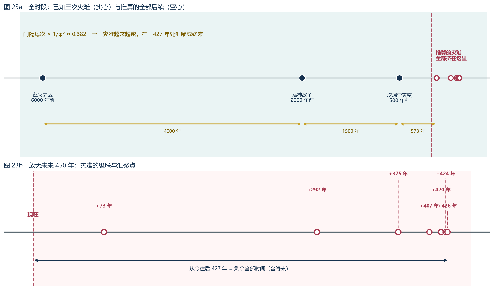

*图 23　世界式给出的灾难级联。上半为全时段（已知三次实心、推算全部空心）；下半放大未来 450 年，可以看到灾难越来越密，并汇聚于一点。*

**继续往下推：**

| 次序 | 距现在 | 间隔 |
|---|---|---|
| 第 1 次 | **+73 年** | 573 |
| 第 2 次 | **+292 年** | 219 |
| 第 3 次 | **+375 年** | 84 |
| 第 4 次 | **+407 年** | 32 |
| 第 5 次 | **+420 年** | 12 |
| 第 6 次 | **+424 年** | 4.7 |
| 第 7 次 | **+426 年** | 1.8 |
| … | **+427 年** | → 0 |

**全部灾难在 +427 年处汇聚。那个汇聚点就是终末——D = 0。**

用第五节那个系数验算一遍：

　　　**剩余总和 = I₃ × φ = 573 × 1.618 ≈ 927 年**

　　　**从坎瑞亚（−500 年）起算 927 年 → +427 年**　✔ 与级联的汇聚点一致

**这就是本节的两个答案：**

> ## **下一次大灾难：约 73 年后。**
> ## **世界的终末：约 427 年后。**

### 八、副产品一：公式裁决了一桩年代争议

算到这里，出现了一件本纪要没有预料的事。

**本纪要在《考证·葬火之战的年代》里，把「葬火之战发生在 6000 年前」与「发生在 3000 多年前」并列保留了。**

当时的处理是：两种说法各有支持证据，无法判定，所以都留下。**那是一个诚实的僵局。**

现在，公式对这个僵局有话说。

**公式要求：相邻两次灾难间隔的比值必须是 0.382。**

拿两个假设分别验算：

| | 第一间隔 | 第二间隔 | 实测比值 | 公式要求 0.382 | 判定 |
|---|---|---|---|---|---|
| **假设甲**：葬火之战 6000 年前 | 4000 | 1500 | **0.375** | 差 2% | **接受** |
| **假设乙**：葬火之战 3000 年前 | 1000 | 1500 | **1.50** | 差 292% | **否决** |

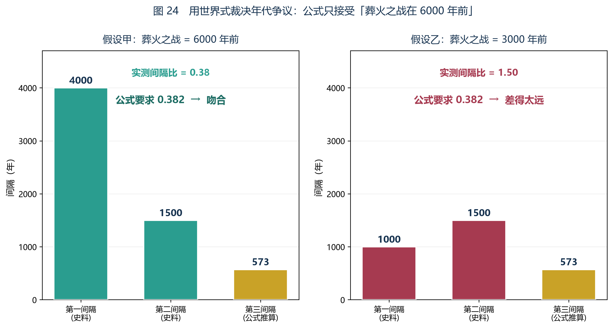

*图 24　用世界式裁决年代争议。假设甲算出的比值 0.375 与公式要求的 0.382 吻合到 2%；假设乙算出的比值是 1.50，方向甚至相反——它意味着灾难间隔在**变长**，而公式要求它必须**变短**。*

**结论：世界式否决「葬火之战在 3000 年前」，接受「葬火之战在 6000 年前」。**

请注意这个裁决的性质：

- 它**没有引用任何新的史料**；
- 它**没有偏向任何一方**——两个假设用的是同一批日期；
- 它只是问了一句：**「照你们说的那个时间，间隔比值是多少？」** 然后拿这个比值去对公式。

**一个只用自身比例就能裁决史料争议的公式，已经不是描述工具了，它是一条约束。**

### 九、副产品二：这解释了「为什么现在这么紧张」

本节的结论里有一个细节值得单独拎出来。

**第 1 次灾难在 +73 年，第 2 次在 +292 年，第 3 次在 +375 年，第 4 次在 +407 年……**

**注意这个节奏：**

　　　73 → 292：间隔 **219 年**
　　　292 → 375：间隔 **84 年**
　　　375 → 407：间隔 **32 年**

**灾难越来越密。**

而按补论三的结论，枫丹廷正处在「空间与行政两墙同时触顶」的状态；按第三章，原始胎海的水位在持续上升。

**这三件事是同一件事。**

　　　**因为世界正在接近它的汇聚点，所以它的每一次"合并"都会比上一次更快到来。**

　　　**而一个世界越接近终末，它内部的一切矛盾就越密集地爆发。**

**这就是本纪要开头那位学者看到的东西。** 他反复推演，结果永远一样，因为那条曲线只有一个汇聚点。

### 十、怎样才能推翻这个预测

本节与前面所有推论有一个根本区别：**它是可以被证伪的。**

本纪要此前的结论——火候是极值点、胶基来自果胶、人口上限三万——**全都无法验证**，因为它们的对象要么已经发生，要么无法测量。

**但「73 年后」是一个可以被等待的数字。**

**三种可能的结局：**

| 观察结果 | 对模型的判定 |
|---|---|
| 200 年内没有大灾难 | **模型被推翻。** 二阶递推假设错，或封闭假设错 |
| 灾难发生在 +73 年附近，且下一次在 +292 年附近 | **模型被强力确认。** 因为第二个数字是独立推出的，不是拟合出来的 |
| 灾难发生了，但节奏完全不同 | **部分失败。** 说明「灾难=离散事件」这个建模方式不对 |

**中间那一行是本节的赌注。**

**73 年之后是 292 年，这两个数字不是同一批数据的两种表述——它们是同一个公式的连续两次输出。第一个对了可能是巧合，两个都对，就不是巧合了。**

### 十一、边界

必须说清楚本节**没有**给出的东西。

**第一，公式给的是节奏，不是内容。**

它说「下一次在 73 年后」，但它**没有说那是什么**。是水淹、是战争、是某种溶解、还是别的东西——公式一个字都没提。**它只描述世界合并的速率，不描述并入的是什么。**

**第二，「灾难」被建模成了离散事件。**

（这一条的措辞已在第三节补正：灾难不是「一次密合」，而是**差别度的一次大幅下降**——密合与毁灭都能造成它。）

这是本节的建模选择，也是它最大的软肋。如果终末其实是**连续**发生的（世界缓慢地、均匀地趋向 D = 0，没有明显的断点），那么「级联」这个图景就是错的——**真实的曲线会是一条平滑的衰减线，而不是一串越来越密的点。**

笔者的判断是：**离散级联更符合已观察到的历史**（葬火之战、魔神战争、坎瑞亚灾变都是清晰的事件，不是渐变），所以本节采用了它。**但这是一个判断，不是一个证明。**

**第三，日期本身是圆整过的。**

6000、2000、500 都是整数。本节的误差分析如下：

| 扰动 | 对结论的影响 |
|---|---|
| 坎瑞亚为 600 年而非 500 年 | 下一次提前到 65 年后 |
| 魔神战争为 2500 年而非 2000 年 | I₂ 变为 2000，下一次推后到 264 年后 |
| 葬火之战为 5500 年而非 6000 年 | 比值变为 0.429，偏离公式 12%，模型开始动摇 |

**综合误差，本节的结论应当表述为区间：**

> ## **下一次大灾难：0 ~ 200 年内，中心估计 73 年后。**
> ## **终末：300 ~ 600 年内，中心估计 427 年后。**

### 十二、结语

本节一开始说，这是一次对公式的极限测试。

**现在可以交代测试结果了。**

我们给了公式三样东西：一个二阶递推式、两个日期、以及「灾难是离散事件」这一个建模判断。

**它回报给我们五样东西：**

1. 灾难间隔的收缩比 0.382；
2. 剩余总时长的系数 1.618；
3. 下一次大灾难的日期；
4. 世界终末的日期；
5. **对一桩史料争议的裁决。**

**前两样是从公式里推出来的，后三样是用前两样推出来的。史料只贡献了两个刻度。**

　　　**一个几乎不需要输入的公式，是一条定律。**

　　　**一个需要很多输入的公式，是一把尺子。**

那位四百年前的学者当年手里拿的，究竟是哪一种——本纪要写到这里，终于可以给出判断了。

**他手里是定律。** 他的错误不在公式，在他拿到公式之后做的事（第七章）。

　　　**而本条推算，是本院对这份公式最后一次、也是最不留退路的一次检验。**

　　　**如果 73 年后什么都没发生，那么本纪要连同这份公式，一起作废。**

---

## 补论五　为什么哥伦比娅能回来，而白淞镇的人不能

### 一、缘起：一个被跳过的问题

前四篇补论把世界式用在了三个方向上：算菜、算原料、算人口与灾难日期。**但它们全都跳过了同一个问题。**

那个问题是偷渡客提出来的。他读完补论四之后问：

> **「既然 D 只会往下走、而且不可逆——那哥伦比娅是怎么回来的？」**

研究员当时的回答是：

> **研究员按**：我一开始没听懂他在问什么。「回来」在我们这儿不是一件需要解释的事。人会离开，也会回来；神明会沉睡，也会醒来。**我从没想过这两件事在方程上会有什么不同。**

> **偷渡客按**：而在我的故乡，「死了不能复生」是一条硬规律。所以我看到有人回来，第一反应是——**这条规律是不是被破了？如果被破了，那前面四篇算的东西还成立吗？**

**这个问题问得很准。** 因为如果世界式真的禁止一切「回来」，那它前面推出的终末就太强了——强到与现实不符；而如果它什么都不禁止，那它就没有内容。

**本节要说明的是第三种情况：世界式确实禁止了一种「回来」，但它从来没有禁止另一种。**

**而这两者是不同的两件事——这恰恰是世界式最容易被读漏的一处。**

### 二、世界式里其实有两种「失去」

回到 1.6 节。那里列出了同化的三条性质，第 1 条是：

> **它是不可逆的。** 差别一旦被抹平，不会自己回来。

**这句话被读了四篇补论，但一直没人追问它限定的是什么。**

现在追问：**「抹平差别」和「切断联系」，是同一件事吗？**

　　**不是。**

- **抹平差别**：两样东西**变成一个**。D 从 2 变成 1。
- **切断联系**：两样东西**还是两样**，只是中间多了一道墙。**D 仍然是 2。**

　　**前者减小 D，后者不减小 D。**

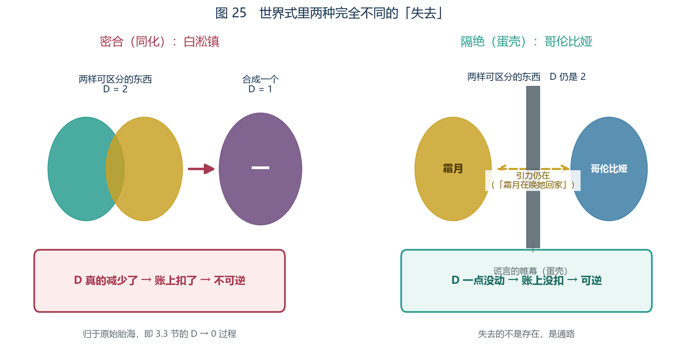

*图 25　两种完全不同的「失去」。左：密合把两样东西变成一个，D 真的降了。右：隔绝只是加了一道墙，D 一点没动。*

这就是本节的全部要害。把它做成表：

| 操作 | 提瓦特的实例 | 对 D 的作用 | 可逆吗 |
|---|---|---|---|
| **密合**（同化） | 原始胎海吞没一切 | **减小** | **不可逆**（1.6 节） |
| **隔绝**（蛋壳） | 虚假之天隔开世界与宇宙 | **不变** | **可逆** |
| 人界力的维持 | 七元素、地脉 | 保持 | 需持续投入（2.5 节） |

**「法涅斯用蛋壳隔绝宇宙和世界的缩影」——注意原文用的是「隔绝」。**

**蛋壳不消灭差别，它切断通路。**

按 3.2 节，蛋壳的作用是让外源项归零——**它停掉的是「进来的东西」，不是「已经在里面的东西」。**

**所以：由蛋壳造成的一切「失去」，在 D 的账上一分都没扣。**

### 三、原文怎么说的

这一节的结论有直证。哥伦比娅的记载中，有一段她自己留下的自述：

> 「她抬眼望去。但天空中什么都没有，**一层帷幕，一个谎言**。不知道为什么，她第一眼看到繁星遍布的夜空时就知道了那是个虚假的谎言。而**那与自己相连的某物则被这个谎言的帷幕所隔断**。」

**「隔断」。**

不是消灭，不是溶解，不是吞没——是**隔断**。而那层帷幕，就是 3.2 节所说的虚假之天。

紧接着的一句更关键：

> 「至少在夜晚，她能清楚感受到那来自**天外的引力**。这引力是无声的，但她反倒听得懂。**霜月在唤她回家**。」

请读者注意这两句话之间的逻辑：

**如果她被抹平了，就不会有「与自己相连的某物」；**
**如果联系被彻底切断，就不会有隔着帷幕仍然生效的引力。**

　　**引力还在，呼唤还在，关系还在。**
　　**被切断的是那条通路，不是她。**

而她的称号是「**空月归乡**」，记载里写她「亦是**归乡的空月**」。

**「归乡」——不是复活。**

**归乡需要的是「一条能走的路」，不是「一次起死回生」。**

### 四、她能回来，是因为四个象限一个都没少

按 4.3 节，意志被归档在四个象限里。**一个存在还剩几格，决定了它有没有可恢复的对象。**

看她被隔断期间的状态：

| 象限 | 她的状态 | 依据 |
|---|---|---|
| **灵魂**（本质） | 月神，本质**从未改变** | 记载直书其为月神；神之眼名「三相月临」 |
| **人格**（表象） | 那个一直在场上的「少女」 | 她从未从世间消失 |
| **记忆**（过去） | **保存在她体内** | 她的自述开头就是「最先听到的是歌声……睡吧，睡吧，我的小鸽子」 |
| **愿望**（未来） | **「霜月在唤她回家」** | 那引力就是她全部的方向 |

**四个格子，一个都没空。**

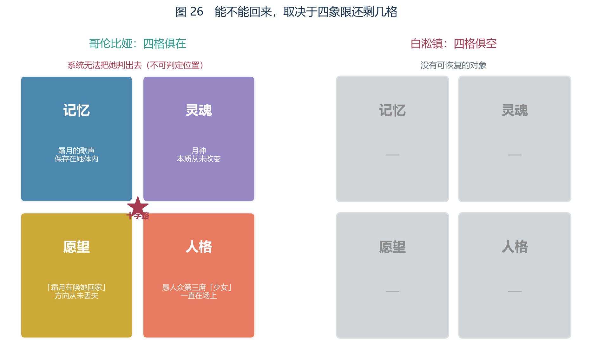

*图 26　能不能回来，取决于四象限还剩几格。左：哥伦比娅四格俱在。右：白淞镇死者四格俱空。*

**这就是为什么「第二次出生」是可能的。**

一份关于她的任务记载写的就是这句话：「获得了『**第二次出生**』的她，会想要做些什么呢……」

**注意「第二次出生」这个措辞。** 出生不是复活——**出生是从已有的东西里长出来，而不是把已经没有的东西变回来。**

**四象限完整，所以有东西可长。**

### 五、为什么接通需要一群人

按 2.5 节，**人界力维持 D 是要持续投入成本的**。

反过来同理：**重新接通一条被切断的通路，同样需要投入**——而且因为对手是蛋壳，投入量不会小。

这一点有直接旁证。与她的回归相关的那批记录里，参与的是**一群人**：

| 参与者 | 在做什么 |
|---|---|
| 桑多涅 | 布局、调度 |
| 茜特菈莉 | **主持仪式** |
| 芙宁娜 | 拍映影 |
| 千织 | 做灯光 |

**这不是排场。按世界式，重新接通是「定向注入人界力」的操作，一个人做不完。**

> **研究员按**：这一点本院可以作证。本院做过芒荒湮灭能源的并网工程，接一条管道要几百人日；而他们要接的是一条被神明级的帷幕切断的通路。**前者是工程，后者是奇迹——但两者在「必须持续投入」这一条上是同一回事。**

### 六、为什么偏偏是她：「十字路」就是那个不可判定位置

现在回答最难的一问：**提瓦特被隔绝、被吞没的东西远不止她一个，为什么回来的是她？**

答案在她自己的定位上。有一句记载写得非常明确：

> 「因为哥伦比娅是**第四个『新月』**，所以她开启了不同于三条道路的**第四条**，所以是**十字路的主人**。」

**「十字路」——交叉点，也就是选择点。**

现在翻回第四章的逻辑层。4.2 节论证过：**提瓦特是一个封闭、自指、足够复杂的形式系统，因此必然存在「系统内不可判定」的命题。**

　　　**不可判定 = 没有唯一答案 = 一个真正的选择点。**

　　　**「十字路的主人」，站的就是那个位置。**

**这就是她能回来的结构性理由：系统无法把她判出去。**

一个自指的系统对自己下的判断会失效——这正是 4.2 节那张表里列的同一类病症：世界树可被改写、某位神被从记录中抹除、某个席位失去判定。**只不过在她身上，这个「缝」没有被用来抹除谁，而是被用成了一扇回来的门。**

**她不是被规则原谅了，她是站在规则没有覆盖的那一格上。**

### 七、一个时间上的巧合

还有一处值得记下。记载里写：

> 「距今**五百年前**，『霜月』诞生了新的神明——『库塔尔』月之少女。」

**而五百年前正是坎瑞亚灾变。**

按补论四的级联，坎瑞亚灾变是最近一次大灾难——也就是最近一次**大规模密合**。

**她的诞生，与最近一次大合并同时。**

按世界式的逻辑：一次大合并之后，世界的 D 被削掉一大块；**而世界要继续存在，就必须生出新的区别来补。** 那一次，补上的区别是她。

> 笔者按：这一条标为**丙级推断**。「五百年前」这个时间吻合是**事实**；但「世界需要新区别来补」这层机制，原文没有说，是本文推的。

### 八、那么白淞镇的人为什么不行

这是本补论标题里承诺要回答的另一半。

**因为他们遭遇的是另一种操作。**

**他们的处境就是图 25 的左栏。**

按 3.3 与 3.4 节，涨水的过程就是 D 趋向零的过程——**人被卷进原始胎海，不是被关在外面，是被并了进去。**

对照看：

| | 哥伦比娅 | 白淞镇死者 |
|---|---|---|
| 遭遇的操作 | **隔绝**——加了一道墙 | **密合**——被并了进去 |
| D 的变化 | **没有变化** | **确实减少了** |
| 四象限 | **四格俱在** | **四格俱空** |
| 有没有可恢复的对象 | **有** | **没有** |
| 「十字路」位置 | **占着** | **不在** |
| 能不能回来 | **能** | **不能** |

**最后一行的差别，不是待遇的差别，是数学的差别。**

　　**他们不是被拒绝回来，是没有可以回来的东西。**

> （这一句后来被一位读者质疑过，而他是对的。修正见第十二节。）

这也顺带否定了一个很容易产生的想法：**「既然哥伦比娅能回来，那用同样的办法也能把别人带回来。」**

**不能。** 拿「重新接通」去解决「已经合并」，是**工具和对象对不上**——就像拿钥匙去开一扇已经被拆掉的门。

### 九、这一节的普遍意义

补论五看起来是在解释一个人物，其实它补上了前面四篇都缺的一块。

**前三篇补论里，「失去」只有一种。** 补论一算糊了的菜（D→0）、补论二算失效的胶基、补论三算城市的容量上限、补论四算下一次灾难——**全都是「D 减少」这一种。**

**本节第一次把「D 减少」和「通路切断」分开。**

而这个区分有普遍用途。它给出了一个**判据**：

> **当一个东西「消失」了，先问一句：它是被合并了，还是被隔绝了？**

- 被**合并**的：**没有回头路。** 白淞镇的人、糊了的菜、被胎海吞掉的文明。
- 被**隔绝**的：**还有回头路，但要走回去需要持续投入。** 哥伦比娅、被蛋壳挡在外面的双月、以及——按 3.2 节——**整个提瓦特**。

**最后一条值得单独说一句。**

提瓦特自己就是被隔绝的：蛋壳把它和宇宙隔开，外源项因此归零，于是世界式只剩坍缩解。

**但从本节的区分看，「被隔绝」意味着「还有一条路」。**

　　**蛋壳挡住的是通道，不是世界。**
　　**而要重新接通它，需要的不是打败谁，是有人从外面把那条路走通一次。**

——这恰好就是 4.3 节所说的「降临者」：**他不是来打赢的，他是来当那条通路的。**

### 十、边界

三条必须说清楚的。

**第一，本节的核心区分是推出来的，不是原文写明的。**

原文只写了「隔断」这个词，以及「引力仍在」。**「隔断不减少 D」是本文从 1.6 节与 3.2 节推出来的**，属于乙级推断。若后续物证表明蛋壳也会抹平内部差别，本节需要重写。

**第二，「四象限俱在」是本文的判断，不是原文的清单。**

四个格子的填法（灵魂=月神、人格=在场的少女、记忆=霜月的歌声、愿望=唤她回家）**全部由本文从她的自述里读出**。原文从未按四象限盘点过她。

**第三，「十字路 = 不可判定位置」是本文最远的一次跳跃。**

「十字路的主人」这个称号是原文的；哥德尔层是第四章的；**把两者扣在一起是本文的主张**。它标为**丙级推断**。

　　　**这一跳如果错了，第七节作废，但第二至五节不受影响**——因为「隔绝可逆而密合不可逆」这个区分，不依赖「十字路」的解释。

### 十一、结语

本节回答的是一个具体问题，但它真正的产出是一句话：

> **世界式没有把她算丢，是因为她从来不在「被合并」那一栏里。**
> **她在「被隔绝」那一栏——而那一栏是可以重新接通的。**

**这两栏的区别，是这份纪要从头到尾最实用的一条。**

因为它把「还有救」和「没救了」分开的标准，从**感情**换成了**账目**：

　　　**不看你想不想救他。**
　　　**看他在 D 的账上，到底被扣了没有。**

---

### 十二、补记：一条质疑，与一个我没算到的账户

本节发表之后，有一位读者提了一个问题。它只有一句话：

> **「白淞镇他们的家人这种联系，不能算可以回来的东西吗？」**

**这一问是对的。第八节的说法不完整。**

第八节写的是：「他们不是被拒绝回来，是没有可以回来的东西。」**这句话只对了一半——它对的是死者自己，错的是死者和生者之间。**

#### 两种存在

一个存在，其实同时活在两个地方：

| | 在哪 | 是什么 |
|---|---|---|
| **自在** | 它自己的四象限里 | 它作为它自己的那套记忆、愿望、灵魂、人格 |
| **他在** | **别人的四象限里** | 它在别人的记忆与愿望中留下的那一部分 |

**密合摧毁的是「自在」。**

**而「他在」不在被密合的那个人身上——它在幸存者身上。所以它没有跟着一起被合并。**

　　　**死者的四象限是空的。**
　　　**但幸存者的记忆象限里，还装着他们。**

　　　**所以「可以回来的东西」是有的——只是它不在死者那边，在生者这边。**

#### 原文里恰好有这一段

本院调阅了一份枫丹的任务记录。里面有一段对话，问的正是这件事：

> **「木偶」：但如果终究要失去的话，为什么还要费心去经营它呢？**
>
> **旅行者：因为过程中所获得的东西会留下，它们是独一无二且无可替代的。**
>
> **「木偶」：那在失去它们的时候，你岂不是会更加伤心？**

而那位「木偶」后来自己给出了回答：

> **「但人生就是不断的失去与告别。我们在失去与告别中学会同这个世界相处，然后又在相处中得到新的东西。」**
>
> **「就像你说的，这个『追寻』的过程总会留下些什么。它们独一无二不可替代，是我们会选择去『记录』在心中的东西。」**

**请注意最后那个词：「记录」。**

　　　**「记录」就是这个操作的原文名字。**

它把一个人的「他在」部分，**写进另一个人的四象限里**，让它不至于随着本人的消失而消失。

**而本节可以补一个旁证：那位说这段话的人，自己就是靠「记录」变成人的。**（她起初是一个自动人偶，是「开始记录」这件事让她长出了人格——详见回溯二对三档操作的讨论。）

#### 但回来的不是本人

那么，从「他在」里取出来的东西，是什么？

**这正是回溯二所说的「归约」。**

　　　**归约：从合并体里取一个原像——而取出来的是一个更简单的版本。**
　　　**从记忆里取出一个人，取出来的同样是更简单的版本。**

它是**我们记得的那个人**，不是那个人。

　　**这一点必须说清楚，否则这一节就会变成一种安慰性的说法。**
　　**它不是在说「他们还在」，而是在说「他们以被记住的形式还在」。**

#### 还有第三个条件：地脉认不认

同一条任务线还提供了另一批材料，它把「能不能回来」这个问题又往下压了一层。

记录里，那位「木偶」说明了一批游魂的来历：**水仙十字结社的雷内研究过「灵魂的切割」**，而被切割的灵魂有两种下场：

| 被切割的时机 | 下场 |
|---|---|
| **在雷内苏醒之后** | 融进雷内的意识；最终在枫丹人被变回「人」之后，**回归了地脉** |
| **在雷内苏醒之前** | **无家可归**，沦为在枫丹水中永远飘荡的游魂 |

而记录中另一位角色的评语是：

> **「简直就像不幸游离于世界之外的存在，既不被地脉承认，也不被命运承认。」**

**注意「承认」这个词。**

**它意味着：回到地脉不是自动的，是有门槛的。**

　　　**被承认的，可以回家。**
　　　**不被承认的，只能在外飘着——而飘得久了，就会「渐渐同他物融合……慢慢变变为某种污秽的聚合体」。**

**也就是说：连「他在」这条路，对某些存在也是关闭的。** 因为「他在」需要有人记着；而连地脉和命运都不承认的存在，也就没有人会记着。

#### 修正后的三层判据

所以本节第八节那个两栏表，现在要改成三栏：

| 遭遇 | 自在 | 他在 | 能不能回来 |
|---|---|---|---|
| **隔绝**（哥伦比娅） | **完好** | 完好 | **能，回来的是本人** |
| **密合**（白淞镇死者） | 空 | **还在** | **只能回来「被记住的版本」** |
| **既不被地脉也不被命运承认**（雷内案中被提前切割的游魂） | 空 | **无人记得** | **连版本也回不来** |

**第一行是补论五原来的结论。**
**第二行是这位读者补上的。**
**第三行是本院在同一条任务记录里另外查到的。**

#### 结语

阿兰·吉约丹——那位造出「木偶」的人——在他留下的记录里写过一句话：

> **「在遗忘与留存的作业中，我们决定了自己将成为什么样的人。」**

本节原本是一份**账目**：谁在 D 的账上被扣了，谁没有。

**现在这份账目上多了一栏。**

　　　**而多出来的那一栏，恰好是三位当事人自己一直在讨论的那件事。**

> 笔者按：本节新增的部分，其依据除注明外，均出自本院调阅的枫丹任务记录。「自在／他在」这组词是本文的整理，不是原文用语；三栏判据同样是本文的整理。原文只提供了三批事实，把它们排成一张表的，是本文。

---

## 回溯一　「规格」：一条刻在万物之中的界限

> **本篇的性质：回溯。**
>
> 按体例第 6 条，回溯篇是**笔者先看到材料、再提出框架**的篇章。它们**不构成对本纪要的支持**——因为任何框架都能容纳任何观察，只要允许它事后长出一个新章节。
>
> **它们能说明的只有一件事：这个框架容得下这些材料。**
>
> 本篇末尾第九节给出了三条**可被推翻的条件**。本院恳请读者去攻它。

### 一、缘起：一条评论领我去看了一份实验记录

补论五写完不久，第二期的观众里有人提了一条线索。原话大意是：

> **「旅行者因为自己就是变量，所以可以在砂糖的魔导课题里弄出 16 倍甜甜花。」**

**这条线索和前面几条不一样。** 前面几条都是推论，而这一条指向**一份具体的实验记录**。

本院随即调阅了这份记录。它来自蒙德的一位炼金术士，内容是受某学会委托所做的一系列周期性实验——**配出一种能让甜甜花长到十六倍的药剂**。

记录很长，但其中五句话让笔者停了下来。

### 二、五句话

笔者把这五句原样抄在下面，因为它们构成了本补论的全部依据。

> **「在生长至十二倍至十四倍大小的时候，会无法承受……」**

> **「就像是触摸到了不可触碰的界限。」**

> **「正如规格是一种刻写在万物之中的法则。」**

> **「所以反复的实验也是为了确认规格界限的稳定……证明界限的始终存在。」**

> **「也许法则的界限因为什么正在发生变动。」**

**请注意这五句话的排列顺序。** 它们不是零散的感慨，而是一条完整的论证链：

　　　先描述现象（到某个倍数就死）→
　　　再命名它（界限）→
　　　再给出它的性质（规格，且是法则）→
　　　再说验证它的方法（反复实验）→
　　　最后给出一个反常的观察（界限在变动）。

**这五句话，把本文前面五篇补论缺的那块机制补上了。**

### 三、翻译：规格就是 D 的上限

回到 1.5 节。差别度 D 的定义是「世界里可区分事物的总量」。

而一份实验记录里的「**规格**」，翻译过来正是——**一个对象所能维持的差别度的上限**。

　　　**规格 = D 的上限**

这个对应不是笔者硬凑的。看记录里那句定义性的表述：

> **「正如规格是一种刻写在万物之中的法则。」**

**「刻写在万物之中」**——这句话说的正是补论三里的那个概念。补论三论证过：一座城市能装多少人，不由资源决定，而由它**能持续支付多少 D 维持费**决定。那里笔者把它叫做「D 维持费」。

**现在这份记录给了那个上限一个名字：规格。** 而且它比笔者的说法更进一步——**它明说这是一条法则，刻写在万物之中。**

### 四、为什么十二到十四倍会死

记录里对失败过程的描述极为精确：

> **「然后在生长至十二倍至十四倍大小的时候会无法承受……会以非自然的形式枯萎和朽败，变成一地的枝叶。」**

而当事人对原因的解释只有四个字：

> **「因为无法超越。」**

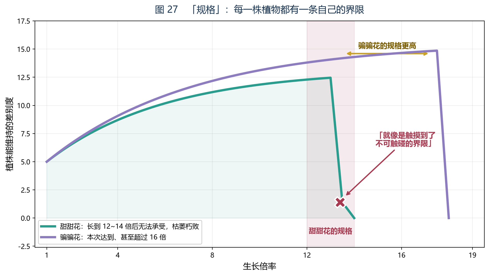

*图 27　「规格」：每一株植物都有一条自己的界限。甜甜花在 12~14 倍处骤降归零；本次长到 16 倍以上的，其实是另一种植物。*

**用世界式的语言复述一遍。**

一株甜甜花被灌了药剂，开始膨胀式生长。它的差别度在上升——**这是外源在注入差别**（补论三、补论五的框架）。

但差别度不是白拿的。按 2.5 节，**人界力维持 D 是要持续投入成本的**。植株越大，它要维持的差别越多，要付的维持费越高。

**而它的支付能力是有限的。**

于是曲线必然出现一个交点：**维持费超过支付能力的那一刻。**

　　　**在那一刻之前，它长得很好。**
　　　**过了那一刻，它付不起了，于是整株一起塌掉。**

**这就是「无法超越」四个字的数学含义。** 记录里那句「变成一地的枝叶」，正是 D 归零之后的景象——用 3.4 节的话说：**东西还在，但已经分不出什么是什么了。**

### 五、为什么骗骗花能超过十六倍

记录里有一个极关键的细节，笔者第一次读的时候差点漏过去。

**这次长到十六倍以上的，不是甜甜花。**

原文写的是：当事人过去查看时发现「这不是甜甜花」，而是一只**骗骗花**——它「体内结构有与甜甜花相似之处」，因此被同一份药剂起了作用，**「甚至超过了十六倍大的规格」**。

**这个细节回答了本补论的第二个问题：规格是不是统一的？**

　　　**不是。规格是分对象的。**

同样的药剂、同样的场地，甜甜花在十二到十四倍就付不起了，而骗骗花能撑到十六倍以上。**两者不是「谁更强」，而是各有各的规格。**

这与补论三的结论完全一致：**每一个系统都有自己的 D 上限。** 城市的、植株的、乃至一个世界的，都不同。

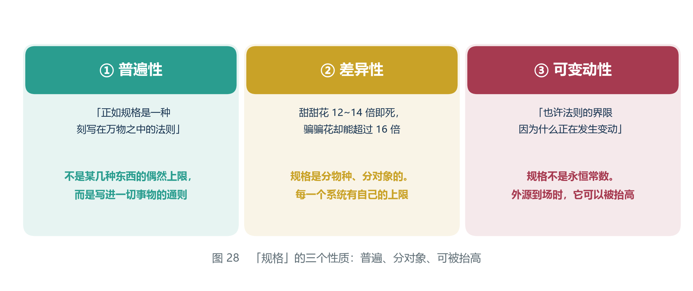

*图 28　「规格」的三个性质：普遍、分对象、可被抬高。*

### 六、最要紧的一句：失败证明界限的稳定

现在讲本补论笔者认为最有价值的一句。

当事人解释为什么要反复做同一个实验时，说的是：

> **「所以反复的实验也是为了确认规格界限的稳定……证明界限的始终存在。」**

**这句话在方法论上和本文开篇那位学者做的事完全一样。**

请回想第零章：他从坎瑞亚人的记录反推出世界式，然后**反复核算**，得到的永远是同一个结果。他当时的反应是「**漏了变量？**」。

**而这份记录给出了另一种解读同一件事的方式：**

　　　**反复得到同一个结果，不是因为命运，是因为界限稳定。**
　　　**而失败，恰恰是界限存在的证据。**

这两句话把「结果恒定」从一件令人绝望的事，变成了一件**可以测量的事**。

**如果你每次都失败，说明界限还在。**
**如果你某次成功了——那就说明界限动了。**

### 七、界限在变动

而这份记录的最后一句，写的正是后者。

面对这次意外的成功，当事人说的是：

> **「如果此后真的能够一直成功复现，那就说明有什么产生了变化。也许法则的界限因为什么正在发生变动。」**

**「因为什么。」**

**记录没有说那个「什么」是什么。** 而这也是笔者最想请读者停留片刻的地方。

因为按本文前面几篇补论，这个句式是可以补完的：

　　　补论三说：**能抬高 D 上限的，只有系统之外注入的差别。**
　　　补论五说：**被隔绝的可以重新接通，但需要持续投入。**
　　　第二期说（若读者听过）：**外源不是一个数，是一个可以空着的位。**

　　　**而这份记录说：界限正在变动，但不知因为什么。**

**三条推论加一份记录，指向同一个方向：那个「什么」，是一个在场的、不属于这个系统的外源。**

**记录没写出来的那半句话，本文的框架可以填。**

### 八、这补上了论文缺的那块机制

到此为止，本文其实一直是**描述性**的。

　　　它说 D 会下降，说终末是合并，说吸引子是唯一的。
　　　**但它一直没回答一个更基本的问题：为什么会有上限？**

补论三给了一个答案——**维持费**。但那只是一个类比，没有文本支撑。

**回溯一第一次给了它文本支撑，而且是一个比笔者更好的说法：**

> **规格是一种刻写在万物之中的法则。**

这句话解释了本文开头一直没有解释的三件事：

| 此前只能描述的现象 | 回溯一给出的机制 |
|---|---|
| 甜甜花长到某个倍数就死 | **它有自己的规格，过了就付不起维持费** |
| 骗骗花能长得更大 | **规格是分对象的** |
| 「不管推演多少遍结果都一样」 | **因为界限是稳定的；失败正是它稳定的证据** |
| 界内的一切努力都改不了结局 | **界内的操作改不了界，规格是刻在万物之中的** |

**最后一行是整篇论文的题眼。** 规格既然是「刻写在万物之中」的，那么万物自己就改不了它——**能改它的，只能在万物之外。**

### 九、什么情况下这一篇会被推翻

本篇属**回溯**——笔者是先看到那份实验记录，才提出「规格＝D 的上限」。因此按体例第 7 条，必须回答：**什么情况下它是错的？**

　　　**第一，如果发现某样东西在没有外源介入的情况下，无限增长而不崩塌。**

那说明它的「规格」不是刻在它之中的，而是可以被它自己突破的。**「规格是刻在万物之中的法则」这句话就假了。**

　　　**第二，如果发现某个对象的规格可以被界内的操作随意改写。**

那「刻在万物之中」就退化成「目前的参数恰好如此」。本篇的整个立论——**界内改不了界，能改的只能在界外**——随之作废。

　　　**第三，如果「规格」与「差别度上限」的对应被证伪。**

即：找到某个对象，它的规格明显不由可区分事物的总量决定，而由别的东西决定（例如纯粹的材质强度）。**那本篇的翻译就是错的。**

**这三条都可以被将来的观察检验，而且都不需要新的理论工具。**

### 十、边界

三条必须说清楚的。

**第一，这份记录谈的是一株植物，本文把它推广到了世界。** 这个推广是本文做的，不是记录说的。记录里没有任何一个字提到提瓦特整体，也没有提到世界式。

**第二，「规格」与「差别度上限」的等同，是本文的翻译。** 记录用的是炼金术的语言，本文用的是方程的语言。两者能不能一一对应，取决于 2.1 节那个「差别度」的设定是否成立——而那一节本身就标着乙级推断。

**第三，「那个什么」究竟是谁，记录没说，本文也不该替它说。** 笔者只能指出：**按本文现有的框架，这个位置是可填的；但填上去的那一笔，属于推断，不属于这份记录。**

　　　**而一份记录最诚实的地方，往往正是它没写出来的那半句话。**

> 笔者按：本补论的全部原文引用，均出自本院调阅的该份实验记录。与前面各篇一样，本文只对**推论**负责，不对**记录本身**负责。

---

## 回溯一之二　「死之诅咒」：一个阻止差别增加的机构

### 一、缘起

本院在回溯一里整理「规格」时，说的是**上限**——差别度最多能到多少。

而读者 Scarlet 的一条评论，把本院领去看了一样**方向相反**的东西：如果差别度根本不增加呢？

### 二、原文：三句话

至冬的一处剧情里，一位执行官说：

> **「他在做的是封锁科技进步，避免一切导致技术进步的想法。」**

紧接着是这一句——**它把机制说成了条款**：

> **「诅咒的内容应该类似于：科技进步的因素出现，暴力诅咒触发。」**

而听的人立刻意识到了它指的是谁：

> **「会是天理，但听到丑角亲口说出这样的话，还是令人感到有些震撼。」**

### 三、翻译

请逐句对照本文的语言。

| 原文 | 本文的说法 |
|---|---|
| 「科技进步」 | 造出**新的可区分事物**——**D 在增加** |
| 「封锁科技进步」 | **阻止 D 增加** |
| 「**因素出现**就触发」 | 不问结果，只问**有没有出现** |
| 「诅咒」 | 一个**执行机构** |

**这里最要紧的是第三行。**

「因素出现」和「结果发生」是两回事。一个只依据「是否出现」就执行处罚的机制，**它需要的不是审判，是传感器。**

### 四、它接上了 3.3 节的哪一句

本文 3.3 节的论证是：**在一个封闭系统里，差别只会减少，不会自己增加。**

但那一直是一个**结构性论断**——它说的是「不会」，**没有说「不许」**。

而现在有了死之诅咒：有东西增加了，就把它掐掉。

- **3.3 节说「不会」**——这是**描述**
- **死之诅咒说「不许」**——这是**执行**

**一个刚性的「不许」，配一个柔性的「不会」，两者互为对方的解释。**

### 五、这条材料改变了什么

**它把「系统封闭」从一个设定，变成了一个有维护成本的事实。**

如果差别度真的只是「自然地不会增加」，那就**不需要**任何机构去封堵它。而现在的原文说：**需要有人（或某个机制）持续地按住它。**

　　　**需要被按住的，说明它本来会动。**

**这是本文第一次拿到「封闭是需要维护的」这一层意思的直接证据。**

### 六、它与规格的关系

回溯一说，规格是**刻在万物之中的界限**——它规定了 D 能到多高。

而这一条说的是：**D 连涨上去的过程都被盯着。**

　　　**一个是天花板，一个是天花板下面的保安。**

两者合起来，构成了本文目前对「为什么提瓦特的 D 一直上不去」这一问题的完整回答：

- **规格**：就算涨，也涨不过那个数
- **死之诅咒**：在涨起来之前就被掐掉

### 七、什么情况下这一篇会被推翻

**如果原文表明死之诅咒另有机制**——例如它针对的不是「技术进步」本身，而是某个具体的行为或某个具体的对象，那么本文的翻译就不成立。

**另一处需要留意的**：本文引用的是剧情转述，而**转述与设定原文之间可能有偏差**。本院尚未找到比这段对话更原始的表述。**在这一条上，本院把等级压到乙级，正是因为这个原因。**

### 八、边界

**这是一条「回溯」。**本院是先读到这段对话，才回头把它接到 3.3 节上的。

　　　**所以它印证了 3.3 节的判断确有对应的执行机构，但它没有预测出任何东西。**
　　　**它不计入对本纪要的支持。**

**它能改变的是强度，不是方向。**

### 九、补记：一处需要向读者说明的疏漏

**这一节本该更早出现在本纪要里。**

二期讲稿里讲了它，而本纪要的正文当时并没有收录。**是本院在核对「讲稿不得引入论文没有的结论」这条规矩时，才发现这个缺口的。**

　　　**换言之：这一节是被自己定的规矩抓出来的。**

本院把这个过程写在这里，是因为它本身就是一个例证——**规矩有用，不是因为本院自觉，而是因为它能在本院不自觉的时候报警。**

## 回溯二　「归约」：世界式的逆运算

> **本篇的性质：回溯。** 笔者是先知道「归约」这个术式存在，才去补上它的数学解释。**它不构成对本纪要的支持。**
>
> 本篇末尾第八节给出了三条**可被推翻的条件**。

### 一、缘起：一个词的提问

第二期播出后，有观众只问了两个字加一对引号：

> **「如何解释『归约』」**

这条短得不像一个问题。但它指向的，是本文前面六篇补论一直没有讲的一样东西。

**因为「归约」不是普通词——它是原文里一个术式的名字。**

而它指的是：**反转。**

本文从第零章开始，讲的都是单向：坍缩、不可逆、没有回头路。**如果存在一个「反转」，那么本文的整套论述就需要补上另一半。**

### 二、原文：世界式·反转

本院调阅了相关的任务记录。说话的是愚人众执行官第七席「木偶」桑多涅。

> **「世界式·反转——『归约』」**

> **「而利用『数秘阵列』反向运算『世界式』，就能达到归拢收束与还原的功能。即术式的反转。」**

> **「这类似数理中的同调归约，在不改变群体本质的情况下，将他们还原为更简单和实质性的存在。」**

而同一份记录里写了它的实际用途：

> **「桑多涅剥离了『怨意』内的污秽与邪念，让众多无家的灵魂重归清净，使他们获得了安眠。」**

**注意最后一句：把一团混在一起的灵魂，重新分开。**

### 三、数学解释：为什么这不是「撤销」

要回答那位观众的问题，关键在一件中等教育就讲过的事：

　　　**一个函数，只有当它是一一对应时，才有反函数。**

**那么密合是不是一一对应？不是。**

表象 3 与本征 4 密合出 7。但**别的组合也可能得到 7**。一旦合成，关于「原本是哪两样」的信息就丢了。

　　　**所以它没有反函数。**

那「归约」做的是什么？

　　　**它只能从结果里取一个原像——而原像不唯一，取哪个都可以。**

这在数学上叫**右逆**，或者叫**截面**。它不是反函数；它是一种「还给你一个说得过去的答案」。

> 所以原文说「反转」，说的是**方向上的反转**；但在数学上，它更接近「**投影回去**」。

### 四、为什么它是有损的

原文那半句话，比想象中精确：

> **「还原为更简单和实质性的存在。」**

**注意：不是「还原为原本的存在」，是「还原为更简单的存在」。**

用差别度写出来：

　　　**密合：D 减少 δ，而且是永久失去 δ。**
　　　**归约：D 增加 δ′。**
　　　**而原文说结果是「更简单的」，所以 δ′ < δ。**

　　　**归约不是「撤销」，是「部分退款」。**

**这修正了补论五的什么？**

补论五说：被合并的东西「没有回头路」。现在要说得更准：

> **回头路有，但走回来的是一个更简单的版本，不是本人。**

这恰好解释了补论五留下的那处不对称——**为什么「隔绝」的能原样回来，而「密合」的不能**：

　　　**隔绝是「门被堵了」；归约是「从废墟里捡回几块砖」。**
　　　**两者都不是把房子盖回来。**

**而世界式的总趋势，仍然是下降的。**

### 五、三档操作

到这里，本文手里其实有**三档**操作，而不是两档。

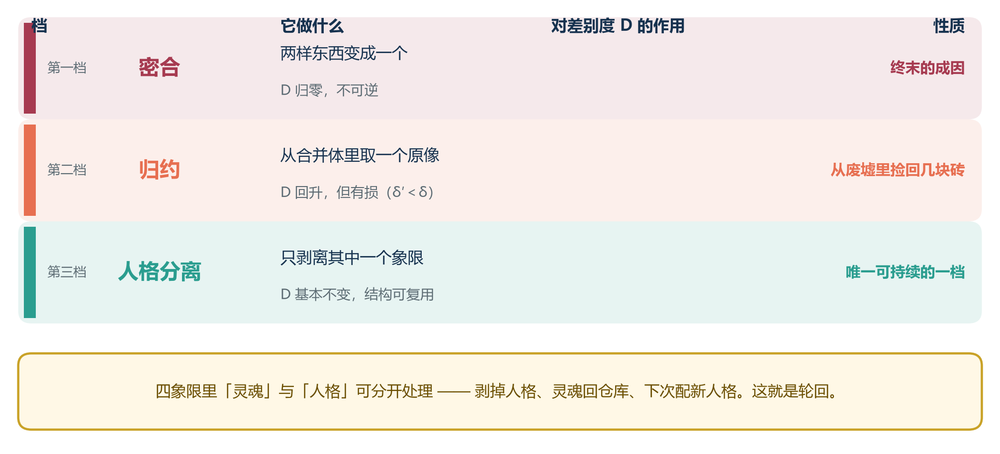

*图 29　三档操作。前两档处理「合并」，第三档处理「结构」。*

| 档 | 它做什么 | 对 D 的作用 | 性质 |
|---|---|---|---|
| **第一档：密合** | 两样东西变成一个 | 归零，不可逆 | 终末的成因 |
| **第二档：归约** | 从合并体里取一个原像 | 回升，但有损（δ′＜δ） | 从废墟里捡回几块砖 |
| **第三档：人格分离** | 只剥离其中一个象限 | 基本不变，结构可复用 | **唯一可持续的一档** |

**第三档是本文此前完全没有的一档，也是最要紧的一档。**

按 4.3 节，意志被归档在四象限里。而**「灵魂」与「人格」是可以分开处理的**：把人格剥掉、让灵魂回到仓库，下一次再配上新的人格。

　　**这正好就是「轮回」的机制。**

而它不需要先把 D 打到零，所以**它是三档里唯一可持续的那一档**。

### 五之二、一个实体的「密合」：地原胚质

上面三档是本文整理的。而在至冬的地图文本里，本院找到了一份**对第一档（密合）的技术描述**——而且它把「密合」讲成了一台机器。

#### 原文

《炼金术士的手记》里，作者在讨论一个核心课题：

> **「令两种或以上生物的特性在同一个体上得以保留的核心课题，其实是如何在一具躯体内保有不同的循环系统。」**

他先说常规的办法——一种叫「源生嵌合体」的人工内脏——然后说那样东西完全改变了这一切：

> **「『地原胚质』完全改变了一切，它像是一个达到了终极版本的『源生嵌合体』。它是一个活着的生命熔炉，可以没有极限地吞吃一切的生物胚。」**

> **「而是直接在吞吃生物胚后，进行完全的吸收，直接将生物特性重组，即便如此，内循环体系数目仍然为一。」**

> **「这是为了培养某种完美的生物而打造的基石。」**

#### 翻译

请逐句对照本文的语言：

| 原文 | 本文的说法 |
|---|---|
| 「**完全的吸收**」「直接将生物特性**重组**」 | **密合**——两样东西变成一个 |
| 「**内循环体系数目仍然为一**」 | **D 归零**——差别被抹平了 |
| 「没有极限地吞吃一切的生物胚」 | **这条路的终点是「一」** |
| 「为了培养**某种完美的生物**」 | 「完美」在这里的定义，正是**没有差别** |

　　　**「内循环体系数目仍然为一」——这句话，就是「密合」的字面定义。**

#### 而这份手记还给出了后半段

同一位作者接着写道：

> **「这应该也是亥珀波瑞亚在『地原胚质』研究的后期才制造出树妖这一种族的缘由……他们开始自『地原胚质』的熔炉中回过头来，探寻更稳定、更接近永恒的生命形式。」**

**这句话很重要，因为它记录的是一次转向。**

亥珀波瑞亚——那个把「地原胚质」造出来的文明——**在研究的后期放弃了熔炉，转向了「树妖」。**而他们转过去要找的东西，是「**更稳定、更接近永恒**」。

　　　**熔炉追求的是「合一」，而「合一」的代价是不可持续。**
　　　**所以他们退回来了，转向「稳定」。**

**这与本文 3.4 节的结论方向一致**：密合是那条路的终点，而不是它的解法。**一个走到半途的文明，自己发现了这件事。**

#### 但这仍然是回溯

必须说清楚：**本院是先读到这份手记，才把它接到三档操作上的。**

　　　**它印证了「密合」这个概念在提瓦特确有对应的技术，但它没有预测出任何东西。**
　　　**所以它归入回溯，不计入对本纪要的支持。**

**它能改变的是强度，不是方向**：本文此前说「密合」时，依据的是 2.2 节那句「三是表象、四是本真，将二者交叠得到七」；**现在有了一份把同一件事讲成「完全吸收、内循环为一」的技术文档。**

### 五之三、一个实地的「循环」：山中之馆

本文 3.2 节说，法图纳是一条**循环**的算式，而世界式不是。

在至冬的地图文本里，本院读到了一份**被困在循环里的人**写下的记录。他不叫它算式，他叫它日子。

> **「这里的一切都在循环，都在重复循环王公婚礼的这一日！」**

> **「我究竟在这里蹉跎了多少的岁月……在我意识到这点之前，我到底已经在这里待了多少年？」**

> **「每一日，每一日，每一日。我都与她约定，等王公的婚礼结束，便一同逃出这该死的山中之馆。」**

> **「在重复循环的所有的日子里，我和她的心意居然都没有一次更改，只是我们永远都无法离开。」**

> **「幸好，幸好这每日循环的公馆，会让她忘记我的死。这样，她还能心怀希望地活着——我竟在此时感谢这该死的每一日的循环来了。」**

> **「手甚至已拿不动笔，看来我要失约了。我可怜的、可爱的阿格拉娅，希望你能看到这篇记录，然后忘记『梅诗金』这个名字吧。」**

#### 要留意的是中间那一句

　　　**「在重复循环的所有的日子里，我和她的心意居然都没有一次更改。」**

写下这句话的人，把它当成一件温柔的事——**爱没有变**。

**但在世界式的语言里，它是另一回事：**

　　　**循环意味着「不产生新的差别」。**
　　　**心意不变，是因为这一日重复了无数次，而每一次的结果都相同。**

**而这份记录里还有一件事值得注意**：写下它的人**在循环中衰老并死去**——「手甚至已拿不动笔」。

　　　**循环保住了那一日的形状，却没有保住他。**

#### 这一条同样是回溯

本院是先在文本里读到这段自述，才回头把它接到 3.2 节的。

　　　**所以它不能用来支持 3.2 节的判断；它只能说明：3.2 节所说的那种「循环」，在提瓦特确有实地的样本。**

**而它给本文添的是一个细节，不是一个证据**：

　　　**在循环里，唯一不变的是结构，而结构里的人照样会老、会死、会拿着不动笔的手。**

### 六、地脉是银行，不是熔炉

**本院把这一节的核心概念在这里先写清楚：地脉的额度。**

**「额度」这个词不是本院造的**——原文说的是「每天地脉能够接收的灵魂数量**有着明确的限制**」，而现场有人当场算出那个数是「两人份」。**本院只是给这个限制起了一个名字。**

**地脉的额度，指的是：单位时间内，地脉能够接纳的灵魂数量上限。**

**它有三个后果**：额度用完，灵魂就得排队；**额度是被改过的**（原文说「曾经那些天使对这里的地脉胡乱改造」）；而**排队排不上的，就成了「久久未归的灵魂」**——那正是地脉「渴求」的对象。

那么，地脉里的灵魂，是密合状态吗？

#### 先说本来的推法

**逻辑是这样的：**

　　　如果地脉里的灵魂已经被密合成一团，D 等于零，**那就没有任何东西可以被「分离」出来重新循环。**
　　　**但循环是确实存在的。所以它们一定还是可区分的。**

支持这一点的依据有三条：

1. 归约的原文有限定：「**在不改变群体本质的情况下**」；
2. 桑多涅让灵魂「**重归清净**，获得安眠」；
3. **「安眠」不是「消失」——睡着的东西还在。**

　　　**所以地脉不是熔炉，是银行。**

**这是一条推断，标为丙级。** 笔者当时把它写在这里，并在附录 D 里注明「这一条可能在动摇」。

#### 后来找到了直接证据

本院其后在至冬调取的一份记录里，读到了死之执政若娜瓦本人对地脉的说明。**下面每一句都是原文，不是笔者的转述：**

> **「肉体死去以后，灵魂回归到地脉，才能视为一次完整的『死亡』。」**

> **「由于你们所说的两位『死者』的存在，地脉是如此渴求那些久久未归的灵魂……每个夜晚都要吞噬同等数量的灵魂来填补空缺。」**

> **「由于剧院地脉阻隔的存在，每天地脉能够接收的灵魂数量有着明确的限制。」**

**请注意这三句里的词：**

| 原文用的词 | 它意味着 |
|---|---|
| 「**填补空缺**」 | 有一个**账目**要平 |
| 「同等数量」 | 是**按量**补，不是无差别地吞 |
| 「**明确的限制**」「每天……两人份」 | 有**额度** |

　　　**「额度」「亏空」「补足」——这是一套账目的语言。**
　　　**熔炉不需要额度。熔炉也不会「渴求」什么。**

**所以原有的推断成立，而且它不再是推断了。**

#### 三档证据的对照

这一节的结论，恰好可以作为本纪要怎么用证据的一个例子：

| 层次 | 内容 | 等级 |
|---|---|---|
| 原文直证 | 「填补空缺」「明确的限制」 | **甲级** |
| 逻辑推断 | 循环存在 ⟹ 灵魂仍可区分 | 乙级 |
| 比喻 | 「银行」这个说法 | 丙级（比喻本身不是证据） |

　　　**三者不能混为一谈。**「银行」只是笔者找的一个说法；**真正扛住这一节的是那三句原文。**

#### 但「吞噬」这个词要解释清楚

本院最初读到「吞噬」时，曾以为它与「银行」冲突——因为吞噬听起来像同化。

**现在看清楚了：「吞噬」在这里指的是「按额度补足亏空」，不是「化为一体」。**

　　　**地脉不是在消化灵魂，它是在平账。**

而这个区别，恰好是本节全部论证的关键：**一个平账的系统，账上的东西必然是分得清的。**

**这一条对全篇是一个补充：D 归零是这个世界的终末，但在这之前，世界给自己留了一个不归零的仓库——而且这个仓库是有账本、有额度、有亏空要补的。**

### 七、循环的执行者

既然循环是被维护的，那就必然有人在做这件事。

本院查阅了相关的记载。**答案是死之执政，若娜瓦——天理四影之一。**

对她的定义句是这样的：

> **「不关心死亡的时间与形式，但会确保『死亡』的发生。」**

**这一句，就是「保证 D 单调下降」的机构描述。**

而记载中她做过的事，正好凑齐了一套循环系统所需的全部：

| 她做过什么 | 相当于 |
|---|---|
| 引导夜神整合纳塔残存地脉，建立夜神之国 | **建了那间仓库** |
| 帮助纳塔建立「还魂诗」等一系列规则 | **定了循环的规则** |
| 「甚至能够宣告『空间』的死亡」 | 死亡不只是生物的 |
| 在至冬歌剧院将众人拖入「死者的空间」，并企图回收派蒙 | **在执行回收** |

　　　**所以：循环不是自然发生的，是由死之执政与夜神共同维护的一套规则。**

这也给 3.2 节那个「开放解」补上了一个执行者——**法图纳不只是一个边界条件，它还是一项被人维持着的工程。**

### 八、什么情况下这一篇会被推翻

本篇属**回溯**——笔者是先知道「归约」这个术式存在，才去补上它的数学解释。因此必须回答：**什么情况下它是错的？**

　　　**第一，如果归约被证明是无损的。**

也就是说，如果它取回来的东西与密合之前**完全一致**（而不只是「更简单的版本」），那么**「右逆／截面」这个解释就错了**——因为真正的反函数是存在的。**三档操作的分层也要重写**：归约将与密合构成一对真正的互逆运算，而不是「部分退款」。

　　　**第二，如果三档操作的分层本身被原文材料的直接命名推翻。**

本篇把「人格分离」列为第三档，并注明原文没有直接命名它。**若原文另有说法——比如它其实是第一档或第二档的子类——则本篇第五节需要重写。**

　　　**第三，如果「地脉是银行」被证伪。**

本篇第六节的论证是：循环存在 ⟹ 灵魂仍可区分 ⟹ 地脉不是熔炉。**如果后续材料表明灵魂在进入地脉的瞬间即被彻底同化，而「循环」其实是从别处（例如世界树或某位执政）重新发牌，那本节就要改。**

> **笔者按：这第三条在本纪要付印之后出现了动摇的迹象。**本院在至冬调取的材料中提到「地脉对灵魂有着强大的**吸引和吞噬**的能力」，与「银行」的比喻有张力。这一条已列入待核，**详见附录 D。**

### 九、边界

三条必须说清楚的。

**第一，「归约」这个操作的适用范围，原文只展示过一次。** 桑多涅用它处理的是一个「污秽聚合体」，不是整个世界。把它的性质推广到世界尺度，是本文做的。

**第二，「三档操作」这个分层是本文整理的，不是原文的分类。** 原文只命名了「归约」一档；「人格分离」这一档，是本文从四象限的结构里推出来的，**原文没有直接命名它**。这一条标为丙级。

**第三，若娜瓦与循环的关系，有原文支撑的部分是「整合地脉」与「建立还魂诗」；而「她保证 D 单调下降」这个说法，是本文的翻译。**

> 笔者按：本补论的原文引用，除注明外均出自本院调阅的任务记录与人物记载。凡属本文的翻译与推广，均已标出。

---

## 回溯三　外源是一个可以空着的座位

> **本篇的性质：回溯。** 「变量是一个可以空着的位」这个提法来自读者，笔者是先看到它，才回头说明它比原文的「输入值出现了变动」更准。**它不构成对本纪要的支持。**
>
> 本篇末尾第九节给出了三条**可被推翻的条件**。

### 一、缘起

补论四算出了一个日期，补论五讲了一种例外，回溯一给了一个机制，回溯二补上了逆运算。

但有一件事，本文一直没有说清：

　　　**「外源项」到底是什么？是一个数，还是一个位置？**

这个问题的提出者是第二期的观众。而它带来的，是本文对补论四的一处修正。

### 二、变量位

先看原文。结社造物战败时说的是：

> **「最早填入『世界式』的输入值出现了变动。有『变量』降临此间。」**

补论四把这句话理解成「改的是一个值」。但观众的提法是：

> **「天理睡了，说明变量是空集。变量的位置一直是空的。」**

**这个提法比本文原来的更准。** 因为「参数是一个值」，你只能问「它等于多少」；而**「外源是一个位」，你可以问「它什么时候有人、什么时候没人」。**

　　　**第一个问题没有时间维度。第二个有。**

而补论四算出的那条灾难级联，**本来就是一条时间线**。

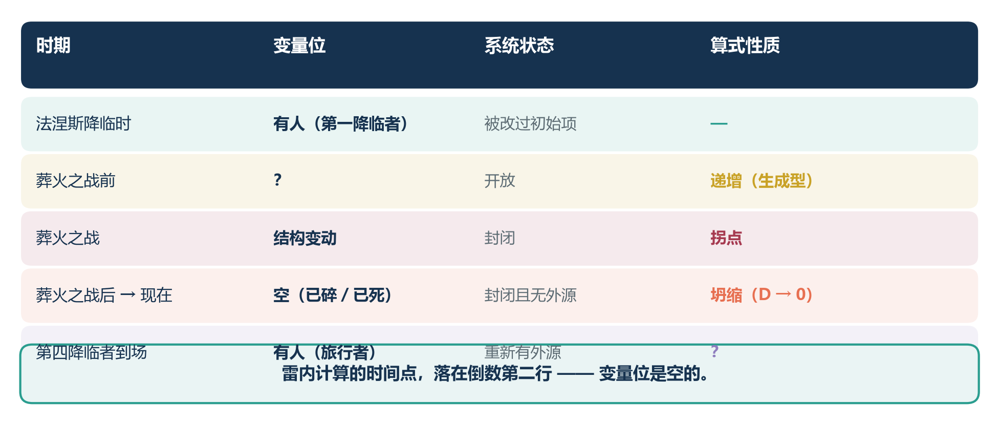

*图 30　变量位时间表。把「谁在位」和补论四的时间轴并到一起。*

| 时期 | 变量位 | 系统状态 | 算式性质 |
|---|---|---|---|
| 法涅斯降临时 | 有人（第一降临者） | 被改过初始项 | — |
| 葬火之战前 | ？ | 开放 | 递增（生成型） |
| 葬火之战 | 结构变动 | 封闭 | 拐点 |
**先把原文摆出来。**论及葬火之战之后的天理，原文用的六个字是：

> **「已碎，陷入沉寂。」**

**这六个字的信息量比看上去大。**它说了两件事：**天理受了不可逆的损伤**（「已碎」），**并且它不再活动**（「陷入沉寂」）。**前者说明那个座位为什么一直空着；后者说明它为什么不会回来把座位填上。**本院此前只写了「已碎／已死」，把后半句丢了——而「沉寂」这两个字，正是本文 4.3 节所说的「元层空位」的原文表述。

| 葬火之战后 → 现在 | **空**（已碎，陷入沉寂） | 封闭且无外源 | 坍缩（D → 0） |
| 第四降临者到场 | 有人（旅行者） | 重新有外源 | ？ |

　　　**雷内计算的时间点，落在倒数第二行——变量位是空的。**

### 三、意志：参数之间为什么本质不同

有观众问得更根本：

> **「如果初始的、超越的、降临的，都是不同参数代入提瓦特的世界式，那么，是什么使这些参数之间存在本质上的不同？」**

**如果他们都只是「外面来的人」，那他们的参数应该同质才对。**

观众给出的答案是**意志**：

> **「就是意志，是意志使人超越，而降临者的意志是整个世界的分量。」**

而本文的框架恰好能接住这一句。

**请回想 4.3 节的门槛：「唯有自身等价一个世界的人才能担此头衔。」**

　　　**「自身等价一个世界」＝「意志是整个世界的分量」。两句说的是同一件事。**

更关键的是：**意志和差别度，本来就是同一件事的两种说法。**

| 出处 | 说的是 |
|---|---|
| 4.3 节 | 意志被归档在四个象限里 |
| 1.5 节 | 差别度 D 就是「可区分事物的总量」 |
| **两句合起来** | **归档进来的意志越多，可区分的东西越多，D 就越高** |

　　　**一个从来源讲，一个从计量讲。**

于是有了一个可以直接推出的改写：

> **提瓦特现在的命运，是天理代入自己的意志，算出来的一个特定结果。**

这不是修辞。**按本模型，世界式的解取决于谁在位、以及他的意志有多少。** 这正好接上第二节那句：世界式的解，有时间戳。

### 四、人界力：天理带来的新参数

同一个观众还提了一条更具体的猜想：

> **「我认为【人界力】就是天理作为降临者所带来的新参数。因为没有天理的时候就有七元素龙王……所以源光分成七份其实并不是天理做的，而是源光的自然变化，天理做的是将光界力改造成人界力，大概是为了 D。」**

本院核对了原文：

> **「法涅斯，第一位降临者，击败七龙王后改建世界，将原始的蛮荒燃素改造成较温和的七元素力。」**

**请注意这个顺序：先有七龙王，天理才来，然后才有改造。**

所以「分成七份」不是天理的功绩——**「改造」才是天理做的**。而他改造的是**力的性质**，不是数量。

按 2.5 节那张表：光界力**减小** D，人界力**维持** D。

　　　**所以这次改造，是给世界加了一个「维持项」。**

**这一条如果成立，3.3 节的论证就要加一个注释**：「系统内不存在产生差别的源」这句话，在改造**之前**是不成立的——因为改造本身就是第一次「加源」。

### 五、由此推出：两代降临者，两种操作层次

从这一处区分出发，本文可以补上一个此前没分清的地方：**两代降临者的操作层次不同。**

| | 第一降临者：法涅斯 | 第四降临者：旅行者 |
|---|---|---|
| 做了什么 | ① 用蛋壳隔绝宇宙　② 把光界力改造成人界力 | 「最早填入『世界式』的输入值出现了变动」 |
| 改的是 | **边界** 与 **算子** | **输入值** |
| 意味着 | 改的是**方程本身** | 只是在方程里填了一个新的数 |

　　　**先来的人可以重写规则；后来的人只能在规则里改一个数。**

这也解释了为什么第一降临者能「改建世界」，而第四降临者只能「带来变量」。

### 六、蛋壳是蓄水池

同一个观众还有一条自述「没有论据、纯推理」的观点，但本院认为它值得记下来：

> **「天理的蛋壳不仅仅是空间上的，而是【概念】上的，关键就在生死时空四大全能里的【时】。……把提瓦特从宇宙中截流出来，就像在河的中间挖了个蓄水池。」**

把它拆成两种情形：

| 如果蛋壳只是空间上的 | 如果它是概念上的（含时间维度） |
|---|---|
| 挡住的是「进不来」 | 挡住的是「不同步」 |
| 里面的人可以出去，外面的人可以进来 | 提瓦特的「时」与外部的「时」被分离 |
| 危险来自外部 | 里面可以独立地走完一段历史 |
| → 它是一个**围墙** | → 它是一个**蓄水池** |

**这一条改变了终末的性质**：从「必然的结局」，变成「一次有风险的隔离实验」。

而且它和补论五、回溯二完全接得上——**蛋壳是「隔绝」，而隔绝是可逆的；归约则是把仓库里的东西取出来。**

### 七、阿克西妮娅：一个微缩的法涅斯

还有一位观众提出了一个跨案例的比较：

> **「阿克西妮娅的那个世界是所有人情绪归位一体，雷内是意识装在一个容器里面，是不是都是减少了 D，都是坍缩型？」**

本院核对了相关记载。她想要的那个世界，被描述为「**无爱亦无忧的庭园**」：

> **「用一个非常宏大的爱去统一所有人爱的概念。如果大家的爱都是同样的、不存在差异的，就不会有人出于私人之爱去做伟业反而酿成灾难。」**

逐项对照：

| 她的设计 | 世界式的语言 |
|---|---|
| 用宏大的爱**统一**所有爱的概念 | **密合**——把多个变成一个 |
| 大家的爱都是**同样的、不存在差异的** | **D 归零**的字面表述 |
| **过滤**狭隘的爱、独一的爱 | **收缩算子的筛选作用** |
| 不能合进来的挡在外面 | 系统内不允许产生差别的源 |

　　　**四项全中。那个世界是标准的坍缩型。**

而记载里有一句更值得注意：她的「无爱」被描述为一个「**虚假之天机制**」。

　　**也就是说：她自己造了一层和天理一样的壳。**

| | 天理的蛋壳 | 她的壳子 |
|---|---|---|
| 挡住的是 | 外面进不来 | 里面的差异出不去 |
| 后果 | 系统失去外源，必然坍缩 | 不合的爱被过滤，内部统一 |
| 共同点 | **都在切断差别流动的通道** | 一个小世界，一个大世界 |

　　　**所以：阿克西妮娅是「微缩版的法涅斯」。**

**而她与雷内是同一种错误**——两个人都想「防止灾难」，而两个人的做法都在加速那个过程。

### 八、对补论四的一处修正

现在回到第二节那个表。补论四用的两个日期——魔神战争（两千年）与坎瑞亚灾变（五百年）——**都落在「变量位空着」的那一段里。**

　　　**所以那个「73 年」，严格说是「变量位继续空着」条件下的外推。**

如果位子继续空着：级联照旧成立，灾难按 0.382 的比例越来越密，七十三年前后第一次，四百二十七年是汇聚点。

如果位子上有人了：外源项恢复，方程不再是封闭解；间隔比 0.382 这个前提会被打破；级联可能被打断、推迟，或者改变形状。**换句话说，那个数字不再适用。**

**这是本节对补论四最重要的一处修正。**

> 好消息是：修正的方向是乐观的——因为位子上现在有人。
> 但要注意：**这只是说原来那个数字的前提变了，不是说灾难不会来。**

### 九、什么情况下这一篇会被推翻

本篇属**回溯**——「变量是一个可以空着的位」这个提法来自读者，笔者是先看到它，才回头说明它比原文的「输入值出现了变动」更准。因此必须回答：**什么情况下它是错的？**

　　　**第一，如果封闭系统被证明能够自增差别度。**

本篇的整个时间表建立在补论四的封闭解之上。**若在没有任何外源到场的情况下，提瓦特的差别度出现了持续上升，则「位」这个概念就是多余的**——因为不需要外源也能增长。**回溯三与补论四会一起被推翻。**

　　　**第二，如果「意志＝差别度的载体」这条翻译被证伪。**

本篇第三节把 4.3 节的四象限与 1.5 节的 D 接在一起。**若原文材料显示意志与可区分事物的总量无关，则这一节作废。**

　　　**第三，如果两代降临者的操作层次之分被证伪。**

本篇第五节说：第一降临者改的是边界与算子，第四降临者改的是输入值。**若原文材料显示第一降临者也曾修改过输入值，或第四降临者动过方程本身，则第五节需要重写。**

### 十、边界

**第一，「变量位」这个提法来自观众，不是原文。** 原文只说「输入值出现了变动」，没有把外源说成一个「可以空着的位置」。**这是本文采纳的一个更好的表述。**

**第二，「意志＝差别度的载体」是本文的推断。** 4.3 节的四象限与 1.5 节的 D 确实可以这样接起来，但**原文从未把这两个词放在一起**。

**第三，「蛋壳是蓄水池」是观众自述的纯推理，且本文只做了并列保留。** 它比「围墙」解释力更强，但**没有直接文本**。

**第四，对补论四的修正，只改动了它的适用条件，没有改动它的算式。** 那个「73 年」仍然是一个合法的条件句——**只是它的前提现在写明了。**

**第五，阿克西妮娅那一条，只有「她的设计确实是坍缩型」是本文的结论；「她是微缩版的法涅斯」是本文的推广。**

---

## 第七章　雷内方案复盘

本章把世界式用回它的推导者本人身上。这不是为了评判他——本院不审判任何人——而是因为**他是这套方程唯一的完整实验记录**。

### 7.1 他做对了什么

必须先把这一节写在前面。事后复盘一个失败者时，人们习惯性地只挑错，这是不诚实的。

**他做的事在方法论上是正确的：**

1. **他找到了正确的数据源。** 原文：「按照坎瑞亚人留下的文件和这些数据，可以得到一部分的算式」。他没有凭空猜测，而是去找了当时最完备的观测记录。

2. **他做了交叉验证。** 原文：「和雅各布交叉核实」。**一个学者在得到灾难性结论之后的第一反应是找人复核，这是极好的科研习惯。**

3. **他怀疑过自己的结论。** 原文：「毁灭？漏了变量？」——这五个字是本纪要全部工作的起点，也是他本人最接近正确答案的一刻。

4. **他确实找到了正确的方向。** 原文：「倘若将其提炼的方法，映射在……的力量的话，或许便能萃取出其中的『意志』」。他在寻找**系统之外的变量**这条路上，方向完全正确。

**所以笔者必须明说：他不是算错了。他算对了。**

### 7.2 他做错了什么

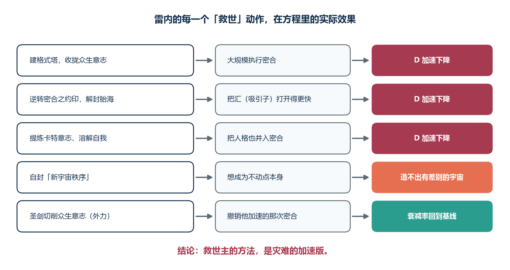

*图 12　雷内的每一个「救世」动作，在方程里的实际效果。*

问题出在**拿到答案之后**。

**错误一：他把「改变输入」误解成了「成为不动点」。**

正确做法：找到外部变量，让 D 的曲线被抬起来。

他做的事：收拢众生意志，把自己推到「新宇宙秩序」「不退还位阶」——**他想成为那个新的吸引子。**

这两件事在方程上完全不同。前者是**改输入**（提高 D），后者是**改吸引子**（换一个不动点）。而后者是不可能成功的，原因见错误二。

**错误二：他用收缩算子去造一个有差别的宇宙。**

「收拢众生意志」这个动作，在方程上就是密合；密合是减小 D 的算子。

而「成为新的宇宙秩序」要求他造出一个**有差别的**新宇宙。

**工具与目标方向相反。** 这就是为什么他的造物得到的称号是「**不完全的**新宇宙秩序」——不是力量不够，是**方法在自我抵消**。

**错误三：他把加快坍缩当成了对抗坍缩。**

这是他最致命的一步，也是最容易理解错的一步。

面对「世界终将归于一体」这个预言，一个直觉的反应是：「那么我抢先把它统一起来，由我来主导这次合并。」

这个思路在政治上或许说得通，但在方程上完全无效：**合并就是合并，谁主导都不改变 D 的下降。** 抢先统一，只是让终末来得更早。

原文对这一点的记录非常精确：他逆转密合之约印、解封原始胎海，让胎海水「由根源流向圆环中心」。**在方程上，这是把汇（吸引子）打开得更快。**

### 7.3 那把剑究竟做了什么

如果说第七章有哪一节最值得记住，就是这一节。

圣剑击败他之后，他说：「是圣剑，它每一次挥动都**切削了围聚在我周身的众生意志**。直到最后，我懦弱的凡人性——**我的人格也回到了我的体内**。」

这句话说明圣剑做的**不是杀伤**，而是**撤销**：

- 切削众生意志 → 撤销他收拢的那些差别；
- 人格回到体内 → 他自己原有的差别恢复了；
- 从「不退还位阶」跌落 → 支撑那个位阶的差别预算被抽走，位阶自然维持不住。

换句话说：**圣剑把他加速的那一次密合，撤销了。**

D 的衰减率回到了基线。世界仍然会走向终末，但**不是被他推着走。**

而他的妹妹——或者说那个既有院长又有玛丽安的存在——对他说的那句话，在方程上是完全正确的诊断：

> 「你连**算式的输入**都没填对。」

她没有说「你算错了」，也没有说「你心太狠」。她说的是**输入没填对**。这是一句学者式的、精确到位的批评。

### 7.4 复盘的方法论结论

把雷内的一生压缩成一条方法论教训：

> **算对一个坏消息之后，最危险的不是绝望，而是「用坏消息的逻辑去行动」。**

他证明了世界会合并，然后他开始合并世界。**他把自己算出来的病症，当成了药方。**

这是所有「救世工程」共同的结构性风险，而不只是他一个人的失误。本院在整理这份纪要时，反复提醒自己注意这一点。

---
## 第八章　局限、反例与待证

一份只讲自己有多对的纪要，不值得任何人花时间读。本章列出本纪要**可能错在哪里**，以及**哪些结论现在还不能下**。

### 8.1 结论的可信度分级

本纪要的全部论断按证据强度分为三级。请读者在引用时务必保留分级。

**甲级：原文直证。** 以下内容在物证中有直接文字支持，可直接引用：

1. 世界式是结社创始人的计算图式，由他命名；
2. 他依据坎瑞亚人的记录反推世界式；
3. 结果恒定：无论推演多少遍都一样；
4. 他与古教团的「法图纳」模型在理论上相似，但「已经不会再有新的文明诞生了」；
5. 存在引入「系统之外的变量」这条路；
6. 世界式有「输入值」，且输入值可以被改动；
7. 能担「变量」之名的，须是「自身等价一个世界」的存在；
8. 意志被按四象限归档；「涌流之树的全图」未能完成；密合之约印可被逆转；
9. 圣剑切削众生意志，导致他从「不退还位阶」跌落、人格回归；
10. 光界力与虚界力方向相反、性质相同，同为同化力，且同样拥有意识。

**乙级：本纪要的强推断。** 以下内容有原文支撑，但推论链条由笔者补全：

1. 被计算的量是**差别度 D**；
2. 算子即**密合**，且密合与同化是同一算子的两种用法；
3. 递推形式为 **W(n+1) = W(n) ⊕ W(n−1)**；
4. 终末的成因是「两种底层力都是收缩算子」**加上**「系统被封闭」；
5. 终末表现为**合并**而非毁灭；
6. 创始人的错误在于「成为不动点」而非「改输入」。

**丙级：弱推断 / 待证。** 以下内容本纪要给出，但**证据不足**，仅供后续研究参考：

1. 3-4-7 与卢卡斯数列的同构关系；
2. 卢卡斯数列前五项与提瓦特宇宙学阶梯的对应；
3. 「表象 = 三界、本征 = 四象限」的具体指认；
4. 三层结构中「内部超越者 + 外部降临者联手」的战略推论。

### 8.2 推理的方向性：回溯与预测

8.1 分的是**证据强度**——原文有多硬。

但还有第二个维度，而且它比第一个更要紧：**这条结论是在看见证据之前推出的，还是之后？**

　　　**预测**：先有框架，框架自己吐出一个此前没人说过、可以被检验的结果。
　　　**回溯**：先有观察，再说明框架能容纳它。

**两者的分量完全不同。**

　　　**回溯不构成证据。** 因为**任何框架都能容纳任何观察**——只要允许它事后长出一个新章节。一个「什么都能解释」的框架，等于什么都没解释。
　　　**只有预测能被推翻，因而只有预测能提供信息。**

本纪要的自我盘点如下：

| 补论 | 方向 | 说明 |
|---|---|---|
| 一　甜甜花酿鸡 | **回溯** | 先看了配方与烹饪说明，再解释火候的数学含义 |
| 二　泡泡糖 | **回溯** | 先看了两种染料与薄荷精油的制法 |
| 三　人口上限 | **回溯** | 先有了城区面积与编制推算 |
| **四　下一次大灾难** | **预测** | **只用公式本身；给出 73 年与可推翻条件** |
| 五　哥伦比娅 | **回溯** | 先知道她能回来，再解释为什么她能而白淞镇不能 |
| 六　规格 | **回溯** | 先看到那份炼金术实验记录 |
| 七　归约 | **回溯** | 先知道「归约」这个术式存在 |
| 八　变量位 | **回溯** | 先有观众提出的「变量是空集」 |

　　　**八篇里，七篇是回溯。**

**这个比例必须如实说出来**，因为它决定了读者应该怎样使用这份纪要：

　　　**它目前主要是一份「解释框架」，还不是一份「被检验过的理论」。**
　　　**要把它变成后者，需要的不是更多补论，而是更多预测。**

---

### 8.3 三个可能的反例

**反例一：如果存在第三种力。**

本纪要第三章的核心论证依赖一个前提：**提瓦特仅有的两种底层力都是同化力。** 这个前提来自原文中「灵光」与「██」的对比。

如果有人能找到一种**产生差别**的力（例如某种被描述为「分化」「创造」「生长」的原始力量），那么 3.3 节的论证就会失效，D\* = 0 也就不再是必然结果。

**这是本纪要最脆弱的一环，也是最值得后人去攻的一环。**

**反例二：如果蛋壳并未完全封闭。**

3.2 节把「不再有新文明」归因于蛋壳的封闭。但原文只说蛋壳「隔绝宇宙和世界的缩影」，**没有说隔绝是完全的**。

如果实际上仍有微弱的外部输入（例如降临者并非罕例，而是周期性地出现），那么密合就仍然是生成型的，只是生成速率极低。此时世界式的解不是「归零」，而是「极度缓慢的循环」——**看起来像终结，实际上是周期极长的波动。**

这两种情形在有限观测时间内**无法区分**。笔者必须承认这一混淆的存在。

**反例三：如果「差别度」不是正确的状态量。**

2.1 节用三条线索逼出了「差别度」这个答案，但**原文从未出现这个词**。如果存在另一个量能同时满足那三条线索，本纪要的全部推论都需要改换语言重写。

笔者目前找不到这样的量。但「找不到」不等于「不存在」。

### 8.3之二　为什么「好像没毛病」不算通过

本院在核验一条主张时，最常听到的一句评价是：

> **「我看了一遍，好像没毛病。」**

**这句话不是没有价值，但它不是核验。**

#### 「没毛病」为什么不算数

一个人在读完一段推理之后说「没毛病」，他实际上报告的是**自己的感受**，而不是**这段推理的属性**。

**感受与属性之间隔着一整套东西**：他有没有读懂前提、有没有注意到被略过的那一步、有没有自己的先入之见。

　　　**所以「好像没毛病」这句话里，真正被检验的不是那段推理，而是说话人的耐心。**

#### 那要怎么样才算

本院给出的替代品是**三步**：

| 步骤 | 做什么 |
|---|---|
| **一、找出它的断言** | 这段话到底在主张什么？把它写成一句能被判断真假的话 |
| **二、问它什么时候会错** | **什么情况下这段话会被推翻？** 如果答不出来，那它可能根本不是一条可检验的主张 |
| **三、去找那个情况** | 去找反驳它的材料，而不是找支持它的材料 |

**第二步是这三步里最要紧的。**

　　　**一条说不出「什么情况下会错」的主张，与一条正确的主张，在读者眼里长得一模一样。**

#### 这一节与附录 D 的关系

本院把这条写在这里，是因为**本纪要自己也受它约束**。

**附录 D 记着本院已修正的错误**，而那份名单之所以存在，正是因为在那些地方，**本院当初也觉得「好像没毛病」。**

### 8.4 尚未解决的问题

以下问题本纪要**无法回答**，如实列出：

1. **世界式的完整形式是什么？** 本纪要给出的是骨架 W(n+1) = W(n) ⊕ W(n−1)，但密合算子的具体定义、四象限之间的运算规则、初始项的确定方式，全部未知。
2. **D 是否可以测量？** 本纪要给出了 D 的定义，但没有给出任何测量方法。一个无法测量的量，在工程上是不可用的。
3. **「不退还位阶」的数学含义是什么？** 原文提到这个概念，但它在方程上对应什么，尚不清楚。
4. **「涌流之树的全图」指什么？** 原文说它「并没有完成」，但全图是什么、为何必须完成，均未说明。
5. **天理的「磨损」在方程上如何表示？** 第四章给出了它属于逻辑层的判断，但没有给出形式化描述。

### 8.5 对后续研究的三条建议

**建议一：优先寻找第三种力。** 这是检验本纪要核心论证的唯一直接途径。

**建议二：建立差别度的可测量代理指标。** 例如用「同一区域内的工艺种类数」「同一时期内的思潮数量」作为 D 的近似，观察其长期走向。若能与本纪要的预测吻合，则乙级推断可升为甲级。

**建议三：把「是否在合并差别」加入科学院对一切大型工程的评估清单。**

这一条不是学术建议，是实务建议。笔者在 6.2 节的判别树里已经说明了理由：**一个方案无论动机如何，只要它在合并差别，它就在加速终点。** 而大型工程恰恰最容易在「统一标准」「消除差异」的名义下大规模合并差别。

本院不反对统一标准——**标准是效率的来源，这一点毋庸置疑。** 本院只是建议，在提现差别度的时候，**至少要知道自己提了多少、以及打算怎么补回来。**

---

## 第九章　与既有理论的对照

笔者在科学院内部试讲时，被问到最多的一句话是：「这个东西，是不是就是热力学第二定律？」

这是个好问题，而且答案不是简单的「是」或「不是」。本章把世界式与三个读者很可能已经学过的理论做对照。**做这个对照的目的不是证明世界式正确，而是让读者借助熟悉的东西建立直觉。** 需要说明的是，本章的三个对照对象全部来自偷渡客的故乡，**提瓦特一个都没有**——所以研究员在读这些段落时，和各位读者一样是第一次听说。

### 9.1 与熵增原理的对照

> **偷渡客按**：下面这一节用的三个理论，全部来自我故乡，提瓦特都没有。热力学、博弈论、演化生物学——研究员在读到之前，一个都没听说过。
>
> 我把它们写进来的目的不是证明世界式正确，而是想给读者一个**熟悉的东西垫脚**。在提瓦特，垫脚石是炼金术与机关术；在我故乡，垫脚石是这三个。

**我故乡中等教育里学过的内容**：热力学第二定律指出，孤立系统的熵不会减少。熵可以粗略理解为「混乱程度」。一杯热水放久了会变凉，热量从高温处流向低温处，最后温度均匀——这个过程**不会自发反向**。

把世界式的 D 与熵并排放：

| 对照项 | 熵（热力学） | 差别度 D（世界式） |
|---|---|---|
| 直观含义 | 混乱程度 | 可区分事物的总量 |
| 变化方向 | 孤立系统中不减少 | 封闭系统中不增加 |
| 是否可逆 | 不可逆 | 不可逆 |
| 极值状态 | 热寂（温度完全均匀） | 终末（差别完全消失） |
| 驱动力 | 自发 | 自发（两种同化力） |

**两者高度相似，但有一处关键差异必须说清楚：**

熵增描述的是**混乱增加**，D 减描述的是**区别消失**。这两件事在日常语言里常常被混为一谈，其实不同。一个房间变乱，是熵增，但**东西之间的区别还在**——椅子还是椅子，书还是书，只是位置乱了。而 D 减是**椅子与书之间的区别本身消失了**。

用本纪要的术语说：**熵增是排布的合并，D 减是存在的合并。**

这个差异带来一个重要的推论。如果终末只是「热寂」，那么世界仍然是由无数互不相同的微粒组成的，只是它们不再有组织；而世界式的终末是**连微粒之间的区别都没有了**。前者是「散了」，后者是「化了」。

原文的措辞支持后者：原始之海会「吞没一切生命」，而「本不属于原始之海的物质则将被**滤除**」。「滤除」不是「打散」，是**分出不属于自己的部分，剩下的一体化**。

### 9.2 与博弈论的对照

**常识层面的内容**：囚徒困境说的是，两个人都做出对自己最有利的选择，结果对两个人都不利。

世界式的密合与囚徒困境有一个结构上的相似：**每个个体做出的、看起来合理的局部选择，加总起来导向一个集体性的坏结果。**

但两者也有本质差异：

| 对照项 | 囚徒困境 | 密合 |
|---|---|---|
| 坏结果的性质 | 收益变差 | 区别消失 |
| 是否存在「合作解」 | 有（重复博弈中可达成） | **没有** |
| 原因 | 缺少信任与沟通 | 缺少产生差别的内源 |

第三行是关键。囚徒困境之所以让人不安，是因为它「本可以更好」；而世界式之所以让人绝望，是因为它**不存在更好的解**。

在囚徒困境里，只要双方能建立信任、能反复打交道，合作解是可以达成的——**问题出在信息与制度上，因此可以被修复。**

而在世界式里，问题出在**算子的性质**上。算子本身是收缩的，没有任何一种合作方式能把它变成扩张的。这就是为什么 6.3 节把「想通过优化系统来改变结局」列为最隐蔽的错误——**这个思路是从囚徒困境那里借来的，而它在世界式上不适用。**

### 9.3 与生物演化的对照

**我故乡中等教育里学过的生物内容**（偷渡客按）：演化的驱动力是变异、遗传与选择。其中**变异是产生新性状的唯一来源**。

把演化套进世界式的框架，会得到一个很干净的对应：

| 演化概念 | 世界式概念 |
|---|---|
| 变异 | 产生差别的源 |
| 选择 | 密合算子（把不适应的合并掉） |
| 物种多样性 | 差别度 D |
| 环境隔离 | 系统封闭 |
| 外来物种迁入 | 外部变量 |

这样一来，3.3 节的论证就可以用生物学的方式复述一遍：

> **如果一个种群完全封闭（不再有外来基因流入），并且它的选择压力持续存在，那么它的遗传多样性会持续下降，最终走向单一化。单一化的种群不是「灭绝」——它还在——但它失去了应对环境变化的能力，一旦环境变动就会整体消失。**

这段话里的每一个字，在生物学上都是常识。而它与世界式的结论**结构完全一致**。

这也是笔者个人认为最有说服力的一条旁证：**世界式描述的并不是什么神秘的东西，它就是「封闭系统 + 无新变异源 + 持续选择」这套结构的必然结果。** 这套结构在现实世界里随处可见——**封闭的种群会单一化，封闭的语言会消亡，封闭的技术路线会锁死。**

### 9.4 三条对照的共同结论

把三个对照并排看：

- 与熵增对照：**都是不可逆的单向过程，但世界式合并的是区别，熵增合并的是排布。**
- 与博弈论对照：**都导向集体性的坏结果，但世界式没有合作解。**
- 与演化对照：**结构完全同构——没有变异源的封闭系统必然单一化。**

三条对照指向同一个结论，笔者把它写成一句话：

> **世界式不是一条关于命运的预言，而是一条关于「封闭系统在缺少变异源时会怎样」的定理。**

把它当成预言，人会绝望；把它当成定理，人会去找变异源。**这正是那位学者当年差一点就做到的事——他在笔记里写下了「漏了变量？」，然后走错了门。**

---

## 第十章　常见问题

**问一：世界式能预测未来吗？**

能预测**终末**，不能预测**过程**。它给出的是吸引子，不是轨迹。就像知道水会流向谷底，不等于知道水会经过哪一块石头。

**问二：普通人能使用世界式吗？**

能，而且不需要任何特殊能力。第六章的六步流程全部使用中等教育的数学。**限制不在使用者的能力，而在于系统的边界条件是否已知。**

**问三：既然结局已经定了，努力还有意义吗？**

这个问题建立在一个错误的前提上——**它把「吸引子」当成了「时刻表」**。吸引子决定的是方向，不是速度。而「速度」是可以被影响的，且影响方式有正有负：

- 加速的方法：合并差别（例如强制统一）；
- 减速的方法：引入差别（例如保护多样性、保留外部通道）。

所以在世界式框架下，努力**并非全然无意义**——只是它必须作用在正确的位置上。**推着车往坡下走，和往坡上拉，是完全不同的两件事，而两者都叫「努力」。**

**问四：为什么说「不问动机，只问方向」？**

因为动机不可观测，方向可观测。一个方案声称自己是为了大家好，另一个方案声称自己是为了统治天下，但如果两者都在合并差别，**它们在方程上做的事完全一样**。

本院在评估工程方案时一贯采用这条原则：**看它做了什么，不看它说了什么。**

**问五：那么「保护多样性」不也是一条价值判断吗？**

是的，而且笔者必须承认这一点。世界式本身只告诉我们「D 在下降」，**它不告诉我们「D 应该被维持」**。从「D 在下降」推到「我们应当阻止它下降」，中间需要一步价值判断，而这一步不在数学里。

本文的全部论证到「D 在下降」为止。之后的每一步，读者需要自己决定。

**问六：如果终末是合并，那合并本身是坏事吗？**

这不是本纪要能够回答的问题。**本院只提供方程，不提供判决。**

**问七：为什么这份纪要由两人合写，正文却只用一支笔？**

因为这个课题本身就是一位研究员做出来的。用行政文书或教科书的口吻写它，会把最要紧的东西弄丢——**那份「算出来之后该怎么办」的困境。** 它不是一道课后习题，它是一个人在一间屋子里对着纸反复算了很多天之后，决定去做点什么。

至于为什么不全篇分开写——这是偷渡客坚持的。他的理由是：**「结论是谁得出的，看标注就够了。如果每一句都换一种口气，读者就只看见两个人，看不见那个算式了。」**

---

## 附录 A　术语表

| 术语 | 本纪要的定义 | 出处 |
|---|---|---|
| 世界式 | 结社创始人命名的一套计算图式，用于推演世界从当下到终末的走向 | 原文直证 |
| 法图纳 | 古教团的世界图景：国家兴衰、文明灭而新文明生。相当于世界式的「开放解」 | 原文直证 |
| 差别度 D | 世界内部「可区分事物的总量」。本纪要推断的、世界式所计算的量 | 本纪要推断 |
| 密合 ⊕ | 把两个对立项熔为一体的操作。形式上等价于「主动执行的同化」 | 原文有「密合」，形式化定义为本纪要推断 |
| 同化 | 使接触到的物质与能量失去区别的过程；不可逆、自加速、无需外力 | 原文直证（现象），形式化定义为本纪要推断 |
| 收缩算子 | 每一步都把差别度减小的操作 | 中等教育概念（1.4 节判据二） |
| 不动点 | 代入算子后输出等于自身的状态 | 中等教育概念 |
| 吸引子 | 无论从哪个初值出发，迭代都会趋向的不动点 | 中等教育概念 |
| 终末 | 世界式的输出：D = 0 的状态，表现为「合并」而非「毁灭」 | 原文直证（现象），解释为本纪要推断 |
| 蛋壳 / 虚假之天 | 隔绝世界与宇宙的边界；系统封闭的标志 | 原文直证 |
| 变量 / 降临者 | 来自系统之外、自身等价一个世界的存在；唯一能改写初始项的角色 | 原文直证 |
| 四象限 | 意志的归档方式：记忆、愿望、灵魂、人格 | 原文直证 |
| 格式塔 | 结社建造的装置，用于存放按四象限归档的众生意志 | 原文直证 |
| 哥德尔不完备定理 | 足够复杂、自洽、递归可公理化的形式系统，必存在系统内不可判定命题 | 现实数学定理 |
| 不退还位阶 | 结社造物自述达到的位阶；具体数学含义未明 | 原文直证（名），含义未解 |

## 附录 B　原始文本出处

### 一、提问者名录

本纪要的多篇补论与回溯，是由读者的提问推动的。**提问是研究工作的一部分，提问者应当被记名。**

| 提问者 | 提问 | 推动了哪一节 |
|---|---|---|
| 木大木大DIO哒 | 「变量是空集」 | 回溯三（外源是一个可以空着的座位） |
| 帝君的桂花酒 | 「阿克西妮娅的那个世界……是不是都是减少了 D，都是坍缩型？」 | 回溯二（三档操作）、回溯三（阿克西妮娅） |
| 帝君的桂花酒 | 「世界式算式可以用来算区分度什么时候是 0，那为什么能算葬火之战？」 | 补论四（灾难推算）、回溯一（规格） |
| 帝君的桂花酒 | 「白淞镇他们的家人这种联系，不能算可以回来的东西吗？」 | 补论五第十二节（自在与他在） |

**本院在此说明体例**：正文中提到这些提问时，一律写作「一位读者」；**而名录放在这里，是为了让提问这件事本身有据可查，同时不让正文变成一份致谢名单。**

### 二、一处术语更正

本院在整理至冬材料时发现：**语音转写会把专有名词听错。**

| 错（语音转写） | 对（屏幕原文） |
|---|---|
| 延冬计划 | **严冬计划** |
| 金矿 | **克什尼克晶矿** |
| —— | **冬契军**、**能源协会** |

**原因**：语音转写对同音字与断词的还原不可靠；而对话框、物品名、任务名里的字是逐字准确的。

**由此得出一条方法上的规矩**：

　　　**凡要写进正文的专有名词，必须以屏幕文字或记载原文为准；**
　　　**只靠一次语音转写得到的名字，一律标「待核」。**

**本院把这条错误记在这里而不是删掉，理由与附录 D 相同**——**本院希望读者能看见本院是在哪里跌倒的。**

### 三、记载原文

本纪要引用的全部原文，均可回溯至以下文献。为便于查证，笔者保留了原始编号。

| 编号 | 文献 | 本纪要引用位置 |
|---|---|---|
| 甲 | 《散落的书页》 | 0.1 节、3.4 节 |
| 乙 | 《雷内的调查笔记》 | 0.2 节、2.5 节、3.3 节、7.1 节 |
| 丙 | 《神秘的书页·其一》（含「法图纳」段） | 0.3 节、3.2 节 |
| 丁 | 结社造物战败对话（含「输入值」「变量」段） | 4.3 节、5.4 节 |
| 戊 | 关于原始之海的描述 | 2.1 节、3.4 节 |
| 己 | 关于蛋壳与虚假之天的描述 | 3.2 节 |
| 庚 | 圣剑战绩记述（含「众生意志」「人格回归」段） | 5.3 节、7.3 节 |
| 辛 | 蒙德炼金术士的周期性实验记录（含「规格」「界限」段） | 回溯一·二 |
| 壬 | 「木偶」桑多涅对「归约」的说明（含「世界式·反转」段） | 回溯二·二 |
| 癸 | 死之执政若娜瓦的记载（含「确保死亡的发生」段） | 回溯二·七 |

笔者按：上表所列文本，本院均有存档。凡本纪要标注为「原文直证」的引用，均可按本表逐句核对。凡未列入本表的语句，均属笔者自撰，不代表任何原始文献。

## 附录 C　插图索引

| 图号 | 图名 | 所在章节 | 类型 |
|---|---|---|---|
| 图 1 | 世界式研究总览 | 第零章 | 思维导图 |
| 图 2 | 差别度 D 的直观含义 | 1.3 节 | 概念示意 |
| 图 3 | 提瓦特的两种底层力 | 2.5 节 | 概念示意 |
| 图 4 | 同一递推式的两种命运 | 3.2 节 | 数据曲线 |
| 图 5 | 密合算子 | 2.2 节 | 关系图 |
| 图 6 | 自指递归（怪圈） | 2.3 节 | 结构示意 |
| 图 7 | 三个抽象层级 | 3.4 节 / 第四章 | 架构图 |
| 图 8 | 意志四象限 | 第四章 | 象限图 |
| 图 9 | 系统内 vs 系统外 | 4.2 节 | 结构示意 |
| 图 10 | 降临者作为外源项 | 4.3 节 | 结构示意 |
| 图 11 | 卢卡斯数列与提瓦特阶梯 | 2.2 节 | 数据图表 |
| 图 12 | 雷内方案复盘 | 7.2 节 | 对照表图 |
| 图 13 | 使用教程六步流程 | 6.1 节 | 流程图 |
| 图 14 | 判别树 | 6.2 节 | 决策树 |
| 图 15 | 四个推理案例 | 第五章 | 时间线 |
| 图 16 | 概念关系图 | 4.4 节 | 关系图 |
| 图 17 | 甜甜花酿鸡的 D(t) 轨迹 | 补论一·七 | 数据曲线 |
| 图 18 | 两味原料填满四个象限 | 补论一·九 | 象限图 |
| 图 19 | 泡泡糖原料来源对照（现实 vs 提瓦特） | 补论二·二 | 对照图 |
| 图 20 | 弹性与同化的区别 | 补论二·四 | 曲线图 |
| 图 21 | 枫丹廷的五条人口约束 | 补论三·四 | 数据图表 |
| 图 22 | 律偿混能的反馈环 | 补论三·七 | 结构示意 |
| 图 23 | 灾难级联（双面板） | 补论四·六 | 时间线 |
| 图 24 | 用世界式裁决年代争议 | 补论四·七 | 对照图 |
| 图 25 | 两种完全不同的「失去」 | 补论五·二 | 对照图 |
| 图 26 | 能不能回来，取决于四象限还剩几格 | 补论五·四 | 象限图 |
| 图 27 | 「规格」：每一株植物都有一条自己的界限 | 回溯一·四 | 数据曲线 |
| 图 28 | 「规格」的三个性质 | 回溯一·五 | 概念示意 |
| 图 29 | 三档操作 | 回溯二·五 | 对照图 |
| 图 30 | 变量位时间表 | 回溯三·二 | 时间线 |

本纪要全部插图均由本院自制，未使用任何外部图源。绘制工具为常规绘图软件，图形元素为几何图元与文字，不涉及任何受版权保护的素材。

---

## 附录 D　本纪要的已知错误与修正记录

### 一、为什么要放这一篇

一份从不认错的纪要，读者有理由怀疑它没有在真的检验什么。

**过拟合的最典型特征，不是「解释得多」，而是「从不出错」。**任何一个足够灵活的框架，都可以在事后容纳任何观察；它唯一的破绽是：当它被证明说错了某件事时，它会不会承认。

所以本院决定把**自己犯过的错**单列一篇。这不是谦虚，是**给读者一个判断本纪要可靠性的依据**：

　　　**如果这一篇越来越长，说明这份研究还在动。**
　　　**如果它停止了，而第一篇又没有变长，那才是最坏的情况。**

### 二、已修正的错误

**（一）补论四的措辞：把「离散事件」说成了「密合」**

补论四原文写的是「灾难被建模成了**离散事件**」。笔者在向读者转述时，把它说成了「**一次大规模密合**」。

**这是一个自行添加的、而且错误的前提。** 因为密合只是差别度下降的一条路，另一条是**毁灭**。

**修正**：补论四新增第三节「先补一个漏洞：灾难为什么会减少 D」，明确 D 的下降有两条路，并把表述改为「灾难 = **差别度的一次大幅下降**」。

**发现者**：一位读者。他在质疑「战争凭什么算进 D 的账上」时，顺带指出了这处措辞问题。

**（二）补论五的结论：只对了一半**

补论五原来写：「白淞镇的人不是被拒绝回来，**是没有可以回来的东西**。」

**这句话只对了一半**——它对的是死者自己，错的是死者和生者之间。死者的「自在」确实空了，但死者在生者记忆里的那一部分（「他在」）并没有随之消失。

**修正**：补论五新增第十二节，把两栏判据改为**三栏**。

**发现者**：同一位读者。他问的是「家人这种联系，不能算可以回来的东西吗」。

**（三）补论三的数值不一致**

自检脚本发现两处：一处把 3.84 万写成了约等于 3.6 万，应为 **3.8 万**；另一处是原写的「1.4 万~7.2 万」并不能从参数范围推出。

**修正**：重算为 M 40~150、A 20~70 → C 800~10500 → N 1.0 万~13 万；结论改述为「**中心估计约 2 万，合理区间 1 万~5 万**」，并重画图 21。

**发现者**：本院自己的数值自检。

**（四）讲稿中对补论四的复述**

第二期讲稿里一度写着「补论四写过：灾难 = 离散事件 = 一次大规模密合」。

**这与事实不符**——补论四从未这样写，那句是复述时加上去的。

**修正**：讲稿与幻灯片均已改为如实表述，并注明**这是复述者加的，不是原文写的**。

**发现者**：本院在核对引文时发现。

**（五）幻灯片有七页在静默丢失内容**

第二期课件中，有 7 页的卡片因为自适应高度向下生长，**把最后几行文字压在了下方色块的底下**——渲染出来看不见，最多被盖住 53 像素。

**这一类错误最危险的地方在于：它看上去是对的。** 本院此前的三道检查（文字越界、容器高度、卡片重叠）**没有一道能发现它**。

**修正**：新增第四道检查——**卡片的「最后一行文字的 y」必须小于同页下方最近色块的顶边**；7 页全部重排。

**发现者**：本院在一次全面体检中，用新建的判据发现。

### 三、已结案的一项：地脉是银行

**（六）回溯二第六节——从「待核」到「原文直证」**

这一条曾经挂在「待核」栏里，理由是：本院读到「地脉对灵魂有着强大的**吸引和吞噬**的能力」，而**「吞噬」与「银行」看起来是冲突的。**

**现在结案了，而且结论站在「银行」这边。**

本院其后取得了死之执政若娜瓦本人的说明。原文用的是三个词：**「填补空缺」「同等数量」「明确的限制」**。

　　　**「额度」「亏空」「补足」——这是账目的语言。熔炉不需要额度，也不会「渴求」什么。**

所以「吞噬」在这里指的是**按额度补足亏空**，不是化为一体。

**这一条的等级由丙级（推断）升为甲级（原文直证）。**

**而这也是本附录存在的意义的最好例证：**
　　　**一条结论可以被挂起来，然后在拿到材料之后被结案——可以是推翻，也可以是坐实。**
　　　**要紧的是它曾经被挂出来过，而不是被含糊过去。**

### 四、本院希望读者做的一件事

本纪要的每一篇补论，末尾都有一节「**什么情况下这一篇会被推翻**」。

　　　**本院恳请读者去攻那一节。**

因为一份研究的可靠性，不在于它解释了多少东西，而在于**它有没有把可以被推翻的地方指出来，并且真的在那些地方被检验过。**

> 笔者按：本附录由两人共同具名。研究员负责前三项的事实核对，偷渡客负责第五项在方法上的说明。至于第四项——**那是我们两个人都犯的：我们把一句自己加的话，当成了原文。**

---

## 后记

### 研究员写的部分

写到这里，笔者想补一句私人性质的话。

本院的工作习惯是先测量、再建模、后验证。而这套流程在世界式面前几乎失效——**因为它不可测量，不可复现，只剩下「读懂」这一条路。**

在这样的条件下，笔者能做的只有一件事：**把每一处推断和每一处直证严格分开，然后在结尾诚实地告诉读者，哪些结论是站得住的，哪些只是笔者觉得有道理。**

这份纪要的乙级推断占了相当篇幅。它们读起来很顺，逻辑也自洽，但这恰恰是笔者最警惕的地方——**一个推论链条越顺，越容易让人忘记它可能建在一个错误的起点上。**

8.2 节列出的三个反例，就是笔者给自己留的三道口子。

另外要记一笔：这份纪要原本只打算写到第六章。后面两个补论，都是因为那位偷渡客多问了一句才有的。**本院过去从不追问「东西从哪来」，现在开始追问了。**

### 偷渡客写的部分

我在这份纪要上能签的名字很有限。

按 4.3 节的说法，我不够格叫「降临者」。我没有带走任何东西的能力，也没有带来任何东西。世界式算出的终末，我改不了——**这一点我一开始就清楚，现在更清楚。**

但有件事我能做。

我来之前，研究员不会问「泡泡糖的弹性从哪来」。这不是他不够聪明，是他**没有可以对照的东西**。一个人如果只见过一个世界，他就不知道那个世界里少了什么。

我见过两个。所以我唯一能提供的东西，就是**多出来的那一份对照**。

用这份纪要自己的话说：**我改不了不动点，但我可以提高一点差别度。** 而按第三章的结论，差别度下降正是终末的成因——所以哪怕只是加一点，方向也是对的。

这大概就是一个偷渡客能做的事：**不是改写结局，而是让这里的人多看见一种可能。**

### 共同写的部分

最后，关于那位四百年前的学者。

他算对了，做错了，然后被一把剑撤销了。后世提起他时，多半会提到「恶龙」这个词。

但本院在档案里读到他笔记中的一句话时，停了很久：

> 「……今天卡尔叔叔采了一些果子。我们一起熬了果酱，把剩下的糖都用完了。不过没关系，按照计划就快回去了……」

写下这句话的人当时大概八岁。他刚刚推算出世界会终结，也刚刚把最后一点糖用掉。

**他后来做了很多错事。但在他算对那道题的那个下午，他只是一个发现了一件坏事、并且想阻止它的小孩。**

——而这恰好是本纪要开头那件事的另一种说法：**他看见了一个坏消息，却没有任何从外面来的人告诉他，那个坏消息里少了什么。**

如果他当年身边有一个偷渡客，也许一切都会不一样。

---

*枫丹科学院非常规现象研究室　内部研究纪要 第 47 号　完*

*附记：本纪要所依据的原始文献，部分仍属结社遗物，未向公众开放。本院已就其中涉及的装置安全事项另案处理。*