# 大一统理论纲要

### ——枫丹科学院非常规现象研究室 内部研究纪要 第 48 号

---

## 作者与体例

本纪要是第 47 号《世界式：原理、推理与应用》的**姊妹篇**。

**第 47 号研究的是一台算式。本纪要研究的是另一个问题：物理学为什么至今没有统一。**

而本院在写第 47 号的过程中逐渐意识到一件事：**这两个问题可能是同一个问题。**

### 体例约定

与本纪要的姊妹篇一致：

- **凡引用原文，一律加引号并注明出处。**
- **凡本院自己的推断，一律标明它是推断。**
- **每一条结论都标两个轴：方向（预测／回溯）与等级（甲／乙／丙）。**
- **每一条结论都要回答：什么情况下它会被推翻。**

**关于「回溯」这个标记**：本院先读到材料、后接上框架，这叫回溯。**回溯能改变的是强度，不是方向。**

**本院在此先说清楚一件事：本纪要比第 47 号更容易犯一个错误。**第 47 号研究的是提瓦特，而提瓦特是有原文的；**本纪要研究的是真实物理，而真实物理有实验。**这意味着本纪要的每一条主张，**都必须面对一个第 47 号不需要面对的问题**：

　　　**它能不能被算出来？**

**本院把这条写在最前面，是因为本院知道这份纪要里有一大半内容是推演，而不是计算。**

---

## 题记

> **「我们不是缺一个把引力算进去的公式。我们缺的是，一个能让我们把引力算进去的地方。」**

---

## 摘要

**统一理论的核心困难，通常被表述为「引力不可重正化」。本纪要主张：这个表述描述了症状，而没有说出病因。**

本纪要提出一个替换的说法：

　　　**引力的问题，是它在重正化群的递推里缺了一项。**

重正化群方程 `dg/d ln μ = β(g)` 是一台**一阶递推机**。一阶递推的解由单个不动点主导，**它没有记忆**。

而第 47 号研究的那台算式 `W(n+1) = W(n) ⊕ W(n−1)` 是一台**二阶递推机**。二阶递推的特征方程有两族解。**多出来的那一项，本文称之为记忆项。**

**本纪要的主张是：四条主流的统一路线（弦论、圈量子引力、渐近安全、因果动力学三角剖分），虽然做法迥异，但它们在数学上都在做同一件事——把那个缺失的项补回去。**

**而本纪要的第二个主张更弱，也更需要读者警惕：**

　　　**第 47 号的「差别度」，可能与物理学里的「可重正化程度」是同一个量。**

**这一条本院只给丙级。**它目前没有计算支持，只有形状上的对应。**本院把它写出来，是因为它值得被检验；本院把它标为丙级，是因为它还不配被称为结论。**

---

## 目录

- 第零章　缘起：两个式子长得有点像
- 第一章　预备：递推的阶
- 第二章　标准模型：一台一阶递推机的胜利
- 第三章　引力的麻烦：一个量纲问题
- 第四章　四条路线，一个形状
- 第五章　本文的主张：补上那一项
- 第六章　差别度是什么物理量
- 第七章　把它套到提瓦特
- 第八章　两个理论互相解释
- 第九章　反例、边界与待证
- 附录 A　术语对照
- 附录 B　本纪要的已知错误与修正记录
- 后记

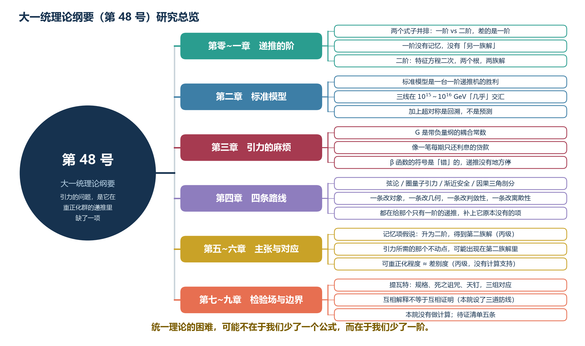

*图 U-1　第 48 号研究总览。本纪要沿「缘起—标准模型—引力的麻烦—四条路线—主张—检验场—边界」展开。*

---

## 第零章　缘起：两个式子长得有点像

### 0.1 先把两个式子摆出来

**第一个式子，来自量子场论。**

一个耦合常数 `g` 随着能标 `μ` 变化，它的变化率由 **β 函数**给出：

> `dg / d ln μ = β(g)`

**这是一个微分方程。但把它离散化，它就是一台递推机**：

> `g(n+1) = g(n) + ε · β(g(n))`

**给它一个初值，它就能一路算下去。**这就是重正化群（RG）的运作方式。

**第二个式子，来自第 47 号。**

> `W(n+1) = W(n) ⊕ W(n−1)`

**本院第一次把这两个式子并排写下来的时候，注意到的不是它们的相似，而是它们的一个差别。**

**第一个式子，右边只有 `g(n)`。**
**第二个式子，右边有 `W(n)` 和 `W(n−1)`。**

### 0.2 这个差别叫什么

**在数学上，这个差别有一个名字：阶。**

- `g(n+1) = g(n) + ε·β(g(n))` 是**一阶递推**——下一步只依赖当前步。
- `W(n+1) = W(n) ⊕ W(n−1)` 是**二阶递推**——下一步依赖当前步和前一步。

**而阶数不是一个小差别。**

本院在第 47 号第一章里讲过：**二阶递推的特征方程是一个二次方程，它有两个根。**而一阶递推的特征方程是一次方程，**它只有一个根。**

　　　**一阶递推没有「另一族解」。二阶递推有。**

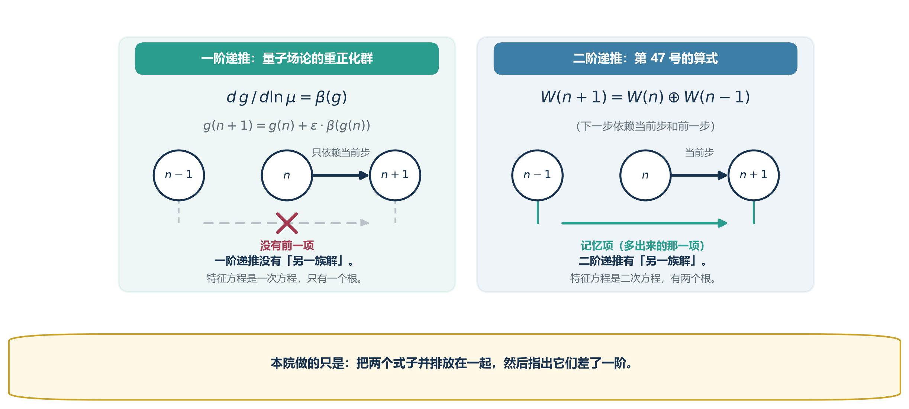

*图 U-2　两个式子并排：差的是一阶。一阶递推的右边只有 g(n)，二阶递推的右边还有前一项。*

### 0.3 本纪要要问的问题

**如果引力的麻烦，恰好来自「重正化群是一阶的」呢？**

**这是一个本院无法立刻回答的问题。**但本院注意到一件事：**如果这个猜想成立，那么它应该有一个可以观察的后果**——

　　　**任何把重正化群升成二阶的努力，都应该同时改善引力的行为。**

而本纪要在第四章会说明：**四条主流路线，做的正是这件事。**

### 0.4 本节的边界

**本院必须在这里就说明一件事：本章提出的只是一个形状上的相似，不是一个推导。**

本院没有从量子场论推出第 47 号的算式，**也没有从第 47 号的算式推出量子场论。**

　　　**本院做的只是：把两个式子并排放在一起，然后指出它们差了一阶。**

**这个观察本身是廉价的。**它有价值与否，取决于它能不能在后面的章节里长出可检验的东西。**如果长不出来，那么本章就该被删掉。**

---

## 第一章　预备：递推的阶

### 1.1 一台递推机需要什么

**一台递推机需要三样东西：**

| 要素 | 作用 |
|---|---|
| **状态** | 它现在是什么 |
| **转移规则** | 从现在的状态怎么走到下一个 |
| **初值** | 从哪里开始 |

**而「阶」描述的是转移规则要看几步历史。**

### 1.2 一阶递推：没有记忆的机器

> `x(n+1) = f(x(n))`

**一阶递推有一个决定性的性质：它的未来只由现在决定，与过去无关。**

　　　**换言之：它没有记忆。**

**这不是一个缺陷——对很多系统来说，这正是我们要的性质。**放射性衰变、牛顿冷却、RC 电路放电，**它们都是（或近似是）一阶的，而它们也确实「不记得」自己之前走过什么路。**

**在重正化群里，这个「没有记忆」的性质表现为一件事**：

　　　**给定能标 μ 处的耦合 g，更高能标处的行为就完全确定了，与它从哪来无关。**

**这是重正化群最有力的性质之一，也是「普适性」的来源。**

### 1.3 二阶递推：多出来的那一项

> `x(n+1) = f(x(n), x(n−1))`

**二阶递推需要两个初值才能启动。**而一旦启动，**它看起来与一阶递推没什么区别**——直到你看它的不动点结构。

### 1.4 线性情形：从特征方程看两族解

**设 `x(n+1) = a·x(n) + b·x(n−1)`。令 `x(n) = rⁿ`，得特征方程：**

> `r² = a·r + b`

**这是一个二次方程，有两个根 `r₁` 与 `r₂`。通解是：**

> `x(n) = A·r₁ⁿ + B·r₂ⁿ`

**而一阶递推 `x(n+1) = a·x(n)` 的特征方程是 `r = a`，只有一个根，通解是 `x(n) = A·aⁿ`。**

| | 一阶 | 二阶 |
|---|---|---|
| 特征方程 | 一次 | **二次** |
| 根的个数 | 1 | **2** |
| 通解 | 一族 | **两族之和** |
| 初值个数 | 1 | **2** |

**两族解意味着二阶系统可以同时携带两种行为。**第 47 号里那个式子的两个根是 `φ ≈ 1.618` 与 `−1/φ ≈ −0.618`，而**负根带来的交替行为，正是一阶系统不可能有的。**

### 1.5 一个具体的例子：为什么二阶能震荡而一阶不能

**一阶递推 `x(n+1) = a·x(n)` 永不变号**（若 `a>0`）**或每步都变号**（若 `a<0`）。**它没有「振荡」这一档。**

**二阶递推可以。**当特征方程的判别式为负时，`r₁` 与 `r₂` 是一对共轭复数，通解变成阻尼振荡。

　　　**这就是为什么「二阶」在物理里到处都是**：牛顿第二定律 `F = ma` 里有一个二阶导；波动方程是二阶的；**只有二阶系统才能既衰减又振荡。**

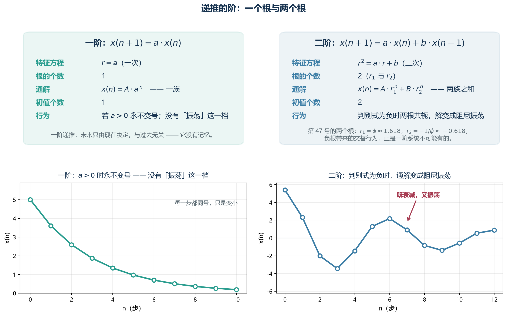

*图 U-3　一个根与两个根。一阶一个根、一族解；二阶两个根、两族解，判别式为负时通解变成阻尼振荡。*

### 1.6 本节的边界

**本节是纯数学，没有物理主张。**

**本院把这一节放在最前面，是为了让后面的主张有一个不依赖提瓦特的落脚点。**如果第五章的主张出了问题，**问题会出在它的物理部分，而不是这一节。**

---

## 第二章　标准模型：一台一阶递推机的胜利

### 2.1 它统一了什么

**标准模型把四种相互作用里的三种——电磁、弱、强——写成了一个理论。**

**它的做法，用本纪要的语言说，是：**

　　　**发现这三种力在高能标下其实是同一种力。**

**这个「发现」不是一个瞬间的洞见，而是一台递推机的输出**：把三种耦合常数分别沿能标往上跑，**它们会靠近。**

### 2.2 它们「几乎」交汇

**这是粒子物理里最有名的一张图。**

把电磁耦合、弱耦合、强耦合的对数倒数分别画在能标轴上，**三条线在 10¹⁵～10¹⁶ GeV 附近靠近，但没有交于一点。**

**「几乎交汇」这四个字，是本章的核心。**

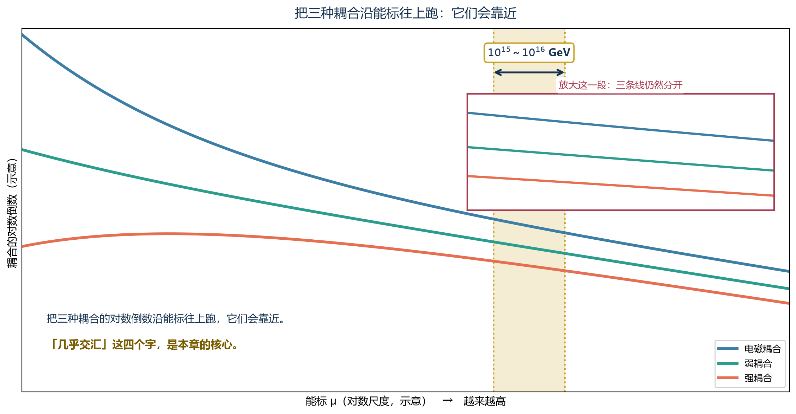

*图 U-4　三线「几乎」交汇。把三种耦合的对数倒数沿能标往上跑，它们在 10¹⁵～10¹⁶ GeV 附近靠近，但没有交于一点。*

### 2.3 为什么是「几乎」

**在纯标准模型里，三条线不交汇。**

**而如果加上超对称——也就是假设每个已知粒子都有一个超对称伙伴——它们会交汇得漂亮得多。**

　　　**这就是超对称最有力的动机之一。**

**但本院要在这里指出一件常被跳过的事：**

　　　**「加上超对称就交汇了」这句话，是一个回溯，不是一个预测。**

**理由是**：超对称是在「三线不交汇」这个观测之后被引进来修这个问题的。**它解释了一个已有的事实，而没有事先说中它。**

**而超对称本身做出的那些真正的预测——比如超对称粒子的质量——至今没有被找到。**

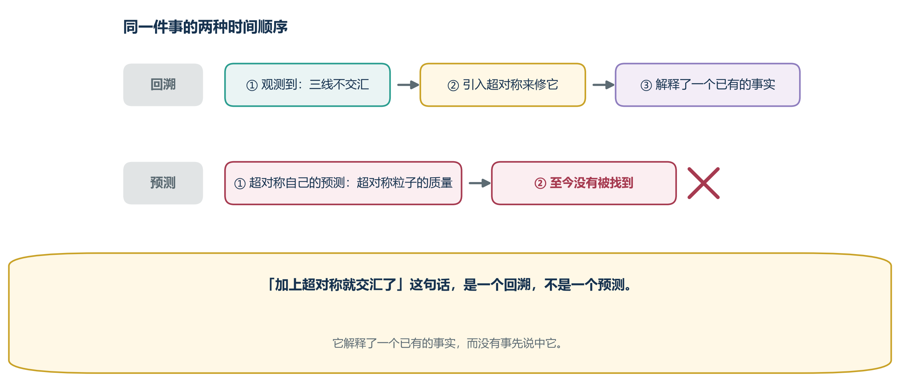

*图 U-5　回溯与预测。超对称是在「三线不交汇」之后被引进来修这个问题的；它自己的预测至今没有被找到。*

### 2.4 本章的结论

**本院在本章要说的只有一件事：**

　　　**标准模型是一台一阶递推机的成功。**

**它的成功方式是：找到正确的变量（耦合常数），让递推在正确的方向上跑，然后看它会跑到哪里。**

**而它的边界也是这个「一阶」带来的**：

　　　**一阶递推没有记忆项，因此它没有地方安放引力。**

**这句话现在还是一个类比。第三章会说明它为什么可能不只是类比。**

---

## 第三章　引力的麻烦：一个量纲问题

### 3.1 先把「不可重正化」翻译成人话

**「引力不可重正化」这句话，在教科书里通常是这样出现的：**

> 广义相对论的作用量里，爱因斯坦-希尔伯特项是 `∫ d⁴x √(−g) R`。**把度规在平直背景上展开 `g = η + h`，得到 `h` 的高阶项，而每一项都带着牛顿常数 `G` 的幂。**
>
> **而 `G` 的量纲是长度的平方**——也就是说，**它是一个带负量纲的耦合常数。**

**负量纲的耦合常数意味着什么？**

**意味着：当你把能标往上推时，圈图修正会带来越来越多的 `G·E²` 因子，而这些因子不收敛。**

　　　**用一句更朴素的话说：引力每往高能走一步，账就多欠一笔，而且欠得越来越快。**

### 3.2 一个类比：把这件事想成一笔贷款

**本院在这里用一个类比，请读者注意它是类比。**

**设想有两笔债：**

| | 第一笔 | 第二笔 |
|---|---|---|
| 本金 | 每一期**还掉一部分** | 每一期**只还利息** |
| 结果 | 越还越少，最终还清 | **本金永远在，利息还在涨** |
| 对应 | **可重正化的耦合** | **不可重正化的耦合** |

**可重正化的耦合，像一个每期都在还本金的贷款**——你算得越细，它的有效值变化是可控的。

**而牛顿常数像一个只还利息的贷款**：**你每提高一档精度，就要多借一笔新的钱来堵上一笔的窟窿，而每笔新钱都更大。**

　　　**这类贷款有一个共同点：它不会因为你还得久就变好。**

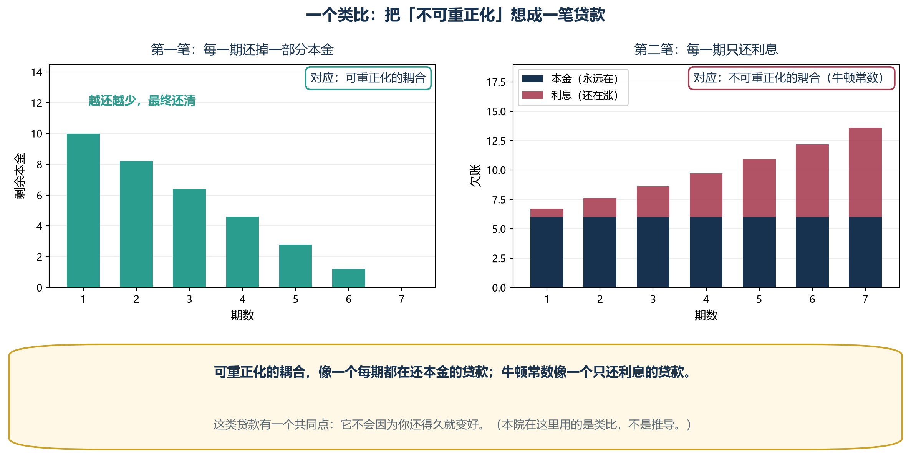

*图 U-6　两笔债。可重正化的耦合像一笔每期都在还本金的贷款，牛顿常数像一笔只还利息的贷款。*

### 3.3 用本文的语言重述这件事

**现在请本院把这段话翻译成本纪要第一章的语言。**

**重正化群的递推是：**

> `g(n+1) = g(n) + ε · β(g(n))`

**右边只有 `g(n)`。这是一个一阶递推。**

**而一阶递推有一个本院在 1.4 节讲过的性质：它只有一族解。**

　　　**一族解意味着什么？意味着系统只有一个「去处」。**

**在可重正化的情形下，这个性质是有利的**：β 函数在某个能标处穿过零点，递推在那里停住，**系统落进不动点。**这就是渐近自由——**耦合在高能标下趋于零，理论自洽。**

**而在引力里，β 函数的符号是「错」的**：`G` 的有效值随能标上升而增大，**递推没有地方停。**

　　　**本院把这句话作为本纪要的核心猜测写在这里：**

　　　　**引力之所以没有地方停，是因为它的递推里没有前一项。**

　　　　**因为缺了前一项，它就没有第二族解；而没有第二族解，它就没有「另一条路」。**

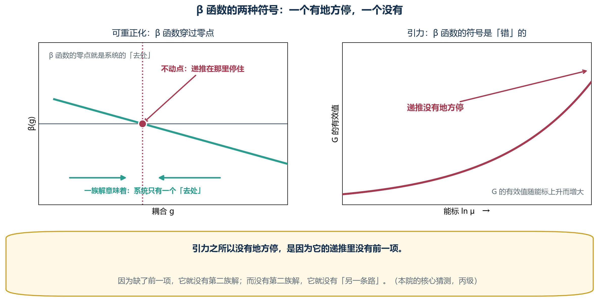

*图 U-7　有没有地方停。可重正化时 β 函数穿过零点，递推在那里停住；引力里 β 的符号是「错」的，递推没有地方停。*

### 3.4 这个猜测的可检验后果

**一个猜测如果没有任何后果，它就不该被写下来。**

**本院的猜测有两个后果：**

**第一个后果**：如果给引力的重正化群递推**人为加上一个记忆项**，那么在某些条件下，**应该能出现一个新的不动点。**

　　　**而这个「应该」是有先例的**——第四章会说明，四条主流路线正是在做这件事，**而其中一条（渐近安全）明确报告了这样一个不动点。**

**第二个后果**：这个不动点**不应该出现在所有能标上，而应该只出现在记忆项的系数超过某个阈值的地方。**

　　　**这个后果本院目前无法检验。**本院把它列在这里，**是希望它能被检验，而不是假装它已经被检验。**

### 3.5 本章的边界

**本章的核心主张——「引力缺一个记忆项」——是一个类比性的说法。本院给它丙级。**

**本院必须提醒读者：量子场论里的「阶」指的是递推依赖几步历史，而本院到现在为止，只给出了形状上的对应，没有给出从作用量到递推的严格推导。**

　　　**换言之：本院说的是一台机器「看起来像」另一台机器，而不是它们「是」同一台机器。**

**这个区分很重要。本院在第五章会尝试走得更远一点；如果走不通，那么本章的价值就只剩下一句可以被证伪的话。**

---

## 第四章　四条路线，一个形状

### 4.1 为什么要把这四条摆在一起

**研究统一理论的路线不止四条，但本院选这四条，是因为它们的做法差异足够大：**

| 路线 | 一句话做法 |
|---|---|
| **弦论** | 把点粒子换成弦 |
| **圈量子引力** | 把几何本身量子化 |
| **渐近安全** | 承认发散，但主张它被一个不动点吸收 |
| **因果动力学三角剖分** | 把时空离散成单纯形，让连续从离散里长出来 |

**一条改对象，一条改几何，一条改收敛性的判断，一条改底层的离散性。**

　　　**而本院要指出的是：这四条路，在数学上都在做同一件事。**

### 4.2 弦论：把无穷多的项一次装进去

**弦论对付发散的方式，是把点粒子的传播子换成弦的传播子。**

**一根弦有无穷多个振动模式，而每一个模式对应一个粒子。**所以弦论的谱里**天然带着无穷多个场**。

　　　**用本纪要的语言说：弦论是把「被略掉的前一项」重新塞回理论里，而塞回去的方式是给基本对象加一个延展的方向。**

**这个做法的代价是显而易见的**：它需要额外维度、需要超对称、需要一个至今没有实验支持的能标。

**但它也解释了一件事**：**为什么弦论是唯一一个能自动把引力包含进来的框架。**因为引力子是闭弦的最低激发——**它不是被塞进去的，它本来就在那里。**

### 4.3 圈量子引力：把几何换成算符

**圈量子引力的出发点完全不同：它不去改粒子，而去改几何。**

**它的做法是把面积与体积变成算符，于是它们有了离散的谱。**

　　　**用本纪要的语言说：圈量子引力是主张「几何量本身有最小台阶」。**

**而「有最小台阶」在递推的语言里意味着什么？**

　　　**意味着能标不能无限往下走——它有一个底。**

**而一个递推如果有底，那么它就不是一直往下跑的**：**它在某个地方停住，然后需要另一条规则来决定接下来怎么办。**

　　　**本院把这句话记为一条观察，而不是一条结论。**

### 4.4 渐近安全：承认发散，但主张它被吸收

**这是四条路线里，与本章主张最贴近的一条。**

**渐近安全的做法是：不去消除发散，而去问「耦合随能标跑，会不会跑到一个不动点上去」。**

**而它的答案是：会。**在截断式的重正化群方程里，**引力耦合 `G` 与宇宙学常数 `Λ` 的无量纲版本，会跑到一个紫外不动点上。**

　　　**换言之：渐近安全的主张是——引力的递推有地方停，只是那个地方不在零，而在一个非零值上。**

**这与本院第三章的猜测并不冲突，而且本院认为它们是相容的**：

　　　**如果引力的递推缺了一个记忆项，而渐近安全给它找到了一个不动点，那么这个不动点可能是「补上记忆项之后」才出现的。**

**本院必须在这里说明：这是一个解释，不是证据。**本院没有做这个计算。

### 4.5 因果动力学三角剖分：让连续从离散里长出来

**这条路线最朴素：把时空切成一堆小三角，让它们按规则粘起来，然后看大尺度上会不会自己变成光滑时空。**

**它的结果是：会。**在一定的参数范围内，**离散的三角剖分确实长出了四维的、近似光滑的时空。**

　　　**用本纪要的语言说：它主张「离散是底，连续是涌现」。**

**而「涌现」这个词，在递推的语言里有一个精确的含义**：

　　　**它指的是：底层的规则是离散的递推，而我们在高能标看不到它，看到的只是它的不动点行为。**

### 4.6 四条路线的共同形状

**现在本院把它们并排放在一起。**

| 路线 | 它改了什么 | **用递推的语言说，它做了什么** |
|---|---|---|
| 弦论 | 换成延展对象 | **把无穷多项装进基本对象** |
| 圈量子引力 | 几何量子化 | **给递推加一个底** |
| 渐近安全 | 改判敛性 | **承认递推有非零不动点** |
| 因果三角剖分 | 时空离散化 | **让递推从离散涌现** |

　　　**而它们做的其实是同一件事：**

　　　　**都在给那个「只有一阶」的递推，补上一个它原本没有的项。**

- 弦论把项装进对象里
- 圈量子引力把它装进几何的台阶里
- 渐近安全把它装进不动点的位置里
- 因果三角剖分把它装进底层的离散性里

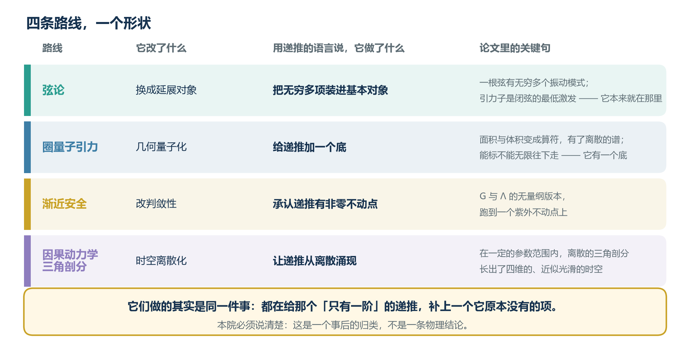

*图 U-8　四条路线，一个形状。弦论、圈量子引力、渐近安全、因果动力学三角剖分，用递推的语言说是在做同一件事。*

### 4.7 本院的判断

**本院必须把这句话说清楚，否则本章会被误读：**

　　　**「四条路线在做同一件事」这个说法，是一个事后的归类，不是一条物理结论。**

**本院是先把四条路线读了一遍，然后发现它们可以用同一套语言来描述。这是回溯。**

　　　**它能改变的只是本院对这些路线的理解方式，不能改变这些路线本身。**

**而它的价值在于：如果这个归类是对的，那么它指出了一个方向**——**与其在四条路上分头摸索，不如直接问：那个被补上的项，究竟长什么样？**

**这个问题就是第五章。**

---

## 第五章　本文的主张：补上那一项

### 5.1 先把主张写清楚

**本院的主张是下面这一条。请读者注意它是一个猜测，不是一个定理。**

　　**主张（记忆项假说）**：
　　**引力的重正化群递推之所以没有可用的不动点，是因为该递推是一阶的。**
　　**如果把它升为二阶——也就是让它同时依赖当前能标与前一个能标——那么它会获得第二族解，而引力所需的那个不动点，可能出现在第二族解里。**

### 5.2 二阶递推会多出什么

**本院在 1.4 节给过结论。这里把它具体化。**

**设重正化群递推升为二阶：**

> `g(n+1) = (1 + ε·β(g(n))) · g(n) + λ · g(n−1)`

**其中 `λ` 是记忆项的系数。**

**当 `λ = 0` 时，它退化为一阶，就是我们熟悉的样子。**

**当 `λ ≠ 0` 时，特征方程变成二次的，**它有两个根 `r₁` 与 `r₂`。

　　　**而这两个根，各自对应一族解。一阶理论只有一族。**

### 5.3 两个根分别意味着什么

**本院在这里只做一个定性的说明，请读者不要把它当成计算。**

| 根 | 行为 | 可能的物理含义 |
|---|---|---|
| `r₁`（接近一阶解） | 主导大尺度 | **我们熟悉的、可重正化的那一部分** |
| `r₂`（由记忆项带来） | 在特定能标下才显著 | **引力行为可能藏在这里** |

**关键在第二行。**二阶递推的两族解**不是永远并肩走的**——它们的相对权重随 `n` 变化。

　　　**这意味着：记忆项带来的那一族解，可能在大尺度上被压制到看不见，而在某个特定的能标区间里跑出来。**

**而如果这件事成立，那么它解释了一个本院在第 2.3 节提过的现象**：

　　　**为什么标准模型的三条线「几乎」交汇，却不完全交汇。**

**因为「几乎」这个偏差，可能正是记忆项在起作用。**

　　　**本院必须立刻补一句：这句话本院无法验证。**它只是一个可能性，本院把它写在这里的理由是——**它是一个可以被否定的说法**（见 5.5）。

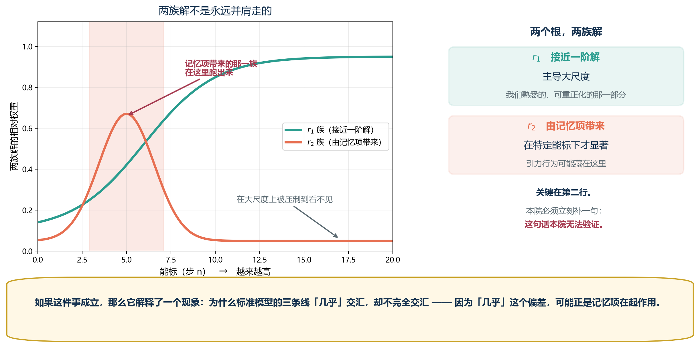

*图 U-9　两族解的相对权重随 n 变化。r₁ 族主导大尺度，r₂ 族在特定能标区间才跑出来。*

### 5.4 这个主张与被推翻的条件

**本院在第 47 号里定了一条规矩：每一条回溯类结论，都必须回答「什么情况下它会被推翻」。本纪要沿用这条规矩。**

**本主张在以下情况下被推翻：**

| 序号 | 推翻条件 |
|---|---|
| 1 | **如果引力的紫外行为被证明与「阶」无关**——例如渐近安全的不动点被证明只能出现在一阶框架内，而无法从二阶递推得到 |
| 2 | **如果记忆项的引入在数学上不可实现**——即不存在一个自洽的二阶重正化群方程能还原已知的低能物理 |
| 3 | **如果三线不交汇的偏差被证明可以由已知效应完全解释**（例如由更高阶的圈图修正解释干净），那么 5.3 节那条旁证就不成立 |

**本院把这三条写出来，是为了让读者能反驳本院，而不是为了让本院显得严谨。**

*图 U-10　三条推翻条件。本院把它们写出来，是为了让读者能反驳本院。*

### 5.5 本院对这一章的自评

**本院给这一章的主张丙级。**

**理由有三条，本院全部写出来：**

**第一，从「阶」到「不动点」的这一步，本院没有做任何计算。**本院做的是：**看到一个二阶系统有两族解，然后说「引力可能需要第二族解」。**这是一个希望，不是一个推导。

**第二，「记忆项」在量子场论里没有明确对应物。**本院借用了第 47 号的词，但**本院并未说明在路径积分或算符代数里，什么东西对应「前一项」。**

**第三，也是最重要的一条**：**这个主张目前的形状，与「随便加一项就能得到想要的结果」很难区分。**

　　　**本院在第 47 号的 8.3 之二里写过：一条说不出「什么情况下会错」的主张，与一条正确的主张，在读者眼里长得一模一样。**

**本院在这里把这句话用在自己身上。**5.4 节的三条推翻条件，就是本院对这句话的回答。**如果读者认为这三条太宽松，那么读者是对的，本院接受。**

---

## 第六章　差别度是什么物理量

### 6.1 先把第 47 号的定义搬过来

**第 47 号里的「差别度 `D`」，指的是一个系统内部「可区分状态的多少」。**它不是一个新概念——**它是一个旧概念换了一个名字。**

**本院在这里要把这件事说清楚，因为它是本章唯一站得住的部分。**

| 第 47 号的 `D` | 物理里的对应物 |
|---|---|
| 「可区分状态的多少」 | **状态数 `Ω`** |
| `D` 减少 | `Ω` 减少 |
| `D → 0` | **`Ω → 1`，只有一个状态** |

　　　**而 `S = k ln Ω`。所以 `D` 与熵是对数的关系。**

**这一步本院认为是可以接受的**：它只是一个翻译，不涉及新物理。

### 6.2 但本院要说清楚它不等同于熵

**如果 `D` 只是熵的另一种写法，那本院就没有必要写这一章。**

**它们的区别在于方向：**

| | 熵 | 差别度 `D` |
|---|---|---|
| 默认趋势 | **增加**（热力学第二定律） | **在封闭系统里减少** |
| 为什么 | 因为微观态多 | **因为第 47 号所讨论的「密合」** |

**本院知道这两句话看起来是矛盾的。它们不矛盾，因为说的是不同的东西：**

　　　**熵说的是「一个宏观态对应多少个微观态」；**
　　　**差别度说的是「这个系统里还有多少种不同的东西」。**

**一个热平衡的气体，熵最大，而差别度是零**——**因为它全身上下都一样。**

　　　**这两件事在同一个系统上可以同时成立：熵很大，而差别度为零。**

**本院在第 47 号里讨论的「终末」，正是这个状态。**

### 6.3 从差别度到可重正化程度

**这是本章的核心猜测。本院先把它单独写出来：**

　　**猜测（对应假说）**：
　　**物理理论的可重正化程度，与该理论所描述系统的差别度，是同一个量的两种说法。**

**它的意思是：**

| | 说法一 | 说法二 |
|---|---|---|
| 可重正化 | 需要新的反项来吸收发散 | **新的差别在不断地产生** |
| 不可重正化 | 反项不够用，发散无法吸收 | **新的差别产生的速度超过了处理能力** |
| 渐近安全 | 有不动点，发散被吸收 | **差别产生与差别合并达到平衡** |

**本院在这里用一个不严格的类比来说明它**：

　　　**重正化就是「把新的差别吸收进旧的定义里」。**
　　　**可重正化，意味着这个吸收过程是收敛的。**
　　　**不可重正化，意味着新的差别冒出来的速度，超过了吸收的速度。**

**而在第 47 号的语言里，「差别冒出来」这件事有一个名字：**

　　　**它叫 D 在增加。**

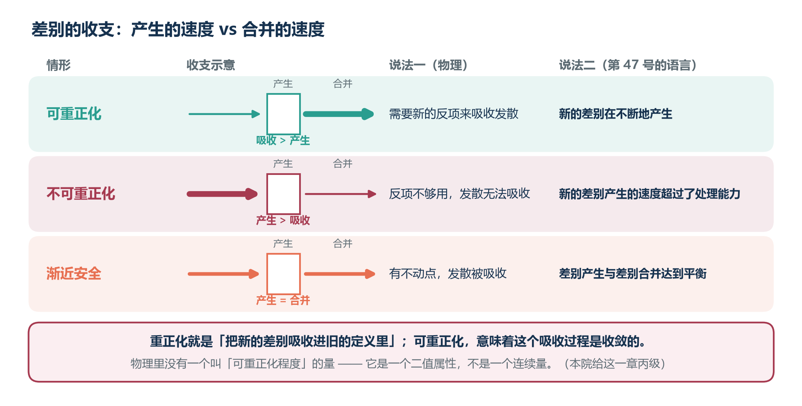

*图 U-11　差别的收支。可重正化、不可重正化、渐近安全三种情形下「差别产生」与「差别合并」的速度对比。*

### 6.4 本院对这个猜测的自评

**本院给这一章丙级。理由如下：**

**第一，「可重正化程度」这个词，本院没有给出定义。**物理里没有一个叫「可重正化程度」的量——**理论要么可重正化，要么不可，它是一个二值属性，不是一个连续量。**

　　　**本院若要主张对应，就必须先造出那个连续量。本院没有造。**

**第二，本院给出的三行对应表，是本院「翻译」出来的，不是从任何计算里出来的。**

**第三，也是最要紧的一条**：**这个猜测目前没有任何可检验的后果。**

　　　**一个说不出任何后果的猜测，按照本院自己在 8.3 之二里的标准，是不合格的。**

**本院把它写在这里的理由只有一个：它可能指对了地方。**

　　　**如果它对，那么「引力不可重正化」与「提瓦特必然归零」就是同一件事在不同语言里的两次陈述。**
　　　**如果它错，那么本纪要与第 47 号的关系，就比本院希望的要松得多。**

**本院选择把它写出来并标为丙级，而不是把它删掉——因为删掉它，读者就看不到本院到底在猜什么。**

---

## 第七章　把它套到提瓦特

### 7.1 为什么提瓦特是一个合适的检验场

**本院在这里提出的主张，与前面几章不同：它不是关于物理的，而是关于「我们在哪里检验物理」的。**

**一个理论最难的部分，往往不是提出它，而是找到一个能把它逼到墙角的地方。**

**本院认为提瓦特（指第 47 号所研究的那个系统）适合充当这个角色，理由有三条：**

| 理由 | 说明 |
|---|---|
| **一、它被封闭** | 有一个明确的边界（虚假之天），外部影响被切断 |
| **二、它有边界条件** | 有一条明确的规格（第 47 号回溯一），给出了上限 |
| **三、它有可观测的历史** | 葬火之战、天钉、坎瑞亚——**有能力范围内的分段记录** |

　　　**换言之：它是一个参数被写在外面的封闭系统。**

**而物理里的封闭系统，参数从来不是写在外面的。**

### 7.2 「封闭」在物理里对应什么

**第 47 号主张提瓦特是一个封闭系统，D 在其中有减无增。**

**而重正化群里的对应物是「截断」**：

　　　**一个理论只有在带上紫外截断 `Λ` 之后才是良定义的；而截断的意思是「这个能标以上的东西我们不管」。**

**把这句话翻译到提瓦特**：

　　　**虚假之天就是那个截断。**

**而截断有一个必须付出代价的地方**：**截断破坏了对称性，因此需要反项来修补。**而反项本身又依赖截断。

　　　**用第 47 号的语言说：为了让系统保持封闭，必须持续地投入「维护成本」。**

**而第 47 号在回溯一之二里刚刚找到了这样一条材料——死之诅咒。**

　　　**死之诅咒是那个维护成本的原文名字。**

### 7.3 三组对应

**本院把目前能找到的对应列在这里。**

| 第 47 号 | 物理里对应物 | 等级 |
|---|---|---|
| **规格**（D 的上限） | **紫外截断 `Λ`** | 乙级 |
| **死之诅咒**（阻止 D 增加） | **反项**（修补截断破坏的对称性） | 丙级 |
| **天钉**（一次硬截断） | **一次截断的重新设定** | 丙级 |

**本院必须把这三条的等级说清楚：**

- **「规格对应截断」是乙级**：两者的功能相同（都给出上限），**但本院没有给出从规格到 `Λ` 的换算。**
- **后面两条是丙级**：**它们是形状上的对应，本院找不到任何方式去检验它们。**

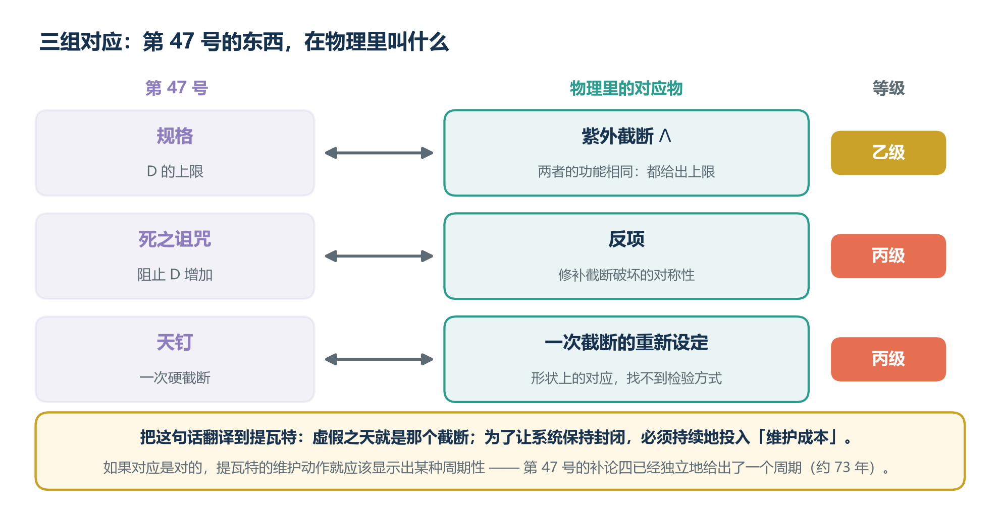

*图 U-12　三组对应。规格对应紫外截断 Λ，死之诅咒对应反项，天钉对应一次截断的重新设定。*

### 7.4 为什么这种对应值得写

**本院知道读者会问：既然只有丙级，那写它做什么。**

**本院有两个回答。**

**第一个回答是关于方向的**：如果这个对应是对的，**那么提瓦特的那些「维护动作」——死之诅咒、天钉、以及其他本院尚未识别的动作——就应该显示出某种周期性。**

　　　**而第 47 号的补论四已经独立地给出了一个周期（约 73 年）。**

　　　**换句话说：这两条线索有一条共同的可检验后果。**如果提瓦特的维护动作确实呈现约 73 年的间隔，那么 7.3 节的对应就多了一分支持。

**第二个回答更朴素**：

　　　**本院写第 47 号的时候，是在研究一个虚构世界；本院写第 48 号的时候，是在研究真实物理。**
　　　**而本院发现，两边的困难长得一样：都是「有一个东西算不进去」。**

　　　**一个理论在哪卡住，往往比它算了什么更能说明它是什么。**

---

## 第八章　两个理论互相解释

### 8.1 先把「互相解释」这个词定准

**本院在本章要说的关系，不是「一个理论是另一个的特例」。**

**那种关系是单向的：母理论包含子理论。**

　　　**本院要说的是双向的：两个理论各自都能为对方的困难提供一个说法。**

**本院把这种关系称为「互相解释」。它在逻辑上比「包含」弱，但比「类比」强。**

### 8.2 世界式解释大一统的什么

**世界式能给大一统理论提供三样东西：**

| 世界式提供 | 用在哪里 |
|---|---|
| **一、一个二阶递推的具体例子** | 说明「二阶比一阶多一族解」在物理之外也成立 |
| **二、一个「D 减少」的具体机制（密合）** | 说明「差别合并」不是抽象概念，它有具体的算子 |
| **三、一个「封闭系统会归零」的完整推演** | 说明为什么截断必须付出维护成本 |

**第三样是最重要的。**

　　　**物理里的截断，通常被当成一个技术手段；而第 47 号里的封闭，被证明是一个需要持续付钱的状态。**

### 8.3 大一统解释世界式的什么

**反过来的方向，本院认为更有价值。**

| 大一统提供 | 用在哪里 |
|---|---|
| **一、一个「为什么一定会有量纲问题」的框架** | 解释了第 47 号里「规格为什么会被刻在万物之中」 |
| **二、一个「不动点」的语言** | 让第 47 号的「终末」可以被更精确地描述 |
| **三、一个检验的场所** | 物理有实验，而提瓦特没有 |

**第二样值得展开。**

**第 47 号说提瓦特的终末是「D 归零」。用大一统的语言说，这相当于：**

　　　**这个系统的不动点是零。**

**而物理里的不动点通常不是零**——渐近安全的不动点是一个非零值。

　　　**所以「终末是零」这件事，在物理的语言里其实是一个特殊情形，而不是通例。**

**这句话反过来给了第 47 号一个新的问题**：

　　　**提瓦特的不动点为什么是零？它是被设计成零的，还是本来就是零？**

**本院不知道答案。但本院认为这是一个好问题——因为它是一个第 47 号自己问不出来的问题。**

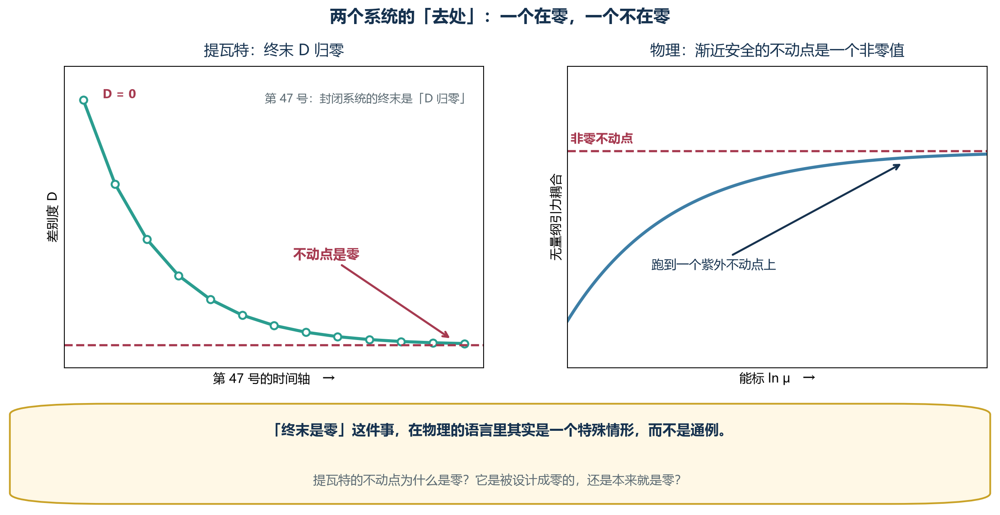

*图 U-13　零不动点与非零不动点。提瓦特的终末是 D 归零；物理里渐近安全的不动点是一个非零值。*

### 8.4 「互相解释」不意味着什么

**本院必须在这里设三道防线，否则本章会变成一句漂亮话。**

**第一道：互相解释不是互相证明。**

　　　**两个理论能互相解释，不构成任何一方为真的证据。**一个足够灵活的框架，可以与很多东西「互相解释」——**第 47 号的 8.3 之二里本院刚写过这一点。**

**第二道：互相解释可能是同一套隐喻的两次使用。**

　　　**本院借用了第 47 号的词（递推、不动点、差别），然后再用它们去描述物理。**
　　　**那么「两个理论互相解释」这件事，有多少是世界的性质，有多少只是本院用词的连续性？**

　　　**本院认为这个质疑是致命的，而本院没有完全的回答。**

**第三道：本纪要的物理部分，比第 47 号更弱。**

　　　**第 47 号有原文支撑，本纪要的第五章、第六章没有。**
　　　**本院在第 47 号里可以标甲级的地方，在本纪要里最多只能标乙级。**

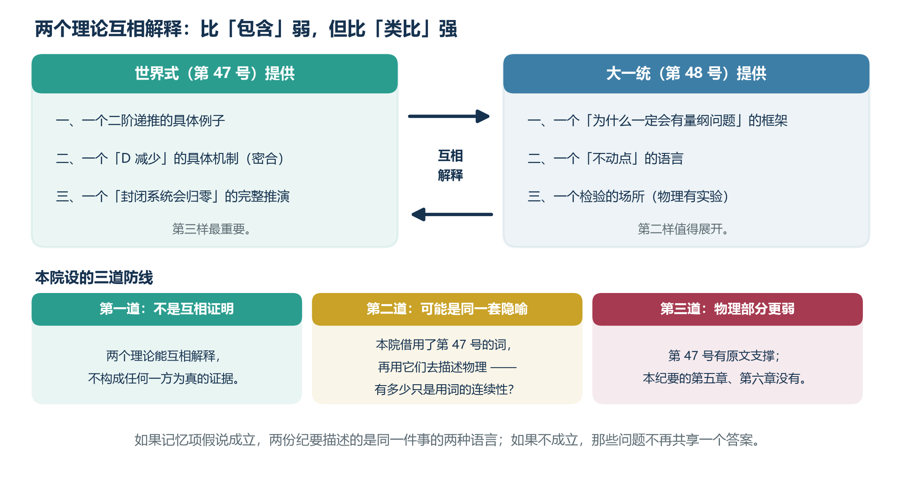

*图 U-14　互相解释，以及三道防线。它比「包含」弱，但比「类比」强。*

### 8.5 本章的结论

**本院把这一章的结论压到最小：**

　　　**如果记忆项假说成立，那么本纪要与第 47 号描述的是同一件事的两种语言。**
　　　**如果它不成立，那么本纪要仍然是一个独立的问题清单——只是那些问题不再共享一个答案。**

**本院认为第二种情形发生的概率更大。**

---

## 第九章　反例、边界与待证

### 9.1 本院现在能想到的反例

**本院在这里列出三个可能推翻本纪要的反例。本院列出它们，是为了让读者不必自己去想。**

| 序号 | 反例 | 它推翻什么 |
|---|---|---|
| **一** | 若渐近安全的不动点被严格证明**只能在一阶框架内出现** | 推翻第五章的记忆项假说 |
| **二** | 若标准模型三线不交汇的偏差被**完全由已知效应解释** | 推翻 5.3 节那条唯一的旁证 |
| **三** | 若弦论被证明可以在**不接受额外维度**的前提下自洽 | 削弱第四章的「共同形状」归类 |

**本院对第三个反例的说明**：弦论需要额外维度，这是它最被诟病的一点。**而如果它不需要——那么「把无穷多项装进基本对象」这个描述就不成立了。**

### 9.2 本纪要的三条边界

| 边界 | 说明 |
|---|---|
| **一、本院没有做计算** | 第五、六章的核心主张，本院一个数都没算。**这是本纪要最大的弱点。** |
| **二、本院是研究者，不是物理学家** | 本院读的是二手材料，**引用可能存在错误。** |
| **三、本院的语言是借来的** | 递推、阶、不动点——这些词本院从第 47 号借来。**借词描述的风险，见 8.4 节第二道防线。** |

### 9.3 待证清单

**本院把本纪要提出的、尚未解决的具体问题列在这里。**

| 序号 | 问题 | 可能的推进方式 |
|---|---|---|
| 1 | 二阶重正化群方程是否存在自洽形式？ | 直接构造并检查低能极限 |
| 2 | 若存在，其不动点位置如何依赖记忆项系数？ | 数值求解 |
| 3 | 「可重正化程度」能否被定义为一个连续量？ | 从截断依赖性的某个度量入手 |
| 4 | 提瓦特的维护动作是否真的呈约 73 年周期？ | 收集更多的原文材料 |
| 5 | 若不呈周期，能否排除 7.3 节的对应？ | 需要先明确「维护动作」的判据 |

**第 5 条本院要特别说明**：**它目前不是一个可检验的问题**，因为「什么算维护动作」本院没有定义。**本院把它列出来，是为了标出缺口，而不是为了假装它可以被检验。**

### 9.4 本院对整份纪要的自评

**本院给本纪要的整体评价是：一个值得继续的问题，与一份还不够格被称为理论的答卷。**

**如果读者读完只记住一件事，本院希望是这一件：**

　　　**统一理论的困难，可能不在于我们少了一个公式，而在于我们少了一阶。**

---

## 附录 A　术语对照

**本纪要大量借用了第 47 号的词。本附录把借用关系列清楚，以便读者分辨「物理里的词」与「本院借来的词」。**

| 本纪要用的词 | 来源 | 物理里是否有对应物 |
|---|---|---|
| **递推的阶** | 数学 | **有**（差分方程的阶） |
| **记忆项** | 本院借第 47 号 | **无**（这是本院的用法） |
| **不动点** | 数学 | **有**（重正化群、动力系统） |
| **截断** | 量子场论 | **有** |
| **反项** | 量子场论 | **有** |
| **差别度 `D`** | 第 47 号 | **部分有**（对应状态数，见 6.1） |
| **密合** | 第 47 号 | **无** |
| **规格** | 第 47 号 | **无**（本院主张它对应截断，见 7.3） |
| **可重正化程度** | **本院自造** | **无**（见 6.4 节第一条） |

**本院把最后一行单独标出来，因为它是本纪要最薄弱的一个词。**

　　　**一个自造的词，如果不指向任何可测的东西，那么用它做的推论就都是空的。**

## 附录 B　本纪要的已知错误与修正记录

**本院沿用第 47 号附录 D 的体例：把错误记下来，而不是删掉。**

### 一、已经发现的错误

| 序号 | 错误 | 状态 |
|---|---|---|
| 1 | 初稿把「四条路线在做同一件事」写成了结论，而不是归类 | **已改**（见 4.7 节） |
| 2 | 初稿在 5.3 节断言「三线不交汇的偏差来自记忆项」，未标等级 | **已改为可能性**，并加入 5.4 节的推翻条件 |
| 3 | 初稿遗漏了「本院没有做任何计算」这一条自评 | **已补**（见 5.5、9.2 节） |

### 二、本院希望读者做的一件事

**第 47 号里本院写过一段话，这里原样重复：**

> **一条说不出「什么情况下会错」的主张，与一条正确的主张，在读者眼里长得一模一样。**

**本院在 5.4 节与 9.1 节各列了一组推翻条件。如果读者认为那些条件太宽松、或者根本不可能被检验，请直接告诉本院。**

　　　**能挑出这种毛病的读者，比能夸奖本院的读者有用得多。**

## 附录 C　本纪要未引用的重要路线

**本院在第四章只讲了四条路线。以下几条本院知道但没有写进来，理由如下。**

| 路线 | 为什么没写 |
|---|---|
| **因果集理论** | 与因果动力学三角剖分在思路上相近，**写进来会让第四章显得重复** |
| **扭量理论** | 本院读不懂，**不敢转述** |
| **全息原理／AdS-CFT** | 它与第四章四条路线的关系不是并列的，**而是可以覆盖其中几条的框架**，本院没有把握把它放在同一张表里 |
| **非对易几何** | 同上，本院理解不足 |

**本院把这张表放出来，是为了说明第四章的「四条」是一个选择，不是一个完整清单。**

　　　**一份声称穷尽了路线的纪要，通常漏得更多。**

---

## 后记

### 研究员写的部分

**第 47 号研究的是一个算式，第 48 号研究的是一个困难。**

**而本院在写这两份纪要的过程中，最常想到的是一个很朴素的问题：**

　　　**为什么「统一」这件事这么难？**

**本院现在能给出的回答是：因为我们手里那台机器，只会往一个方向看。**

**重正化群递推要看前一步，才能知道下一步——而它只看当前这一步。**这在大多数时候是优点：**它让计算变得可能。**

　　　**但到了引力那里，这个优点变成了限制。**

**本院不知道「加一项」是不是对的答案。本院只知道：如果你手里的机器只会往一个方向看，那么当它看不到路的时候，值得问一句——它是不是本来该往两个方向看。**

### 偷渡客写的部分

**他在第 47 号里写过一段话，这里他写的是更短的一段：**

> **我在两个世界之间来回，所以我大概比你们都更清楚一件事：**
>
> **所谓「统一」，不是把两样东西变成一个。**
>
> **是让两样东西能互相说话。**
>
> **第 47 号讲的是一个世界怎么把自己变成一个。第 48 号讲的是两个世界怎么互相听懂。**
>
> **我认为后一件事更难，也更有意思。**

### 共同写的部分

**本院与他的共同结论只有一句：**

　　　**这两份纪要里，真正值钱的不是那些对应关系，而是那些被标成丙级的地方。**

　　　**因为它们标出了我们不知道什么。**

---

### ——枫丹科学院非常规现象研究室 内部研究纪要 第 48 号　完
